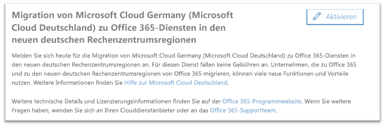
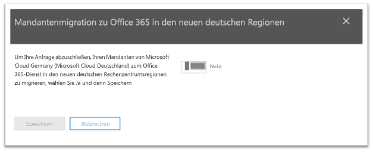
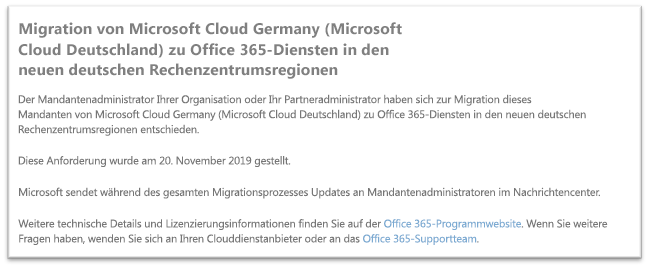

# Anmelden für die Migration von Microsoft Cloud Germany (Microsoft Cloud Deutschland) zu Office 365-Diensten in den neuen deutschen Rechenzentrumsregionen

>[!Note]
>Dieser Artikel gilt nur für Kunden mit Daten in der Microsoft Cloud Germany/Deutschland.
>

## So fordern Sie die Migration an

Für berechtigte Kunden welche Dienste in Microsoft Cloud Germany nutzen bzw. bereitgestellt haben, wird eine Seite im Microsoft 365 Admin Center angezeigt, über die sich der Administator des Mandanten/Tenant des Kunden für die Migration anmelden kann.

Um auf die Seite im Microsoft 365 Admin Center zuzugreifen, erweitern Sie im Navigationsbereich auf der linken Seite **Einstellungen**, und klicken Sie dann auf **Organisationsprofil**.

Scrollen Sie auf der Seite **Organisationsprofil** nach unten zum Abschnitt **Migration von Microsoft Cloud Germany (Microsoft Cloud Deutschland) zu Office 365-Diensten in den neuen deutschen Rechenzentrumsregionen**.

Wenn Ihre Organisation Ihren Dienst von Microsoft Cloud Germany (Microsoft Cloud Deutschland) zu Office 365-Diensten in den neuen deutschen Rechenzentrumsregionen migrieren möchte, klicken Sie auf **Anmelden**.
 

Auf der rechten Seite des Bildschirms wird ein neuer Abschnitt angezeigt, in dem Sie Ihre Aktivierung bestätigen können. Wechseln Sie die Umschaltfläche auf **Ja**, und klicken Sie dann auf **Speichern**.
 

Sobald ein Administrator im Namen Ihres Mandanten die Aktivierung vorgenommen hat, wird die Bestätigung im Abschnitt **Migration von Microsoft Cloud Germany (Microsoft Cloud Deutschland) zu Office 365-Diensten in den neuen deutschen Rechenzentrumsregionen** (einschließlich des Datums der Anmeldung) angezeigt. Administratoren erhalten außerdem eine Bestätigung im Nachrichtencenter des Microsoft 365 Admin Centers. 
 

## Was geschieht, nachdem ich die Migration aktiviert habe?

Die Migrationen von Kunden die sich für die Migration durch Microsoft angemeldet haben (Anmeldung wie oben beschrieben), werden voraussichtlich in 2020 durchgeführt.  Als Ergebnis der Migration werden die wichtigsten Kundendaten und -abonnements in die neuen deutschen Regionen verschoben.  Microsoft sendet während des gesamten Migrationsprozesses Updates im Nachrichtencenter.

## Weitere Informationen

- [Hilfe zur Microsoft Cloud Deutschland-Migration Assistance](https://aka.ms/germanymigrateassist)
- [Office 365-Migrationsprogramm für Kunden von Microsoft Cloud Deutschland](https://aka.ms/office365germanymove)
- [Dynamics 365-Migrationsprogramm für Kunden von Microsoft Cloud Deutschland](https://aka.ms/d365ceoptin)
- [Power BI-Migrationsprogramm für Kunden von Microsoft Cloud Deutschland](https://aka.ms/pbioptin)
- Übermitteln Sie uns Ihre Fragen über den Link "Benötigen Sie Hilfe?" im [Microsoft 365 Admin Center](https://portal.office.de/).
