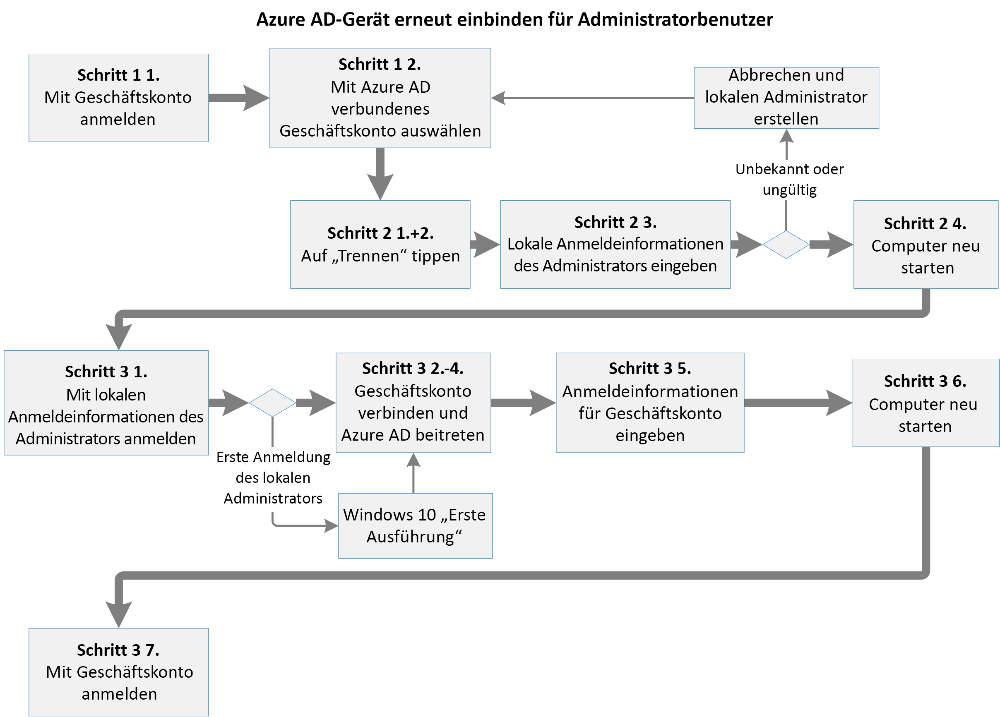
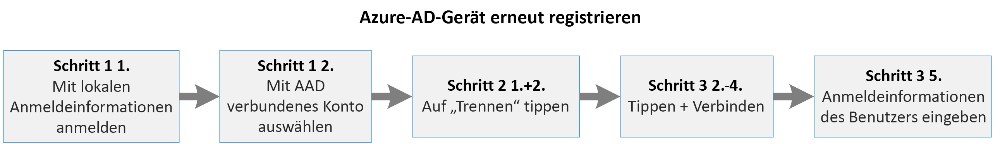

# <a name="additional-device-information-for-the-migration-from-microsoft-cloud-deutschland"></a><span data-ttu-id="7c6b0-103">Zusätzliche Geräteinformationen für die Migration von Microsoft Cloud Deutschland</span><span class="sxs-lookup"><span data-stu-id="7c6b0-103">Additional device information for the migration from Microsoft Cloud Deutschland</span></span>

<span data-ttu-id="7c6b0-104">In Azure AD eingebundene und registrierte Geräte, die mit Microsoft Cloud Deutschland verbunden sind, müssen nach Phase 9 und vor Phase 10 migriert werden.</span><span class="sxs-lookup"><span data-stu-id="7c6b0-104">Azure AD joined and registered devices connected to Microsoft Cloud Deutschland must be migrated after phase 9 and before phase 10.</span></span> <span data-ttu-id="7c6b0-105">Die Migration eines Geräts hängt vom Gerätetyp, dem Betriebssystem und der Azure AD-Beziehung ab.</span><span class="sxs-lookup"><span data-stu-id="7c6b0-105">The migration of a device depends on the devices type, operating system and Azure AD relation.</span></span> 

## <a name="azure-ad-joined-windows-10-devices"></a><span data-ttu-id="7c6b0-106">In Azure AD eingebundene Windows 10-Geräte</span><span class="sxs-lookup"><span data-stu-id="7c6b0-106">Azure AD Joined Windows 10 devices</span></span>
<span data-ttu-id="7c6b0-107">Wenn ein Windows 10-Gerät in Azure AD eingebunden ist, muss es von Azure AD getrennt und erneut verbunden werden.</span><span class="sxs-lookup"><span data-stu-id="7c6b0-107">If a Windows 10 device is Azure AD joined, it must be disconnected from Azure AD and must be connected again.</span></span> 

<span data-ttu-id="7c6b0-108">[  ](../media/ms-cloud-germany-migration-opt-in/AAD-ReJoin-flow.png#lightbox)</span><span class="sxs-lookup"><span data-stu-id="7c6b0-108">[  ](../media/ms-cloud-germany-migration-opt-in/AAD-ReJoin-flow.png#lightbox)</span></span>


<span data-ttu-id="7c6b0-109">Administratoren von Windows 10-Geräten, können die Registrierung des Geräts in Azure AD aufheben und es in drei Schritten erneut einbinden.</span><span class="sxs-lookup"><span data-stu-id="7c6b0-109">If the user is an administrator on the Windows 10 device, the user can unregister the device from Azure AD and re-join it again in three steps.</span></span> 

### <a name="step-1-determine-if-the-device-is-azure-id-joined"></a><span data-ttu-id="7c6b0-110">Schritt 1: Ermitteln, ob das Gerät mit einer Azure-ID eingebunden ist</span><span class="sxs-lookup"><span data-stu-id="7c6b0-110">Step 1: Determine if the device is Azure ID joined</span></span>
1.  <span data-ttu-id="7c6b0-111">Melden Sie sich mit Ihrem Geschäftskonto an.</span><span class="sxs-lookup"><span data-stu-id="7c6b0-111">Sign in with your work account.</span></span>
2.  <span data-ttu-id="7c6b0-112">Wechseln Sie zu **Einstellungen** > **Konten** > **Auf Geschäfts- oder Schulkonto zugreifen**.</span><span class="sxs-lookup"><span data-stu-id="7c6b0-112">Go to **Settings** > **Accounts** > **Access Work Or School**.</span></span> 
3.  <span data-ttu-id="7c6b0-113">Suchen Sie in der Liste nach einem Konto, dass **mit [...] Azure AD verbunden** ist.</span><span class="sxs-lookup"><span data-stu-id="7c6b0-113">Look for an account in the list with **connected to […]‘s Azure AD**.</span></span> 
4.  <span data-ttu-id="7c6b0-114">Wenn ein verbundenes Konto vorhanden ist, fahren Sie mit Schritt 2 fort.</span><span class="sxs-lookup"><span data-stu-id="7c6b0-114">If a connected account exists, proceed with Step 2.</span></span> 
### <a name="step-2-disconnect-the-device-from-azure-ad"></a><span data-ttu-id="7c6b0-115">Schritt 2: Das Gerät von Azure AD trennen</span><span class="sxs-lookup"><span data-stu-id="7c6b0-115">Step 2: Disconnect the device from Azure AD</span></span>
1.  <span data-ttu-id="7c6b0-116">Klicken Sie auf **Trennen** im verbundenen Arbeits- oder Schulkonto.</span><span class="sxs-lookup"><span data-stu-id="7c6b0-116">Click **Disconnect** on the connected work or School Account.</span></span> 
2.  <span data-ttu-id="7c6b0-117">Bestätigen Sie die Trennung zweimal.</span><span class="sxs-lookup"><span data-stu-id="7c6b0-117">Confirm the disconnect twice.</span></span> 
3.  <span data-ttu-id="7c6b0-118">Geben Sie den Benutzernamen und das Kennwort für einen lokalen Administratoren ein.</span><span class="sxs-lookup"><span data-stu-id="7c6b0-118">Enter a local administrator username and password.</span></span> <span data-ttu-id="7c6b0-119">Die Verbindung mit dem Gerät wurde getrennt.</span><span class="sxs-lookup"><span data-stu-id="7c6b0-119">The device is disconnected.</span></span>
4.  <span data-ttu-id="7c6b0-120">Starten Sie das Gerät neu.</span><span class="sxs-lookup"><span data-stu-id="7c6b0-120">Restart the device.</span></span>
### <a name="step-3-join-the-device-to-azure-ad"></a><span data-ttu-id="7c6b0-121">Schritt 3: Das Gerät in Azure AD einbinden</span><span class="sxs-lookup"><span data-stu-id="7c6b0-121">Step 3: Join the device to Azure AD</span></span>
1.  <span data-ttu-id="7c6b0-122">Melden Sie sich mit den Anmeldeinformationen für das lokale Administratorkonto an.</span><span class="sxs-lookup"><span data-stu-id="7c6b0-122">Sign in with the credentials of the local administrator.</span></span>
2.  <span data-ttu-id="7c6b0-123">Wechseln Sie zu **Einstellungen** > **Konten** > **Auf Geschäfts- oder Schulkonto zugreifen**.</span><span class="sxs-lookup"><span data-stu-id="7c6b0-123">Go to **Settings** > **Accounts** > **Access Work Or School**.</span></span>
3.  <span data-ttu-id="7c6b0-124">Klicken Sie auf **Verbinden**.</span><span class="sxs-lookup"><span data-stu-id="7c6b0-124">Click **Connect**.</span></span>
4.  <span data-ttu-id="7c6b0-125">**WICHTIG**: Klicken Sie auf **In Azure AD einbinden**.</span><span class="sxs-lookup"><span data-stu-id="7c6b0-125">**IMPORTANT**: Click **Join to Azure AD**.</span></span>
5.  <span data-ttu-id="7c6b0-126">Geben Sie die E-Mail-Adresse und das Kennwort Ihres Geschäftskontos ein.</span><span class="sxs-lookup"><span data-stu-id="7c6b0-126">Enter the e-mail address and password of your work account.</span></span> <span data-ttu-id="7c6b0-127">Das Gerät ist verbunden.</span><span class="sxs-lookup"><span data-stu-id="7c6b0-127">The device is connected.</span></span>
6.  <span data-ttu-id="7c6b0-128">Starten Sie das Gerät neu.</span><span class="sxs-lookup"><span data-stu-id="7c6b0-128">Restart the device.</span></span>
7.  <span data-ttu-id="7c6b0-129">Melden Sie sich mit der E-Mail-Adresse und dem Kennwort Ihres Geschäftskontos an.</span><span class="sxs-lookup"><span data-stu-id="7c6b0-129">Sign in with the email address and password of your work account.</span></span>

<span data-ttu-id="7c6b0-130">Wenn der Benutzer kein Administrator des Geräts ist, kann ein globaler Azure AD-Administrator das lokale Administratorkonto auf dem Gerät mithilfe dieses Konfigurationspfads erstellen und die Verbindung mit dem Gerät trennen:</span><span class="sxs-lookup"><span data-stu-id="7c6b0-130">If the user is not an administrator of the device, an Azure AD global administrator can create the local administrator account on the device following this configuration path and unjoin the device:</span></span>

<span data-ttu-id="7c6b0-131">*Einstellungen > Konten > Andere Konten > Anmeldeinformationen unbekannt > Benutzer ohne Microsoft-Konto hinzufügen*</span><span class="sxs-lookup"><span data-stu-id="7c6b0-131">*Settings > Accounts > Other Accounts > Credentials unknown > Add user without Microsoft-Account*</span></span>

<span data-ttu-id="7c6b0-132">Für die Wiedereinbindung können in diesem Schritt die Anmeldeinformationen aller Geschäftskonten Ihrer Organisation verwendet werden.</span><span class="sxs-lookup"><span data-stu-id="7c6b0-132">For re-joining, the credentials of any work account from your organization can be used in this step.</span></span> 

<span data-ttu-id="7c6b0-133">Bitte beachten Sie, dass das für die Einbindung des Geräts verwendete Geschäftskonto automatisch als Administrator des Geräts eingestuft wird.</span><span class="sxs-lookup"><span data-stu-id="7c6b0-133">Please consider that the work account used to join the device will be automatically promoted as an Administrator of the device.</span></span>
<span data-ttu-id="7c6b0-134">Jedes andere Geschäftskonto der Organisation kann sich im Gerät anmelden, hat aber keine Administratorrechte.</span><span class="sxs-lookup"><span data-stu-id="7c6b0-134">Any other work account from the organization can sign in to the device, but has no administrator privileges.</span></span>

## <a name="azure-ad-registered-workplace-joined-windows-10-devices"></a><span data-ttu-id="7c6b0-135">In Azure AD registrierte (in den Arbeitsplatz eingebunden) Windows 10-Geräte</span><span class="sxs-lookup"><span data-stu-id="7c6b0-135">Azure AD registered (workplace-joined) Windows 10 devices</span></span>
<span data-ttu-id="7c6b0-136">Wenn ein Windows 10-Gerät in Azure AD registriert ist, muss es von Azure AD getrennt und erneut verbunden werden.</span><span class="sxs-lookup"><span data-stu-id="7c6b0-136">If a Windows 10 device is Azure AD registered, it needs to be disconnected from the Azure AD and connected again.</span></span>

<span data-ttu-id="7c6b0-137">[  ](../media/ms-cloud-germany-migration-opt-in/AAD-ReJoin-flow.png#lightbox)</span><span class="sxs-lookup"><span data-stu-id="7c6b0-137">[  ](../media/ms-cloud-germany-migration-opt-in/AAD-ReJoin-flow.png#lightbox)</span></span>

### <a name="step-1-determine-if-the-device-is-azure-id-registered"></a><span data-ttu-id="7c6b0-138">Schritt 1: Ermitteln, ob das Gerät mit einer Azure-ID registriert ist</span><span class="sxs-lookup"><span data-stu-id="7c6b0-138">Step 1: Determine if the device is Azure ID registered</span></span>
1.  <span data-ttu-id="7c6b0-139">Melden Sie sich mit Ihrem Benutzernamen und Kennwort an.</span><span class="sxs-lookup"><span data-stu-id="7c6b0-139">Sign in with your user.</span></span>
2.  <span data-ttu-id="7c6b0-140">Wechseln Sie zu **Einstellungen** > **Konten** > **Auf Geschäfts- oder Schulkonto zugreifen**.</span><span class="sxs-lookup"><span data-stu-id="7c6b0-140">Go to **Settings** > **Accounts** > **Access Work Or School**.</span></span> 
3.  <span data-ttu-id="7c6b0-141">Suchen Sie in der Liste nach Ihrem Geschäftskonto und überprüfen Sie, ob es **mit [...] Azure AD verbunden** ist.</span><span class="sxs-lookup"><span data-stu-id="7c6b0-141">Discover your work account in the list and check if it is **connected to […]‘s Azure AD**.</span></span>

    <span data-ttu-id="7c6b0-142">Wenn Ihr Geschäftsskonto in der Liste aufgeführt ist, aber NICHT mit Azure AD verbunden ist, fahren Sie mit Schritt 2 fort.</span><span class="sxs-lookup"><span data-stu-id="7c6b0-142">If your work account is in the list but NOT connected to an Azure AD, proceed with step 2.</span></span>

    <span data-ttu-id="7c6b0-143">Andernfalls handelt es sich bei Ihrem Gerät um ein in Azure AD eingebundenes Gerät und Sie müssen den Informationen unter [In Azure AD eingebundene Windows 10-Geräte](#azure-ad-joined-windows-10-devices) folgen.</span><span class="sxs-lookup"><span data-stu-id="7c6b0-143">Otherwise, your device is an Azure AD joined device and you have to refer to [Azure AD Joined Windows 10 devices](#azure-ad-joined-windows-10-devices).</span></span>

### <a name="step-2-disconnect-the-device-from-azure-ad"></a><span data-ttu-id="7c6b0-144">Schritt 2: Das Gerät von Azure AD trennen</span><span class="sxs-lookup"><span data-stu-id="7c6b0-144">Step 2: Disconnect the device from Azure AD</span></span>
1.  <span data-ttu-id="7c6b0-145">Klicken Sie auf Ihr Geschäftskonto.</span><span class="sxs-lookup"><span data-stu-id="7c6b0-145">Click on your work account.</span></span> <span data-ttu-id="7c6b0-146">Die Schaltflächen *Info* und *Trennen* werden angezeigt.</span><span class="sxs-lookup"><span data-stu-id="7c6b0-146">The buttons *Info* and *Disconnect* appear.</span></span>
2.  <span data-ttu-id="7c6b0-147">Klicken Sie auf **Trennen**.</span><span class="sxs-lookup"><span data-stu-id="7c6b0-147">Click **Disconnect**.</span></span> 
3.  <span data-ttu-id="7c6b0-148">Bestätigen Sie das Entfernen des Kontos auf dem Gerät, indem Sie auf **Ja** klicken.</span><span class="sxs-lookup"><span data-stu-id="7c6b0-148">Confirm account removal from the device by clicking **Yes**.</span></span>
### <a name="step-3-connect-the-device-to-azure-ad"></a><span data-ttu-id="7c6b0-149">Schritt 3: Das Gerät mit Azure AD verbinden</span><span class="sxs-lookup"><span data-stu-id="7c6b0-149">Step 3: Connect the device to Azure AD</span></span>
1.  <span data-ttu-id="7c6b0-150">Klicken Sie auf **Verbinden**.</span><span class="sxs-lookup"><span data-stu-id="7c6b0-150">Click **Connect**.</span></span>
2.  <span data-ttu-id="7c6b0-151">Geben Sie die E-Mail-Adresse Ihres Geschäftskontos ein und klicken Sie auf **Weiter**.</span><span class="sxs-lookup"><span data-stu-id="7c6b0-151">Enter the email address of your work account and click **Next**.</span></span>
3.  <span data-ttu-id="7c6b0-152">Geben Sie das Kennwort Ihres Geschäftskontos ein und klicken Sie auf **Anmelden**.</span><span class="sxs-lookup"><span data-stu-id="7c6b0-152">Enter the password of your work account and click **Sign in**.</span></span>
4.  <span data-ttu-id="7c6b0-153">Bestätigen Sie, indem Sie auf **Fertig** klicken.</span><span class="sxs-lookup"><span data-stu-id="7c6b0-153">Confirm by clicking **Done**.</span></span> <span data-ttu-id="7c6b0-154">Ihr Geschäftskonto wird erneut aufgeführt.</span><span class="sxs-lookup"><span data-stu-id="7c6b0-154">Your work account is listed again.</span></span>

## <a name="android"></a><span data-ttu-id="7c6b0-155">Android</span><span class="sxs-lookup"><span data-stu-id="7c6b0-155">Android</span></span>

<span data-ttu-id="7c6b0-156">Für Android müssen Benutzer ihre Geräte abmelden und wieder registrieren.</span><span class="sxs-lookup"><span data-stu-id="7c6b0-156">For Android, users will need to unregister and re-register their devices.</span></span> <span data-ttu-id="7c6b0-157">Dies kann mit der Microsoft Authenticator-App oder der Unternehmensportal-App geschehen.</span><span class="sxs-lookup"><span data-stu-id="7c6b0-157">This can be done via the Microsoft Authenticator app or the Company Portal app.</span></span> 

- <span data-ttu-id="7c6b0-158">Aus der Microsoft Authenticator-App können die Benutzer zu **Einstellungen > Geräteregistrierung** gehen.</span><span class="sxs-lookup"><span data-stu-id="7c6b0-158">From the Microsoft Authenticator app, users can go to **Settings > Device Registration**.</span></span> <span data-ttu-id="7c6b0-159">Von dort aus können die Benutzer ihre Geräte abmelden und wieder registrieren.</span><span class="sxs-lookup"><span data-stu-id="7c6b0-159">From there users can unregister and re-register their device.</span></span>
 
- <span data-ttu-id="7c6b0-160">Aus dem Unternehmensportal können die Benutzer zu Registerkarte **Geräte** gehen und das Gerät entfernen.</span><span class="sxs-lookup"><span data-stu-id="7c6b0-160">From the Company Portal, users can go to **Devices** tab and remove the device.</span></span> <span data-ttu-id="7c6b0-161">Danach registrieren Sie das Gerät erneut über das Unternehmensportal.</span><span class="sxs-lookup"><span data-stu-id="7c6b0-161">After that, re-enroll the device by using Company Portal.</span></span>
 
- <span data-ttu-id="7c6b0-162">Benutzer können das Gerät auch abmelden und wieder registrieren, indem Sie das Konto von der Seite „Kontoeinstellungen“ entfernen und dann das Geschäftskonto wieder hinzufügen.</span><span class="sxs-lookup"><span data-stu-id="7c6b0-162">Users can also unregister and re-register by removing the account from the account settings page and then re-adding the work account.</span></span>

<span data-ttu-id="7c6b0-163">Um das Gerät mit der Microsoft Authenticator-App auf Android abzumelden und wieder zu registrieren:</span><span class="sxs-lookup"><span data-stu-id="7c6b0-163">To unregister and re-register the device on Android by using the Microsoft Authenticator app:</span></span>

1.  <span data-ttu-id="7c6b0-164">Öffnen Sie die Microsoft Authenticator-App und gehen Sie zu **Einstellungen**.</span><span class="sxs-lookup"><span data-stu-id="7c6b0-164">Open the Microsoft Authenticator app and go to **Settings**.</span></span>
2.  <span data-ttu-id="7c6b0-165">Wählen Sie **Geräteregistrierung**.</span><span class="sxs-lookup"><span data-stu-id="7c6b0-165">Select **Device registration**.</span></span>
3.  <span data-ttu-id="7c6b0-166">Melden Sie das Gerät ab, indem Sie **Registrierung aufheben** auswählen.</span><span class="sxs-lookup"><span data-stu-id="7c6b0-166">Unregister the device by selecting **Unregister**.</span></span>
4.  <span data-ttu-id="7c6b0-167">Für die **Geräteregistrierung** registrieren Sie das Gerät erneut, indem Sie Ihre E-Mail-Adresse eingeben und **Registrieren** auswählen.</span><span class="sxs-lookup"><span data-stu-id="7c6b0-167">For **Device registration**, re-register the device by typing your email address, and then select **Register**.</span></span>

<span data-ttu-id="7c6b0-168">Um ein Android-Gerät mit der Seite für Android-Einstellungen abzumelden und wieder zu registrieren:</span><span class="sxs-lookup"><span data-stu-id="7c6b0-168">To unregister and re-register an Android device with the Android Settings page:</span></span>

1.  <span data-ttu-id="7c6b0-169">Öffnen Sie **Geräteeinstellungen** und gehen sie zu **Konten**.</span><span class="sxs-lookup"><span data-stu-id="7c6b0-169">Open **Device Settings** and go to **Accounts**.</span></span>
2.  <span data-ttu-id="7c6b0-170">Wählen das Geschäftskonto aus, das Sie wieder registrieren wollen und wählen Sie **Konto entfernen**.</span><span class="sxs-lookup"><span data-stu-id="7c6b0-170">Select the work account that you want to re-register and select **Remove account**.</span></span>
3.  <span data-ttu-id="7c6b0-171">Nachdem das Konto entfernt wurde, wählen Sie von der **Konto**-Seite aus **Konto hinzufügen > Geschäftskonto**.</span><span class="sxs-lookup"><span data-stu-id="7c6b0-171">After the account is removed, from the **Accounts** page, select **Add Account > Work account**.</span></span>
4.  <span data-ttu-id="7c6b0-172">Für die **Arbeitsplatz-Verknüpfung** geben Sie Ihre E-Mail-Adresse ein und wählen Sie **Verknüpfung**, um die Registrierung des Geräts abzuschließen.</span><span class="sxs-lookup"><span data-stu-id="7c6b0-172">For **Workplace Join**, type your email address and select **Join** to complete registering the device.</span></span>

<span data-ttu-id="7c6b0-173">Um das Gerät auf Android über das Unternehmensportal abzumelden und neu zu registrieren:</span><span class="sxs-lookup"><span data-stu-id="7c6b0-173">To unregister and re-register the device on Android from Company Portal:</span></span>

1.  <span data-ttu-id="7c6b0-174">Starten Sie das Unternehmensportal und gehen Sie zur Registerkarte **Geräte**.</span><span class="sxs-lookup"><span data-stu-id="7c6b0-174">Launch Company Portal and go to **Devices** tab.</span></span>
2.  <span data-ttu-id="7c6b0-175">Wählen Sie das Gerät aus, um die Gerätedetails zu sehen.</span><span class="sxs-lookup"><span data-stu-id="7c6b0-175">Select the device to see the device details.</span></span>
3.  <span data-ttu-id="7c6b0-176">Aus dem Ellipsen-Menü (drei Punkte) wählen Sie **Gerät entfernen** und schließen das Entfernen ab, indem Sie dies im Dialogfeld bestätigen.</span><span class="sxs-lookup"><span data-stu-id="7c6b0-176">From the ellipses (three dots) menu, select **Remove Device**, and complete the removal by confirming in the dialog.</span></span>
4.  <span data-ttu-id="7c6b0-177">Sie sollten jetzt von der Unternehmensportal-App abgemeldet sein.</span><span class="sxs-lookup"><span data-stu-id="7c6b0-177">You should now be logged out of the Company Portal app.</span></span> <span data-ttu-id="7c6b0-178">Wählen Sie **Anmelden**, um das Gerät wieder zu registrieren.</span><span class="sxs-lookup"><span data-stu-id="7c6b0-178">Select **Sign in** to re-register the device.</span></span>

<span data-ttu-id="7c6b0-179">Weitere Informationen zu Aktionen, die während der Migrationsphase dieses Workloads erforderlich sind, oder zu Auswirkungen auf die Verwaltung oder Verwendung finden Sie in den Informationen zu Azure Active Directory (Azure AD) unter [Zusätzliche Azure AD-Informationen für die Migration von Microsoft Cloud Deutschland](ms-cloud-germany-transition-azure-ad.md).</span><span class="sxs-lookup"><span data-stu-id="7c6b0-179">For more information about any actions required during the migration phase of this workload, or impact to administration or usage, review the information about Azure Active Directory (Azure AD) in [Additional Azure AD information for the migration from Microsoft Cloud Deutschland](ms-cloud-germany-transition-azure-ad.md).</span></span>

## <a name="ios"></a><span data-ttu-id="7c6b0-180">iOS</span><span class="sxs-lookup"><span data-stu-id="7c6b0-180">iOS</span></span>

<span data-ttu-id="7c6b0-181">Auf iOS-Geräten muss ein Benutzer alle zwischengespeicherten Konten manuell aus dem Microsoft Authenticator entfernen, die Registrierung des Geräts aufheben und sich von allen nativen Apps auf dem Gerät abmelden.</span><span class="sxs-lookup"><span data-stu-id="7c6b0-181">On iOS devices, a user will need to manually remove any cached accounts from the Microsoft Authenticator, unregister the device, and sign out from any native apps on the device.</span></span>

### <a name="step-1-if-present-remove-the-account-from-the-microsoft-authenticator-app"></a><span data-ttu-id="7c6b0-182">Schritt 1: Wenn vorhanden, entfernen Sie das Konto aus der Microsoft Authenticator-App</span><span class="sxs-lookup"><span data-stu-id="7c6b0-182">Step 1: If present, remove the account from the Microsoft Authenticator app</span></span>

1. <span data-ttu-id="7c6b0-183">Tippen Sie auf des Konto in der Microsoft Authenticator-App.</span><span class="sxs-lookup"><span data-stu-id="7c6b0-183">Tap the account in the Microsoft Authenticator app.</span></span>
2. <span data-ttu-id="7c6b0-184">Tippen Sie auf das Symbol **Einstellungen** in der oberen rechten Ecke. </span><span class="sxs-lookup"><span data-stu-id="7c6b0-184">Tap the **Settings** icon in the top-right corner.</span></span> <span data-ttu-id="7c6b0-185">Wenn Sie das Symbol **Einstellungen** nicht sehen, verwenden Sie möglicherweise nicht die aktuelle Version des Microsoft Authenticator.</span><span class="sxs-lookup"><span data-stu-id="7c6b0-185">If you don't see the **Settings** icon, you might not be using the latest version of Microsoft Authenticator.</span></span>
3. <span data-ttu-id="7c6b0-186">Tippen Sie die Schaltfläche **Konto entfernen**.</span><span class="sxs-lookup"><span data-stu-id="7c6b0-186">Tap the **Remove account** button.</span></span>
4. <span data-ttu-id="7c6b0-187">Tippen Sie auf **Alle Apps auf diesem Gerät**.</span><span class="sxs-lookup"><span data-stu-id="7c6b0-187">Tap **All apps on this device**.</span></span>
 
### <a name="step-2-unregister-the-device-from-the-microsoft-authenticator-app"></a><span data-ttu-id="7c6b0-188">Schritt 2: Registrierung des Geräts in der Microsoft Authenticator-App aufheben</span><span class="sxs-lookup"><span data-stu-id="7c6b0-188">Step 2: Unregister the device from the Microsoft Authenticator app</span></span>

1. <span data-ttu-id="7c6b0-189">Tippen Sie auf das Menu-Symbol in der oberen rechten Ecke. </span><span class="sxs-lookup"><span data-stu-id="7c6b0-189">Tap the menu icon in the top-right corner.</span></span>
2. <span data-ttu-id="7c6b0-190">Tippen Sie **Einstellungen** und dann **Geräteregistrierung**.</span><span class="sxs-lookup"><span data-stu-id="7c6b0-190">Tap **Settings** and then **Device Registration**.</span></span>
4. <span data-ttu-id="7c6b0-191">Wenn Ihr Konto angezeigt wird, tippen Sie im Dialog auf **Registrierung des Geräts aufheben** und **Weiter**.</span><span class="sxs-lookup"><span data-stu-id="7c6b0-191">If your account is shown, tap **Unregister device** and **Continue** in the dialog.</span></span> <span data-ttu-id="7c6b0-192">Sie sollten danach kein Konto mehr sehen.</span><span class="sxs-lookup"><span data-stu-id="7c6b0-192">You should see no account after that.</span></span>
 
### <a name="step-3-sign-out-from-individual-apps-if-necessary"></a><span data-ttu-id="7c6b0-193">Schritt 3: Abmelden aus individuellen Apps wenn notwendig.</span><span class="sxs-lookup"><span data-stu-id="7c6b0-193">Step 3: Sign out from individual apps if necessary</span></span>

<span data-ttu-id="7c6b0-194">Benutzer können zu individuellen Apps wie Outlook, Teams oder OneDrive wechseln und Konten aus diese Apps entfernen.</span><span class="sxs-lookup"><span data-stu-id="7c6b0-194">Users can go to individual apps like Outlook, Teams, and OneDrive, and remove accounts from those apps.</span></span>

## <a name="frequently-asked-questions"></a><span data-ttu-id="7c6b0-195">Häufig gestellte Fragen</span><span class="sxs-lookup"><span data-stu-id="7c6b0-195">Frequently asked questions</span></span>

<span data-ttu-id="7c6b0-196">**Wie kann ich feststellen, ob meine Organisation betroffen ist?**</span><span class="sxs-lookup"><span data-stu-id="7c6b0-196">**How can I tell if my organization is affected?**</span></span>

<span data-ttu-id="7c6b0-197">Administratoren sollten überprüfen, `https://portal.microsoftazure.de` ob Geräte vorhanden sind, die in Azure AD registriert oder eingebunden sind.</span><span class="sxs-lookup"><span data-stu-id="7c6b0-197">Administrators should check `https://portal.microsoftazure.de` to determine if they have any Azure AD registered or Azure AD joined devices.</span></span> <span data-ttu-id="7c6b0-198">Wenn Geräte Ihrer Organisation in Azure AD registriert oder eingebunden sind, muss Ihre Organisation die Anweisungen auf dieser Seite befolgen.</span><span class="sxs-lookup"><span data-stu-id="7c6b0-198">If your organization has Azure AD registered or Azure AD joined devices, your organization has to follow the instructions on this page.</span></span>

<span data-ttu-id="7c6b0-199">**Wann müssen die Benutzer ihre Geräte wieder registrieren?**</span><span class="sxs-lookup"><span data-stu-id="7c6b0-199">**When do my users re-register their devices?**</span></span>

<span data-ttu-id="7c6b0-200">Es ist wichtig für Ihren Erfolg, dass Sie die Registrierung Ihrer Geräte erst aufheben und wiederholen, nachdem [Phase 9](ms-cloud-germany-transition-phases.md#phase-9--10-azure-ad-finalization) abgeschlossen ist.</span><span class="sxs-lookup"><span data-stu-id="7c6b0-200">It's critical to your success that you only unregister and re-register your devices after [phase 9](ms-cloud-germany-transition-phases.md#phase-9--10-azure-ad-finalization) has been completed.</span></span> <span data-ttu-id="7c6b0-201">Sie müssen die erneute Registrierung abgeschlossen haben, bevor Phase 10 beginnt. Andernfalls könnten Sie den Zugriff auf Ihr Gerät verlieren.</span><span class="sxs-lookup"><span data-stu-id="7c6b0-201">You must finish the re-registration before phase 10 starts, otherwise you could lose access to your device.</span></span>

<span data-ttu-id="7c6b0-202">**Wie stelle ich fest, ob alle meine Geräte in der Public Cloud registriert sind?**</span><span class="sxs-lookup"><span data-stu-id="7c6b0-202">**How do I know that all my devices are registered in the public cloud?**</span></span>

<span data-ttu-id="7c6b0-203">Um zu prüfen, ob Ihre Geräte in der Public Cloud registriert sind, sollten Sie die Liste der Geräte aus dem Azure AD-Portal in eine Excel-Tabelle exportieren und herunterladen.</span><span class="sxs-lookup"><span data-stu-id="7c6b0-203">To check whether your devices are registered in the public cloud, you should export and download the list of devices from the Azure AD portal to an Excel spreadsheet.</span></span> <span data-ttu-id="7c6b0-204">Filtern Sie anschließend die registrierten Geräte (verwenden Sie die Spalte _registeredTime_) nach dem Datum, an dem Ihre Organisation [Phase 9 des Migrationsprozesses](ms-cloud-germany-transition-phases.md#phase-9--10-azure-ad-finalization) abgeschlossen hat.</span><span class="sxs-lookup"><span data-stu-id="7c6b0-204">Then, filter the devices that are registered (by using the _registeredTime_ column) after the date when your organization has passed [phase 9 of the migration process](ms-cloud-germany-transition-phases.md#phase-9--10-azure-ad-finalization).</span></span>

## <a name="additional-considerations"></a><span data-ttu-id="7c6b0-205">Zusätzliche Überlegungen</span><span class="sxs-lookup"><span data-stu-id="7c6b0-205">Additional considerations</span></span>

> [!IMPORTANT]
> <span data-ttu-id="7c6b0-206">Der Intune-Dienstprinzipal wird nach [Phase 3 des Migrationsprozesses](ms-cloud-germany-transition-phases.md#phase-3-subscription-transfer) aktiviert, was die Aktivierung der Azure AD Device Registration impliziert.</span><span class="sxs-lookup"><span data-stu-id="7c6b0-206">The Intune service principal will be enabled after [phase 3 of the migration process](ms-cloud-germany-transition-phases.md#phase-3-subscription-transfer), which implies the activation of Azure AD Device Registration.</span></span> <span data-ttu-id="7c6b0-207">Wenn Sie Azure AD Device Registration vor der Migration blockiert haben, müssen Sie den Intune-Dienstprinzipal mit PowerShell deaktivieren, um die Azure AD-Geräteregistrierung mit dem Azure AD-Portal erneut zu deaktivieren.</span><span class="sxs-lookup"><span data-stu-id="7c6b0-207">If you blocked Azure AD Device Registration before migration, you must disable the Intune service principal with PowerShell to disable Azure AD Device Registration with the Azure AD portal again.</span></span> <span data-ttu-id="7c6b0-208">Sie können den Intune-Dienstprinzipal mit diesem Befehl im Azure Active Directory PowerShell für Graph-Modul deaktivieren.</span><span class="sxs-lookup"><span data-stu-id="7c6b0-208">You can disable the Intune service principal with this command in the Azure Active Directory PowerShell for Graph module.</span></span>

```powershell
Get-AzureADServicePrincipal -All:$true |Where-object -Property AppId -eq "0000000a-0000-0000-c000-000000000000" | Set-AzureADServicePrincipal -AccountEnabled:$false
```

## <a name="more-information"></a><span data-ttu-id="7c6b0-209">Weitere Informationen</span><span class="sxs-lookup"><span data-stu-id="7c6b0-209">More information</span></span>

<span data-ttu-id="7c6b0-210">Erste Schritte:</span><span class="sxs-lookup"><span data-stu-id="7c6b0-210">Getting started:</span></span>

- [<span data-ttu-id="7c6b0-211">Migration von Microsoft Cloud Deutschland zu Office 365-Diensten in den neuen deutschen Rechenzentrumsregionen</span><span class="sxs-lookup"><span data-stu-id="7c6b0-211">Migration from Microsoft Cloud Deutschland to Office 365 services in the new German datacenter regions</span></span>](ms-cloud-germany-transition.md)
- [<span data-ttu-id="7c6b0-212">Hilfe zur Microsoft Cloud Deutschland-Migration Assistance</span><span class="sxs-lookup"><span data-stu-id="7c6b0-212">Microsoft Cloud Deutschland Migration Assistance</span></span>](https://aka.ms/germanymigrateassist)
- [<span data-ttu-id="7c6b0-213">So können Sie sich für die Migration anmelden</span><span class="sxs-lookup"><span data-stu-id="7c6b0-213">How to opt-in for migration</span></span>](ms-cloud-germany-migration-opt-in.md)
- [<span data-ttu-id="7c6b0-214">Kundenerfahrung während der Migration</span><span class="sxs-lookup"><span data-stu-id="7c6b0-214">Customer experience during the migration</span></span>](ms-cloud-germany-transition-experience.md)

<span data-ttu-id="7c6b0-215">Der Weg durch die Umstellung:</span><span class="sxs-lookup"><span data-stu-id="7c6b0-215">Moving through the transition:</span></span>

- [<span data-ttu-id="7c6b0-216">Phasen, Aktionen und Auswirkungen der Migration</span><span class="sxs-lookup"><span data-stu-id="7c6b0-216">Migration phases actions and impacts</span></span>](ms-cloud-germany-transition-phases.md)
- [<span data-ttu-id="7c6b0-217">Zusätzliche Vorarbeit</span><span class="sxs-lookup"><span data-stu-id="7c6b0-217">Additional pre-work</span></span>](ms-cloud-germany-transition-add-pre-work.md)
- <span data-ttu-id="7c6b0-218">Zusätzliche Informationen zu [Azure AD](ms-cloud-germany-transition-azure-ad.md), [Geräte](ms-cloud-germany-transition-add-devices.md), [Erfahrungen](ms-cloud-germany-transition-add-experience.md) und [AD FS](ms-cloud-germany-transition-add-adfs.md).</span><span class="sxs-lookup"><span data-stu-id="7c6b0-218">Additional information for [Azure AD](ms-cloud-germany-transition-azure-ad.md), [devices](ms-cloud-germany-transition-add-devices.md), [experiences](ms-cloud-germany-transition-add-experience.md), and [AD FS](ms-cloud-germany-transition-add-adfs.md).</span></span>

<span data-ttu-id="7c6b0-219">Cloud-Apps:</span><span class="sxs-lookup"><span data-stu-id="7c6b0-219">Cloud apps:</span></span>

- [<span data-ttu-id="7c6b0-220">Informationen zum Dynamics 365-Migrationsprogramm</span><span class="sxs-lookup"><span data-stu-id="7c6b0-220">Dynamics 365 migration program information</span></span>](/dynamics365/get-started/migrate-data-german-region)
- [<span data-ttu-id="7c6b0-221">Informationen zum Power BI-Migrationsprogramm</span><span class="sxs-lookup"><span data-stu-id="7c6b0-221">Power BI migration program information</span></span>](/power-bi/admin/service-admin-migrate-data-germany)
- [<span data-ttu-id="7c6b0-222">Erste Schritte mit dem Upgrade von Microsoft Teams</span><span class="sxs-lookup"><span data-stu-id="7c6b0-222">Getting started with your Microsoft Teams upgrade</span></span>](/microsoftteams/upgrade-start-here)