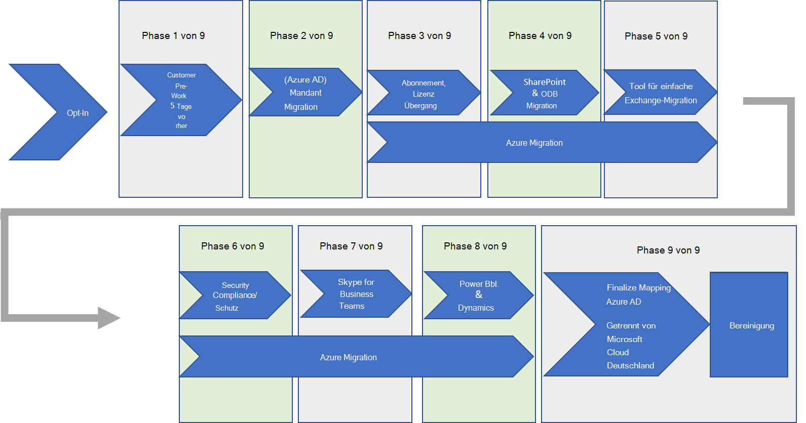

# Migration von Microsoft Cloud Deutschland zu Office 365 Diensten in den neuen Regionen des deutschen RechenzentrumsMigration from Microsoft Cloud Deutschland to Office 365 services in the new German datacenter regions

> [!NOTE]
> Dieser Artikel gilt nur für berechtigte Microsoft Cloud Deutschland-Kunden.This article only applies to eligible Microsoft Cloud Deutschland customers.

Im August 2018 kündigte Microsoft unsere Absicht an, die komplette Microsoft Cloud – Azure-, Office 365-, Dynamics 365-und Power-Plattform – aus neuen Cloud-Regionen in Deutschland bereitzustellen, um die digitale Transformation unserer Kunden besser zu ermöglichen.In August 2018, Microsoft announced our intention to deliver the complete Microsoft cloud – Azure, Office 365, Dynamics 365, and Power Platform – from new cloud regions in Germany to better enable the digital transformation of our customers. Wir haben im August 2019 angekündigt, dass wir die neuen Cloud-Regionen in Deutschland für erste Kunden eröffnen.In August 2019, we announced we are now in the process of opening of the new cloud regions in Germany. Wir haben seither die Verfügbarkeit von Azure, Office 365, Dynamics 365 und Power Platform angekündigt.We have since announced the availability of Azure, Office 365, Dynamics 365, and Power Platform.

Die neuen Regionen sind darauf ausgelegt, die sich entwickelnden Anforderungen von deutschen Kunden mit mehr Flexibilität, den neuesten intelligenten Cloud-Diensten und der vollständigen Konnektivität mit unserem Microsoft 365 Services Cloud-Netzwerk sowie dem Kundendaten Wohnsitz innerhalb Deutschlands zu erfüllen.The new regions are designed to address the evolving needs of German customers with greater flexibly, the latest intelligent cloud services, and full connectivity to our Microsoft 365 services cloud network as well as customer data residency within Germany.

## Migrieren zu den neuen deutschen RegionenHow to migrate to the new German regions

Vorhandene Microsoft Cloud Deutschland-Kunden können jetzt mit der Migration Ihrer Office 365, des Dynamics 365-Kundenengagements und der Power Platform-Kunden beginnen.Existing Microsoft Cloud Deutschland customers can now begin to migrate their Office 365, Dynamics 365 Customer Engagement, and Power Platform customers. Der erste Schritt besteht darin, [sich für die von Microsoft geleiteten Migration in unsere neuen deutschen Rechenzentrumsregionen anzumelden](https://aka.ms/office365germanymoveoptin).The first step is to [opt-in to a Microsoft-led migration](https://aka.ms/office365germanymoveoptin) to our new German datacenter regions.

Für Organisationen, die sich für den Microsoft-gesteuerten Ansatz entscheiden, werden Migrationen voraussichtlich Anfang 2021 beginnen und bis zum 29. Oktober 2021 abgeschlossen sein.For organizations who opt-in to the Microsoft-driven approach, migrations are expected to begin in early 2021 and will be completed by October 29, 2021. Als Ergebnis der Migration werden die wichtigsten Kundendaten und -abonnements in die neuen deutschen Regionen verschoben.As a result of the migration, core customer data and subscriptions are moved to the new German regions.

Dieser Artikel bietet eine Übersicht über den von Microsoft geführten Ansatz für die Migration, Klarheit über die Benutzer-und Administratoraktivitäten während und nach der Migration sowie Aktionen, die für Kunden auf der Grundlage der von Ihnen verwendeten Arbeitslasten erforderlich sind.This article provides an overview of the Microsoft-driven approach for the migration, clarity on the experiences for both users and admins during and after migration, and actions that may be required for customers based on which workloads you utilize.

Die folgenden Dienste werden als Teil des von Microsoft geleiteten Ansatzes migriert:The following services will be migrated as part of the Microsoft-driven approach:

- Azure-Active Directory (Azure AD)Azure Active Directory (Azure AD)
- Exchange OnlineExchange Online
- Exchange Online ProtectionExchange Online Protection
- SharePoint OnlineSharePoint Online
- OneDrive for BusinessOneDrive for Business

- Skype for Business Online\*\*Skype for Business Online\*\*
- Office 365-GruppenOffice 365 Groups
- Dynamics 365/Power Platform\*\*\*Dynamics 365 / Power Platform\*\*\*

\*\*Während der Migration von Microsoft Cloud Deutschland in die Regionen des deutschen Rechenzentrums werden vorhandene Skype for Business Online Kunden auf Microsoft Teams umstellen.\*\*During the migration from Microsoft Cloud Deutschland to the German datacenter regions, existing Skype for Business Online customers will transition to Microsoft Teams. Weitere Informationen finden Sie unter [Erste Schritte mit dem Upgrade von Microsoft Teams](https://aka.ms/SkypeToTeams-Home).See [Getting started with your Microsoft Teams upgrade](https://aka.ms/SkypeToTeams-Home) for more information.

\*\*\*Die Voraussetzungen und Auswirkungen der Migration für diese Dienste werden im Artikel [Dynamics 365 Customer Engagement](https://aka.ms/d365ceoptin) beschrieben.\*\*\*Prerequisites and impact of migration for these services are described in the [Dynamics 365 Customer engagement](https://aka.ms/d365ceoptin) article.

Office 365 Video wird am 1. März 2021 eingestellt.Office 365 Video is being retired on March 1, 2021. Wenn Sie Ihren Office 365-Mandanten in die Regionen der neuen deutschen Rechenzentren migrieren, wird Office 365 Video nach Abschluss der SharePoint Online-Migration nicht unterstützt.If you choose to migrate your Office 365 tenant to the new German datacenter regions, Office 365 Video will not be supported after the SharePoint Online migration is completed. Klicken Sie [hier](https://docs.microsoft.com/stream/migrate-from-office-365#microsoft-cloud-deutschland-timeline) , um weitere Informationen zu erhalten.Click [here](https://docs.microsoft.com/stream/migrate-from-office-365#microsoft-cloud-deutschland-timeline) to learn more.

## Wie ist die Migration organisiert?How is the migration organized?

Diese Abbildung stellt die verschiedenen Komponenten von Office 365 und Dynamics 365 in der Migration zu den neuen deutschen Rechenzentren dar.This figure represents the various components of Office 365 and Dynamics 365 in the migration to the new German datacenters.

Die Migration wird in Phasen ausgeführt, die alle beginnen, wenn Sie sich [für die Migration anmelden](https://aka.ms/office365germanymoveoptin).Migration is executed in phases that all start when you [opt-in for migration](https://aka.ms/office365germanymoveoptin). Die meisten Migrationsphasen werden als Back-End-Dienstvorgänge ausgeführt, wobei minimale Kundeninteraktion erforderlich ist und eine Phase nach der anderen ausgeführt wird.Most of the migration phases are executed as back-end service operations with minimal customer interaction required and are executed one phase after the other. Der Start für weitere vom Kunden geleitete Aufgaben und den Gesamt Migrationsstatus wird während des Migrationsprozesses über das Nachrichtencenter des Microsoft 365 admin Centers kommuniziert.The start for additional customer-led tasks and overall migration status will be communicated through the Message center of the Microsoft 365 admin center during the migration process. Beispiele für Aufgaben sind möglicherweise von Kunden verwaltete DNS-Updates, Neukonfiguration von Hybrid Setup für Exchange-Hybrid Kunden oder Azure-Migration.Example of tasks may include customer-managed DNS updates, reconfiguration of hybrid setup for Exchange hybrid customers, or Azure migration.

Die Migration beginnt nicht sofort, wenn das Opt-in erfolgt.Migration does not immediately begin when opt-in occurs. Ihre Organisation wird der Liste der Mandanten hinzugefügt, die für eine spätere Migration geplant sind.Your organization is added to the list of tenants that are scheduled for later migration. Sie können die vorarbeits Phasen jetzt beginnen, da diese für eine erfolgreiche Migration und Verwendung nach Abschluss wichtig sind.You can begin the pre-work phases now as these are critical to ensure successful migration and usage upon completion.

Eine Woche vor dem Start der Mandanten Migration erhalten Sie eine Benachrichtigung im Nachrichtencenter Dienst als abschließende Warnung, dass alle Voraussetzungen vollständig sein müssen.One week prior to the start of the tenant migration, you will receive notice in the Message center service as a final warning that all prerequisites must be complete.

Die Migration wird von Ihrem Azure AD Mandanten aus dem souveränen Deutschland Azure AD Dienst in die Office 365-Dienstinstanz von Azure AD in der EU-Region umsteigen.The migration will move of your Azure AD tenant from the sovereign Germany Azure AD service to the Office 365 services instance of Azure AD in the EU region.

Die nächste Phase ist die Migration Ihrer Mandanten&#39;s-Abonnements und Benutzerlizenzen aus Deutschland-spezifischen Produkten.The next phase is the migration of your tenant&#39;s subscriptions and user licenses from Germany-specific products.

Nachdem alle Schritte einschließlich der Azure-Kundenmigration abgeschlossen wurden, wird Ihr Mandant im Office 365 Dienste-Dienst fertig gestellt, und die Migration ist als abgeschlossen markiert.Once all steps are completed including customer Azure migration, your tenant is finalized in the Office 365 services service and migration is marked complete. An diesem Punkt wird Ihnen die abschließende Aktualisierung des Nachrichten Centers zur Verfügung gestellt.At this point, the final update to Message center is provided to you. Der Mandant ist jetzt keine vollständig globale Office 365 Organisation.The tenant is now not a fully global Office 365 organization.

Sie werden über den Migrations Fortschritt mit Nachrichtencenter-Beiträgen informiert.You are notified of migration progress with Message center posts. Die Beiträge werden an bestimmten Meilensteinen ausgeführt, und es werden Anleitungen zum Fortschritt eines Schritts sowie wichtige Informationen für Kunden bereitgestellt, die basierend auf den Prozessanforderungen agieren können.The posts will occur at specific milestones and will provide guidance as to progress of a step as well as important information for customers to act on based on the process requirements. Nachrichtencenter-Benachrichtigungen werden unter den folgenden Meilensteinen bereitgestellt:Message center notifications are provided at the following milestones:

- Beginn der Migration (5 Werktage vor Beginn der Migration von Azure AD)Start of migration (5 business days before Azure AD migration begins)
- Azure AD Migration abgeschlossenAzure AD migration complete
- Abonnement-und Lizenz Migration abgeschlossenSubscription and license migration complete
- SharePoint-Migration abgeschlossenSharePoint migration complete
- Exchange-Migration abgeschlossenExchange migration complete
- Skype for Business abgeschlossenSkype for Business complete
- Dynamics abgeschlossenDynamics complete
- Power BI abgeschlossenPower BI complete
- Abschließende Cutover der Dienste ist abgeschlossenFinal cutover of services is complete

## Umstieg auf die neuen deutschen RegionenMoving to the new German regions

Vorhandene Microsoft Cloud Deutschland-Kunden (Microsoft Cloud Deutschland) können jetzt mit der Migration Ihrer Office 365, des Dynamics 365-Kundenengagements und der Power Platform-Kunden beginnen.Existing Microsoft Cloud Germany (Microsoft Cloud Deutschland) customers can now begin to migrate their Office 365, Dynamics 365 Customer Engagement, and Power Platform customers. Der erste Schritt besteht darin, [sich für die von Microsoft geleiteten Migration in unsere neuen deutschen Rechenzentrumsregionen anzumelden](https://aka.ms/office365germanymoveoptin).The first step is to [opt-in to a Microsoft-led migration](https://aka.ms/office365germanymoveoptin) to our new German datacenter regions. Wenn Sie Ihr Abonnement erneuern, melden Sie sich automatisch für eine von Microsoft unterstützte Migration an.When you renew your subscription, you automatically opt-in for a Microsoft-assisted migration. Microsoft benachrichtigt Kundenmandanten Administratoren per e-Mail und im Nachrichtencenter des Microsoft 365 Admin Center, wenn dies geschehen ist.Microsoft will notify customer tenant administrators with e-mail and in the Message center of the Microsoft 365 admin center when this has happened. Wenn Sie den Prozess jedoch jetzt lieber starten möchten, können Sie sich heute direkt im Microsoft 365 Admin Center [Anmelden](https://aka.ms/office365germanymoveoptin) .However, if you prefer to start the process now, you can [opt-in](https://aka.ms/office365germanymoveoptin) directly in Microsoft 365 admin center today. Migrationen werden voraussichtlich Anfang 2021 beginnen und werden bis zum 29. Oktober 2021 abgeschlossen sein.Migrations are expected to begin in early 2021 and will be completed by October 29, 2021. 

Als Ergebnis der Migration werden die wichtigsten Kundendaten und -abonnements in die neuen deutschen Regionen verschoben.As a result of the migration, core customer data and subscriptions are moved to the new German regions.

## Wie Sie sich auf die Migration auf Office 365-Dienste in den neuen deutschen Rechenzentrumsregionen vorbereiten könnenHow to prepare for migration to Office 365 services in the new German datacenter regions

Der erste Schritt besteht darin, Microsoft so zu benachrichtigen, dass wir Ihre Berechtigung zum Migrieren Ihres Abonnements und der Daten von Microsoft Cloud Deutschland zu Office 365 Diensten in den neuen Regionen im deutschen Datencenter haben.The first step is to notify Microsoft so that we have your permission to migrate your subscription and data from Microsoft Cloud Deutschland to Office 365 services in the new German datacenter regions. Weitere Informationen finden Sie im [Opt-in-Prozess](https://aka.ms/office365germanymoveoptin) , und beachten Sie Folgendes:Please refer to the [opt-in process](https://aka.ms/office365germanymoveoptin) for instructions and note that:

- Alle migrierten Kunden müssen die Verbindung mit den Office 365 Diensten [Office 365 URLs und IP-Adressen](urls-and-ip-address-ranges.md)überprüfen, einschließlich der neuen Regionen des deutschen Datencenters.All migrating customers need to verify connectivity to the Office 365 Services [Office 365 URLs and IP addresses](urls-and-ip-address-ranges.md), which include the new German datacenter regions. InAktion kann zu Dienst-und Client Fehlern führen.Inaction may result in service and client failure.
- Überprüfen Sie die Beschreibung des Office 365-Platt Form Diensts, um zu verstehen, welche Features und Dienste für Ihre Organisation verfügbar sind, nachdem Sie die Migration in die Region Deutschland durchführt haben.You should review the Office 365 platform service description to understand which features and services will become available to your organization following the migration to the German region.
- Testabonnements werden nicht migriert und blockieren die Migration aller kostenpflichtigen Abonnements.Trial subscriptions will not be migrated and will block migration of all paid subscriptions. Vor Beginn der Migration müssen Sie alle Testversionen abbrechen oder in kostenpflichtige Abonnements konvertieren.You must cancel any trials or convert to paid subscriptions before migration begins.

## Wo gehe ich von hier aus?Where do I go from here?

Lesen Sie den folgenden Abschnitt mit häufig gestellten Fragen.Review the following Frequently Asked Questions section.

## Häufig gestellte FragenFrequently Asked Questions

### Ist die Migration erforderlich?Is migration required?

Microsoft bietet Office 365 Mandanten Migration von Microsoft Cloud Deutschland zu Office 365 Diensten in den neuen Regionen des deutschen Rechenzentrums ohne Aufpreis.Microsoft offers Office 365 tenant migration from Microsoft Cloud Deutschland to Office 365 services in the new German datacenter regions at no additional charge. Wir empfehlen zwar dringend, dass Sie sich für die Migration zu den neuen Regionen des deutschen Datencenters entscheiden, aber wir werden weiterhin die erforderlichen Sicherheitsupdates für die Microsoft Cloud Deutschland-Region bereitstellen.While we do strongly recommend that you opt-in to migrate to the new German datacenter regions, we will continue to provide the necessary security updates to the Microsoft Cloud Deutschland region.

Office 365 Dienste in den neuen Bereichen des Rechenzentrums in Deutschland:Office 365 services in the new German datacenter regions:

- Sie bieten marktgerechte Preise für [Azure](https://azure.microsoft.com/pricing/calculator/), [Office 365](https://www.microsoft.com/microsoft-365/business/compare-more-office-365-for-business-plans), [Dynamics 365 Customer Engagement](https://dynamics.microsoft.com/pricing/)und [Power BI](https://powerbi.microsoft.com/pricing/).Offer market competitive pricing for [Azure](https://azure.microsoft.com/pricing/calculator/), [Office 365](https://www.microsoft.com/microsoft-365/business/compare-more-office-365-for-business-plans), [Dynamics 365 Customer Engagement](https://dynamics.microsoft.com/pricing/), and [Power BI](https://powerbi.microsoft.com/pricing/).
- Sind mit dem globalen Microsoft&#39;-Netzwerk verbunden, das Hunderte von Netzwerk-Edge-Standorten, Peering-Standorten und Ausgangspunkten bietet, um eine robuste Benutzererfahrung überall auf der Welt bereitzustellen.Are connected to Microsoft&#39;s global network, offering hundreds of network edge sites, peering locations, and egress points to deliver a robust user experience anywhere in the world.
- Sie helfen Ihnen, die Anforderungen an die lokale Datenhaltung innerhalb von Deutschland zu erfüllen.Help you meet local customer data residency requirements within Germany.
- Liefern Sie unser umfassendes globales Cloud-Angebot mit den neuesten Versionen unserer Dienste und neuen Funktionen wie Microsoft Teams und Multi-Geo in Office 365.Deliver our full-featured global cloud offering with the latest versions of our services and new capabilities including Microsoft Teams and Multi-Geo in Office 365. Hier finden Sie die Vergleiche unserer Produkte nach Region für [Azure](https://azure.microsoft.com/global-infrastructure/services/?products=all&amp;regions=germany-non-regional,germany-central,germany-north,germany-northeast,germany-west-central), [Office 365](o365-data-locations.md) und [Dynamics 365](https://docs.microsoft.com/dynamics365/get-started/availability).Compare products by region for [Azure](https://azure.microsoft.com/global-infrastructure/services/?products=all&amp;regions=germany-non-regional,germany-central,germany-north,germany-northeast,germany-west-central), [Office 365](o365-data-locations.md), and [Dynamics 365](https://docs.microsoft.com/dynamics365/get-started/availability).
- Sie bieten die vollständige Funktionalität, Sicherheit auf Unternehmensniveau und umfassende Funktionen, die Kunden bei der Einhaltung behördlicher oder eigener Vorschriften unterstützen.Offer full functionality, enterprise-grade security, and comprehensive features to help customers meet compliance and regulatory requirements.
- Sie sind im Rahmen vorhandener Verträge für Onlinedienstleistungen verfügbar.Are accessible through existing online services contracts.

### Wie hoch ist die Dienstverfügbarkeit der verschiedenen Office 365-Clouddienstangebote?What is the service availability between the different Office 365 cloud service offerings?

Die folgenden 15 Dienste stehen im Cloud-Dienstangebot von Microsoft Cloud Deutschland zur Verfügung.The following 15 services are available in the Microsoft Cloud Deutschland cloud service offering. Wir fügen Microsoft Cloud Deutschland keine neuen Dienste hinzu.We are not adding new services to Microsoft Cloud Deutschland.

1. Exchange OnlineExchange Online
2. Kunden-Lockbox (Exchange Online)Customer Lockbox (Exchange Online)
3. Gruppen (moderne Gruppen)Groups (Modern groups)
4. Delve-ProfilDelve Profile
5. Exchange Online ProtectionExchange Online Protection
6. Advanced Threat Protection, ATPAdvanced Threat Protection (ATP)
7. Advanced eDiscoveryAdvanced eDiscovery
8. Advanced Data GovernanceAdvance Data Governance
9. SharePoint OnlineSharePoint Online
10. Kunden-Lockbox (SharePoint Online)Customer Lockbox (SharePoint Online)
11. OneDrive for BusinessOneDrive for Business
12. Skype for Business OnlineSkype for Business Online
13. Word Online, Excel Online, PowerPoint, OneNote, Visio OnlineWord Online, Excel Online, PowerPoint, OneNote, Visio Online
14. Office 365 ProPlusOffice 365 Pro Plus
15. Outlook MobileOutlook Mobile

Derzeit sind 29 Dienste als Bestandteil von Office 365-Diensten in den neuen deutschen Rechenzentrumsregionen verfügbar.There are currently 29 services available as part of Office 365 services in the new German datacenter regions. In Übereinstimmung mit den globalen Office 365-Diensten werden fortlaufend neue Features und Dienste bereitgestellt.New features and services will be available consistent with global Office 365 services on an ongoing basis.

1. Exchange OnlineExchange Online
2. Kunden-Lockbox für Exchange OnlineCustomer Lockbox for Exchange Online
3. Microsoft 365-GruppenMicrosoft 365 groups
4. Delve-ProfilDelve Profile
5. MyAnalyticsMyAnalytics
6. Workplace AnalyticsWorkplace Analytics
7. Exchange Online ProtectionExchange Online Protection
8. Advanced Threat Protection, ATPAdvanced Threat Protection (ATP)
9. Advanced eDiscoveryAdvanced eDiscovery
10. Advanced Security ManagementAdvanced Security Management
11. Verwaltung von InformationsrechtenInformation Rights Management
12. Advanced Data GovernanceAdvance Data Governance
13. SharePoint OnlineSharePoint Online
14. Kunden-Lockbox für SharePoint OnlineCustomer Lockbox for SharePoint Online
15. OneDrive for BusinessOneDrive for Business
16. Microsoft StreamMicrosoft Stream
17. Skype for Business (wird während der Migration zu Microsoft Teams migriert)Skype for Business (will migrate to Microsoft Teams during the migration)
18. Cloud PBXCloud PBX
19. PSTN-KonferenzenPSTN Conferencing
20. PSTN-AnrufePSTN calling
21. Microsoft TeamsMicrosoft Teams
22. Administrator-Berichte/ VerwendungsberichteAdmin Reports / Usage Reports
23. Word Online, Excel Online, PowerPoint, OneNote und Visio OnlineWord Online, Excel Online, PowerPoint, OneNote, and Visio Online
24. PlannerPlanner
25. SwaySway
26. Microsoft 365 AppsMicrosoft 365 Apps
27. Outlook MobileOutlook Mobile
28. Enterprise Mobility + Security (EMS) E3 (Azure AD Premium P1, InTune und Rights Management Service)Enterprise Mobility + Security (EMS) E3 (Azure AD Premium P1, Intune, and Rights Management Service)
29. Yammer OnlineYammer Online

### Wann wird die Migration durchgeführt?When will migration happen?

**Azure****Azure**

Wenn Sie nur ein Azure-Kunde sind, können Sie die [Migration](https://docs.microsoft.com/azure/germany/germany-migration-main) ihrer Azure-Ressourcen in eine andere Region heute beginnen.If you are an Azure customer only, you can begin [migrating](https://docs.microsoft.com/azure/germany/germany-migration-main) your Azure resources to another region today. Wenn Sie Azure mit Office 365, Dynamics 365 oder Power BI haben, führen Sie die folgenden Schritte aus.If you have Azure with Office 365, Dynamics 365, or Power BI, please follow the steps below.

**Office 365****Office 365**

[Melden Sie sich an](https://aka.ms/office365germanymoveoptin) für noch heute für Migration durch Microsoft an.[Opt-in](https://aka.ms/office365germanymoveoptin) to the Microsoft-driven migration today. Wenn wir die Migration starten möchten, werden wir Sie über das Nachrichtencenter im Microsoft 365 Admin Center informieren.When we are ready to start your migration, we will inform you through the Message center in the Microsoft 365 admin center.

**Dynamics 365 und Power BI****Dynamics 365 and Power BI**

Entscheiden Sie sich für das Kunden Engagement von Microsoft-Driven Migration for [Dynamics 365](https://aka.ms/D365ceOptIn) und [Power BI](https://aka.ms/PBIOptIn) heute.Opt-in to the Microsoft-driven migration for [Dynamics 365 Customer Engagement](https://aka.ms/D365ceOptIn) and [Power BI](https://aka.ms/PBIOptIn) today. Wenn wir bereit sind, Ihre Migration zu starten, werden wir Sie über das Message Center im Microsoft 365 Admin Center informieren.When we are ready to start your migration, we will inform you through the Message center in the Microsoft 365 admin center.

### Ändert sich die Preisänderung für die Office 365 Dienste, die ich verwende?Will the price change for the Office 365 services that I use?

Ja.Yes. Die Preisgestaltung in den globalen Cloud-Regionen von Microsoft&#39;(einschließlich der neuen Datencenter Regionen) ist im Allgemeinen geringer.Pricing in Microsoft&#39;s global cloud regions (including the new datacenter regions) is generally lower.

### Welche SKUs und Lizenzen werden während der Abonnement Migration auf meine Organisation und Benutzer angewendet?During the subscription migration, what SKUs and Licenses will be applied to my organization and users?

Während der Migration von Microsoft Cloud Deutschland zu den Office 365 Diensten werden die dienstspezifischen SKUs für Deutschland durch globale Versionen derselben oder ähnlicher SKU ersetzt.During the migration from Microsoft Cloud Deutschland to the Office 365 services, the Germany service-specific SKUs are replaced with global versions of the same or similar SKU. In den meisten Fällen ist die SKU in Office 365 Diensten identisch, es gibt jedoch nur wenige Ersatz, bei denen die SKU in Deutschland in den Office 365 Diensten nicht mehr verfügbar ist.For the majority of cases, the SKU in Office 365 services is the same however there are few replacements where the SKU in Germany is no longer available in the Office 365 services. Wenn Sie die Ihrer Organisation zugewiesene SKU nach Abschluss der Migration aktualisieren möchten, wenden Sie sich an Ihren Verkäufer, um die zugewiesenen Dienste hinzuzufügen oder zu ändern.If you wish to update the SKU assigned to your organization after the migration is complete, contact your seller to add or modify the services assigned.

| Microsoft Cloud Deutschland-Produkt-SKU (de)Microsoft Cloud Deutschland - Product SKU (DE) | Microsoft Cloud Global – Produkt-SKU (WW)Microsoft Cloud Global - Product SKU (WW) |
| --- | --- |
| Kunden-Lockbox \_ de (Lockbox \_ de)Customer Lockbox\_DE (LOCKBOX\_DE) | Kunden-Lockbox (Lockbox)Customer Lockbox (LOCKBOX) |
| Dynamics 365 Enterprise Edition-zusätzlicher Datenbankspeicher \_ de (CRMSTORAGE \_ de)Dynamics 365 Enterprise Edition - Additional Database Storage\_DE (CRMSTORAGE\_DE) | Dynamics 365 Enterprise Edition – zusätzlicher Datenbankspeicher (CRMSTORAGE)Dynamics 365 Enterprise Edition - Additional Database Storage (CRMSTORAGE) |
| Dynamics 365 Enterprise Edition-zusätzliche Nichtproduktionsinstanz \_ de (CRMTESTINSTANCE \_ de)Dynamics 365 Enterprise Edition - Additional Non-Production Instance\_DE (CRMTESTINSTANCE\_DE) | Dynamics 365 Enterprise Edition – zusätzliche Nichtproduktionsinstanz (CRMTESTINSTANCE)Dynamics 365 Enterprise Edition - Additional Non-Production Instance (CRMTESTINSTANCE) |
| Dynamics 365 für Kundendienst Enterprise Edition \_ de (DYN365 \_ Enterprise \_ Customer \_ Service \_ de)Dynamics 365 for Customer Service Enterprise Edition\_DE (DYN365\_ENTERPRISE\_CUSTOMER\_SERVICE\_DE) | Dynamics 365 für Kundendienst Enterprise Edition (DYN365 \_ Enterprise \_ \_ -Kundendienst)Dynamics 365 for Customer Service Enterprise Edition (DYN365\_ENTERPRISE\_CUSTOMER\_SERVICE) |
| Dynamics 365 für Sales Enterprise Edition \_ de (DYN365 \_ Enterprise \_ Sales \_ de)Dynamics 365 for Sales Enterprise Edition\_DE (DYN365\_ENTERPRISE\_SALES\_DE) | Dynamics 365 für Sales Enterprise Edition (DYN365 \_ Enterprise \_ Sales)Dynamics 365 for Sales Enterprise Edition (DYN365\_ENTERPRISE\_SALES) |
| Dynamics 365 für Team Mitglieder Enterprise Edition \_ de (DYN365 \_ Enterprise \_ \_ -Teammitglieder \_ de)Dynamics 365 for Team Members Enterprise Edition\_DE (DYN365\_ENTERPRISE\_TEAM\_MEMBERS\_DE) | Dynamics 365 für Team Mitglieder Enterprise Edition (DYN365 \_ Enterprise \_ \_ -Teammitglieder)Dynamics 365 for Team Members Enterprise Edition (DYN365\_ENTERPRISE\_TEAM\_MEMBERS) |
| Dynamics 365 Plan 1 Enterprise Edition \_ de (DYN365 \_ Enterprise \_ PLAN1 \_ de)Dynamics 365 Plan 1 Enterprise Edition\_DE (DYN365\_ENTERPRISE\_PLAN1\_DE) | Dynamics 365 Plan 1 Enterprise Edition (DYN365 \_ Enterprise \_ PLAN1)Dynamics 365 Plan 1 Enterprise Edition (DYN365\_ENTERPRISE\_PLAN1) |
| ECAL-Dienste (EOA, EoP, DLP) \_ de (ECAL \_ Services \_ de)ECAL Services (EOA, EOP, DLP)\_DE (ECAL\_SERVICES\_DE) | ECAL-Dienste (EOA, EoP, DLP) (ECAL- \_ Dienste)ECAL Services (EOA, EOP, DLP) (ECAL\_SERVICES) |
| Enterprise Mobility + Security E3 \_ de (EMS \_ de)Enterprise Mobility + Security E3\_DE (EMS\_DE) | Enterprise Mobility + Security E3 (EMS)Enterprise Mobility + Security E3 (EMS) |
| Exchange Online (Plan 1) \_ de (EXCHANGESTANDARD \_ de)Exchange Online (Plan 1)\_DE (EXCHANGESTANDARD\_DE) | Exchange Online (Plan 1) (EXCHANGESTANDARD)Exchange Online (Plan 1) (EXCHANGESTANDARD) |
| Exchange Online (Plan 2) \_ de (EXCHANGEENTERPRISE \_ de)Exchange Online (Plan 2)\_DE (EXCHANGEENTERPRISE\_DE) | Exchange Online (Plan 2) (EXCHANGEENTERPRISE)Exchange Online (Plan 2) (EXCHANGEENTERPRISE) |
| Exchange Online Archivierung für Exchange Online \_ de (EXCHANGEARCHIVE \_ Addon \_ de)Exchange Online Archiving for Exchange Online\_DE (EXCHANGEARCHIVE\_ADDON\_DE) | Exchange Online Archivierung für Exchange Online (EXCHANGEARCHIVE \_ Addon)Exchange Online Archiving for Exchange Online (EXCHANGEARCHIVE\_ADDON) |
| Exchange Online Archivierung für Exchange Server \_ de (EXCHANGEARCHIVE \_ de)Exchange Online Archiving for Exchange Server\_DE (EXCHANGEARCHIVE\_DE) | Exchange Online Archivierung für Exchange Server (EXCHANGEARCHIVE)Exchange Online Archiving for Exchange Server (EXCHANGEARCHIVE) |
| Exchange Online Essentials \_ de (Exchange \_ S \_ Essentials \_ de)Exchange Online Essentials\_DE (EXCHANGE\_S\_ESSENTIALS\_DE) | Exchange Online Essentials (Exchange \_ S \_ Essentials)Exchange Online Essentials (EXCHANGE\_S\_ESSENTIALS) |
| Exchange Online Kiosk \_ de (EXCHANGEDESKLESS \_ de)Exchange Online Kiosk\_DE (EXCHANGEDESKLESS\_DE) | Exchange Online Kiosk (EXCHANGEDESKLESS)Exchange Online Kiosk (EXCHANGEDESKLESS) |
| Exchange Online Protection \_ de (EoP \_ Enterprise \_ de)Exchange Online Protection\_DE (EOP\_ENTERPRISE\_DE) | Exchange Online Schutz (EoP \_ Enterprise)Exchange Online Protection (EOP\_ENTERPRISE) |
| Microsoft 365 Business Standard (O365 \_ Business \_ Premium)Microsoft 365 Business Standard (O365\_BUSINESS\_PREMIUM) | Microsoft 365 Business Standard (O365 \_ Business \_ Premium)Microsoft 365 Business Standard (O365\_BUSINESS\_PREMIUM) |
| Microsoft Dynamics CRM Online-Instanz \_ de (CRMINSTANCE \_ de)Microsoft Dynamics CRM Online Instance\_DE (CRMINSTANCE\_DE) | Microsoft Dynamics CRM Online-Instanz (CRMINSTANCE)Microsoft Dynamics CRM Online Instance (CRMINSTANCE) |
| Office 365 a1 für Faculty \_ de (STANDARDWOFFPACK \_ Faculty \_ de)Office 365 A1 for faculty\_DE (STANDARDWOFFPACK\_FACULTY\_DE) | Office 365 a1 für Fakultät (STANDARDWOFFPACK \_ Faculty)Office 365 A1 for faculty (STANDARDWOFFPACK\_FACULTY) |
| Office 365 a1 für Schüler \_ de (STANDARDWOFFPACK \_ Student \_ de)Office 365 A1 for students\_DE (STANDARDWOFFPACK\_STUDENT\_DE) | Office 365 a1 für Schüler (STANDARDWOFFPACK \_ Student)Office 365 A1 for students (STANDARDWOFFPACK\_STUDENT) |
| Office 365 Advanced Compliance \_ de (EQUIVIO \_ Analytics \_ de)Office 365 Advanced Compliance\_DE (EQUIVIO\_ANALYTICS\_DE) | Microsoft 365 E5-Compliance (Information \_ Protection \_ Compliance)Microsoft 365 E5 Compliance (INFORMATION\_PROTECTION\_COMPLIANCE) |
| Office 365 Advanced Threat Protection (Plan 1) \_ de (ATP \_ Enterprise \_ de)Office 365 Advanced Threat Protection (Plan 1)\_DE (ATP\_ENTERPRISE\_DE) | Office 365 Advanced Threat Protection (Plan 1) (ATP \_ Enterprise)Office 365 Advanced Threat Protection (Plan 1) (ATP\_ENTERPRISE) |
| Office 365 Business Essentials \_ de (O365 \_ Business \_ Essentials \_ de)Office 365 Business Essentials\_DE (O365\_BUSINESS\_ESSENTIALS\_DE) | Microsoft 365 Business Basic (O365 \_ Business \_ Essentials)Microsoft 365 Business Basic (O365\_BUSINESS\_ESSENTIALS) |
| Office 365 Business Premium \_ de (O365 \_ Business \_ Premium \_ de)Office 365 Business Premium\_DE (O365\_BUSINESS\_PREMIUM\_DE) | Microsoft 365 Business Standard (O365 \_ Business \_ Premium)Microsoft 365 Business Standard (O365\_BUSINESS\_PREMIUM) |
| Office 365 Business \_ de (O365 \_ Business \_ de)Office 365 Business\_DE (O365\_BUSINESS\_DE) | Microsoft 365 apps for Business (O365 \_ Business)Microsoft 365 Apps for business (O365\_BUSINESS) |
| Office 365 E1 \_ de (STANDARDPACK \_ de)Office 365 E1\_DE (STANDARDPACK\_DE) | Office 365 E1 (STANDARDPACK)Office 365 E1 (STANDARDPACK) |
| Office 365 E3 ohne ProPlus \_ de (ENTERPRISEPACKWITHOUTPROPLUS \_ de)Office 365 E3 without ProPlus\_DE (ENTERPRISEPACKWITHOUTPROPLUS\_DE) | Office 365 E3 ohne ProPlus (ENTERPRISEPACKWITHOUTPROPLUS)Office 365 E3 without ProPlus (ENTERPRISEPACKWITHOUTPROPLUS) |
| Office 365 E3 \_ de (ENTERPRISEPACK \_ de)Office 365 E3\_DE (ENTERPRISEPACK\_DE) | Office 365 E3 (ENTERPRISEPACK)Office 365 E3 (ENTERPRISEPACK) |
| Office 365 Enterprise E1 \_ de (STANDARDPACK \_ de)Office 365 Enterprise E1\_DE (STANDARDPACK\_DE) | Office 365 Enterprise E1 (STANDARDPACK)Office 365 Enterprise E1 (STANDARDPACK) |
| Office 365 Enterprise E3 \_ de (ENTERPRISEPACK \_ de)Office 365 Enterprise E3\_DE (ENTERPRISEPACK\_DE) | Office 365 Enterprise E3 (ENTERPRISEPACK)Office 365 Enterprise E3 (ENTERPRISEPACK) |
| Office 365 zusätzlicher Dateispeicher \_ de (SHAREPOINTSTORAGE \_ de)Office 365 Extra File Storage\_DE (SHAREPOINTSTORAGE\_DE) | Office 365 zusätzlicher Dateispeicher (SHAREPOINTSTORAGE)Office 365 Extra File Storage (SHAREPOINTSTORAGE) |
| Office 365 F1 \_ de (DESKLESSPACK \_ de)Office 365 F1\_DE (DESKLESSPACK\_DE) | Office 365 F1 (DESKLESSPACK)Office 365 F1 (DESKLESSPACK) |
| Office 365 ProPlus für Faculty \_ de (sich officesubscription \_ Faculty \_ de)Office 365 ProPlus for Faculty\_DE (OFFICESUBSCRIPTION\_FACULTY\_DE) | Office 365 ProPlus für die Fakultät (sich officesubscription \_ Faculty)Office 365 ProPlus for Faculty (OFFICESUBSCRIPTION\_FACULTY) |
| Office 365 ProPlus für Schüler \_ de (sich officesubscription \_ Student \_ de)Office 365 ProPlus for Students\_DE (OFFICESUBSCRIPTION\_STUDENT\_DE) | Office 365 ProPlus für Schüler (sich officesubscription \_ Student)Office 365 ProPlus for Students (OFFICESUBSCRIPTION\_STUDENT) |
| Office 365 ProPlus \_ de (sich officesubscription \_ de)Office 365 ProPlus\_DE (OFFICESUBSCRIPTION\_DE) | Office 365 ProPlus (sich officesubscription)Office 365 ProPlus (OFFICESUBSCRIPTION) |
| OneDrive für Unternehmen (Plan 1) \_ de (WACONEDRIVESTANDARD \_ de)OneDrive for Business (Plan 1)\_DE (WACONEDRIVESTANDARD\_DE) | OneDrive für Unternehmen (Plan 1) (WACONEDRIVESTANDARD)OneDrive for Business (Plan 1) (WACONEDRIVESTANDARD) |
| OneDrive für Unternehmen (Plan 2) \_ de (WACONEDRIVEENTERPRISE \_ de)OneDrive for Business (Plan 2)\_DE (WACONEDRIVEENTERPRISE\_DE) | OneDrive für Unternehmen (Plan 2) (WACONEDRIVEENTERPRISE)OneDrive for Business (Plan 2) (WACONEDRIVEENTERPRISE) |
| Power BI pro für Faculty \_ de (Power \_ BI \_ pro \_ Faculty \_ de)Power BI Pro for faculty\_DE (POWER\_BI\_PRO\_FACULTY\_DE) | Power BI pro für Dozenten (Power \_ BI \_ pro \_ Faculty)Power BI Pro for faculty (POWER\_BI\_PRO\_FACULTY) |
| Power BI pro \_ de (Power \_ BI \_ pro \_ de)Power BI Pro\_DE (POWER\_BI\_PRO\_DE) | Power BI pro (Power \_ BI \_ pro)Power BI Pro (POWER\_BI\_PRO) |
| Project Online Essentials \_ de (PROJECTESSENTIALS \_ de)Project Online Essentials\_DE (PROJECTESSENTIALS\_DE) | Project Online Essentials (PROJECTESSENTIALS)Project Online Essentials (PROJECTESSENTIALS) |
| Project Online Premium \_ de (PROJECTPREMIUM \_ de)Project Online Premium\_DE (PROJECTPREMIUM\_DE) | Project Online Premium (PROJECTPREMIUM)Project Online Premium (PROJECTPREMIUM) |
| Project Online Professional \_ de (PROJECTPROFESSIONAL \_ de)Project Online Professional\_DE (PROJECTPROFESSIONAL\_DE) | Project Online Professional (PROJECTPROFESSIONAL)Project Online Professional (PROJECTPROFESSIONAL) |
| Projekt Plan 3 \_ de (PROJECTPROFESSIONAL \_ de)Project Plan 3\_DE (PROJECTPROFESSIONAL\_DE) | Projekt Plan 3 (PROJECTPROFESSIONAL)Project Plan 3 (PROJECTPROFESSIONAL) |
| Office 365 E4 \_ de (ENTERPRISEWITHSCAL \_ de)Office 365 E4\_DE (ENTERPRISEWITHSCAL\_DE) | Office 365 E3 (ENTERPRISEPACK)Office 365 E3 (ENTERPRISEPACK) |
| SharePoint Online (Plan 1) \_ de (SHAREPOINTSTANDARD \_ de)SharePoint Online (Plan 1)\_DE (SHAREPOINTSTANDARD\_DE) | SharePoint Online (Plan 1) (SHAREPOINTSTANDARD)SharePoint Online (Plan 1) (SHAREPOINTSTANDARD) |
| SharePoint Online (Plan 2) \_ de (SHAREPOINTENTERPRISE \_ de)SharePoint Online (Plan 2)\_DE (SHAREPOINTENTERPRISE\_DE) | SharePoint Online (Plan 2) (SHAREPOINTENTERPRISE)SharePoint Online (Plan 2) (SHAREPOINTENTERPRISE) |
| Skype for Business Online (Plan 1) \_ de (MCOIMP \_ de)Skype for Business Online (Plan 1)\_DE (MCOIMP\_DE) | Office 365 E1 (STANDARDPACK)Office 365 E1 (STANDARDPACK) |
| Skype for Business Online (Plan 1) \_ de (MCOIMP \_ de)Skype for Business Online (Plan 1)\_DE (MCOIMP\_DE) | Skype for Business Online (Plan 1) (MCOIMP)Skype for Business Online (Plan 1) (MCOIMP) |
| Skype for Business Online (Plan 2) \_ de (MCOSTANDARD \_ de)Skype for Business Online (Plan 2)\_DE (MCOSTANDARD\_DE) | Skype for Business Online (Plan 2) (MCOSTANDARD)Skype for Business Online (Plan 2) (MCOSTANDARD) |
| Skype for Business Plus Cal \_ de (MCOPLUSCAL \_ de)Skype for Business Plus CAL\_DE (MCOPLUSCAL\_DE) | Skype for Business Plus CAL (MCOPLUSCAL)Skype for Business Plus CAL (MCOPLUSCAL) |
| Visio Online-Plan 1 für Faculty \_ de (VISIOONLINE \_ PLAN1 \_ FAC \_ de)Visio Online Plan 1 for faculty\_DE (VISIOONLINE\_PLAN1\_FAC\_DE) | Visio Online-Plan 1 für Faculty (VISIOONLINE \_ PLAN1 \_ FAC)Visio Online Plan 1 for faculty (VISIOONLINE\_PLAN1\_FAC) |
| Visio Online-Plan 1 \_ de (VISIOONLINE \_ PLAN1 \_ de)Visio Online Plan 1\_DE (VISIOONLINE\_PLAN1\_DE) | Visio Online-Plan 1 (VISIOONLINE \_ PLAN1)Visio Online Plan 1 (VISIOONLINE\_PLAN1) |
| Visio Online-Plan 2 für Faculty \_ de (VISIOCLIENT \_ Faculty \_ de)Visio Online Plan 2 for faculty\_DE (VISIOCLIENT\_FACULTY\_DE) | Visio Online-Plan 2 für Faculty (VISIOCLIENT \_ Faculty)Visio Online Plan 2 for faculty (VISIOCLIENT\_FACULTY) |
| Visio Online-Plan 2 \_ de (VISIOCLIENT \_ de)Visio Online Plan 2\_DE (VISIOCLIENT\_DE) | Visio Online-Plan 2 (VISIOCLIENT)Visio Online Plan 2 (VISIOCLIENT) |
| Visio-Plan 1 \_ de (VISIOONLINE \_ PLAN1 \_ de)Visio Plan 1\_DE (VISIOONLINE\_PLAN1\_DE) | Visio-Plan 1 (VISIOONLINE \_ PLAN1)Visio Plan 1 (VISIOONLINE\_PLAN1) |
| Visio-Plan 2 \_ de (VISIOCLIENT \_ de)Visio Plan 2\_DE (VISIOCLIENT\_DE) | Visio-Plan 2 (VISIOCLIENT)Visio Plan 2 (VISIOCLIENT) |
|||

### Wie erhalte ich Hilfe von Microsoft, um zu einer neuen Region zu migrieren, oder Antworten auf meine Support-Fragen?How do I get help from Microsoft to migrate to a new region or answer support questions?

Wenn Sie Fragen haben, können Sie uns oder Ihren Partner kontaktieren:If you have questions, you can contact us or your partner:

- Für Azure können Sie [neue Supportanfragen](https://portal.microsoftazure.de/#blade/Microsoft_Azure_Support/HelpAndSupportBlade/newsupportrequest) im Azure-Portal senden.For Azure, you can submit [new support requests](https://portal.microsoftazure.de/#blade/Microsoft_Azure_Support/HelpAndSupportBlade/newsupportrequest) in the Azure portal.
- Für Office 365 können Sie Fragen über den &quot; Link Need Help? &quot; des [Microsoft 365 Admin Center](https://portal.office.de/)übermitteln.For Office 365, you may submit questions using the &quot;Need Help?&quot; link of the [Microsoft 365 admin center](https://portal.office.de/).
- Wenn Sie Dynamics 365 Kunden Engagement und Power BI-Kunde sind und auch Office 365 haben, können Sie Fragen über den &quot; Link Need Help? &quot; des [Microsoft 365 Admin Center](https://portal.office.de/)übermitteln.If you are Dynamics 365 Customer Engagement and Power BI customer and also have Office 365, you may submit questions using the &quot;Need Help?&quot; link of the [Microsoft 365 admin center](https://portal.office.de/). Die Dynamics 365 Customer Engagement-Supportoptionen befinden sich [hier](https://docs.microsoft.com/dynamics365/get-started/support/).Dynamics 365 Customer Engagement support options are located [here](https://docs.microsoft.com/dynamics365/get-started/support/). Die Power BI-Supportoptionen befinden sich [hier](https://powerbi.microsoft.com/support/).Power BI support options are located [here](https://powerbi.microsoft.com/support/).

## Weitere InformationenMore information

Weitere Informationen zur Migration zu den neuen Regionen des deutschen Rechenzentrums kommen.Additonal information about migrating to the new German datacenter regions is coming. Bookmarken Sie diese Seite, damit Sie einchecken und aktuell bleiben können.Bookmark this page so that you can check in and keep current.

- [Hilfe zur Microsoft Cloud Deutschland-Migration AssistanceMicrosoft Cloud Deutschland Migration Assistance](https://aka.ms/germanymigrateassist)
- [So können Sie sich für die Migration anmeldenHow to opt-in for migration](https://aka.ms/office365germanymoveoptin)
- [Informationen zum Dynamics 365-MigrationsprogrammDynamics 365 migration program information](https://aka.ms/d365ceoptin)
- [Informationen zum Power BI-MigrationsprogrammPower BI migration program information](https://aka.ms/pbioptin)
- [URLs und IP-Adressbereiche für Office 365Office 365 URLs and IP address ranges](https://aka.ms/o365endpoints)
- [Erste Schritte mit dem Upgrade von Microsoft TeamsGetting started with your Microsoft Teams upgrade](https://aka.ms/SkypeToTeams-Home)
