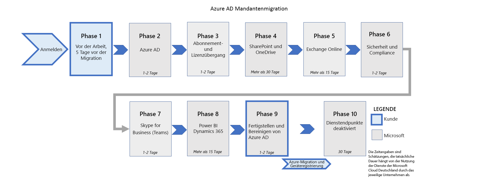

# Migration von Microsoft Cloud Deutschland zu Office 365-Diensten in den neuen deutschen RechenzentrumsregionenMigration from Microsoft Cloud Deutschland to Office 365 services in the new German datacenter regions

> [!NOTE]
> Dieser Artikel gilt nur für anspruchsberechtigte Kunden von Microsoft Cloud Deutschland.This article only applies to eligible Microsoft Cloud Deutschland customers.

Im August 2018 hat Microsoft die Absicht angekündigt, die gesamte Microsoft-Cloud – Azure, Office 365, Dynamics 365 und Power Platform – aus neuen Cloud-Regionen in Deutschland bereitzustellen, um die digitale Transformation seiner Kunden noch besser zu unterstützen.In August 2018, Microsoft announced our intention to deliver the complete Microsoft cloud – Azure, Office 365, Dynamics 365, and Power Platform – from new cloud regions in Germany to better enable the digital transformation of our customers. Im August 2019 haben wir angekündigt, dass wir die neuen Cloud-Regionen in Deutschland für erste Kunden eröffnen.In August 2019, we announced we are now in the process of opening of the new cloud regions in Germany. Wir haben seitdem die Verfügbarkeit von Azure, Office 365, Dynamics 365 und Power Platform angekündigt.We have since announced the availability of Azure, Office 365, Dynamics 365, and Power Platform.

Die neuen Regionen sind für die Anpassung an die sich ständig verändernden Anforderungen deutscher Kunden ausgelegt und bieten größere Flexibilität, die neuesten intelligenten Cloud-Dienste und die umfassende Verbindung zu unserem Microsoft 365 Cloud-Netzwerk sowie Kundendatenhaltung in Deutschland.The new regions are designed to address the evolving needs of German customers with greater flexibly, the latest intelligent cloud services, and full connectivity to our Microsoft 365 services cloud network as well as customer data residency within Germany.

## Migration zu den neuen deutschen RechenzentrumsregionenHow to migrate to the new German datacenter regions

Bestehende Kunden der Microsoft Cloud Deutschland können nun mit der Migration ihrer Office 365-, Dynamics 365 Customer Engagement- und Power Platform-Kunden beginnen.Existing Microsoft Cloud Deutschland customers can now begin to migrate their Office 365, Dynamics 365 Customer Engagement, and Power Platform customers. Der erste Schritt besteht darin, [sich für eine von Microsoft geleitete Migration in unsere neuen deutschen Rechenzentrumsregionen anzumelden](https://aka.ms/office365germanymoveoptin).The first step is to [opt-in to a Microsoft-led migration](https://aka.ms/office365germanymoveoptin) to our new German datacenter regions.

Die Migrationen für Organisationen, die sich für die durch Microsoft geleitete Migration anmelden, werden voraussichtlich Anfang 2021 starten und bis zum 29. Oktober 2021 abgeschlossen sein.For organizations who opt-in to the Microsoft-driven approach, migrations are expected to begin in early 2021 and will be completed by October 29, 2021. Als Ergebnis der Migration werden die wichtigsten Kundendaten und -abonnements in die neuen deutschen Rechenzentrumsregionen verschoben.As a result of the migration, core customer data and subscriptions are moved to the new German regions.

Dieser Artikel enthält eine Übersicht über die durch Microsoft durchgeführte Migration, Details zu den Erfahrungen für Benutzer und Administratoren während und nach der Migration sowie zu Aktionen, die für Kunden basierend auf den von Ihnen verwendeten Arbeitslasten erforderlich sind.This article provides an overview of the Microsoft-driven approach for the migration, clarity on the experiences for both users and admins during and after migration, and actions that may be required for customers based on which workloads you utilize.

Die folgenden Dienste werden im Rahmen der Migration durch Microsoft migriert:The following services will be migrated as part of the Microsoft-driven approach:

- Azure Active Directory (Azure AD)Azure Active Directory (Azure AD)
- Exchange OnlineExchange Online
- Exchange Online ProtectionExchange Online Protection
- SharePoint OnlineSharePoint Online
- OneDrive for BusinessOneDrive for Business

- Skype for Business Online\*\*Skype for Business Online\*\*
- Office 365-GruppenOffice 365 Groups
- Dynamics 365 / Power Platform\*\*\*Dynamics 365 / Power Platform\*\*\*

\*\*Während der Migration von Microsoft Cloud Deutschland in die deutschen Rechenzentrumsregionen werden bestehende Skype for Business Online-Kunden auf Microsoft Teams umgestellt.\*\*During the migration from Microsoft Cloud Deutschland to the German datacenter regions, existing Skype for Business Online customers will transition to Microsoft Teams. Weitere Informationen finden Sie unter [Erste Schritte mit dem Microsoft Teams-Upgrade](https://aka.ms/SkypeToTeams-Home).See [Getting started with your Microsoft Teams upgrade](https://aka.ms/SkypeToTeams-Home) for more information.

\*\*\*Die Voraussetzungen und Auswirkungen der Migration für diese Dienste sind im Artikel [Dynamics 365 Customer Engagement](https://aka.ms/D365ceOptIn) beschrieben.\*\*\*Prerequisites and impact of migration for these services are described in the [Dynamics 365 Customer engagement](https://aka.ms/D365ceOptIn) article.

Office 365 Video wird am 1. März 2021 eingestellt.Office 365 Video is being retired on March 1, 2021. Wenn Sie Ihren Office 365-Mandanten in die Regionen der neuen deutschen Rechenzentren migrieren, wird Office 365 Video nach Abschluss der SharePoint Online-Migration nicht unterstützt.If you choose to migrate your Office 365 tenant to the new German datacenter regions, Office 365 Video will not be supported after the SharePoint Online migration is completed. Weitere Informationen finden Sie unter [Microsoft Cloud Deutschland-Zeitachse](https://docs.microsoft.com/stream/migrate-from-office-365#microsoft-cloud-deutschland-timeline).For more information, see [Microsoft Cloud Deutschland timeline](https://docs.microsoft.com/stream/migrate-from-office-365#microsoft-cloud-deutschland-timeline).

## Wie ist die Migration organisiert?How is the migration organized?

Diese Abbildung zeigt die neun Phasen der Migration in die neuen deutschen Rechenzentren.This figure shows the nine phases of migration to the new German datacenters.

Diese Phasen beginnen mit Ihrer [Anmeldung für die Migration](https://aka.ms/office365germanymoveoptin).These phases start when you [opt-in for migration](https://aka.ms/office365germanymoveoptin). Die meisten Migrationsphasen werden nach und nach als Back-End-Dienstvorgänge durchgeführt, bei denen nur wenige Kundeninteraktionen erforderlich sind.Most of the migration phases are executed as back-end service operations with minimal customer interaction required and are executed one phase after the other. Ab wann Maßnahmen auf Kundenseite erforderlich sind sowie der allgemeine Stand der Migration werden während des Migrationsprozesses über das Nachrichtencenter des Microsoft 365 Admin Centers mitgeteilt.The start for additional customer-led tasks and overall migration status will be communicated through the Message center of the Microsoft 365 admin center during the migration process. Zu den kundenseitig erforderlichen Maßnahmen zählen beispielsweise durch Kunden verwaltete DNS-Updates, die Neukonfiguration des Hybrid-Setups für Kunden von Exchange-Hybridlösungen oder Azure-Migrationen.Example of tasks may include customer-managed DNS updates, reconfiguration of hybrid setup for Exchange hybrid customers, or Azure migration.

Die Migration beginnt nicht unmittelbar bei der Anmeldung.Migration does not immediately begin when opt-in occurs. Ihre Organisation wird der Liste von Mandanten hinzugefügt, die für eine spätere Migration geplant sind.Your organization is added to the list of tenants that are scheduled for later migration. Sie können mit den Vorbereitungsphasen jetzt beginnen, da diese für eine erfolgreiche Migration und anschließende Nutzung wesentlich sind:You can begin the pre-work phases now as these are critical to ensure successful migration and usage upon completion:

- [Phasen, Aktionen und Auswirkungen der MigrationMigration phases actions and impacts](ms-cloud-germany-transition-phases.md)
- [Zusätzliche VorarbeitAdditional pre-work](ms-cloud-germany-transition-add-pre-work.md)

Eine Woche vor Beginn der Mandantenmigration erhalten Sie im Nachrichtencenter-Dienst eine Benachrichtigung, mit der Sie ein letztes Mal darauf hingewiesen werden, dass alle Voraussetzungen erfüllt sein müssen.One week prior to the start of the tenant migration, you will receive notice in the Message center service as a final warning that all prerequisites must be complete.

Bei der Migration wird Ihr Azure AD-Mandant vom unabhängigen Azure AD-Dienst Deutschland in die Office 365-Dienste-Instanz von Azure AD in der europäischen Region verlagert.The migration will move of your Azure AD tenant from the sovereign Germany Azure AD service to the Office 365 services instance of Azure AD in the EU region.

Die nächste Phase besteht in der Migration der Abonnements und Benutzerlizenzen Ihres Mandanten für Deutschland-spezifische Produkte in globale Produkte.The next phase is the migration of your tenant&#39;s subscriptions and user licenses from Germany-specific products to global products.

Sobald alle Schritte einschließlich der Azure Kunden-Migration durchgeführt wurden, wird Ihr Mandant im Office 365 Services-Dienst finalisiert und die Migration als abgeschlossen gekennzeichnet.Once all steps are completed including customer Azure migration, your tenant is finalized in the Office 365 services service and migration is marked complete. An diesem Punkt erhalten Sie eine abschließende Benachrichtigung im Nachrichtencenter.At this point, the final update to Message center is provided to you. Der Mandant ist nun eine vollständig globale Office 365-Organisation.The tenant is now a fully global Office 365 organization.

Sie werden mittels Nachichtencenter-Mitteilungen über den Status der Migration informiert.You are notified of migration progress with Message center posts. Die Mitteilungen erfolgen anlässlich bestimmter Meilensteine und bieten Orientierungshilfe zum Fortschritt eines Schritts sowie wichtige Informationen für kundenseitige Maßnahmen auf der Grundlage der Prozessanforderungen.The posts will occur at specific milestones and will provide guidance as to progress of a step as well as important information for customers to act on based on the process requirements. Nachrichtencenter-Mitteilungen werden anlässlich der folgenden Meilensteine bereitgestellt:Message center notifications are provided at the following milestones:

- Beginn der Migration (5 Werktage vor Beginn der Azure AD-Migration)Start of migration (5 business days before Azure AD migration begins)
- Azure AD-Migration abgeschlossenAzure AD migration complete
- Abonnement- und Lizenzmigration abgeschlossenSubscription and license migration complete
- SharePoint-Migration abgeschlossenSharePoint migration complete
- Exchange-Migration abgeschlossenExchange migration complete
- Skype for Business abgeschlossenSkype for Business complete
- Dynamics abgeschlossenDynamics complete
- Power BI abgeschlossenPower BI complete
- Endgültige Umstellung der Dienste abgeschlossenFinal cutover of services is complete

## Verschiebung in die neuen deutschen RechenzentrumsregionenMoving to the new German datacenter regions

Microsoft Cloud Deutschland-Bestandskunden können nun mit der Migration ihrer Office 365-, Dynamics 365 Customer Engagement- und Power Platform-Diensten beginnen.Existing Microsoft Cloud Deutschland customers can now begin to migrate their Office 365, Dynamics 365 Customer Engagement, and Power Platform services. Der erste Schritt besteht darin, [sich für eine von Microsoft geleitete Migration in unsere neuen deutschen Rechenzentrumsregionen anzumelden](https://aka.ms/office365germanymoveoptin).The first step is to [opt-in to a Microsoft-led migration](https://aka.ms/office365germanymoveoptin) to our new German datacenter regions. Wenn Sie Ihr Abonnement verlängern, melden Sie sich automatisch für eine von Microsoft geleitete Migration an.When you renew your subscription, you automatically opt-in for a Microsoft-assisted migration. Microsoft wird in diesem Fall die Mandantenadministratoren von Kunden per E-Mail und im Nachrichtencenter des Microsoft 365 Admin Centers darüber benachrichtigen.Microsoft will notify customer tenant administrators with e-mail and in the Message center of the Microsoft 365 admin center when this has happened. Wenn Sie es jedoch vorziehen, den Vorgang jetzt zu starten, können Sie direkt im Microsoft 365 Admin Center sofort [das Opt-In vornehmen](https://aka.ms/office365germanymoveoptin).However, if you prefer to start the process now, you can [opt-in](https://aka.ms/office365germanymoveoptin) directly in Microsoft 365 admin center today. Die Migrationen werden voraussichtlich Anfang 2021 beginnen und bis zum 29. Oktober 2021 abgeschlossen sein.Migrations are expected to begin in early 2021 and will be completed by October 29, 2021. 

Als Ergebnis der Migration werden die wichtigsten Kundendaten und -abonnements in die neuen deutschen Rechenzentrumsregionen verschoben.As a result of the migration, core customer data and subscriptions are moved to the new German datacenter regions.

## Vorbereitung auf die Migration zu Office 365-Diensten in den neuen deutschen RechenzentrumsregionenHow to prepare for migration to Office 365 services in the new German datacenter regions

Der erste Schritt besteht darin, Microsoft zu benachrichtigen, sodass wir über Ihr Einverständnis zum Migrieren Ihres Abonnements und Ihrer Daten aus der Microsoft-Cloud Deutschland zu Office 365-Diensten in den neuen deutschen Rechenzentrumsregionen verfügen.The first step is to notify Microsoft so that we have your permission to migrate your subscription and data from Microsoft Cloud Deutschland to Office 365 services in the new German datacenter regions. Anweisungen hierzu finden Sie auf der Seite zum [Opt-In-Vorgang](https://aka.ms/office365germanymoveoptin). Bitte beachten Sie Folgendes:Please refer to the [opt-in process](https://aka.ms/office365germanymoveoptin) for instructions and note that:

- Alle Kunden mit Migrationsbedarf müssen die Verbindung zu den [Office 365-URLs und -IP-Adressen](urls-and-ip-address-ranges.md) der Office 365-Dienste überprüfen, die die neuen deutschen Rechenzentrumsregionen umfassen.All migrating customers need to verify connectivity to the Office 365 Services [Office 365 URLs and IP addresses](urls-and-ip-address-ranges.md), which include the new German datacenter regions. Diesbezügliche Untätigkeit kann zu Dienst- und Clientfehlern führen.Inaction may result in service and client failure.
- Überprüfen Sie die Liste der [Vorarbeiten](ms-cloud-germany-transition-add-pre-work.md), um sicherzustellen, dass Ihre Organisation informiert und auf die Änderungen vorbereitet ist.Review the list of [pre-work](ms-cloud-germany-transition-add-pre-work.md) activities to ensure your organization is informed and prepared for the changes.
- Lesen Sie die Beschreibung der Office 365-Plattformdienste, um sich ein Bild davon zu machen, welche Funktionen und Dienste nach der Migration in die deutsche Rechenzentrumsregion für Ihre Organisation verfügbar sein werden.You should review the Office 365 platform service description to understand which features and services will become available to your organization following the migration to the German region.
- Testabonnements werden nicht migriert und blockieren die Migration aller kostenpflichtigen Abonnements.Trial subscriptions will not be migrated and will block migration of all paid subscriptions. Sie müssen vor dem Beginn der Migration alle Testabos stornieren oder in kostenpflichtige Abonnements umwandeln.You must cancel any trials or convert to paid subscriptions before migration begins.

## Weitere SchritteWhere do I go from here?

Lesen Sie den folgenden Abschnitt mit Antworten auf häufig gestellte Fragen.Review the following Frequently Asked Questions section.

## Häufig gestellte FragenFrequently Asked Questions

### Ist die Migration erforderlich?Is migration required?

Microsoft bietet eine Mandantenmigration für Office 365 von Microsoft Cloud Deutschland zu Office 365-Diensten in den neuen deutschen Rechenzentrumsregionen ohne Aufpreis.Microsoft offers Office 365 tenant migration from Microsoft Cloud Deutschland to Office 365 services in the new German datacenter regions at no additional charge. Wir empfehlen Ihnen dringend, sich für die Migration zu den neuen deutschen Rechenzentrumsregionen anzumelden, aber wir werden weiterhin die erforderlichen Sicherheitsupdates für die Region „Microsoft Cloud Deutschland“ bereitstellen.While we do strongly recommend that you opt-in to migrate to the new German datacenter regions, we will continue to provide the necessary security updates to the Microsoft Cloud Deutschland region.

Merkmale der Office 365-Dienste in den neuen deutschen Rechenzentrumsregionen:Office 365 services in the new German datacenter regions:

- Sie bieten marktgerechte Preise für [Azure](https://azure.microsoft.com/pricing/calculator/), [Office 365](https://www.microsoft.com/microsoft-365/business/compare-more-office-365-for-business-plans), [Dynamics 365 Customer Engagement](https://dynamics.microsoft.com/pricing/)und [Power BI](https://powerbi.microsoft.com/pricing/).Offer market competitive pricing for [Azure](https://azure.microsoft.com/pricing/calculator/), [Office 365](https://www.microsoft.com/microsoft-365/business/compare-more-office-365-for-business-plans), [Dynamics 365 Customer Engagement](https://dynamics.microsoft.com/pricing/), and [Power BI](https://powerbi.microsoft.com/pricing/).
- Sie sind mit dem globalen Microsoft-Netzwerk verbunden und bieten eine Vielzahl von Netzwerk-Edge-Sites, Peering-Standorten und Übergabepunkten, um überall auf der Welt eine verlässliche Benutzererfahrung zur ermöglichen.Are connected to Microsoft&#39;s global network, offering hundreds of network edge sites, peering locations, and egress points to deliver a robust user experience anywhere in the world.
- Sie helfen Ihnen, Anforderungen im Hinblick auf die lokale Kundendatenhaltung innerhalb von Deutschland zu erfüllen.Help you meet local customer data residency requirements within Germany.
- Sie bieten Zugriff auf unser umfassendes globales Cloud-Angebot, einschließlich der neuesten Versionen unserer Dienste und neuer Lösungen wie Microsoft Teams und Multi-Geo in Office 365.Deliver our full-featured global cloud offering with the latest versions of our services and new capabilities including Microsoft Teams and Multi-Geo in Office 365. Hier finden Sie die Vergleiche unserer Produkte nach Region für [Azure](https://azure.microsoft.com/global-infrastructure/services/?products=all&amp;regions=germany-non-regional,germany-central,germany-north,germany-northeast,germany-west-central), [Office 365](o365-data-locations.md) und [Dynamics 365](https://docs.microsoft.com/dynamics365/get-started/availability).Compare products by region for [Azure](https://azure.microsoft.com/global-infrastructure/services/?products=all&amp;regions=germany-non-regional,germany-central,germany-north,germany-northeast,germany-west-central), [Office 365](o365-data-locations.md), and [Dynamics 365](https://docs.microsoft.com/dynamics365/get-started/availability).
- Sie bieten die vollständige Funktionalität, Sicherheit auf Unternehmensniveau und umfassende Funktionen, die Kunden bei der Einhaltung behördlicher oder eigener Vorschriften unterstützen.Offer full functionality, enterprise-grade security, and comprehensive features to help customers meet compliance and regulatory requirements.
- Sie sind im Rahmen vorhandener Verträge für Onlinedienstleistungen verfügbar.Are accessible through existing online services contracts.

### Wie hoch ist die Dienstverfügbarkeit der verschiedenen Office 365-Clouddienstangebote?What is the service availability between the different Office 365 cloud service offerings?
<h2 id="serv-avail"></h2>

Die folgenden 15 Dienste sind im Clouddienstangebot von Microsoft Cloud Deutschland verfügbar.The following 15 services are available in the Microsoft Cloud Deutschland cloud service offering. Microsoft Cloud Deutschland werden keine neuen Dienste hinzugefügt.We are not adding new services to Microsoft Cloud Deutschland.

1. Exchange OnlineExchange Online
2. Kunden-Lockbox (Exchange Online)Customer Lockbox (Exchange Online)
3. Gruppen (moderne Gruppen)Groups (Modern groups)
4. Delve-ProfilDelve Profile
5. Exchange Online ProtectionExchange Online Protection
6. Microsoft Defender für Office 365Defender for Office 365
7. Advanced eDiscoveryAdvanced eDiscovery
8. Advanced Data GovernanceAdvance Data Governance
9. SharePoint OnlineSharePoint Online
10. Kunden-Lockbox (SharePoint Online)Customer Lockbox (SharePoint Online)
11. OneDrive for BusinessOneDrive for Business
12. Skype for Business OnlineSkype for Business Online
13. Word Online, Excel Online, PowerPoint, OneNote, Visio OnlineWord Online, Excel Online, PowerPoint, OneNote, Visio Online
14. Office 365 ProPlusOffice 365 Pro Plus
15. Outlook MobileOutlook Mobile

Derzeit sind 39 Dienste als Bestandteil von Office 365-Diensten in den neuen deutschen Rechenzentrumsregionen verfügbar.There are currently 39 services available as part of Office 365 services in the new German datacenter regions. In Übereinstimmung mit den globalen Office 365-Diensten werden fortlaufend neue Features und Dienste bereitgestellt.New features and services will be available consistent with global Office 365 services on an ongoing basis.

1. Exchange OnlineExchange Online
2. Kunden-Lockbox für Exchange OnlineCustomer Lockbox for Exchange Online
3. Microsoft 365-GruppenMicrosoft 365 groups
4. Delve-ProfilDelve Profile
5. MyAnalyticsMyAnalytics
6. Workplace AnalyticsWorkplace Analytics
7. Exchange Online ProtectionExchange Online Protection
8. Microsoft Defender für Office 365Defender for Office 365
9. Advanced eDiscoveryAdvanced eDiscovery
10. Advanced Security ManagementAdvanced Security Management
11. Schutz von Informationen für Office 365Information Protection for Office 365 
12. Advanced Data GovernanceAdvance Data Governance
13. SharePoint OnlineSharePoint Online
14. Kunden-Lockbox für SharePoint OnlineCustomer Lockbox for SharePoint Online
15. OneDrive for BusinessOneDrive for Business
16. Microsoft StreamMicrosoft Stream
17. Skype for Business (während der Migration erfolgt ein Wechsel zu Microsoft Teams)Skype for Business (will migrate to Microsoft Teams during the migration)
18. Cloud PBXCloud PBX
19. PSTN-KonferenzenPSTN Conferencing
20. PSTN-AnrufePSTN calling
21. Microsoft TeamsMicrosoft Teams
22. Administrator-Berichte/ VerwendungsberichteAdmin Reports / Usage Reports
23. Office für das WebOffice for the web
24. PlannerPlanner
25. SwaySway
26. Microsoft 365 AppsMicrosoft 365 Apps
27. Outlook MobileOutlook Mobile
28. Enterprise Mobility + Security (EMS) E3 (Azure AD Premium P1, Intune und Rights Management Service)Enterprise Mobility + Security (EMS) E3 (Azure AD Premium P1, Intune, and Rights Management Service)
29. Yammer EnterpriseYammer Enterprise
30. Microsoft FormsMicrosoft Forms
31. Power BI für Office 365Power Automate for Office 365
32. Power Virtual Agents für Office 365Power Virtual Agents for Office 365
33. PowerApps für Office 365PowerApps for Office 365
34. Microsoft BookingsMicrosoft Bookings
35. To-DoTo-Do
36. WhiteboardWhiteboard
37. Microsoft StuffHubMicrosoft StuffHub
38. Microsoft Kaizala ProMicrosoft Kaizala Pro
39. ListenLists

### Wann wird die Migration durchgeführt?When will migration happen?

**Azure****Azure**

Wenn Sie nur Azure-Kunde sind, können Sie bereits mit der [Migration](https://docs.microsoft.com/azure/germany/germany-migration-main) Ihrer Azure-Ressourcen beginnen.If you are an Azure customer only, you can begin [migrating](https://docs.microsoft.com/azure/germany/germany-migration-main) your Azure resources to another region today. 

Wenn Sie Azure mit Office 365, Dynamics 365 oder Power BI verwenden, müssen Sie den Migrationsprozess befolgen, um eine erfolgreiche AzureAD-Migration sicherzustellen, bevor Sie die selbstgesteuerte Azure-Migration beginnen.If you have Azure with Office 365, Dynamics 365, or Power BI, you must follow the migration process to ensure successful migration AzureAD before you begin the self-directed Azure migration. Sie müssen die Azure-Migration vor der Dienstschließung abschließen, um Ihre Azure-Workloads mit Ihrer AzureAD- und Office 365-Organisation beizubehalten.You must complete the Azure migration before the service closure in order to maintain your Azure workloads with your AzureAD, and Office 365 organization.

**Office 365****Office 365**

[Melden Sie sich noch heute für von Microsoft gesteuerte Migration an](https://aka.ms/office365germanymoveoptin).[Opt-in](https://aka.ms/office365germanymoveoptin) to the Microsoft-driven migration today. Sobald wir bereit sind, Ihre Migration zu starten, werden wir Sie darüber über das Nachrichtencenter im Microsoft 365 Admin Center informieren.When we are ready to start your migration, we will inform you through the Message center in the Microsoft 365 admin center.

**Dynamics 365 und Power BI****Dynamics 365 and Power BI**

Melden Sie sich noch heute für die von Microsoft gesteuerte Migration für [Dynamics 365 Customer Engagement](https://aka.ms/D365ceOptIn) und [Power BI](https://aka.ms/pbioptin) an.Opt-in to the Microsoft-driven migration for [Dynamics 365 Customer Engagement](https://aka.ms/D365ceOptIn) and [Power BI](https://aka.ms/pbioptin) today. Sobald wir bereit sind, Ihre Migration zu starten, werden wir Sie darüber über das Nachrichtencenter im Microsoft 365 Admin Center informieren.When we are ready to start your migration, we will inform you through the Message center in the Microsoft 365 admin center.

### Werden sich die Preise für die von mir verwendeten Office 365-Dienste ändern?Will the price change for the Office 365 services that I use?

Ja.Yes. Die Preise in den globalen Microsoft Cloud-Regionen (einschließlich der neuen Rechenzentrumsregionen) sind im Allgemeinen niedriger.Pricing in Microsoft&#39;s global cloud regions (including the new datacenter regions) is generally lower.

### Welche SKUs und Lizenzen werden während der Abonnementmigration auf meine Organisation und ihre Benutzer angewendet?During the subscription migration, what SKUs and Licenses will be applied to my organization and users?

Während der Migration von Microsoft Cloud Deutschland zu den Office 365-Diensten werden die servicespezifischen SKUs für Deutschland durch globale Versionen derselben oder ähnlicher SKUs ersetzt.During the migration from Microsoft Cloud Deutschland to the Office 365 services, the Germany service-specific SKUs are replaced with global versions of the same or similar SKU. In den meisten Fällen ist die SKU in Office 365-Diensten identisch, es gibt jedoch einige wenige SKUs, die in Deutschland in den Office 365-Diensten nicht mehr verfügbar sind und ersetzt werden.For the majority of cases, the SKU in Office 365 services is the same however there are few replacements where the SKU in Germany is no longer available in the Office 365 services. Wenn Sie die Ihrer Organisation zugewiesene SKU nach Abschluss der Migration aktualisieren möchten, wenden Sie sich an Ihren Händler, um die zugeordneten Dienste hinzuzufügen oder zu ändern.If you wish to update the SKU assigned to your organization after the migration is complete, contact your seller to add or modify the services assigned.

| Microsoft Cloud Deutschland – Produkt-SKU (DE)Microsoft Cloud Deutschland - Product SKU (DE) | Microsoft Cloud Global – Produkt-SKU (WW)Microsoft Cloud Global - Product SKU (WW) |
| --- | --- |
| Kunden-Lockbox\_DE (LOCKBOX\_DE)Customer Lockbox\_DE (LOCKBOX\_DE) | Kunden-Lockbox (LOCKBOX)Customer Lockbox (LOCKBOX) |
| Dynamics 365 Enterprise Edition – Zusätzlicher Datenbankspeicher\_DE (CRMSTORAGE\_DE)Dynamics 365 Enterprise Edition - Additional Database Storage\_DE (CRMSTORAGE\_DE) | Dynamics 365 Enterprise Edition – Zusätzlicher Datenbankspeicher (CRMSTORAGE)Dynamics 365 Enterprise Edition - Additional Database Storage (CRMSTORAGE) |
| Dynamics 365 Enterprise Edition – Zusätzliche nicht produktionsbezogene Instanz\_DE (CRMTESTINSTANCE\_DE)Dynamics 365 Enterprise Edition - Additional Non-Production Instance\_DE (CRMTESTINSTANCE\_DE) | Dynamics 365 Enterprise Edition – Zusätzliche nicht produktionsbezogene Instanz (CRMTESTINSTANCE)Dynamics 365 Enterprise Edition - Additional Non-Production Instance (CRMTESTINSTANCE) |
| Dynamics 365 for Customer Service Enterprise Edition\_DE (DYN365\_ENTERPRISE\_CUSTOMER\_SERVICE\_DE)Dynamics 365 for Customer Service Enterprise Edition\_DE (DYN365\_ENTERPRISE\_CUSTOMER\_SERVICE\_DE) | Dynamics 365 for Customer Service Enterprise Edition (DYN365\_ENTERPRISE\_CUSTOMER\_SERVICE)Dynamics 365 for Customer Service Enterprise Edition (DYN365\_ENTERPRISE\_CUSTOMER\_SERVICE) |
| Dynamics 365 for Sales Enterprise Edition\_DE (DYN365\_ENTERPRISE\_SALES\_DE)Dynamics 365 for Sales Enterprise Edition\_DE (DYN365\_ENTERPRISE\_SALES\_DE) | Dynamics 365 for Sales Enterprise Edition (DYN365\_ENTERPRISE\_SALES)Dynamics 365 for Sales Enterprise Edition (DYN365\_ENTERPRISE\_SALES) |
| Dynamics 365 for Team Members Enterprise Edition\_DE (DYN365\_ENTERPRISE\_TEAM\_MEMBERS\_DE)Dynamics 365 for Team Members Enterprise Edition\_DE (DYN365\_ENTERPRISE\_TEAM\_MEMBERS\_DE) | Dynamics 365 for Team Members Enterprise Edition (DYN365\_ENTERPRISE\_TEAM\_MEMBERS)Dynamics 365 for Team Members Enterprise Edition (DYN365\_ENTERPRISE\_TEAM\_MEMBERS) |
| Dynamics 365 Plan 1 Enterprise Edition \_DE (DYN365\_ENTERPRISE\_PLAN1\_DE)Dynamics 365 Plan 1 Enterprise Edition\_DE (DYN365\_ENTERPRISE\_PLAN1\_DE) | Dynamics 365 Plan 1 Enterprise Edition (DYN365\_ENTERPRISE\_PLAN1)Dynamics 365 Plan 1 Enterprise Edition (DYN365\_ENTERPRISE\_PLAN1) |
| ECAL-Dienste (EOA, EOP, DLP)\_DE (ECAL\_SERVICES\_DE)ECAL Services (EOA, EOP, DLP)\_DE (ECAL\_SERVICES\_DE) | ECAL-Dienste (EOA, EOP, DLP) (ECAL\_SERVICES)ECAL Services (EOA, EOP, DLP) (ECAL\_SERVICES) |
| Enterprise Mobility + Security E3\_DE (EMS\_DE)Enterprise Mobility + Security E3\_DE (EMS\_DE) | Enterprise Mobility + Security E3 (EMS)Enterprise Mobility + Security E3 (EMS) |
| Exchange Online (Plan 1)\_DE (EXCHANGESTANDARD\_DE)Exchange Online (Plan 1)\_DE (EXCHANGESTANDARD\_DE) | Exchange Online (Plan 1) (EXCHANGESTANDARD)Exchange Online (Plan 1) (EXCHANGESTANDARD) |
| Exchange Online (Plan 2)\_DE (EXCHANGEENTERPRISE\_DE)Exchange Online (Plan 2)\_DE (EXCHANGEENTERPRISE\_DE) | Exchange Online (Plan 2) (EXCHANGEENTERPRISE)Exchange Online (Plan 2) (EXCHANGEENTERPRISE) |
| Exchange Online-Archivierung für Exchange Online\_DE (EXCHANGEARCHIVE\_ADDON\_DE)Exchange Online Archiving for Exchange Online\_DE (EXCHANGEARCHIVE\_ADDON\_DE) | Exchange Online-Archivierung für Exchange Online (EXCHANGEARCHIVE\_ADDON)Exchange Online Archiving for Exchange Online (EXCHANGEARCHIVE\_ADDON) |
| Exchange Online-Archivierung für Exchange Server\_DE (EXCHANGEARCHIVE\_DE)Exchange Online Archiving for Exchange Server\_DE (EXCHANGEARCHIVE\_DE) | Exchange Online-Archivierung für Exchange Server (EXCHANGEARCHIVE)Exchange Online Archiving for Exchange Server (EXCHANGEARCHIVE) |
| Exchange Online Essentials\_DE (EXCHANGE\_S\_ESSENTIALS\_DE)Exchange Online Essentials\_DE (EXCHANGE\_S\_ESSENTIALS\_DE) | Exchange Online Essentials (EXCHANGE\_S\_ESSENTIALS)Exchange Online Essentials (EXCHANGE\_S\_ESSENTIALS) |
| Exchange Online Kiosk\_DE (EXCHANGEDESKLESS\_DE)Exchange Online Kiosk\_DE (EXCHANGEDESKLESS\_DE) | Exchange Online Kiosk (EXCHANGEDESKLESS)Exchange Online Kiosk (EXCHANGEDESKLESS) |
| Exchange Online Protection\_DE (EOP\_ENTERPRISE\_DE)Exchange Online Protection\_DE (EOP\_ENTERPRISE\_DE) | Exchange Online Protection (EOP\_ENTERPRISE)Exchange Online Protection (EOP\_ENTERPRISE) |
| Microsoft 365 Business Standard (O365\_BUSINESS\_PREMIUM)Microsoft 365 Business Standard (O365\_BUSINESS\_PREMIUM) | Microsoft 365 Business Standard (O365\_BUSINESS\_PREMIUM)Microsoft 365 Business Standard (O365\_BUSINESS\_PREMIUM) |
| Microsoft Dynamics CRM Live-Instanz\_DE (CRMINSTANCE\_DE)Microsoft Dynamics CRM Online Instance\_DE (CRMINSTANCE\_DE) | Microsoft Dynamics CRM Live-Instanz (CRMINSTANCE)Microsoft Dynamics CRM Online Instance (CRMINSTANCE) |
| Office 365 A1 für Lehrpersonal\_DE (STANDARDWOFFPACK\_FACULTY\_DE)Office 365 A1 for faculty\_DE (STANDARDWOFFPACK\_FACULTY\_DE) | Office 365 A1 für Lehrpersonal (STANDARDWOFFPACK\_FACULTY)Office 365 A1 for faculty (STANDARDWOFFPACK\_FACULTY) |
| Office 365 A1 für Schüler und Studenten\_DE (STANDARDWOFFPACK\_STUDENT\_DE)Office 365 A1 for students\_DE (STANDARDWOFFPACK\_STUDENT\_DE) | Office 365 A1 für Schüler und Studenten (STANDARDWOFFPACK\_STUDENT)Office 365 A1 for students (STANDARDWOFFPACK\_STUDENT) |
| Office 365 Advanced Compliance\_DE (EQUIVIO\_ANALYTICS\_DE)Office 365 Advanced Compliance\_DE (EQUIVIO\_ANALYTICS\_DE) | Microsoft 365 E5 Compliance (INFORMATION\_PROTECTION\_COMPLIANCE)Microsoft 365 E5 Compliance (INFORMATION\_PROTECTION\_COMPLIANCE) |
|Microsoft Defender für Office 365 Plan 1)\_DE (ATP\_ENTERPRISE\_DE)Microsoft Defender for Office 365 (Plan 1)\_DE (ATP\_ENTERPRISE\_DE) |Microsoft Defender für Office 365 (Plan 1) (ATP\_ENTERPRISE)Microsoft Defender for Office 365 (Plan 1) (ATP\_ENTERPRISE) |
| Office 365 Business Essentials\_DE (O365\_BUSINESS\_ESSENTIALS\_DE)Office 365 Business Essentials\_DE (O365\_BUSINESS\_ESSENTIALS\_DE) | Microsoft 365 Business Basic (O365\_BUSINESS\_ESSENTIALS)Microsoft 365 Business Basic (O365\_BUSINESS\_ESSENTIALS) |
| Office 365 Business Premium\_DE (O365\_BUSINESS\_PREMIUM\_DE)Office 365 Business Premium\_DE (O365\_BUSINESS\_PREMIUM\_DE) | Microsoft 365 Business Standard (O365\_BUSINESS\_PREMIUM)Microsoft 365 Business Standard (O365\_BUSINESS\_PREMIUM) |
| Office 365 Business\_DE (O365\_BUSINESS\_DE)Office 365 Business\_DE (O365\_BUSINESS\_DE) | Microsoft 365 Apps for Business (O365\_BUSINESS)Microsoft 365 Apps for business (O365\_BUSINESS) |
| Office 365 E1\_DE (STANDARDPACK\_DE)Office 365 E1\_DE (STANDARDPACK\_DE) | Office 365 E1 (STANDARDPACK)Office 365 E1 (STANDARDPACK) |
| Office 365 E3 ohne ProPlus\_DE (ENTERPRISEPACKWITHOUTPROPLUS\_DE)Office 365 E3 without ProPlus\_DE (ENTERPRISEPACKWITHOUTPROPLUS\_DE) | Office 365 E3 ohne ProPlus (ENTERPRISEPACKWITHOUTPROPLUS)Office 365 E3 without ProPlus (ENTERPRISEPACKWITHOUTPROPLUS) |
| Office 365 E3\_DE (ENTERPRISEPACK\_DE)Office 365 E3\_DE (ENTERPRISEPACK\_DE) | Office 365 E3 (ENTERPRISEPACK)Office 365 E3 (ENTERPRISEPACK) |
| Office 365 Enterprise E1\_DE (STANDARDPACK\_DE)Office 365 Enterprise E1\_DE (STANDARDPACK\_DE) | Office 365 Enterprise E1 (STANDARDPACK)Office 365 Enterprise E1 (STANDARDPACK) |
| Office 365 Enterprise E3\_DE (ENTERPRISEPACK\_DE)Office 365 Enterprise E3\_DE (ENTERPRISEPACK\_DE) | Office 365 Enterprise E3 (ENTERPRISEPACK)Office 365 Enterprise E3 (ENTERPRISEPACK) |
| Office 365 Extra File Storage\_DE (SHAREPOINTSTORAGE\_DE)Office 365 Extra File Storage\_DE (SHAREPOINTSTORAGE\_DE) | Office 365 Extra File Storage (SHAREPOINTSTORAGE)Office 365 Extra File Storage (SHAREPOINTSTORAGE) |
| Office 365 F1\_DE (DESKLESSPACK\_DE)Office 365 F1\_DE (DESKLESSPACK\_DE) | Office 365 F1 (DESKLESSPACK)Office 365 F1 (DESKLESSPACK) |
| Office 365 ProPlus für Lehrpersonal\_DE (OFFICESUBSCRIPTION\_FACULTY\_DE)Office 365 ProPlus for Faculty\_DE (OFFICESUBSCRIPTION\_FACULTY\_DE) | Office 365 ProPlus für Lehrpersonal (OFFICESUBSCRIPTION\_FACULTY)Office 365 ProPlus for Faculty (OFFICESUBSCRIPTION\_FACULTY) |
| Office 365 ProPlus für Schüler und Studenten\_DE (OFFICESUBSCRIPTION\_STUDENT\_DE)Office 365 ProPlus for Students\_DE (OFFICESUBSCRIPTION\_STUDENT\_DE) | Office 365 ProPlus für Schüler und Studenten (OFFICESUBSCRIPTION\_STUDENT)Office 365 ProPlus for Students (OFFICESUBSCRIPTION\_STUDENT) |
| Office 365 ProPlus\_DE (OFFICESUBSCRIPTION\_DE)Office 365 ProPlus\_DE (OFFICESUBSCRIPTION\_DE) | Office 365 ProPlus (OFFICESUBSCRIPTION)Office 365 ProPlus (OFFICESUBSCRIPTION) |
| OneDrive for Business (Plan 1)\_DE (WACONEDRIVESTANDARD\_DE)OneDrive for Business (Plan 1)\_DE (WACONEDRIVESTANDARD\_DE) | OneDrive for Business (Plan 1) (WACONEDRIVESTANDARD)OneDrive for Business (Plan 1) (WACONEDRIVESTANDARD) |
| OneDrive for Business (Plan 2)\_DE (WACONEDRIVEENTERPRISE\_DE)OneDrive for Business (Plan 2)\_DE (WACONEDRIVEENTERPRISE\_DE) | OneDrive for Business (Plan 2) (WACONEDRIVEENTERPRISE)OneDrive for Business (Plan 2) (WACONEDRIVEENTERPRISE) |
| Power BI Pro für Lehrpersonal\_DE (POWER\_BI\_PRO\_FACULTY\_DE)Power BI Pro for faculty\_DE (POWER\_BI\_PRO\_FACULTY\_DE) | Power BI Pro für Lehrpersonal (POWER\_BI\_PRO\_FACULTY)Power BI Pro for faculty (POWER\_BI\_PRO\_FACULTY) |
| Power BI Pro\_DE (POWER\_BI\_PRO\_DE)Power BI Pro\_DE (POWER\_BI\_PRO\_DE) | Power BI Pro (POWER\_BI\_PRO)Power BI Pro (POWER\_BI\_PRO) |
| Project Online Essentials\_DE (PROJECTESSENTIALS\_DE)Project Online Essentials\_DE (PROJECTESSENTIALS\_DE) | Project Online Essentials (PROJECTESSENTIALS)Project Online Essentials (PROJECTESSENTIALS) |
| Project Online Premium\_DE (PROJECTPREMIUM\_DE)Project Online Premium\_DE (PROJECTPREMIUM\_DE) | Project Online Premium (PROJECTPREMIUM)Project Online Premium (PROJECTPREMIUM) |
| Project Online Professional\_DE (PROJECTPROFESSIONAL\_DE)Project Online Professional\_DE (PROJECTPROFESSIONAL\_DE) | Project Online Professional (PROJECTPROFESSIONAL)Project Online Professional (PROJECTPROFESSIONAL) |
| Project Plan 3\_DE (PROJECTPROFESSIONAL\_DE)Project Plan 3\_DE (PROJECTPROFESSIONAL\_DE) | Project Plan 3 (PROJECTPROFESSIONAL)Project Plan 3 (PROJECTPROFESSIONAL) |
| Office 365 E4\_DE (ENTERPRISEWITHSCAL\_DE)Office 365 E4\_DE (ENTERPRISEWITHSCAL\_DE) | Office 365 E3 (ENTERPRISEPACK)Office 365 E3 (ENTERPRISEPACK) |
| SharePoint Online (Plan 1)\_DE (SHAREPOINTSTANDARD\_DE)SharePoint Online (Plan 1)\_DE (SHAREPOINTSTANDARD\_DE) | SharePoint Online (Plan 1) (SHAREPOINTSTANDARD)SharePoint Online (Plan 1) (SHAREPOINTSTANDARD) |
| SharePoint Online (Plan 2)\_DE (SHAREPOINTENTERPRISE\_DE)SharePoint Online (Plan 2)\_DE (SHAREPOINTENTERPRISE\_DE) | SharePoint Online (Plan 2) (SHAREPOINTENTERPRISE)SharePoint Online (Plan 2) (SHAREPOINTENTERPRISE) |
| Skype for Business Online (Plan 1)\_DE (MCOIMP\_DE)Skype for Business Online (Plan 1)\_DE (MCOIMP\_DE) | Office 365 E1 (STANDARDPACK)Office 365 E1 (STANDARDPACK) |
| Skype for Business Online (Plan 1)\_DE (MCOIMP\_DE)Skype for Business Online (Plan 1)\_DE (MCOIMP\_DE) | Skype for Business Online (Plan 1) (MCOIMP)Skype for Business Online (Plan 1) (MCOIMP) |
| Skype for Business Online (Plan 2)\_DE (MCOSTANDARD\_DE)Skype for Business Online (Plan 2)\_DE (MCOSTANDARD\_DE) | Skype for Business Online (Plan 2) (MCOSTANDARD)Skype for Business Online (Plan 2) (MCOSTANDARD) |
| Skype for Business Plus CAL\_DE (MCOPLUSCAL\_DE)Skype for Business Plus CAL\_DE (MCOPLUSCAL\_DE) | Skype for Business Plus CAL (MCOPLUSCAL)Skype for Business Plus CAL (MCOPLUSCAL) |
| Visio Online Plan 1 für Lehrpersonal\_DE (VISIOONLINE\_PLAN1\_FAC\_DE)Visio Online Plan 1 for faculty\_DE (VISIOONLINE\_PLAN1\_FAC\_DE) | Visio Online Plan 1 für Lehrpersonal (VISIOONLINE\_PLAN1\_FAC)Visio Online Plan 1 for faculty (VISIOONLINE\_PLAN1\_FAC) |
| Visio Online Plan 1\_DE (VISIOONLINE\_PLAN1\_DE)Visio Online Plan 1\_DE (VISIOONLINE\_PLAN1\_DE) | Visio Online Plan 1 (VISIOONLINE\_PLAN1)Visio Online Plan 1 (VISIOONLINE\_PLAN1) |
| Visio Online Plan 2 für Lehrpersonal\_DE (VISIOCLIENT\_FACULTY\_DE)Visio Online Plan 2 for faculty\_DE (VISIOCLIENT\_FACULTY\_DE) | Visio Online Plan 2 für Lehrpersoanl (VISIOCLIENT\_FACULTY)Visio Online Plan 2 for faculty (VISIOCLIENT\_FACULTY) |
| Visio Online Plan 2\_DE (VISIOCLIENT\_DE)Visio Online Plan 2\_DE (VISIOCLIENT\_DE) | Visio Online Plan 2 (VISIOCLIENT)Visio Online Plan 2 (VISIOCLIENT) |
| Visio Plan 1\_DE (VISIOONLINE\_PLAN1\_DE)Visio Plan 1\_DE (VISIOONLINE\_PLAN1\_DE) | Visio Plan 1 (VISIOONLINE\_PLAN1)Visio Plan 1 (VISIOONLINE\_PLAN1) |
| Visio Plan 2\_DE (VISIOCLIENT\_DE)Visio Plan 2\_DE (VISIOCLIENT\_DE) | Visio Plan 2 (VISIOCLIENT)Visio Plan 2 (VISIOCLIENT) |
|||

### Wie erhalte ich Hilfe von Microsoft, um zu einer neuen Region zu migrieren, oder Antworten auf meine Support-Fragen?How do I get help from Microsoft to migrate to a new region or answer support questions?

Wenden Sie sich bei Fragen an uns oder an Ihren Partner:If you have questions, you can contact us or your partner:

- Bei Fragen zu Azure können Sie [neue Supportanfragen](https://portal.microsoftazure.de/#blade/Microsoft_Azure_Support/HelpAndSupportBlade/newsupportrequest) im Azure-Portal einreichen.For Azure, you can submit [new support requests](https://portal.microsoftazure.de/#blade/Microsoft_Azure_Support/HelpAndSupportBlade/newsupportrequest) in the Azure portal.
- Fragen zu Office 365 können Sie über den Link &quot;Benötigen Sie Hilfe?&quot; im [Microsoft 365 Admin Center](https://portal.office.de/) übermitteln.For Office 365, you may submit questions using the &quot;Need Help?&quot; link of the [Microsoft 365 admin center](https://portal.office.de/).
- Dynamics 365 Customer Engagement- und Power BI-Kunden, die auch über Office 365 verfügen, können Fragen über den Link &quot;Benötigen Sie Hilfe?&quot; im [Microsoft 365 Admin Center](https://portal.office.de/) übermitteln.If you are Dynamics 365 Customer Engagement and Power BI customer and also have Office 365, you may submit questions using the &quot;Need Help?&quot; link of the [Microsoft 365 admin center](https://portal.office.de/). Die Dynamics 365 Customer Engagement-Supportoptionen befinden sich [hier](https://docs.microsoft.com/dynamics365/get-started/support/).Dynamics 365 Customer Engagement support options are located [here](https://docs.microsoft.com/dynamics365/get-started/support/). Die Power BI-Supportoptionen befinden sich [hier](https://powerbi.microsoft.com/support/).Power BI support options are located [here](https://powerbi.microsoft.com/support/).

## Nächster SchrittNext step

[Für die Migration anmeldenOpt-in for migration](ms-cloud-germany-migration-opt-in.md)

## Weitere InformationenMore information

Erste Schritte:Getting started:

- [Hilfe zur Microsoft Cloud Deutschland-Migration AssistanceMicrosoft Cloud Deutschland Migration Assistance](https://aka.ms/germanymigrateassist)
- [So können Sie sich für die Migration anmeldenHow to opt-in for migration](ms-cloud-germany-migration-opt-in.md)
- [Kundenerfahrung während der MigrationCustomer experience during the migration](ms-cloud-germany-transition-experience.md)

Der Weg durch die Umstellung:Moving through the transition:

- [Phasen, Aktionen und Auswirkungen der MigrationMigration phases actions and impacts](ms-cloud-germany-transition-phases.md)
- [Zusätzliche VorarbeitAdditional pre-work](ms-cloud-germany-transition-add-pre-work.md)
- Zusätzliche Informationen zu [Azure AD](ms-cloud-germany-transition-azure-ad.md), [Geräten](ms-cloud-germany-transition-add-devices.md), [Erfahrungen](ms-cloud-germany-transition-add-experience.md) und [AD FS](ms-cloud-germany-transition-add-adfs.md).Additional information for [Azure AD](ms-cloud-germany-transition-azure-ad.md), [devices](ms-cloud-germany-transition-add-devices.md), [experiences](ms-cloud-germany-transition-add-experience.md), and [AD FS](ms-cloud-germany-transition-add-adfs.md).

Cloud-AppsCloud apps:

- [Informationen zum Dynamics 365-MigrationsprogrammDynamics 365 migration program information](https://aka.ms/D365ceOptIn)
- [Informationen zum Power BI-MigrationsprogrammPower BI migration program information](https://aka.ms/pbioptin)
- [Erste Schritte mit dem Upgrade von Microsoft TeamsGetting started with your Microsoft Teams upgrade](https://aka.ms/SkypeToTeams-Home)
