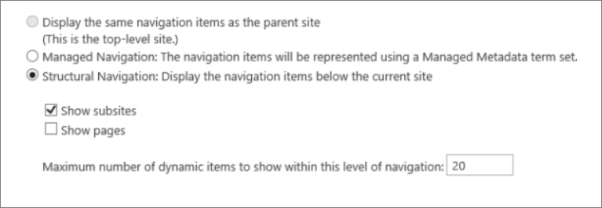

# <a name="navigation-options-for-sharepoint-online"></a><span data-ttu-id="57135-103">Navigationsoptionen für SharePoint Online</span><span class="sxs-lookup"><span data-stu-id="57135-103">Navigation options for SharePoint Online</span></span>

<span data-ttu-id="57135-104">In diesem Artikel werden Navigationsoptionenswebsites mit aktivierter SharePoint in SharePoint Online beschrieben.</span><span class="sxs-lookup"><span data-stu-id="57135-104">This article describes navigation options sites with SharePoint Publishing enabled in SharePoint Online.</span></span> <span data-ttu-id="57135-105">Die Auswahl und Konfiguration der Navigation wirkt sich erheblich auf die Leistung und Skalierbarkeit von Websites in SharePoint Online aus.</span><span class="sxs-lookup"><span data-stu-id="57135-105">The choice and configuration of navigation significantly impacts the performance and scalability of sites in SharePoint Online.</span></span> <span data-ttu-id="57135-106">Die SharePoint Veröffentlichungswebsitevorlage sollte nur verwendet werden, wenn dies für ein zentrales Portal erforderlich ist, und das Veröffentlichungsfeature sollte nur auf bestimmten Websites und nur dann aktiviert werden, wenn dies absolut erforderlich ist, da es sich bei falscher Verwendung auf die Leistung auswirken kann.</span><span class="sxs-lookup"><span data-stu-id="57135-106">The SharePoint Publishing site template should only be used if required for a centralized portal and the publishing feature should only be enabled on specific sites and only when absolutely required as it can impact performance when used incorrectly.</span></span>

>[!NOTE]
><span data-ttu-id="57135-107">Wenn Sie moderne Navigationsoptionen wie SharePoint, kaskadierende Navigation oder Hubnavigation verwenden, gilt dieser Artikel nicht für Ihre Website.</span><span class="sxs-lookup"><span data-stu-id="57135-107">If you're using modern SharePoint navigation options like mega menu, cascading navigation, or hub navigation, this article does not apply to your site.</span></span> <span data-ttu-id="57135-108">Moderne SharePoint nutzen eine flachere Websitehierarchie und ein Hub-and-Spoke-Modell.</span><span class="sxs-lookup"><span data-stu-id="57135-108">Modern SharePoint site architectures leverage a more flattened site hierarchy and a hub-and-spoke model.</span></span> <span data-ttu-id="57135-109">Auf diese Weise können viele Szenarien erreicht werden, für die keine Verwendung des features SharePoint erforderlich ist.</span><span class="sxs-lookup"><span data-stu-id="57135-109">This allows many scenarios to be achieved that do NOT require use of the SharePoint Publishing feature.</span></span>

## <a name="overview-of-navigation-options"></a><span data-ttu-id="57135-110">Übersicht über Navigationsoptionen</span><span class="sxs-lookup"><span data-stu-id="57135-110">Overview of navigation options</span></span>

<span data-ttu-id="57135-111">Die Konfiguration des Navigationsanbieters kann sich erheblich auf die Leistung für die gesamte Website auswirken, und es ist sorgfältig zu berücksichtigen, einen Navigationsanbieter und eine Konfiguration zu wählen, die effektiv für die Anforderungen einer website SharePoint wird.</span><span class="sxs-lookup"><span data-stu-id="57135-111">Navigation provider configuration can significantly impact performance for the entire site, and careful consideration must be taken to pick a navigation provider and configuration that scales effectively for the requirements of a SharePoint site.</span></span> <span data-ttu-id="57135-112">Es gibt zwei einsatzfertige Navigationsanbieter sowie benutzerdefinierte Navigationsimplementierung.</span><span class="sxs-lookup"><span data-stu-id="57135-112">There are two out-of-the-box navigation providers, as well as custom navigation implementations.</span></span>

<span data-ttu-id="57135-113">Die erste Option, [**Strukturnavigation,**](#using-structural-navigation-in-sharepoint-online)ist die empfohlene Navigationsoption in SharePoint Online für klassische Sharepoint-Websites, wenn Sie die zwischenspeicherung der strukturbaulichen Navigation für **Ihre Website aktivieren.**</span><span class="sxs-lookup"><span data-stu-id="57135-113">The first option, [**Structural navigation**](#using-structural-navigation-in-sharepoint-online), is the recommended navigation option in SharePoint Online for classic Sharepoint sites, **if you turn on structural navigation caching for your site**.</span></span> <span data-ttu-id="57135-114">Dieser Navigationsanbieter zeigt die Navigationselemente unterhalb der aktuellen Website und optional die aktuelle Website und deren gleichgeordnete Elemente an.</span><span class="sxs-lookup"><span data-stu-id="57135-114">This navigation provider displays the navigation items below the current site, and optionally the current site and its siblings.</span></span> <span data-ttu-id="57135-115">Es bietet zusätzliche Funktionen, wie z. B. die Sicherheitstrimmerung und die Aufzählung der Websitestruktur.</span><span class="sxs-lookup"><span data-stu-id="57135-115">It provides additional capabilities such as security trimming and site structure enumeration.</span></span> <span data-ttu-id="57135-116">Wenn die Zwischenspeicherung deaktiviert ist, wirkt sich dies negativ auf die Leistung und Skalierbarkeit aus und unterliegt möglicherweise einer Einschränkung.</span><span class="sxs-lookup"><span data-stu-id="57135-116">If caching is disabled, this will negatively impact performance and scalability, and may be subject to throttling.</span></span>

<span data-ttu-id="57135-117">Die zweite Option, [**verwaltete Navigation (Metadaten),**](#using-managed-navigation-and-metadata-in-sharepoint-online)stellt Navigationselemente mithilfe eines Ausdruckssatz für verwaltete Metadaten dar.</span><span class="sxs-lookup"><span data-stu-id="57135-117">The second option, [**Managed (Metadata) navigation**](#using-managed-navigation-and-metadata-in-sharepoint-online), represents navigation items using a Managed Metadata term set.</span></span> <span data-ttu-id="57135-118">Es wird empfohlen, die Sicherheitstrimmerung zu deaktivieren, sofern dies nicht erforderlich ist.</span><span class="sxs-lookup"><span data-stu-id="57135-118">We recommend that security trimming be disabled unless required.</span></span> <span data-ttu-id="57135-119">Die Sicherheitstrimmerung ist als Standardeinstellung für diesen Navigationsanbieter aktiviert. Viele Websites erfordern jedoch keinen Aufwand für die Sicherheitsbeschneidung, da Navigationselemente häufig für alle Benutzer der Website konsistent sind.</span><span class="sxs-lookup"><span data-stu-id="57135-119">Security trimming is enabled as a secure-by-default setting for this navigation provider; however, many sites do not require the overhead of security trimming since navigation elements often are consistent for all users of the site.</span></span> <span data-ttu-id="57135-120">Mit der empfohlenen Konfiguration zum Deaktivieren der Sicherheitstrimmer erfordert dieser Navigationsanbieter keine Aufzählen der Websitestruktur und ist hochgradig skalierbar mit akzeptablen Auswirkungen auf die Leistung.</span><span class="sxs-lookup"><span data-stu-id="57135-120">With the recommended configuration to disable security trimming, this navigation provider does not require enumerating site structure and is highly scalable with acceptable performance impact.</span></span>

<span data-ttu-id="57135-121">Neben den einsatzfertigen Navigationsanbietern haben viele Kunden erfolgreich alternative benutzerdefinierte Navigationsimplementierung implementiert.</span><span class="sxs-lookup"><span data-stu-id="57135-121">In addition to the out-of-the-box navigation providers, many customers have successfully implemented alternative custom navigation implementations.</span></span> <span data-ttu-id="57135-122">Weitere [Informationen finden Sie unter Search-driven client-side scripting](#using-search-driven-client-side-scripting) in this article.</span><span class="sxs-lookup"><span data-stu-id="57135-122">See [Search-driven client-side scripting](#using-search-driven-client-side-scripting) in this article.</span></span>
  
## <a name="pros-and-cons-of-sharepoint-online-navigation-options"></a><span data-ttu-id="57135-123">Vor- und Nachteile SharePoint Onlinenavigationsoptionen</span><span class="sxs-lookup"><span data-stu-id="57135-123">Pros and Cons of SharePoint Online navigation options</span></span>

<span data-ttu-id="57135-124">In der folgenden Tabelle sind die Vor- und Nachteile der einzelnen Optionen zusammengefasst.</span><span class="sxs-lookup"><span data-stu-id="57135-124">The following table summarizes the pros and cons of each option.</span></span>

|<span data-ttu-id="57135-125">Strukturnavigation</span><span class="sxs-lookup"><span data-stu-id="57135-125">Structural navigation</span></span>  |<span data-ttu-id="57135-126">Verwaltete Navigation</span><span class="sxs-lookup"><span data-stu-id="57135-126">Managed navigation</span></span>  |<span data-ttu-id="57135-127">Suchgesteuerte Navigation</span><span class="sxs-lookup"><span data-stu-id="57135-127">Search-driven navigation</span></span>  |<span data-ttu-id="57135-128">Benutzerdefinierter Navigationsanbieter</span><span class="sxs-lookup"><span data-stu-id="57135-128">Custom-navigation provider</span></span>  |
|---------|---------|---------|---------|
|<span data-ttu-id="57135-129">Vorteile:</span><span class="sxs-lookup"><span data-stu-id="57135-129">Pros:</span></span><br/><br/><span data-ttu-id="57135-130">Einfach zu warten</span><span class="sxs-lookup"><span data-stu-id="57135-130">Easy to maintain</span></span><br/><span data-ttu-id="57135-131">Sicherheit gekürzt</span><span class="sxs-lookup"><span data-stu-id="57135-131">Security trimmed</span></span><br/><span data-ttu-id="57135-132">Automatische Aktualisierung innerhalb von 24 Stunden, wenn Inhalte geändert werden</span><span class="sxs-lookup"><span data-stu-id="57135-132">Automatically updates within 24 hours when content is changed</span></span><br/>     |<span data-ttu-id="57135-133">Vorteile:</span><span class="sxs-lookup"><span data-stu-id="57135-133">Pros:</span></span><br/><br/><span data-ttu-id="57135-134">Einfach zu warten</span><span class="sxs-lookup"><span data-stu-id="57135-134">Easy to maintain</span></span><br/>|<span data-ttu-id="57135-135">Vorteile:</span><span class="sxs-lookup"><span data-stu-id="57135-135">Pros:</span></span><br/><br/><span data-ttu-id="57135-136">Sicherheit gekürzt</span><span class="sxs-lookup"><span data-stu-id="57135-136">Security trimmed</span></span><br/><span data-ttu-id="57135-137">Automatische Aktualisierungen beim Hinzufügen von Websites</span><span class="sxs-lookup"><span data-stu-id="57135-137">Automatically updates as sites are added</span></span><br/><span data-ttu-id="57135-138">Schnelle Ladezeit und lokal zwischengespeicherte Navigationsstruktur</span><span class="sxs-lookup"><span data-stu-id="57135-138">Fast loading time and locally cached navigation structure</span></span><br/>|<span data-ttu-id="57135-139">Vorteile:</span><span class="sxs-lookup"><span data-stu-id="57135-139">Pros:</span></span><br/><br/><span data-ttu-id="57135-140">Größere Auswahl an verfügbaren Optionen</span><span class="sxs-lookup"><span data-stu-id="57135-140">Wider choice of options available</span></span><br/><span data-ttu-id="57135-141">Schnelles Laden bei ordnungsgemäßer Zwischenspeicherung</span><span class="sxs-lookup"><span data-stu-id="57135-141">Fast loading when caching is used correctly</span></span><br/><span data-ttu-id="57135-142">Viele Optionen funktionieren gut mit dem design für reaktionsschnelle Seiten</span><span class="sxs-lookup"><span data-stu-id="57135-142">Many options work well with responsive page design</span></span><br/>|
|<span data-ttu-id="57135-143">Nachteile:</span><span class="sxs-lookup"><span data-stu-id="57135-143">Cons:</span></span><br/><br/><span data-ttu-id="57135-144">**Wirkt sich auf die Leistung aus, wenn die Zwischenspeicherung deaktiviert ist**</span><span class="sxs-lookup"><span data-stu-id="57135-144">**Impacts performance if caching is disabled**</span></span><br/><span data-ttu-id="57135-145">Unterliegt Drosselung</span><span class="sxs-lookup"><span data-stu-id="57135-145">Subject to throttling</span></span><br/>|<span data-ttu-id="57135-146">Nachteile:</span><span class="sxs-lookup"><span data-stu-id="57135-146">Cons:</span></span><br/><br/><span data-ttu-id="57135-147">Nicht automatisch aktualisiert, um die Websitestruktur wider zuspiegeln</span><span class="sxs-lookup"><span data-stu-id="57135-147">Not automatically updated to reflect site structure</span></span><br/><span data-ttu-id="57135-148">**Wirkt sich auf die Leistung aus, wenn die Sicherheitsbeschneidung aktiviert ist** oder wenn die Navigationsstruktur komplex ist</span><span class="sxs-lookup"><span data-stu-id="57135-148">**Impacts performance if security trimming is enabled** or when navigation structure is complex</span></span><br/>|<span data-ttu-id="57135-149">Nachteile:</span><span class="sxs-lookup"><span data-stu-id="57135-149">Cons:</span></span><br/><br/><span data-ttu-id="57135-150">Keine Möglichkeit zum einfachen Bestellen von Websites</span><span class="sxs-lookup"><span data-stu-id="57135-150">No ability to easily order sites</span></span><br/><span data-ttu-id="57135-151">Erfordert eine Anpassung der Gestaltungsseite (technische Kenntnisse erforderlich)</span><span class="sxs-lookup"><span data-stu-id="57135-151">Requires customization of the master page (technical skills required)</span></span><br/>|<span data-ttu-id="57135-152">Nachteile:</span><span class="sxs-lookup"><span data-stu-id="57135-152">Cons:</span></span><br/><br/><span data-ttu-id="57135-153">Benutzerdefinierte Entwicklung ist erforderlich</span><span class="sxs-lookup"><span data-stu-id="57135-153">Custom development is required</span></span><br/><span data-ttu-id="57135-154">Externe Datenquelle/gespeicherter Cache ist erforderlich, z. B. Azure</span><span class="sxs-lookup"><span data-stu-id="57135-154">External data source / cache stored is needed e.g. Azure</span></span><br/>|

<span data-ttu-id="57135-155">Die am besten geeignete Option für Ihre Website hängt von Ihren Websiteanforderungen und Ihrer technischen Leistungsfähigkeit ab.</span><span class="sxs-lookup"><span data-stu-id="57135-155">The most appropriate option for your site will depend on your site requirements and on your technical capability.</span></span> <span data-ttu-id="57135-156">Wenn Sie einen einfach zu konfigurierenden Navigationsanbieter wünschen, der automatisch [](https://support.office.com/article/structural-navigation-and-performance-f163053f-8eca-4b9c-b973-36b395093b43) aktualisiert wird, wenn Inhalte geändert werden, ist die strukturelle Navigation mit aktivierter Zwischenspeicherung eine gute Option.</span><span class="sxs-lookup"><span data-stu-id="57135-156">If you want an easy-to-configure navigation provider that automatically updates when content is changed, then structural navigation [with caching enabled](https://support.office.com/article/structural-navigation-and-performance-f163053f-8eca-4b9c-b973-36b395093b43) is a good option.</span></span>

>[!NOTE]
><span data-ttu-id="57135-157">Die Anwendung desselben Prinzips wie SharePoint Websites durch Die Vereinfachung der gesamten Websitestruktur auf eine flacheren, nicht hierarchischen Strukturen verbessert die Leistung und vereinfacht den Wechsel zu modernen SharePoint Websites.</span><span class="sxs-lookup"><span data-stu-id="57135-157">Applying the same principle as modern SharePoint sites by simplifying the overall site structure to a flatter, non-hierarchical structure improves performance and simplifies moving to modern SharePoint sites.</span></span> <span data-ttu-id="57135-158">Dies bedeutet, dass anstelle einer einzigen Websitesammlung mit Hunderten von Websites (Unterwebsites) ein besserer Ansatz besteht, viele Websitesammlungen mit sehr wenigen Unterwebsites (Unterwebsites) zu haben.</span><span class="sxs-lookup"><span data-stu-id="57135-158">What this means is that instead of having a single site collection with hundreds of sites (subwebs), a better approach is to have many site collections with very few subsites (subwebs).</span></span>

## <a name="analyzing-navigation-performance-in-sharepoint-online"></a><span data-ttu-id="57135-159">Analysieren der Navigationsleistung in SharePoint Online</span><span class="sxs-lookup"><span data-stu-id="57135-159">Analyzing navigation performance in SharePoint Online</span></span>

<span data-ttu-id="57135-160">Das [Tool Seitendiagnose für SharePoint](./page-diagnostics-for-spo.md) ist eine Browsererweiterung für Microsoft Edge- und Chrome-Browser, die sowohl SharePoint moderne Portal- als auch klassische Veröffentlichungswebsiteseiten analysiert.</span><span class="sxs-lookup"><span data-stu-id="57135-160">The [Page Diagnostics for SharePoint tool](./page-diagnostics-for-spo.md) is a browser extension for Microsoft Edge and Chrome browsers that analyzes both SharePoint Online modern portal and classic publishing site pages.</span></span> <span data-ttu-id="57135-161">Dieses Tool funktioniert nur für SharePoint Online und kann nicht auf einer SharePoint verwendet werden.</span><span class="sxs-lookup"><span data-stu-id="57135-161">This tool only works for SharePoint Online, and cannot be used on a SharePoint system page.</span></span>

<span data-ttu-id="57135-162">Das Tool generiert einen Bericht für jede analysierte Seite, in dem gezeigt wird, wie die Seite mit einem vordefinierten Satz von Regeln arbeitet, und zeigt detaillierte Informationen an, wenn ergebnisse für einen Test außerhalb des Basiswerts fallen.</span><span class="sxs-lookup"><span data-stu-id="57135-162">The tool generates a report for each analyzed page showing how the page performs against a pre-defined set of rules and displays detailed information when results for a test fall outside the baseline value.</span></span> <span data-ttu-id="57135-163">SharePoint Onlineadministratoren und Designer können das Tool verwenden, um Leistungsprobleme zu beheben, um sicherzustellen, dass neue Seiten vor der Veröffentlichung optimiert werden.</span><span class="sxs-lookup"><span data-stu-id="57135-163">SharePoint Online administrators and designers can use the tool to troubleshoot performance issues to ensure that new pages are optimized prior to publishing.</span></span>

<span data-ttu-id="57135-164">**SPRequestDuration** ist insbesondere die Zeit, die es dauert, SharePoint die Seite zu verarbeiten.</span><span class="sxs-lookup"><span data-stu-id="57135-164">**SPRequestDuration** in particular is the time it takes for SharePoint to process the page.</span></span> <span data-ttu-id="57135-165">Eine hohe Navigation (z. B. Seiten in der Navigation), komplexe Websitehierarchien sowie andere Konfigurations- und Topologieoptionen können erheblich zu längeren Laufzeiten beitragen.</span><span class="sxs-lookup"><span data-stu-id="57135-165">Heavy navigation (like including pages in navigation), complex site hierarchies, and other configuration and topology options can all dramatically contribute to longer durations.</span></span>

## <a name="using-structural-navigation-in-sharepoint-online"></a><span data-ttu-id="57135-166">Verwenden der Strukturnavigation in SharePoint Online</span><span class="sxs-lookup"><span data-stu-id="57135-166">Using structural navigation in SharePoint Online</span></span>

<span data-ttu-id="57135-167">Dies ist die standardmäßig verwendete out-of-the-box-Navigation und die unkomplizierteste Lösung.</span><span class="sxs-lookup"><span data-stu-id="57135-167">This is the out-of-the-box navigation used by default and is the most straightforward solution.</span></span> <span data-ttu-id="57135-168">Es ist keine Anpassung erforderlich, und ein nicht technischer Benutzer kann auch einfach Elemente hinzufügen, Elemente ausblenden und die Navigation auf der Einstellungsseite verwalten.</span><span class="sxs-lookup"><span data-stu-id="57135-168">It does not require any customization and a non-technical user can also easily add items, hide items, and manage the navigation from the settings page.</span></span> <span data-ttu-id="57135-169">Es wird [empfohlen, die Zwischenspeicherung](https://support.office.com/article/structural-navigation-and-performance-f163053f-8eca-4b9c-b973-36b395093b43)zu aktivieren, andernfalls gibt es einen kostspieligen Leistungs-Trade-Off.</span><span class="sxs-lookup"><span data-stu-id="57135-169">We recommend [enabling caching](https://support.office.com/article/structural-navigation-and-performance-f163053f-8eca-4b9c-b973-36b395093b43), otherwise there is an expensive performance trade-off.</span></span>

### <a name="how-to-implement-structural-navigation-caching"></a><span data-ttu-id="57135-170">Implementieren der strukturellen Navigations-Zwischenspeicherung</span><span class="sxs-lookup"><span data-stu-id="57135-170">How to implement structural navigation caching</span></span>

<span data-ttu-id="57135-171">Unter **Site Einstellungen** Look and Feel Navigation können Sie überprüfen, ob die Strukturnavigation für die globale oder die aktuelle Navigation ausgewählt  >    >  ist.</span><span class="sxs-lookup"><span data-stu-id="57135-171">Under **Site Settings** > **Look and Feel** > **Navigation**, you can validate if structural navigation is selected for either global navigation or current navigation.</span></span> <span data-ttu-id="57135-172">Das **Auswählen von Seiten** anzeigen hat negative Auswirkungen auf die Leistung.</span><span class="sxs-lookup"><span data-stu-id="57135-172">Selecting **Show pages** will have negative impact on performance.</span></span>



<span data-ttu-id="57135-174">Die Zwischenspeicherung kann auf Websitesammlungsebene und auf Websiteebene aktiviert oder deaktiviert werden und ist standardmäßig für beide aktiviert.</span><span class="sxs-lookup"><span data-stu-id="57135-174">Caching can be enabled or disabled at the site collection level and at the site level, and is enabled for both by default.</span></span> <span data-ttu-id="57135-175">Aktivieren Sie zum Aktivieren auf Websitesammlungsebene unter Websitesammlungsverwaltungsnavigation **Einstellungen** Websitesammlungsverwaltung das Kontrollkästchen  >    >   **Zwischenspeichern aktivieren.**</span><span class="sxs-lookup"><span data-stu-id="57135-175">To enable at the site collection level, under **Site Settings** > **Site Collection Administration** > **Site Collection Navigation**, check the box for **Enable caching**.</span></span>


<span data-ttu-id="57135-177">Aktivieren Sie zum Aktivieren auf Standortebene unter **Website Einstellungen** Navigation das Kontrollkästchen  >   **Zwischenspeicherung aktivieren.**</span><span class="sxs-lookup"><span data-stu-id="57135-177">To enable at the site level, under **Site Settings** > **Navigation**, check the box for **Enable caching**.</span></span>


## <a name="using-managed-navigation-and-metadata-in-sharepoint-online"></a><span data-ttu-id="57135-179">Verwenden von verwalteter Navigation und Metadaten in SharePoint Online</span><span class="sxs-lookup"><span data-stu-id="57135-179">Using managed navigation and metadata in SharePoint Online</span></span>

<span data-ttu-id="57135-180">Die verwaltete Navigation ist eine weitere out-of-the-box-Option, die Sie verwenden können, um die meisten der gleichen Funktionen wie die Strukturnavigation neu zu erstellen.</span><span class="sxs-lookup"><span data-stu-id="57135-180">Managed navigation is another out-of-the-box option that you can use to recreate most of the same functionality as structural navigation.</span></span> <span data-ttu-id="57135-181">Verwaltete Metadaten können so konfiguriert werden, dass die Sicherheitsbeschneidung aktiviert oder deaktiviert ist.</span><span class="sxs-lookup"><span data-stu-id="57135-181">Managed metadata can be configured to have security trimming enabled or disabled.</span></span> <span data-ttu-id="57135-182">Bei deaktivierter Sicherheitstrimmerung ist die verwaltete Navigation relativ effizient, da sie alle Navigationslinks mit einer konstanten Anzahl von Serveraufrufen lädt.</span><span class="sxs-lookup"><span data-stu-id="57135-182">When configured with security trimming disabled, managed navigation is fairly efficient as it loads all the navigation links with a constant number of server calls.</span></span> <span data-ttu-id="57135-183">Durch die Aktivierung der Sicherheitstrimmerung werden jedoch einige der Leistungsvorteile der verwalteten Navigation negiert.</span><span class="sxs-lookup"><span data-stu-id="57135-183">Enabling security trimming, however, negates some of the performance advantages of managed navigation.</span></span>

<span data-ttu-id="57135-184">Wenn Sie die Sicherheitsbeschneidung aktivieren müssen, wird empfohlen, dass Sie:</span><span class="sxs-lookup"><span data-stu-id="57135-184">If you need to enable security trimming, we recommend that you:</span></span>

- <span data-ttu-id="57135-185">Aktualisieren aller benutzerfreundlichen URL-Links auf einfache Links</span><span class="sxs-lookup"><span data-stu-id="57135-185">Update all friendly URL links to simple links</span></span>
- <span data-ttu-id="57135-186">Hinzufügen erforderlicher Knoten zur Sicherheitsbeschneidung als benutzerfreundliche URLs</span><span class="sxs-lookup"><span data-stu-id="57135-186">Add required security trimming nodes as friendly URLs</span></span>
- <span data-ttu-id="57135-187">Beschränken sie die Anzahl der Navigationselemente auf nicht mehr als 100 und nicht mehr als 3 Ebenen tief</span><span class="sxs-lookup"><span data-stu-id="57135-187">Limit the number of navigation items to no more than 100 and no more than 3 levels deep</span></span>

<span data-ttu-id="57135-188">Viele Websites erfordern keine Sicherheitsbeschneidung, da die Navigationsstruktur häufig für alle Benutzer der Website konsistent ist.</span><span class="sxs-lookup"><span data-stu-id="57135-188">Many sites do not require security trimming, as the navigation structure is often consistent for all users of the site.</span></span> <span data-ttu-id="57135-189">Wenn die Sicherheitsentschneidung deaktiviert ist und der Navigation ein Link hinzugefügt wird, auf den nicht alle Benutzer Zugriff haben, wird der Link weiterhin angezeigt, führt aber zu einer Zugriffs verweigerten Nachricht.</span><span class="sxs-lookup"><span data-stu-id="57135-189">If security trimming is disabled and a link is added to navigation that not all users have access to, the link will still show but will lead to an access denied message.</span></span> <span data-ttu-id="57135-190">Es besteht kein Risiko eines unbeabsichtigten Zugriffs auf den Inhalt.</span><span class="sxs-lookup"><span data-stu-id="57135-190">There is no risk of inadvertent access to the content.</span></span>

### <a name="how-to-implement-managed-navigation-and-the-results"></a><span data-ttu-id="57135-191">Implementieren der verwalteten Navigation und der Ergebnisse</span><span class="sxs-lookup"><span data-stu-id="57135-191">How to implement managed navigation and the results</span></span>

<span data-ttu-id="57135-192">Es gibt mehrere Artikel zu docs.microsoft.com informationen zu den Details der verwalteten Navigation.</span><span class="sxs-lookup"><span data-stu-id="57135-192">There are several articles on docs.microsoft.com about the details of managed navigation.</span></span> <span data-ttu-id="57135-193">Beispiel: Übersicht über [die verwaltete Navigation in SharePoint Server](/sharepoint/administration/overview-of-managed-navigation).</span><span class="sxs-lookup"><span data-stu-id="57135-193">For example, see [Overview of managed navigation in SharePoint Server](/sharepoint/administration/overview-of-managed-navigation).</span></span>

<span data-ttu-id="57135-194">Zum Implementieren der verwalteten Navigation richten Sie Begriffe mit URLs ein, die der Navigationsstruktur der Website entspricht.</span><span class="sxs-lookup"><span data-stu-id="57135-194">In order to implement managed navigation, you set up terms with URLs corresponding to the navigation structure of the site.</span></span> <span data-ttu-id="57135-195">Die verwaltete Navigation kann sogar manuell kuratiert werden, um die Strukturnavigation in vielen Fällen zu ersetzen.</span><span class="sxs-lookup"><span data-stu-id="57135-195">Managed navigation can even be manually curated to replace structural navigation in many cases.</span></span> <span data-ttu-id="57135-196">Beispiel:</span><span class="sxs-lookup"><span data-stu-id="57135-196">For example:</span></span>

<span data-ttu-id="57135-198">)</span><span class="sxs-lookup"><span data-stu-id="57135-198">)</span></span>

## <a name="using-search-driven-client-side-scripting"></a><span data-ttu-id="57135-199">Verwenden von suchgesteuertem clientseitigem Skripting</span><span class="sxs-lookup"><span data-stu-id="57135-199">Using Search-driven client-side scripting</span></span>

<span data-ttu-id="57135-200">Eine allgemeine Klasse von benutzerdefinierten Navigationsimplementierung umfasst vom Client gerenderte Entwurfsmuster, die einen lokalen Cache von Navigationsknoten speichern.</span><span class="sxs-lookup"><span data-stu-id="57135-200">One common class of custom navigation implementations embraces client-rendered design patterns that store a local cache of navigation nodes.</span></span>

<span data-ttu-id="57135-201">Diese Navigationsanbieter haben einige wichtige Vorteile:</span><span class="sxs-lookup"><span data-stu-id="57135-201">These navigation providers have a couple of key advantages:</span></span>

- <span data-ttu-id="57135-202">Sie funktionieren in der Regel gut mit ansprechenden Seitendesigns.</span><span class="sxs-lookup"><span data-stu-id="57135-202">They generally work well with responsive page designs.</span></span>
- <span data-ttu-id="57135-203">Sie sind äußerst skalierbar und performant, da sie ohne Ressourcenkosten gerendert werden können (und nach einem Timeout im Hintergrund aktualisiert werden).</span><span class="sxs-lookup"><span data-stu-id="57135-203">They are extremely scalable and performant because they can render with no resource cost (and refresh in the background after a timeout).</span></span>
- <span data-ttu-id="57135-204">Diese Navigationsanbieter können Navigationsdaten mithilfe verschiedener Strategien abrufen, von einfachen statischen Konfigurationen bis hin zu verschiedenen dynamischen Datenanbietern.</span><span class="sxs-lookup"><span data-stu-id="57135-204">These navigation providers can retrieve navigation data using various strategies, ranging from simple static configurations to various dynamic data providers.</span></span>

<span data-ttu-id="57135-205">Ein Beispiel für einen Datenanbieter ist die Verwendung einer suchgesteuerten **Navigation,** die flexibilität zum Aufzählen von Navigationsknoten und zum effizienten Behandeln von Sicherheitstrimmern ermöglicht.</span><span class="sxs-lookup"><span data-stu-id="57135-205">An example of a data provider is to use a **Search-driven navigation**, which allows flexibility for enumerating navigation nodes and handling security trimming efficiently.</span></span>

<span data-ttu-id="57135-206">Es gibt weitere beliebte Optionen zum Erstellen von **benutzerdefinierten Navigationsanbietern.**</span><span class="sxs-lookup"><span data-stu-id="57135-206">There are other popular options to build **Custom navigation providers**.</span></span> <span data-ttu-id="57135-207">Weitere Anleitungen zum Erstellen eines benutzerdefinierten [Navigationsanbieters finden Sie SharePoint Navigationslösungen](/sharepoint/dev/solution-guidance/portal-navigation) für SharePoint Onlineportale.</span><span class="sxs-lookup"><span data-stu-id="57135-207">Please review [Navigation solutions for SharePoint Online portals](/sharepoint/dev/solution-guidance/portal-navigation) for further guidance on building a Custom navigation provider.</span></span>

<span data-ttu-id="57135-208">Mithilfe der Suche können Sie die im Hintergrund aufgebauten Indizes mithilfe einer kontinuierlichen Durchforstung nutzen.</span><span class="sxs-lookup"><span data-stu-id="57135-208">Using search you can leverage the indexes that are built up in the background using continuous crawl.</span></span> <span data-ttu-id="57135-209">Die Suchergebnisse werden aus dem Suchindex gezogen, und die Ergebnisse sind sicherheitsbeschnitten.</span><span class="sxs-lookup"><span data-stu-id="57135-209">The search results are pulled from the search index and the results are security-trimmed.</span></span> <span data-ttu-id="57135-210">Dies ist in der Regel schneller als bei nicht verwendeten Navigationsanbietern, wenn eine Sicherheitsbeschneidung erforderlich ist.</span><span class="sxs-lookup"><span data-stu-id="57135-210">This is generally faster than out-of-the-box navigation providers when security trimming is required.</span></span> <span data-ttu-id="57135-211">Die Verwendung der Suche nach struktureller Navigation, insbesondere wenn Sie über eine komplexe Websitestruktur verfügen, beschleunigt die Ladezeit der Seite erheblich.</span><span class="sxs-lookup"><span data-stu-id="57135-211">Using search for structural navigation, especially if you have a complex site structure, will speed up page loading time considerably.</span></span> <span data-ttu-id="57135-212">Der Hauptvorteil dieser gegenüber der verwalteten Navigation ist, dass Sie von der Sicherheitstrimmerung profitieren.</span><span class="sxs-lookup"><span data-stu-id="57135-212">The main advantage of this over managed navigation is that you benefit from security trimming.</span></span>

<span data-ttu-id="57135-213">Dieser Ansatz umfasst das Erstellen einer benutzerdefinierten Gestaltungsmasterseite und das Ersetzen des out-of-the-box-Navigationscodes durch benutzerdefinierten HTML-Code.</span><span class="sxs-lookup"><span data-stu-id="57135-213">This approach involves creating a custom master page and replacing the out-of-the-box navigation code with custom HTML.</span></span> <span data-ttu-id="57135-214">Gehen Sie wie im folgenden Beispiel beschrieben vor, um den Navigationscode in der Datei zu `seattle.html` ersetzen.</span><span class="sxs-lookup"><span data-stu-id="57135-214">Follow this procedure outlined in the following example to replace the navigation code in the file `seattle.html`.</span></span> <span data-ttu-id="57135-215">In diesem Beispiel öffnen Sie die Datei und ersetzen das `seattle.html` gesamte Element `id="DeltaTopNavigation"` durch benutzerdefinierten HTML-Code.</span><span class="sxs-lookup"><span data-stu-id="57135-215">In this example, you will open the `seattle.html` file and replace the whole element `id="DeltaTopNavigation"` with custom HTML code.</span></span>

### <a name="example-replace-the-out-of-the-box-navigation-code-in-a-master-page"></a><span data-ttu-id="57135-216">Beispiel: Ersetzen des out-of-the-box-Navigationscodes in einer Masterseite</span><span class="sxs-lookup"><span data-stu-id="57135-216">Example: Replace the out-of-the-box navigation code in a master page</span></span>

1. <span data-ttu-id="57135-217">Navigieren Sie zur Seite Website Einstellungen Seite.</span><span class="sxs-lookup"><span data-stu-id="57135-217">Navigate to the Site Settings page.</span></span>
2. <span data-ttu-id="57135-218">Öffnen Sie den Masterseitenkatalog, indem Sie auf **Masterseiten klicken.**</span><span class="sxs-lookup"><span data-stu-id="57135-218">Open the master page gallery by clicking **Master Pages**.</span></span>
3. <span data-ttu-id="57135-219">Von hier aus können Sie durch die Bibliothek navigieren und die Datei `seattle.master` herunterladen.</span><span class="sxs-lookup"><span data-stu-id="57135-219">From here you can navigate through the library and download the file `seattle.master`.</span></span>
4. <span data-ttu-id="57135-220">Bearbeiten Sie den Code mithilfe eines Texteditors, und löschen Sie den Codeblock im folgenden Screenshot.</span><span class="sxs-lookup"><span data-stu-id="57135-220">Edit the code using a text editor and delete the code block in the following screen shot.</span></span><br/><br/>
5. <span data-ttu-id="57135-222">Entfernen Sie den Code zwischen `<SharePoint:AjaxDelta id="DeltaTopNavigation">` den tags `<\SharePoint:AjaxDelta>` und, und ersetzen Sie ihn durch den folgenden Codeausschnitt:</span><span class="sxs-lookup"><span data-stu-id="57135-222">Remove the code between the `<SharePoint:AjaxDelta id="DeltaTopNavigation">` and `<\SharePoint:AjaxDelta>` tags and replace it with the following snippet:</span></span><br/>

```javascript
<div id="loading">
  <!--Replace with path to loading image.-->
  <div style="background-image: url(''); height: 22px; width: 22px; ">
  </div>
</div>
<!-- Main Content-->
<div id="navContainer" style="display:none">
    <div data-bind="foreach: hierarchy" class="noindex ms-core-listMenu-horizontalBox">
        <a class="dynamic menu-item ms-core-listMenu-item ms-displayInline ms-navedit-linkNode" data-bind="attr: { href: item.Url, title: item.Title }">
            <span class="menu-item-text" data-bind="text: item.Title">
            </span>
        </a>
        <ul id="menu" data-bind="foreach: $data.children" style="padding-left:20px">
            <li class="static dynamic-children level1">
                <a class="static dynamic-children menu-item ms-core-listMenu-item ms-displayInline ms-navedit-linkNode" data-bind="attr: { href: item.Url, title: item.Title }">

                 <!-- ko if: children.length > 0-->
                    <span aria-haspopup="true" class="additional-background ms-navedit-flyoutArrow dynamic-children">
                        <span class="menu-item-text" data-bind="text: item.Title">
                        </span>
                    </span>
                <!-- /ko -->
                <!-- ko if: children.length == 0-->
                    <span aria-haspopup="true" class="ms-navedit-flyoutArrow dynamic-children">
                        <span class="menu-item-text" data-bind="text: item.Title">
                        </span>
                    </span>
                <!-- /ko -->
                </a>

                <!-- ko if: children.length > 0-->
                <ul id="menu"  data-bind="foreach: children;" class="dynamic  level2" >
                    <li class="dynamic level2">
                        <a class="dynamic menu-item ms-core-listMenu-item ms-displayInline  ms-navedit-linkNode" data-bind="attr: { href: item.Url, title: item.Title }">

          <!-- ko if: children.length > 0-->
          <span aria-haspopup="true" class="additional-background ms-navedit-flyoutArrow dynamic-children">
           <span class="menu-item-text" data-bind="text: item.Title">
           </span>
          </span>
           <!-- /ko -->
          <!-- ko if: children.length == 0-->
          <span aria-haspopup="true" class="ms-navedit-flyoutArrow dynamic-children">
           <span class="menu-item-text" data-bind="text: item.Title">
           </span>
          </span>
          <!-- /ko -->
                        </a>
          <!-- ko if: children.length > 0-->
         <ul id="menu" data-bind="foreach: children;" class="dynamic level3" >
          <li class="dynamic level3">
           <a class="dynamic menu-item ms-core-listMenu-item ms-displayInline ms-navedit-linkNode" data-bind="attr: { href: item.Url, title: item.Title }">
            <span class="menu-item-text" data-bind="text: item.Title">
            </span>
           </a>
          </li>
         </ul>
           <!-- /ko -->
                    </li>
                </ul>
                <!-- /ko -->
            </li>
        </ul>
    </div>
</div>
```

<br/>
6. <span data-ttu-id="57135-223">Ersetzen Sie die URL im Laden des Bildankertags am Anfang durch einen Link zu einem Ladenimage in Ihrer Websitesammlung.</span><span class="sxs-lookup"><span data-stu-id="57135-223">Replace the URL in the loading image anchor tag at the beginning, with a link to a loading image in your site collection.</span></span> <span data-ttu-id="57135-224">Nachdem Sie die Änderungen vorgenommen haben, benennen Sie die Datei um, und laden Sie sie dann in den Masterseitenkatalog hoch.</span><span class="sxs-lookup"><span data-stu-id="57135-224">After you have made the changes, rename the file and then upload it to the master page gallery.</span></span> <span data-ttu-id="57135-225">Dadurch wird eine neue .master-Datei generiert.</span><span class="sxs-lookup"><span data-stu-id="57135-225">This generates a new .master file.</span></span><br/>
7. <span data-ttu-id="57135-226">Dieser HTML-Code ist das grundlegende Markup, das von den suchergebnissen aufgefüllt wird, die aus dem JavaScript-Code zurückgegeben werden.</span><span class="sxs-lookup"><span data-stu-id="57135-226">This HTML is the basic markup that will be populated by the search results returned from JavaScript code.</span></span> <span data-ttu-id="57135-227">Sie müssen den Code bearbeiten, um den Wert für var root = "Websitesammlungs-URL" zu ändern, wie im folgenden Codeausschnitt gezeigt:</span><span class="sxs-lookup"><span data-stu-id="57135-227">You will need to edit the code to change the value for var root = "site collection URL" as demonstrated in the following snippet:</span></span><br/>

```javascript
var root = "https://spperformance.sharepoint.com/sites/NavigationBySearch";
```

<br/>
8. <span data-ttu-id="57135-228">Die Ergebnisse werden dem self.nodes-Array zugewiesen, und aus den Objekten wird eine Hierarchie erstellt, indem linq.js die Ausgabe einer Arrayhierarchie self.hierarchy zugewiesen wird.</span><span class="sxs-lookup"><span data-stu-id="57135-228">The results are assigned to the self.nodes array and a hierarchy is built out of the objects using linq.js assigning the output to an array self.hierarchy.</span></span> <span data-ttu-id="57135-229">Dieses Array ist das Objekt, das an den HTML-Code gebunden ist.</span><span class="sxs-lookup"><span data-stu-id="57135-229">This array is the object that is bound to the HTML.</span></span> <span data-ttu-id="57135-230">Dies geschieht in der toggleView()-Funktion, indem das self-Objekt an die ko.applyBinding()-Funktion übergeben wird.</span><span class="sxs-lookup"><span data-stu-id="57135-230">This is done in the toggleView() function by passing the self object to the ko.applyBinding() function.</span></span><br/><span data-ttu-id="57135-231">Dadurch wird das Hierarchiearray an den folgenden HTML-Code gebunden:</span><span class="sxs-lookup"><span data-stu-id="57135-231">This then causes the hierarchy array to be bound to the following HTML:</span></span><br/>

```javascript
<div data-bind="foreach: hierarchy" class="noindex ms-core-listMenu-horizontalBox">
```

<span data-ttu-id="57135-232">Die Ereignishandler für und werden der Navigation auf oberster Ebene hinzugefügt, um die Dropdownmenüs der Unterwebsite zu behandeln, die in der `mouseenter` `mouseexit` Funktion durchgeführt `addEventsToElements()` werden.</span><span class="sxs-lookup"><span data-stu-id="57135-232">The event handlers for `mouseenter` and `mouseexit` are added to the top-level navigation to handle the subsite drop-down menus which is done in the `addEventsToElements()` function.</span></span>

<span data-ttu-id="57135-233">In unserem komplexen Navigationsbeispiel zeigt eine neue Seitenlast ohne lokale Zwischenspeicherung, dass die auf dem Server auf dem Server verbrachte Zeit von der Benchmarkstrukturnavigation abgeschnitten wurde, um ein ähnliches Ergebnis wie den verwalteten Navigationsansatz zu erhalten.</span><span class="sxs-lookup"><span data-stu-id="57135-233">In our complex navigation example, a fresh page load without the local caching shows the time spent on the server has been cut down from the benchmark structural navigation to get a similar result as the managed navigation approach.</span></span>

### <a name="about-the-javascript-file"></a><span data-ttu-id="57135-234">Informationen zur JavaScript-Datei...</span><span class="sxs-lookup"><span data-stu-id="57135-234">About the JavaScript file...</span></span>

>[!NOTE]
><span data-ttu-id="57135-235">Wenn Sie benutzerdefiniertes JavaScript verwenden, stellen Sie sicher, dass CDN aktiviert ist und sich die Datei an einem CDN befindet.</span><span class="sxs-lookup"><span data-stu-id="57135-235">If using custom JavaScript, ensure that public CDN is enabled and the file is in a CDN location.</span></span>

<span data-ttu-id="57135-236">Die gesamte JavaScript-Datei lautet wie folgt:</span><span class="sxs-lookup"><span data-stu-id="57135-236">The entire JavaScript file is as follows:</span></span>

```javascript
//Models and Namespaces
var SPOCustom = SPOCustom || {};
SPOCustom.Models = SPOCustom.Models || {}
SPOCustom.Models.NavigationNode = function () {

    this.Url = ko.observable("");
    this.Title = ko.observable("");
    this.Parent = ko.observable("");

};

var root = "https://spperformance.sharepoint.com/sites/NavigationBySearch";
var baseUrl = root + "/_api/search/query?querytext=";
var query = baseUrl + "'contentClass=\"STS_Web\"+path:" + root + "'&trimduplicates=false&rowlimit=300";

var baseRequest = {
    url: "",
    type: ""
};


//Parses a local object from JSON search result.
function getNavigationFromDto(dto) {
    var item = new SPOCustom.Models.NavigationNode();
    if (dto != undefined) {

        var webTemplate = getSearchResultsValue(dto.Cells.results, 'WebTemplate');

        if (webTemplate != "APP") {
            item.Title(getSearchResultsValue(dto.Cells.results, 'Title')); //Key = Title
            item.Url(getSearchResultsValue(dto.Cells.results, 'Path')); //Key = Path
            item.Parent(getSearchResultsValue(dto.Cells.results, 'ParentLink')); //Key = ParentLink
        }

    }
    return item;
}

function getSearchResultsValue(results, key) {

    for (i = 0; i < results.length; i++) {
        if (results[i].Key == key) {
            return results[i].Value;
        }
    }
    return null;
}

//Parse a local object from the serialized cache.
function getNavigationFromCache(dto) {
    var item = new SPOCustom.Models.NavigationNode();

    if (dto != undefined) {

        item.Title(dto.Title);
        item.Url(dto.Url);
        item.Parent(dto.Parent);
    }

    return item;
}

/* create a new OData request for JSON response */
function getRequest(endpoint) {
    var request = baseRequest;
    request.type = "GET";
    request.url = endpoint;
    request.headers = { ACCEPT: "application/json;odata=verbose" };
    return request;
};

/* Navigation Module*/
function NavigationViewModel() {
    "use strict";
    var self = this;
    self.nodes = ko.observableArray([]);
    self.hierarchy = ko.observableArray([]);;
    self.loadNavigatioNodes = function () {
        //Check local storage for cached navigation datasource.
        var fromStorage = localStorage["nodesCache"];
        if (false) {
            var cachedNodes = JSON.parse(localStorage["nodesCache"]);

            if (cachedNodes && timeStamp) {
                //Check for cache expiration. Currently set to 3 hrs.
                var now = new Date();
                var diff = now.getTime() - timeStamp;
                if (Math.round(diff / (1000 * 60 * 60)) < 3) {

                    //return from cache.
                    var cacheResults = [];
                    $.each(cachedNodes, function (i, item) {
                        var nodeitem = getNavigationFromCache(item, true);
                        cacheResults.push(nodeitem);
                    });

                    self.buildHierarchy(cacheResults);
                    self.toggleView();
                    addEventsToElements();
                    return;
                }
            }
        }
        //No cache hit, REST call required.
        self.queryRemoteInterface();
    };

    //Executes a REST call and builds the navigation hierarchy.
    self.queryRemoteInterface = function () {
        var oDataRequest = getRequest(query);
        $.ajax(oDataRequest).done(function (data) {
            var results = [];
            $.each(data.d.query.PrimaryQueryResult.RelevantResults.Table.Rows.results, function (i, item) {

                if (i == 0) {
                    //Add root element.
                    var rootItem = new SPOCustom.Models.NavigationNode();
                    rootItem.Title("Root");
                    rootItem.Url(root);
                    rootItem.Parent(null);
                    results.push(rootItem);
                }
                var navItem = getNavigationFromDto(item);
                results.push(navItem);
            });
            //Add to local cache
            localStorage["nodesCache"] = ko.toJSON(results);

            localStorage["nodesCachedAt"] = new Date().getTime();
            self.nodes(results);
            if (self.nodes().length > 0) {
                var unsortedArray = self.nodes();
                var sortedArray = unsortedArray.sort(self.sortObjectsInArray);

                self.buildHierarchy(sortedArray);
                self.toggleView();
                addEventsToElements();
            }
        }).fail(function () {
            //Handle error here!!
            $("#loading").hide();
            $("#error").show();
        });
    };
    self.toggleView = function () {
        var navContainer = document.getElementById("navContainer");
        ko.applyBindings(self, navContainer);
        $("#loading").hide();
        $("#navContainer").show();

    };
    //Uses linq.js to build the navigation tree.
    self.buildHierarchy = function (enumerable) {
        self.hierarchy(Enumerable.From(enumerable).ByHierarchy(function (d) {
            return d.Parent() == null;
        }, function (parent, child) {
            if (parent.Url() == null || child.Parent() == null)
                return false;
            return parent.Url().toUpperCase() == child.Parent().toUpperCase();
        }).ToArray());

        self.sortChildren(self.hierarchy()[0]);
    };


    self.sortChildren = function (parent) {

        // sjip processing if no children
        if (!parent || !parent.children || parent.children.length === 0) {
            return;
        }

        parent.children = parent.children.sort(self.sortObjectsInArray2);

        for (var i = 0; i < parent.children.length; i++) {
            var elem = parent.children[i];

            if (elem.children && elem.children.length > 0) {
                self.sortChildren(elem);
            }
        }
    };

    // ByHierarchy method breaks the sorting in chrome and firefox
    // we need to resort  as ascending
    self.sortObjectsInArray2 = function (a, b) {
        if (a.item.Title() > b.item.Title())
            return 1;
        if (a.item.Title() < b.item.Title())
            return -1;
        return 0;
    };


    self.sortObjectsInArray = function (a, b) {
        if (a.Title() > b.Title())
            return -1;
        if (a.Title() < b.Title())
            return 1;
        return 0;
    }
}

//Loads the navigation on load and binds the event handlers for mouse interaction.
function InitCustomNav() {
    var viewModel = new NavigationViewModel();
    viewModel.loadNavigatioNodes();
}

function addEventsToElements() {
    //events.
      $("li.level1").mouseover(function () {
          var position = $(this).position();
          $(this).find("ul.level2").css({ width: 100, left: position.left + 10, top: 50 });
      })
   .mouseout(function () {
     $(this).find("ul.level2").css({  left: -99999, top: 0 });
   
    });
   
     $("li.level2").mouseover(function () {
          var position = $(this).position();
          console.log(JSON.stringify(position));
          $(this).find("ul.level3").css({ width: 100, left: position.left + 95, top:  position.top});
      })
   .mouseout(function () {
     $(this).find("ul.level3").css({  left: -99999, top: 0 });
    });
} _spBodyOnLoadFunctionNames.push("InitCustomNav");

```

<span data-ttu-id="57135-237">Um den oben in der Funktion gezeigten Code zusammenzufassen, wird eine erstellt, und dann wird die `jQuery $(document).ready` Funktion für dieses Objekt `viewModel object` `loadNavigationNodes()` aufgerufen.</span><span class="sxs-lookup"><span data-stu-id="57135-237">To summarize the code shown above in the `jQuery $(document).ready` function there is a `viewModel object` created and then the `loadNavigationNodes()` function on that object is called.</span></span> <span data-ttu-id="57135-238">Diese Funktion lädt entweder die zuvor erstellten Navigationshierarchie, die im lokalen HTML5-Speicher des Clientbrowsers gespeichert ist, oder ruft die Funktion `queryRemoteInterface()` auf.</span><span class="sxs-lookup"><span data-stu-id="57135-238">This function either loads the previously built navigation hierarchy stored in the HTML5 local storage of the client browser or it calls the function `queryRemoteInterface()`.</span></span>

<span data-ttu-id="57135-239">`QueryRemoteInterface()` erstellt eine Anforderung mithilfe der Funktion mit dem zuvor im Skript definierten Abfrageparameter und gibt dann `getRequest()` Daten vom Server zurück.</span><span class="sxs-lookup"><span data-stu-id="57135-239">`QueryRemoteInterface()` builds a request using the `getRequest()` function with the query parameter defined earlier in the script and then returns data from the server.</span></span> <span data-ttu-id="57135-240">Diese Daten sind im Wesentlichen ein Array aller Websites in der Websitesammlung, die als Datenübertragungsobjekte mit verschiedenen Eigenschaften dargestellt werden.</span><span class="sxs-lookup"><span data-stu-id="57135-240">This data is essentially an array of all the sites in the site collection represented as data transfer objects with various properties.</span></span>

<span data-ttu-id="57135-241">Diese Daten werden dann in die zuvor definierten Objekte analysiert, die zum Erstellen von beobachtbaren Eigenschaften für die Verwendung durch Datenbindung der Werte an den ZUVOR definierten `SPO.Models.NavigationNode` `Knockout.js` HTML-Code verwendet werden.</span><span class="sxs-lookup"><span data-stu-id="57135-241">This data is then parsed into the previously defined `SPO.Models.NavigationNode` objects which use `Knockout.js` to create observable properties for use by data binding the values into the HTML that we defined earlier.</span></span>

<span data-ttu-id="57135-242">Die Objekte werden dann in ein Ergebnisarray hinzugefügt.</span><span class="sxs-lookup"><span data-stu-id="57135-242">The objects are then put into a results array.</span></span> <span data-ttu-id="57135-243">Dieses Array wird mithilfe von Knockout in JSON analysiert und im lokalen Browserspeicher gespeichert, um die Leistung bei zukünftigen Seitenlasten zu verbessern.</span><span class="sxs-lookup"><span data-stu-id="57135-243">This array is parsed into JSON using Knockout and stored in the local browser storage for improved performance on future page loads.</span></span>

### <a name="benefits-of-this-approach"></a><span data-ttu-id="57135-244">Vorteile dieses Ansatzes</span><span class="sxs-lookup"><span data-stu-id="57135-244">Benefits of this approach</span></span>

<span data-ttu-id="57135-245">Ein großer Vorteil dieses [Ansatzes](#example-replace-the-out-of-the-box-navigation-code-in-a-master-page) ist, dass die Navigation mithilfe des lokalen HTML5-Speichers beim nächsten Laden der Seite lokal für den Benutzer gespeichert wird.</span><span class="sxs-lookup"><span data-stu-id="57135-245">One major benefit of [this approach](#example-replace-the-out-of-the-box-navigation-code-in-a-master-page) is that by using HTML5 local storage, the navigation is stored locally for the user the next time they load the page.</span></span> <span data-ttu-id="57135-246">Wir erhalten wesentliche Leistungsverbesserungen durch die Verwendung der Such-API für die strukturelle Navigation. Es sind jedoch einige technische Funktionen erforderlich, um diese Funktionalität auszuführen und anzupassen.</span><span class="sxs-lookup"><span data-stu-id="57135-246">We get major performance improvements from using the search API for structural navigation; however, it takes some technical capability to execute and customize this functionality.</span></span>

<span data-ttu-id="57135-247">In der [Beispielimplementierung](#example-replace-the-out-of-the-box-navigation-code-in-a-master-page)werden die Websites auf die gleiche Weise wie die out-of-the-box-Strukturnavigation geordnet. alphabetische Reihenfolge.</span><span class="sxs-lookup"><span data-stu-id="57135-247">In the [example implementation](#example-replace-the-out-of-the-box-navigation-code-in-a-master-page), the sites are ordered in the same way as the out-of-the-box structural navigation; alphabetical order.</span></span> <span data-ttu-id="57135-248">Wenn Sie von dieser Reihenfolge abweichen möchten, wäre die Entwicklung und Wartung komplizierter.</span><span class="sxs-lookup"><span data-stu-id="57135-248">If you wanted to deviate from this order, it would be more complicated to develop and maintain.</span></span> <span data-ttu-id="57135-249">Außerdem müssen Sie bei diesem Ansatz von den unterstützten Masterseiten abweichen.</span><span class="sxs-lookup"><span data-stu-id="57135-249">Also, this approach requires you to deviate from the supported master pages.</span></span> <span data-ttu-id="57135-250">Wenn die benutzerdefinierte Masterseite nicht verwaltet wird, verpasst Ihre Website Updates und Verbesserungen, die Microsoft an den Masterseiten vorgenommen hat.</span><span class="sxs-lookup"><span data-stu-id="57135-250">If the custom master page is not maintained, your site will miss out on updates and improvements that Microsoft makes to the master pages.</span></span>

<span data-ttu-id="57135-251">Der [obige Code](#about-the-javascript-file) hat die folgenden Abhängigkeiten:</span><span class="sxs-lookup"><span data-stu-id="57135-251">The [above code](#about-the-javascript-file) has the following dependencies:</span></span>

- <span data-ttu-id="57135-252">jQuery - https://jquery.com/</span><span class="sxs-lookup"><span data-stu-id="57135-252">jQuery - https://jquery.com/</span></span>
- <span data-ttu-id="57135-253">KnockoutJS – https://knockoutjs.com/</span><span class="sxs-lookup"><span data-stu-id="57135-253">KnockoutJS - https://knockoutjs.com/</span></span>
- <span data-ttu-id="57135-254">Linq.js - https://linqjs.codeplex.com/ oder github.com/neuecc/linq.js</span><span class="sxs-lookup"><span data-stu-id="57135-254">Linq.js - https://linqjs.codeplex.com/, or github.com/neuecc/linq.js</span></span>

<span data-ttu-id="57135-255">Die aktuelle Version von LinqJS enthält nicht die im obigen Code verwendete ByHierarchy-Methode und bricht den Navigationscode auf.</span><span class="sxs-lookup"><span data-stu-id="57135-255">The current version of LinqJS does not contain the ByHierarchy method used in the above code and will break the navigation code.</span></span> <span data-ttu-id="57135-256">Um dies zu beheben, fügen Sie der Datei Linq.js vor der Zeile die folgende Methode `Flatten: function ()` hinzu.</span><span class="sxs-lookup"><span data-stu-id="57135-256">To fix this, add the following method to the Linq.js file before the line `Flatten: function ()`.</span></span>

```javascript
ByHierarchy: function(firstLevel, connectBy, orderBy, ascending, parent) {
     ascending = ascending == undefined ? true : ascending;
     var orderMethod = ascending == true ? 'OrderBy' : 'OrderByDescending';
     var source = this;
     firstLevel = Utils.CreateLambda(firstLevel);
     connectBy = Utils.CreateLambda(connectBy);
     orderBy = Utils.CreateLambda(orderBy);

     //Initiate or increase level
     var level = parent === undefined ? 1 : parent.level + 1;

    return new Enumerable(function() {
         var enumerator;
         var index = 0;

        var createLevel = function() {
                 var obj = {
                     item: enumerator.Current(),
                     level : level
                 };
                 obj.children = Enumerable.From(source).ByHierarchy(firstLevel, connectBy, orderBy, ascending, obj);
                 if (orderBy !== undefined) {
                     obj.children = obj.children[orderMethod](function(d) {
                         return orderBy(d.item); //unwrap the actual item for sort to work
                     });
                 }
                 obj.children = obj.children.ToArray();
                 Enumerable.From(obj.children).ForEach(function(child) {
                     child.getParent = function() {
                         return obj;
                     };
                 });
                 return obj;
             };

        return new IEnumerator(

        function() {
             enumerator = source.GetEnumerator();
         }, function() {
             while (enumerator.MoveNext()) {
                 var returnArr;
                 if (!parent) {
                     if (firstLevel(enumerator.Current(), index++)) {
                         return this.Yield(createLevel());
                     }

                } else {
                     if (connectBy(parent.item, enumerator.Current(), index++)) {
                         return this.Yield(createLevel());
                     }
                 }
             }
             return false;
         }, function() {
             Utils.Dispose(enumerator);
         })
     });
 },

```
  
## <a name="related-topics"></a><span data-ttu-id="57135-257">Verwandte Themen</span><span class="sxs-lookup"><span data-stu-id="57135-257">Related topics</span></span>

[<span data-ttu-id="57135-258">Übersicht über die verwaltete Navigation in SharePoint Server</span><span class="sxs-lookup"><span data-stu-id="57135-258">Overview of managed navigation in SharePoint Server</span></span>](/sharepoint/administration/overview-of-managed-navigation)

[<span data-ttu-id="57135-259">Zwischenspeicherung und Leistung der strukturellen Navigation</span><span class="sxs-lookup"><span data-stu-id="57135-259">Structural navigation caching and performance</span></span>](https://support.office.com/article/structural-navigation-and-performance-f163053f-8eca-4b9c-b973-36b395093b43)