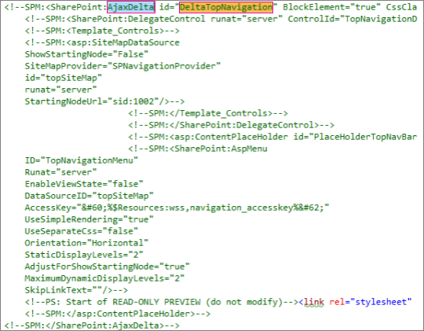

# <a name="navigation-options-for-sharepoint-online"></a>Navigationsoptionen für SharePoint Online

In diesem Artikel werden Navigations Options Websites mit aktivierter SharePoint-Veröffentlichung in SharePoint Online beschrieben. Die Auswahl und Konfiguration der Navigation wirkt sich erheblich auf die Leistung und Skalierbarkeit von Websites in SharePoint Online aus. Die Vorlage für die SharePoint-Veröffentlichungswebsite sollte nur bei Bedarf für ein zentralisiertes Portal verwendet werden, und das Veröffentlichungsfeature sollte nur auf bestimmten Websites aktiviert werden und nur, wenn es absolut erforderlich ist, da sich die Leistung bei falscher Verwendung auswirken kann.

>[!NOTE]
>Wenn Sie moderne SharePoint-Navigationsoptionen wie Mega-Menü, kaskadierende Navigation oder Hub-Navigation verwenden, gilt dieser Artikel nicht für Ihre Website. Moderne SharePoint-Website Architekturen nutzen eine vereinfachte Websitehierarchie und ein Hub-and-Spoke-Modell. Auf diese Weise können viele Szenarien erreicht werden, für die die Verwendung des SharePoint-Veröffentlichungsfeatures nicht erforderlich ist.

## <a name="overview-of-navigation-options"></a>Übersicht über Navigationsoptionen

Die Konfiguration des Navigations Anbieters kann die Leistung für den gesamten Standort erheblich beeinträchtigen, und es ist sorgfältig darauf zu achten, dass Sie einen Navigationsanbieter und eine Konfiguration auswählen, die für die Anforderungen einer SharePoint-Website effektiv skaliert wird. Es gibt zwei out-of-the-Box-Navigationsanbieter sowie benutzerdefinierte Navigations Implementierungen.

Die erste Option, die [**strukturelle Navigation**](#using-structural-navigation-in-sharepoint-online), ist die empfohlene Navigationsoption in SharePoint Online für klassische SharePoint-Websites, **Wenn Sie die Zwischenspeicherung der Struktur Navigation für Ihre Website aktivieren**. Dieser Navigationsanbieter zeigt die Navigationselemente unter der aktuellen Website und optional die aktuelle Website und ihre Geschwister an. Es bietet zusätzliche Funktionen wie Sicherheits Kürzung und Websitestruktur Aufzählung. Wenn die Zwischenspeicherung deaktiviert ist, wirkt sich dies negativ auf die Leistung und Skalierbarkeit aus, und die Einschränkung ist möglicherweise eingeschränkt.

Die zweite Option, [**verwaltete (Metadaten) Navigation**](#using-managed-navigation-and-metadata-in-sharepoint-online), stellt Navigationselemente mithilfe eines Ausdruckssatzes für verwaltete Metadaten dar. Es wird empfohlen, die Sicherheits Kürzung nur dann zu deaktivieren, wenn dies erforderlich ist. Das Trimmen von Sicherheitsgründen ist als sichere Standardeinstellung für diesen Navigationsanbieter aktiviert. für viele Websites ist jedoch der Aufwand der Sicherheits Kürzung nicht erforderlich, da Navigationselemente häufig für alle Benutzer der Website konsistent sind. Mit der empfohlenen Konfiguration zum Deaktivieren der Einschränkung der Sicherheit erfordert dieser Navigationsanbieter keine Aufzählung der Websitestruktur und ist hochgradig skalierbar mit akzeptabler Leistungsbeeinträchtigung.

Neben den standardmäßigen Navigations Anbietern haben viele Kunden erfolgreich Alternative benutzerdefinierte Navigations Implementierungen implementiert. Weitere Informationen finden Sie in diesem Artikel unter [Such gesteuerte clientseitige Skripts](#using-search-driven-client-side-scripting) .
  
## <a name="pros-and-cons-of-sharepoint-online-navigation-options"></a>Vorteile und Nachteile von SharePoint Online Navigationsoptionen

In der folgenden Tabelle sind die vor-und Nachteile der einzelnen Optionen zusammengefasst.

|Strukturelle Navigation  |Verwaltete Navigation  |Such gesteuerte Navigation  |Benutzerdefinierter Navigationsanbieter  |
|---------|---------|---------|---------|
|Experten<br/><br/>Einfache Wartung<br/>Getrimmte Sicherheit<br/>Wird automatisch innerhalb von 24 Stunden aktualisiert, wenn Inhalte geändert werden<br/>     |Experten<br/><br/>Einfache Wartung<br/>|Experten<br/><br/>Getrimmte Sicherheit<br/>Automatisch aktualisieren, wenn Websites hinzugefügt werden<br/>Schnelle Ladezeit und lokal zwischengespeicherte Navigationsstruktur<br/>|Experten<br/><br/>Breitere Auswahl von verfügbaren Optionen<br/>Schnelles Laden, wenn die Zwischenspeicherung ordnungsgemäß verwendet wird<br/>Viele Optionen funktionieren mit dem reaktionsschnellen Seitenentwurf gut<br/>|
|Nachteile<br/><br/>**Auswirkungen auf die Leistung, wenn die Zwischenspeicherung deaktiviert ist**<br/>Einschränkungen unterliegen<br/>|Nachteile<br/><br/>Nicht automatisch aktualisiert, um die Websitestruktur widerzuspiegeln<br/>**Auswirkungen auf die Leistung, wenn die Sicherheits Kürzung aktiviert ist** oder wenn die Navigationsstruktur Komplex ist<br/>|Nachteile<br/><br/>Keine Möglichkeit, Websites problemlos zu bestellen<br/>Erfordert die Anpassung der Gestaltungsvorlage (erforderliche technische Kenntnisse)<br/>|Nachteile<br/><br/>Benutzerdefinierte Entwicklung ist erforderlich<br/>Externe Datenquelle/Cachespeicherung erforderlich, beispielsweise Azure<br/>|

Die am besten geeignete Option für Ihre Website hängt von den Anforderungen Ihrer Website und ihrer technischen Leistungsfähigkeit ab. Wenn Sie einen einfach zu konfigurierenden Navigationsanbieter wünschen, der automatisch aktualisiert wird, wenn Inhalt geändert wird, ist die strukturelle Navigation [mit aktivierter Zwischenspeicherung](https://support.office.com/article/structural-navigation-and-performance-f163053f-8eca-4b9c-b973-36b395093b43) eine gute Option.

>[!NOTE]
>Die Anwendung des gleichen Prinzips wie moderne SharePoint-Websites durch Vereinfachung der allgemeinen Websitestruktur in einer flacheren, nicht hierarchischen Struktur verbessert die Leistung und vereinfacht das Wechseln zu modernen SharePoint-Websites. Dies bedeutet, dass statt einer einzelnen Websitesammlung mit Hunderten von Websites (Unterwebs) ein besserer Ansatz darin besteht, viele Websitesammlungen mit sehr wenigen Unterwebsites (Unterwebs) zu haben.

## <a name="analyzing-navigation-performance-in-sharepoint-online"></a>Analysieren der Navigationsleistung in SharePoint Online

Das [Seiten Diagnosetool für SharePoint](https://aka.ms/perftool) ist eine Browser Erweiterung für Microsoft Edge-und Chrome-Browser, die sowohl SharePoint Online moderne Portal-als auch klassische Veröffentlichungswebsite-Seiten analysiert. Dieses Tool funktioniert nur für SharePoint Online und kann nicht auf einer SharePoint-System Seite verwendet werden.

Das Tool generiert einen Bericht für jede analysierte Seite, die zeigt, wie die Seite mit einem vordefinierten Satz von Regeln ausgeführt wird, und zeigt ausführliche Informationen an, wenn Ergebnisse für einen Test außerhalb des Basiswerts liegen. SharePoint Online Administratoren und Designer können das Tool verwenden, um Leistungsprobleme zu beheben, um sicherzustellen, dass neue Seiten vor der Veröffentlichung optimiert werden.

**SPRequestDuration** ist insbesondere die Zeit, die SharePoint benötigt, um die Seite zu verarbeiten. Die schwere Navigation (beispielsweise das Einschließen von Seiten in der Navigation), komplexe Websitehierarchien und andere Konfigurations-und Topologiefunktionen können einen erheblichen Beitrag zur längeren Dauer leisten.

## <a name="using-structural-navigation-in-sharepoint-online"></a>Verwenden der Struktur Navigation in SharePoint Online

Dies ist die standardmäßig verwendete Navigation, die die einfachste Lösung ist. Es ist keine Anpassung erforderlich, und ein nicht technischer Benutzer kann auch auf einfache Weise Elemente hinzufügen, Elemente ausblenden und die Navigation auf der Seite "Einstellungen" verwalten. Es wird empfohlen, die [Zwischenspeicherung zu aktivieren](https://support.office.com/article/structural-navigation-and-performance-f163053f-8eca-4b9c-b973-36b395093b43), da andernfalls ein teurer Leistungskompromiss vorliegt.

### <a name="how-to-implement-structural-navigation-caching"></a>Vorgehensweise implementieren der Zwischenspeicherung der Struktur Navigation

Unter **Websiteeinstellungen**  >  **sehen und fühlen**  >  **Navigation**können Sie überprüfen, ob die strukturelle Navigation für die globale Navigation oder aktuelle Navigation ausgewählt ist. Das Auswählen von **Seiten anzeigen** wirkt sich negativ auf die Leistung aus.


Die Zwischenspeicherung kann auf Websitesammlungsebene und auf Websiteebene aktiviert oder deaktiviert werden und ist standardmäßig für beide aktiviert. Aktivieren **Site Settings**  >  **Site Collection Administration**  >  Sie das Kontrollkästchen zum **Aktivieren der Zwischenspeicherung**auf Websitesammlungsebene Unterwebsite Sammlungsverwaltung Website Sammlungs**Navigation**.


Aktivieren **Site Settings**  >  Sie das Kontrollkästchen **Zwischenspeicherung aktivieren**, um auf Websiteebene Unterwebsite Einstellungen zu**Navigieren**.


## <a name="using-managed-navigation-and-metadata-in-sharepoint-online"></a>Verwenden der verwalteten Navigation und der Metadaten in SharePoint Online

Die verwaltete Navigation ist eine weitere out-of-the-Box-Option, die Sie verwenden können, um die meisten der gleichen Funktionen wie die strukturelle Navigation neu zu erstellen. Verwaltete Metadaten können so konfiguriert werden, dass die Sicherheits Kürzung aktiviert oder deaktiviert wird. Bei deaktivierter Sicherheits Kürzung ist die verwaltete Navigation relativ effizient, da alle Navigationslinks mit einer Konstanten Anzahl von Server aufrufen geladen werden. Durch das Aktivieren der Sicherheits Kürzung werden jedoch einige der Leistungsvorteile der verwalteten Navigation negiert.

Wenn Sie das Kürzen von Sicherheitsgründen aktivieren müssen, empfehlen wir Folgendes:

- Aktualisieren aller benutzerfreundlichen URL-Links auf einfache Links
- Hinzufügen erforderlicher Sicherheits Kürzungs Knoten als benutzerfreundliche URLs
- Beschränken Sie die Anzahl der Navigationselemente auf nicht mehr als 100 und nicht mehr als 3 Ebenen tief

Für viele Websites ist keine Sicherheits Kürzung erforderlich, da die Navigationsstruktur häufig für alle Benutzer der Website konsistent ist. Wenn die Sicherheits Kürzung deaktiviert ist und der Navigation ein Link hinzugefügt wird, auf den nicht alle Benutzer Zugriff haben, wird der Link weiterhin angezeigt, führt jedoch zu einer Meldung mit Zugriff verweigert. Es besteht keine Gefahr eines versehentlichen Zugriffs auf den Inhalt.

### <a name="how-to-implement-managed-navigation-and-the-results"></a>Implementieren der verwalteten Navigation und der Ergebnisse

In docs.Microsoft.com finden Sie verschiedene Artikel zu den Details der verwalteten Navigation. Beispiel: siehe [Übersicht über die verwaltete Navigation in SharePoint Server](https://docs.microsoft.com/sharepoint/administration/overview-of-managed-navigation).

Um die verwaltete Navigation zu implementieren, richten Sie Begriffe mit URLs ein, die der Navigationsstruktur der Website entsprechen. Die verwaltete Navigation kann sogar manuell kuratiert werden, um die Struktur Navigation in vielen Fällen zu ersetzen. Beispiel:

)

## <a name="using-search-driven-client-side-scripting"></a>Verwenden von Such gesteuerten clientseitigen Skripts

Eine allgemeine Klasse von Implementierungen für benutzerdefinierte Navigation umfasst Client gerenderte Entwurfsmuster, die einen lokalen Cache von Navigationsknoten speichern.

Diese Navigationsanbieter haben einige wichtige Vorteile:

- Sie funktionieren im Allgemeinen gut mit reaktionsschnellen Seitendesigns.
- Sie sind extrem skalierbar und leistungsfähig, da Sie ohne Ressourcenkosten Rendern können (und nach einem Timeout im Hintergrund aktualisieren).
- Diese Navigationsanbieter können Navigationsdaten mithilfe verschiedener Strategien abrufen, von einfachen statischen Konfigurationen bis hin zu verschiedenen dynamischen Datenanbietern.

Ein Beispiel für einen Datenanbieter ist die Verwendung einer **Such gesteuerten Navigation**, die Flexibilität beim Aufzählen von Navigationsknoten und der effizienten Handhabung von Sicherheits Trimmungen ermöglicht.

Es gibt andere beliebte Optionen zum Erstellen **benutzerdefinierter Navigationsanbieter**. Weitere Anleitungen zum Erstellen eines benutzerdefinierten Navigations Anbieters finden Sie unter [Navigationslösungen für SharePoint Online-Portale](https://docs.microsoft.com/sharepoint/dev/solution-guidance/portal-navigation) .

Mithilfe der Suche können Sie die Indizes nutzen, die im Hintergrund mithilfe der kontinuierlichen Durchforstung aufgebaut werden. Die Suchergebnisse werden aus dem Suchindex abgerufen, und die Ergebnisse werden Sicherheits getrimmt. Dies ist im Allgemeinen schneller als bei der vordefinierten Navigation, wenn Sicherheits Kürzung erforderlich ist. Die Verwendung der Suche für die strukturelle Navigation, insbesondere wenn Sie über eine komplexe Websitestruktur verfügen, beschleunigt die Ladezeit der Seite erheblich. Der Hauptvorteil dieser über die verwaltete Navigation ist, dass Sie von Sicherheit Trimmen profitieren.

Dieser Ansatz umfasst das Erstellen einer benutzerdefinierten Gestaltungsvorlage und das Ersetzen des vordefinierten Navigations Codes durch benutzerdefinierten HTML-Code. Gehen Sie wie im folgenden Beispiel beschrieben vor, um den Navigationscode in der Datei zu ersetzen `seattle.html` . In diesem Beispiel werden Sie die Datei öffnen `seattle.html` und das gesamte `id="DeltaTopNavigation"` -Element durch benutzerdefinierten HTML-Code ersetzen.

### <a name="example-replace-the-out-of-the-box-navigation-code-in-a-master-page"></a>Beispiel: Ersetzen des Standard Navigations Codes in einer Gestaltungsvorlage

1. Navigieren Sie zur Seite Websiteeinstellungen.
2. Öffnen Sie den gestaltungsvorlagenkatalog, indem Sie auf **Masterseiten**klicken.
3. Von hier aus können Sie durch die Bibliothek navigieren und die Datei herunterladen `seattle.master` .
4. Bearbeiten Sie den Code mit einem Text-Editor, und löschen Sie den Codeblock im folgenden Screenshot.<br/><br/>
5. Entfernen Sie den Code zwischen den `<SharePoint:AjaxDelta id="DeltaTopNavigation">` und- `<\SharePoint:AjaxDelta>` Tags, und ersetzen Sie ihn durch den folgenden Codeausschnitt:<br/>

```javascript
<div id="loading">
  <!--Replace with path to loading image.-->
  <div style="background-image: url(''); height: 22px; width: 22px; ">
  </div>
</div>
<!-- Main Content-->
<div id="navContainer" style="display:none">
    <div data-bind="foreach: hierarchy" class="noindex ms-core-listMenu-horizontalBox">
        <a class="dynamic menu-item ms-core-listMenu-item ms-displayInline ms-navedit-linkNode" data-bind="attr: { href: item.Url, title: item.Title }">
            <span class="menu-item-text" data-bind="text: item.Title">
            </span>
        </a>
        <ul id="menu" data-bind="foreach: $data.children" style="padding-left:20px">
            <li class="static dynamic-children level1">
                <a class="static dynamic-children menu-item ms-core-listMenu-item ms-displayInline ms-navedit-linkNode" data-bind="attr: { href: item.Url, title: item.Title }">

                 <!-- ko if: children.length > 0-->
                    <span aria-haspopup="true" class="additional-background ms-navedit-flyoutArrow dynamic-children">
                        <span class="menu-item-text" data-bind="text: item.Title">
                        </span>
                    </span>
                <!-- /ko -->
                <!-- ko if: children.length == 0-->
                    <span aria-haspopup="true" class="ms-navedit-flyoutArrow dynamic-children">
                        <span class="menu-item-text" data-bind="text: item.Title">
                        </span>
                    </span>
                <!-- /ko -->
                </a>

                <!-- ko if: children.length > 0-->
                <ul id="menu"  data-bind="foreach: children;" class="dynamic  level2" >
                    <li class="dynamic level2">
                        <a class="dynamic menu-item ms-core-listMenu-item ms-displayInline  ms-navedit-linkNode" data-bind="attr: { href: item.Url, title: item.Title }">

          <!-- ko if: children.length > 0-->
          <span aria-haspopup="true" class="additional-background ms-navedit-flyoutArrow dynamic-children">
           <span class="menu-item-text" data-bind="text: item.Title">
           </span>
          </span>
           <!-- /ko -->
          <!-- ko if: children.length == 0-->
          <span aria-haspopup="true" class="ms-navedit-flyoutArrow dynamic-children">
           <span class="menu-item-text" data-bind="text: item.Title">
           </span>
          </span>
          <!-- /ko -->
                        </a>
          <!-- ko if: children.length > 0-->
         <ul id="menu" data-bind="foreach: children;" class="dynamic level3" >
          <li class="dynamic level3">
           <a class="dynamic menu-item ms-core-listMenu-item ms-displayInline ms-navedit-linkNode" data-bind="attr: { href: item.Url, title: item.Title }">
            <span class="menu-item-text" data-bind="text: item.Title">
            </span>
           </a>
          </li>
         </ul>
           <!-- /ko -->
                    </li>
                </ul>
                <!-- /ko -->
            </li>
        </ul>
    </div>
</div>
```

<br/>
6. Ersetzen Sie die URL im Tag Loading Image Anchor am Anfang durch einen Link zu einem Bild laden in Ihrer Websitesammlung. Nachdem Sie die Änderungen vorgenommen haben, benennen Sie die Datei um, und laden Sie Sie dann in den gestaltungsvorlagenkatalog hoch. Dadurch wird eine neue Masterdatei generiert.<br/>
7. Dieser HTML-Code ist das grundlegende Markup, das von den Suchergebnissen aufgefüllt wird, die von JavaScript-Code zurückgegeben werden. Sie müssen den Code so bearbeiten, dass der Wert für var root = "Website Sammlungs-URL" geändert wird, wie im folgenden Codeausschnitt gezeigt:<br/>

```javascript
var root = "https://spperformance.sharepoint.com/sites/NavigationBySearch";
```

<br/>
8. Die Ergebnisse werden dem Self. Nodes-Array zugewiesen, und eine Hierarchie wird aus den Objekten mit linq.js zuweisen der Ausgabe zu einem Array Self. Hierarchy erstellt. Dieses Array ist das Objekt, das an den HTML-Code gebunden ist. Dies erfolgt in der toggleView ()-Funktion, indem das Self-Objekt an die ko. applyBinding ()-Funktion übergeben wird.<br/>Dadurch wird das Hierarchie Array an den folgenden HTML-Code gebunden:<br/>

```javascript
<div data-bind="foreach: hierarchy" class="noindex ms-core-listMenu-horizontalBox">
```

Die Ereignishandler für `mouseenter` und `mouseexit` werden zur Navigation auf oberster Ebene hinzugefügt, um die Unterwebsite-Dropdownmenüs zu verarbeiten, die in der-Funktion ausgeführt werden `addEventsToElements()` .

In unserem komplexen Navigations Beispiel zeigt eine neue Seitenauslastung ohne lokale Zwischenspeicherung, dass die Zeit, die auf dem Server aufgewendet wurde, aus der Benchmark-Struktur Navigation reduziert wurde, um ein ähnliches Ergebnis wie beim verwalteten Navigations Ansatz zu erhalten.

### <a name="about-the-javascript-file"></a>Informationen zur JavaScript-Datei...

>[!NOTE]
>Wenn Sie benutzerdefiniertes JavaScript verwenden, stellen Sie sicher, dass das öffentliche CDN aktiviert ist und sich die Datei an einem CDN-Speicherort befindet.

Die gesamte JavaScript-Datei lautet wie folgt:

```javascript
//Models and Namespaces
var SPOCustom = SPOCustom || {};
SPOCustom.Models = SPOCustom.Models || {}
SPOCustom.Models.NavigationNode = function () {

    this.Url = ko.observable("");
    this.Title = ko.observable("");
    this.Parent = ko.observable("");

};

var root = "https://spperformance.sharepoint.com/sites/NavigationBySearch";
var baseUrl = root + "/_api/search/query?querytext=";
var query = baseUrl + "'contentClass=\"STS_Web\"+path:" + root + "'&trimduplicates=false&rowlimit=300";

var baseRequest = {
    url: "",
    type: ""
};


//Parses a local object from JSON search result.
function getNavigationFromDto(dto) {
    var item = new SPOCustom.Models.NavigationNode();
    if (dto != undefined) {

        var webTemplate = getSearchResultsValue(dto.Cells.results, 'WebTemplate');

        if (webTemplate != "APP") {
            item.Title(getSearchResultsValue(dto.Cells.results, 'Title')); //Key = Title
            item.Url(getSearchResultsValue(dto.Cells.results, 'Path')); //Key = Path
            item.Parent(getSearchResultsValue(dto.Cells.results, 'ParentLink')); //Key = ParentLink
        }

    }
    return item;
}

function getSearchResultsValue(results, key) {

    for (i = 0; i < results.length; i++) {
        if (results[i].Key == key) {
            return results[i].Value;
        }
    }
    return null;
}

//Parse a local object from the serialized cache.
function getNavigationFromCache(dto) {
    var item = new SPOCustom.Models.NavigationNode();

    if (dto != undefined) {

        item.Title(dto.Title);
        item.Url(dto.Url);
        item.Parent(dto.Parent);
    }

    return item;
}

/* create a new OData request for JSON response */
function getRequest(endpoint) {
    var request = baseRequest;
    request.type = "GET";
    request.url = endpoint;
    request.headers = { ACCEPT: "application/json;odata=verbose" };
    return request;
};

/* Navigation Module*/
function NavigationViewModel() {
    "use strict";
    var self = this;
    self.nodes = ko.observableArray([]);
    self.hierarchy = ko.observableArray([]);;
    self.loadNavigatioNodes = function () {
        //Check local storage for cached navigation datasource.
        var fromStorage = localStorage["nodesCache"];
        if (false) {
            var cachedNodes = JSON.parse(localStorage["nodesCache"]);

            if (cachedNodes && timeStamp) {
                //Check for cache expiration. Currently set to 3 hrs.
                var now = new Date();
                var diff = now.getTime() - timeStamp;
                if (Math.round(diff / (1000 * 60 * 60)) < 3) {

                    //return from cache.
                    var cacheResults = [];
                    $.each(cachedNodes, function (i, item) {
                        var nodeitem = getNavigationFromCache(item, true);
                        cacheResults.push(nodeitem);
                    });

                    self.buildHierarchy(cacheResults);
                    self.toggleView();
                    addEventsToElements();
                    return;
                }
            }
        }
        //No cache hit, REST call required.
        self.queryRemoteInterface();
    };

    //Executes a REST call and builds the navigation hierarchy.
    self.queryRemoteInterface = function () {
        var oDataRequest = getRequest(query);
        $.ajax(oDataRequest).done(function (data) {
            var results = [];
            $.each(data.d.query.PrimaryQueryResult.RelevantResults.Table.Rows.results, function (i, item) {

                if (i == 0) {
                    //Add root element.
                    var rootItem = new SPOCustom.Models.NavigationNode();
                    rootItem.Title("Root");
                    rootItem.Url(root);
                    rootItem.Parent(null);
                    results.push(rootItem);
                }
                var navItem = getNavigationFromDto(item);
                results.push(navItem);
            });
            //Add to local cache
            localStorage["nodesCache"] = ko.toJSON(results);

            localStorage["nodesCachedAt"] = new Date().getTime();
            self.nodes(results);
            if (self.nodes().length > 0) {
                var unsortedArray = self.nodes();
                var sortedArray = unsortedArray.sort(self.sortObjectsInArray);

                self.buildHierarchy(sortedArray);
                self.toggleView();
                addEventsToElements();
            }
        }).fail(function () {
            //Handle error here!!
            $("#loading").hide();
            $("#error").show();
        });
    };
    self.toggleView = function () {
        var navContainer = document.getElementById("navContainer");
        ko.applyBindings(self, navContainer);
        $("#loading").hide();
        $("#navContainer").show();

    };
    //Uses linq.js to build the navigation tree.
    self.buildHierarchy = function (enumerable) {
        self.hierarchy(Enumerable.From(enumerable).ByHierarchy(function (d) {
            return d.Parent() == null;
        }, function (parent, child) {
            if (parent.Url() == null || child.Parent() == null)
                return false;
            return parent.Url().toUpperCase() == child.Parent().toUpperCase();
        }).ToArray());

        self.sortChildren(self.hierarchy()[0]);
    };


    self.sortChildren = function (parent) {

        // sjip processing if no children
        if (!parent || !parent.children || parent.children.length === 0) {
            return;
        }

        parent.children = parent.children.sort(self.sortObjectsInArray2);

        for (var i = 0; i < parent.children.length; i++) {
            var elem = parent.children[i];

            if (elem.children && elem.children.length > 0) {
                self.sortChildren(elem);
            }
        }
    };

    // ByHierarchy method breaks the sorting in chrome and firefox
    // we need to resort  as ascending
    self.sortObjectsInArray2 = function (a, b) {
        if (a.item.Title() > b.item.Title())
            return 1;
        if (a.item.Title() < b.item.Title())
            return -1;
        return 0;
    };


    self.sortObjectsInArray = function (a, b) {
        if (a.Title() > b.Title())
            return -1;
        if (a.Title() < b.Title())
            return 1;
        return 0;
    }
}

//Loads the navigation on load and binds the event handlers for mouse interaction.
function InitCustomNav() {
    var viewModel = new NavigationViewModel();
    viewModel.loadNavigatioNodes();
}

function addEventsToElements() {
    //events.
      $("li.level1").mouseover(function () {
          var position = $(this).position();
          $(this).find("ul.level2").css({ width: 100, left: position.left + 10, top: 50 });
      })
   .mouseout(function () {
     $(this).find("ul.level2").css({  left: -99999, top: 0 });
   
    });
   
     $("li.level2").mouseover(function () {
          var position = $(this).position();
          console.log(JSON.stringify(position));
          $(this).find("ul.level3").css({ width: 100, left: position.left + 95, top:  position.top});
      })
   .mouseout(function () {
     $(this).find("ul.level3").css({  left: -99999, top: 0 });
    });
} _spBodyOnLoadFunctionNames.push("InitCustomNav");

```

Um den oben gezeigten Code in der Funktion zusammenzufassen, `jQuery $(document).ready` gibt es eine `viewModel object` erstellte und dann die- `loadNavigationNodes()` Funktion für dieses Objekt wird aufgerufen. Diese Funktion lädt entweder die zuvor erstellte Navigationshierarchie, die im lokalen HTML5-Speicher des Clientbrowsers gespeichert ist, oder Sie ruft die Funktion auf `queryRemoteInterface()` .

`QueryRemoteInterface()` erstellt eine Anforderung mithilfe der `getRequest()` Funktion mit dem zuvor im Skript definierten Abfrageparameter und gibt dann Daten vom Server zurück. Diese Daten sind im Wesentlichen ein Array aller Websites in der Websitesammlung, die als Daten Übertragungsobjekte mit verschiedenen Eigenschaften dargestellt werden.

Diese Daten werden dann in die zuvor definierten Objekte analysiert, `SPO.Models.NavigationNode` die `Knockout.js` zum Erstellen beobachtbarer Eigenschaften für die Verwendung durch Datenbindung der Werte in den HTML-Code verwenden, den wir zuvor definiert haben.

Die Objekte werden dann in ein Ergebnisarray eingefügt. Dieses Array wird mithilfe von Knockout in JSON analysiert und im lokalen Browser Speicher gespeichert, um die Leistung bei zukünftigen Seitenlasten zu verbessern.

### <a name="benefits-of-this-approach"></a>Vorteile dieses Ansatzes

Ein wesentlicher Vorteil [dieses Ansatzes](#example-replace-the-out-of-the-box-navigation-code-in-a-master-page) ist, dass die Navigation bei Verwendung des lokalen HTML5-Speichers lokal für den Benutzer gespeichert wird, wenn Sie das nächste Mal die Seite laden. Bei der Verwendung der Such-API für die strukturelle Navigation erhalten wir deutliche Leistungsverbesserungen. Es erfordert jedoch einige technische Funktionen zum Ausführen und Anpassen dieser Funktionalität.

In der [Beispielimplementierung](#example-replace-the-out-of-the-box-navigation-code-in-a-master-page)werden die Websites auf die gleiche Weise wie die standardmäßige Struktur Navigation sortiert. alphabetische Reihenfolge. Wenn Sie von dieser Reihenfolge abweichen möchten, wäre es komplizierter zu entwickeln und zu warten. Bei dieser Vorgehensweise müssen Sie auch von den unterstützten Masterseiten abweichen. Wenn die benutzerdefinierte Gestaltungsvorlage nicht beibehalten wird, verpasst ihre Website Updates und Verbesserungen, die Microsoft an den Gestaltungsvorlagen vornimmt.

Der [obige Code](#about-the-javascript-file) hat die folgenden Abhängigkeiten:

- jQuery https://jquery.com/
- KnockoutJS - https://knockoutjs.com/
- Linq.js- https://linqjs.codeplex.com/ oder GitHub.com/neuecc/-linq.js

Die aktuelle Version von LinqJS enthält nicht die ByHierarchy-Methode, die im obigen Code verwendet wird, und der Navigationscode wird unterbrochen. Um dies zu beheben, fügen Sie die folgende Methode zur Linq.js Datei vor der-Verbindung hinzu `Flatten: function ()` .

```javascript
ByHierarchy: function(firstLevel, connectBy, orderBy, ascending, parent) {
     ascending = ascending == undefined ? true : ascending;
     var orderMethod = ascending == true ? 'OrderBy' : 'OrderByDescending';
     var source = this;
     firstLevel = Utils.CreateLambda(firstLevel);
     connectBy = Utils.CreateLambda(connectBy);
     orderBy = Utils.CreateLambda(orderBy);

     //Initiate or increase level
     var level = parent === undefined ? 1 : parent.level + 1;

    return new Enumerable(function() {
         var enumerator;
         var index = 0;

        var createLevel = function() {
                 var obj = {
                     item: enumerator.Current(),
                     level : level
                 };
                 obj.children = Enumerable.From(source).ByHierarchy(firstLevel, connectBy, orderBy, ascending, obj);
                 if (orderBy !== undefined) {
                     obj.children = obj.children[orderMethod](function(d) {
                         return orderBy(d.item); //unwrap the actual item for sort to work
                     });
                 }
                 obj.children = obj.children.ToArray();
                 Enumerable.From(obj.children).ForEach(function(child) {
                     child.getParent = function() {
                         return obj;
                     };
                 });
                 return obj;
             };

        return new IEnumerator(

        function() {
             enumerator = source.GetEnumerator();
         }, function() {
             while (enumerator.MoveNext()) {
                 var returnArr;
                 if (!parent) {
                     if (firstLevel(enumerator.Current(), index++)) {
                         return this.Yield(createLevel());
                     }

                } else {
                     if (connectBy(parent.item, enumerator.Current(), index++)) {
                         return this.Yield(createLevel());
                     }
                 }
             }
             return false;
         }, function() {
             Utils.Dispose(enumerator);
         })
     });
 },

```
  
## <a name="related-topics"></a>Verwandte Themen

[Übersicht über die verwaltete Navigation in SharePoint Server](https://docs.microsoft.com/sharepoint/administration/overview-of-managed-navigation)

[Zwischenspeicherung und Leistung der Struktur Navigation](https://support.office.com/article/structural-navigation-and-performance-f163053f-8eca-4b9c-b973-36b395093b43)
