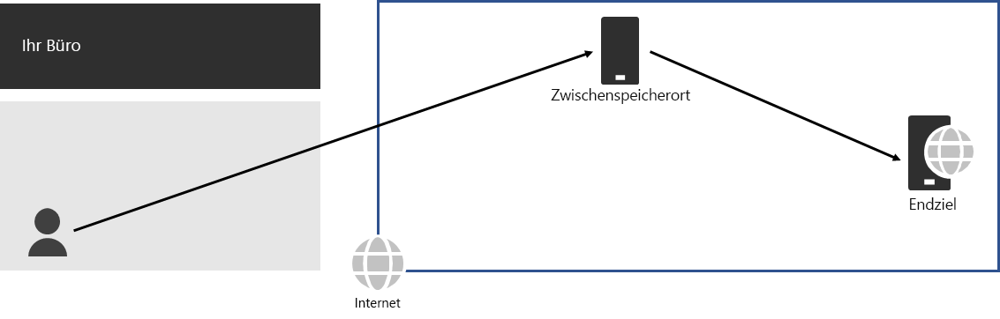
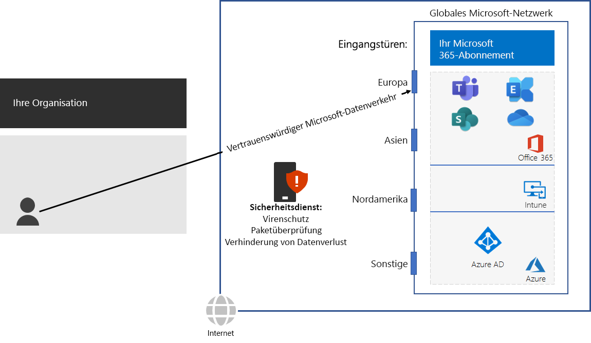

# Schritt 3: Vermeiden von Spitzkehren für NetzwerkeStep 3: Avoid network hairpins

*Dieser Schritt ist erforderlich und gilt für die Versionen E3 und E5 von Microsoft 365 Enterprise.**This step is required and applies to both the E3 and E5 versions of Microsoft 365 Enterprise*

Eine [Netzwerkhaarnadel](https://docs.microsoft.com/office365/enterprise/office-365-network-connectivity-principles#BKMK_P3) liegt vor, wenn der an ein Ziel gerichtete Datenverkehr zuerst an einen weiteren Zwischenstandort umgeleitet wird, z. B. an einen lokalen Sicherheitsstapel, einen Cloudzugriffsbroker oder ein cloudbasiertes Webgateway.A [network hairpin](https://docs.microsoft.com/office365/enterprise/office-365-network-connectivity-principles#BKMK_P3) happens when traffic bound for a destination is first directed to another intermediate location, such as an on-premises security stack, cloud access broker, or cloud-based web gateway. Hier ein Beispiel:Here is an example.

Eine Netzwerkhaarnadel kann auch durch unzureichendes Routing im Internet durch Netzwerkdienstanbieter verursacht werden.A network hairpin could also be caused by poor routing on the Internet due to network service providers. 

Eine Haarnadel fügt Latenz hinzu und kann potenziell den Datenverkehr an einen geografisch entfernten Standort umleiten.A hairpin adds latency and can potentially redirect traffic to a geographically distant location.

Überprüfen Sie zum Optimieren der Leistung für den Datenverkehr zu cloudbasierten Microsoft 365-Diensten, ob der ISP, der die lokale Internetverbindung bereitstellt, über eine direkte Peering-Beziehung mit dem Microsoft Global Network in der Nähe dieses Ziels verfügt. Diese Verbindungen haben keine Spitzkehren.To optimize performance for traffic to Microsoft 365 cloud-based services, check whether the ISP providing the local Internet connection has a direct peering relationship with the Microsoft Global Network in close proximity to that location. These connections do not have hairpins.

Wenn Sie cloudbasierte Netzwerk- oder Sicherheitsdienste für Microsoft 365-Datenverkehr verwenden, stellen Sie sicher, dass der Spitzkehreneffekt ausgewertet und die Auswirkung auf die Leistung verstanden wird. Überprüfen Sie Folgendes:If you use cloud-based network or security services for your Microsoft 365 traffic, ensure that the hairpinning effect is evaluated and its impact on performance is understood. Examine the following:

- Anzahl und Ziele der Dienstanbieter, durch die der Datenverkehr in Beziehung zu Ihren Zweigstellen und Microsoft Global Network-Peering-Punkten weitergeleitet wirdThe number and locations of your service providers through which the traffic is forwarded in relationship to your branch offices and Microsoft Global Network peering points 
- Qualität der Netzwerk-Peering-Beziehung des Dienstanbieters mit Ihrem ISP und MicrosoftThe quality of the network peering relationship of the service provider with your ISP and Microsoft 
- Leistungseinbußen von Backhauling in der Infrastruktur des DienstanbietersThe performance impact of backhauling in the service provider infrastructure

Wann immer möglich, konfigurieren Sie Ihre Edge-Router, um vertrauenswürdigen Microsoft 365-Datenverkehr direkt zu senden, statt ihn über eine Drittanbietercloud oder einen cloudbasierten Netzwerksicherheitsanbieterweiterzuleiten oder zu tunneln, der Ihren Internetdatenverkehr verarbeitet.Whenever possible, configure your edge routers to send trusted Microsoft 365 traffic directly, instead of proxying or tunneling through a third-party cloud or cloud-based network security vendor that processes your Internet traffic. 

Um zu testen, wie nahe Sie sich an einem Einstiegspunkt zum globalen Microsoft-Netzwerk befinden, und wie nahe Sie sich an dem Punkt befinden, an dem das Netzwerk Ihrer Organisation mit Ihrem ISP verbunden ist, verwenden Sie das [Office 365 Network Onboarding-Tool](https://connectivity.office.com/).To test how close you are to an entry point for Microsoft’s global network and how close you are to the point where your organization network connects to your ISP, use the [Office 365 Network Onboarding tool](https://connectivity.office.com/).

Als Zwischenprüfung können Sie die [Beendigungskriterien](networking-exit-criteria.md#crit-networking-step3) für diesen Schritt betrachten.As an interim checkpoint, you can see the [exit criteria](networking-exit-criteria.md#crit-networking-step3) for this step.

## Nächster SchrittNext step

|||
|:-------|:-----|
||[Konfigurieren von DatenverkehrumgehungenConfigure traffic bypass](networking-configure-proxies-firewalls.md)|
