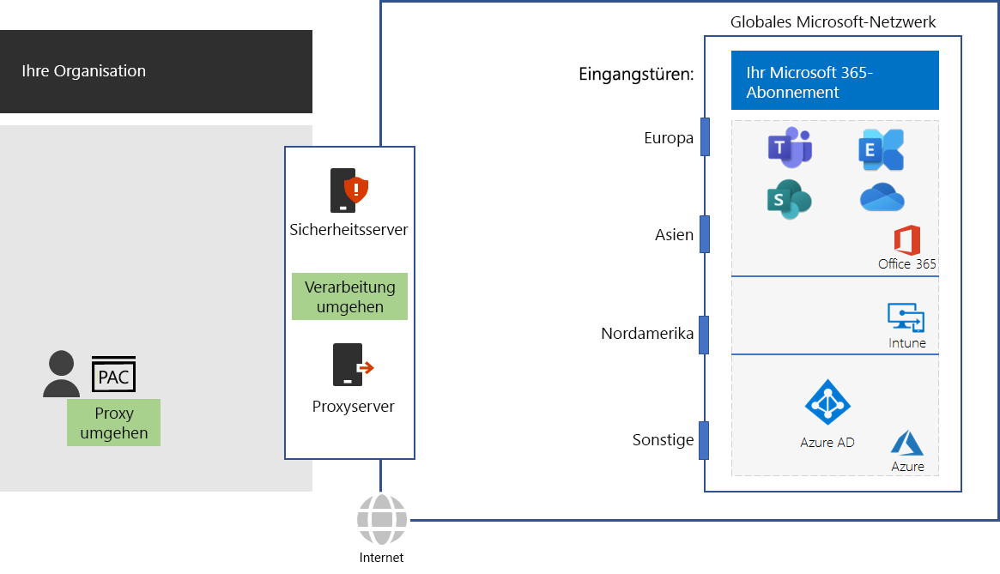

# Schritt 4: Konfigurieren von Datenverkehrumgehungen

*Dieser Schritt ist optional und gilt für die Versionen E3 und E5 von Microsoft 365 Enterprise.*

Da allgemeiner Internetdatenverkehr riskant sein kann, erzwingen typische Organisationsnetzwerke Sicherheit über Edge-Geräte wie Proxyserver, SSL Break and Inspect, Paketüberprüfungsgeräte sowie Systeme zur Verhinderung von Datenverlust. Unter [Verwenden von Netzwerkgeräten oder -lösungen von Drittanbietern für Microsoft 365-Datenverkehr](https://support.microsoft.com/help/2690045/using-third-party-network-devices-or-solutions-with-office-365) finden Sie einige Probleme mit Netzwerk-Abfanggeräten.

Die DNS-Domänennamen und IP-Adressen, die von cloudbasierten Microsoft 365-Diensten verwendet werden, sind bekannt. Zudem sind Datenverkehr und Dienste selbst durch viele Sicherheitsfeatures geschützt. Durch diese Sicherheit und diesen Schutz müssen Ihre Edge-Geräte dies nicht duplizieren. Zwischenziele und doppelte Sicherheitsverarbeitung für Microsoft 365-Datenverkehr können die Leistung erheblich senken.

Der erste Schritt zur Eliminierung von Zwischenzielen und doppelter Sicherheitsverarbeitung ist die Identifizierung von Microsoft 365-Datenverkehr. Microsoft hat die folgenden Typen von DNS-Domänennamen und IP-Adressbereichen, bekannt als Endpunkte, definiert:

- **Optimieren** – erforderlich für Verbindungen zu jedem Microsoft 365-Dienst, repräsentiert mehr als 75 % der Microsoft 365-Bandbreite, -Verbindungen und -Datenmenge. Diese Endpunkte bilden Microsoft 365-Szenarien ab, die am sensibelsten in Bezug auf Leistung, Latenz und Verfügbarkeit im Netzwerk sind.
- **Zulassen** – erforderlich für Konnektivität zu speziellen Microsoft 365-Diensten und -Features, die jedoch in Bezug auf Leistung und Latenz im Netzwerk nicht so sensibel sind wie die in der Kategorie „Optimieren“.
 - **Standard** – repräsentiert Microsoft 365-Dienste und -Abhängigkeiten, für die keine Optimierung erforderlich ist. Sie können standardmäßige Kategorie-Endpunkte als normalen Internetdatenverkehr behandeln.

Sie finden die DNS-Domänennamen und IP-Adressbereiche unter [ https://aka.ms/o365endpoints ](https://aka.ms/o365endpoints).

Microsoft empfiehlt Folgendes:

- Verwenden Sie Proxy Automatic Configuration(PAC)-Skripts für die Internetbrowser Ihrer lokalen Computer, um Ihre Proxyserver für die DNS-Domänennamen cloudbasierter Microsoft 365-Dienste zu umgehen. Das aktuelle Microsoft 365-PAC-Skript finden Sie im [Get-Pacfile-PowerShell-Skript](https://docs.microsoft.com/office365/enterprise/managing-office-365-endpoints#use-a-pac-file-for-direct-routing-of-vital-office-365-traffic).

- Analysieren Sie Ihre Edge-Geräte, um die doppelte Verarbeitung zu bestimmen, und konfigurieren Sie sie dann zum Weiterleiten von Datenverkehr an Optimieren- und Zulassen-Endpunkte ohne Verarbeitung. Dies wird als Umgehung des Datenverkehrs bezeichnet. 

Hier sind die Empfehlungen in Ihrer Netzwerkinfrastruktur.

Zu den Edgegeräten gehören Firewalls, SSL Break and Inspect, Paketüberprüfungsgeräte sowie Systeme zur Verhinderung von Datenverlust. Zum Konfigurieren und Aktualisieren der Konfigurationen von Edgegeräten können Sie ein Skript oder einen REST-Aufruf verwenden, um eine strukturierte Liste der Endpunkte vom Office 365-Endpunkte-Webdienst zu verwenden. Weitere Informationen finden Sie unter [Microsoft 365-IP-Adresse und -URL-Webdienst](https://docs.microsoft.com/office365/enterprise/office-365-ip-web-service).

Sie umgehen nur die normale Proxy- und Netzwerksicherheitsverarbeitung für Datenverkehr zu Microsoft 365-Endpunkten der Kategorie „Optimieren“ und „Zulassen“. Der andere allgemeine Internetdatenverkehr wird weitergeleitet und unterliegt Ihrer vorhandenen Netzwerksicherheitsverarbeitung.

## Optimieren des Datenverkehrs für Remote-Mitarbeiter, die VPN-Verbindungen verwenden

Verbindungen über ein virtuelles privates Netzwerk (VPN) werden in der Regel von Remote-Mitarbeitern für den Zugriff auf Ressourcen im Intranet einer Organisation verwendet. Eine herkömmliche VPN-Verbindung leitet den GESAMTEN Datenverkehr – einschließlich des Internet-Datenverkehrs – an das Organisationsintranet weiter. Der Internet-Datenverkehr wird an die Microsoft Edge-Netzwerk- und-Paket-Verarbeitungsgeräte der Organisation weitergeleitet. Dieser Datenverkehr unterliegt Transport- und Verarbeitungsverzögerungen, die wiederum die Leistung erheblich verringern und die Produktivität Ihrer Remote-Mitarbeiter beeinträchtigen können. 

Split-Tunneling ist die Fähigkeit einer VPN-Verbindung, bestimmten Datenverkehr über das Internet zu leitet statt diesen die VPN-Verbindung zu Ihrem Intranet zu senden. Um die optimale Leistung von für Remote-Mitarbeitern wesentlichen Microsoft 365-Diensten wie beispielsweise Teams, SharePoint Online und Exchange Online zu erzielen, konfigurieren Sie Ihre Split-Tunneling-VPN-Verbindungen so, dass Datenverkehr zur Optimierung von Endpunkten der Kategorie direkt über das Internet gesendet wird. 

Ausführliche Informationen finden Sie unter[Optimieren der Konnektivität für Remote-Benutzer mithilfe von VPN-Split-Tunneling](https://docs.microsoft.com/office365/enterprise/office-365-vpn-split-tunnel).

Um zu testen, wie nahe Sie sich an einem Einstiegspunkt zum globalen Microsoft-Netzwerk befinden, und wie nahe Sie sich an dem Punkt befinden, an dem das Netzwerk Ihrer Organisation mit Ihrem ISP verbunden ist, verwenden Sie das [Office 365 Network Onboarding-Tool](https://connectivity.office.com/).

Als Zwischenprüfung können Sie die [Beendigungskriterien](networking-exit-criteria.md#crit-networking-step4) für diesen Schritt betrachten.

## Nächster Schritt

|||
|:-------|:-----|
||[Optimieren der Leistung des Clients und des Diensts](networking-optimize-tcp-performance.md) |

