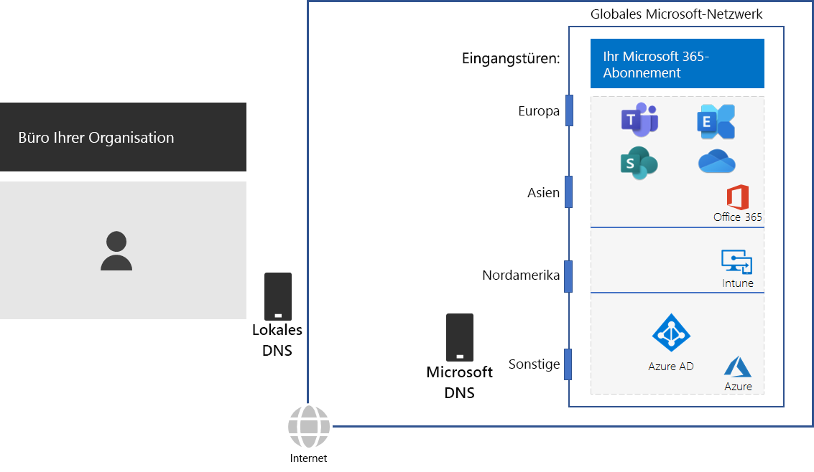
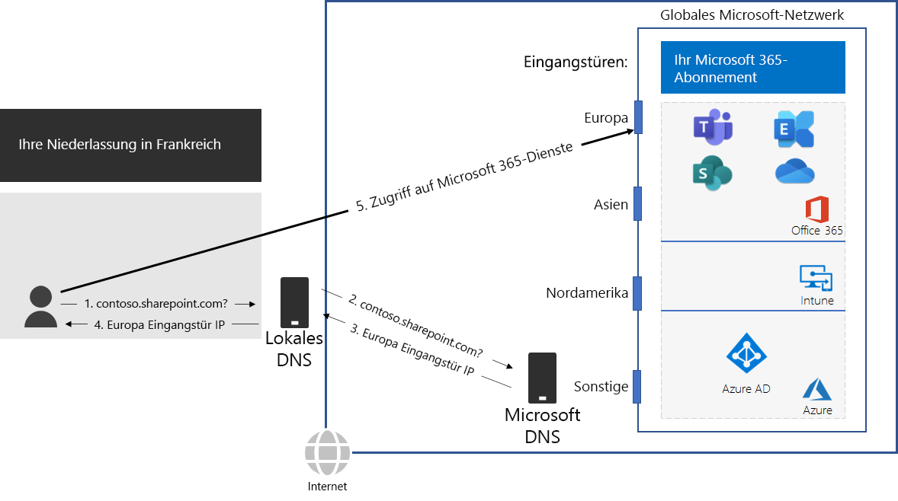

# Schritt 2: Konfigurieren von lokalen Internetverbindungen für jedes BüroStep 2: Configure local Internet connections for each office

*Dieser Schritt ist erforderlich und gilt für die Versionen E3 und E5 von Microsoft 365 Enterprise.**This step is required and applies to both the E3 and E5 versions of Microsoft 365 Enterprise*

Stellen Sie in Schritt 2 sicher, dass jedes Ihrer Büros über eine lokale Internetverbindung verfügt und lokale DNS-Server verwendet. Beides ist erforderlich, um Verbindungslatenz zu reduzieren und sicherzustellen, dass lokale Clientcomputer Verbindungen zum nächsten Einstiegspunkt für cloudbasierte Microsoft 365-Dienste herstellen.In Step 2, you ensure that each of your offices have local Internet connections and use local DNS servers. Both of these elements are required to reduce connection latency and ensure that on-premises client computers make connections to the nearest point of entry to Microsoft 365 cloud-based services.

In herkömmlichen Netzwerken für große Organisationen wird der Internetdatenverkehr über das Netzwerkbackbone zu einer zentralen Internetverbindung geleitet.In traditional networks for large organizations, Internet traffic travels across the network backbone to a central Internet connection. Dies eignet sich nicht gut zur Optimierung der Leistung für eine global verteilte SaaS-Infrastruktur (Software-as-a-Service), die die Office 365- und Intune-Produkte in Microsoft 365 umfasst.This does not work well for optimizing performance to a globally distributed Software-as-a-Service (SaaS) infrastructure, which includes the Office 365 and Intune products in Microsoft 365.

Das globale Microsoft-Netzwerk umfasst eine *Distributed Service Frontdoor-Infrastruktur*, ein hochgradig verfügbares und skalierbares Netzwerk-Edge mit geografisch verteilten Standorten.The Microsoft Global Network includes a *Distributed Service Front Door* infrastructure, a highly available and scalable network edge with geographically distributed locations. Es beendet die Endbenutzerverbindungen auf einem Frontdoor-Server und leitet den Endbenutzerdatenverkehr innerhalb des globalen Microsoft-Netzwerks effizient weiter.It terminates end user connections at a front door server and efficiently routes end user traffic within the Microsoft Global Network.

Die beste Leistung wird erzielt, wenn lokale Clients auf einen Frontdoor-Standort zugreifen, der ihnen geografisch am nächsten ist, statt Datenverkehr über ein Netzwerk-Backbone und zum Frontdoor-Server zu senden, der der zentralen Internetverbindung der Organisation am nächsten ist.For the best performance, on-premises clients should access a front door location that is geographically closest to them, rather than sending the traffic over a network backbone and to the front door that is closest to the organization’s central Internet connection.

Hier ein Beispiel:Here’s an example.

Ein Benutzer in der Pariser Zweigniederlassung möchte auf eine SharePoint Online-Website zugreifen:When a user in the Paris branch office wants to access a SharePoint Online site:

1. Er sendet eine DNS-Abfrage, um einen Namen aufzulösen, z. B. "contoso.sharepoint.com".It sends a DNS query to resolve a name, such as contoso.sharepoint.com. 
2. Der vom Internetdienstanbieter bereitgestellte DNS-Server leitet diese Abfrage an einen Microsoft-DNS-Server weiter.The DNS server provided by the ISP forwards that query to a Microsoft DNS server.
3. Die Microsoft-DNS-Server gleichen die Quell-IP-Adresse der weitergeleiteten DNS-Abfrage mit der Region der Welt ab, der diese Adresse zugewiesen ist.Microsoft’s DNS servers match the source IP address of the forwarded DNS query to the region of the world assigned that address. Der Microsoft-DNS-Server antwortet mit der IP-Adresse der nächstgelegenen Frontdoor des Microsoft-Netzwerks in Europa.The Microsoft DNS server responds with the IP address of the nearest Microsoft Network front door in Europe.
4. Der ISP-DNS-Server sendet diese IP-Adresse an den Benutzer.The ISP DNS server sends that IP address to the user.
5. Der Benutzer initiiert eine Verbindung mit dem SharePoint-Server über die Europa-Frontdoor.The user initiates a connection to the SharePoint server through the Europe front door.

Um eine Clientanforderung an den geografisch nächsten Frontdoor-Server zu leiten, verwenden die DNS-Server von Microsoft die DNS-Abfragen, die der anfänglichen Verbindungsanforderung des Clients entsprechen.To direct a client request to the geographically nearest front door, Microsoft’s DNS servers use the DNS queries corresponding the client’s initial connection request. Daher gilt für die niedrigste Netzwerklatenz Folgendes:Therefore, for the lowest network latency:

- Alle Büros Ihrer Organisation sollten eine lokale Internetverbindung für den Netzwerkdatenverkehr der Kategorie [Optimieren](https://docs.microsoft.com/office365/enterprise/office-365-network-connectivity-principles#new-office-365-endpoint-categories) haben.All offices of your organization should have local Internet connections for [Optimize](https://docs.microsoft.com/office365/enterprise/office-365-network-connectivity-principles#new-office-365-endpoint-categories) category network traffic.
- Jede lokale Internetverbindung sollte einen regionalen DNS-Server für ausgehenden Internetdatenverkehr von diesem Ort verwenden.Each local Internet connection should be using a regionally local DNS server for outbound Internet traffic from that location.

Weitere Informationen finden Sie unter [Lokaler Ausgang von Netzwerkverbindungen](https://docs.microsoft.com/office365/enterprise/office-365-network-connectivity-principles#egress-network-connections-locally).For more information, see [Egress network connections locally](https://docs.microsoft.com/office365/enterprise/office-365-network-connectivity-principles#egress-network-connections-locally). 

Als Zwischenprüfung können Sie die [Beendigungskriterien](networking-exit-criteria.md#crit-networking-step2) für diesen Schritt betrachten.As an interim checkpoint, you can see the [exit criteria](networking-exit-criteria.md#crit-networking-step2) for this step.

## Nächster SchrittNext step

|||
|:-------|:-----|
||[Vermeiden von Spitzkehren für NetzwerkeAvoid network hairpins](networking-avoid-network-hairpins.md)|
