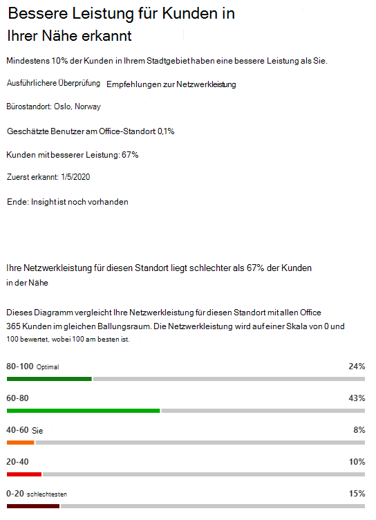

# Microsoft 365 Network Insights (Vorschau)Microsoft 365 Network Insights (preview)

**Netzwerkeinblicke** sind Leistungsmetriken, die von Ihrem mandanten Microsoft 365 erfasst werden und nur von administrativen Benutzern in Ihrem Mandanten angezeigt werden können.**Network insights** are performance metrics collected from your Microsoft 365 tenant, and available to view only by administrative users in your tenant. Einblicke werden im Microsoft 365 Admin Center unter <https://portal.microsoft.com/adminportal/home#/networkperformance> angezeigt.Insights are displayed in the Microsoft 365 Admin Center at <https://portal.microsoft.com/adminportal/home#/networkperformance>.

Einblicke sollen beim Entwerfen von Netzwerkperimetern für Ihre Bürostandorte helfen.Insights are intended to help in designing network perimeters for your office locations. Jeder Einblick enthält Livedetails zu den Leistungsmerkmalen für ein bestimmtes häufiges Problem für jeden geografischen Standort, an dem Benutzer auf Ihren Mandanten zugreifen.Each insight provides live details about the performance characteristics for a specific common issue for each geographic location where users are accessing your tenant.

Es gibt sechs spezifische Netzwerkeinblicke, die für jeden Bürostandort angezeigt werden können:There are six specific network insights that may be shown for each office location:

- [Backhauled network egressBackhauled network egress](#backhauled-network-egress)
- [NetzwerkvermittlergerätNetwork intermediary device](#network-intermediary-device)
- [Bessere Leistung für Kunden in Ihrer Nähe erkanntBetter performance detected for customers near you](#better-performance-detected-for-customers-near-you)
- [Verwenden einer nicht optimalen Exchange Online-Service-EingangstürUse of a non-optimal Exchange Online service front door](#use-of-a-non-optimal-exchange-online-service-front-door)
- [Verwenden einer nicht optimalen SharePoint Onlinedienst-EingangstürUse of a non-optimal SharePoint Online service front door](#use-of-a-non-optimal-sharepoint-online-service-front-door)
- [Niedrige Downloadgeschwindigkeit SharePoint EingangstürLow download speed from SharePoint front door](#low-download-speed-from-sharepoint-front-door)
- [Optimaler Netzwerk-Abgress für China-BenutzerChina user optimal network egress](#china-user-optimal-network-egress)

Es gibt zwei Netzwerkeinblicke auf Mandantenebene, die für den Mandanten angezeigt werden können.There are two tenant level network insights that may be shown for the tenant. Diese werden auch auf den Seiten für Produktivitätsergebnis angezeigt:These also appear in the productivity score pages:

- [Exchange verbindungen, die von Konnektivitätsproblemen betroffen sindExchange sampled connections impacted by connectivity issues](#exchange-sampled-connections-impacted-by-connectivity-issues)
- [SharePoint von Konnektivitätsproblemen betroffener BeispielverbindungenSharePoint sampled connections impacted by connectivity issues](#sharepoint-sampled-connections-impacted-by-connectivity-issues)

>[!IMPORTANT]
>Netzwerkeinblicke, Leistungsempfehlungen und Bewertungen im Microsoft 365 Admin Center befinden sich derzeit im Vorschaustatus und sind nur für Microsoft 365-Mandanten verfügbar, die im Featurevorschauprogramm registriert wurden.Network insights, performance recommendations and assessments in the Microsoft 365 Admin Center is currently in preview status, and is only available for Microsoft 365 tenants that have been enrolled in the feature preview program.

## Backhauled network egressBackhauled network egress

Diese Einsicht wird angezeigt, wenn der Netzwerkeinblickdienst erkennt, dass der Abstand zwischen einem bestimmten Benutzerstandort und dem Netzwerkeinsprung größer als 800 Kilometer ist, was darauf hinweist, dass Microsoft 365-Datenverkehr zu einem gängigen Internet-Edgegerät oder -proxy zurückgehauen wird.This insight will be displayed if the network insights service detects that the distance from a given user location to the network egress is greater than 500 miles (800 kilometers), indicating that Microsoft 365 traffic is being backhauled to a common Internet edge device or proxy.

Diese Einsicht wird in einigen Zusammenfassungsansichten Egress als "Egress" abgekürzt.This insight is abbreviated as "Egress" in some summary views.

> [!div class="mx-imgBorder"]
> 

### SzenarioWhat does this mean?

Dies gibt an, dass der Abstand zwischen dem Bürostandort und dem Netzwerkress mehr als 800 Kilometer beträgt.This identifies that the distance between the office location and the network egress is more than 500 miles (800 kilometers). Der Bürostandort wird durch einen verschleierten Clientcomputerspeicherort identifiziert, und der Netzwerk-Ausgangsspeicherort wird mithilfe der Reverse-IP-Adresse für Standortdatenbanken identifiziert.The office location is identified by an obfuscated client machine location and the network egress location is identified by using reverse IP Address to location databases. Der Bürostandort kann ungenau sein, Windows Standortdienste auf Computern deaktiviert sind.The office location may be inaccurate if Windows Location Services is disabled on machines. Der Standort des Netzwerk-Ausgangs kann ungenau sein, wenn die Reverse-IP-Adressdatenbankinformationen ungenau sind.The network egress location may be inaccurate if the reverse IP Address database information is inaccurate.

Details für diese Einblicke umfassen den Standort des Büros, den geschätzten Prozentsatz des gesamten Mandantenbenutzers am Standort, den aktuellen Standort für den Netzwerkbezug, die Relevanz des Ausgangsstandorts, den Abstand zwischen dem Standort und dem aktuellen Ausgangspunkt, das Datum, an dem die Bedingung zum ersten Mal erkannt wurde, und das Datum, an dem die Bedingung aufgelöst wurde.Details for this insight include the office location, estimated percentage of total tenant user at the location, the current network egress location, relevance of the egress location, the distance between the location and the current egress point, the date the condition was first detected, and the date the condition was resolved.

### Was soll ich machen?What should I do?

Für diesen Einblick empfehlen wir, dass das Netzwerk näher an den Bürostandort rückt, damit die Konnektivität optimal zum globalen Netzwerk von Microsoft und zur nächsten Microsoft 365-Service-Eingangstüre geroutet werden kann.For this insight, we would recommend network egress closer to the office location so that connectivity can route optimally to Microsoft's global network and to the nearest Microsoft 365 service front door. Die Enge des Netzwerkeinschlusses zu den Bürostandorten der Benutzer ermöglicht auch in Zukunft eine verbesserte Leistung, da Microsoft sowohl Netzwerkstandorte als auch Microsoft 365-Fronttüren erweitert.Having close network egress to users office locations also allows for improved performance in the future as Microsoft expands both network points of presence and Microsoft 365 service front doors in the future.

Weitere Informationen zum Beheben dieses Problems finden Sie unter [Egress netzwerkverbindungen lokal](microsoft-365-network-connectivity-principles.md#egress-network-connections-locally) in [Office 365 Network Connectivity Principles](microsoft-365-network-connectivity-principles.md).For more information about how to resolve this issue, see [Egress network connections locally](microsoft-365-network-connectivity-principles.md#egress-network-connections-locally) in [Office 365 Network Connectivity Principles](microsoft-365-network-connectivity-principles.md).

## NetzwerkvermittlergerätNetwork intermediary device

Diese Einsicht wird angezeigt, wenn wir Geräte zwischen Ihren Benutzern und dem Netzwerk von Microsoft erkannt haben, die sich auf die Office 365 auswirken können.This insight will be displayed if we detected devices between your users and Microsoft's network which may impact the Office 365 user experience. Es wird empfohlen, diese für bestimmte Netzwerkdatenverkehr Microsoft 365, der für Microsoft-Rechenzentren bestimmt ist, zu umgehen.It is recommended that these be bypassed for specific Microsoft 365 network traffic that is destined for Microsoft datacenters. Diese Empfehlung wird zusätzlich unter Microsoft 365 [Network Connectivity Principles beschrieben.](microsoft-365-network-connectivity-principles.md)This recommendation is additionally described in [Microsoft 365 Network Connectivity Principles](microsoft-365-network-connectivity-principles.md). 

Eine der Erkenntnisse des Netzwerkvermittlers ist die SSL-Unterbrechung und -Überprüfung, wenn kritische Office 365 Netzwerkendpunkte für Exchange, SharePoint und Teams von netzwerkvermittlern Geräten abgefangen und entschlüsselt werden.One network intermediary insight we show is SSL break and inspection when critical Office 365 network endpoints for Exchange, SharePoint and Teams are intercepted and decrypted by network intermediary devices.

### SzenarioWhat does this mean?

Netzwerkvermittlergeräte wie Proxyserver, VPNs und Verhinderung von Datenverlust können sich auf die Leistung und Stabilität Microsoft 365 Clients auswirken, auf denen Datenverkehr zwischengeschaltet wird.Network intermediary devices such as proxy servers, VPNs, and data loss prevention devices can affect performance and stability of Microsoft 365 clients where traffic is intermediated.

### Was soll ich machen?What should I do?

Konfigurieren Sie das netzwerkvermittlere Gerät, das erkannt wurde, um die Verarbeitung für Microsoft 365 zu umgehen.Configure the network intermediary device that was detected to bypass processing for Microsoft 365 network traffic.

## Bessere Leistung für Kunden in Ihrer Nähe erkanntBetter performance detected for customers near you

Diese Einsicht wird angezeigt, wenn der Netzwerk-Einblicke-Dienst erkennt, dass eine erhebliche Anzahl von Kunden in Ihrem U-Bahn-Bereich eine bessere Leistung als Benutzer in Ihrer Organisation an diesem Bürostandort hat.This insight will be displayed if the network insights service detects that a significant number of customers in your metro area have better performance than users in your organization at this office location.

Diese Einsicht wird in einigen Zusammenfassungsansichten als "Peers" abgekürzt.This insight is abbreviated as "Peers" in some summary views.

> [!div class="mx-imgBorder"]
> 

### SzenarioWhat does this mean?

Dieser Einblick untersucht die Gesamtleistung Microsoft 365 Kunden in derselben Stadt wie dieser Bürostandort.This insight examines the aggregate performance of Microsoft 365 customers in the same city as this office location. Diese Einsicht wird angezeigt, wenn die durchschnittliche Wartezeit Ihrer Benutzer um 10 % größer ist als die durchschnittliche Latenz der benachbarten Mandanten.This insight is displayed if the average latency of your users is 10% greater than the average latency of neighboring tenants.

### Was soll ich machen?What should I do?

Es kann viele Gründe für diese Bedingung geben, z. B. Wartezeiten in Ihrem Unternehmensnetzwerk oder Internetdienstanbieter, Engpässe oder Architekturdesignprobleme.There could be many reasons for this condition, including latency in your corporate network or ISP, bottlenecks, or architecture design issues. Untersuchen Sie die Wartezeit zwischen jedem Hop in der Route zwischen Ihrem Büronetzwerk und dem Microsoft 365 Eingangstür.Examine the latency between each hop in the route between your office network and the current Microsoft 365 front door. Weitere Informationen finden Sie unter [Microsoft 365 Network Connectivity Principles](microsoft-365-network-connectivity-principles.md).For more information, see [Microsoft 365 Network Connectivity Principles](microsoft-365-network-connectivity-principles.md).

## Verwenden einer nicht optimalen Exchange Online-Service-EingangstürUse of a non-optimal Exchange Online service front door

Diese Einsicht wird angezeigt, wenn der Netzwerk-Einblicke-Dienst erkennt, dass Benutzer an einem bestimmten Standort keine Verbindung mit einer optimalen Exchange Online herstellen.This insight will be displayed if the network insights service detects that users in a specific location are not connecting to an optimal Exchange Online service front door.

Diese Einsicht wird in einigen Zusammenfassungsansichten als "Routing" abgekürzt.This insight is abbreviated as "Routing" in some summary views.

> [!div class="mx-imgBorder"]
> 

### SzenarioWhat does this mean?

Wir listet Exchange Online,die für die Verwendung aus der Bürostandortstadt mit guter Leistung geeignet sind.We list Exchange Online service front doors which are suitable for use from the office location city with good performance. Wenn der aktuelle Test die Verwendung eines Exchange Online, der nicht in dieser Liste enthalten ist, wird diese Empfehlung angezeigt.If the current test shows use of an Exchange Online service front door not on this list, then we call out this recommendation.

### Was soll ich machen?What should I do?

Die Verwendung einer nicht optimalen Exchange Online-Fronttür des Diensts kann durch netzwerk backhaul verursacht werden, bevor das Unternehmensnetzwerk abfresst. In diesem Fall wird der lokale und direkte Netzwerkeinschwung empfohlen.Use of a non-optimal Exchange Online service front door could be caused by network backhaul before the corporate network egress in which case we recommend local and direct network egress. Dies kann auch durch die Verwendung eines Remote-DNS-Recursive Resolver-Servers verursacht werden. In diesem Fall wird empfohlen, den DNS-Rekursiven Resolver-Server am Netzwerkress auszurichten.It could also be caused by use of a remote DNS Recursive Resolver server in which case we recommend aligning the DNS Recursive Resolver server with the network egress.

## Verwenden einer nicht optimalen SharePoint Onlinedienst-EingangstürUse of a non-optimal SharePoint Online service front door

Diese Einsicht wird angezeigt, wenn der Netzwerkeinblickdienst erkennt, dass Benutzer an einem bestimmten Standort keine Verbindung mit der SharePoint Onlinedienst-Eingangstür herstellen.This insight will be displayed if the network insights service detects that users in a specific location are not connecting to the closest SharePoint Online service front door.

Diese Einsicht wird in einigen Zusammenfassungsansichten als "Afd" abgekürzt.This insight is abbreviated as "Afd" in some summary views.

> [!div class="mx-imgBorder"]
> 

### SzenarioWhat does this mean?

Wir identifizieren die SharePoint Onlinedienst-Eingangstür, mit der der Testclient eine Verbindung herstellen soll.We identify the SharePoint Online service front door that the test client is connecting to. Anschließend vergleichen wir dies für die Bürostandortstadt mit der erwarteten SharePoint Online-Service-Eingangstür für diese Stadt.Then for the office location city we compare that to the expected SharePoint Online service front door for that city. Wenn sie nicht übereinstimmen, wird diese Empfehlung empfohlen.If it doesn't match, then we make this recommendation.

### Was soll ich machen?What should I do?

Die Verwendung einer nicht optimalen SharePoint Online-Dienst-Eingangstür könnte durch Netzwerkhull vor dem Unternehmensnetzwerkeinziehen verursacht werden. In diesem Fall wird der lokale und direkte Netzwerkeinschwung empfohlen.Use of a non-optimal SharePoint Online service front door could be caused by network backhaul before the corporate network egress in which case we recommend local and direct network egress. Dies kann auch durch die Verwendung eines Remote-DNS-Recursive Resolver-Servers verursacht werden. In diesem Fall wird empfohlen, den DNS-Rekursiven Resolver-Server am Netzwerkress auszurichten.It could also be caused by use of a remote DNS Recursive Resolver server in which case we recommend aligning the DNS Recursive Resolver server with the network egress.

## Niedrige Downloadgeschwindigkeit SharePoint EingangstürLow download speed from SharePoint front door

Diese Einsicht wird angezeigt, wenn der Netzwerkeinblickdienst erkennt, dass die Bandbreite zwischen dem jeweiligen Bürostandort und SharePoint Online kleiner als 1 MBps ist.This insight will be displayed if the network insights service detects that bandwidth between the specific office location and SharePoint Online is less than 1 MBps.

Diese Einsicht wird in einigen Zusammenfassungsansichten als "Durchsatz" abgekürzt.This insight is abbreviated as "Throughput" in some summary views.

### SzenarioWhat does this mean?

Die Downloadgeschwindigkeit, die ein Benutzer von SharePoint Online- und OneDrive for Business-Service-Eingangstüren erhalten kann, wird in Megabyte pro Sekunde (MBps) gemessen.The download speed that a user can get from SharePoint Online and OneDrive for Business service front doors is measured in megabytes per second (MBps). Wenn dieser Wert kleiner als 1 MBps ist, geben wir diese Einsicht.If this value is less than 1 MBps then we provide this insight.

### Was soll ich machen?What should I do?

Um die Downloadgeschwindigkeit zu verbessern, muss möglicherweise die Bandbreite erhöht werden.To improve download speeds, bandwidth may need to be increased. Alternativ kann es zu Netzwerküberlastungen zwischen Denkautomaten am Bürostandort und der SharePoint Onlinedienst-Eingangstür kommen.Alternatively, there may be network congestion between user machines at the office location and the SharePoint Online service front door. Dies wird manchmal als verlustreich bezeichnet und schränkt die Downloadgeschwindigkeit ein, die Benutzern zur Verfügung steht, auch wenn genügend Bandbreite verfügbar ist.This is sometimes called congestive loss and it restricts the download speed available to users even if sufficient bandwidth is available.

## Optimaler Netzwerk-Abgress für China-BenutzerChina user optimal network egress

Dieser Einblick wird angezeigt, wenn Ihre Organisation Benutzer in China hat, die eine Verbindung zu Microsoft 365 an anderen geografischen Standorten herstellen.This insight will be displayed if your organization has users in China connecting to your Microsoft 365 tenant in other geographic locations. 

### SzenarioWhat does this mean?

Wenn Ihre Organisation über private WAN-Verbindungen verfügt, wird empfohlen, eine Netzwerk-WAN-Schaltung von Ihren Bürostandorten in China aus zu konfigurieren, die an einem der folgenden Speicherorte über eine Netzwerkverbindung zum Internet verfügen:If your organization has private WAN connectivity, we recommend configuring a network WAN circuit from your office locations in China that has network egress to the Internet in any of the following locations:

- HongkongHong Kong
- JapanJapan
- TaiwanTaiwan
- SüdkoreaSouth Korea
- SingapurSingapore
- MalaysiaMalaysia

Der Internetaustritt von Benutzern als diese Standorte führt zu leistungsbehinderndern, und ein Austritt in China kann aufgrund der grenzüberschreitenden Überlastung zu hohen Wartezeiten und Konnektivitätsproblemen führen.Internet egress further away from users than these locations will reduce performance, and egress in China may cause high latency and connectivity issues due to cross-border congestion.

### Was soll ich machen?What should I do?

Weitere Informationen zum Beheben von Leistungsproblemen im Zusammenhang mit dieser Einsicht finden Sie unter Microsoft 365 optimierung der globalen Mandantenleistung [für Chinesische Benutzer](microsoft-365-networking-china.md).For more information about how to mitigate performance issues related to this insight, see [Microsoft 365 global tenant performance optimization for China users](microsoft-365-networking-china.md).

## Exchange verbindungen, die von Konnektivitätsproblemen betroffen sindExchange sampled connections impacted by connectivity issues

Diese Einsicht zeigt, wann 50 % oder mehr der in der Stichprobe verwendeten Verbindungen betroffen sind.This insight will show when 50% or more of the sampled connections are impacted. Die Auswirkung wird durch die Exchange, die für jede Stichprobe unter 60 % liegt.The impact is defined by the Exchange assessment being below 60% for each sample.

### SzenarioWhat does this mean?

Dies ist ein Hinweis darauf, dass bei der Mehrzahl der Benutzer Probleme mit der Benutzererfahrung auftreten, wenn Outlook Verbindung mit Exchange Online.It is an indication that the majority of your users are likely to be experiencing user experience issues with Outlook connecting to Exchange Online. Der Prozentsatz der Stichproben stellt wahrscheinlich den Prozentsatz der Benutzer dar, die unter 60 Punkt angezeigt werden.The percentage of samples likely represents the percentage of users who show below 60 points.  

### Was soll ich machen?What should I do?

Aktivieren Sie die Sichtbarkeit der Netzwerkkonnektivität für Office-Standorte, wenn Sie dies noch nicht getan haben.Enable office location network connectivity visibility if you have not already done so. Sie möchten ermitteln, welche Büros von einer schlechten Netzwerkkonnektivität betroffen sind, die sich auf Exchange auswirken, und nach Möglichkeiten suchen, um den Netzwerkperimeter zu verbessern, der die Benutzer mit dem Netzwerk von Microsoft verbindet.You want to identify which offices are impacted by poor network connectivity that is impacting Exchange and find ways to improve the network perimeter at each that connects the users to Microsoft's network.

## SharePoint von Konnektivitätsproblemen betroffener BeispielverbindungenSharePoint sampled connections impacted by connectivity issues

Diese Einsicht zeigt, wann 50 % oder mehr der in der Stichprobe verwendeten Verbindungen betroffen sind.This insight will show when 50% or more of the sampled connections are impacted. Die Auswirkung wird durch die SharePoint, die für jede Stichprobe unter 40 % liegt.The impact is defined by the SharePoint assessment being below 40% for each sample.

### SzenarioWhat does this mean?

Dies ist ein Hinweis darauf, dass bei der Mehrzahl Ihrer Benutzer wahrscheinlich Probleme mit der Benutzererfahrung SharePoint und OneDrive.It is an indication that the majority of your users are likely to be experiencing user experience issues with SharePoint and OneDrive. Der Prozentsatz der Stichproben stellt wahrscheinlich den Prozentsatz der Benutzer dar, die unter 40 Punkt angezeigt werden.The percentage of samples likely represents the percentage of users who show below 40 points.  

### Was soll ich machen?What should I do?

Aktivieren Sie die Sichtbarkeit der Netzwerkkonnektivität für Office-Standorte, wenn Sie dies noch nicht getan haben.Enable office location network connectivity visibility if you have not already done so. Sie möchten ermitteln, welche Büros von einer schlechten Netzwerkkonnektivität betroffen sind, die sich auf SharePoint auswirken, und nach Möglichkeiten suchen, um den Netzwerkperimeter zu verbessern, der die Benutzer mit dem Netzwerk von Microsoft verbindet.You want to identify which offices are impacted by poor network connectivity that is impacting SharePoint and find ways to improve the network perimeter at each that connects the users to Microsoft's network.

## Verwandte ThemenRelated topics

[Netzwerkkonnektivität im Microsoft 365 Admin Center (Vorschau)Network connectivity in the Microsoft 365 Admin Center (preview)](office-365-network-mac-perf-overview.md)

[Microsoft 365 Netzwerkbewertung (Vorschau)Microsoft 365 network assessment (preview)](office-365-network-mac-perf-score.md)

[Microsoft 365 Netzwerkverbindungstesttool (Vorschau)Microsoft 365 network connectivity test tool (preview)](office-365-network-mac-perf-onboarding-tool.md)

[Microsoft 365 Network Connectivity Location Services (Vorschau)Microsoft 365 Network Connectivity Location Services (preview)](office-365-network-mac-location-services.md)
