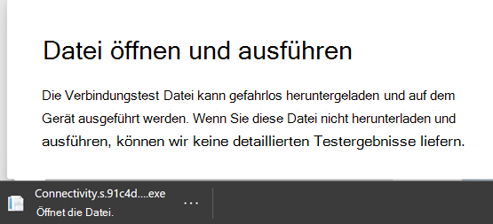
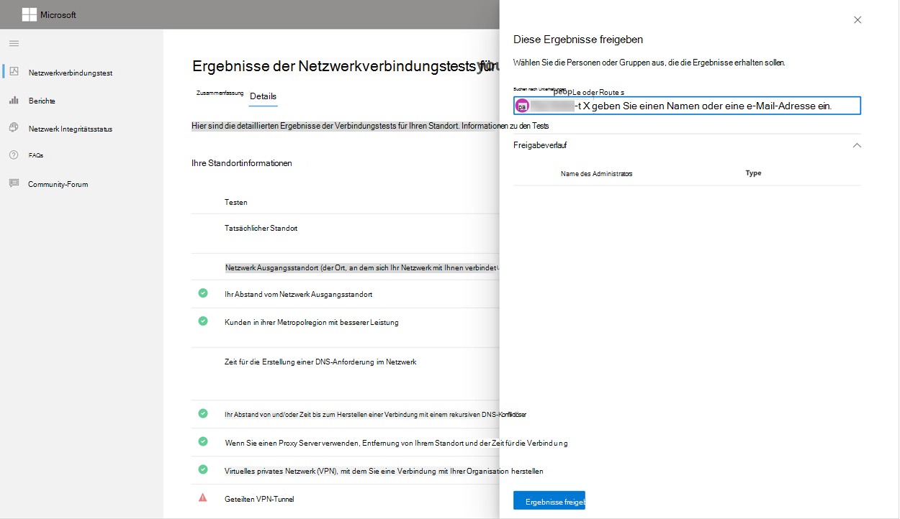
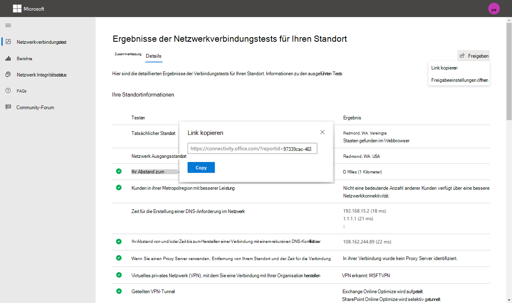
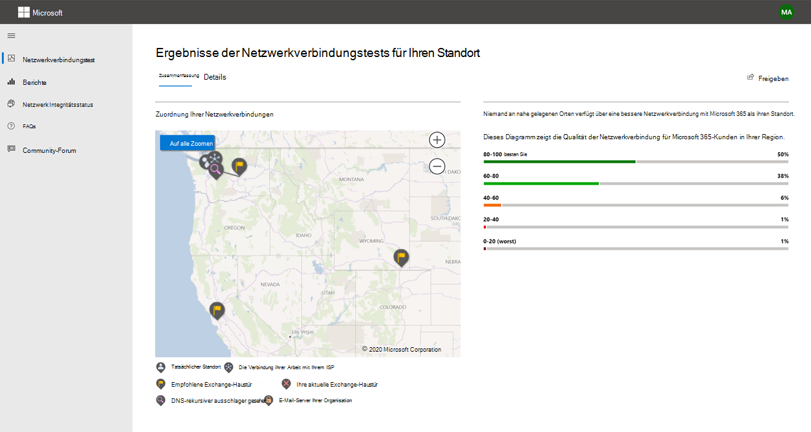
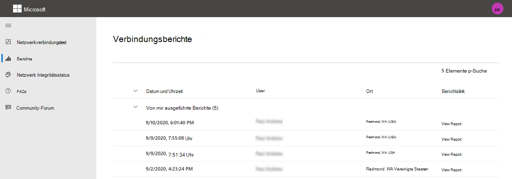
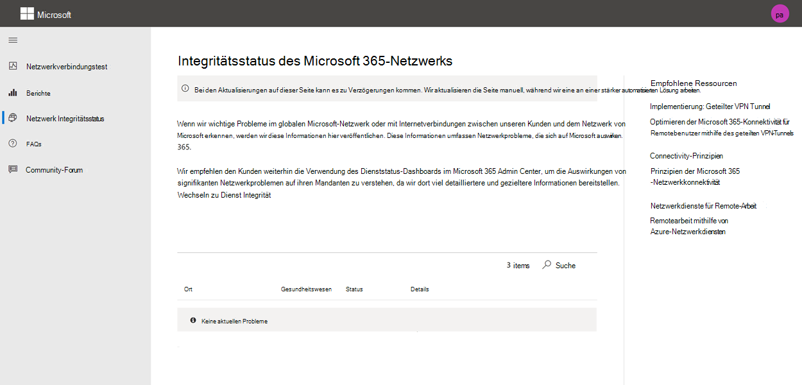

# Microsoft 365 Network Connectivity Test (Vorschau)

Das Microsoft 365 Network Connectivity Test Tool befindet sich unter <https://connectivity.office.com> . Es handelt sich um ein außerordentliches Tool für die Netzwerkbewertung und Informationen zum Netzwerk Einblicke, die im Microsoft 365 Admin Center unter **Health | Menü Konnektivität** .

>[!NOTE]
>Das Tool zum Testen von Netzwerkkonnektivität unterstützt Mandanten in WW Commercial und Deutschland, aber nicht gcc moderat, gcc High, DoD oder China.

Die Einblicke in das Netzwerk im Microsoft 365 Admin Center basieren auf regelmäßigen produktbezogenen Messungen für Ihren Microsoft 365-Mandanten, die täglich aggregiert werden. Im Vergleich dazu werden die Netzwerk Einblicke aus dem Microsoft 365 Network Connectivity Test lokal und einmal im Tool ausgeführt. Tests, die im Produkt ausgeführt werden können, sind limitiert, und durch das lokale Testen des Benutzers können weitere Daten gesammelt werden, was zu tieferen Einblicken führt. Betrachten Sie dann, dass das Netzwerk Einblicke in das Microsoft 365 Admin Center zeigt, dass es ein Netzwerkproblem für die Verwendung von Microsoft 365 an einem bestimmten Standort gibt. Der Microsoft 365-Verbindungstest kann helfen, die Ursache dieses Problems zu ermitteln, das zu einer empfohlenen Aktion zur Verbesserung der Netzwerkleistung führt.

Es wird empfohlen, dass diese zusammen verwendet werden, wenn der Status der Netzwerkqualität für jeden Office-Standort im Microsoft 365 Admin Center beurteilt werden kann und nach der Bereitstellung von Tests basierend auf dem Microsoft 365-Verbindungstest weitere Einzelheiten gefunden werden können.

>[!IMPORTANT]
>Netzwerk Einblicke, Leistungsempfehlungen und Bewertungen im Microsoft 365 Admin Center befinden sich derzeit im Vorschaustatus und stehen nur für Microsoft 365-Mandanten zur Verfügung, die im Feature Preview-Programm registriert wurden.

## Die Clientanwendung für erweiterte Tests

Der Microsoft 365-Netzwerkverbindungstest besteht aus zwei Teilen. die Website <https://connectivity.office.com> und eine herunterladbare Windows-Clientanwendung, die erweiterte Netzwerkverbindungstests ausführt. Bei den meisten Tests muss die Anwendung ausgeführt werden. Die Ergebnisse werden während der Ausführung wieder in die Webseite aufgefüllt.

Sie werden aufgefordert, die erweiterte Clienttestanwendung von der Website herunterzuladen, nachdem die Webbrowser Tests abgeschlossen wurden. Öffnen und führen Sie die Datei aus, wenn Sie dazu aufgefordert werden.

## Freigeben des Testberichts

Der Testbericht erfordert die Anmeldung bei Ihrem Office 365-Konto. Ihr Administrator wählt aus, wie Sie Ihren Testbericht freigeben können.

### Freigeben des Berichts für Ihren Administrator

Alle Testberichte, während Sie angemeldet sind, werden für den Administrator freigegeben.

### Freigabe mit Ihrem Microsoft-Konto Team, Support oder andere Mitarbeiter

Test Berichte ohne persönliche Identifikation werden für Microsoft-Mitarbeiter freigegeben. Diese Option ist standardmäßig aktiviert und kann von Ihrem Administrator im Bereich "Integrität" deaktiviert werden **| Seite "Netzwerkkonnektivität** " im Microsoft 365 Admin Center.

### Freigabe mit anderen Benutzern, die sich bei demselben Office 365 Mandanten anmelden

Sie können Benutzer auswählen, mit denen der Bericht freigegeben werden soll, und diese Option ist standardmäßig aktiviert. Sie kann auch von Ihrem Administrator deaktiviert werden.

### Freigeben für beliebige Personen mithilfe eines Berichts-Link

Sie können Ihren Testbericht für jeden freigeben, indem Sie Zugriff auf einen Berichts-Link bereitstellen. Dadurch wird eine URL generiert, die Sie an eine andere Person senden können, damit Sie den Testbericht ohne Anmeldung einschalten kann. Diese Option ist standardmäßig deaktiviert und muss vom Administrator aktiviert werden.

## Ergebnisse der Netzwerkverbindungstests

Die Ergebnisse werden auf den Registerkarten **Zusammenfassung** und **Details** angezeigt. Die Registerkarte Zusammenfassung zeigt eine Zuordnung des erkannten Netzwerkperimeters und einen Vergleich der Netzwerkbewertung mit anderen Office 365 Kunden in der Nähe. Außerdem kann der Testbericht freigegeben werden. Hier sehen Sie, wie die Zusammenfassungs Ergebnisansicht aussieht.

Im folgenden finden Sie ein Beispiel für die im Tool dargestellte Ausgabe der Registerkarte Details. Auf der Registerkarte Details wird ein Häkchen im grünen Kreis angezeigt, wenn das Ergebnis günstig mit einem Schwellenwert verglichen wurde. Wenn das Ergebnis einen Schwellenwert angibt, der eine Netzwerk Einblicke angibt, wird ein rotes Dreieck angezeigt. In den folgenden Abschnitten werden die einzelnen Ergebniszeilen der Registerkarte Details beschrieben, und es werden die Schwellenwerte für Netzwerk Einblicke erläutert.

### Ihre Standortinformationen

In diesem Abschnitt werden Testergebnisse im Zusammenhang mit Ihrem Standort angezeigt.

#### Ihr Standort

Der Benutzer Speicherort wird vom Webbrowser der Benutzer erkannt oder kann bei der Benutzerauswahl eingegeben werden. Es wird verwendet, um Netzwerk Entfernungen zu bestimmten Teilen des Unternehmensnetzwerk Perimeters zu identifizieren. Nur der Ort, an dem diese Standorterkennung erfolgt, und der Abstand zu anderen Netzwerkpunkten werden im Bericht gespeichert.

Der Speicherort des Benutzer Büros wird in der Kartenansicht angezeigt.

#### Netzwerk Ausgangsstandort (der Ort, an dem sich Ihr Netzwerk mit Ihrem ISP verbindet)

Wir identifizieren die IP-Adresse für den Netzwerk Ausstieg auf der Serverseite. Standortdatenbanken werden verwendet, um den ungefähren Standort für das Netzwerk Ausstiegs Ziel zu suchen. Diese Datenbanken weisen in der Regel eine Genauigkeit von ungefähr 90% der IP-Adressen auf. Wenn der von der Netzwerk Ausgangs-IP-Adresse gesuchte Standort nicht korrekt ist, würde dies zu einem falschen Ergebnis dieses Tests führen. Um zu überprüfen, ob dieser Fehler für eine bestimmte IP-Adresse auftritt, können Sie Websites mit öffentlich zugänglichen Netzwerk-IP-Adress Standorten verwenden, um mit Ihrem tatsächlichen Standort zu vergleichen.

#### Ihr Abstand vom Netzwerk Ausgangsstandort

Wir bestimmen den Abstand von diesem Ort zum Bürostandort. Dies wird als Netzwerk Einblicke angezeigt, wenn der Abstand größer als **500 Meilen** (800 Kilometer) ist, da dies wahrscheinlich die TCP-Wartezeit um mehr als 25ms erhöht und die Benutzerfreundlichkeit beeinträchtigen kann.

Der Netzwerk Ausgangsstandort wird in der Kartenansicht angezeigt und mit dem Benutzer Bürostandort verbunden, der das Netzwerk Backhaul innerhalb des Enterprise-WAN angibt.

Für die Microsoft 365-Netzwerkkonnektivität wird das Implementieren des Ausstiegs von lokalen und direkten Netzwerken von Benutzer Bürostandorten ins Internet empfohlen. Verbesserungen an lokalem und direktem Ausstieg sind die beste Möglichkeit, diese Netzwerk Einblicke zu beheben.

#### Proxy Server Informationen

Wir identifizieren auf dem lokalen Computer konfigurierte Proxy Server (s). Wir ermitteln, ob eine dieser Einstellungen im Netzwerkpfad für die Kategorie Optimieren von Microsoft 365-Netzwerkdatenverkehr konfiguriert ist. Wir identifizieren den Abstand zwischen dem Benutzer Bürostandort und den Proxyservern. Der Abstand wird zuerst durch ICMP-Ping getestet, und wenn dies nicht der Fall ist, testen wir mit TCP-Ping und schließlich, wenn dies fehlschlägt, wird die IP-Adresse des Proxyservers in einer IP-Adress Standortdatenbank gesucht. Wir zeigen ein Netzwerk Einblicke, wenn der Proxy Server mehr als **500 Meilen** (800 Kilometer) vom Benutzer Bürostandort entfernt ist.

#### Virtuelles privates Netzwerk (VPN), mit dem Sie eine Verbindung mit Ihrer Organisation herstellen

Dadurch wird festgestellt, ob Sie ein VPN verwenden, um eine Verbindung mit Office 365 herzustellen. Ein übergebenes Ergebnis wird angezeigt, wenn Sie über kein VPN verfügen oder wenn Sie über ein VPN mit einer empfohlenen Konfiguration für geteilte Tunnel für Office 365 verfügen.

#### Geteilten VPN-Tunnel

Jede Route für die Optimierung der Kategorie für Exchange Online, SharePoint Online und Microsoft Teams wird getestet, um festzustellen, ob Sie auf dem VPN getunnelt ist oder nicht. Bei einer geteilten Arbeitsauslastung wird das VPN vollständig vermieden. Eine getunnelt-Arbeitsauslastung wird über das VPN gesendet. Für eine selektive getunnelt-Arbeitsauslastung wurden einige Routen über das VPN und einige ausgeteilte Pfade gesendet. Ein übergebenes Ergebnis zeigt an, ob alle Arbeitsauslastungen verteilt sind oder selektive getunnelt.

#### Kunden in ihrer Metropolregion mit besserer Leistung

Die TCP-Netzwerkwartezeit des Benutzer Office-Standorts für die Exchange Online-Dienst-Haustür wird mit anderen Microsoft 365-Kunden im gleichen Metro-Bereich verglichen. Ein Netzwerk Einblicke wird angezeigt, wenn 10% oder mehr Kunden in derselben Metro-Region eine bessere Leistung aufweisen. Dies bedeutet, dass Ihre Benutzer in der Microsoft 365-Benutzeroberfläche eine bessere Leistung erzielen.

Diese Netzwerk Einblicke werden auf der Grundlage generiert, dass alle Benutzer in einer Stadt Zugriff auf die gleiche Telekommunikationsinfrastruktur und die gleiche Nähe zu Internet Stromkreisen und dem Netzwerk von Microsoft haben.

#### Zeit für die Erstellung einer DNS-Anforderung im Netzwerk

Dies zeigt den DNS-Server, der auf dem Clientcomputer konfiguriert ist, auf dem die Tests ausgeführt wurden. Es kann sich um einen DNS-rekursive resolverserver handeln, dies ist jedoch ungewöhnlich. Es ist wahrscheinlicher, dass es sich um einen DNS-Weiterleitungsserver handelt, der DNS-Ergebnisse zwischenspeichert und alle nicht zwischengespeicherten DNS-Anforderungen an einen anderen DNS-Server weiterleitet.

Dies wird nur für Informationen bereitgestellt und trägt nicht zu Netzwerk Einblicken bei.

#### Ihr Abstand von und/oder Zeit bis zum Herstellen einer Verbindung mit einem rekursiven DNS-Konfliktlöser

Der in-use-DNS-rekursive Konfliktlöser wird identifiziert, indem eine bestimmte DNS-Anforderung gestellt und der DNS-Namen Server für die IP-Adresse, von der die gleiche Anforderung empfangen wurde, gefragt wird. Diese IP-Adresse ist der DNS-rekursive Konfliktlöser, der in Datenbanken für IP-Adressen zum Auffinden des Speicherorts nachgeschlagen wird. Der Abstand zwischen dem Benutzer Bürostandort und dem DNS-Serverspeicherort für rekursive Resolver wird dann berechnet. Dies wird als Netzwerk Einblicke angezeigt, wenn der Abstand größer als **500 Meilen** (800 Kilometer) ist.

Der Standort, der von der IP-Adresse des Netzwerks ausgehoben nachgeschlagen wurde, ist möglicherweise nicht genau, was zu einem falschen Ergebnis dieses Tests führen würde. Um zu überprüfen, ob dieser Fehler für eine bestimmte IP-Adresse auftritt, können Sie Websites mit öffentlich zugänglichen Netzwerk-IP-Adress Standorten verwenden.

Diese Netzwerk Einblicke wirkt sich insbesondere auf die Auswahl der Frontklappe für den Exchange Online Dienst aus. Um diese Einblicke zu beheben, sollten lokale und direkte Netzwerk Ausstiege eine Voraussetzung sein, und dann sollte sich der DNS-rekursive Konfliktlöser in der Nähe dieses ausgehenden Netzwerks befinden.

### Exchange Online

In diesem Abschnitt werden Testergebnisse im Zusammenhang mit Exchange Online aufgeführt.

#### Exchange-Dienst-Haustür Standort

Die in-use-Exchange-Dienst-Haustür wird auf die gleiche Weise wie in Outlook erkannt, und wir messen die TCP-Netzwerkwartezeit vom Benutzerstandort an. Die TCP-Wartezeit wird angezeigt, und die Haustür des in-use-Exchange-Diensts wird mit der Liste der besten Front-Service-Türen für den aktuellen Standort verglichen. Dies wird als Netzwerk Einblicke angezeigt, wenn einer der besten Haustüre (n) des Exchange-Diensts nicht verwendet wird.

Nicht die Verwendung eines der besten Exchange-Dienst-Front-Door (s) könnte durch Netzwerk Backhaul vor dem Ausstieg des Unternehmensnetzwerks verursacht werden, in diesem Fall empfehlen wir den Ausstieg aus dem lokalen und direkten Netzwerk. Es kann auch durch die Verwendung eines Remote-DNS-rekursive Auflösungs Servers verursacht werden, in dem der Fall empfohlen wird, den DNS-rekursive Auflösungs Server mit dem Netzwerk Ausstieg auszurichten.

Wir berechnen eine mögliche Verbesserung der TCP-Wartezeit (MS) für die Haustür des Exchange-Diensts. Betrachten Sie dazu die Wartezeit für das getestete Benutzer Bürostandort Netzwerk und subtrahieren Sie die Netzwerkwartezeit vom aktuellen Standort an die Frontklappe für den Exchange-Dienst für Schränke. Der Unterschied stellt die mögliche Verbesserungsmöglichkeit dar.

#### Beste Exchange-Dienst-Haustür (en) für Ihren Standort

Auf dieser Seite werden die besten Exchange-Dienst-Haustür Standorte nach Ort für Ihren Standort aufgelistet.

#### Im Client-DNS aufgezeichnete Dienst-Haustür

Dies zeigt den DNS-Namen und die IP-Adresse des Exchange-Dienst-Front-Door-Servers an, an den Sie weitergeleitet wurden. Er wird nur für Informationen bereitgestellt, und es gibt keine zugeordnete Netzwerk Einblicke.

### SharePoint Online

In diesem Abschnitt werden die Testergebnisse im Zusammenhang mit SharePoint Online und OneDrive.

#### Die Dienst-Haustür Position

Die in-use-SharePoint-Dienst-Haustür wird auf die gleiche Weise wie der OneDrive-Client erkannt, und wir messen die TCP-Netzwerkwartezeit vom Benutzer Bürostandort an.

#### Download Geschwindigkeit

Wir messen die Downloadgeschwindigkeit für eine 15MB-Datei von der Haustür des SharePoint-Diensts. Das Ergebnis wird in Megabytes pro Sekunde angezeigt, um anzugeben, welche Größe die Datei in Megabytes in **einer Sekunde**von SharePoint oder OneDrive heruntergeladen werden kann. Die Zahl sollte einem Zehntel der minimalen Bandbreiten Bandbreite in Megabit pro Sekunde entsprechen. Wenn Sie beispielsweise über eine Internetverbindung mit 100 Mbit/s verfügen, erwarten Sie möglicherweise 10 Megabyte pro Sekunde (10MBps).

#### Puffer aufblasen

Während des 15MB-Downloads Messen wir die TCP-Wartezeit für die SharePoint-Dienst-Haustür. Dies ist die Wartezeit unter Last und wird mit der Wartezeit verglichen, wenn Sie nicht unter Last steht. Die Verzögerung bei der Auslastung ist häufig auf Geräte Puffer im Consumer-Netzwerk zurückzuführen, die geladen (oder aufgebläht) werden. Ein Netzwerk Einblicke wird für jede Aufblähung von 1.000 oder mehr angezeigt.

#### Im Client-DNS aufgezeichnete Dienst-Haustür

Dies zeigt den DNS-Namen und die IP-Adresse des SharePoint-Dienst-Front-Door-Servers an, an den Sie weitergeleitet wurden. Er wird nur für Informationen bereitgestellt, und es gibt keine zugeordnete Netzwerk Einblicke.

### Microsoft Teams

In diesem Abschnitt werden Testergebnisse im Zusammenhang mit Microsoft Teams aufgeführt.

#### Medien Konnektivität (Audio-, Video-und Anwendungsfreigabe)

Diese testet die UDP-Konnektivität mit der Haustür des Microsoft Teams-Diensts. Wenn dies blockiert ist, arbeiten Microsoft Teams möglicherweise weiterhin mit TCP, aber Audio und Video werden beeinträchtigt. Lesen Sie mehr über diese UDP-Netzwerk Messungen, die auch für Microsoft Teams bei der [Leistung von Medienqualität und Netzwerkkonnektivität in Skype for Business Online](https://docs.microsoft.com/skypeforbusiness/optimizing-your-network/media-quality-and-network-connectivity-performance) gelten.

#### Paketverlust

Zeigt den UDP-Paketverlust, der in einem 10 Sekunden Test-Audioanruf vom Client an die Haustür des Microsoft Teams-Diensts gemessen wurde. Dies sollte bei einem Durchgang unter **1,00%** liegen.

### Wartezeit

Zeigt die gemessene UDP-Wartezeit, die niedriger als **100M**sein sollte.

#### Jitter

Zeigt den gemessenen UDP-Jitter an, der niedriger als **30ms**sein sollte.

#### Konnektivität

Wir testen die http-Konnektivität vom Benutzer Bürostandort bis hin zu allen erforderlichen Microsoft 365-Netzwerkendpunkten. Diese werden unter veröffentlicht [https://aka.ms/o365ip](https://aka.ms/o365ip) . Für alle erforderlichen Netzwerkendpunkte, mit denen keine Verbindung hergestellt werden kann, wird ein Netzwerk Einblicke angezeigt.

Die Konnektivität ay wird durch einen Proxy Server, eine Firewall oder ein anderes Netzwerksicherheitsgerät im Umkreis des Unternehmensnetzwerks blockiert oder als Cloud-Proxy verwendet.

Wir testen das SSL-Zertifikat an jedem erforderlichen Microsoft 365-Netzwerkendpunkt, der sich in der Kategorie Optimize oder Allow gemäß der Definition unter befindet [https://aka.ms/o365ip](https://aka.ms/o365ip) . Wenn Tests kein Microsoft SSL-Zertifikat finden, muss das verschlüsselte Netzwerk, das verbunden ist, von einem zwischengeschalteten Netzwerkgerät abgefangen worden sein. Ein Netzwerk Einblicke wird auf allen abgefangenen verschlüsselten Netzwerkendpunkten angezeigt.

Wenn ein SSL-Zertifikat gefunden wird, das nicht von Microsoft bereitgestellt wird, wird der FQDN für den Test und der in-Use-SSL-Zertifikatbesitzer angezeigt. Bei diesem SSL-Zertifikatbesitzer kann es sich um einen Proxy Server Anbieter oder um ein selbstsigniertes Enterprise-Zertifikat handeln.

#### Netzwerkpfad

In diesem Abschnitt werden die Ergebnisse eines ICMP-Traceroutes für die Exchange Online-Dienst-Haustür, die Haustür des SharePoint Online-Diensts und die Haustür des Microsoft Teams-Diensts dargestellt. Er wird nur für Informationen bereitgestellt, und es gibt keine zugeordnete Netzwerk Einblicke. Es werden drei Traceroutes bereitgestellt. Ein traceroute zu _Outlook.office365.com_, ein traceroute an das SharePoint-Front-End von Kunden oder _Microsoft.SharePoint.com_ , wenn nicht angegeben, und ein traceroute zu _World.tr.Teams.Microsoft.com_.

## Was geschieht bei jedem Test Schritt

### Office-Standortidentifikation

Wenn Sie auf die Schaltfläche Test ausführen klicken, wird die Seite zum Ausführen des Tests angezeigt, und der Office-Standort wird identifiziert. Sie können Ihren Standort nach Ort, Bundesland und Land eingeben, oder Sie können ihn über den Webbrowser erkennen lassen. Wenn Sie ihn erkennen, fordern wir den breiten-und Längengrad des Webbrowsers an und begrenzen die Genauigkeit auf 300m um 300m vor der Verwendung. Dies ist der Fall, da es nicht erforderlich ist, den Standort genauer als das Gebäude für die Netzwerkleistung zu identifizieren. 

### JavaScript-Tests

Nach der Office-Standort Identifizierung führen wir einen TCP-Latenz Test in JavaScript aus, und wir fordern Daten vom Dienst zur Verwendung und empfohlenen Office 365 Dienst-Front-Door-Server an. Wenn diese abgeschlossen sind, werden Sie auf der Karte und auf der Registerkarte "Details" angezeigt, wo Sie vor dem nächsten Schritt angezeigt werden können.

### Herunterladen der Clientanwendung für erweiterte Tests

Als nächstes starten wir den Download der Clientanwendung für erweiterte Tests. Wir setzen auf den Benutzer, um die Clientanwendung zu starten, und Sie müssen auch .net Core installiert haben.

### Starten der Clientanwendung für erweiterte Tests

Sobald die Clientanwendung gestartet wird, wird die Webseite aktualisiert, damit diese angezeigt wird und die Testdaten beginnen, auf der Webseite empfangen zu werden. Es wird jedes Mal aktualisiert, wenn neue Daten empfangen werden, und Sie können die Daten bei ihrer Ankunft überprüfen.

### Erweiterte Tests abgeschlossen und Testbericht hochladen

Sobald die Tests abgeschlossen sind, wird die Webseite und der Client für erweiterte Tests beide auf diese Angabe hinweisen, und wenn der Benutzer im Testbericht angemeldet ist, wird er in den Mandanten "Customers" hochgeladen.

## Verbindungsberichte

Wenn Sie angemeldet sind, können Sie frühere Berichte überprüfen, die Sie ausgeführt haben. Sie können Sie auch freigeben oder aus der Liste löschen.

## Netzwerk Integritätsstatus

Dies zeigt erhebliche gesundheitliche Probleme mit dem globalen Microsoft-Netzwerk, die sich möglicherweise auf Microsoft 365-Kunden auswirken.

## Häufig gestellte Fragen (FAQ)

Hier finden Sie Antworten auf einige unserer häufig gestellten Fragen.

### Wird dieses Tool von Microsoft veröffentlicht und unterstützt?

Es handelt sich derzeit um eine Vorschau, und wir planen, Updates regelmäßig bereitzustellen, bis der allgemeine Verfügbarkeitsstatus mit Unterstützung von Microsoft erreicht wird. Bitte geben Sie uns Feedback, damit wir Sie verbessern können. Wir planen, eine detailliertere Office 365 Netzwerk-Onboarding Guide als Teil dieses Tools zu veröffentlichen, das für die Organisation durch die Testergebnisse angepasst wird.

### Was ist erforderlich, um den Advanced Test-Client auszuführen?

Der erweiterte Testclient erfordert .net Core 3,1 Desktop Runtime. Wenn Sie den Advanced Test-Client ohne installiert ausführen, werden Sie zur [Seite .net Core 3,1 Installer](https://dotnet.microsoft.com/download/dotnet-core/3.1)weitergeleitet. Stellen Sie sicher, dass Sie die Desktop Laufzeit und nicht das SDK oder die ASP.net-Kern Laufzeit installieren, die höher auf der Seite sind. Administrator Berechtigungen für den Computer sind reuqired zur Installation von .net Core. 

### Was ist Microsoft 365-Dienst-Haustür?

Die Microsoft 365-Dienst-Haustür ist ein Einstiegspunkt im globalen Microsoft-Netzwerk, in dem Office-Clients und-Dienste Ihre Netzwerkverbindung beenden. Für eine optimale Netzwerkverbindung mit Microsoft 365 wird empfohlen, dass Ihre Netzwerkverbindung mit der nächstgelegenen Microsoft 365-Haustür in ihrer Stadt oder ihrer Metro beendet wird.

Hinweis: Microsoft 365-Dienst Haustür hat keine direkte Beziehung zum **Azure-Front-Door-Dienst** Produkt, das im Azure Marketplace verfügbar ist.

### Was ist die beste Haustür des Microsoft 365-Diensts?

Eine beste Microsoft 365-Dienst-Haustür (früher als optimale Dienst Haustür bezeichnet) ist eine, die Ihrem Netzwerk Austritt am nächsten ist, in der Regel in ihrer Stadt oder Metro. Verwenden Sie das Microsoft 365 Network Performance Tool, um den Standort Ihrer Haustür mit Microsoft 365-Dienst und den besten Service-Front-Door (s) zu ermitteln. Wenn das Tool feststellt, dass Ihre in-use-Haustür eine der besten ist, sollten Sie eine gute Anbindung an das globale Netzwerk von Microsoft erwarten.

### Was ist ein Internet Ausstieg-Standort?

Der Internet Ausgangsstandort ist der Ort, an dem Ihr Netzwerkdatenverkehr Ihr Unternehmensnetzwerk verlässt und eine Verbindung mit dem Internet herstellt. Dies wird auch als Standort bezeichnet, an dem Sie ein NAT-Gerät (Network Address Translation, Netzwerkadressübersetzung) haben und in der Regel eine Verbindung mit einem Internetdienstanbieter (Internet Service Provider, ISP) herstellen. Wenn Sie einen langen Abstand zwischen Ihrem Standort und Ihrem Internet Ausgangsstandort sehen, kann dies eine erhebliche WAN-Backhaul erkennen.

## Verwandte Themen

[Empfehlungen zur Netzwerkleistung im Microsoft 365 Admin Center (Vorschau)](office-365-network-mac-perf-overview.md)

[Microsoft 365 Network Performance Insights (Vorschau)](office-365-network-mac-perf-insights.md)

[Microsoft 365 Netzwerkbewertung (Vorschau)](office-365-network-mac-perf-score.md)

[Microsoft 365 Network Connectivity Location Services (Vorschau)](office-365-network-mac-location-services.md)
