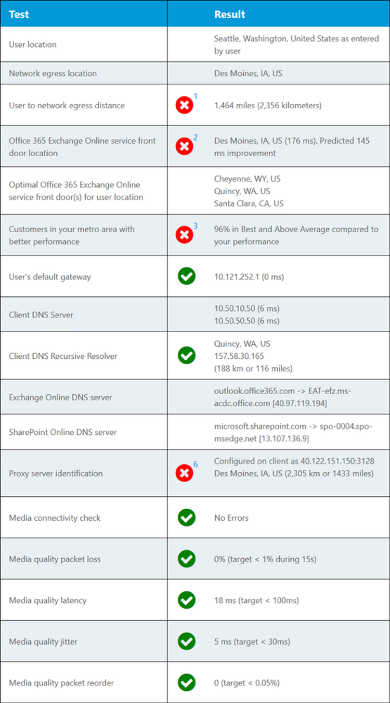

# Microsoft 365 Connectivity Test im Microsoft 365 Admin Center (Vorschau)

Der Microsoft 365 Connectivity Test befindet sich unter <https://connectivity.office.com> . Es handelt sich um ein außerordentliches Tool für die Netzwerk Einblicke und Informationen zur Netzwerkbewertung, die im Microsoft 365 Admin Center unter **Health | Menü Netzwerkleistung** .

>[!NOTE]
>Das Onboarding-Tool unterstützt Mandanten in WW Commercial und gcc moderat, aber nicht gcc High, DoD, Deutschland oder China.

Die Einblicke in das Netzwerk im Microsoft 365 Admin Center basieren auf produktinternen Messungen für Ihren Microsoft 365-Mandanten. Im Vergleich dazu werden die Netzwerk Einblicke aus dem Microsoft 365-Verbindungstest lokal im Tool ausgeführt. Tests, die im Produkt ausgeführt werden können, sind limitiert, und durch das lokale Testen des Benutzers können weitere Daten gesammelt werden, was zu tieferen Einblicken führt. Betrachten Sie dann, dass das Netzwerk Einblicke in das Microsoft 365 Admin Center zeigt, dass es ein Netzwerkproblem für die Verwendung von Microsoft 365 an einem bestimmten Standort gibt. Der Microsoft 365-Verbindungstest kann helfen, die Ursache dieses Problems zu ermitteln, das zu einer empfohlenen Aktion zur Verbesserung der Netzwerkleistung führt.

Es wird empfohlen, dass diese zusammen verwendet werden, wenn der Status der Netzwerkqualität für jeden Office-Standort im Microsoft 365 Admin Center beurteilt werden kann und nach der Bereitstellung von Tests basierend auf dem Microsoft 365-Verbindungstest weitere Einzelheiten gefunden werden können.

>[!IMPORTANT]
>Netzwerk Einblicke, Leistungsempfehlungen und Bewertungen im Microsoft 365 Admin Center befinden sich derzeit im Vorschaustatus und stehen nur für Microsoft 365-Mandanten zur Verfügung, die im Feature Preview-Programm registriert wurden.

## Die Clientanwendung für erweiterte Tests

Der Microsoft 365-Verbindungstest besteht aus zwei Teilen. Es gibt die Website <https://connectivity.office.com> , und es gibt eine herunterladbare Windows-Clientanwendung. Der herunterladbare Client führt erweiterte Netzwerkverbindungstests aus, und die meisten Tests bedürfen dieser Ausführung.

Sie können den Advanced Client-Test auf der Website ausführen, und die Ergebnisse werden während der Ausführung wieder in die Webseite aufgefüllt.

## Speicherort des Benutzer Büros

Der Benutzer-Office-Standort wird im Webbrowser users erkannt. Es wird verwendet, um Netzwerk Entfernungen zu bestimmten Teilen des Unternehmensnetzwerk Perimeters zu identifizieren.

Der Speicherort des Benutzer Büros wird in der Kartenansicht angezeigt.

## Entfernung zum Ausgangsstandort des Netzwerks

Wir identifizieren die IP-Adresse für den Netzwerk Ausstieg auf der Serverseite. Standortdatenbanken werden verwendet, um den ungefähren Standort für das Netzwerk Ausgangsverzeichnis nachzuschlagen und den Abstand zwischen diesem Standort und dem Bürostandort zu ermitteln. Dies wird als Netzwerk Einblicke angezeigt, wenn der Abstand größer als 500 Meilen (800 Kilometer) ist.

Der Netzwerk Ausgangsstandort wird in der Kartenansicht angezeigt und mit dem Benutzer Bürostandort verbunden, der das Netzwerk Backhaul innerhalb des Enterprise-WAN angibt.

Der Standort, der von der IP-Adresse des Netzwerks ausgehoben nachgeschlagen wurde, ist möglicherweise nicht genau, was zu einem falschen Ergebnis dieses Tests führen würde. Um zu überprüfen, ob dieser Fehler für eine bestimmte IP-Adresse auftritt, können Sie Websites mit öffentlich zugänglichen Netzwerk-IP-Adress Standorten verwenden.

Für die Microsoft 365-Netzwerkkonnektivität wird das Implementieren des Ausstiegs von lokalen und direkten Netzwerken von Benutzer Bürostandorten ins Internet empfohlen. Verbesserungen an lokalem und direktem Ausstieg sind die beste Möglichkeit, diese Netzwerk Einblicke zu beheben.

## Exchange Online Dienst Haustür

Das in-use-Exchange Online Dienst-Front-Door wird auf die gleiche Weise wie in Outlook erkannt, und wir messen die TCP-Netzwerkwartezeit vom Benutzer Bürostandort an. Diese werden sowohl angezeigt als auch die in-use-Exchange Online Dienst-Haustür wird mit der Liste der empfohlenen optimalen Dienst Fronttüren für den aktuellen Standort verglichen. Dies wird als Netzwerk Einblicke angezeigt, wenn eine nicht optimale Exchange Online-Dienst-Haustür verwendet wird.

Die Verwendung eines nicht optimalen Exchange Online Dienst-Front-Door könnte durch Netzwerk Backhaul vor dem Ausstieg des Unternehmensnetzwerks verursacht werden, in diesem Fall empfehlen wir den Ausstieg aus dem lokalen und direkten Netzwerk. Es kann auch durch die Verwendung eines Remote-DNS-rekursive Auflösungs Servers verursacht werden, in dem der Fall empfohlen wird, den DNS-rekursive Auflösungs Server mit dem Netzwerk Ausstieg auszurichten.

Wir berechnen eine mögliche Verbesserung der TCP-Wartezeit für die Haustür des Exchange Online Diensts. Betrachten Sie dazu die Wartezeit für das getestete Benutzer Bürostandort Netzwerk und subtrahieren Sie die Netzwerkwartezeit vom aktuellen Standort an die Schränke Exchange Online Dienst vor der Haustür. Der Unterschied stellt die mögliche Verbesserungsmöglichkeit dar.

## Vergleich der Leistung von Kunden in der Region

Die TCP-Netzwerkwartezeit des Benutzer Office-Standorts für die Exchange Online-Dienst-Haustür wird mit anderen Microsoft 365-Kunden im gleichen Metro-Bereich verglichen. Ein Netzwerk Einblicke wird angezeigt, wenn 10% oder mehr Kunden in derselben Metro-Region eine bessere Leistung aufweisen.

Diese Netzwerk Einblicke werden auf der Grundlage generiert, dass alle Benutzer in einer Stadt Zugriff auf die gleiche Telekommunikationsinfrastruktur und die gleiche Nähe zu Internet Stromkreisen und dem Netzwerk von Microsoft haben.

## In Use Default Gateway

Das in-use-Standardgateway ist der Router, der vom Testclient für das Routing von TCP/IP-Netzwerkverbindungen konfiguriert wurde.

Dies wird nur für Informationen bereitgestellt und trägt nicht zu Netzwerk Einblicken bei.

## In use DNS Server (s)

Dies zeigt den DNS-Server, der auf dem Clientcomputer konfiguriert ist, auf dem die Tests ausgeführt wurden. Es kann sich um einen DNS-rekursive resolverserver handeln, dies ist jedoch ungewöhnlich. Es ist wahrscheinlicher, dass es sich um einen DNS-Weiterleitungsserver handelt, der DNS-Ergebnisse zwischenspeichert und alle nicht zwischengespeicherten DNS-Anforderungen an einen anderen DNS-Server weiterleitet.

Dies wird nur für Informationen bereitgestellt und trägt nicht zu Netzwerk Einblicken bei.

## Identifizierter DNS-rekursive Auflösungs Server

Der in-use-DNS-rekursive Konfliktlöser wird identifiziert, indem eine bestimmte DNS-Anforderung gestellt und der DNS-Namen Server für die IP-Adresse, von der die gleiche Anforderung empfangen wurde, gefragt wird. Diese IP-Adresse ist der DNS-rekursive Konfliktlöser, der in Datenbanken für IP-Adressen zum Auffinden des Speicherorts nachgeschlagen wird. Der Abstand zwischen dem Benutzer Bürostandort und dem DNS-Serverspeicherort für rekursive Resolver wird dann berechnet. Dies wird als Netzwerk Einblicke angezeigt, wenn der Abstand größer als 500 Meilen (800 Kilometer) ist.

Der Standort, der von der IP-Adresse des Netzwerks ausgehoben nachgeschlagen wurde, ist möglicherweise nicht genau, was zu einem falschen Ergebnis dieses Tests führen würde. Um zu überprüfen, ob dieser Fehler für eine bestimmte IP-Adresse auftritt, können Sie Websites mit öffentlich zugänglichen Netzwerk-IP-Adress Standorten verwenden.

Diese Netzwerk Einblicke wirkt sich insbesondere auf die Auswahl der Frontklappe für den Exchange Online Dienst aus. Um diese Einblicke zu beheben, sollten lokale und direkte Netzwerk Ausstiege eine Voraussetzung sein, und dann sollte sich der DNS-rekursive Konfliktlöser in der Nähe dieses ausgehenden Netzwerks befinden.

## DNS-Lookup von Exchange Online Front-End-Server und SharePoint Online-Front-End-Server

Diese zeigen den DNS-Eintrag für den Dienst "Haustür" für diese beiden Microsoft 365-Arbeitslasten an. Sie werden nur für Informationen bereitgestellt, und es gibt keine zugeordnete Netzwerk Einblicke.

## Proxy Serveridentifikation

Wir identifizieren auf dem lokalen Computer konfigurierte Proxy Server (s). Wir ermitteln, ob eine dieser Einstellungen im Netzwerkpfad für die Kategorie Optimieren von Microsoft 365-Netzwerkdatenverkehr konfiguriert ist. Wir identifizieren den Abstand zwischen dem Benutzer Bürostandort und den Proxyservern. Der Abstand wird zuerst durch ICMP-Ping getestet, und wenn dies nicht der Fall ist, testen wir mit TCP-Ping und schließlich, wenn dies fehlschlägt, wird die IP-Adresse des Proxyservers in einer IP-Adress Standortdatenbank gesucht. Wir zeigen ein Netzwerk Einblicke, wenn der Proxy Server mehr als 500 Meilen (800 Kilometer) vom Benutzer Bürostandort entfernt ist.

## Überprüfungen der Medienqualität

Mit diesem Test wird das Tool für die Skype for Business Netzwerkbewertung installiert und ausgeführt, und die Ergebnisse werden interpretiert. Das Tool finden Sie unter [https://www.microsoft.com/download/details.aspx?id=53885](https://www.microsoft.com/download/details.aspx?id=53885) .

Hierbei handelt es sich um UDP-Protokolltests, die von Microsoft Teams-Funktionen für Audio-und Videoanrufe und Konferenzen verwendet werden. Wir testen UDP-Paketverlust, UDP-Netzwerkwartezeit, UDP-Jitter und UDP-Paket Reihenfolge. Eine Netzwerk einblickung wird angezeigt, wenn sich einer dieser Bereiche über dem zulässigen Bereich befindet.

## TCP-Verbindungstests

Wir testen die http-Konnektivität vom Benutzer Bürostandort bis hin zu allen erforderlichen Microsoft 365-Netzwerkendpunkten. Diese werden unter veröffentlicht [https://aka.ms/o365ip](https://aka.ms/o365ip) . Für alle erforderlichen Netzwerkendpunkte, mit denen keine Verbindung hergestellt werden kann, wird ein Netzwerk Einblicke angezeigt.

Die Konnektivität ay wird durch einen Proxy Server, eine Firewall oder ein anderes Netzwerksicherheitsgerät im Umkreis des Unternehmensnetzwerks blockiert oder als Cloud-Proxy verwendet.

## SSL-Abfang Tests

Wir testen das SSL-Zertifikat an jedem erforderlichen Microsoft 365-Netzwerkendpunkt, der sich in der Kategorie Optimize oder Allow gemäß der Definition unter befindet [https://aka.ms/o365ip](https://aka.ms/o365ip) . Wenn Tests kein Microsoft SSL-Zertifikat finden, muss das verschlüsselte Netzwerk, das verbunden ist, von einem zwischengeschalteten Netzwerkgerät abgefangen worden sein. Ein Netzwerk Einblicke wird auf allen abgefangenen verschlüsselten Netzwerkendpunkten angezeigt.

Wenn ein SSL-Zertifikat gefunden wird, das nicht von Microsoft bereitgestellt wird, wird der FQDN für den Test und der in-Use-SSL-Zertifikatbesitzer angezeigt. Bei diesem SSL-Zertifikatbesitzer kann es sich um einen Proxy Server Anbieter oder um ein selbstsigniertes Enterprise-Zertifikat handeln.

## Netzwerkpfad Diagnose

In diesem Abschnitt werden die Ergebnisse eines ICMP-Traceroutes für die Exchange Online-Dienst-Haustür, die Haustür des SharePoint Online-Diensts und die Haustür des Microsoft Teams-Diensts dargestellt. Er wird nur für Informationen bereitgestellt, und es gibt keine zugeordnete Netzwerk Einblicke.

## Häufig gestellte Fragen

Hier finden Sie Antworten auf einige unserer häufig gestellten Fragen.

### Wird dieses Tool von Microsoft veröffentlicht und unterstützt?

Es ist derzeit ein Machbarkeitsnachweis, und wir planen, regelmäßig Updates bereitzustellen, bis der allgemeine Verfügbarkeitsstatus mit Unterstützung von Microsoft erreicht wird. Bitte geben Sie uns Feedback, damit wir Sie verbessern können. Wir planen, eine detailliertere Office 365 Netzwerk-Onboarding Guide als Teil dieses Tools zu veröffentlichen, das für die Organisation durch die Testergebnisse angepasst wird.

### Was ist Microsoft 365-Dienst-Haustür?

Die Microsoft 365-Dienst-Haustür ist ein Einstiegspunkt im globalen Microsoft-Netzwerk, in dem Office-Clients und-Dienste Ihre Netzwerkverbindung beenden. Für eine optimale Netzwerkverbindung mit Microsoft 365 wird empfohlen, dass Ihre Netzwerkverbindung mit der nächstgelegenen Microsoft 365-Haustür in ihrer Stadt oder ihrer Metro beendet wird.

Hinweis: Microsoft 365-Dienst Haustür verfügt über keine direkte Beziehung zum "Azure Front Door Service"-Produkt, das im Azure Marketplace zur Verfügung steht.

### Was ist eine optimale Haustür für den Microsoft 365-Dienst?

Eine optimale Microsoft 365-Dienst-Haustür ist eine, die Ihrem Netzwerk Ausgang am nächsten ist, in der Regel in ihrer Stadt oder in ihrer Metro-Region. Verwenden Sie das Microsoft 365 Network Performance Tool, um den Standort Ihrer Haustür für den in-use-Microsoft 365-Dienst und die optimale Dienst-Haustür zu ermitteln. Wenn das Tool feststellt, dass Ihre in-use-Haustür optimal ist, verbinden Sie sich optimal mit dem globalen Netzwerk von Microsoft.

### Was ist ein Internet Ausstieg-Standort?

Der Internet Ausgangsstandort ist der Ort, an dem Ihr Netzwerkdatenverkehr Ihr Unternehmensnetzwerk verlässt und eine Verbindung mit dem Internet herstellt. Dies wird auch als Standort bezeichnet, an dem Sie ein NAT-Gerät (Network Address Translation, Netzwerkadressübersetzung) haben und in der Regel eine Verbindung mit einem Internetdienstanbieter (Internet Service Provider, ISP) herstellen. Wenn Sie einen langen Abstand zwischen Ihrem Standort und Ihrem Internet Ausgangsstandort sehen, kann dies eine erhebliche WAN-Backhaul erkennen.

## Verwandte Themen

[Empfehlungen zur Netzwerkleistung im Microsoft 365 Admin Center (Vorschau)](office-365-network-mac-perf-overview.md)

[Microsoft 365 Network Performance Insights (Vorschau)](office-365-network-mac-perf-insights.md)

[Microsoft 365 Netzwerkbewertung (Vorschau)](office-365-network-mac-perf-score.md)

[Microsoft 365 Network Connectivity Location Services (Vorschau)](office-365-network-mac-location-services.md)
