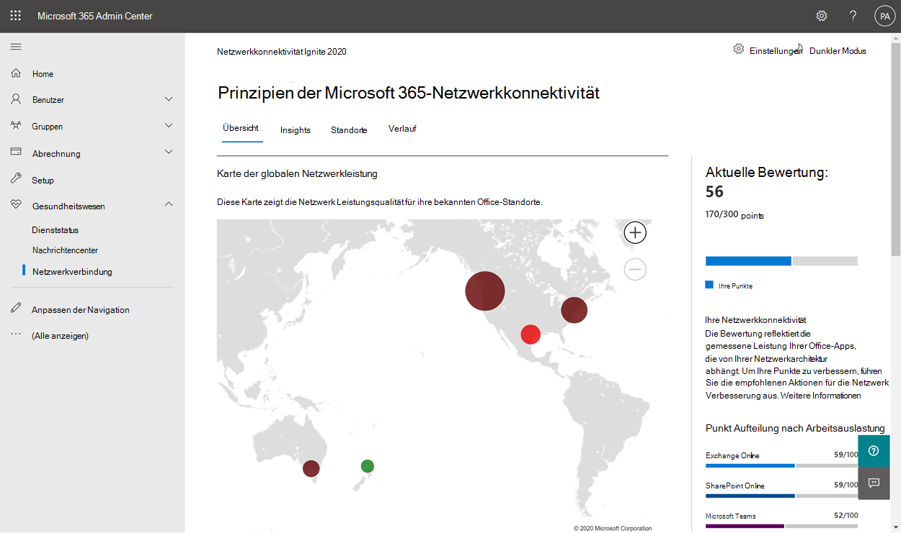
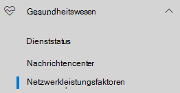
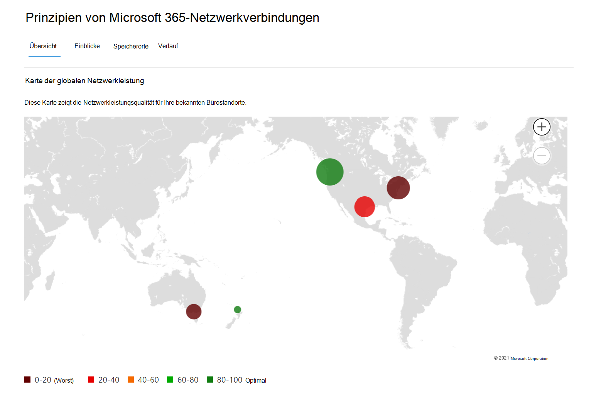
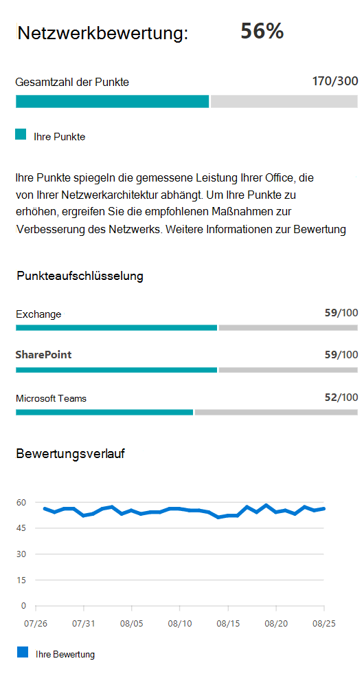
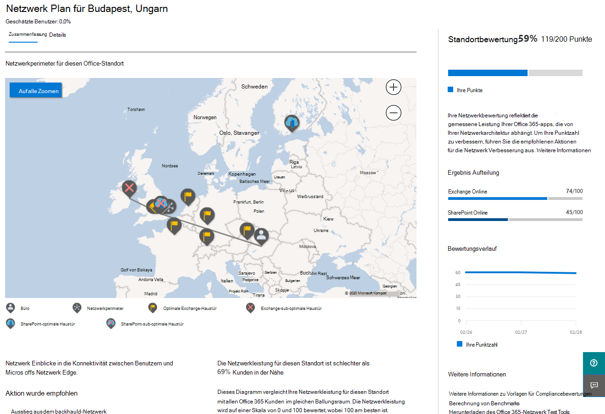
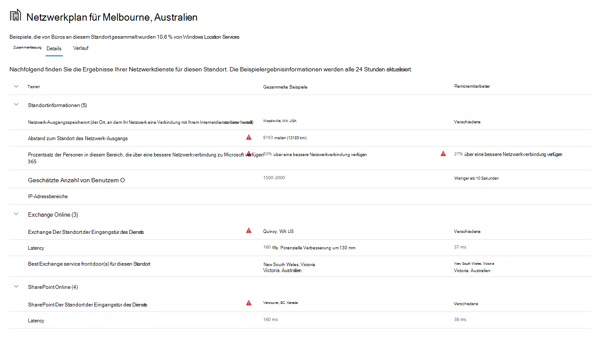
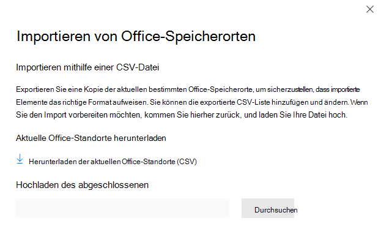

# Netzwerkkonnektivität im Microsoft 365 Admin Center (Vorschau)

Das Microsoft 365 Admin Center enthält jetzt aggregierte Metriken für die Netzwerkkonnektivität, die von Ihrem Microsoft 365-Mandanten gesammelt und nur für administrative Benutzer in Ihrem Mandanten verfügbar sind.

**Netzwerk Einschätzungen** und **Netzwerk Einblicke** werden im Microsoft 365 Admin Center unter "Integrität" angezeigt **| Konnektivität**.

>[!NOTE]
>Das Tool zum Testen von Netzwerkkonnektivität unterstützt Mandanten in WW Commercial und Deutschland, aber nicht gcc moderat, gcc High, DoD oder China.

Wenn Sie zum ersten Mal zur Seite Netzwerkleistung navigieren, sehen Sie einen Übersichtsbereich, der eine Übersicht über die globale Netzwerkleistung, eine Netzwerkbewertung für den gesamten Mandanten und eine Liste aktueller Probleme enthält. In der Übersicht können Sie einen Drilldown ausführen, um bestimmte Netzwerk Leistungs Metriken und-Probleme nach Standort anzuzeigen. Weitere Informationen finden Sie unter [Übersicht über die Netzwerkleistung im Microsoft 365 Admin Center](#network-connectivity-overview-in-the-microsoft-365-admin-center).

Sie werden möglicherweise aufgefordert, im Namen Ihrer Organisation an der öffentlichen Vorschau für diese Funktion teilzunehmen. Die Akzeptanz erfolgte in der Regel sofort, und dann wird die Seite Netzwerkkonnektivität angezeigt. 

Beim Navigieren zur Seite "Netzwerkkonnektivität" wird ein Übersichtsfenster mit einer Übersicht über die globale Netzwerkleistung, eine Netzwerkbewertung für den gesamten Mandanten und eine Liste aktueller Probleme angezeigt. Um auf diese Seite zugreifen zu können, müssen Sie ein Administrator für die Organisation in Microsoft 365 sein. Die Administratorrolle "berichtsleser" verfügt über Lesezugriff auf diese Informationen. Zum Konfigurieren von Speicherorten und anderen Elementen der Netzwerkkonnektivität muss ein Administrator Teil einer Serveradministratorrolle sein, beispielsweise die Administratorrolle "Dienst Unterstützung". In der Übersicht können Sie einen Drilldown ausführen, um bestimmte Netzwerk Leistungs Metriken und-Probleme nach Standort anzuzeigen. Weitere Informationen finden Sie unter [Übersicht über die Netzwerkkonnektivität im Microsoft 365 Admin Center](#network-connectivity-overview-in-the-microsoft-365-admin-center).

## Voraussetzungen für die Anzeige von Netzwerk Verbindungs Bewertungen

Während die Netzwerkkonnektivität in der gesamten Organisation ausgewertet werden kann, müssen alle Netzwerkentwurfs Verbesserungen für bestimmte Office-Standorte ausgeführt werden. Informationen zur Netzwerkkonnektivität werden für jeden Office-Standort bereitgestellt, sobald diese Standorte ermittelt werden können. Es gibt drei Optionen für das Einholen von Netzwerkbewertungen von Ihren Office-Standorten:

### 1. Aktivieren der Windows-Standortdienste

Für diese Option müssen mindestens zwei Computer an jedem Bürostandort mit Unterstützung für die Voraussetzungen vorhanden sein. OneDrive für Windows, Version **19,232** oder höher, müssen auf jedem Computer installiert sein. Weitere Informationen zu OneDrive-Versionen finden Sie in den [Anmerkungen zur OneDrive-Version](https://support.office.com/article/onedrive-release-notes-845dcf18-f921-435e-bf28-4e24b95e5fc0). Netzwerk Messungen sollten in naher Zukunft in anderen Office 365-Clientanwendungen hinzugefügt werden.

Windows-Standortdienst muss auf den Computern zugestimmt werden. Sie können dies testen, indem Sie die **Maps** -App durchführen und sich selbst Auffinden. Es kann auf einem einzelnen Computer mit Einstellungen aktiviert werden **| Datenschutz | Speicherort** , an dem die Einstellung _für Apps für den Zugriff auf Ihren Standort zulässt,_ muss aktiviert sein. Die Zustimmung zum Windows-Standortdienst kann auf PCs mit MDM oder Gruppenrichtlinien mit der Einstellung _LetAppsAccessLocation_bereitgestellt werden.

Sie müssen keine Speicherorte im Admin Center mit dieser Methode hinzufügen, da diese automatisch in der Stadt Lösung identifiziert werden. Es ist nicht möglich, mehrere Office-Standorte in einer Stadt mithilfe von Windows-Ortungsdiensten anzuzeigen. Die Standortinformationen werden auch auf die nächsten 300 Meter um 300 Meter abgerundet, bevor Sie hochgeladen werden, sodass keine präziseren Standortinformationen für den Zugriff möglich sind.

Die Computer sollten über Wi-Fi Netzwerk anstelle eines Ethernet-Kabels verfügen. Computer mit einem Ethernet-Kabel verfügen nicht über genaue Standortinformationen.

Mess Muster und Office-Standorte sollten 24 Stunden nach der Erfüllung dieser Voraussetzungen angezeigt werden.

### 2. Hinzufügen von Speicherorten und Bereitstellen von LAN-Subnetz-Informationen

Für diese Option sind weder Windows-Standortdienste noch Wi-Fi erforderlich. Sie müssen OneDrive für Windows, Version **20,161** oder höher, auf jedem Computer am Speicherort installiert haben.

Sie müssen auch Standorte auf der Seite Admin Center-Netzwerkkonnektivität hinzufügen oder diese aus einer CSV-Datei importieren. Die hinzugefügten Speicherorte müssen Ihre Office LAN-Subnetz-Informationen enthalten.

Da Sie die Speicherorte hinzufügen, können Sie mehrere Büros in einer Stadt definiert haben.

Mess Muster und Office-Standorte sollten 24 Stunden nach der Erfüllung dieser Voraussetzungen angezeigt werden.

### 3. Manuelles Sammeln von Testberichten mit dem Microsoft 365 Network Connectivity Test Tool

Für diese Option müssen Sie eine Person an jedem Standort identifizieren. Bitten Sie Sie, zu [Microsoft 365 Network Connectivity Test](https://connectivity.office.com) auf einem Windows-Computer zu wechseln, auf dem Sie über Administratorberechtigungen verfügen. Auf der Website müssen Sie sich bei Ihrem Office 365 Konto für dieselbe Organisation anmelden, für die Sie die Ergebnisse anzeigen möchten. Anschließend sollten Sie auf **Testlauf ausführen**klicken. Während des Tests gibt es eine heruntergeladene Verbindungstest-exe. Sie müssen diese ebenfalls öffnen und ausführen. Sobald die Tests abgeschlossen sind, wird das Testergebnis in Office 365 hochgeladen.

Test Berichte werden mit einem Speicherort verknüpft, wenn Sie mit LAN-Subnetz-Informationen hinzugefügt wurden, andernfalls werden Sie nur am Ort der Stadt angezeigt.

Mess Muster und Office-Standorte sollten beginnen, 2-3 Minuten nach Abschluss eines Testberichts angezeigt zu werden. Weitere Informationen finden Sie unter [Microsoft 365 Network Connectivity Test (Preview)](office-365-network-mac-perf-onboarding-tool.md).

## Wie verwende ich diese Informationen?

**Network Insights**, die dazugehörigen Leistungsempfehlungen und Netzwerkbewertungen sollen beim Entwerfen von Netzwerkperimetern für Ihre Office-Standorte helfen. Jede Insight enthält Details zu den Leistungsmerkmalen eines bestimmten allgemeinen Problems für jeden geografischen Standort, auf den Benutzer auf ihren Mandanten zugreifen. **Leistungsempfehlungen** für die einzelnen Netzwerk Einblicke bieten spezifische Änderungen an der Netzwerkarchitektur, die Sie zur Verbesserung der Benutzerfreundlichkeit im Zusammenhang mit der Microsoft 365-Netzwerkkonnektivität vornehmen können. Die Netzwerkbewertung zeigt, wie sich die Netzwerkkonnektivität auf die Benutzerfreundlichkeit auswirkt und einen Vergleich verschiedener Netzwerkverbindungen für Benutzer Standorte ermöglicht.

Mithilfe von **Netzwerkbewertungen** wird ein Aggregat zahlreicher Netzwerk Leistungs Metriken in eine Momentaufnahme ihrer Unternehmensnetzwerk Integrität unterrepräsentiert durch einen Points-Wert von 0-100. Netzwerkbewertungen sind sowohl für den gesamten Mandanten als auch für jeden geografischen Standort ausgelegt, von dem aus Benutzer eine Verbindung mit Ihrem Mandanten herstellen, sodass Microsoft 365-Administratoren eine einfache Möglichkeit haben, eine Gestalt der Netzwerkintegrität des Unternehmens sofort zu erfassen und schnell einen detaillierten Bericht für einen beliebigen globalen Office-Standort aufzurufen.

Komplexe Unternehmen mit mehreren Office-Standorten und nicht-trivialen Netzwerkperimeter-Architekturen können von diesen Informationen profitieren, entweder während des ersten onboardings zu Microsoft 365 oder um Probleme bei der Netzwerkleistung zu beheben, die mit dem Nutzungs Wachstum ermittelt wurden. Dies ist in der Regel für kleine Unternehmen mit Microsoft 365 oder für Unternehmen, die bereits über eine einfache und direkte Netzwerkverbindung verfügen, nicht erforderlich. Unternehmen mit mehr als 500 Benutzern und mehreren Office-Standorten werden davon ausgehen.

>[!IMPORTANT]
>Netzwerk Einblicke, Leistungsempfehlungen und Bewertungen im Microsoft 365 Admin Center befinden sich derzeit im Vorschaustatus und stehen nur für Microsoft 365-Mandanten zur Verfügung, die im Feature Preview-Programm registriert wurden.

## Herausforderungen bei der Unternehmensnetzwerk Konnektivität

Viele Unternehmen verfügen über Netzwerkumkreis Konfigurationen, die im Laufe der Zeit gewachsen sind und in erster Linie für den Zugriff von Internetwebsites für Mitarbeiter vorgesehen sind, bei denen die meisten Websites nicht vorab bekannt sind und nicht vertrauenswürdig sind. Der vorherrschende und notwendige Fokus besteht darin, Schadsoftware und Angel Angriffe aus diesen unbekannten Websites zu vermeiden. Diese Netzwerk Konfigurationsstrategie, die aus Sicherheitsgründen hilfreich ist, kann zu Beeinträchtigungen der Leistung von Microsoft 365 und der Benutzerfreundlichkeit führen.

## Wie können wir diese Herausforderungen lösen?

Unternehmen können die allgemeine Benutzerfreundlichkeit verbessern und Ihre Umgebung schützen, indem Sie die [Prinzipien von Office 365 Konnektivität](https://aka.ms/pnc) und das Microsoft 365 Admin Center-Netzwerk Verbindungs Feature verwenden. In den meisten Fällen hat die Einhaltung dieser allgemeinen Grundsätze erhebliche positive Auswirkungen auf die Wartezeit von Endbenutzern, die Zuverlässigkeit der Dienste und die Gesamtleistung von Microsoft 365.

Microsoft wird manchmal aufgefordert, Netzwerkleistungsprobleme mit Microsoft 365 für große Unternehmenskunden zu untersuchen, und diese weisen häufig eine Hauptursache im Zusammenhang mit der Netzwerkumkreis Infrastruktur des Kunden auf. Wenn eine allgemeine Ursache für ein Problem mit dem Umkreis eines Kunden Netzwerks gefunden wird, versuchen wir, einfache Testmessungen zu identifizieren, die diese identifizieren. Ein Test mit einem Schwellenwert für die Messung, mit dem ein bestimmtes Problem identifiziert wird, ist wertvoll, da wir dieselbe Messung an einem beliebigen Ort testen können, um zu ermitteln, ob diese Ursache dort vorhanden ist, und Sie als Netzwerk Einblicke mit dem Administrator freigeben.

Einige Netzwerk Einblicke deuten lediglich auf ein Problem hin, das weiter untersucht werden muss. Ein Netzwerk Einblicke, in dem genügend Tests vorhanden sind, um eine bestimmte Korrekturaktion zur Behebung der Stamm Ursache anzuzeigen, wird als **Empfohlene Aktion**aufgeführt. Diese Empfehlungen, basierend auf Live Metriken, die Werte offen legen, die außerhalb eines vordefinierten Schwellenwerts liegen, sind viel wertvoller als allgemeine Ratschläge zur bewährten Vorgehensweise, da Sie für Ihre Umgebung spezifisch sind und die tatsächliche Verbesserung zeigen, nachdem die empfohlenen Änderungen vorgenommen wurden.

## Übersicht über die Netzwerkkonnektivität im Microsoft 365 Admin Center

Microsoft hat vorhandene Netzwerk Messungen von mehreren Office-Desktop-und Webclients, die den Betrieb von Microsoft 365 unterstützen. Diese Messungen werden nun verwendet, um Einblicke in die Netzwerkarchitektur und eine Netzwerkbewertung bereitzustellen, die auf der Seite " **Netzwerkkonnektivität** " im Microsoft 365 Admin Center angezeigt werden.

Standardmäßig wird der Ort, an dem sich die Clientgeräte befinden, in annähernden Standortinformationen, die den Netzwerk Messungen zugeordnet sind, feststehen. Die Netzwerkbewertung an jedem Standort wird mit Farbe angezeigt, und die relative Anzahl der Benutzer an jedem Standort wird durch die Größe des Kreises dargestellt.

Auf der Übersichtsseite wird auch die Netzwerkbewertung für den Kunden als gewichteter Durchschnitt für alle Office-Standorte dargestellt.

Sie können eine Tabellenansicht der Orte anzeigen, an denen Sie auf der Registerkarte Speicherorte gefiltert, sortiert und bearbeitet werden können. Standorte mit spezifischen Empfehlungen können auch eine geschätzte potenzielle Verbesserung der Wartezeit umfassen. Dies wird berechnet, indem die durchschnittliche Latenz ihrer Organisationsbenutzer am Standort berücksichtigt wird und die durchschnittliche Latenzzeit für alle Organisationen in derselben Stadt subtrahiert wird.

## Übersicht über die spezifische Netzwerkleistung für Office-Standorte und Einblicke

Durch die Auswahl eines Office-Standorts wird eine standortspezifische Zusammenfassungsseite geöffnet, in der Details zum Netzwerk Ausstieg angezeigt werden, die von den Messungen an diesem Standort ermittelt wurden.

Eine Zuordnung des Umkreisnetzwerks für die Benutzer in Ihrer Organisation am Speicherort wird mit einigen oder allen dieser Elemente angezeigt:

- **Office-Standort** : der Office-Standort für die Seite, die Sie suchen
- **Umkreisnetzwerk** : der Speicherort der Quell-IP-Adresse für Verbindungen vom Bürostandort. Dies hängt von der Genauigkeit von Geo-IP-Standortdatenbanken ab.
- **Exchange optimal Service Haustür** – einer der empfohlenen Exchange-Dienst-Fronttüren, mit denen Benutzer in diesem Office-Standort eine Verbindung herstellen sollten
- **Exchange sub-optimale Haustür** -eine Exchange-Dienst-Haustür, mit der Benutzer verbunden sind, jedoch nicht empfohlen wird
- **Optimaler SharePoint-Dienst Haustür** – einer der empfohlenen SharePoint-Dienst-Fronttüren, mit denen Benutzer in diesem Office-Standort eine Verbindung herstellen sollten
- **SharePoint Sub-optimaler Dienst Haustür** -eine SharePoint-Dienst-Haustür, mit der Benutzer verbunden sind, jedoch nicht empfohlen wird
- **DNS-rekursive Auflösungs Server** -der Speicherort aus einer Geo-IP-Datenbank des erkannten DNS-rekursive Resolvers, der für Exchange Online verwendet wird (sofern verfügbar)
- **Ihr Proxy Server** -der Speicherort aus einer Geo-IP-Datenbank des erkannten Proxyservers (sofern verfügbar) 

Auf der Seite Zusammenfassung der Office-standortzusammenfassung werden außerdem die Netzwerkbewertung des Standorts, der Netzwerk Bewertungsverlauf, ein Vergleich der Bewertung dieses Standorts mit anderen Kunden in derselben Stadt sowie eine Liste mit spezifischen Einblicken und Empfehlungen aufgeführt, die Sie zur Verbesserung der Netzwerkleistung und Zuverlässigkeit Unternehmen können.

Vergleiche zwischen Kunden in der gleichen Stadt basieren auf der Erwartung, dass alle Kunden gleichberechtigten Zugriff auf Netzwerkdienstanbieter, Telekommunikationsinfrastruktur und in der Nähe befindliche Microsoft-Netzwerk Points of Presence haben.

Auf der Registerkarte Details auf der Seite Office-Standort werden die spezifischen Messergebnisse angezeigt, die verwendet wurden, um Einblicke, Empfehlungen und die Netzwerkbewertung zu erzielen. Dies wird bereitgestellt, damit Netzwerkingenieure die Empfehlungen und den Faktor für Einschränkungen oder Besonderheiten in Ihrer Umgebung überprüfen können.

## CSV-Import für LAN-Subnetze-Office-Standorte

Für das LAN-Subnetz-Identifikations Büro müssen Sie jeden Standort im Voraus hinzufügen. Anstatt einzelne Office-Standorte auf der Registerkarte **Standorte** hinzuzufügen, können Sie Sie aus einer CSV-Datei importieren. Sie können diese Daten möglicherweise von anderen Orten abrufen, die Sie gespeichert haben, wie etwa das Dashboard für Anrufqualität oder Active Directory Websites und Dienste

In der CSV-Datei wird eine erkannte Stadt Position in der userEntered-Spalte als leer angezeigt, und eine manuell hinzugefügte Office-Position wird als 1 angezeigt.

1. Klicken Sie im Fenster Haupt _Konnektivität mit Microsoft 365_ auf die Registerkarte **Speicherorte** .
1. Klicken Sie auf die Schaltfläche **importieren** direkt oberhalb der Liste Orte. Das Flyout **Office-Speicherorte importieren** wird angezeigt.

   

1. Klicken Sie auf den Link **aktuelle Office-Standorte herunterladen (CSV)** , um die Liste der aktuellen Speicherorte in eine CSV-Datei zu exportieren, und speichern Sie Sie auf Ihrer lokalen Festplatte. Auf diese Weise erhalten Sie eine ordnungsgemäß formatierte CSV-Datei mit Spaltenüberschriften, an die Sie Orte hinzufügen können. Sie können die vorhandenen exportierten Speicherorte unverändert lassen. Sie werden nicht dupliziert, wenn Sie die aktualisierte CSV importieren. Wenn Sie die Adresse eines vorhandenen Speicherorts ändern möchten, wird diese beim Importieren der CSV-Datei aktualisiert. Sie können die Adresse eines entdeckten Orts nicht ändern.
1. Öffnen Sie die CSV-Datei, und fügen Sie Ihre Standorte hinzu, indem Sie die folgenden Felder in einer neuen Position für jeden Ort ausfüllen, den Sie hinzufügen möchten. Lassen Sie alle anderen Felder leer; Werte, die Sie in andere Felder eingeben, werden ignoriert.
   1. **userEntered** (erforderlich): muss für einen neuen LAN-Subnetz-Standort 1 sein
   1. **Adresse** (erforderlich): die physische Adresse des Büros
   1. **Latitude** (optional): aufgefüllt von Bing Maps Lookup der Adresse, wenn leer
   1. **Längengrad** (optional): aufgefüllt von Bing Maps Lookup der Adresse, wenn leer
   1. Ausgehende **IP-Adressbereiche 1-5** (optional): Geben Sie für jeden Bereich den Leitungsnamen gefolgt von einer durch Leerzeichen getrennten Liste gültiger IPv4-oder IPv6-CIDR-Adressen ein. Diese Werte werden verwendet, um mehrere Office-Standorte zu unterscheiden, bei denen dieselben IP-Adressen für LAN-Subnetze verwendet werden. Ausgehende IP-Adressbereiche alle müssen Netzwerkgröße/24 sein, und die/24 ist nicht in der Eingabe enthalten.
   1. **LanIps** (erforderlich): Listet die LAN-Subnetz-Bereiche auf, die an diesem Standort verwendet werden. Für LAN-Subnetz-IDs muss eine CIDR-Netzwerkgröße angegeben werden, in der sich die Netzwerkgröße zwischen/8 und/29 befinden kann. Mehrere LAN-Subnetze können durch ein Komma oder ein Semikolon voneinander getrennt werden.
1. Wenn Sie Ihre Office-Standorte hinzugefügt und die Datei gespeichert haben, klicken Sie neben dem Feld **abgeschlossen hochladen** auf die Schaltfläche **Durchsuchen** , und wählen Sie die gespeicherte CSV-Datei aus.
1. Die Datei wird automatisch überprüft. Wenn Validierungsfehler vorliegen, wird die Fehlermeldung angezeigt, _dass in der Importdatei einige Fehler aufgetreten sind. Überprüfen Sie die Fehler, korrigieren Sie die Importdatei, und versuchen Sie es dann erneut._ Klicken Sie auf den Link **Fehlerdetails öffnen** , um eine Liste der spezifischen Feld Überprüfungsfehler anzuzeigen.

   

1. Wenn die Datei keine Fehler enthält, wird die Meldung angezeigt, dass _der Bericht verfügbar ist. Es wurden x-Speicherorte hinzugefügt und x-Standorte aktualisiert._ Klicken Sie auf die Schaltfläche **importieren** , um die CSV hochzuladen.

   

## Häufig gestellte Fragen

### Was ist ein Microsoft 365-Dienst-Haustür?

Die Microsoft 365-Dienst-Haustür ist ein Einstiegspunkt im globalen Microsoft-Netzwerk, in dem Office-Clients und-Dienste Ihre Netzwerkverbindung beenden. Für eine optimale Netzwerkverbindung mit Microsoft 365 wird empfohlen, dass Ihre Netzwerkverbindung mit der nächstgelegenen Microsoft 365-Haustür beendet wird.

>[!NOTE]
>Microsoft 365 Service Haustür hat keine direkte Beziehung zum Azure-Front-Door-Dienst Produkt, das im Azure Marketplace verfügbar ist.

### Was ist eine optimale Haustür für den Microsoft 365-Dienst?

Eine optimale Microsoft 365-Dienst-Haustür ist eine, die Ihrem Netzwerk Ausgang am nächsten ist, in der Regel in ihrer Stadt oder in ihrer Metro-Region. Verwenden Sie das [Microsoft 365 Connectivity Test Tool (Preview)](office-365-network-mac-perf-onboarding-tool.md) , um den Standort Ihres Microsoft 365-Dienst-Front-Door und der optimalen Service-Haustür zu ermitteln. Wenn das Tool feststellt, dass Ihre in-use-Haustür optimal ist, verbinden Sie sich optimal mit dem globalen Netzwerk von Microsoft.

### Was ist ein Internet Ausstieg-Standort?

Der Internet Ausgangsstandort ist der Ort, an dem Ihr Netzwerkdatenverkehr Ihr Unternehmensnetzwerk verlässt und eine Verbindung mit dem Internet herstellt. Dies wird auch als Standort bezeichnet, an dem Sie ein NAT-Gerät (Network Address Translation, Netzwerkadressübersetzung) haben und in der Regel eine Verbindung mit einem Internetdienstanbieter (Internet Service Provider, ISP) herstellen. Wenn Sie einen langen Abstand zwischen Ihrem Standort und Ihrem Internet Ausgangsstandort sehen, kann dies auf eine erhebliche WAN-Backhaul hindeuten.

## Verwandte Themen

[Microsoft 365 Network Insights (Vorschau)](office-365-network-mac-perf-insights.md)

[Microsoft 365 Netzwerkbewertung (Vorschau)](office-365-network-mac-perf-score.md)

[Microsoft 365 Connectivity Test Tool (Vorschau)](office-365-network-mac-perf-onboarding-tool.md)

[Microsoft 365 Network Connectivity Location Services (Vorschau)](office-365-network-mac-location-services.md)
