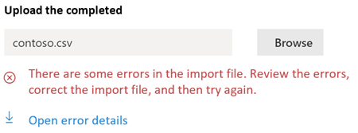

# Netzwerkkonnektivität im Microsoft 365 Admin Center (Vorschau)Network connectivity in the Microsoft 365 Admin Center (preview)

Das Microsoft 365 Admin Center enthält nun aggregierte Metriken für die Netzwerkkonnektivität, die von Ihrem Microsoft 365-Mandanten erfasst wurden und nur von administrativen Benutzern in Ihrem Mandanten angezeigt werden können.The Microsoft 365 Admin Center now includes aggregated network connectivity metrics collected from your Microsoft 365 tenant and available to view only by administrative users in your tenant.

> [!div class="mx-imgBorder"]
> 

**Netzwerkbewertungen** und **Netzwerkeinblicke** werden im Microsoft 365 Admin Center unter **Integritätsbewertung | Konnektivität**.**Network assessments** and **network insights** are displayed in the Microsoft 365 Admin Center under **Health | Connectivity**.

> [!div class="mx-imgBorder"]
> 

>[!NOTE]
>Das Testtool für netzwerkkonnektivität unterstützt Mandanten in WW Commercial und Deutschland, aber nicht GCC Moderate, GCC High, DoD oder China.The network connectivity test tool supports tenants in WW Commercial and Germany but not GCC Moderate, GCC High, DoD or China.

Wenn Sie zum ersten Mal zur Seite "Netzwerkleistung" navigieren, wird ein Übersichtsbereich mit einer Karte der globalen Netzwerkleistung, einer Netzwerkbewertung auf den gesamten Mandanten und einer Liste der aktuellen Probleme angezeigt.When you first navigate to the network performance page, you will see an overview pane containing a map of global network performance, a network assessment scoped to the entire tenant, and a list of current issues. In der Übersicht können Sie einen Drilldown erstellen, um bestimmte Metriken und Probleme der Netzwerkleistung nach Standort anzuzeigen.From the overview, you can drill down to view specific network performance metrics and issues by location. Weitere Informationen finden Sie unter [Übersicht über die Netzwerkleistung im Microsoft 365 Admin Center](#network-connectivity-overview-in-the-microsoft-365-admin-center).For more information, see [Network performance overview in the Microsoft 365 Admin Center](#network-connectivity-overview-in-the-microsoft-365-admin-center).

Möglicherweise werden Sie aufgefordert, im Namen Ihrer Organisation an der öffentlichen Vorschau für dieses Feature teil zu nehmen.You may be asked to join the public preview for this feature on behalf of your organization. Die Annahme erfolgt in der Regel sofort, danach wird die Seite "Netzwerkkonnektivität" angezeigt.Acceptance usually happens immediately, after which you would see the network connectivity page. 

Bei der Navigation zur Seite "Netzwerkkonnektivität" sehen Sie einen Übersichtsbereich mit einer Karte der globalen Netzwerkleistung, einer Netzwerkbewertung, die auf den gesamten Mandanten begrenzt ist, den Prozentsatz Ihrer Benutzer, die remote und vor Ort arbeiten, sowie eine Liste der aktuellen Probleme, mit denen Sie Maßnahmen ergreifen oder weitere Untersuchungen ausführen können.On navigating to the network connectivity page, you will see an overview pane containing a map of global network performance, a network assessment scoped to the entire tenant, percentage of your users working remotely vs onsite, and a list of current issues to take action on or to research further. Um auf diese Seite zugreifen zu können, müssen Sie ein Administrator für die Organisation in Microsoft 365 sein.To access this page, you must be an administrator for the organization within Microsoft 365. Die Administratorrolle "Berichtsleser" hat Lesezugriff auf diese Informationen.The Report Reader administrative role will have read access to this information. Zum Konfigurieren von Speicherorten und anderen Elementen der Netzwerkkonnektivität muss ein Administrator Teil einer Serveradministratorrolle sein, z. B. der Administratorrolle Dienstunterstützung.To configure locations and other elements of network connectivity an administrator must be part of a server administrator role such as the Service support admin role. In der Übersicht können Sie einen Drilldown erstellen, um bestimmte Metriken und Probleme der Netzwerkleistung nach Standort anzuzeigen.From the overview, you can drill down to view specific network performance metrics and issues by location. 

## Voraussetzungen für die Schätzung der NetzwerkkonnektivitätPre-requisites for network connectivity assessments to appear

Aktivieren Sie die Einstellung standortanmelden, um automatisch Daten von Geräten mithilfe von Windows Location Services zu sammeln, zur Liste Standorte zu wechseln, um Standortdaten hinzuzufügen oder hochzuladen, oder führen Sie den Microsoft 365-Netzwerkkonnektivitätstest an Ihren Bürostandorten aus.To get started, turn on your location opt-in setting to automatically collect data from devices using Windows Location Services, go to your Locations list to add or upload location data, or run the Microsoft 365 network connectivity test from your office locations. Während die Netzwerkkonnektivität in der gesamten Organisation ausgewertet werden kann, müssen für bestimmte Bürostandorte Verbesserungen des Netzwerkentwurfs vorgenommen werden.Whilst network connectivity can be evaluated across the organization, any network design improvements will need to be done for specific office locations. Netzwerkverbindungsinformationen werden für jeden Bürostandort bereitgestellt, sobald diese Standorte bestimmt werden können.Network connectivity information is provided for each office location once those locations can be determined. Es gibt drei Optionen zum Abrufen von Netzwerkbewertungen von Ihren Bürostandorten:There are three options for getting network assessments from your office locations:

### 1. Aktivieren von Windows Location Services1. Enable Windows Location Services

Für diese Option müssen an jedem Bürostandort mindestens zwei Computer ausgeführt werden, die die Voraussetzungen unterstützen.For this option, you must have at least two computers running at each office location that support the pre-requisites. OneDrive für #A0 muss auf jedem Computer auf dem neuesten Stand sein und installiert sein.OneDrive for Windows version must be up-to-date and installed on each computer. Weitere Informationen zu #A0 finden Sie in den [OneDrive-Versionshinweisen](https://support.office.com/article/onedrive-release-notes-845dcf18-f921-435e-bf28-4e24b95e5fc0).For more information on OneDrive versions, see the [OneDrive release notes](https://support.office.com/article/onedrive-release-notes-845dcf18-f921-435e-bf28-4e24b95e5fc0). Netzwerkmessungen sollen in naher Zukunft anderen Office 365-Clientanwendungen hinzugefügt werden.Network measurements are planned to be added to other Office 365 client applications in the near future.

Windows Location Service muss auf den Computern zugestimmt werden.Windows Location Service must be consented on the machines. Sie können dies testen, indem Sie die **Karten-App** ausführen und sich selbst suchen.You can test this by running the **Maps** app and locating yourself. Sie kann auf einem einzelnen Computer mit Einstellungen aktiviert **| Datenschutz | Speicherort,** an dem die Einstellung _Apps den Zugriff auf Ihren_ Standort erlauben aktiviert sein muss.It can be enabled on a single machine with **Settings | Privacy | Location** where the setting _Allow apps to access your location_ must be enabled. Die Zustimmung von Windows Location Services kann auf PCs mithilfe von MDM oder Gruppenrichtlinien mit der Einstellung _LetAppsAccessLocation bereitgestellt werden._Windows Location Services consent can be deployed to PCs using MDM or Group Policy with the setting _LetAppsAccessLocation_.

Sie müssen mit dieser Methode keine Standorte im Admin Center hinzufügen, da diese automatisch bei der Stadtauflösung identifiziert werden.You do not need to add locations in the Admin Center with this method as they are automatically identified at the city resolution. Sie können nicht mehrere Bürostandorte in einer Stadt mithilfe von Windows Location Services anzeigen.You cannot show multiple office locations within a city using Windows Location Services. Standortinformationen werden auch auf die nächsten 300 Meter um 300 Meter gerundet, bevor sie hochgeladen werden, damit auf genauere Standortinformationen nicht zugegriffen werden kann.Location information is also rounded to the nearest 300 meters by 300 meters before being uploaded so that more precise location information is not possible to access.

Die Computer sollten über Wi-Fi netzwerk statt über ein Ethernetkabel verfügen.The machines should have Wi-Fi networking rather than an ethernet cable. Computer mit einem Ethernetkabel verfügen nicht über genaue Standortinformationen.Machines with an ethernet cable do not have accurate location information.

Messbeispiele und Bürostandorte sollten 24 Stunden nach Erfüllen dieser Voraussetzungen angezeigt werden.Measurement samples and office locations should start to appear 24 hours after these pre-requisites have been met.

### 2. Hinzufügen von Speicherorten und Bereitstellen von LAN-Subnetzinformationen2. Add locations and provide LAN subnet information

Für diese Option sind weder Windows Location Services noch Wi-Fi erforderlich.For this option, neither Windows Location Services nor Wi-Fi are required. Ihre OneDrive für #A0 muss auf dem neuesten Stand sein und auf mindestens einem Computer am Standort installiert sein.Your OneDrive for Windows version must be up-to-date and installed on at least one computer at the location.

Sie müssen auch Speicherorte auf  der Seite Speicherorte hinzufügen oder aus einer CSV-Datei importieren.You also need to add locations in the in the **Locations page** or to import them from a CSV file. Die hinzugefügten Speicherorte müssen Ihre Office -LAN-Subnetzinformationen enthalten.The locations added must include your office LAN subnet information.

Mit dieser Option können Sie mehrere Büros innerhalb einer Stadt definieren.This option allows you to have multiple offices defined within a city.

Alle Testmessungen von Clientcomputern umfassen die LAN-Subnetzinformationen, die mit den eingegebenen Details zum Bürostandort korreliert sind.All test measurements from client machines include the LAN subnet information, which is correlated with the office location details that you have entered. Messbeispiele und Bürostandorte sollten 24 Stunden nach Erfüllen dieser Voraussetzungen angezeigt werden.Measurement samples and office locations should start to appear 24 hours after these pre-requisites have been met.

### 3. Manuelles Sammeln von Testberichten mit dem Microsoft 365-Netzwerkverbindungstesttool3. Manually gather test reports with the Microsoft 365 network connectivity test tool

Für diese Option müssen Sie eine Person an jedem Standort identifizieren.For this option, you need to identify a person at each location. Bitten Sie sie, zum [Microsoft 365-Netzwerkverbindungstest](https://connectivity.office.com) auf einem Windows-Computer zu navigieren, auf dem sie über Administratorberechtigungen verfügen.Ask them to browse to [Microsoft 365 network connectivity test](https://connectivity.office.com) on a Windows machine on which they have administrative permissions. Auf der Website müssen sie sich bei ihrem Office 365-Konto für dieselbe Organisation anmelden, für die Sie die Ergebnisse sehen möchten.On the web site, they need to sign-in to their Office 365 account for the same organization that you want to see the results. Anschließend sollten sie auf **Test ausführen klicken.**Then they should click **Run test**. Während des Tests gibt es eine heruntergeladene Konnektivitätstest-EXE.During the test there is a downloaded Connectivity test EXE. Sie müssen dies öffnen und ausführen.They need to open and execute that. Sobald die Tests abgeschlossen sind, wird das Testergebnis in das Admin Center hochgeladen.Once the tests are completed, the test result is uploaded to the Admin Center.

Testberichte sind mit einem Speicherort verknüpft, wenn sie mit LAN-Subnetzinformationen hinzugefügt wurden, andernfalls werden sie nur am Ortsstandort angezeigt.Test reports are linked to a location if it was added with LAN subnet information, otherwise they are shown at the city location only.

Messbeispiele und Bürostandorte sollten 2 bis 3 Minuten nach Abschluss eines Testberichts angezeigt werden.Measurement samples and office locations should start to appear 2-3 minutes after a test report is completed. Weitere Informationen finden Sie unter [Microsoft 365 Network Connectivity Test (Preview)](office-365-network-mac-perf-onboarding-tool.md).For more information, see [Microsoft 365 network connectivity test (preview)](office-365-network-mac-perf-onboarding-tool.md).

## Wie verwende ich diese Informationen?How do I use this information?

**Netzwerkeinblicke,** deren zugehörige Leistungsempfehlungen und Netzwerkbewertungen sollen beim Entwerfen von Netzwerkperimetern für Ihre Bürostandorte helfen.**Network insights**, their related performance recommendations and network assessments are intended to help in designing network perimeters for your office locations. Jeder Einblick enthält Details zu den Leistungsmerkmalen für ein bestimmtes häufiges Netzwerkproblem für jeden geografischen Standort, an dem Benutzer auf Ihren Mandanten zugreifen.Each insight provides details about the performance characteristics for a specific common networking issue for each geographic location where users are accessing your tenant. **Leistungsempfehlungen** für jede Netzwerkeinblick bieten spezifische Änderungen an der Netzwerkarchitektur, die Sie vornehmen können, um die Benutzerfreundlichkeit im Zusammenhang mit der Microsoft 365-Netzwerkkonnektivität zu verbessern.**Performance recommendations** for each network insight offer specific network architecture design changes you can make to improve user experience related to Microsoft 365 network connectivity. Die Netzwerkbewertung zeigt, wie sich die Netzwerkkonnektivität auf die Benutzerfreundlichkeit aus wirkt und ermöglicht einen Vergleich verschiedener Netzwerkverbindungen mit Benutzerstandorten.The network assessment shows how network connectivity impacts user experience, allowing for comparison of different user location network connections.

**Netzwerkbewertungen** verwerten ein Aggregat aus vielen Netzwerkleistungsmetriken in einer Momentaufnahme der Integrität Ihres Unternehmensnetzwerks, dargestellt durch einen Punktwert zwischen 0 und 100.**Network assessments** distill an aggregate of many network performance metrics into a snapshot of your enterprise network health, represented by a points value from 0 - 100. Netzwerkbewertungen sind sowohl auf den gesamten Mandanten als auch auf jeden geografischen Standort begrenzt, von dem aus Benutzer eine Verbindung mit Ihrem Mandanten herstellen, und bieten Microsoft 365-Administratoren eine einfache Möglichkeit, sofort eine Gestalt des Netzwerkzustands des Unternehmens zu erfassen und schnell einen detaillierten Bericht für jeden globalen Bürostandort zu erstellen.Network assessments are scoped to both the entire tenant and for each geographic location from which users connect to your tenant, providing Microsoft 365 administrators with an easy way to instantly grasp a gestalt of the enterprise's network health and quickly drill down into a detailed report for any global office location.

Komplexe Unternehmen mit mehreren Bürostandorten und nicht trivialen Netzwerkperimeterarchitekturen können von diesen Informationen profitieren, entweder während des anfänglichen Onboardings bei Microsoft 365 oder um probleme mit der Netzwerkleistung zu beheben, die bei der Nutzungssteigerung festgestellt wurden.Complex enterprises with multiple office locations and non-trivial network perimeter architectures can benefit from this information either during their initial onboarding to Microsoft 365 or to remediate network performance issues discovered with usage growth. Dies ist in der Regel nicht erforderlich für kleine Unternehmen, die Microsoft 365 verwenden, oder für Unternehmen, die bereits über einfache und direkte Netzwerkkonnektivität verfügen.This is usually not necessary for small businesses using Microsoft 365, or any enterprises who already have simple and direct network connectivity. Unternehmen mit mehr als 500 Benutzern und mehreren Bürostandorten werden voraussichtlich am meisten davon profitieren.Enterprises with over 500 users and multiple office locations are expected to benefit the most.

>[!IMPORTANT]
>Netzwerkeinblicke, Leistungsempfehlungen und Bewertungen im Microsoft 365 Admin Center befinden sich derzeit im Vorschaustatus und sind nur für Microsoft 365-Mandanten verfügbar, die im Featurevorschauprogramm registriert wurden.Network insights, performance recommendations and assessments in the Microsoft 365 Admin Center is currently in preview status, and is only available for Microsoft 365 tenants that have been enrolled in the feature preview program.

## Herausforderungen bei der Netzwerkkonnektivität in UnternehmenEnterprise network connectivity challenges

> [!div class="mx-imgBorder"]
> 

Viele Unternehmen verfügen über Netzwerkperimeterkonfigurationen, die im Laufe der Zeit gewachsen sind und in erster Linie für den Zugriff auf die Internetwebsite von Mitarbeitern ausgelegt sind, bei denen die meisten Websites im Voraus nicht bekannt sind und nicht vertrauenswürdig sind.Many enterprises have network perimeter configurations which have grown over time and are primarily designed to accommodate employee Internet web site access where most web sites are not known in advance and are untrusted. Der vorherrschende und notwendige Fokus liegt auf der Vermeidung von Schadsoftware und Phishingangriffen von diesen unbekannten Websites.The prevailing and necessary focus is avoiding malware and phishing attacks from these unknown web sites. Diese Netzwerkkonfigurationsstrategie kann zwar aus Sicherheitsgründen hilfreich sein, aber zu einer Beeinträchtigung der Leistung und Benutzerfreundlichkeit von Microsoft 365 führen.This network configuration strategy, while helpful for security purposes, can lead to degradation of Microsoft 365 user performance and user experience.

## Wie wir diese Herausforderungen lösen könnenHow we can solve these challenges

Unternehmen können die allgemeine Benutzerfreundlichkeit verbessern und ihre Umgebung schützen, indem sie [die Office 365-Konnektivitätsprinzipien](./microsoft-365-network-connectivity-principles.md) und das Netzwerkkonnektivitätsfeature für Microsoft 365 Admin Center verwenden.Enterprises can improve general user experience and secure their environment by following [Office 365 connectivity principles](./microsoft-365-network-connectivity-principles.md) and by using the Microsoft 365 Admin Center network connectivity feature. In den meisten Fällen hat das Folgen dieser allgemeinen Prinzipien erhebliche positive Auswirkungen auf die Wartezeit der Endbenutzer, die Dienstzuverlässigkeit und die Gesamtleistung von Microsoft 365.In most cases, following these general principles will have a significant positive impact on end user latency, service reliability and overall performance of Microsoft 365.

Microsoft wird manchmal aufgefordert, Probleme mit der Netzwerkleistung mit Microsoft 365 für große Unternehmenskunden zu untersuchen, und diese haben häufig eine Ursache im Zusammenhang mit der Netzwerkperimeterinfrastruktur des Kunden.Microsoft is sometimes asked to investigate network performance issues with Microsoft 365 for large enterprise customers, and these frequently have a root cause related to the customer's network perimeter infrastructure. Wenn eine häufige Ursache eines Kundennetzwerkperimeterproblems gefunden wird, versuchen wir, einfache Testmessungen zu identifizieren, die es identifizieren.When a common root cause of a customer network perimeter issue is found we seek to identify simple test measurements that identifies it. Ein Test mit einem Messschwellenwert, der ein bestimmtes Problem identifiziert, ist wertvoll, da wir dieselbe Messung an jedem Beliebigen Ort testen, bestimmen können, ob diese Hauptursache vorhanden ist, und sie als Netzwerkinblick mit dem Administrator teilen können.A test with a measurement threshold that identifies a specific problem is valuable because we can test the same measurement at any location, tell whether this root cause is present there and share it as a network insight with the administrator.

Einige Netzwerkeinblicke deuten lediglich auf ein Problem hin, das weiter untersucht werden muss.Some network insights will merely indicate a problem that needs further investigation. Eine Netzwerkuntersuchung, bei der wir über genügend Tests verfügen, um eine bestimmte Korrekturaktion zur Behebung der Hauptursache zu zeigen, wird als empfohlene Aktion **aufgeführt.**A network insight where we have enough tests to show a specific remediation action to correct the root cause is listed as a **recommended action**. Diese Empfehlungen, die auf Livemetriken basieren, die Werte anzeigen, die außerhalb eines vordefinierten Schwellenwerts liegen, sind viel wertvoller als allgemeine Empfehlungen zu bewährten Verfahren, da sie spezifisch für Ihre Umgebung sind und die tatsächliche Verbesserung zeigen, sobald die empfohlenen Änderungen vorgenommen wurden.These recommendations, based on live metrics that reveal values that fall outside a predetermined threshold, are much more valuable than general best practice advice since they are specific to your environment and will show the actual improvement once the recommended changes have been made.

## Übersicht über die Netzwerkkonnektivität im Microsoft 365 Admin CenterNetwork connectivity overview in the Microsoft 365 Admin Center

Microsoft verfügt über vorhandene Netzwerkmessungen von mehreren Office-Desktop- und Webclients, die den Betrieb von Microsoft 365 unterstützen.Microsoft has existing network measurements from several Office desktop and web clients which support the operation of Microsoft 365. Diese Messungen werden nun verwendet, um Einblicke in den Entwurf  der Netzwerkarchitektur und eine Netzwerkbewertung zu erhalten, die auf der Seite Netzwerkkonnektivität im Microsoft 365 Admin Center angezeigt werden.These measurements are now being used to provide network architecture design insights and a network assessment which are shown in the **Network connectivity** page in the Microsoft 365 Admin Center.

Standardmäßig identifizieren ungefähre Standortinformationen, die den Netzwerkmessungen zugeordnet sind, die Stadt, in der sich Clientgeräte befinden.By default, approximate location information associated with the network measurements identify the city where client devices are located. Die Netzwerkbewertung an jedem Standort wird mit Farbe angezeigt, und die relative Anzahl der Benutzer an jedem Standort wird durch die Größe des Kreises dargestellt.The network assessment at each location is shown with color and the relative number of users at each location is represented by the size of the circle.

> [!div class="mx-imgBorder"]
> 

Auf der Übersichtsseite wird auch die Netzwerkbewertung für den Kunden als gewichteter Durchschnitt für alle Bürostandorte angezeigt.The overview page also shows the network assessment for the customer as a weighted average across all office locations.

> [!div class="mx-imgBorder"]
> 

Sie können eine Tabellenansicht der Speicherorte anzeigen, an denen sie auf der Registerkarte Speicherorte gefiltert, sortiert und bearbeitet **werden** können. Standorte mit bestimmten Empfehlungen können auch eine geschätzte potenzielle Latenzverbesserung enthalten.You can view a table view of the locations where they can be filtered, sorted, and edited in the **Locations** tab. Locations with specific recommendations may also include an estimated potential latency improvement. Dies wird berechnet, indem die mediane Wartezeit der Benutzer Ihrer Organisation am Standort und die mediane Latenz für alle Organisationen in derselben Stadt subtrahiert werden.This is calculated by taking the median latency of your organization users at the location and subtracting the median latency for all organizations in the same city.

> [!div class="mx-imgBorder"]
> 

## Zusammenfassung und Einblicke in die Leistung eines bestimmten Office-StandortnetzwerksSpecific office location network performance summary and insights

Wenn Sie einen Bürostandort auswählen, wird eine standortspezifische Zusammenfassungsseite geöffnet, auf der Details des Netzwerkresses angezeigt werden, der anhand von Messungen für den jeweiligen Bürostandort identifiziert wurde.Selecting an office location opens a location-specific summary page showing details of the network egress that has been identified from measurements for that office location.

> [!div class="mx-imgBorder"]
> 

Eine Karte des Umkreisnetzwerks für Die Benutzer Ihrer Organisation am Standort wird mit einigen oder allen dieser Elemente angezeigt:A map of the perimeter network for your organization users at the location is shown with some or all of these elements:

- **Office-Standort** – Der Bürostandort für die Seite, auf der Sie sich befinden**Office location** - The office location for the page you are looking at
- **Netzwerkperimeter** : Der Speicherort der Quell-IP-Adresse für Verbindungen vom Bürostandort.**Network perimeter** - The location of the source IP Address for connections from the office location. Dies hängt von der Genauigkeit von Geo-IP-Standortdatenbanken ab.This depends on the accuracy of geo-IP location databases
- **Optimale Exchange-Dienst-Eingangstür** – Eine der empfohlenen Fronttüren des Exchange-Diensts, mit der Benutzer an diesem Bürostandort eine Verbindung herstellen sollten**Exchange optimal service front door** - One of the recommended Exchange service front doors that users in this office location should connect to
- **Suboptimale Exchange-Eingangstür** – Eine Fronttür des Exchange-Diensts, mit der Benutzer verbunden sind, wird jedoch nicht empfohlen**Exchange sub-optimal front door** - An Exchange service front door that users are connected to, but is not recommended
- **Optimale SharePoint-Dienst-Eingangstür** – Eine der empfohlenen Fronttüren des SharePoint-Diensts, mit der Benutzer an diesem Bürostandort eine Verbindung herstellen sollten**SharePoint optimal service front door** - One of the recommended SharePoint service front doors that users in this office location should connect to
- **Suboptimale SharePoint-Dienst-Eingangstür** – Eine Fronttür des SharePoint-Diensts, mit der Benutzer verbunden sind, wird jedoch nicht empfohlen.**SharePoint sub-optimal service front door** - A SharePoint service front door that users are connected to, but is not recommended
- **DNS-rekursiver Resolverserver** : Der Speicherort aus einer Geo-IP-Datenbank des erkannten rekursiven DNS-Resolvers, der für Exchange Online verwendet wird (sofern verfügbar)**DNS recursive resolver server** - The location from a geo IP database of the detected DNS recursive resolver used for Exchange Online (if available)
- **Ihr Proxyserver** – Der Speicherort aus einer geo-IP-Datenbank des erkannten Proxyservers (sofern verfügbar)**Your proxy server** - The location from a geo IP database of the detected proxy server (if available) 

Die Zusammenfassungsseite des Standorts zeigt außerdem die Netzwerkbewertung des Standorts, den Netzwerkbewertungsverlauf, einen Vergleich der Standortbewertung mit anderen Kunden in derselben Stadt sowie eine Liste spezifischer Einblicke und Empfehlungen, die Sie zur Verbesserung der Netzwerkleistung und Zuverlässigkeit unternehmen können.The office location summary page additionally shows the location's network assessment, network assessment history, a comparison of this location's assessment to other customers in the same city, and a list of specific insights and recommendations that you can undertake to improve network performance and reliability.

Vergleiche zwischen Kunden in derselben Stadt basieren auf der Erwartung, dass alle Kunden gleichen Zugriff auf Netzwerkdienstanbieter, Telekommunikationsinfrastruktur und in der Nähe von Microsoft-Netzwerkpunkten haben.Comparisons between customers in the same city are based on the expectation that all customers have equal access to network service providers, telecommunications infrastructure, and nearby Microsoft network points of presence.

Auf der Registerkarte Details auf der Seite Bürostandort werden die spezifischen Messergebnisse angezeigt, die verwendet wurden, um Einblicke, Empfehlungen und die Netzwerkbewertung zu erhalten.The details tab on the office location page shows the specific measurement results that were used to come up with any insights, recommendations, and the network assessment. Dies wird bereitgestellt, damit Netzwerktechniker die Empfehlungen überprüfen und alle Einschränkungen oder Besonderheiten in ihrer Umgebung überprüfen können.This is provided so that network engineers can validate the recommendations and factor in any constraints or specifics in their environment.

> [!div class="mx-imgBorder"]
> 

## Freigeben von Netzwerkbewertungsdaten für MicrosoftSharing network assessment data with Microsoft

Standardmäßig werden die Netzwerkbewertungen für Ihre Organisation und die Netzwerkeinblicke für Microsoft-Mitarbeiter freigegeben.By default, the network assessments for your organization and the network insights are shared with Microsoft employees. Dies umfasst keine personenbezogenen Daten von Ihren Mitarbeitern, sondern nur die spezifischen Netzwerkbewertungsmetriken und Netzwerkeinblicke, die im Admin Center für Ihre Bürostandorte angezeigt werden.This does not include any personal data from your staff but only the specific network assessment metrics and network insights shown in the admin center for your office locations. Sie enthält auch keine Namen ihrer Bürostandorte oder Straßenadressen, daher müssen Sie ihnen die Stadt und die Support-ID des Büros mitteilen, das Sie besprechen möchten.It also does not include your office location names or street addresses so you would need to tell them the city and support ID of the office you want to discuss. Wenn dies deaktiviert ist, können die Microsoft-Techniker, mit der Sie Ihre Netzwerkkonnektivität besprechen, keine dieser Informationen anzeigen.If this is turned off, the Microsoft engineers that you are discussing your network connectivity with cannot view any of this information. Wenn Sie diese Einstellung aktivieren, werden nur die zukünftigen Daten verwendet, die am Tag nach der Aktivierung beginnen.Enabling this setting only shares future data starting the day after you enable it.

## CSV-Import für STANDORTE von LAN-SubnetzbürosCSV Import for LAN subnet office locations

Für die Identifikation von LAN-Subnetzbüros müssen Sie jeden Standort im Voraus hinzufügen.For LAN subnet office identification, you need to add each location in advance. Anstatt einzelne Bürostandorte auf der **Registerkarte** Speicherorte zu hinzufügen, können Sie sie aus einer CSV-Datei importieren.Instead of adding individual office locations in the **Locations** tab you can import them from a CSV file. Sie können diese Daten möglicherweise von anderen Orten abrufen, die Sie gespeichert haben, z. B. das Anrufqualitätsdashboard oder Active Directory-Websites und -Dienste.You may be able to obtain this data from other places you have stored it such as the Call Quality Dashboard or Active Directory Sites and Services

In der CSV-Datei wird ein ermittelter Ort in der Spalte userEntered als leer angezeigt, und ein manuell hinzugefügter Bürostandort wird als 1 angezeigt.In the CSV file, a discovered city location shows in the userEntered column as blank, and a manually added office location shows as 1.

1. Klicken Sie im _Hauptfenster Konnektivität mit Microsoft 365_ auf die Registerkarte **Speicherorte.**In the main _Connectivity to Microsoft 365_ window, click the **Locations** tab.

1. Klicken Sie **auf die** Schaltfläche Importieren direkt über der Liste der Speicherorte.Click the **Import** button just above the locations list. Das **Flyout "Office-Speicherorte** importieren" wird angezeigt.The **Import office locations** flyout will appear.

   > [!div class="mx-imgBorder"]
   > 

1. Klicken Sie auf den Link Aktuelle **Bürostandorte herunterladen (CSV),** um die Liste der aktuellen Speicherorte in eine CSV-Datei zu exportieren und sie auf ihrer lokalen Festplatte zu speichern.Click the **Download current office locations (.csv)** link to export the current locations list to a CSV file, and save it to your local hard disk. Dadurch erhalten Sie eine ordnungsgemäß formatierte CSV mit Spaltenüberschriften, denen Sie Speicherorte hinzufügen können.This will provide you with a correctly formatted CSV with column headings to which you can add locations. Sie können die vorhandenen exportierten Speicherorte so be lassen, wie sie sind. Sie werden beim Importieren der aktualisierten CSV nicht dupliziert.You can leave the existing exported locations as they are; they will not be duplicated when you import the updated CSV. Wenn Sie die Adresse eines vorhandenen Speicherorts ändern möchten, wird sie beim Importieren der CSV aktualisiert.If you wish to change the address of an existing location, it will be updated when you import the CSV. Die Adresse einer erkannten Stadt kann nicht geändert werden.You cannot change the address of a discovered city.

1. Öffnen Sie die CSV, und fügen Sie Ihre Speicherorte hinzu, indem Sie die folgenden Felder in einer neuen Zeile für jeden Speicherort ausfüllen, den Sie hinzufügen möchten.Open the CSV and add your locations by filling out the following fields on a new line for each location you want to add. Lassen Sie alle anderen Felder leer. Werte, die Sie in andere Felder eingeben, werden ignoriert.Leave all other fields blank; values you enter in other fields will be ignored.

   1. **userEntered** (erforderlich): Muss 1 sein, damit ein neuer LAN-Subnetz-Office-Standort hinzugefügt wird**userEntered** (required): Must be 1 for a new LAN Subnet office location being added
   1. **Name** (erforderlich): Der Name des Bürostandorts**Name** (required): The name of the office location
   1. **Adresse** (erforderlich): Die physische Adresse des Büros**Address** (required): The physical address of the office
   1. **Latitude** (optional): Aufgefüllt aus Bing-Karten-Suche der Adresse, wenn leer**Latitude** (optional): Populated from Bing maps lookup of the address if blank
   1. **Längengrad** (optional): Aus Bing aufgefüllte Karten-Suche der Adresse, wenn leer**Longitude** (optional): Populated from Bing maps lookup of the address if blank
   1. **Egress-IP-Adressbereiche 1-5** (optional): Geben Sie für jeden Bereich den Leitungsnamen ein, gefolgt von einer leer getrennten Liste gültiger IPv4- oder IPv6-CIDR-Adressen.**Egress IP Address ranges 1-5** (optional): For each range, enter the circuit name followed by a space separated list of valid IPv4 or IPv6 CIDR addresses. Diese Werte werden verwendet, um mehrere Bürostandorte zu unterscheiden, an denen Sie dieselben LAN-Subnetz-IP-Adressen verwenden.These values are used to differentiate multiple office locations where you use the same LAN subnet IP Addresses. Alle Egress-IP-Adressbereiche müssen die Netzwerkgröße /24 aufweisen, und der /24-Bereich ist nicht in der Eingabe enthalten.Egress IP Address ranges all must be /24 network size and the /24 is not included in the input.
   1. **LanIps** (erforderlich): Listet die an diesem Standort verwendeten LAN-Subnetzbereiche auf.**LanIps** (required): List the LAN subnet ranges in use at this office location. LAN-Subnetz-IDs müssen über eine CIDR-Netzwerkgröße verfügen, wobei die Netzwerkgröße zwischen /8 und /29 liegen kann.LAN subnet IDs need to have a CIDR network size included where the network size can be between /8 and /29. Mehrere LAN-Subnetzbereiche können durch ein Komma oder ein Semikolon getrennt werden.Multiple LAN subnet ranges can be separated by a comma or a semicolon.
   
1. Wenn Sie Ihre Bürostandorte hinzugefügt und die Datei gespeichert haben, klicken Sie auf die Schaltfläche **Durchsuchen** neben dem **Feld Abgeschlossen** hochladen, und wählen Sie die gespeicherte CSV-Datei aus.When you have added your office locations and saved the file, click the **Browse** button next to the **Upload the completed** field and select the saved CSV file.

1. Die Datei wird automatisch überprüft.The file will be automatically validated. Wenn Überprüfungsfehler auftreten, wird die Fehlermeldung angezeigt: Es gibt einige Fehler _in der Importdatei. Überprüfen Sie die Fehler, korrigieren Sie die Importdatei, und versuchen Sie es dann erneut._If there are validation errors, you will see the error message: _There are some errors in the import file. Review the errors, correct the import file, and then try again._ Klicken Sie auf den **Link Fehlerdetails öffnen** für eine Liste bestimmter Feldüberprüfungsfehler.Click the link **Open error details** for a list of specific field validation errors.

   > [!div class="mx-imgBorder"]
   > 

1. Wenn die Datei keine Fehler enthält, wird die Meldung angezeigt: _Der Bericht ist bereit. X-Speicherorte zum Hinzufügen und zu aktualisierende x-Speicherorte gefunden._If there are no errors in the file, you will see the message: _The report is ready. Found x locations to add and x locations to update._ Klicken Sie auf **die Schaltfläche Importieren,** um die CSV hochzuladen.Click the **Import** button to upload the CSV.

   > [!div class="mx-imgBorder"]
   > 

## Häufig gestellte FragenFAQ

### Was ist eine Microsoft 365-Dienst-Eingangstür?What is a Microsoft 365 service front door?

Die Microsoft 365-Dienst-Eingangstür ist ein Einstiegspunkt im globalen Netzwerk von Microsoft, in dem Office-Clients und -Dienste ihre Netzwerkverbindung beenden.The Microsoft 365 service front door is an entry point on Microsoft's global network where Office clients and services terminate their network connection. Für eine optimale Netzwerkverbindung mit Microsoft 365 wird empfohlen, dass Ihre Netzwerkverbindung mit der nächsten Microsoft 365-Eingangstür beendet wird.For an optimal network connection to Microsoft 365, it is recommended that your network connection is terminated into the closest Microsoft 365 front door.

>[!NOTE]
>Die Microsoft 365-Dienst-Eingangstür hat keine direkte Beziehung zum Azure Front Door Service-Produkt, das im Azure Marketplace verfügbar ist.Microsoft 365 service front door has no direct relationship to the Azure Front Door Service product available in the Azure marketplace.

### Was ist eine optimale Microsoft 365-Service-Eingangstür?What is an optimal Microsoft 365 service front door?

Eine optimale Microsoft 365-Service-Eingangstür ist eine, die Ihrem Netzwerkeingang am nächsten ist, im Allgemeinen in Ihrer Stadt oder Ihrer U-Bahn-Region.An optimal Microsoft 365 service front door is one that is closest to your network egress, generally in your city or metro area. Verwenden Sie [das Microsoft 365-Konnektivitätstesttool (Vorschau),](office-365-network-mac-perf-onboarding-tool.md) um den Standort Ihrer verwendeten Microsoft 365-Dienst-Eingangstür und die optimale Service-Eingangstür zu bestimmen.Use the [Microsoft 365 connectivity test tool (preview)](office-365-network-mac-perf-onboarding-tool.md) to determine the location of your in-use Microsoft 365 service front door and optimal service front door. Wenn das Tool bestimmt, dass Ihre in-Use-Fronttür optimal ist, verbinden Sie sich optimal mit dem globalen Netzwerk von Microsoft.If the tool determines your in-use front door is optimal, you are optimally connecting to Microsoft's global network.

### Was ist ein Internet-Ausgangsspeicherort?What is an internet egress location?

Der Internetaustrittsspeicherort ist der Ort, an dem Ihr Netzwerkdatenverkehr Ihr Unternehmensnetzwerk verlässt und eine Verbindung mit dem Internet herstellt.The internet egress location is the location where your network traffic exits your enterprise network and connects to the Internet. Dies wird auch als Standort identifiziert, an dem Sie über ein Nat-Gerät (Network Address Translation) verfügen und in der Regel eine Verbindung mit einem Internetdienstanbieter (Internet Service Provider, ISP) herstellen.This is also identified as the location where you have a Network Address Translation (NAT) device and usually where you connect with an Internet Service Provider (ISP). Wenn ein langer Abstand zwischen Ihrem Standort und Ihrem Internet-Ausgangsspeicherort angezeigt wird, kann dies auf einen erheblichen WAN-Backhaul hinweisen.If you see a long distance between your location and your internet egress location, this may indicate a significant WAN backhaul.

### Welche Lizenz ist für diese Funktion erforderlich?What license is needed for this capability?

Sie benötigen eine Lizenz, die Zugriff auf das Microsoft 365 Admin Center bietet.You require a  license that provides access to the Microsoft 365 admin center.

## Verwandte ThemenRelated topics

[Microsoft 365 Network Insights (Vorschau)Microsoft 365 network insights (preview)](office-365-network-mac-perf-insights.md)

[Microsoft 365-Netzwerkbewertung (Vorschau)Microsoft 365 network assessment (preview)](office-365-network-mac-perf-score.md)

[Microsoft 365 Connectivity Test Tool (Vorschau)Microsoft 365 connectivity test tool (preview)](office-365-network-mac-perf-onboarding-tool.md)

[Microsoft 365 Network Connectivity Location Services (Vorschau)Microsoft 365 Network Connectivity Location Services (preview)](office-365-network-mac-location-services.md)