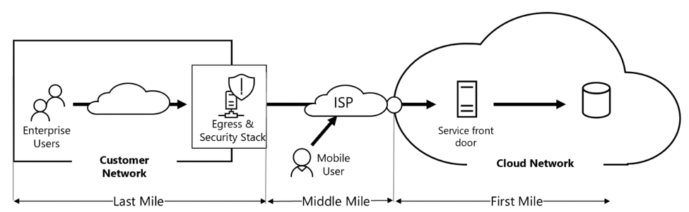

# Netzwerkkonnektivität im Microsoft 365 Admin Center (Vorschau)Network connectivity in the Microsoft 365 Admin Center (preview)

Das Microsoft 365 Admin Center includesaggregated jetzt die von Ihrem Microsoft 365-Mandanten gesammelten Netzwerk Verbindungs Metriken und ist nur für administrative Benutzer in Ihrem Mandanten verfügbar.The Microsoft 365 Admin Center now includesaggregated network connectivity metrics collected from your Microsoft 365 tenant and available to view only by administrative users in your tenant. **Netzwerk Einschätzungen** und **Netzwerk Einblicke** werden im Microsoft 365 Admin Center unter "Integrität" angezeigt **| Konnektivität**.**Network assessments** and **network insights** are displayed in the Microsoft 365 Admin Center under **Health | Connectivity**.

Wenn Sie zum ersten Mal zur Seite Netzwerkkonnektivität navigieren, sehen Sie einen Übersichtsbereich, der eine Übersicht über die globale Netzwerkleistung, eine Netzwerkbewertung für den gesamten Mandanten und eine Liste aktueller Probleme enthält.When you first navigate to the network connectivity page, you will see an overview pane containing a map of global network performance, a network assessment scoped to the entire tenant, and a list of current issues. In der Übersicht können Sie einen Drilldown ausführen, um bestimmte Netzwerk Leistungs Metriken und-Probleme nach Standort anzuzeigen.From the overview, you can drill down to view specific network performance metrics and issues by location. Weitere Informationen finden Sie unter [Übersicht über die Netzwerkleistung im Microsoft 365 Admin Center](#network-performance-overview-in-the-microsoft-365-admin-center).For more information, see [Network performance overview in the Microsoft 365 Admin Center](#network-performance-overview-in-the-microsoft-365-admin-center).

## Voraussetzungen für die Anzeige von Netzwerk Verbindungs BewertungenPre-requisites for network connectivity assessments to appear

Es gibt drei Optionen für das Einholen von Netzwerkbewertungen von Ihren Office-Standorten:There are three options for getting network assessments from your office locations:

### 1. Aktivieren der Windows-Standortdienste1. Enable Windows Location Services

Für diese Option müssen mindestens zwei Computer an jedem Bürostandort mit Unterstützung für die Voraussetzungen vorhanden sein.For this option you must have at least two computers running at each office location that support the pre-requisites. OneDrive für Windows, Version 19,232 oder höher, müssen auf jedem Computer installiert sein.OneDrive for Windows version 19.232 or above must be installed on each computer. Weitere Informationen zu OneDrive-Versionen finden Sie in den [Anmerkungen zur OneDrive-Version](https://support.office.com/article/onedrive-release-notes-845dcf18-f921-435e-bf28-4e24b95e5fc0).For more information on OneDrive versions, see the [OneDrive release notes](https://support.office.com/article/onedrive-release-notes-845dcf18-f921-435e-bf28-4e24b95e5fc0). Netzwerk Messungen sollten in naher Zukunft in anderen Office 365-Clientanwendungen hinzugefügt werden.Network measurements are planned to be added in other Office 365 client applications in the near future.

Windows-Standortdienst muss auf den Computern zugestimmt werden.Windows Location Service must be consented on the machines. Sie können dies testen, indem Sie die **Maps** -App durchführen und sich selbst Auffinden.You can test this by running the **Maps** app and locating yourself. Es kann auf einem einzelnen Computer mit Einstellungen für **Settings**  ->  den**Datenschutz**  ->  **Speicherort** aktiviert werden, in dem die Einstellung "Apps für den Zugriff auf Ihren Standort zulassen" aktiviert sein muss.It can be enabled on a single machine with **Settings** -> **Privacy** -> **Location** where the setting "Allow apps to access your location" must be enabled. Die Zustimmung zum Windows-Standortdienst kann auf PCs mit MDM oder Gruppenrichtlinien mit der Einstellung _LetAppsAccessLocation_bereitgestellt werden.Windows Location Services consent can be deployed to PCs using MDM or Group Policy with the setting _LetAppsAccessLocation_.

Sie müssen keine Speicherorte im Admin Center mit dieser Methode hinzufügen, da diese automatisch in der Stadt Lösung identifiziert werden.You do not need to add locations in the Admin Center with this method as they are automatically identified at the city resolution. Es ist nicht möglich, mehrere Office-Standorte in einer Stadt mithilfe von Windows-Ortungsdiensten anzuzeigen.You cannot show multiple office locations within a city using Windows Location Services.

Die Computer sollten WLAN-Netzwerke anstelle eines Ethernet-Kabels aufweisen.The machines should have Wi-Fi networking rather than an Ethernet cable. Computer mit einem Ethernet-Kabel verfügen nicht über genaue Standortinformationen.Machines with an Ethernet cable do not have accurate location information.

Mess Muster und Office-Standorte sollten 24 Stunden nach der Erfüllung dieser Voraussetzungen angezeigt werden.Measurement samples and office locations should start to appear 24 hours after these pre-requisites have been met.

### 2. Hinzufügen von Speicherorten und Bereitstellen von LAN-Subnetz-Informationen2. Add locations and provide LAN Subnet information

Für diese Option sind weder Windows-Standortdienste noch WLAN erforderlich.For this option neither Windows Location Services nor Wi-Fi are required. Sie benötigen OneDrive für die Windows-Version 20.161.0811.0001 oder höher, installiert auf jedem commputer-Standort.You need OneDrive for Windows version 20.161.0811.0001 or above installed on each commputer at the location.

Sie müssen auch Standorte auf der Seite Admin Center-Netzwerkkonnektivität hinzufügen oder diese aus einer CSV-Datei importieren.You also need to add locations in the Admin Center network connectivity page or to import those from a CSV file. Die hinzugefügten Speicherorte müssen Ihre Office LAN-Subnetz-Informationen enthalten.The locations added must include your office LAN Subnet information.

Da Sie die Speicherorte hinzufügen, können Sie mehrere Büros in einer Stadt definiert haben.Because you are adding the locations, you can have multiple offices defined within a city.

Mess Muster und Office-Standorte sollten 24 Stunden nach der Erfüllung dieser Voraussetzungen angezeigt werden.Measurement samples and office locations should start to appear 24 hours after these pre-requisites have been met.

### 3. Manuelles Sammeln von Testberichten mit dem Microsoft 365 Network Connectivity Test Tool3. Manually gather test reports with the Microsoft 365 network connectivity test tool

Für diese Option müssen Sie eine Person an jedem Standort identifizieren.For this option you need to identify a person at each location. Bitten Sie Sie, den Browser zu [Microsoft 365 Network Connectivity Test](https://connectivity.office.com) auf einem Windows-Computer zu übernehmen, auf dem Sie Administratorberechtigungen haben.Ask them to browser to [Microsoft 365 network connectivity test](https://connectivity.office.com) on a Windows machine that they have administrative permissions on. Auf der Website müssen Sie sich bei Ihrem Office 365 Konto auf demselben Mandanten anmelden, dessen Ergebnisse Sie anzeigen möchten.On the web site, they need to sign-in to their Office 365 account on the same tenant that you want to see the results. Klicken Sie dann auf Testlauf ausführen.Then they click Run test. Während des Tests gibt es eine heruntergeladene Verbindungstest-exe.During the test there is a downloaded Connectivity test EXE. Sie müssen diese ebenfalls öffnen und ausführen.THey need to open and execute that also. Sobald die Tests abgeschlossen sind, wird das Testergebnis in Microsoft hochgeladen.Once the tests are completed, the test result is uploaded to Microsoft.

Test Berichte werden mit einem Speicherort verknüpft, wenn Sie mit LAN-Subnetz-Informationen hinzugefügt wurden, andernfalls werden Sie nur am Ort der Stadt angezeigt.Test reports are linked to a location if it was added with LAN Subnet information, otherwise they are shown at the city location only.

Mess Muster und Office-Standorte sollten beginnen, 2-3 Minuten nach Abschluss eines Testergebnisses zu erscheinen.Measurement samples and office locations should start to appear 2-3 minutes after a test result is completed.

## Wie verwende ich diese Informationen?How do I use this information?

**Network Insights**, die dazugehörigen Leistungsempfehlungen und Netzwerkbewertungen sollen beim Entwerfen von Netzwerkperimetern für Ihre Office-Standorte helfen.**Network insights**, their related performance recommendations and network assessments are intended to help in designing network perimeters for your office locations. Jede Insight enthält Details zu den Leistungsmerkmalen eines bestimmten allgemeinen Problems für jeden geografischen Standort, auf den Benutzer auf ihren Mandanten zugreifen.Each insight provides details about the performance characteristics for a specific common issue for each geographic location where users are accessing your tenant. **Leistungsempfehlungen** für die einzelnen Netzwerk Einblicke bieten spezifische Änderungen an der Netzwerkarchitektur, die Sie zur Verbesserung der Benutzerfreundlichkeit im Zusammenhang mit der Microsoft 365-Netzwerkkonnektivität vornehmen können.**Performance recommendations** for each network insight offer specific network architecture design changes you can make to improve user experience related to Microsoft 365 network connectivity. Die Netzwerkbewertung zeigt, wie sich die Netzwerkkonnektivität auf die Benutzerfreundlichkeit auswirkt und einen Vergleich verschiedener Netzwerkverbindungen für Benutzer Standorte ermöglicht.The network assessment shows how network connectivity impacts user experience, allowing for comparison of different user location network connections.

Mithilfe von **Netzwerkbewertungen** wird ein Aggregat zahlreicher Netzwerk Leistungs Metriken in eine Momentaufnahme ihrer Unternehmensnetzwerk Integrität unterrepräsentiert durch einen Points-Wert von 0-100.**Network assessments** distill an aggregate of many network performance metrics into a snapshot of your enterprise network health, represented by a points value from 0 - 100. Netzwerkbewertungen sind sowohl für den gesamten Mandanten als auch für jeden geografischen Standort ausgelegt, von dem aus Benutzer eine Verbindung mit Ihrem Mandanten herstellen, sodass Microsoft 365-Administratoren eine einfache Möglichkeit haben, eine Gestalt der Netzwerkintegrität des Unternehmens sofort zu erfassen und schnell einen detaillierten Bericht für einen beliebigen globalen Office-Standort aufzurufen.Network assessments are scoped to both the entire tenant and for each geographic location from which users connect to your tenant, providing Microsoft 365 administrators with an easy way to instantly grasp a gestalt of the enterprise's network health and quickly drill down into a detailed report for any global office location.

Komplexe Unternehmen mit mehreren Office-Standorten und nicht-trivialen Netzwerkperimeter-Architekturen können von diesen Informationen profitieren, entweder während des ersten onboardings zu Microsoft 365 oder um Probleme bei der Netzwerkleistung zu beheben, die mit dem Nutzungs Wachstum ermittelt wurden.Complex enterprises with multiple office locations and non-trivial network perimeter architectures can benefit from this information either during their initial onboarding to Microsoft 365 or to remediate network performance issues discovered with usage growth. Dies ist in der Regel für kleine Unternehmen mit Microsoft 365 oder für Unternehmen, die bereits über eine einfache und direkte Netzwerkverbindung verfügen, nicht erforderlich.This is usually not necessary for small businesses using Microsoft 365, or any enterprises who already have simple and direct network connectivity. Unternehmen mit mehr als 500 Benutzern und mehreren Office-Standorten werden davon ausgehen.Enterprises with over 500 users and multiple office locations are expected to benefit the most.

>[!IMPORTANT]
>Netzwerk Einblicke, Leistungsempfehlungen und Bewertungen im Microsoft 365 Admin Center befinden sich derzeit im Vorschaustatus und stehen nur für Microsoft 365-Mandanten zur Verfügung, die im Feature Preview-Programm registriert wurden.Network insights, performance recommendations and assessments in the Microsoft 365 Admin Center is currently in preview status, and is only available for Microsoft 365 tenants that have been enrolled in the feature preview program.

## Herausforderungen bei der Unternehmensnetzwerk KonnektivitätEnterprise network connectivity challenges

Viele Unternehmen verfügen über Netzwerkumkreis Konfigurationen, die im Laufe der Zeit gewachsen sind und in erster Linie für den Zugriff von Internetwebsites für Mitarbeiter vorgesehen sind, bei denen die meisten Websites nicht vorab bekannt sind und nicht vertrauenswürdig sind.Many enterprises have network perimeter configurations which have grown over time and are primarily designed to accommodate employee Internet web site access where most web sites are not known in advance and are untrusted. Der vorherrschende und notwendige Fokus besteht darin, Schadsoftware und Angel Angriffe aus diesen unbekannten Websites zu vermeiden.The prevailing and necessary focus is avoiding malware and fishing attacks from these unknown web sites. Diese Netzwerk Konfigurationsstrategie, die aus Sicherheitsgründen hilfreich ist, kann zu Beeinträchtigungen der Leistung von Microsoft 365 und der Benutzerfreundlichkeit führen.This network configuration strategy, while helpful for security purposes, can lead to degradation of Microsoft 365 user performance and user experience.

## Wie können wir diese Herausforderungen lösen?How we can solve these challenges

Unternehmen können die allgemeine Benutzerfreundlichkeit verbessern und Ihre Umgebung schützen, indem Sie die [Prinzipien von Office 365 Konnektivität](https://aka.ms/pnc) und das Microsoft 365 Admin Center-Netzwerk Verbindungs Feature verwenden.Enterprises can improve general user experience and secure their environment by following [Office 365 connectivity principles](https://aka.ms/pnc) and by using the Microsoft 365 Admin Center network connectivity feature. In den meisten Fällen hat die Einhaltung dieser allgemeinen Grundsätze erhebliche positive Auswirkungen auf die Wartezeit von Endbenutzern, die Zuverlässigkeit der Dienste und die Gesamtleistung von Microsoft 365.In most cases, following these general principles will have a significant positive impact on end user latency, service reliability and overall performance of Microsoft 365.

Microsoft wird manchmal aufgefordert, Netzwerkleistungsprobleme mit Microsoft 365 für große Unternehmenskunden zu untersuchen, und diese weisen häufig eine Hauptursache im Zusammenhang mit der Netzwerk Ausgangs Infrastruktur des Kunden auf.Microsoft is sometimes asked to investigate network performance issues with Microsoft 365 for large enterprise customers, and these frequently have a root cause related to the customers network egress infrastructure. Wenn eine allgemeine Ursache für ein Problem mit dem Umkreis eines Kunden Netzwerks gefunden wird, versuchen wir, einfache Testmessungen zu identifizieren, die diese identifizieren.When a common root cause of a customer network perimeter issue is found we seek to identify simple test measurements that identifies it. Ein Test mit einem Schwellenwert für die Messung, mit dem ein bestimmtes Problem identifiziert wird, ist wertvoll, da wir dieselbe Messung an einem beliebigen Ort testen können, um zu ermitteln, ob diese Ursache dort vorhanden ist, und Sie als Netzwerk Einblicke mit dem Administrator freigeben.A test with a measurement threshold that identifies a specific problem is valuable because we can test the same measurement at any location, tell whether this root cause is present there and share it as a network insight with the administrator.

Einige Netzwerk Einblicke deuten lediglich auf ein Problem hin, das weiter untersucht werden muss.Some network insights will merely indicate a problem that needs further investigation. Ein Netzwerk Einblicke, in dem genügend Tests vorhanden sind, um eine bestimmte Korrekturaktion zur Behebung der Stamm Ursache anzuzeigen, wird als **Empfohlene Aktion**aufgeführt.A network insight where we have enough tests to show a specific remediation action to correct the root cause is listed as a **recommended action**. Diese Empfehlungen, basierend auf Live Metriken, die Werte offen legen, die außerhalb eines vordefinierten Schwellenwerts liegen, sind viel wertvoller als allgemeine Ratschläge zur bewährten Vorgehensweise, da Sie für Ihre Umgebung spezifisch sind und die tatsächliche Verbesserung zeigen, nachdem die empfohlenen Änderungen vorgenommen wurden.These recommendations, based on live metrics that reveal values that fall outside a predetermined threshold, are much more valuable than general best practice advice since they are specific to your environment and will show the actual improvement once the recommended changes have been made.

## Übersicht über die Netzwerkkonnektivität im Microsoft 365 Admin CenterNetwork connectivity overview in the Microsoft 365 Admin Center

Microsoft hat vorhandene Netzwerk Messungen von mehreren Office-Desktop-und Webclients, die den Betrieb von Microsoft 365 unterstützen.Microsoft has existing network measurements from several Office desktop and web clients which support the operation of Microsoft 365. Diese Messungen werden nun verwendet, um Einblicke in die Netzwerkarchitektur und eine Netzwerkbewertung bereitzustellen, die auf der Seite " **Netzwerkkonnektivität** " im Microsoft 365 Admin Center angezeigt werden.These measurements are now being used to provide network architecture design insights and a network assessment which are shown in the **Network connectivity** page in the Microsoft 365 Admin Center.

Standardmäßig wird der Ort, an dem sich die Clientgeräte befinden, in annähernden Standortinformationen, die den Netzwerk Messungen zugeordnet sind, feststehen.By default, approximate location information associated with the network measurements identify the city where client devices are located. Die Netzwerkbewertung an jedem Standort wird mit Farbe angezeigt, und die relative Anzahl der Benutzer an jedem Standort wird durch die Größe des Kreises dargestellt.The network assessment at each location is shown with color and the relative number of users at each location is represented by the size of the circle.

Auf der Übersichtsseite wird auch die Netzwerkbewertung für den Kunden als gewichteter Durchschnitt für alle Office-Standorte dargestellt.The overview page also shows the network assessment for the customer as a weighted average across all office locations.

## Übersicht über die spezifische Netzwerkleistung für Office-Standorte und EinblickeSpecific office location network performance summary and insights

Durch die Auswahl eines Office-Standorts wird eine standortspezifische Zusammenfassungsseite geöffnet, in der Details zum Netzwerk Ausstieg angezeigt werden, die von den Messungen an diesem Standort ermittelt wurden.Selecting an office location opens a location-specific summary page showing details of the network egress that has been identified from measurements for that office location.

Auf der Seite Zusammenfassung der Office-standortzusammenfassung werden außerdem die Netzwerkbewertung des Standorts, der Netzwerk Bewertungsverlauf, ein Vergleich der Bewertung dieses Standorts mit anderen Kunden in derselben Stadt sowie eine Liste mit spezifischen Einblicken und Empfehlungen aufgeführt, die Sie zur Verbesserung der Netzwerkleistung und Zuverlässigkeit Unternehmen können.The office location summary page additionally shows the location's network assessment, network assessment history, a comparison of this location's assessment to other customers in the same city, and a list of specific insights and recommendations that you can undertake to improve network performance and reliability. Standorte mit spezifischen Empfehlungen können auch eine geschätzte potenzielle Verbesserung der Wartezeit umfassen.Locations with specific recommendations may also include an estimated potential latency improvement.

Vergleiche zwischen Kunden in der gleichen Stadt basieren auf der Erwartung, dass alle Kunden gleichberechtigten Zugriff auf Netzwerkdienstanbieter, Telekommunikationsinfrastruktur und in der Nähe befindliche Microsoft-Netzwerk Points of Presence haben.Comparisons between customers in the same city are based on the expectation that all customers have equal access to network service providers, telecommunications infrastructure, and nearby Microsoft network points of presence.

Auf der Registerkarte Details auf der Seite Office-Standort werden die spezifischen Messergebnisse angezeigt, die verwendet wurden, um Einblicke, Empfehlungen und die Netzwerkbewertung zu erzielen.The details tab on the office location page shows the specific measurement results that were used to come up with any insights, recommendations, and the network assessment. Dies wird bereitgestellt, damit Netzwerkingenieure die Empfehlungen und den Faktor für Einschränkungen oder Besonderheiten in Ihrer Umgebung überprüfen können.This is provided so that network engineers can validate the recommendations and factor in any constraints or specifics in their environment.

## CSV-Import für LAN-Subnetze-Office-StandorteCSV Import for LAN Subnet office locations

Für das LAN-Subnetz-Identifikations Büro müssen Sie jeden locaiton im Voraus hinzufügen.For LAN subnet office identification, you need to add each locaiton in advance. Anstatt einzelne Office-Standorte auf der Registerkarte **Standorte** hinzuzufügen, können Sie Sie aus einer CSV-Datei importieren.Instead of adding individual office locations in the **Locations** tab you can import them from a CSV file. Sie können diese Daten möglicherweise von anderen Orten abrufen, die Sie gespeichert haben, wie etwa das Dashboard für Anrufqualität oder Active Directory Websites und DiensteYou may be able to obtain this data from other places you have stored it such as the Call Quality Dashboard or Active Directory Sites and Services

In der CSV-Datei wird ein Ort mit der festgestellten Stadt als " **Stadt**" bezeichnet, und eine manuell hinzugefügte Office-Position ist mit der Bezeichnung **Location**versehenIn the CSV file a discovered city location is labeled **City**, and a manually added office location is labeled **Location**.

1. Klicken Sie im Fenster Haupt _Konnektivität mit Microsoft 365_ auf die Registerkarte **Speicherorte** .In the main _Connectivity to Microsoft 365_ window, click the **Locations** tab.
1. Klicken Sie auf die Schaltfläche **importieren** direkt oberhalb der Liste Orte.Click the **Import** button just above the locations list. Das Flyout **Office-Speicherorte importieren** wird angezeigt.The **Import office locations** flyout will appear.

   

1. Klicken Sie auf den Link **aktuelle Office-Standorte herunterladen (CSV)** , um die Liste der aktuellen Speicherorte in eine CSV-Datei zu exportieren, und speichern Sie Sie auf Ihrer lokalen Festplatte.Click the **Download current office locations (.csv)** link to export the current locations list to a CSV file, and save it to your local hard disk. Auf diese Weise erhalten Sie eine ordnungsgemäß formatierte CSV-Datei mit Spaltenüberschriften, an die Sie Orte hinzufügen können.This will provide you with a correctly formatted CSV with column headings to which you can add locations. Sie können die vorhandenen exportierten Speicherorte unverändert lassen. Sie werden nicht dupliziert, wenn Sie die aktualisierte CSV importieren.You can leave the existing exported locations as they are; they will not be duplicated when you import the updated CSV. Wenn Sie die Adresse eines vorhandenen Speicherorts ändern möchten, wird diese beim Importieren der CSV-Datei aktualisiert.If you wish to change the address of an existing location, it will be updated when you import the CSV. Sie können die Adresse eines entdeckten Orts nicht ändern.You cannot change the address of a discovered city.
1. Öffnen Sie die CSV-Datei, und fügen Sie Ihre Standorte hinzu, indem Sie die folgenden Felder in einer neuen Position für jeden Ort ausfüllen, den Sie hinzufügen möchten.Open the CSV and add your locations by filling out the following fields on a new line for each location you want to add. Lassen Sie alle anderen Felder leer; Werte, die Sie in andere Felder eingeben, werden ignoriert.Leave all other fields blank; values you enter in other fields will be ignored.
   1. **Adresse** (erforderlich): die physische Adresse des Büros**Address** (required): The physical address of the office
   1. **Latitude** (optional): von Bing Maps-Lookup aufgefüllt, wenn leer**Latitude** (optional): Populated from Bing maps lookup if blank
   1. **Längengrad** (optional): von Bing Maps-Lookup aufgefüllt, wenn leer**Longitude** (optional): Populated from Bing maps lookup if blank
   1. Ausgehende **IP-Adressbereiche 1-5** (optional): Geben Sie für jeden Bereich den Leitungsnamen gefolgt von einer durch Leerzeichen getrennten Liste gültiger IPv4-oder IPv6-CIDR-Adressen ein.**Egress IP Address ranges 1-5** (optional): For each range, enter the circuit name followed by a space separated list of valid IPv4 or IPv6 CIDR addresses. Diese Werte werden verwendet, um mehrere Office-Standorte zu unterscheiden, bei denen dieselben IP-Adressen für LAN-Subnetze verwendet werden.These values are used to differentiate multiple office locations where you use the same LAN subnet IP Addresses.
   1. **LanIps** (erforderlich): Listet die LAN-Subnetz-Bereiche auf, die an diesem Standort verwendet werden.**LanIps** (required): List the LAN Subnet ranges in use at this office location.
1. Wenn Sie Ihre Office-Standorte hinzugefügt und die Datei gespeichert haben, klicken Sie neben dem Feld **abgeschlossen hochladen** auf die Schaltfläche **Durchsuchen** , und wählen Sie die gespeicherte CSV-Datei aus.When you have added your office locations and saved the file, click the **Browse** button next to the **Upload the completed** field and select the saved CSV file.
1. Die Datei wird automatisch überprüft.The file will be automatically validated. Wenn Validierungsfehler vorliegen, wird die Fehlermeldung angezeigt, _dass in der Importdatei einige Fehler aufgetreten sind. Überprüfen Sie die Fehler, korrigieren Sie die Importdatei, und versuchen Sie es dann erneut._If there are validation errors, you will see the error message _There are some errors in the import file. Review the errors, correct the import file, and then try again._ Klicken Sie auf den Link **Fehlerdetails öffnen** , um eine Liste der spezifischen Feld Überprüfungsfehler anzuzeigen.Click the link **Open error details** for a list of specific field validation errors.

   

1. Wenn die Datei keine Fehler enthält, wird die Meldung angezeigt, dass _der Bericht verfügbar ist. Es wurden x-Speicherorte hinzugefügt und x-Standorte aktualisiert._If there are no errors in the file, you will see the message _The report is ready. Found x locations to add and x locations to update._ Klicken Sie auf die Schaltfläche **importieren** , um die CSV hochzuladen.Click the **Import** button to upload the CSV.

   

## Häufig gestellte FragenFAQ

### Was ist ein Microsoft 365-Dienst-Haustür?What is a Microsoft 365 service front door?

Die Microsoft 365-Dienst-Haustür ist ein Einstiegspunkt im globalen Microsoft-Netzwerk, in dem Office-Clients und-Dienste Ihre Netzwerkverbindung beenden.The Microsoft 365 service front door is an entry point on Microsoft's global network where Office clients and services terminate their network connection. Für eine optimale Netzwerkverbindung mit Microsoft 365 wird empfohlen, dass Ihre Netzwerkverbindung mit der nächstgelegenen Microsoft 365-Haustür beendet wird.For an optimal network connection to Microsoft 365, it is recommended that your network connection is terminated into the closest Microsoft 365 front door.

>[!NOTE]
>Microsoft 365 Service Haustür hat keine direkte Beziehung zum Azure-Front-Door-Dienst Produkt, das im Azure Marketplace verfügbar ist.Microsoft 365 service front door has no direct relationship to the Azure Front Door Service product available in the Azure marketplace.

### Was ist eine optimale Haustür für den Microsoft 365-Dienst?What is an optimal Microsoft 365 service front door?

Eine optimale Microsoft 365-Dienst-Haustür ist eine, die Ihrem Netzwerk Ausgang am nächsten ist, in der Regel in ihrer Stadt oder in ihrer Metro-Region.An optimal Microsoft 365 service front door is one that is closest to your network egress, generally in your city or metro area. Verwenden Sie den [Microsoft 365 Connectivity Test](office-365-network-mac-perf-onboarding-tool.md) , um den Speicherort Ihrer Haustür für den in-use-Microsoft 365-Dienst und die optimale Dienst-Haustür zu ermitteln.Use the [Microsoft 365 connectivity test](office-365-network-mac-perf-onboarding-tool.md) to determine location of your in-use Microsoft 365 service front door and optimal service front door. Wenn das Tool feststellt, dass Ihre in-use-Haustür optimal ist, verbinden Sie sich optimal mit dem globalen Netzwerk von Microsoft.If the tool determines your in-use front door is optimal, then you are optimally connecting into Microsoft's global network.

### Was ist ein Internet Ausstieg-Standort?What is an internet egress location?

Der Internet Ausgangsstandort ist der Ort, an dem Ihr Netzwerkdatenverkehr Ihr Unternehmensnetzwerk verlässt und eine Verbindung mit dem Internet herstellt.The internet egress location is the location where your network traffic exits your enterprise network and connects to the Internet. Dies wird auch als Standort bezeichnet, an dem Sie ein NAT-Gerät (Network Address Translation, Netzwerkadressübersetzung) haben und in der Regel eine Verbindung mit einem Internetdienstanbieter (Internet Service Provider, ISP) herstellen.This is also identified as the location where you have a Network Address Translation (NAT) device and usually where you connect with an Internet Service Provider (ISP). Wenn Sie einen langen Abstand zwischen Ihrem Standort und Ihrem Internet Ausgangsstandort sehen, kann dies auf eine erhebliche WAN-Backhaul hindeuten.If you see a long distance between your location and your internet egress location, then this may indicate a significant WAN backhaul.

## Verwandte ThemenRelated topics

[Microsoft 365 Network Insights (Vorschau)Microsoft 365 Network insights (preview)](office-365-network-mac-perf-insights.md)

[Microsoft 365 Netzwerkbewertung (Vorschau)Microsoft 365 network assessment (preview)](office-365-network-mac-perf-score.md)

[Microsoft 365 Connectivity Test im M365 Admin Center (Vorschau)Microsoft 365 connectivity test in the M365 Admin Center (preview)](office-365-network-mac-perf-onboarding-tool.md)

[Microsoft 365 Network Connectivity Location Services (Vorschau)Microsoft 365 Network Connectivity Location Services (preview)](office-365-network-mac-location-services.md)
