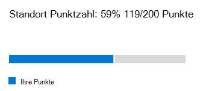

# Microsoft 365 Netzwerkbewertung (Vorschau)Microsoft 365 network assessment (preview)

In der Netzwerkkonnektivität des Microsoft 365 admin Centers destillieren **Netzwerkbewertungen** ein Aggregat zahlreicher Netzwerk Leistungs Metriken in einer Momentaufnahme ihrer Umkreis Integrität des Unternehmensnetzwerks, dargestellt durch einen Points-Wert von 0-100.In the Microsoft 365 Admin Center's network connectivity, **network assessments** distill an aggregate of many network performance metrics into a snapshot of your enterprise network perimeter health, represented by a points value from 0 - 100. Bei einer Netzwerkbewertung erfahren Sie, wie stark sich der Netzwerkentwurf des Kunden auf Office 365 Benutzererfahrung auswirkt.A network assessment tells you how much the customer responsible network design is impacting Office 365 user experience. Netzwerkbewertungen sind sowohl für den gesamten Mandanten als auch für jeden geografischen Standort ausgelegt, von dem aus Benutzer eine Verbindung mit Ihrem Mandanten herstellen, sodass Microsoft 365-Administratoren eine einfache Möglichkeit haben, eine Gestalt der Netzwerkintegrität des Unternehmens sofort zu erfassen und schnell einen detaillierten Bericht für einen beliebigen globalen Office-Standort aufzurufen.Network assessments are scoped to both the entire tenant and for each geographic location from which users connect to your tenant, providing Microsoft 365 administrators with an easy way to instantly grasp a gestalt of the enterprise's network health and quickly drill down into a detailed report for any global office location.

Der Wert "Netzwerk Bewertungspunkte" ist ein Durchschnitt der TCP-Wartezeit, der Downloadgeschwindigkeit und der Qualitäts Metriken für die UDP-Verbindung, die einmal pro Tag kompiliert wurden.The network assessment points value is an average of TCP latency, download speed and UDP connection quality metrics compiled once a day. Leistungs Metriken für in Microsoft befindliche Netzwerke werden von diesen Messungen ausgeschlossen, um sicherzustellen, dass die Bewertungsergebnisse eindeutig und für das Unternehmensnetzwerk spezifisch sind.Performance metrics for Microsoft-owned networks are excluded from these measurements to ensure that assessment results are unambiguous and specific to the corporate network.

Ein sehr niedriger Netzwerk Bewertungs Wert deutet darauf hin, dass Microsoft 365-Clients erhebliche Probleme beim Herstellen einer Verbindung mit dem Mandanten oder beim aufrecht erhalten einer reaktionsfähigen Benutzeroberfläche haben, während ein hoher Wert ein ordnungsgemäß konfiguriertes Netzwerk mit einigen fortlaufenden Leistungsproblemen angibt.A very low network assessment value suggests that Microsoft 365 clients will have significant problems connecting to the tenant or maintaining a responsive user experience, while a high value indicates a properly configured network with few ongoing performance issues. Ein Wert von 80% stellt eine gesunde Basislinie dar, bei der nicht erwartet werden soll, dass reguläre Benutzer Beschwerden über die Microsoft 365-Konnektivität oder die Reaktionsfähigkeit aufgrund der Netzwerkleistung empfangen werden.A value of 80% represents a healthy baseline where you should not expect to receive regular user complaints about Microsoft 365 connectivity or responsiveness due to network performance. Wenn die Verbesserungen für eine iterative Netzwerkkonnektivität vorgenommen werden, steigt dieser Wert zusammen mit der Benutzeroberfläche.As iterative network connectivity improvements are made, this value will increase along with user experience.

| NetzwerkbewertungNetwork assessment | Erwartete BenutzeroberflächeExpected user experience |
| :----------------- | :----------------------- |
| 100100                | OptimalBest                     |
| 8080                 | Erfüllt EmpfehlungenMeets recommendations    |
| 6060                 | AnnehmbarAcceptable               |
| 4040                 | Benutzer können Probleme auftretenUsers may experience issues |
| 2020                 | Benutzer können sich beschwerenUsers may complain       |
| 00                  | Netzwerkprobleme ein allgemeines DiskussionsthemaNetwork problems a common topic of discussion |

>[!IMPORTANT]
>Netzwerk Einblicke, Leistungsempfehlungen und Bewertungen im Microsoft 365 Admin Center befinden sich derzeit im Vorschaustatus und stehen nur für Microsoft 365-Mandanten zur Verfügung, die im Feature Preview-Programm registriert wurden.Network insights, performance recommendations and assessments in the Microsoft 365 Admin Center is currently in preview status, and is only available for Microsoft 365 tenants that have been enrolled in the feature preview program.

## Netzwerk BewertungsbereichNetwork assessment panel

Bei jeder Netzwerkbewertung, unabhängig davon, ob Sie auf den Mandanten oder einen bestimmten Standort beschränkt ist, wird ein Bereich mit Details zur Bewertung angezeigt.Each network assessment, whether scoped to the tenant or to a specific office location, shows a panel with details about the assessment. Dieses Panel zeigt ein Balkendiagramm der Bewertung sowohl als Prozentsatz als auch als Gesamtpunktzahl für jede Arbeitsauslastung der Komponente einschließlich der Arbeitslasten, bei denen Messdaten empfangen wurden.This panel shows a bar chart of the assessment both as a percentage and as the total points for each component workload including only workloads where measurement data was received. Für eine Bewertung des Office-Standortnetzwerks zeigen wir auch einen Vergleich mit dem Prozentsatz von Microsoft 365-Kunden in jedem der fünf Quintiles an, die Daten in derselben Stadt wie Ihr Bürostandort gemeldet haben.For an office location network assessment, we also show a comparison to the percent of Microsoft 365 customers in each of five quintiles that reported data in the same city as your office location.

Der **Bewertungs Aufschlüsselung** im Bereich zeigt die Bewertung für jede der Komponenten Arbeitsauslastungen.The **Assessment breakdown** in the panel shows the assessment for each of the component workloads.

Der **Bewertungsverlauf** zeigt die letzten 30 Tage der Bewertung und die Benchmark an.The **Assessment history** shows the past 30 days of the assessment and the benchmark. Sie können auch über die Registerkarte Verlauf bis zu zwei Jahre über den Metriken-Verlauf für alle Office-Standorte Berichten. Auf der Registerkarte Verlauf können Sie Ihre Attribute auswählen und einen Berichtszeit Rahmen auswählen, um die Auswirkungen eines Netzwerk aktualisierungsprojekts hervorzuheben und die Verbesserung ihrer Netzwerkbewertung zu sehen.You can also report on the metrics history for any office location for up to two years using the history tab. The history tab allows you to select your attributes to report on and by choosing a report timeframe you can highlight the impact of a network update project and see the improvement to your network assessment.

## Assessments für Mandanten Netzwerke und Netzwerkbewertungen für Office-StandorteTenant network assessments and office location network assessments

Eine Netzwerkbewertung misst den Entwurf des Netzwerkperimeters eines Office-Standorts für das Microsoft-Netzwerk.A network assessment measures the design of the network perimeter of an office location to Microsoft's network. Verbesserungen am Netzwerkperimeter werden am besten an jedem Office-Standort vorgenommen.Improvements to the network perimeter is best done at each office location.

Wir zeigen einen Netzwerk Bewertungs Wert für den gesamten Microsoft 365-Mandanten auf der Seite Netzwerk Leistungsübersicht an, bei der es sich um einen gewichteten Durchschnitt der Netzwerkbewertungen für alle Office-Standorte handelt.We show a network assessment value for the whole Microsoft 365 tenant on the network performance overview page which is a weighted average of the network assessments for all office locations. Es gibt auch einen bestimmten Netzwerk Bewertungs Wert für jeden erkannten Office-Standort auf der Zusammenfassungsseite dieses Standorts.There is also a specific network assessment value for each detected office location on that location's summary page.

## Exchange OnlineExchange Online

Für Exchange Online wird die TCP-Wartezeit vom Clientcomputer zur Exchange-Dienst Haustür gemessen.For Exchange Online the TCP latency from the client machine to the Exchange service front door is measured. Dies kann durch die Entfernung beeinträchtigt werden, über die das Netzwerk über die Kunden LAN und WAN reist.This can be impacted by the distance the network travels over the customers LAN and WAN. Es kann auch durch Netzwerk-zwischengeschaltete Geräte oder Dienste beeinträchtigt werden, die die Konnektivität verzögern oder dazu führen, dass Pakete erneut gesendet werden.It can also be impacted by network intermediary devices or services which delay the connectivity or cause packets to be resent. Und es wird dadurch beeinflusst, wie weit entfernt die nächste Exchange-Dienst-Haustür ist.And it is impacted by how far away the nearest Exchange service front door is. Der Median (auch als 50-Perzentil-oder P50-Measure bezeichnet) wird für alle Messungen in den vorherigen drei Tagen verwendet.The median (also known as the 50th percentile or P50 measure) is taken for all measurements over the previous three days.

Die Exchange Online Bewertung erfolgt anhand der folgenden Tabelle.The Exchange Online assessment is made using the following table. Alle TCP-Latenz Nummern zwischen den Schwellenwerten werden linear innerhalb des Bands zugewiesen.Any TCP latency number between the thresholds are assigned points linearly within the band.

| TCP-WartezeitTCP Latency   | PointsPoints |
| :------------ | :----- |
| 10ms oder niedriger10ms or less  | 100100    |
| 25ms25ms          | 8080     |
| 100 MS100ms         | 6060     |
| 200ms200ms         | 4040     |
| 300ms300ms         | 2020     |
| 350ms oder mehr350ms or more | 00      |

## SharePoint OnlineSharePoint Online

Für SharePoint Online wird die Downloadgeschwindigkeit gemessen, die ein Benutzer für den Zugriff auf ein Dokument von SharePoint oder OneDrive zur Verfügung stellt.For SharePoint Online the download speed available for a user to access a document from SharePoint or OneDrive is measured. Dies kann durch die verfügbare Bandbreite zwischen dem Clientcomputer und dem Netzwerk von Microsoft auf Netzwerk Schaltkreisen beeinträchtigt werden.This can be impacted by the bandwidth available on network circuits between the client machine and Microsoft's network. Es wird auch häufig von Netzwerküberlastung beeinflusst, die in Engpässen bei komplexen Netzwerkgeräten oder in schlechten WLAN-Abdeckungsbereichen vorhanden ist.It is also often impacted by network congestion that exists in bottlenecks in complex network devices or in poor coverage Wi-Fi areas. Die Downloadgeschwindigkeit wird in Megabyte pro Sekunde gemessen, bei dem es sich um etwa einen Zehntel einer Schaltung mit Megabit pro Sekunde handelt.The download speed is measured in megabytes per second which is approximately one tenth of a circuits rated megabits per second. Die Einheit Megabyte pro Sekunde ist hilfreich, da Sie direkt sehen können, welche Größe Datei in 1 Sekunde heruntergeladen werden kann.The MegaByte per second unit is helpful because you can directly see what size file can be downloaded in 1 second. Das 25. Perzentil (auch als P25-Measure bezeichnet) wird für alle Messungen in den vorherigen drei Tagen übernommen.The 25th percentile (also known as the P25 measure) is taken for all measurements over the previous three days. Dieses 25. Perzentil hilft, die Auswirkungen unterschiedlicher Überlastung im Laufe der Zeit zu verringern.This 25th percentile helps reduce the impact of varying congestion over time.

Die SharePoint Online Bewertung erfolgt anhand der folgenden Tabelle.The SharePoint Online assessment is made using the following table. Jede Download Geschwindigkeits Nummer zwischen den Schwellenwerten wird linear innerhalb des Bands zugewiesen.Any download speed number between the thresholds are assigned points linearly within the band.

| Download GeschwindigkeitDownload speed | PointsPoints |
| :------------- | :----- |
| 20Mbps oder mehr20MBps or more | 100100    |
| 14MBps14MBps         | 8080     |
| 8MBps8MBps          | 6060     |
| 4MBps4MBps          | 4040     |
| 2Mbps2MBps          | 2020     |
| 0MBps0MBps          | 00      |

## Microsoft TeamsMicrosoft Teams

Für Microsoft Teams wird die Netzwerkqualität als UDP-Wartezeit, UDP-Jitter und UDP-Paketverlust gemessen.For Microsoft Teams the Network quality is measured as UDP latency, UDP jitter, and UDP packet loss. UDP wird für die Audio-und Video Medien Konnektivität für Anrufe und Konferenzen für Microsoft Teams verwendet.UDP is used for call and conferencing audio and video media connectivity for Microsoft Teams. Dies kann durch die gleichen Faktoren wie Wartezeit und Downloadgeschwindigkeit sowie Verbindungs Lücken in der UDP-Unterstützung eines Netzwerks beeinträchtigt werden, da UDP separat mit dem häufigeren TCP-Protokoll konfiguriert wird.This can be impacted by the same factors as for latency and download speed in addition to connectivity gaps in a network's UDP support since UDP is configured separately to the more common TCP protocol. Der Median (auch als 50-Perzentil-oder P50-Measure bezeichnet) wird für alle Messungen in den vorherigen drei Tagen verwendet.The median (also known as the 50th percentile or P50 measure) is taken for all measurements over the previous three days. 

Wir berechnen eine mittlere Meinungs Bewertung aus diesen UDP-Messungen für eine Skala von 1 bis 5.We calculate a mean opinion score from these UDP measurements for a scale from one to five. Anschließend ordnen wir dies der 0-100 Points-Skala für die Microsoft Teams-Netzwerkbewertung zu.Then we map that to the 0-100 points scale for the Microsoft Teams network assessment.  Insgesamt gut ist über 87,5 Punkte und insgesamt schlecht liegt unter 50 Punkte.Overall good is over 87.5 points and overall bad is below 50 points.

## Verwandte ThemenRelated topics

[Netzwerkkonnektivität im Microsoft 365 Admin Center (Vorschau)Network connectivity in the Microsoft 365 Admin Center (preview)](office-365-network-mac-perf-overview.md)

[Microsoft 365 Network Performance Insights (Vorschau)Microsoft 365 network performance insights (preview)](office-365-network-mac-perf-insights.md)

[Microsoft 365 Network Connectivity Test Tool (Vorschau)Microsoft 365 network connectivity test tool (preview)](office-365-network-mac-perf-onboarding-tool.md)

[Microsoft 365 Network Connectivity Location Services (Vorschau)Microsoft 365 Network Connectivity Location Services (preview)](office-365-network-mac-location-services.md)
