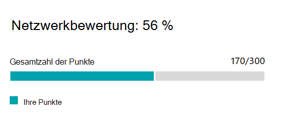

# Microsoft 365 Netzwerkbewertung (Vorschau)

In der Microsoft 365 Admin Center-Verbindung mit der Microsoft 365-Seite destillieren **Netzwerkbewertungen** ein Aggregat vieler Netzwerk Leistungs Metriken in einer Momentaufnahme ihres Unternehmensnetzwerk Status, dargestellt durch einen Points-Wert von 1-100. Netzwerkbewertungen sind sowohl für den gesamten Mandanten als auch für jeden geografischen Standort ausgelegt, von dem aus Benutzer eine Verbindung mit Ihrem Mandanten herstellen, sodass Microsoft 365-Administratoren eine einfache Möglichkeit haben, eine Gestalt der Netzwerkintegrität des Unternehmens sofort zu erfassen und schnell einen detaillierten Bericht für einen beliebigen globalen Office-Standort aufzurufen.

Der Wert Netzwerk Bewertungspunkte ist eine durchschnittliche Messung der Wartezeit, der Bandbreite, der Downloadgeschwindigkeit und der Verbindungs Qualitäts Metriken, die zum Zeitpunkt der Anzeige Live kompiliert wurden. Leistungs Metriken für in Microsoft befindliche Netzwerke werden von diesen Messungen ausgeschlossen, um sicherzustellen, dass die Bewertungsergebnisse eindeutig und für das Unternehmensnetzwerk spezifisch sind.

Ein sehr niedriger Netzwerk Bewertungs Wert deutet darauf hin, dass Microsoft 365-Clients erhebliche Probleme beim Herstellen einer Verbindung mit dem Mandanten oder beim aufrecht erhalten einer reaktionsfähigen Benutzeroberfläche haben, während ein hoher Wert ein ordnungsgemäß konfiguriertes Netzwerk mit einigen fortlaufenden Leistungsproblemen angibt. Ein Wert von 80% stellt eine gesunde Basislinie dar, bei der nicht erwartet werden soll, dass reguläre Benutzer Beschwerden über die Microsoft 365-Konnektivität oder die Reaktionsfähigkeit aufgrund der Netzwerkleistung empfangen werden. Wenn die Verbesserungen für eine iterative Netzwerkkonnektivität vorgenommen werden, steigt dieser Wert zusammen mit der Benutzeroberfläche.

>[!IMPORTANT]
>Netzwerk Einblicke, Leistungsempfehlungen und Bewertungen im Microsoft 365 Admin Center befinden sich derzeit im Vorschaustatus und stehen nur für Microsoft 365-Mandanten zur Verfügung, die im Feature Preview-Programm registriert wurden.

## Netzwerk Bewertungsbereich

Bei jeder Netzwerkbewertung, unabhängig davon, ob Sie auf den Mandanten oder einen bestimmten Standort beschränkt ist, wird ein Bereich mit Details zur Bewertung angezeigt. Dieses Panel zeigt ein Balkendiagramm der Bewertung sowohl als Prozentsatz als auch als Gesamtpunktzahl für jede Arbeitsauslastung der Komponente einschließlich der Arbeitslasten, bei denen Messdaten empfangen wurden. Für eine Bewertung des Office-Standortnetzwerks zeigen wir auch einen Benchmark an, bei dem es sich um den Median aller Microsoft 365-Clients handelt, von denen Daten in derselben Stadt wie Ihr Bürostandort gemeldet wurden.

Der **Bewertungs Aufschlüsselung** im Bereich zeigt die Bewertung für jede der Komponenten Arbeitsauslastungen.

Der **Bewertungsverlauf** zeigt die letzten 30 Tage der Bewertung und die Benchmark an.

## Assessments für Mandanten Netzwerke und Netzwerkbewertungen für Office-Standorte

Eine Netzwerkbewertung misst den Entwurf des Netzwerkperimeters eines Office-Standorts für das Microsoft-Netzwerk. Verbesserungen am Netzwerkperimeter werden am besten an jedem Office-Standort vorgenommen, oder wenn die Netzwerkkonnektivität aggregiert ist, können Verbesserungen auftreten, die sich auf mehrere Standorte auswirken.

Wir zeigen einen Wert für die Netzwerkbewertung für den gesamten Microsoft 365-Mandanten auf der Seite "Netzwerk Leistungsübersicht" und einen bestimmten Wert für jeden erkannten Office-Standort auf der Zusammenfassungsseite dieses Speicherorts an.

## Exchange Online

Für Exchange Online wird die TCP-Wartezeit vom Clientcomputer auf den Exchange-Front-End-Server gemessen. Dies kann durch die Entfernung beeinträchtigt werden, über die das Netzwerk über die Kunden LAN und WAN reist. Es kann auch durch Netzwerk-zwischengeschaltete Geräte oder Dienste beeinträchtigt werden, die die Konnektivität verzögern oder dazu führen, dass Pakete erneut gesendet werden.

## SharePoint Online

Für SharePoint Online wird die Downloadgeschwindigkeit gemessen, die ein Benutzer für den Zugriff auf ein Dokument zur Verfügung stellt. Dies kann durch die verfügbare Bandbreite zwischen dem Clientcomputer und dem Netzwerk von Microsoft auf Netzwerk Schaltkreisen beeinträchtigt werden. Es wird auch häufig von Netzwerküberlastung beeinflusst, die in Engpässen bei komplexen Netzwerkgeräten oder in schlechten WLAN-Abdeckungsbereichen vorhanden ist.

## Microsoft Teams

Für Microsoft Teams wird die Netzwerkqualität als UDP-Wartezeit, UDP-Jitter und UDP-Paketverlust gemessen. UDP wird für die Audio-und Video Medien Konnektivität für Anrufe und Konferenzen für Microsoft Teams verwendet. Dies kann durch die gleichen Faktoren wie Wartezeit und Downloadgeschwindigkeit sowie Verbindungs Lücken in der UDP-Unterstützung eines Netzwerks beeinträchtigt werden, da UDP separat mit dem häufigeren TCP-Protokoll konfiguriert wird.

## Verwandte Themen

[Empfehlungen zur Netzwerkleistung im Microsoft 365 Admin Center (Vorschau)](office-365-network-mac-perf-overview.md)

[Microsoft 365 Network Performance Insights (Vorschau)](office-365-network-mac-perf-insights.md)

[Microsoft 365 Connectivity Test im M365 Admin Center (Vorschau)](office-365-network-mac-perf-onboarding-tool.md)

[Microsoft 365 Network Connectivity Location Services (Vorschau)](office-365-network-mac-location-services.md)
