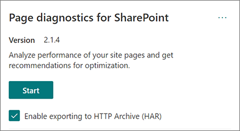
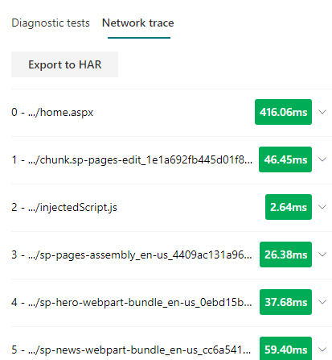

# Verwenden des Tools "Seitendiagnose für SharePoint"

In diesem Artikel wird beschrieben, wie Sie das Tool Seitendiagnose **für SharePoint** verwenden, um moderne und klassische SharePoint Online-Websiteseiten anhand einer vordefinierten Reihe von Leistungskriterien zu analysieren.

Das Tool Seitendiagnose für SharePoint kann installiert werden für:

- **Microsoft Edge** [(Edge-Erweiterung)](https://microsoftedge.microsoft.com/addons/detail/ocemkolpnamjcacndljdfmhlpcaoipji)
- **Chrome** [(Chrome-Erweiterung)](https://chrome.google.com/webstore/detail/inahogkhlkbkjkkaleonemeijihmfagi)

>[!TIP]
>Version **2.0.0** und höher umfasst neben klassischen Websiteseiten auch Unterstützung für moderne Seiten. Wenn Sie sich nicht sicher sind, welche Version des Tools Sie verwenden, können Sie den Link **Informationen** oder die Ellipsen (...) auswählen, um Ihre Version zu überprüfen. **Aktualisieren Sie immer auf die neueste Version,** wenn Sie das Tool verwenden.

Das Tool "Seitendiagnose für SharePoint" ist eine Browsererweiterung für den neuen Microsoft Edge (https://www.microsoft.com/edge) und Chrome, mit denen Sie SharePoint Online-Seiten sowohl in modernen Portal- als auch in klassischen Veröffentlichungs-Websites analysieren können. Dieses Tool funktioniert nur für SharePoint Online und kann nicht auf einer SharePoint-Systemseite verwendet werden.

Das Tool generiert einen Bericht für jede analysierte Seite, in dem gezeigt wird, wie die Seite mit einem vordefinierten Satz von Regeln arbeitet, und zeigt detaillierte Informationen an, wenn ergebnisse für einen Test außerhalb des Basiswerts fallen. SharePoint Online-Administratoren und Designer können das Tool verwenden, um Leistungsprobleme zu beheben und sicherzustellen, dass neue Seiten vor der Veröffentlichung optimiert werden.

Das Tool Seitendiagnose ist nur für die Analyse von SharePoint-Websiteseiten konzipiert, nicht für Systemseiten wie *allitems.aspx* oder *sharepoint.aspx*. Wenn Sie versuchen, das Tool auf einer Systemseite oder einer anderen Nicht-Website-Seite ausführen, wird eine Fehlermeldung angezeigt, dass das Tool für diesen Seitentyp nicht ausgeführt werden kann.

> [!div class="mx-imgBorder"]
> 

Dies ist kein Fehler im Tool, da es keinen Wert für die Bewertung von Bibliotheken oder Systemseiten gibt. Navigieren Sie zu einer SharePoint-Websiteseite, um das Tool zu verwenden. Wenn dieser Fehler auf einer #A0 auftritt, überprüfen Sie die Masterseite, um sicherzustellen, dass die #A1 nicht entfernt wurden.

Um Feedback zum Tool zu geben, wählen Sie die Auslassungspunkte in der oberen rechten Ecke des Tools aus, und wählen Sie [dann Feedback geben aus.](https://go.microsoft.com/fwlink/?linkid=874109)

> [!div class="mx-imgBorder"]
> 
  
## Installieren des Tools "Seitendiagnose für SharePoint"

Das Installationsverfahren in diesem Abschnitt funktioniert sowohl für chrome als auch für Microsoft Edge-Browser.

> [!IMPORTANT]
> Microsoft liest keine Daten oder Seiteninhalte, die vom Tool Seitendiagnose für SharePoint analysiert werden, und wir erfassen keine persönlichen Informationen, Websites oder Downloadinformationen. Die einzigen identifizierbaren Informationen, die von dem Tool bei Microsoft protokolliert werden, sind der Name des Mandanten, die Anzahl der fehlgeschlagenen Regeln und das Datum und die Uhrzeit, zu der das Tool ausgeführt wurde. Diese Informationen werden von Microsoft verwendet, um moderne Portal- und Veröffentlichungstrends und allgemeine Leistungsprobleme besser zu verstehen.

1. Installieren Sie das Tool Seitendiagnose für SharePoint für **Microsoft Edge** [(Edgeerweiterung)](https://microsoftedge.microsoft.com/addons/detail/ocemkolpnamjcacndljdfmhlpcaoipji) oder **Chrome** [(Chrome-Erweiterung).](https://chrome.google.com/webstore/detail/inahogkhlkbkjkkaleonemeijihmfagi) Lesen Sie die Auf der Beschreibungsseite im Store bereitgestellte Benutzerdatenschutzrichtlinie. Beim Hinzufügen des Tools zu Ihrem Browser wird der folgende Berechtigungsbemerkung angezeigt.

    > [!div class="mx-imgBorder"]
    > 

    Dieser Hinweis ist verfügbar, da eine Seite abhängig von den Webparts und Anpassungen auf der Seite Inhalte von Orten außerhalb von SharePoint enthalten kann. Dies bedeutet, dass das Tool die Anforderungen und Antworten liest, wenn auf die Startschaltfläche geklickt wird, und nur für die aktive SharePoint-Registerkarte, auf der das Tool ausgeführt wird. Diese Informationen werden lokal vom Webbrowser erfasst und stehen Ihnen über die Schaltfläche **Export to JSON** oder **Export to HAR** auf der Registerkarte Netzwerkverfolgung des Tools zur Verfügung. Die Informationen werden nicht an Microsoft gesendet oder  **erfasst.** (Das Tool respektiert die hier zugängliche [Microsoft-Datenschutzrichtlinie.)](https://go.microsoft.com/fwlink/p/?linkid=857875)

    Die _Berechtigung Zum Verwalten Ihrer Downloads_ umfasst die Verwendung der Export to **JSON-Funktionalität** des Tools. Bitte befolgen Sie die eigenen Datenschutzrichtlinien Ihres Unternehmens, bevor Sie die JSON-Datei außerhalb Ihrer Organisation freigeben, da die Ergebnisse URLs enthalten und als PII (Personenbezogene Informationen) klassifiziert werden können.
1. Wenn Sie das Tool im Incognito- oder InPrivate-Modus verwenden möchten, führen Sie das Verfahren für Ihren Browser aus:
    1. Navigieren Sie in Microsoft Edge zu **Erweiterungen,** oder geben _Edge://extensions_ in der URL-Leiste ein, und wählen Sie **Details** für die Erweiterung aus. Aktivieren Sie in den Erweiterungseinstellungen das Kontrollkästchen zulassen **in InPrivate**.
    1. Navigieren Sie in Chrome zu **Erweiterungen,** oder geben Chrome://extensions in der _URL-Leiste_ ein, und wählen Sie **Details** für die Erweiterung aus. Wählen Sie in den Erweiterungseinstellungen den Schieberegler für **zulassen in Incognito aus.**
1. Navigieren Sie zu der SharePoint-Websiteseite in SharePoint Online, die Sie überprüfen möchten. Wir haben das "verzögerte Laden" von Elementen auf Seiten zugelassen. daher wird das Tool nicht automatisch beendet (dies ist so, dass es für alle Seitenladeszenarien entwickelt wurde). Um die Auflistung zu beenden, wählen Sie **Beenden aus.** Stellen Sie sicher, dass die Seitenlast abgeschlossen ist, bevor Sie die Datensammlung beenden oder nur eine teilseitige Ablaufverfolgung erfassen.
1. Klicken Sie auf die Symbolleistenschaltfläche der Erweiterung  um das Tool zu laden, und ihnen wird das folgende Erweiterungspopupfenster angezeigt:

    

Wählen **Sie Start** aus, um mit dem Sammeln von Daten für die Analyse zu beginnen.

## Informationen im Tool "Seitendiagnose für SharePoint"

1. Klicken Sie auf die Ellipsen (...) in der oberen rechten Ecke des Tools, um die folgenden Links zu finden:
   1. Der **Link Zusätzliche Ressourcen** enthält allgemeine Anleitungen und Details zum Tool, einschließlich eines Links zurück zu diesem Artikel.
   1. Der **Link Feedback geben** stellt einen Link zur _SharePoint-Website für Websites und Benutzerstimmen für die_ Zusammenarbeit zur Verfügung.
   1. Der **Link Informationen** enthält die aktuell installierte Version des Tools und einen direkten Link zum Hinweis eines Drittanbieters des Tools.  
1. Die **Korrelations-ID, SPRequestDuration, SPIISLatency,** **Seitenladezeit** und **URL-Details** sind informationell und können für einige Zwecke verwendet werden.

    > [!div class="mx-imgBorder"]
    > 

   - **CorrelationID** ist ein wichtiges Element bei der Arbeit mit dem Microsoft Support, da es ihnen ermöglicht, zusätzliche Diagnosedaten für die spezifische Seite zu sammeln.
   - **SPRequestDuration** ist die Zeit, die SharePoint zum Verarbeiten der Seite verwendet. Strukturnavigation, große Bilder, viele API-Aufrufe könnten zu längeren Daueren beitragen.
   - **SPIISLatency** ist die Zeit in Millisekunden, die für SharePoint Online mit dem Laden der Seite verwendet wird. Dieser Wert enthält nicht die Zeit, die die Webanwendung für die Antwort braucht.
   - **Seitenladezeit** ist die Gesamtzeit, die von der Seite zwischen dem Zeitpunkt der Anforderung und dem Zeitpunkt aufgezeichnet wird, zu dem die Antwort im Browser empfangen und gerendert wurde. Dieser Wert wird durch eine Vielzahl von Faktoren beeinflusst, z. B. die Netzwerklatenz, die Leistung des Computers und die Zeit, die der Browser zum Laden der Seite benötigt.
   - Die **Seiten-URL** (Uniform Resource Locator) ist die Webadresse der aktuellen Seite.

1. Auf [**der Registerkarte**](#how-to-use-the-diagnostic-tests-tab) Diagnosetests werden die Analyseergebnisse in drei Kategorien angezeigt. **Keine Aktion erforderlich,** **Verbesserungsmöglichkeiten** und **Aufmerksamkeit erforderlich.** Jedes Testergebnis wird durch ein Element in einer dieser Kategorien dargestellt, wie in der folgenden Tabelle beschrieben:

    |Kategorie  |Farbe  |Beschreibung  |
    |---------|---------|---------|
    |**Aufmerksamkeit erforderlich** |Rot |Das Testergebnis liegt außerhalb des Basiswerts und hat Auswirkungen auf die Seitenleistung. Befolgen Sie die Anleitungen zur Korrektur.|
    |**Verbesserungsmöglichkeiten** |Gelb |Das Testergebnis liegt außerhalb des Basiswerts und kann zu Leistungsproblemen beitragen. Möglicherweise gelten testspezifische Kriterien.|
    |**Keine Aktion erforderlich** |Grün |Das Testergebnis liegt innerhalb des Basiswerts des Tests.|

    > [!div class="mx-imgBorder"]
    > 

1. Eine [**Registerkarte Netzwerkverfolgung**](#how-to-use-the-network-trace-tab-and-how-to-export-a-har-file) enthält Details zu Seitenaufbauanforderungen und -antworten.

## Verwenden der Registerkarte Diagnosetests

Wenn Sie eine moderne SharePoint-Portalseite oder klassische Veröffentlichungswebsiteseite mit dem Tool Seitendiagnose für SharePoint analysieren, werden die  Ergebnisse mithilfe vordefinierter Regeln analysiert, die Ergebnisse mit Basiswerten vergleichen und auf der Registerkarte Diagnosetests angezeigt werden. Regeln für bestimmte Tests können unterschiedliche Basiswerte für moderne Portal- und klassische Veröffentlichungswebsites verwenden, je nachdem, wie sich die spezifischen Leistungsmerkmale zwischen den beiden unterscheiden.

Testergebnisse, die  in den  Kategorien Verbesserungschancen oder Erforderliche Aufmerksamkeit angezeigt werden, zeigen Bereiche an, die mit empfohlenen Methoden überprüft werden sollten, und können ausgewählt werden, um zusätzliche Informationen zum Ergebnis anzuzeigen. Zu den Details für jedes Element gehört ein _Link Weitere_ Informationen, der Sie direkt zu den entsprechenden Anleitungen im Zusammenhang mit dem Test enthält. Testergebnisse, die in der Kategorie Keine **Aktion erforderlich** angezeigt werden, weisen auf die Einhaltung der relevanten Regel hin und zeigen bei Auswahl keine weiteren Details an.

Die Informationen auf der Registerkarte Diagnosetests enthalten keine Informationen zum Entwerfen von Seiten, aber sie zeigen Faktoren auf, die sich auf die Seitenleistung auswirken können. Einige Seitenfunktionen und Anpassungen haben unvermeidbare Auswirkungen auf die Seitenleistung und sollten auf mögliche Korrekturen oder Auslassungen auf der Seite überprüft werden, wenn deren Auswirkungen erheblich sind.

Rote oder gelbe Ergebnisse können auch webparts angeben, die Daten zu häufig aktualisieren. Beispielsweise werden Unternehmensnachrichten nicht jede Sekunde aktualisiert, aber benutzerdefinierte Webparts werden häufig so erstellt, dass sie alle Sekunden die neuesten Nachrichten abrufen, anstatt Zwischenspeicherungselemente zu implementieren, die die Allgemeine Benutzererfahrung verbessern könnten. Beachten Sie beim Hinzufügen von Webparts auf einer Seite, dass es häufig einfache Möglichkeiten gibt, ihre Leistungsauswirkungen zu reduzieren, indem Sie den Wert der einzelnen verfügbaren Parameter auswerten, um sicherzustellen, dass sie für den vorgesehenen Zweck festgelegt ist.

>[!NOTE]
>Klassische Teamwebsites, für die das Veröffentlichungsfeature nicht aktiviert ist, können keine CDNs verwenden. Wenn Sie das Tool auf diesen Websites ausführen, wird erwartet, dass der CDN-Test fehlschlägt und ignoriert werden kann, aber alle verbleibenden Tests sind anwendbar. Die zusätzliche Funktionalität des SharePoint-Veröffentlichungsfeatures kann die Ladezeiten der Seiten erhöhen, daher sollte es nicht nur aktiviert werden, um die CDN-Funktionalität zu ermöglichen.

>[!IMPORTANT]
>Testregeln werden regelmäßig hinzugefügt und aktualisiert. Weitere Informationen zu aktuellen Regeln und spezifischen Informationen in den Testergebnissen finden Sie in der neuesten Version des Tools. Sie können die Version überprüfen, indem Sie Ihre Erweiterungen verwalten, und die Erweiterung gibt an, ob ein Update verfügbar ist.

## Verwenden der Registerkarte Netzwerkverfolgung und Exportieren einer HAR-Datei

Auf **der Registerkarte Netzwerkverfolgung** finden Sie detaillierte Informationen zu den Anforderungen zum Erstellen der Seite und zu den antworten, die von SharePoint empfangen wurden.

1. **Suchen Sie nach Den Ladezeiten für Elemente, die als rot gekennzeichnet sind.** Jede Anforderung und Antwort wird farblich codiert, um anhand der folgenden Latenzmetriken ihre Auswirkung auf die Gesamtseitenleistung anzugeben:
    - Grün: \< 500 ms
    - Gelb: 500-1000 ms
    - Rot: \> 1000 ms

    > [!div class="mx-imgBorder"]
    > 

    In der obigen Abbildung bezieht sich das rote Element auf die Standardseite. Es wird immer Rot angezeigt, es sei denn, die Seite wird in \< 1000 ms geladen (weniger als 1 Sekunde).

2. **Testelementladezeiten**. In einigen Fällen gibt es keine Zeit- oder Farbanzeige, da die Elemente bereits vom Browser zwischengespeichert wurden. Um dies ordnungsgemäß zu testen, öffnen Sie die Seite, löschen Sie den Browsercache, und klicken Sie dann auf **Start,** da dadurch ein "kalter" Seitenladedienst und eine echte Spiegelung der anfänglichen Seitenlast durchgeführt wird. Dies sollte dann mit der "warm"-Seitenlast verglichen werden, da dadurch auch bestimmt werden kann, welche Elemente auf der Seite zwischengespeichert werden.

3. **Teilen Sie relevante Details mit anderen Personen, die bei der Untersuchung von Problemen helfen können.** Um die im Tool bereitgestellten Details oder Informationen mit Ihren Entwicklern oder einem technischen Support zu teilen, wird die Verwendung des Tools **Export in HTTP Archive aktivieren empfohlen.** 

   > [!div class="mx-imgBorder"]
   > 

Dies sollte vor dem Klicken auf Start aktiviert werden, wodurch der Debugmodus in Ihrem Browser aktiviert wird. Es wird eine HTTP-Archivdatei (HTTP Archive File, HAR) generiert, auf die dann über die Registerkarte "Netzwerkverfolgung" zugegriffen werden kann. Klicken Sie auf "Export to HAR", und die Datei wird auf Ihren Computer heruntergeladen, und Sie können sie dann entsprechend freigeben. Die Datei kann in einer Vielzahl von Debugtools wie F12 Developer Tools und Fiddler geöffnet werden.

> [!div class="mx-imgBorder"]
> 

> [!IMPORTANT]
> Diese Ergebnisse enthalten URLs, die als PII (Personenbezogene Informationen) klassifiziert werden können. Achten Sie darauf, die Richtlinien Ihrer Organisation zu befolgen, bevor Sie diese Informationen verteilen.

## Interaktion mit dem Microsoft-Support

Wir haben ein **Feature auf Microsoft-Supportebene enthalten,** das nur verwendet werden sollte, wenn Sie direkt an einem Supportfall arbeiten. Die Verwendung dieses Features bietet keinen Nutzen für Sie, wenn sie ohne Supportteam-Engagement verwendet wird, und kann die Leistung der Seite erheblich verlangsamen. Es gibt keine zusätzlichen Informationen, wenn Sie dieses Feature im Tool verwenden, da die zusätzlichen Informationen zur Protokollierung im Dienst hinzugefügt werden.

Es ist keine Änderung sichtbar, es sei denn, Sie werden benachrichtigt, dass Sie sie aktiviert haben und die Seitenleistung um das 2-3-fache verringert wird, während sie aktiviert ist. Dies ist nur für die jeweilige Seite und die aktive Sitzung relevant. Aus diesem Grund sollte dies sparsam und nur bei aktiver Unterstützung verwendet werden.

### So aktivieren Sie das Feature auf Microsoft Supportebene

1. Öffnen Sie das Tool Seitendiagnose für SharePoint.
2. Drücken Sie auf der Tastatur **ALT-Shift-L**. Dadurch wird das **Kontrollkästchen Unterstützungsprotokollierung** aktivieren angezeigt.
3. Aktivieren Sie das Kontrollkästchen, und klicken Sie dann auf **Start,** um die Seite neu zu laden und eine ausführliche Protokollierung zu generieren.

   > [!div class="mx-imgBorder"]
   > 
  
    Notieren Sie sich die CorrelationID (die oben im Tool angezeigt wird), und stellen Sie sie Ihrem Supportmitarbeiter zur Verfügung, damit er zusätzliche Informationen zur Diagnosesitzung sammeln kann.

## Verwandte Themen

[Optimieren der Leistung von SharePoint Online](tune-sharepoint-online-performance.md)

[Optimieren der Leistung von Office 365](tune-microsoft-365-performance.md)

[Leistung in der modernen SharePoint-Oberfläche](/sharepoint/modern-experience-performance)

[Netzwerke für die Inhaltsübermittlung](content-delivery-networks.md)

[Verwenden des Office 365 Content Delivery Network (CDN) mit SharePoint Online](use-microsoft-365-cdn-with-spo.md)