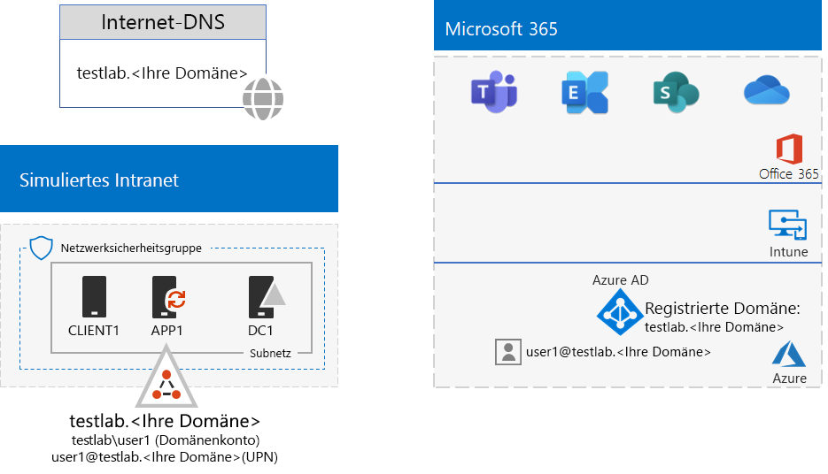
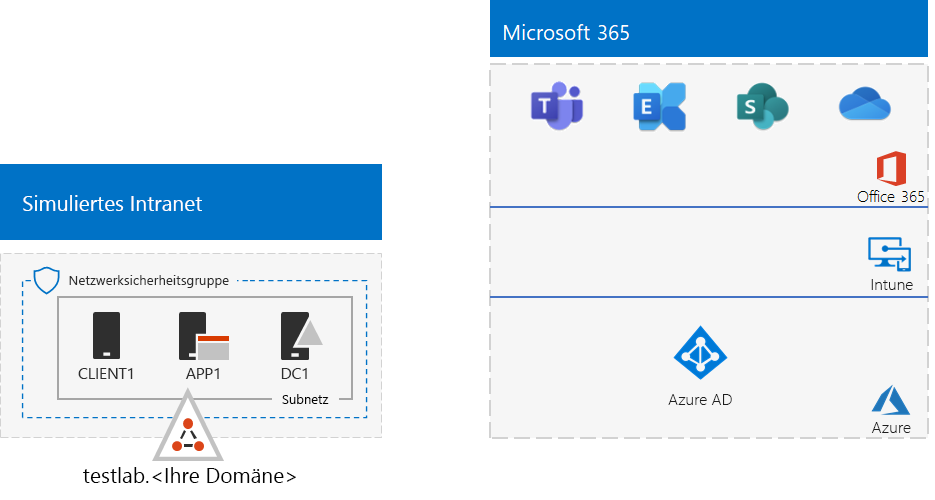

# <a name="password-hash-synchronization-for-your-microsoft-365-test-environment"></a><span data-ttu-id="0815e-103">Kennworthashsynchronisierung für Ihre Microsoft 365-Testumgebung</span><span class="sxs-lookup"><span data-stu-id="0815e-103">Password hash synchronization for your Microsoft 365 test environment</span></span>

<span data-ttu-id="0815e-104">*Diese Testumgebungsanleitung kann für Microsoft 365 Enterprise- und Office 365 Enterprise-Testumgebungen verwendet werden.*</span><span class="sxs-lookup"><span data-stu-id="0815e-104">*This Test Lab Guide can be used for both Microsoft 365 Enterprise and Office 365 Enterprise test environments.*</span></span>

<span data-ttu-id="0815e-105">Viele Organisationen verwenden Azure AD Connect und die Kennwort-Hash-Synchronisierung, um die Gruppe von Konten in ihrer lokalen Active Directory Domain Services(AD DS)-Gesamtstruktur mit den Konten im Azure AD-Mandanten ihrer Microsoft 365- oder Office 365 E5-Abonnements zu synchronisieren.</span><span class="sxs-lookup"><span data-stu-id="0815e-105">Many organizations use Azure AD Connect and password hash synchronization to synchronize the set of accounts in their on-premises Active Directory Domain Services (AD DS) forest to the set of accounts in the Azure AD tenant of their Microsoft 365 or Office 365 subscription.</span></span> <span data-ttu-id="0815e-106">In diesem Artikel wird beschrieben, wie Sie Kennwort-Hash-Synchronisierung in der Microsoft 365-Testumgebung hinzufügen können, woraus die folgende Konfiguration resultiert:</span><span class="sxs-lookup"><span data-stu-id="0815e-106">This article describes how you can add password hash synchronization to your Microsoft 365 test environment, resulting in the following configuration:</span></span>
  

  
<span data-ttu-id="0815e-108">Es gibt zwei Hauptphasen bei der Einrichtung dieser Testumgebung:</span><span class="sxs-lookup"><span data-stu-id="0815e-108">There are two phases to setting up this test environment:</span></span>
  
1. <span data-ttu-id="0815e-109">Erstellen der simulierten Microsoft 365-Testumgebung.</span><span class="sxs-lookup"><span data-stu-id="0815e-109">Create the Microsoft 365 simulated enterprise test environment.</span></span>
2. <span data-ttu-id="0815e-110">Installieren und Konfigurieren von Azure AD Connect auf APP1.</span><span class="sxs-lookup"><span data-stu-id="0815e-110">Install and configure Azure AD Connect on APP1.</span></span>
    
> [!TIP]
> <span data-ttu-id="0815e-111">Klicken Sie [hier](../media/m365-enterprise-test-lab-guides/Microsoft365EnterpriseTLGStack.pdf), um eine visuelle Darstellung aller Artikel im Stapel der Testumgebungsanleitungen in Microsoft 365 Enterprise zu erhalten.</span><span class="sxs-lookup"><span data-stu-id="0815e-111">Click [here](../media/m365-enterprise-test-lab-guides/Microsoft365EnterpriseTLGStack.pdf) for a visual map to all the articles in the Microsoft 365 Enterprise Test Lab Guide stack.</span></span>
  
## <a name="phase-1-create-the-microsoft-365-simulated-enterprise-test-environment"></a><span data-ttu-id="0815e-112">Phase 1: Erstellen der simulierten Microsoft 365-Unternehmenstestumgebung</span><span class="sxs-lookup"><span data-stu-id="0815e-112">Phase 1: Create the Microsoft 365 simulated enterprise test environment</span></span>

<span data-ttu-id="0815e-p102">Befolgen Sie die Anweisungen in der [simulierten Unternehmensstandardkonfiguration für Microsoft 365](simulated-ent-base-configuration-microsoft-365-enterprise.md). Damit wird die Konfiguration unten implementiert.</span><span class="sxs-lookup"><span data-stu-id="0815e-p102">Follow the instructions in [simulated enterprise base configuration for Microsoft 365](simulated-ent-base-configuration-microsoft-365-enterprise.md). Here is your resulting configuration.</span></span>
  

  
<span data-ttu-id="0815e-116">Diese Konfiguration besteht aus: </span><span class="sxs-lookup"><span data-stu-id="0815e-116">This configuration consists of:</span></span> 
  
- <span data-ttu-id="0815e-117">Testversion oder ein kostenpflichtiges Abonnement für Microsoft 365 E5 oder Office 365 E5.</span><span class="sxs-lookup"><span data-stu-id="0815e-117">Microsoft 365 E5 or Office 365 E5 trial or paid subscriptions.</span></span>
- <span data-ttu-id="0815e-118">Einem vereinfachtem Unternehmensintranet mit Internetzugriff, das aus virtuellen DC1-, APP1- und CLIENT1-Computern in einem virtuellen Azure-Netzwerk besteht.</span><span class="sxs-lookup"><span data-stu-id="0815e-118">A simplified organization intranet connected to the Internet, consisting of the DC1, APP1, and CLIENT1 virtual machines in an Azure virtual network.</span></span> <span data-ttu-id="0815e-119">DC1 ist ein Domänencontroller für die AD DS-Domäne testlab.\<Name Ihrer öffentlichen Domäne>.</span><span class="sxs-lookup"><span data-stu-id="0815e-119">DC1 is a domain controller for the testlab.\<your public domain name> AD DS domain.</span></span>

## <a name="phase-2-create-and-register-the-testlab-domain"></a><span data-ttu-id="0815e-120">Phase 2: Erstellen und Registrieren der TestLab-Domäne</span><span class="sxs-lookup"><span data-stu-id="0815e-120">Phase 2: Create and register the testlab domain</span></span>

<span data-ttu-id="0815e-121">In dieser Phase fügen Sie eine öffentliche DNS-Domäne zu Ihrem Abonnement hinzu.</span><span class="sxs-lookup"><span data-stu-id="0815e-121">In this phase you add a public DNS domain and add it to your subscription.</span></span>

<span data-ttu-id="0815e-p104">Als erstes arbeiten Sie mit Ihrem öffentlichen DNS-Registrierungsanbieter, um einen neuen öffentlichen DNS-Domänennamen basierend auf Ihrem aktuellen Domänennamen zu erstellen, und fügen diesen Ihrem Abonnement hinzu. Es wird empfohlen, dass Sie den Namen "**testlab.**\<Ihre öffentliche Domäne>" verwenden. Wenn der Name Ihrer öffentliche Domänen beispielsweise "**<span>contoso</span>.com**" ist, fügen Sie den öffentlichen Domänennamen "**<span>testlab</span>.contoso.com**" hinzu.</span><span class="sxs-lookup"><span data-stu-id="0815e-p104">First, work with your public DNS registration provider to create a new public DNS domain name based on your current domain name and add it to your subscription. We recommend using the name **testlab.**\<your public domain>. For example, if your public domain name is **<span>contoso</span>.com**, add the public domain name **<span>testlab</span>.contoso.com**.</span></span>
  
<span data-ttu-id="0815e-125">Als Nächstes fügen Sie die Domäne **testlab.**\<Ihre öffentliche Domäne> zu Ihrer Microsoft 365- oder Office 365-Testversion oder Ihrem bezahlten Abonnement hinzu, indem Sie den Domänenregistrierungsprozess durchlaufen.</span><span class="sxs-lookup"><span data-stu-id="0815e-125">Next, you add the **testlab.**\<your public domain> domain to your Microsoft 365 or Office 365 trial or paid subscription by going through the domain registration process.</span></span> <span data-ttu-id="0815e-126">Dies umfasst das Hinzufügen von zusätzlichen DNS-Einträgen zur Domäne **testlab.** \<Ihre öffentliche Domäne>.</span><span class="sxs-lookup"><span data-stu-id="0815e-126">This consists of adding additional DNS records to the **testlab.**\<your public domain> domain.</span></span> <span data-ttu-id="0815e-127">Weitere Informationen finden Sie unter [Hinzufügen einer Domäne zu Office 365](https://docs.microsoft.com/office365/admin/setup/add-domain).</span><span class="sxs-lookup"><span data-stu-id="0815e-127">For more information, see [Add a domain to Office 365](https://docs.microsoft.com/office365/admin/setup/add-domain).</span></span> 

<span data-ttu-id="0815e-128">Nachfolgend sehen Sie die daraus resultierende Konfiguration.</span><span class="sxs-lookup"><span data-stu-id="0815e-128">Here is your resulting configuration.</span></span>
  

  
<span data-ttu-id="0815e-130">Diese Konfiguration besteht aus: </span><span class="sxs-lookup"><span data-stu-id="0815e-130">This configuration consists of:</span></span>

- <span data-ttu-id="0815e-131">Testversionen oder kostenpflichtige Abonnements von Microsoft 365 E5 oder Office 365 E5 mit der registrieren DNS-Domäne testlab.\<Name Ihrer öffentlichen Domäne>.</span><span class="sxs-lookup"><span data-stu-id="0815e-131">Microsoft 365 E5 or Office 365 E5 trial or paid subscriptions with the DNS domain testlab.\<your public domain name> registered.</span></span>
- <span data-ttu-id="0815e-132">Einem vereinfachtem Unternehmensintranet mit Internetzugriff, das aus virtuellen DC1-, APP1- und CLIENT1-Computern in einem Subnetz eines virtuellen Azure-Netzwerks besteht.</span><span class="sxs-lookup"><span data-stu-id="0815e-132">A simplified organization intranet connected to the Internet, consisting of the DC1, APP1, and CLIENT1 virtual machines on a subnet of an Azure virtual network.</span></span>

<span data-ttu-id="0815e-133">Für „testlab.\<Name Ihrer öffentlichen Domäne>“ gilt jetzt Folgendes:</span><span class="sxs-lookup"><span data-stu-id="0815e-133">Notice how the testlab.\<your public domain name> is now:</span></span>

- <span data-ttu-id="0815e-134">Die Domäne wird von öffentlichen DNS-Datensätzen unterstützt.</span><span class="sxs-lookup"><span data-stu-id="0815e-134">Supported by public DNS records.</span></span>
- <span data-ttu-id="0815e-135">In Ihren Microsoft 365- oder Office 365-Abonnements registriert.</span><span class="sxs-lookup"><span data-stu-id="0815e-135">Registered in your Microsoft 365 or Office 365 subscriptions.</span></span>
- <span data-ttu-id="0815e-136">Die Domäne ist die AD DS-Domäne in Ihrem simulierten Intranet.</span><span class="sxs-lookup"><span data-stu-id="0815e-136">The AD DS domain on your simulated intranet.</span></span>
     
## <a name="phase-3-install-azure-ad-connect-on-app1"></a><span data-ttu-id="0815e-137">Phase 3: Installieren von Azure AD Connect auf APP1</span><span class="sxs-lookup"><span data-stu-id="0815e-137">Phase 3: Install Azure AD Connect on APP1</span></span>

<span data-ttu-id="0815e-138">In dieser Phase installieren und konfigurieren Sie das Azure AD Connect-Tool auf APP1 und vergewissern sich, dass es funktioniert.</span><span class="sxs-lookup"><span data-stu-id="0815e-138">In this phase, you install and configure the Azure AD Connect tool on APP1, and then verify that it works.</span></span>
  
<span data-ttu-id="0815e-139">Installieren Sie zunächst Azure AD Connect auf APP1 und konfigurieren Sie es.</span><span class="sxs-lookup"><span data-stu-id="0815e-139">First, you install and configure Azure AD Connect on APP1.</span></span>

1. <span data-ttu-id="0815e-140">Melden Sie sich über das [Azure-Portal](https://portal.azure.com) mit Ihrem globalen Administratorkonto an, und stellen Sie dann mit dem Konto „TESTLAB\\Benutzer1“ eine Verbindung zu APP1 her.</span><span class="sxs-lookup"><span data-stu-id="0815e-140">From the [Azure portal](https://portal.azure.com), sign in with your global administrator account, and then connect to APP1 with the TESTLAB\\User1 account.</span></span>
    
2. <span data-ttu-id="0815e-141">Öffnen Sie über den Desktop auf APP1 eine Windows PowerShell-Eingabeaufforderung mit Administratorrechten, und führen Sie die folgenden Befehle aus:</span><span class="sxs-lookup"><span data-stu-id="0815e-141">From the desktop of APP1, open an administrator-level Windows PowerShell command prompt, and then run these commands:</span></span>
    
   ```powershell
   Set-ItemProperty -Path "HKLM:\SOFTWARE\Microsoft\Active Setup\Installed Components\{A509B1A7-37EF-4b3f-8CFC-4F3A74704073}" -Name "IsInstalled" -Value 0
   Set-ItemProperty -Path "HKLM:\SOFTWARE\Microsoft\Active Setup\Installed Components\{A509B1A8-37EF-4b3f-8CFC-4F3A74704073}" -Name "IsInstalled" -Value 0
   Stop-Process -Name Explorer -Force
   ```

3. <span data-ttu-id="0815e-142">Klicken Sie auf der Taskleiste auf **Internet Explorer**, und wechseln Sie zu [https://aka.ms/aadconnect](https://aka.ms/aadconnect).</span><span class="sxs-lookup"><span data-stu-id="0815e-142">From the task bar, click **Internet Explorer** and go to [https://aka.ms/aadconnect](https://aka.ms/aadconnect).</span></span>
    
4. <span data-ttu-id="0815e-143">Klicken Sie auf der Seite „Microsoft Azure Active Directory Connect“ auf **Herunterladen** und dann auf **Ausführen**.</span><span class="sxs-lookup"><span data-stu-id="0815e-143">On the Microsoft Azure Active Directory Connect page, click **Download**, and then click **Run**.</span></span>
    
5. <span data-ttu-id="0815e-144">Klicken Sie auf der Seite **Willkommen bei Azure AD Connect** auf **Ich stimme zu** und dann auf **Weiter**.</span><span class="sxs-lookup"><span data-stu-id="0815e-144">On the **Welcome to Azure AD Connect** page, click **I agree**, and then click **Continue**.</span></span>
    
6. <span data-ttu-id="0815e-145">Klicken Sie auf der Seite **Express-Einstellungen** auf **Express-Einstellungen verwenden**.</span><span class="sxs-lookup"><span data-stu-id="0815e-145">On the **Express Settings** page, click **Use express settings**.</span></span>
    
7. <span data-ttu-id="0815e-146">Geben Sie auf der Seite **Mit Azure AD verbinden** unter **Benutzername** den Namen Ihres globalen Administratorkontos und unter **Kennwort** das zugehörige Kennwort ein. Klicken Sie dann auf **Weiter**.</span><span class="sxs-lookup"><span data-stu-id="0815e-146">On the **Connect to Azure AD** page, type your global administrator account name in **Username,** type its password in **Password**, and then click **Next**.</span></span>
    
8. <span data-ttu-id="0815e-147">Geben Sie auf der Seite **Mit AD DS verbinden** den Namen **TESTLAB\\Benutzer1** unter **Benutzername** und das zugehörige Kennwort unter **Kennwort** ein. Klicken Sie dann auf **Weiter**.</span><span class="sxs-lookup"><span data-stu-id="0815e-147">On the **Connect to AD DS** page, type **TESTLAB\\User1** in **Username,** type its password in **Password**, and then click **Next**.</span></span>
    
9. <span data-ttu-id="0815e-148">Klicken Sie auf der Seite **Bereit zur Konfiguration** auf **Installieren**.</span><span class="sxs-lookup"><span data-stu-id="0815e-148">On the **Ready to configure** page, click **Install**.</span></span>
    
10. <span data-ttu-id="0815e-149">Klicken Sie auf der Seite **Konfiguration abgeschlossen** auf **Beenden**.</span><span class="sxs-lookup"><span data-stu-id="0815e-149">On the **Configuration complete** page, click **Exit**.</span></span>
    
11. <span data-ttu-id="0815e-150">Wechseln Sie im Internet Explorer zum Microsoft 365 Admin Center ([https://portal.microsoft.com](https://portal.microsoft.com)).</span><span class="sxs-lookup"><span data-stu-id="0815e-150">In Internet Explorer, go to the Microsoft 365 admin center ([https://portal.microsoft.com](https://portal.microsoft.com)).</span></span>
    
12. <span data-ttu-id="0815e-151">Klicken Sie im linken Navigationsbereich auf **Benutzer > Aktive Benutzer**.</span><span class="sxs-lookup"><span data-stu-id="0815e-151">In the left navigation, click **Users > Active users**.</span></span>
    
    <span data-ttu-id="0815e-152">Sie sehen das Konto **Benutzer 1**.</span><span class="sxs-lookup"><span data-stu-id="0815e-152">Note the account named **User1**.</span></span> <span data-ttu-id="0815e-153">Dieses Konto gehört zur AD DS-Domäne „TESTLAB“. Dass es angezeigt wird, belegt, dass die Verzeichnissynchronisierung erfolgreich war.</span><span class="sxs-lookup"><span data-stu-id="0815e-153">This account is from the TESTLAB AD DS domain and is proof that directory synchronization has worked.</span></span>
    
13. <span data-ttu-id="0815e-154">Klicken Sie auf das **User1**-Konto und dann auf **Lizenzen und Apps**.</span><span class="sxs-lookup"><span data-stu-id="0815e-154">Click the **User1** account, and then click **Licenses and apps**.</span></span>
    
14. <span data-ttu-id="0815e-155">Wählen Sie in **Produktlizenzen** Ihren Standort aus (sofern erforderlich), deaktivieren Sie die **Office 365 E5**-Lizenz, und aktivieren Sie die **Microsoft 365 E5**-Lizenz.</span><span class="sxs-lookup"><span data-stu-id="0815e-155">In **Product licenses**, select your location (if needed), disable the **Office 365 E5** license and enable the **Microsoft 365 E5** license.</span></span> 

15. <span data-ttu-id="0815e-156">Klicken Sie unten auf der Seite auf **Speichern** und dann auf **Schließen**.</span><span class="sxs-lookup"><span data-stu-id="0815e-156">Click **Save** at the bottom of the page, and then click **Close**.</span></span>
    
<span data-ttu-id="0815e-157">Als Nächstes testen Sie, ob Sie sich mit dem Benutzernamen "<strong>user1@testlab.</strong>\<Name Ihrer öffentlichen Domäne>" des Kontos "User1" bei Ihrem Abonnement anmelden können.</span><span class="sxs-lookup"><span data-stu-id="0815e-157">Next, you test the ability to sign in to your subscription with the <strong>user1@testlab.</strong>\<your domain name> user name of the User1 account.</span></span>

1. <span data-ttu-id="0815e-158">Melden Sie sich über APP1 ab, und melden Sie sich dann erneut an. Geben Sie dieses Mal ein anderes Konto an.</span><span class="sxs-lookup"><span data-stu-id="0815e-158">From APP1, sign out, and then sign in again, this time specifying a different account.</span></span>

2. <span data-ttu-id="0815e-p107">Wenn Sie aufgefordert werden, einen Benutzernamen und ein Kennwort anzugeben: Geben Sie „<strong>user1@testlab.</strong>\<Name Ihrer öffentlichen Domäne>“ und das Kennwort für „Benutzer1“ an. Sie sollten sich erfolgreich als „Benutzer1“ anmelden können.</span><span class="sxs-lookup"><span data-stu-id="0815e-p107">When prompted for a user name and password, specify <strong>user1@testlab.</strong>\<your domain name> and the User1 password. You should successfully sign in as User1.</span></span> 
 
<span data-ttu-id="0815e-161">Beachten Sie, dass "User1" zwar über Administratorberechtigungen für die AD DS-Domäne TESTLAB verfügt, er aber kein globaler Administrator ist.</span><span class="sxs-lookup"><span data-stu-id="0815e-161">Notice that although User1 has domain administrator permissions for the TESTLAB AD DS domain, it is not a global administrator.</span></span> <span data-ttu-id="0815e-162">Daher wird das Symbol **Admin** nicht als Option angezeigt.</span><span class="sxs-lookup"><span data-stu-id="0815e-162">Therefore, you will not see the **Admin** icon as an option.</span></span> 

<span data-ttu-id="0815e-163">Nachfolgend sehen Sie die daraus resultierende Konfiguration.</span><span class="sxs-lookup"><span data-stu-id="0815e-163">Here is your resulting configuration.</span></span>


<span data-ttu-id="0815e-165">Diese Konfiguration besteht aus: </span><span class="sxs-lookup"><span data-stu-id="0815e-165">This configuration consists of:</span></span> 
  
- <span data-ttu-id="0815e-166">Testversionen oder kostenpflichtigen Abonnements von Microsoft 365 E5 oder Office 365 E5 mit der registrieren DNS-Domäne „TESTLAB.\<Ihr Domänenname>.</span><span class="sxs-lookup"><span data-stu-id="0815e-166">Microsoft 365 E5 or Office 365 E5 trial or paid subscriptions with the DNS domain TESTLAB.\<your domain name> registered.</span></span>
- <span data-ttu-id="0815e-167">Einem vereinfachtem Unternehmensintranet mit Internetzugriff, das aus virtuellen DC1-, APP1- und CLIENT1-Computern in einem Subnetz eines virtuellen Azure-Netzwerks besteht.</span><span class="sxs-lookup"><span data-stu-id="0815e-167">A simplified organization intranet connected to the Internet, consisting of the DC1, APP1, and CLIENT1 virtual machines on a subnet of an Azure virtual network.</span></span> <span data-ttu-id="0815e-168">Azure AD Connect wird auf APP1 ausgeführt, um die AD DS-Domäne "TESTLAB" mit dem Azure AD-Mandanten Ihrer Microsoft 365- oder Office 365 E5-Abonnements regelmäßig zu synchronisieren.</span><span class="sxs-lookup"><span data-stu-id="0815e-168">Azure AD Connect runs on APP1 to synchronize the TESTLAB AD DS domain to the Azure AD tenant of your Microsoft 365 or Office 365 subscription periodically.</span></span>
- <span data-ttu-id="0815e-169">Das Konto „Benutzer 1“ in der AD DS-Domäne „TESTLAB“ wurde mit dem Azure AD-Mandanten synchronisiert.</span><span class="sxs-lookup"><span data-stu-id="0815e-169">The User1 account in the TESTLAB  AD DS domain has been synchronized with the Azure AD tenant.</span></span>

## <a name="next-step"></a><span data-ttu-id="0815e-170">Nächster Schritt</span><span class="sxs-lookup"><span data-stu-id="0815e-170">Next step</span></span>

<span data-ttu-id="0815e-171">Sehen Sie sich weitere [Identitäts](m365-enterprise-test-lab-guides.md#identity)features und- funktionen in Ihrer Testumgebung an.</span><span class="sxs-lookup"><span data-stu-id="0815e-171">Explore additional [identity](m365-enterprise-test-lab-guides.md#identity) features and capabilities in your test environment.</span></span>

## <a name="see-also"></a><span data-ttu-id="0815e-172">Siehe auch</span><span class="sxs-lookup"><span data-stu-id="0815e-172">See also</span></span>

[<span data-ttu-id="0815e-173">Testumgebungsanleitungen für Microsoft 365 Enterprise</span><span class="sxs-lookup"><span data-stu-id="0815e-173">Microsoft 365 Enterprise Test Lab Guides</span></span>](m365-enterprise-test-lab-guides.md)

[<span data-ttu-id="0815e-174">Bereitstellen von Microsoft 365 Enterprise</span><span class="sxs-lookup"><span data-stu-id="0815e-174">Deploy Microsoft 365 Enterprise</span></span>](deploy-microsoft-365-enterprise.md)

[<span data-ttu-id="0815e-175">Dokumentation zu Microsoft 365 Enterprise</span><span class="sxs-lookup"><span data-stu-id="0815e-175">Microsoft 365 Enterprise documentation</span></span>](https://docs.microsoft.com/microsoft-365-enterprise/)


