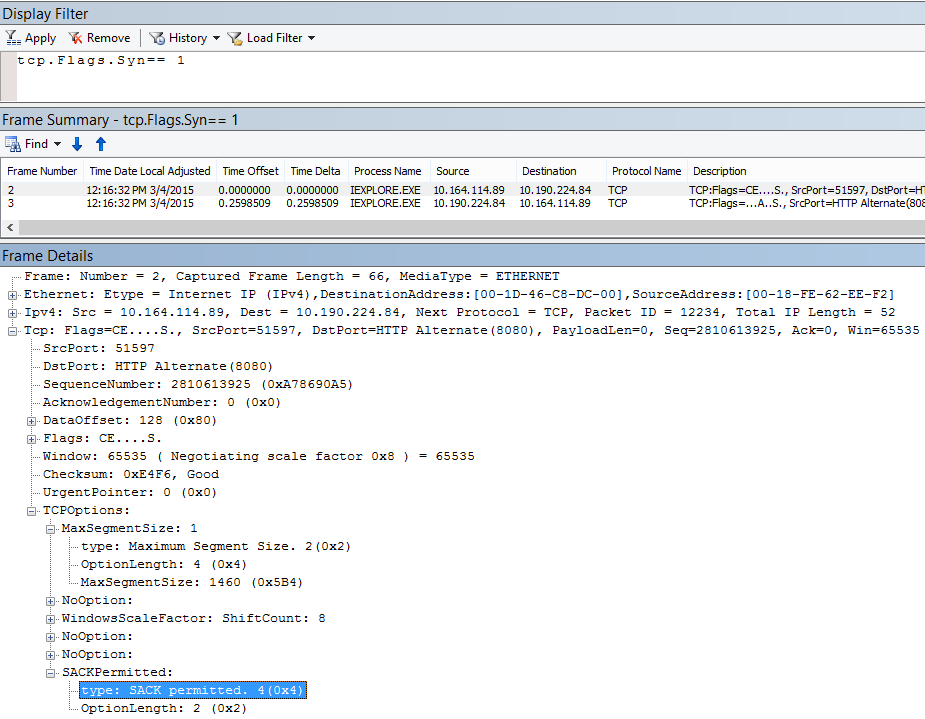

# <a name="performance-troubleshooting-plan-for-office-365"></a><span data-ttu-id="35176-103">Behandlung von Leistungsproblemen – Plan für Office 365</span><span class="sxs-lookup"><span data-stu-id="35176-103">Performance troubleshooting plan for Office 365</span></span>

<span data-ttu-id="35176-104">Müssen Sie wissen, welche Schritte unternommen werden müssen, um Verzögerungen, Hänge und Leistungsverzögerungen zwischen SharePoint Online, OneDrive for Business, Exchange Online oder Skype for Business Online und Ihrem Clientcomputer zu identifizieren und zu beheben?</span><span class="sxs-lookup"><span data-stu-id="35176-104">Do you need to know the steps to take to identify and fix lags, hangs, and slow performance between SharePoint Online, OneDrive for Business, Exchange Online, or Skype for Business Online, and your client computer?</span></span> <span data-ttu-id="35176-105">Bevor Sie den Support aufrufen, können Sie in diesem Artikel Probleme mit der Office 365-Leistung beheben und sogar einige der häufigsten Probleme beheben.</span><span class="sxs-lookup"><span data-stu-id="35176-105">Before you call support, this article can help you troubleshoot Office 365 performance issues and even fix some of the most common issues.</span></span>

<span data-ttu-id="35176-106">Dieser Artikel ist eigentlich ein Beispielaktionsplan, mit dem Sie wertvolle Daten zu Ihrem Leistungsproblem erfassen können.</span><span class="sxs-lookup"><span data-stu-id="35176-106">This article is actually a sample action plan that you can use to capture valuable data about your performance issue as it's happening.</span></span> <span data-ttu-id="35176-107">Einige wichtige Probleme sind auch in diesem Artikel enthalten.</span><span class="sxs-lookup"><span data-stu-id="35176-107">Some top issues are also included in this article.</span></span>

<span data-ttu-id="35176-108">Wenn Sie mit der Netzwerkleistung neu sind und einen langfristigen Plan zur Überwachung der Leistung zwischen Ihren Clientcomputern und Office 365 erstellen möchten, sehen Sie sich [Office 365](performance-tuning-using-baselines-and-history.md)Performance Tuning and Troubleshooting – Admin und IT Pro an.</span><span class="sxs-lookup"><span data-stu-id="35176-108">If you're new to network performance and want to make a long term plan to monitor performance between your client machines and Office 365, take a look at [Office 365 performance tuning and troubleshooting - Admin and IT Pro](performance-tuning-using-baselines-and-history.md).</span></span>

## <a name="sample-performance-troubleshooting-action-plan"></a><span data-ttu-id="35176-109">Beispiel für einen Aktionsplan zur Problembehandlung bei der Leistungsbehandlung</span><span class="sxs-lookup"><span data-stu-id="35176-109">Sample performance troubleshooting action plan</span></span>

<span data-ttu-id="35176-110">Dieser Aktionsplan enthält zwei Teile: Vorbereitungsphase und Protokollierungsphase.</span><span class="sxs-lookup"><span data-stu-id="35176-110">This action plan contains two parts; a preparation phase, and a logging phase.</span></span> <span data-ttu-id="35176-111">Wenn Sie derzeit ein Leistungsproblem haben und datensammlungen müssen, können Sie sofort mit der Verwendung dieses Plans beginnen.</span><span class="sxs-lookup"><span data-stu-id="35176-111">If you have a performance problem right now, and you need to do data collection, you can start using this plan right away.</span></span>

### <a name="prepare-the-client-computer"></a><span data-ttu-id="35176-112">Vorbereiten des Clientcomputers</span><span class="sxs-lookup"><span data-stu-id="35176-112">Prepare the client computer</span></span>

- <span data-ttu-id="35176-113">Suchen Sie einen Clientcomputer, der das Leistungsproblem reproduzieren kann.</span><span class="sxs-lookup"><span data-stu-id="35176-113">Find a client computer that can reproduce the performance problem.</span></span> <span data-ttu-id="35176-114">Dieser Computer wird während der Problembehandlung verwendet.</span><span class="sxs-lookup"><span data-stu-id="35176-114">This computer will be used during the course of troubleshooting.</span></span>
- <span data-ttu-id="35176-115">Notieren Sie sich die Schritte, die das Leistungsproblem verursachen, damit Sie zum Testen bereit sind.</span><span class="sxs-lookup"><span data-stu-id="35176-115">Write down the steps that cause the performance problem to happen so you're ready when it comes time to test.</span></span>
- <span data-ttu-id="35176-116">Installieren von Tools zum Sammeln und Aufzeichnen von Informationen:</span><span class="sxs-lookup"><span data-stu-id="35176-116">Install tools for gathering and recording information:</span></span>
  - <span data-ttu-id="35176-117">Installieren [Sie Netmon 3.4 (oder](https://www.microsoft.com/download/details.aspx?id=4865) verwenden Sie ein entsprechendes Netzwerkablaufverfolgungstool).</span><span class="sxs-lookup"><span data-stu-id="35176-117">Install [Netmon 3.4](https://www.microsoft.com/download/details.aspx?id=4865) (or use an equivalent network tracing tool).</span></span>
  - <span data-ttu-id="35176-118">Installieren Sie die kostenlose Basic Edition von [HTTPWatch](https://www.httpwatch.com/download/) (oder verwenden Sie ein entsprechendes Tool zur Netzwerkablaufverfolgung).</span><span class="sxs-lookup"><span data-stu-id="35176-118">Install the free Basic Edition of [HTTPWatch](https://www.httpwatch.com/download/) (or use an equivalent network Tracing tool).</span></span>
  - <span data-ttu-id="35176-119">Verwenden Sie eine Bildschirmaufzeichnung, oder führen Sie die Steps Recorder (PSR.exe) aus, die mit Windows Vista und höher kommt, um eine Aufzeichnung der Schritte zu erhalten, die Sie während der Tests ausführen.</span><span class="sxs-lookup"><span data-stu-id="35176-119">Use a screen recorder or run the Steps Recorder (PSR.exe) that comes with Windows Vista and later, in order to keep a record of the steps you take during testing.</span></span>

### <a name="log-the-performance-issue"></a><span data-ttu-id="35176-120">Protokollieren des Leistungsproblems</span><span class="sxs-lookup"><span data-stu-id="35176-120">Log the performance issue</span></span>

- <span data-ttu-id="35176-121">Schließen Sie alle außerirdischen Internetbrowser.</span><span class="sxs-lookup"><span data-stu-id="35176-121">Close all extraneous Internet browsers.</span></span>
- <span data-ttu-id="35176-122">Starten Sie die Schrittaufzeichnung oder eine andere Bildschirmaufzeichnung.</span><span class="sxs-lookup"><span data-stu-id="35176-122">Start the Steps Recorder, or another screen recorder.</span></span>
- <span data-ttu-id="35176-123">Starten Sie Ihre Netmon-Erfassung (oder das Netzwerkablaufverfolgungstool).</span><span class="sxs-lookup"><span data-stu-id="35176-123">Start your Netmon capture (or network tracing tool).</span></span>
- <span data-ttu-id="35176-124">Löschen Sie den DNS-Cache auf dem Clientcomputer über die Befehlszeile, indem Sie ipconfig /flushdns eingeben.</span><span class="sxs-lookup"><span data-stu-id="35176-124">Clear your DNS cache on the client computer from the command line by typing ipconfig /flushdns.</span></span>
- <span data-ttu-id="35176-125">Starten Sie eine neue Browsersitzung, und aktivieren Sie HTTPWatch.</span><span class="sxs-lookup"><span data-stu-id="35176-125">Start a new browser session and turn on HTTPWatch.</span></span>
- <span data-ttu-id="35176-126">Optional: Wenn Sie Exchange Online testen, führen Sie das Exchange Client Performance Analyzer-Tool in der Office 365-Verwaltungskonsole aus.</span><span class="sxs-lookup"><span data-stu-id="35176-126">Optional: If you are testing Exchange Online, run the Exchange Client Performance Analyzer tool from the Office 365 admin console.</span></span>
- <span data-ttu-id="35176-127">Reproduzieren Sie die genauen Schritte, die das Leistungsproblem verursachen.</span><span class="sxs-lookup"><span data-stu-id="35176-127">Reproduce the exact steps that cause the performance issue.</span></span>
- <span data-ttu-id="35176-128">Beenden Sie die Ablaufverfolgung Ihres Netmon oder eines anderen Tools.</span><span class="sxs-lookup"><span data-stu-id="35176-128">Stop your Netmon or other tool's trace.</span></span>
- <span data-ttu-id="35176-129">Führen Sie an der Befehlszeile eine Ablaufverfolgungsroute zu Ihrem Office 365-Abonnement aus, indem Sie den folgenden Befehl eingeben und dann die EINGABETASTE drücken:</span><span class="sxs-lookup"><span data-stu-id="35176-129">At the command line, run a trace route to your Office 365 subscription by typing the following command and then pressing ENTER:</span></span>

  ``` cmd
  tracert <subscriptionname>.onmicrosoft.com
  ```

- <span data-ttu-id="35176-130">Beenden Sie die Schrittaufzeichnung, und speichern Sie das Video.</span><span class="sxs-lookup"><span data-stu-id="35176-130">Stop the Steps Recorder and save the video.</span></span> <span data-ttu-id="35176-131">Achten Sie darauf, das Datum und die Uhrzeit der Aufnahme und ob eine gute oder schlechte Leistung gezeigt wird.</span><span class="sxs-lookup"><span data-stu-id="35176-131">Be sure to include the date and time of the capture and whether it demonstrates good or bad performance.</span></span>
- <span data-ttu-id="35176-132">Speichern Sie die Ablaufverfolgungsdateien.</span><span class="sxs-lookup"><span data-stu-id="35176-132">Save the trace files.</span></span> <span data-ttu-id="35176-133">Achten Sie auch hier darauf, datums- und uhrzeitgemäß zu erfassen und zu prüfen, ob eine gute oder eine schlechte Leistung gezeigt wird.</span><span class="sxs-lookup"><span data-stu-id="35176-133">Again, be sure to include the date and time of the capture and whether it demonstrates good or bad performance.</span></span>

<span data-ttu-id="35176-134">Wenn Sie nicht mit der Ausführung der in diesem Artikel erwähnten Tools vertraut sind, machen Sie sich keine Sorgen, da wir diese Schritte als Nächstes bereitstellen.</span><span class="sxs-lookup"><span data-stu-id="35176-134">If you're not familiar with running the tools mentioned in this article, don't worry because we provide those steps next.</span></span> <span data-ttu-id="35176-135">Wenn Sie diese Art der Netzwerkerfassung gewohnt sind, können Sie mit [How to collect baselines](performance-tuning-using-baselines-and-history.md#how-to-collect-baselines)(Sammeln von Basiswerten) überspringen, in dem das Filtern und Lesen der Protokolle beschrieben wird.</span><span class="sxs-lookup"><span data-stu-id="35176-135">If you're accustomed to doing this kind of network capturing, you can skip to [How to collect baselines](performance-tuning-using-baselines-and-history.md#how-to-collect-baselines), which describes filtering and reading the logs.</span></span>

### <a name="flush-the-dns-cache-first"></a><span data-ttu-id="35176-136">Löschen des DNS-Caches zuerst</span><span class="sxs-lookup"><span data-stu-id="35176-136">Flush the DNS Cache first</span></span>

<span data-ttu-id="35176-137">Warum?</span><span class="sxs-lookup"><span data-stu-id="35176-137">Why?</span></span> <span data-ttu-id="35176-138">Wenn Sie den DNS-Cache leeren, starten Sie die Tests mit einem neuen Schiefer.</span><span class="sxs-lookup"><span data-stu-id="35176-138">By flushing out the DNS cache you're starting your tests with a clean slate.</span></span> <span data-ttu-id="35176-139">Durch Löschen des Caches können Sie den Inhalt des DNS-Resolvers auf die neuesten Einträge zurücksetzen.</span><span class="sxs-lookup"><span data-stu-id="35176-139">By clearing the cache, you're resetting the DNS resolver contents to the most up-to-date entries.</span></span> <span data-ttu-id="35176-140">Denken Sie daran, dass durch eine Leerung keine EINTRÄGE der HOSTs-Datei entfernt werden.</span><span class="sxs-lookup"><span data-stu-id="35176-140">Remember that a flush does not remove HOSTs file entries.</span></span> <span data-ttu-id="35176-141">Wenn Sie HOST-Dateieinträge umfassend verwenden, sollten Sie diese Einträge in eine Datei in einem anderen Verzeichnis kopieren und dann die HOST-Datei leeren.</span><span class="sxs-lookup"><span data-stu-id="35176-141">If you use HOST file entries extensively, you should copy those entries out to a file in another directory and then empty the HOST file.</span></span>

#### <a name="flush-your-dns-resolver-cache"></a><span data-ttu-id="35176-142">Leeren des DNS-Resolvercaches</span><span class="sxs-lookup"><span data-stu-id="35176-142">Flush your DNS resolver cache</span></span>

1. <span data-ttu-id="35176-143">Öffnen Sie die Eingabeaufforderung **(start** \> **Run** \> **cmd** oder **Windows key** \> **cmd**).</span><span class="sxs-lookup"><span data-stu-id="35176-143">Open the command prompt, (either **Start** \> **Run** \> **cmd** or **Windows key** \> **cmd**).</span></span>
2. <span data-ttu-id="35176-144">Geben Sie den folgenden Befehl ein, und drücken Sie die EINGABETASTE:</span><span class="sxs-lookup"><span data-stu-id="35176-144">Type the following command and press ENTER:</span></span>

    ``` cmd
    ipconfig /flushdns
    ```

## <a name="netmon"></a><span data-ttu-id="35176-145">Netmon</span><span class="sxs-lookup"><span data-stu-id="35176-145">Netmon</span></span>

<span data-ttu-id="35176-146">Das Netzwerküberwachungstool von Microsoft ([Netmon](https://www.microsoft.com/download/details.aspx?id=4865)) analysiert Pakete, d. h. Datenverkehr, der zwischen Computern in Netzwerken verläuft.</span><span class="sxs-lookup"><span data-stu-id="35176-146">Microsoft's Network Monitoring tool ([Netmon](https://www.microsoft.com/download/details.aspx?id=4865)) analyzes packets, that is traffic, that passes between computers on networks.</span></span> <span data-ttu-id="35176-147">Mithilfe von Netmon können Sie Datenverkehr mit Office 365 erfassen, anzeigen und lesen, dazwischenliegende Geräte identifizieren, wichtige Einstellungen auf der Netzwerkhardware überprüfen, nach verworfenen Paketen suchen und den Datenverkehr zwischen Computern in Ihrem Unternehmensnetzwerk und Office 365 verfolgen.</span><span class="sxs-lookup"><span data-stu-id="35176-147">By using Netmon to trace traffic with Office 365 you can capture, view, and read packet headers, identify intervening devices, check important settings on network hardware, look for dropped packets, and follow the flow of traffic between computers on your corporate network and Office 365.</span></span> <span data-ttu-id="35176-148">Da der tatsächliche Textkörper des Datenverkehrs verschlüsselt ist, d. h. er (wird über SSL/TLS über Port 443 übertragen), können Sie die gesendeten Dateien nicht lesen.</span><span class="sxs-lookup"><span data-stu-id="35176-148">Because the actual body of the traffic is encrypted, that is, it(travels on port 443 via SSL/TLS, you can't read the files being sent.</span></span> <span data-ttu-id="35176-149">Stattdessen erhalten Sie eine ungefilterte Ablaufverfolgung des Pfads, den das Paket einnimmt, mit dem Sie das Problemverhalten nachverfolgen können.</span><span class="sxs-lookup"><span data-stu-id="35176-149">Instead, you get an unfiltered trace of the path that the packet takes which can help you track down the problem behavior.</span></span>

<span data-ttu-id="35176-150">Stellen Sie sicher, dass Sie derzeit keinen Filter anwenden.</span><span class="sxs-lookup"><span data-stu-id="35176-150">Be sure you don't apply a filter at this time.</span></span> <span data-ttu-id="35176-151">Führen Sie stattdessen die Schritte durch, und demonstrieren Sie das Problem, bevor Sie die Ablaufverfolgung beenden und speichern.</span><span class="sxs-lookup"><span data-stu-id="35176-151">Instead, run through the steps and demonstrate the problem before stopping the trace and saving.</span></span>

<span data-ttu-id="35176-152">Öffnen Sie nach der Installation von Netmon 3.4 das Tool, und ergreifen Sie die folgenden Schritte:</span><span class="sxs-lookup"><span data-stu-id="35176-152">After you install Netmon 3.4, open the tool and take these steps:</span></span>

### <a name="take-a-netmon-trace-and-reproduce-the-issue"></a><span data-ttu-id="35176-153">Nehmen Sie eine Netmon-Ablaufverfolgung vor, und reproduzieren Sie das Problem.</span><span class="sxs-lookup"><span data-stu-id="35176-153">Take a Netmon trace and reproduce the issue</span></span>

1. <span data-ttu-id="35176-154">Starten Sie Netmon 3.4.</span><span class="sxs-lookup"><span data-stu-id="35176-154">Launch Netmon 3.4.</span></span>
<span data-ttu-id="35176-155">Die Startseite enthält drei  Bereiche: **Zuletzt** erfasste Erfassungen, **Netzwerke** auswählen und erste Schritte mit Microsoft Network **Monitor 3.4. Hinweis**.</span><span class="sxs-lookup"><span data-stu-id="35176-155">There are three panes on the **Start** page: **Recent Captures**, **Select Networks**, and the **Getting Started with Microsoft Network Monitor 3.4. Notice**.</span></span> <span data-ttu-id="35176-156">Im Bereich Netzwerke auswählen erhalten Sie außerdem eine Liste der Standardnetzwerke, aus denen Sie erfassen können.</span><span class="sxs-lookup"><span data-stu-id="35176-156">The Select Networks panel will also give you a list of the default networks from which you can capture.</span></span> <span data-ttu-id="35176-157">Stellen Sie sicher, dass hier Netzwerkkarten ausgewählt sind.</span><span class="sxs-lookup"><span data-stu-id="35176-157">Be sure that network cards are selected here.</span></span>

2. <span data-ttu-id="35176-158">Klicken **Sie oben** auf der Startseite auf Neue **Aufnahme.**</span><span class="sxs-lookup"><span data-stu-id="35176-158">Click **New Capture** at the top of the **Start** page.</span></span> <span data-ttu-id="35176-159">Dadurch wird neben der Registerkarte Startseite eine **neue** Registerkarte mit dem Namen **Capture 1 hinzufügt.**</span><span class="sxs-lookup"><span data-stu-id="35176-159">This adds a new tab beside the **Start** page tab called **Capture 1**.</span></span>
<span data-ttu-id="35176-160"></span><span class="sxs-lookup"><span data-stu-id="35176-160"></span></span>

3. <span data-ttu-id="35176-161">Klicken Sie auf der Symbolleiste auf **Start,** um eine einfache Aufnahme zu erstellen.</span><span class="sxs-lookup"><span data-stu-id="35176-161">To take a simple capture, click **Start** on the toolbar.</span></span>

4. <span data-ttu-id="35176-162">Reproduzieren Sie die Schritte, die ein Leistungsproblem stellen.</span><span class="sxs-lookup"><span data-stu-id="35176-162">Reproduce the steps that present a performance issue.</span></span>

5. <span data-ttu-id="35176-163">Klicken **Sie auf Datei** \> **speichern** unter \> **beenden.**</span><span class="sxs-lookup"><span data-stu-id="35176-163">Click **Stop** \> **File** \> **Save As**.</span></span> <span data-ttu-id="35176-164">Denken Sie daran, Datum und Uhrzeit mit der Zeitzone zu geben und zu erwähnen, ob sie eine schlechte oder gute Leistung zeigt.</span><span class="sxs-lookup"><span data-stu-id="35176-164">Remember to give the date and time with the time zone and to mention if it demonstrates bad or good performance.</span></span>

## <a name="httpwatch"></a><span data-ttu-id="35176-165">HTTPWatch</span><span class="sxs-lookup"><span data-stu-id="35176-165">HTTPWatch</span></span>

<span data-ttu-id="35176-166">[HTTPWatch](https://www.httpwatch.com/download/) ist kostenpflichtig und eine kostenlose Edition.</span><span class="sxs-lookup"><span data-stu-id="35176-166">[HTTPWatch](https://www.httpwatch.com/download/) comes in charged, and a free edition.</span></span> <span data-ttu-id="35176-167">Die kostenlose Basic Edition deckt alles ab, was Sie für diesen Test benötigen.</span><span class="sxs-lookup"><span data-stu-id="35176-167">The free Basic Edition covers everything you need for this test.</span></span> <span data-ttu-id="35176-168">HTTPWatch überwacht den Netzwerkdatenverkehr und die Ladezeit der Seite direkt aus dem Browserfenster.</span><span class="sxs-lookup"><span data-stu-id="35176-168">HTTPWatch monitors network traffic and page load time right from your browser window.</span></span> <span data-ttu-id="35176-169">HTTPWatch ist ein Plug-In in Internet Explorer, das die Leistung grafisch beschreibt.</span><span class="sxs-lookup"><span data-stu-id="35176-169">HTTPWatch is a plug-in to Internet Explorer that graphically describes performance.</span></span> <span data-ttu-id="35176-170">Die Analyse kann in HTTPWatch Studio gespeichert und angezeigt werden.</span><span class="sxs-lookup"><span data-stu-id="35176-170">The analysis can be saved and viewed in HTTPWatch Studio.</span></span>

> [!NOTE]
> <span data-ttu-id="35176-171">Wenn Sie einen anderen Browser wie Firefox, Google Chrome oder httpWatch in Internet Explorer nicht installieren können, öffnen Sie ein neues Browserfenster, und drücken Sie F12 auf der Tastatur.</span><span class="sxs-lookup"><span data-stu-id="35176-171">If you use another browser, such as Firefox, Google Chrome, or if you can't install HTTPWatch in Internet Explorer, open a new browser window and press F12 on your keyboard.</span></span> <span data-ttu-id="35176-172">Das Popup des Entwicklertools sollte unten im Browser angezeigt werden.</span><span class="sxs-lookup"><span data-stu-id="35176-172">You should see the Developer Tool pop-up at the bottom of your browser.</span></span> <span data-ttu-id="35176-173">Wenn Sie Opera verwenden, drücken Sie STRG+UMSCHALT+I für Web Inspector, klicken Sie dann auf die Registerkarte Netzwerk, und führen Sie die unten beschriebenen Tests aus. </span><span class="sxs-lookup"><span data-stu-id="35176-173">If you use Opera, press CTRL+SHIFT+I for Web Inspector, then click the **Network** tab and complete the testing outlined below.</span></span> <span data-ttu-id="35176-174">Die Informationen unterscheiden sich geringfügig, die Ladezeiten werden jedoch weiterhin in Millisekunden angezeigt.</span><span class="sxs-lookup"><span data-stu-id="35176-174">The information will be slightly different, but load times will still be displayed in milliseconds.</span></span> <span data-ttu-id="35176-175">> HTTPWatch ist auch bei Problemen mit den Ladezeiten von SharePoint Online-Seiten sehr hilfreich.</span><span class="sxs-lookup"><span data-stu-id="35176-175">> HTTPWatch is also very useful for issues with SharePoint Online page load times.</span></span>

### <a name="run-httpwatch-and-reproduce-the-issue"></a><span data-ttu-id="35176-176">Ausführen von HTTPWatch und Reproduzieren des Problems</span><span class="sxs-lookup"><span data-stu-id="35176-176">Run HTTPWatch and reproduce the issue</span></span>

<span data-ttu-id="35176-177">HTTPWatch ist ein Browser-Plug-In, daher ist das Verfügbar machen des Tools im Browser etwas anders für jede Version von Internet Explorer.</span><span class="sxs-lookup"><span data-stu-id="35176-177">HTTPWatch is a browser plug-in, so exposing the tool in the browser is slightly different for each version of Internet Explorer.</span></span> <span data-ttu-id="35176-178">In der Regel finden Sie HTTPWatch unter der Befehlsleiste im Internet Explorer-Browser.</span><span class="sxs-lookup"><span data-stu-id="35176-178">Typically, you can find HTTPWatch under the Commands bar in the Internet Explorer browser.</span></span> <span data-ttu-id="35176-179">Wenn das HTTPWatch-Plug-In in Ihrem Browserfenster nicht angezeigt wird, überprüfen  Sie die Version Ihres Browsers, indem Sie auf Hilfe zu klicken, oder klicken Sie in späteren Versionen von Internet Explorer auf das Zahnradsymbol und \> Auf **Internet Explorer**.</span><span class="sxs-lookup"><span data-stu-id="35176-179">If you don't see the HTTPWatch plug-in in your browser window, check the version of your browser by clicking **Help** \> **About**, or in later versions of Internet Explorer, click the gear symbol and **About Internet Explorer**.</span></span> <span data-ttu-id="35176-180">Klicken Sie zum Starten der **Befehlsleiste** in Internet Explorer mit der rechten Maustaste auf die Menüleiste, und klicken Sie auf **Befehlsleiste**.</span><span class="sxs-lookup"><span data-stu-id="35176-180">To launch the **Commands** bar, right-click the menu bar in Internet Explorer and click **Commands bar**.</span></span>

<span data-ttu-id="35176-181">In der Vergangenheit wurde HTTPWatch sowohl den Befehlen als auch den Explorerleisten zugeordnet, wenn Sie also nach der Installation das Symbol (auch nach dem Neustart) nicht sofort sehen, überprüfen Sie **Extras** und Die Symbolleisten für das Symbol.</span><span class="sxs-lookup"><span data-stu-id="35176-181">In the past, HTTPWatch has been associated with both the Commands and the Explorer bars, so once you install, if you don't immediately see the icon (even after reboot) check **Tools**, and your toolbars for the icon.</span></span> <span data-ttu-id="35176-182">Denken Sie daran, dass Symbolleisten angepasst werden können und Ihnen Optionen hinzugefügt werden können.</span><span class="sxs-lookup"><span data-stu-id="35176-182">Remember that toolbars can be customized and options can be added to them.</span></span>


1. <span data-ttu-id="35176-184">Starten Sie HTTPWatch in einem Internet Explorer-Browserfenster.</span><span class="sxs-lookup"><span data-stu-id="35176-184">Launch HTTPWatch in an Internet Explorer browser window.</span></span> <span data-ttu-id="35176-185">Es wird am unteren Rand dieses Fensters an den Browser angedockt angezeigt.</span><span class="sxs-lookup"><span data-stu-id="35176-185">It will appear docked to the browser at the bottom of that window.</span></span> <span data-ttu-id="35176-186">Klicken Sie **auf Datensatz**.</span><span class="sxs-lookup"><span data-stu-id="35176-186">Click **Record**.</span></span>

2. <span data-ttu-id="35176-187">Reproduzieren Sie die genauen Schritte im Leistungsproblem.</span><span class="sxs-lookup"><span data-stu-id="35176-187">Reproduce the exact steps involved in the performance issue.</span></span> <span data-ttu-id="35176-188">Klicken Sie **in** HTTPWatch auf die Schaltfläche Beenden.</span><span class="sxs-lookup"><span data-stu-id="35176-188">Click the **Stop** button in HTTPWatch.</span></span>

3. <span data-ttu-id="35176-189">**Speichern** Sie httpWatch oder **Send by Email**.</span><span class="sxs-lookup"><span data-stu-id="35176-189">**Save** the HTTPWatch or **Send by Email**.</span></span> <span data-ttu-id="35176-190">Denken Sie daran, die Datei so zu benennen, dass sie Datums- und Uhrzeitinformationen sowie einen Hinweis darauf enthält, ob Ihre Uhr eine Demonstration von guter oder schlechter Leistung enthält.</span><span class="sxs-lookup"><span data-stu-id="35176-190">Remember to name the file so that it includes date and time information and an indication of whether your Watch contains a demonstration of good or bad performance.</span></span>


<span data-ttu-id="35176-192">Dieser Screenshot ist aus der Professional-Version von HTTPWatch.</span><span class="sxs-lookup"><span data-stu-id="35176-192">This screen shot is from the Professional version of HTTPWatch.</span></span> <span data-ttu-id="35176-193">Sie können Ablaufverfolgungen in der Standardversion auf einem Computer mit einer Professional-Version öffnen und dort lesen.</span><span class="sxs-lookup"><span data-stu-id="35176-193">You can open traces taken in the Basic Version on a computer with a Professional version and read it there.</span></span> <span data-ttu-id="35176-194">Zusätzliche Informationen können von der Ablaufverfolgung über diese Methode zur Verfügung stehen.</span><span class="sxs-lookup"><span data-stu-id="35176-194">Extra information may be available from the trace through that method.</span></span>

## <a name="problem-steps-recorder"></a><span data-ttu-id="35176-195">Aufzeichnung von Problemschritten</span><span class="sxs-lookup"><span data-stu-id="35176-195">Problem Steps Recorder</span></span>

<span data-ttu-id="35176-196">Steps Recorder oder PSR.exe ermöglicht es Ihnen, Probleme zu protokollieren, während sie auftreten.</span><span class="sxs-lookup"><span data-stu-id="35176-196">Steps Recorder, or PSR.exe, allows you to record issues as they are occurring.</span></span> <span data-ttu-id="35176-197">Es ist ein sehr nützliches Tool und sehr einfach zu führen.</span><span class="sxs-lookup"><span data-stu-id="35176-197">It's a very useful tool and very simple to run.</span></span>

### <a name="run-problem-steps-recorder-psrexe-to-record-your-work"></a><span data-ttu-id="35176-198">Ausführen der Fehlerschrittaufzeichnung (PSR.exe) zum Aufzeichnen Ihrer Arbeit</span><span class="sxs-lookup"><span data-stu-id="35176-198">Run Problem Steps Recorder (PSR.exe) to record your work</span></span>

1. <span data-ttu-id="35176-199">Verwenden Sie **entweder start** run typePSR.exeOK , oder klicken Sie auf den \>  \>  \>  **Windows** \> Key-PSR.exeund drücken Sie dann die  \> EINGABETASTE.</span><span class="sxs-lookup"><span data-stu-id="35176-199">Either use **Start** \> **Run** \> type **PSR.exe** \> **OK**, or, click the **Windows Key** \> type **PSR.exe** \> and then press ENTER.</span></span>

2. <span data-ttu-id="35176-200">Wenn das kleine PSR.exe angezeigt wird, klicken Sie auf **Datensatz starten,** und reproduzieren Sie die Schritte, die das Leistungsproblem reproduzieren.</span><span class="sxs-lookup"><span data-stu-id="35176-200">When the small PSR.exe window appears, click **Start Record** and reproduce the steps that reproduce the performance issue.</span></span> <span data-ttu-id="35176-201">Sie können Kommentare nach Bedarf hinzufügen, indem Sie auf **Kommentare hinzufügen klicken.**</span><span class="sxs-lookup"><span data-stu-id="35176-201">You can add comments as needed, by clicking **Add Comments**.</span></span>

3. <span data-ttu-id="35176-202">Klicken **Sie auf Datensatz beenden,** wenn Sie die Schritte abgeschlossen haben.</span><span class="sxs-lookup"><span data-stu-id="35176-202">Click **Stop Record** when you have completed the steps.</span></span> <span data-ttu-id="35176-203">Wenn das Leistungsproblem ein Seitenrendering ist, warten Sie, bis die Seite gerendert wird, bevor Sie die Aufzeichnung beenden.</span><span class="sxs-lookup"><span data-stu-id="35176-203">If the performance issue is a page render, wait for the page to render before you stop the recording.</span></span>

4. <span data-ttu-id="35176-204">Klicken Sie auf **Speichern**.</span><span class="sxs-lookup"><span data-stu-id="35176-204">Click **Save**.</span></span>


<span data-ttu-id="35176-206">Datum und Uhrzeit werden für Sie aufgezeichnet.</span><span class="sxs-lookup"><span data-stu-id="35176-206">The date and time is recorded for you.</span></span> <span data-ttu-id="35176-207">Dadurch wird Ihre PSR mit Ihrer Netmon-Ablaufverfolgung und HTTPWatch in der Zeit verknüpft und hilft bei der präzisen Problembehandlung.</span><span class="sxs-lookup"><span data-stu-id="35176-207">This links your PSR to your Netmon trace and HTTPWatch in time, and helps with precision troubleshooting.</span></span> <span data-ttu-id="35176-208">Das Datum und die Uhrzeit im PSR-Eintrag können beispielsweise zeigen, dass eine Minute zwischen der Anmeldung und dem Browsen der URL und dem teilweisen Rendern der Administratorwebsite vergangen ist.</span><span class="sxs-lookup"><span data-stu-id="35176-208">The date and time in the PSR record can show that a minute passed between the login and browsing of the URL and the partial render of the admin site, for example.</span></span>

## <a name="read-your-traces"></a><span data-ttu-id="35176-209">Lesen Der Ablaufverfolgungen</span><span class="sxs-lookup"><span data-stu-id="35176-209">Read your traces</span></span>

<span data-ttu-id="35176-210">Es ist nicht möglich, alles zur Problembehandlung bei Netzwerk und Leistung zu vermitteln, die jemand über einen Artikel wissen müsste.</span><span class="sxs-lookup"><span data-stu-id="35176-210">It isn't possible to teach everything about network and performance troubleshooting that someone would need to know via an article.</span></span> <span data-ttu-id="35176-211">Eine gute Leistung benötigt Erfahrung und Kenntnisse darüber, wie Ihr Netzwerk funktioniert und in der Regel funktioniert.</span><span class="sxs-lookup"><span data-stu-id="35176-211">Getting good at performance takes experience, and knowledge of how your network works and usually performs.</span></span> <span data-ttu-id="35176-212">Es ist jedoch möglich, eine Liste der wichtigsten Probleme zu runden und zu zeigen, wie Tools es Ihnen erleichtern können, die häufigsten Probleme zu beseitigen.</span><span class="sxs-lookup"><span data-stu-id="35176-212">But it is possible to round up a list of top issues and show how tools can make it easier for you to eliminate the most common problems.</span></span>

<span data-ttu-id="35176-213">Wenn Sie Die Netzwerkverfolgungen für Ihre Office 365-Websites lesen möchten, gibt es keinen besseren Lehrer, als regelmäßig Nachverfolgungen von Seitenlasten zu erstellen und Erfahrungen beim Lesen zu sammeln.</span><span class="sxs-lookup"><span data-stu-id="35176-213">If you want to pick up skills reading network traces for your Office 365 sites, there is no better teacher than creating traces of page loads regularly and gaining experience reading them.</span></span> <span data-ttu-id="35176-214">Wenn Sie beispielsweise eine Chance haben, laden Sie einen Office 365-Dienst, und verfolgen Sie den Prozess.</span><span class="sxs-lookup"><span data-stu-id="35176-214">For example, when you have a chance, load an Office 365 service and trace the process.</span></span> <span data-ttu-id="35176-215">Filtern Sie die Ablaufverfolgung nach DNS-Datenverkehr, oder durchsuchen Sie frameData nach dem Namen des Diensts, den Sie durchsucht haben.</span><span class="sxs-lookup"><span data-stu-id="35176-215">Filter the trace for DNS traffic, or search the FrameData for the name of the service you browsed.</span></span> <span data-ttu-id="35176-216">Überprüfen Sie die Ablaufverfolgung, um eine Vorstellung von den Schritten zu erhalten, die beim Laden des Diensts auftreten.</span><span class="sxs-lookup"><span data-stu-id="35176-216">Scan the trace to get an idea of the steps that occur when the service loads.</span></span> <span data-ttu-id="35176-217">Dies hilft Ihnen, zu erfahren, wie normale Seitenlast aussehen sollte, und bei der Problembehandlung, insbesondere bei der Leistung, kann der Vergleich von guten mit schlechten Ablaufverfolgungen Ihnen viel beibringen.</span><span class="sxs-lookup"><span data-stu-id="35176-217">This will help you learn what normal page load should look like, and in the case of troubleshooting, particularly around performance, comparing good to bad traces can teach you a lot.</span></span>

<span data-ttu-id="35176-218">Netmon verwendet Microsoft Intellisense im Feld Anzeigefilter.</span><span class="sxs-lookup"><span data-stu-id="35176-218">Netmon uses Microsoft Intellisense in the Display filter field.</span></span> <span data-ttu-id="35176-219">IntelliSense oder intelligente Codevervollständigung ist dieser Trick, bei dem Sie einen Zeitraum eingeben und alle verfügbaren Optionen in einem Dropdownauswahlfeld angezeigt werden.</span><span class="sxs-lookup"><span data-stu-id="35176-219">Intellisense, or intelligent code completion, is that trick where you type in a period and all available options are displayed in a drop-down selection box.</span></span> <span data-ttu-id="35176-220">Wenn Sie sich beispielsweise Sorgen über die SKALIERUNG von TCP-Fenstern machen, können Sie auf diese Weise den Weg zu einem Filter (z.  `.protocol.tcp.window < 100` B. ) finden.</span><span class="sxs-lookup"><span data-stu-id="35176-220">If, for example, you are worried about TCP window scaling, you can find your way to a filter (such as  `.protocol.tcp.window < 100`) by this means.</span></span>


<span data-ttu-id="35176-222">Netmon-Ablaufverfolgungen können viel Datenverkehr in sich haben.</span><span class="sxs-lookup"><span data-stu-id="35176-222">Netmon traces can have a lot of traffic in them.</span></span> <span data-ttu-id="35176-223">Wenn Sie keine Erfahrung mit dem Lesen haben, ist es wahrscheinlich, dass Sie beim ersten Öffnen der Ablaufverfolgung überfordert sind.</span><span class="sxs-lookup"><span data-stu-id="35176-223">If you aren't experienced with reading them, it's likely you will be overwhelmed opening the trace the first time.</span></span> <span data-ttu-id="35176-224">Als Erstes müssen Sie das Signal vom Hintergrundrauschen in der Ablaufverfolgung trennen.</span><span class="sxs-lookup"><span data-stu-id="35176-224">The first thing to do is separate the signal from the background noise in the trace.</span></span> <span data-ttu-id="35176-225">Sie haben mit Office 365 getestet, und das ist der Datenverkehr, den Sie sehen möchten.</span><span class="sxs-lookup"><span data-stu-id="35176-225">You tested against Office 365, and that's the traffic you want to see.</span></span> <span data-ttu-id="35176-226">Wenn Sie es gewohnt sind, durch Ablaufverfolgungen zu navigieren, benötigen Sie diese Liste möglicherweise nicht.</span><span class="sxs-lookup"><span data-stu-id="35176-226">If you are used to navigating through traces, you may not need this list.</span></span>

<span data-ttu-id="35176-227">Der Datenverkehr zwischen Ihrem Client und Office 365 wird über TLS übertragen, was bedeutet, dass der Datenverkehrskörper verschlüsselt wird und in einer generischen Netmon-Ablaufverfolgung nicht lesbar ist.</span><span class="sxs-lookup"><span data-stu-id="35176-227">Traffic between your client and Office 365 travels via TLS, which means that the body of the traffic will be encrypted and not readable in a generic Netmon trace.</span></span> <span data-ttu-id="35176-228">Ihre Leistungsanalyse muss die Besonderheiten der Informationen im Paket nicht kennen.</span><span class="sxs-lookup"><span data-stu-id="35176-228">Your performance analysis doesn't need to know the specifics of the information in the packet.</span></span> <span data-ttu-id="35176-229">Sie ist jedoch sehr an Paketkopfzeilen und den informationen interessiert, die sie enthalten.</span><span class="sxs-lookup"><span data-stu-id="35176-229">It is, however, very interested in packet headers and the information that they contain.</span></span>

### <a name="tips-to-get-a-good-trace"></a><span data-ttu-id="35176-230">Tipps zum Erhalten einer guten Ablaufverfolgung</span><span class="sxs-lookup"><span data-stu-id="35176-230">Tips to get a good trace</span></span>

- <span data-ttu-id="35176-231">Kennen Sie den Wert der IPv4- oder IPv6-Adresse Ihres Clientcomputers.</span><span class="sxs-lookup"><span data-stu-id="35176-231">Know the value of the IPv4 or IPv6 address of your client computer.</span></span> <span data-ttu-id="35176-232">Sie können dies über die Eingabeaufforderung erhalten, indem Sie **IPConfig eingeben** und dann die EINGABETASTE drücken.</span><span class="sxs-lookup"><span data-stu-id="35176-232">You can get this from the command prompt by typing **IPConfig** and then pressing ENTER.</span></span> <span data-ttu-id="35176-233">Wenn Sie diese Adresse kennen, können Sie auf einen Blick erkennen, ob der Datenverkehr in der Ablaufverfolgung ihren Clientcomputer direkt umfasst.</span><span class="sxs-lookup"><span data-stu-id="35176-233">Knowing this address will let you tell at a glance whether the traffic in the trace directly involves your client computer.</span></span> <span data-ttu-id="35176-234">Wenn ein bekannter Proxy vorkommt, pingen Sie ihn, und erhalten Sie auch seine IP-Adresse.</span><span class="sxs-lookup"><span data-stu-id="35176-234">If there is a known proxy, ping it and get its IP address as well.</span></span>

- <span data-ttu-id="35176-235">Leeren Sie den DNS-Resolvercache, und schließen Sie nach Möglichkeit alle Browser mit Ausnahme des Browsers, in dem Sie die Tests ausführen.</span><span class="sxs-lookup"><span data-stu-id="35176-235">Flush your DNS resolver cache and, if possible, close all browsers except the one in which you are running your tests.</span></span> <span data-ttu-id="35176-236">Wenn Sie dazu nicht in der Lage sind, beispielsweise wenn die Unterstützung ein browserbasiertes Tool zum Anzeigen des Desktops Ihres Clientcomputers verwendet, können Sie die Ablaufverfolgung filtern.</span><span class="sxs-lookup"><span data-stu-id="35176-236">If you are not able to do this, for instance, if support is using some browser-based tool to see your client computer's desktop, be prepared to filter your trace.</span></span>

- <span data-ttu-id="35176-237">Suchen Sie in einer Gebucht-Ablaufverfolgung nach dem office 365-Dienst, den Sie verwenden.</span><span class="sxs-lookup"><span data-stu-id="35176-237">In a busy trace, locate the Office 365 service that you're using.</span></span> <span data-ttu-id="35176-238">Wenn Sie Ihren Datenverkehr noch nie oder selten gesehen haben, ist dies ein hilfreicher Schritt, um das Leistungsproblem von anderen Netzwerkgeräuschen zu trennen.</span><span class="sxs-lookup"><span data-stu-id="35176-238">If you've never or seldom seen your traffic before, this is a helpful step in separating the performance issue from other network noise.</span></span> <span data-ttu-id="35176-239">Es gibt verschiedene Möglichkeiten, dies zu tun.</span><span class="sxs-lookup"><span data-stu-id="35176-239">There are a few ways to do this.</span></span> <span data-ttu-id="35176-240">Direkt vor dem Test können Sie _Ping_ oder _PsPing_ für die URL des bestimmten Diensts verwenden ( oder `ping outlook.office365.com` , `psping -4 microsoft-my.sharepoint.com:443` z. B. ).</span><span class="sxs-lookup"><span data-stu-id="35176-240">Directly before your test, you can use _ping_ or _PsPing_ against the URL of the specific service (`ping outlook.office365.com` or `psping -4 microsoft-my.sharepoint.com:443`, for example).</span></span> <span data-ttu-id="35176-241">Sie können diese Ping- oder PsPing-Datei auch ganz einfach in einer Netmon-Ablaufverfolgung (nach dem Prozessnamen) finden.</span><span class="sxs-lookup"><span data-stu-id="35176-241">You can also easily find that ping or PsPing in a Netmon trace (by its process name).</span></span> <span data-ttu-id="35176-242">Dies gibt Ihnen einen Ort, an dem Sie mit der Suche beginnen können.</span><span class="sxs-lookup"><span data-stu-id="35176-242">That will give you a place to start looking.</span></span>

<span data-ttu-id="35176-243">Wenn Sie zum Zeitpunkt des Problems nur die Netmon-Ablaufverfolgung verwenden, ist dies auch in Ordnung.</span><span class="sxs-lookup"><span data-stu-id="35176-243">If you're only using Netmon tracing at the time of the problem, that's okay too.</span></span> <span data-ttu-id="35176-244">Verwenden Sie einen Filter wie oder, um sich zu `ContainsBin(FrameData, ASCII, "office")` `ContainsBin(FrameData, ASCII, "outlook")` orientieren.</span><span class="sxs-lookup"><span data-stu-id="35176-244">To orient yourself, use a filter like `ContainsBin(FrameData, ASCII, "office")` or `ContainsBin(FrameData, ASCII, "outlook")`.</span></span> <span data-ttu-id="35176-245">Sie können Ihre Framenummer aus der Ablaufverfolgungsdatei aufzeichnen.</span><span class="sxs-lookup"><span data-stu-id="35176-245">You can record your frame number from the trace file.</span></span> <span data-ttu-id="35176-246">Möglicherweise möchten Sie auch den Bildlauf im _Bereich Framezusammenfassung_ ganz nach rechts durchführen und nach der Spalte Unterhaltungs-ID suchen.</span><span class="sxs-lookup"><span data-stu-id="35176-246">You may also want to scroll the _Frame Summary_ pane all the way to the right and look for the Conversation ID column.</span></span> <span data-ttu-id="35176-247">Für die ID dieser bestimmten Unterhaltung ist eine Zahl angegeben, die Sie später auch isoliert aufzeichnen und betrachten können.</span><span class="sxs-lookup"><span data-stu-id="35176-247">There is a number indicated there for the ID of this specific conversation that you can also record and look at in isolation later.</span></span> <span data-ttu-id="35176-248">Denken Sie daran, diesen Filter zu entfernen, bevor Sie eine andere Filterung anwenden.</span><span class="sxs-lookup"><span data-stu-id="35176-248">Remember to remove this filter before applying any other filtering.</span></span>

> [!TIP]
> <span data-ttu-id="35176-249">Netmon verfügt über viele hilfreiche integrierte Filter.</span><span class="sxs-lookup"><span data-stu-id="35176-249">Netmon has a lot of helpful built-in filters.</span></span> <span data-ttu-id="35176-250">Probieren Sie **die Schaltfläche** Ladenfilter oben im _Filterbereich Anzeigen_ aus.</span><span class="sxs-lookup"><span data-stu-id="35176-250">Try the **Load Filter** button at the top of the _Display_ filter pane.</span></span>


<span data-ttu-id="35176-253">Machen Sie sich mit Ihrem Datenverkehr vertraut, und erfahren Sie, wie Sie die benötigten Informationen finden.</span><span class="sxs-lookup"><span data-stu-id="35176-253">Get familiar with your traffic, and learn to locate the information you need.</span></span> <span data-ttu-id="35176-254">Erfahren Sie beispielsweise, welches Paket in der Ablaufverfolgung den ersten Verweis auf den von Ihnen verwendeten Office 365-Dienst (z. B. "Outlook") enthält.</span><span class="sxs-lookup"><span data-stu-id="35176-254">For example, learn to determine which packet in the trace has the first reference to the Office 365 service you're using (like "Outlook").</span></span>

<span data-ttu-id="35176-255">Nehmen wir Office 365 Outlook Online als Beispiel, beginnt der Datenverkehr wie folgt:</span><span class="sxs-lookup"><span data-stu-id="35176-255">Taking Office 365 Outlook Online as an example, the traffic begins something like this:</span></span>

- <span data-ttu-id="35176-256">DNS Standard Query and DNS Response for outlook.office365.com with matching QueryIDs.</span><span class="sxs-lookup"><span data-stu-id="35176-256">DNS Standard Query and DNS Response for outlook.office365.com with matching QueryIDs.</span></span> <span data-ttu-id="35176-257">Es ist wichtig, den Zeitabstand für diese Umdrehung zu beachten, sowie an der Stelle, an der das globale Office 365-DNS die Anforderung zur Namensauflösung sendet.</span><span class="sxs-lookup"><span data-stu-id="35176-257">It's important to note the time offset for this turn-around, as well as where in the world the Office 365 Global DNS sends the request for name resolution.</span></span> <span data-ttu-id="35176-258">Idealerweise möglichst lokal und nicht auf halbem Weg auf der ganzen Welt.</span><span class="sxs-lookup"><span data-stu-id="35176-258">Ideally, as locally as possible, rather than halfway across the world.</span></span>

- <span data-ttu-id="35176-259">Eine HTTP GET-Anforderung, deren Statusbericht dauerhaft verschoben wurde (301)</span><span class="sxs-lookup"><span data-stu-id="35176-259">A HTTP GET Request whose status report Moved Permanently (301)</span></span>

- <span data-ttu-id="35176-260">RWS-Datenverkehr einschließlich RWS Connect-Anforderungen und Connect-Antworten.</span><span class="sxs-lookup"><span data-stu-id="35176-260">RWS Traffic including RWS Connect requests and Connect replies.</span></span> <span data-ttu-id="35176-261">(Dies ist Remote Winsock, die eine Verbindung für Sie herstellen.)</span><span class="sxs-lookup"><span data-stu-id="35176-261">(This is Remote Winsock making a connection for you.)</span></span>

- <span data-ttu-id="35176-262">Eine TCP-SYN- und TCP-SYN/ACK-Unterhaltung.</span><span class="sxs-lookup"><span data-stu-id="35176-262">A TCP SYN and TCP SYN/ACK conversation.</span></span> <span data-ttu-id="35176-263">Viele der Einstellungen in dieser Unterhaltung haben Auswirkungen auf Ihre Leistung.</span><span class="sxs-lookup"><span data-stu-id="35176-263">A lot of the settings in this conversation impact your performance.</span></span>

- <span data-ttu-id="35176-264">Dann eine Reihe von TLS:TLS-Datenverkehr, in dem der TLS-Handshake und die TLS-Zertifikatunterhaltungen stattfinden.</span><span class="sxs-lookup"><span data-stu-id="35176-264">Then a series of TLS:TLS traffic which is where the TLS handshake and TLS certificate conversations take place.</span></span> <span data-ttu-id="35176-265">(Denken Sie daran, dass die Daten über SSL/TLS verschlüsselt sind.)</span><span class="sxs-lookup"><span data-stu-id="35176-265">(Remember the data is encrypted via SSL/TLS.)</span></span>

<span data-ttu-id="35176-266">Alle Teile des Datenverkehrs sind wichtig und verbunden, aber kleine Teile der Ablaufverfolgung enthalten Informationen, die im Hinblick auf die Leistungsbehandlung besonders wichtig sind, daher konzentrieren wir uns auf diese Bereiche.</span><span class="sxs-lookup"><span data-stu-id="35176-266">All parts of the traffic are important and connected, but small portions of the trace contain information particularly important in terms of performance troubleshooting, so we'll focus on those areas.</span></span> <span data-ttu-id="35176-267">Da wir bei Microsoft genügend Office 365-Leistungsproblembehandlung durchgeführt haben, um eine Top-Ten-Liste häufiger Probleme zu kompilieren, konzentrieren wir uns auf diese Probleme und die Verwendung der Tools, die wir als Nächstes zum Rooten dieser Probleme verwenden müssen.</span><span class="sxs-lookup"><span data-stu-id="35176-267">Also, since we've done enough Office 365 performance troubleshooting at Microsoft to compile a Top Ten list of common problems, we'll focus on those issues and how to use the tools we have to root them out next.</span></span>

<span data-ttu-id="35176-268">Wenn Sie sie noch nicht alle installiert haben, werden in der folgenden Matrix mehrere Tools verwendet.</span><span class="sxs-lookup"><span data-stu-id="35176-268">If you haven't installed them all ready, the matrix below makes use of several tools.</span></span> <span data-ttu-id="35176-269">Wo möglich.</span><span class="sxs-lookup"><span data-stu-id="35176-269">Where possible.</span></span> <span data-ttu-id="35176-270">Links zu den Installationspunkten werden bereitgestellt.</span><span class="sxs-lookup"><span data-stu-id="35176-270">Links are provided to the installation points.</span></span> <span data-ttu-id="35176-271">Die Liste enthält gängige Tools für die Netzwerkablaufverfolgung wie [Netmon](https://www.microsoft.com/download/details.aspx?id=4865) und [Wireshark,](https://www.wireshark.org/)aber verwenden Sie jedes Ablaufverfolgungstool, mit dem Sie sich wohl fühlen und in dem Sie gewohnt sind, Netzwerkdatenverkehr zu filtern.</span><span class="sxs-lookup"><span data-stu-id="35176-271">The list includes common network tracing tools like [Netmon](https://www.microsoft.com/download/details.aspx?id=4865) and [Wireshark](https://www.wireshark.org/), but use any tracing tool you are comfortable with, and in which you're accustomed to filtering network traffic.</span></span> <span data-ttu-id="35176-272">Beachten Sie beim Testen:</span><span class="sxs-lookup"><span data-stu-id="35176-272">When you're testing, remember:</span></span>

- <span data-ttu-id="35176-273">*Schließen Sie Ihre Browser, und testen*  Sie, ob nur ein Browser ausgeführt wird – Dadurch wird der gesamt erfasste Datenverkehr reduziert.</span><span class="sxs-lookup"><span data-stu-id="35176-273">*Close your browsers, and test with only one browser running*  - This will reduce the overall traffic you capture.</span></span> <span data-ttu-id="35176-274">Dies sorgt für eine weniger ausgelaste Ablaufverfolgung.</span><span class="sxs-lookup"><span data-stu-id="35176-274">It makes for a less busy trace.</span></span>
- <span data-ttu-id="35176-275">*Leeren Des DNS-Resolvercaches*  auf dem Clientcomputer – Dies gibt Ihnen einen sauberen Schiefer, wenn Sie mit der Aufnahme beginnen, um eine sauberere Ablaufverfolgung zu erhalten.</span><span class="sxs-lookup"><span data-stu-id="35176-275">*Flush your DNS resolver cache on the client computer*  - This will give you a clean slate when you start to take your capture, for a cleaner trace.</span></span>

## <a name="common-issues"></a><span data-ttu-id="35176-276">Häufig auftretende Probleme</span><span class="sxs-lookup"><span data-stu-id="35176-276">Common issues</span></span>

<span data-ttu-id="35176-277">Einige häufige Probleme, die möglicherweise auftreten und wie Sie sie in Ihrer Netzwerkverfolgung finden.</span><span class="sxs-lookup"><span data-stu-id="35176-277">Some common issues you may face and how to find them in your Network trace.</span></span>

### <a name="tcp-windows-scaling"></a><span data-ttu-id="35176-278">TCP Windows Scaling</span><span class="sxs-lookup"><span data-stu-id="35176-278">TCP Windows Scaling</span></span>

<span data-ttu-id="35176-279">Gefunden in der SYN - SYN/ACK.</span><span class="sxs-lookup"><span data-stu-id="35176-279">Found in the SYN - SYN/ACK.</span></span> <span data-ttu-id="35176-280">Ältere oder veraltete Hardware nutzt möglicherweise nicht die TCP-Windows-Skalierung.</span><span class="sxs-lookup"><span data-stu-id="35176-280">Legacy or aging hardware may not take advantage of TCP windows scaling.</span></span>  <span data-ttu-id="35176-281">Ohne die richtigen TCP-Fensterskalierungseinstellungen füllt sich der standardmäßige 16-Bit-Puffer in TCP-Headern in Millisekunden.</span><span class="sxs-lookup"><span data-stu-id="35176-281">Without proper TCP windows scaling settings, the default 16-bit buffer in TCP headers fills in milliseconds.</span></span>  <span data-ttu-id="35176-282">Der Datenverkehr kann erst dann gesendet werden, wenn der Client eine Bestätigung erhält, dass die ursprünglichen Daten empfangen wurden, was zu Verzögerungen führt.</span><span class="sxs-lookup"><span data-stu-id="35176-282">Traffic cannot continue to send until the client receives an acknowledgment that the original data has been received, causing delays.</span></span>

#### <a name="tools"></a><span data-ttu-id="35176-283">Tools</span><span class="sxs-lookup"><span data-stu-id="35176-283">Tools</span></span>

- <span data-ttu-id="35176-284">Netmon</span><span class="sxs-lookup"><span data-stu-id="35176-284">Netmon</span></span>
- <span data-ttu-id="35176-285">Wireshark</span><span class="sxs-lookup"><span data-stu-id="35176-285">Wireshark</span></span>

#### <a name="what-to-look-for"></a><span data-ttu-id="35176-286">Suchen nach</span><span class="sxs-lookup"><span data-stu-id="35176-286">What to look for</span></span>

<span data-ttu-id="35176-287">Suchen Sie nach dem SYN - SYN/ACK-Datenverkehr in Ihrer Netzwerkverfolgung.</span><span class="sxs-lookup"><span data-stu-id="35176-287">Look for the SYN - SYN/ACK traffic in your network trace.</span></span>  <span data-ttu-id="35176-288">Verwenden Sie in Netmon einen Filter wie  `tcp.flags.syn == 1` .</span><span class="sxs-lookup"><span data-stu-id="35176-288">In Netmon, use a filter like  `tcp.flags.syn == 1`.</span></span> <span data-ttu-id="35176-289">Dieser Filter ist in Wireshark identisch.</span><span class="sxs-lookup"><span data-stu-id="35176-289">This filter is the same in Wireshark.</span></span>


<span data-ttu-id="35176-291">Beachten Sie, dass es für jede SYN eine Quellportnummer (SrcPort) gibt, die im Zielport (DstPort) der zugehörigen Bestätigung (SYN/ACK) übereinstimmen.</span><span class="sxs-lookup"><span data-stu-id="35176-291">Notice that for every SYN there is a source port (SrcPort) number that is matched in the destination port (DstPort) of the related Acknowledgment (SYN/ACK).</span></span>

<span data-ttu-id="35176-292">Um den Windows Scaling-Wert zu sehen, der von Ihrer Netzwerkverbindung verwendet wird, erweitern Sie zuerst die SYN und dann die zugehörige SYN/ACK.</span><span class="sxs-lookup"><span data-stu-id="35176-292">To see the Windows Scaling value that is used by your network connection, expand first the SYN, and then the related SYN/ACK.</span></span>


### <a name="tcp-idle-time-settings"></a><span data-ttu-id="35176-294">TCP-Einstellungen für die Leerlaufzeit</span><span class="sxs-lookup"><span data-stu-id="35176-294">TCP Idle Time Settings</span></span>

<span data-ttu-id="35176-295">In der Vergangenheit sind die meisten Umkreisnetzwerke für vorübergehende Verbindungen konfiguriert, d. h. leerlaufverbindungen werden in der Regel beendet.</span><span class="sxs-lookup"><span data-stu-id="35176-295">Historically, most perimeter networks are configured for transient connections, meaning idle connections are generally terminated.</span></span> <span data-ttu-id="35176-296">Tcp-Sitzungen im Leerlauf können von Proxys und Firewalls mit mehr als 100 bis 300 Sekunden beendet werden.</span><span class="sxs-lookup"><span data-stu-id="35176-296">Idle TCP sessions can be terminated by proxies and firewalls at greater than 100 to 300 seconds.</span></span> <span data-ttu-id="35176-297">Dies ist für Outlook Online problematisch, da es langfristige Verbindungen erstellt und verwendet, unabhängig davon, ob sie sich im Leerlauf befinden oder nicht.</span><span class="sxs-lookup"><span data-stu-id="35176-297">This is problematic for Outlook Online because it creates and uses long-term connections, whether they are idle or not.</span></span>

<span data-ttu-id="35176-298">Wenn Verbindungen durch Proxy- oder Firewallgeräte beendet werden, wird der Client nicht informiert, und ein Versuch, Outlook Online zu verwenden, bedeutet, dass ein Clientcomputer wiederholt versucht, die Verbindung wiederzubeleben, bevor eine neue hergestellt wird.</span><span class="sxs-lookup"><span data-stu-id="35176-298">When connections are terminated by proxy or firewall devices, the client is not informed, and an attempt to use Outlook Online will mean a client computer will try, repeatedly, to revive the connection before making a new one.</span></span> <span data-ttu-id="35176-299">Möglicherweise werden beim Laden der Seite Hänge im Produkt, Aufforderungen oder eine langsame Leistung angezeigt.</span><span class="sxs-lookup"><span data-stu-id="35176-299">You may see hangs in the product, prompts, or slow performance on page load.</span></span>

#### <a name="tools"></a><span data-ttu-id="35176-300">Tools</span><span class="sxs-lookup"><span data-stu-id="35176-300">Tools</span></span>

- <span data-ttu-id="35176-301">Netmon</span><span class="sxs-lookup"><span data-stu-id="35176-301">Netmon</span></span>
- <span data-ttu-id="35176-302">Wireshark</span><span class="sxs-lookup"><span data-stu-id="35176-302">Wireshark</span></span>

#### <a name="what-to-look-for"></a><span data-ttu-id="35176-303">Suchen nach</span><span class="sxs-lookup"><span data-stu-id="35176-303">What to look for</span></span>

<span data-ttu-id="35176-304">Sehen Sie sich in Netmon das Feld Zeitoffset für einen Roundtrip an.</span><span class="sxs-lookup"><span data-stu-id="35176-304">In Netmon, look at the Time Offset field for a round-trip.</span></span> <span data-ttu-id="35176-305">Ein Roundtrip ist die Zeit zwischen dem Senden einer Anforderung an den Server und dem Empfangen einer Antwort zurück.</span><span class="sxs-lookup"><span data-stu-id="35176-305">A round-trip is the time between client sending a request to the server and receiving a response back.</span></span> <span data-ttu-id="35176-306">Überprüfen Sie zwischen dem Client und dem Ausgangspunkt (z. B.</span><span class="sxs-lookup"><span data-stu-id="35176-306">Check between the Client and the egress point (ex.</span></span> <span data-ttu-id="35176-307">Client –- \> Proxy) oder client to Office 365 (Client -- \> Office 365).</span><span class="sxs-lookup"><span data-stu-id="35176-307">Client --\> Proxy), or the Client to Office 365 (Client --\> Office 365).</span></span> <span data-ttu-id="35176-308">Dies ist in vielen Pakettypen zu sehen.</span><span class="sxs-lookup"><span data-stu-id="35176-308">You can see this in many types of packets.</span></span>

<span data-ttu-id="35176-309">Als Beispiel kann der Filter in Netmon wie  `.Protocol.IPv4.Address == 10.102.14.112 AND .Protocol.IPv4.Address == 10.201.114.12` aussehen, oder, in Wireshark,  `ip.addr == 10.102.14.112 &amp;&amp; ip.addr == 10.201.114.12` .</span><span class="sxs-lookup"><span data-stu-id="35176-309">As an example, the filter in Netmon may look like  `.Protocol.IPv4.Address == 10.102.14.112 AND .Protocol.IPv4.Address == 10.201.114.12`, or, in Wireshark,  `ip.addr == 10.102.14.112 &amp;&amp; ip.addr == 10.201.114.12`.</span></span>

> [!TIP]
> <span data-ttu-id="35176-310">Sie wissen nicht, ob die IP-Adresse in Ihrer Ablaufverfolgung zu Ihrem DNS-Server gehört?</span><span class="sxs-lookup"><span data-stu-id="35176-310">Don't know if the IP address in your trace belongs to your DNS server?</span></span> <span data-ttu-id="35176-311">Versuchen Sie, es an der Befehlszeile nach oben zu suchen.</span><span class="sxs-lookup"><span data-stu-id="35176-311">Try looking it up at the command line.</span></span> <span data-ttu-id="35176-312">Klicken **Sie auf Ausführen** starten, und geben Sie \>  \> **cmd** ein, oder drücken Sie die **Windows-TASTE,** \> und geben Sie **cmd ein.**</span><span class="sxs-lookup"><span data-stu-id="35176-312">Click **Start** \> **Run** \> and type **cmd**, or press **Windows Key** \> and type **cmd**.</span></span> <span data-ttu-id="35176-313">Geben Sie an der Eingabeaufforderung  `nslookup <the IP address from the network trace>` ein.</span><span class="sxs-lookup"><span data-stu-id="35176-313">At the prompt, type  `nslookup <the IP address from the network trace>`.</span></span> <span data-ttu-id="35176-314">Verwenden Sie zum Testen nslookup für die IP-Adresse Ihres eigenen Computers.</span><span class="sxs-lookup"><span data-stu-id="35176-314">To test, use nslookup against your own computer's IP address.</span></span> <span data-ttu-id="35176-315">> Eine Liste der Microsoft-IP-Bereiche finden Sie unter [Office 365-URLs und IP-Adressbereiche](./urls-and-ip-address-ranges.md).</span><span class="sxs-lookup"><span data-stu-id="35176-315">> To see a list of Microsoft's IP ranges, see [Office 365 URLs and IP address ranges](./urls-and-ip-address-ranges.md).</span></span>

<span data-ttu-id="35176-316">Wenn ein Problem auftritt, erwarten Sie, dass lange Zeitoffsets angezeigt werden, in diesem Fall (Outlook Online), insbesondere in TLS:TLS-Paketen, die den Übergang von Anwendungsdaten anzeigen (z. B. in Netmon finden Sie Anwendungsdatenpakete über  `.Protocol.TLS AND Description == "TLS:TLS Rec Layer-1 SSL Application Data"` ).</span><span class="sxs-lookup"><span data-stu-id="35176-316">If there is a problem, expect long Time Offsets to appear, in this case (Outlook Online), particularly in TLS:TLS packets that show the passage of Application Data (for example, in Netmon you can find application data packets via  `.Protocol.TLS AND Description == "TLS:TLS Rec Layer-1 SSL Application Data"`).</span></span> <span data-ttu-id="35176-317">In der Sitzung sollte ein reibungsloser Verlauf in der Sitzung zu sehen sein.</span><span class="sxs-lookup"><span data-stu-id="35176-317">You should see a smooth progression in the time across the session.</span></span> <span data-ttu-id="35176-318">Wenn beim Aktualisieren von Outlook Online lange Verzögerungen angezeigt werden, kann dies durch einen hohen Grad an Zurücksetzungen verursacht werden.</span><span class="sxs-lookup"><span data-stu-id="35176-318">If you see long delays when refreshing your Outlook Online, this could be caused by a high degree of resets being sent.</span></span>

### <a name="latencyround-trip-time"></a><span data-ttu-id="35176-319">Wartezeit/Roundtripzeit</span><span class="sxs-lookup"><span data-stu-id="35176-319">Latency/Round Trip Time</span></span>

<span data-ttu-id="35176-320">Latenz ist ein Maß, das sich je nach vielen Variablen, z. B. dem Upgrade alternder Geräte, dem Hinzufügen einer großen Anzahl von Benutzern zu einem Netzwerk und dem Prozentsatz der Gesamtbandbreite, die von anderen Aufgaben in einer Netzwerkverbindung verbraucht wird, erheblich ändern kann.</span><span class="sxs-lookup"><span data-stu-id="35176-320">Latency is a measure that can change a lot depending on many variables, such upgrading aging devices, adding a large number of users to a network, and the percentage of overall bandwidth consumed by other tasks on a network connection.</span></span>

<span data-ttu-id="35176-321">Bandbreitenrechner für Office 365 sind auf dieser Seite Netzwerkplanung und Leistungsoptimierung [für Office 365](network-planning-and-performance.md) verfügbar.</span><span class="sxs-lookup"><span data-stu-id="35176-321">There are bandwidth calculators for Office 365 available from this [Network planning and performance tuning for Office 365](network-planning-and-performance.md) page.</span></span>

<span data-ttu-id="35176-322">Müssen Sie die Geschwindigkeit Ihrer Verbindung oder die Bandbreite Ihrer Internetdienstanbieterverbindung messen?</span><span class="sxs-lookup"><span data-stu-id="35176-322">Need to measure the speed of your connection, or your ISP connection's bandwidth?</span></span> <span data-ttu-id="35176-323">Testen Sie diese Website (oder Websites wie diese): [Speedtest Official Site](https://www.speedtest.net/), oder fragen Sie Ihre bevorzugte Suchmaschine nach dem **Ausdrucksgeschwindigkeitstest ab.**</span><span class="sxs-lookup"><span data-stu-id="35176-323">Try this site (or sites like it): [Speedtest Official Site](https://www.speedtest.net/), or query your favorite search engine for the phrase **speed test**.</span></span>

#### <a name="tools"></a><span data-ttu-id="35176-324">Tools</span><span class="sxs-lookup"><span data-stu-id="35176-324">Tools</span></span>

- <span data-ttu-id="35176-325">Ping</span><span class="sxs-lookup"><span data-stu-id="35176-325">Ping</span></span>
- <span data-ttu-id="35176-326">PsPing</span><span class="sxs-lookup"><span data-stu-id="35176-326">PsPing</span></span>
- <span data-ttu-id="35176-327">Netmon</span><span class="sxs-lookup"><span data-stu-id="35176-327">Netmon</span></span>
- <span data-ttu-id="35176-328">Wireshark</span><span class="sxs-lookup"><span data-stu-id="35176-328">Wireshark</span></span>

#### <a name="what-to-look-for"></a><span data-ttu-id="35176-329">Suchen nach</span><span class="sxs-lookup"><span data-stu-id="35176-329">What to look for</span></span>

<span data-ttu-id="35176-330">Zum Nachverfolgen der Latenz in einer Ablaufverfolgung profitieren Sie davon, dass Sie die CLIENTcomputer-IP-Adresse und die IP-Adresse des DNS-Servers in Office 365 aufgezeichnet haben.</span><span class="sxs-lookup"><span data-stu-id="35176-330">To track latency in a trace, you will benefit from having recorded the client computer IP address and the IP address of the DNS server in Office 365.</span></span> <span data-ttu-id="35176-331">Dies dient der einfacheren Ablaufverfolgungsfilterung.</span><span class="sxs-lookup"><span data-stu-id="35176-331">This is for the purpose of easier trace filtering.</span></span> <span data-ttu-id="35176-332">Wenn Sie eine Verbindung über einen Proxy herstellen, benötigen Sie die CLIENTcomputer-IP-Adresse, die Proxy-/Ausgangs-IP-Adresse und die Office 365-DNS-IP-Adresse, um die Arbeit zu vereinfachen.</span><span class="sxs-lookup"><span data-stu-id="35176-332">If you connect through a proxy, you will need your client computer IP address, the proxy/egress IP address, and the Office 365 DNS IP address, to make the work easier.</span></span>

<span data-ttu-id="35176-333">Eine ping-Anforderung, die an outlook.office365.com gesendet wird, gibt den Namen des Datencenters an, das die Anforderung empfängt, auch wenn  *ping*  möglicherweise keine Verbindung herstellen kann, um die aufeinanderfolgenden ICMP-Pakete der Marke zu senden.</span><span class="sxs-lookup"><span data-stu-id="35176-333">A ping request sent to outlook.office365.com will tell you the name of the datacenter receiving the request, even if ping  *may*  not be able to connect to send the trademark consecutive ICMP packets.</span></span> <span data-ttu-id="35176-334">Wenn Sie PsPing (ein kostenloses Tool zum Herunterladen) und den Port (443) und vielleicht IPv4 (-4) verwenden, erhalten Sie eine durchschnittliche Roundtripzeit für gesendete Pakete.</span><span class="sxs-lookup"><span data-stu-id="35176-334">If you use PsPing (a free tool for download), and specific the port (443) and perhaps to use IPv4 (-4) you will get an average round-trip-time for packets sent.</span></span> <span data-ttu-id="35176-335">Dies funktioniert für andere URLs in den Office 365-Diensten, z. B. `psping -4 yourSite.sharepoint.com:443` .</span><span class="sxs-lookup"><span data-stu-id="35176-335">This will work this for other URLs in the Office 365 services, like `psping -4 yourSite.sharepoint.com:443`.</span></span> <span data-ttu-id="35176-336">In der Tat können Sie eine Reihe von Pings angeben, um ein größeres Beispiel für Ihren Durchschnitt zu erhalten, versuchen Sie es wie `psping -4 -n 20 yourSite-my.sharepoint.com:443` .</span><span class="sxs-lookup"><span data-stu-id="35176-336">In fact, you can specify a number of pings to get a larger sample for your average, try something like `psping -4 -n 20 yourSite-my.sharepoint.com:443`.</span></span>

> [!NOTE]
> <span data-ttu-id="35176-337">PsPing sendet keine ICMP-Pakete.</span><span class="sxs-lookup"><span data-stu-id="35176-337">PsPing doesn't send ICMP packets.</span></span> <span data-ttu-id="35176-338">Es pingt mit TCP-Paketen über einen bestimmten Port, sodass Sie einen beliebigen Port verwenden können, den Sie kennen, um geöffnet zu sein.</span><span class="sxs-lookup"><span data-stu-id="35176-338">It pings with TCP packets over a specific port, so you can use any one you know to be open.</span></span> <span data-ttu-id="35176-339">In Office 365, das SSL/TLS verwendet, versuchen Sie, Port :443 an Ihre PsPing anfügen.</span><span class="sxs-lookup"><span data-stu-id="35176-339">In Office 365, which uses SSL/TLS, try attaching port :443 to your PsPing.</span></span>


<span data-ttu-id="35176-341">Wenn Sie die Office 365-Seite mit langsamer Leistung geladen haben, während Sie eine Netzwerkverfolgung ausführen, sollten Sie eine Netmon- oder Wireshark-Ablaufverfolgung nach `DNS` filtern.</span><span class="sxs-lookup"><span data-stu-id="35176-341">If you loaded the slow performing Office 365 page while doing a network trace, you should filter a Netmon or Wireshark trace for `DNS`.</span></span> <span data-ttu-id="35176-342">Dies ist einer der IPs, die wir suchen.</span><span class="sxs-lookup"><span data-stu-id="35176-342">This is one of the IPs we're looking for.</span></span>

<span data-ttu-id="35176-343">Hier sind die Schritte, die Sie ausführen müssen, um Ihr Netmon zu filtern, um die IP-Adresse zu erhalten (und einen Blick auf die DNS-Latenz zu werfen).</span><span class="sxs-lookup"><span data-stu-id="35176-343">Here are the steps to take to filter your Netmon to get the IP address (and take a look at DNS Latency).</span></span> <span data-ttu-id="35176-344">In diesem Beispiel outlook.office365.com verwendet, kann aber auch die URL eines SharePoint Online-Mandanten (z. B. hithere.sharepoint.com) verwendet werden.</span><span class="sxs-lookup"><span data-stu-id="35176-344">This example uses outlook.office365.com, but may also use the URL of a SharePoint Online tenant (hithere.sharepoint.com for example).</span></span>

1. <span data-ttu-id="35176-345">Pingen Sie die URL, und noten Sie in den Ergebnissen den Namen und die IP-Adresse des DNS-Servers, `ping outlook.office365.com` an den die Pinganforderung gesendet wurde.</span><span class="sxs-lookup"><span data-stu-id="35176-345">Ping the URL `ping outlook.office365.com` and, in the results, record the name and IP address of the DNS server the ping request was sent to.</span></span>
2. <span data-ttu-id="35176-346">Netzwerkverfolgung, die die Seite öffnet, oder die Aktion, die das Leistungsproblem verursacht, oder, wenn eine hohe Latenz auf dem Ping auftritt, selbst, netzwerkverfolgung.</span><span class="sxs-lookup"><span data-stu-id="35176-346">Network trace opening the page, or doing the action that gives you the performance problem, or, if you see a high latency on the ping, itself, network trace it.</span></span>
3. <span data-ttu-id="35176-347">Öffnen Sie die Ablaufverfolgung in Netmon, und filtern Sie nach DNS (dieser Filter funktioniert auch in Wireshark, ist jedoch auf die Kleinschreibung `-- dns` sensibel).</span><span class="sxs-lookup"><span data-stu-id="35176-347">Open the trace in Netmon and filter for DNS (this filter also works in Wireshark, but is sensitive to case `-- dns`).</span></span> <span data-ttu-id="35176-348">Da Sie den Namen des DNS-Servers aus Ihrem Ping kennen, können Sie in Netmon auch schneller filtern: , das in Wireshark dns und frame so aussieht, enthält `DNS AND ContainsBin(FrameData, ASCII, "namnorthwest")` "namnorthwest".</span><span class="sxs-lookup"><span data-stu-id="35176-348">Since you know the name of the DNS server from your ping you may also filter more speedily in Netmon like this: `DNS AND ContainsBin(FrameData, ASCII, "namnorthwest")`, which looks like this in Wireshark dns and frame contains "namnorthwest".</span></span><br/><span data-ttu-id="35176-349">Öffnen Sie das Antwortpaket, und klicken Sie im Fenster Netmon **Frame Details** auf **DNS,** um weitere Informationen zu erhalten.</span><span class="sxs-lookup"><span data-stu-id="35176-349">Open the response packet and, in the Netmon **Frame Details** window, click **DNS** to expand for more information.</span></span> <span data-ttu-id="35176-350">In den DNS-Informationen finden Sie die IP-Adresse des DNS-Servers, an den die Anforderung in Office 365 gesendet wurde.</span><span class="sxs-lookup"><span data-stu-id="35176-350">In the DNS information you'll find the IP address of the DNS server the request went to in Office 365.</span></span> <span data-ttu-id="35176-351">Sie benötigen diese IP-Adresse für den nächsten Schritt (das PsPing-Tool).</span><span class="sxs-lookup"><span data-stu-id="35176-351">You'll need this IP address for the next step (the PsPing tool).</span></span> <span data-ttu-id="35176-352">Entfernen Sie den Filter, klicken Sie mit der rechten Maustaste auf die DNS-Antwort in Netmon (**Frame Summary** Find Conversations DNS ), um die \>  \> DNS-Abfrage und -Antwort nebeneinander zu sehen.</span><span class="sxs-lookup"><span data-stu-id="35176-352">Remove the filter, right-click on the DNS Response in Netmon (**Frame Summary** \> **Find Conversations** \> **DNS**) to see the DNS Query and Response side-by-side.</span></span>
4. <span data-ttu-id="35176-353">Notieren Sie sich in Netmon auch die Spalte Zeitversatz zwischen der DNS-Anforderung und der Antwort.</span><span class="sxs-lookup"><span data-stu-id="35176-353">In Netmon, also note the Time Offset  column between the DNS Request and Response.</span></span> <span data-ttu-id="35176-354">Im nächsten Schritt ist das einfach zu installierende und zu verwendende [PsPing-Tool](/sysinternals/downloads/psping) sehr praktisch, sowohl weil ICMP häufig in Firewalls blockiert wird, als auch weil PsPing die Latenz in Millisekunden elegant verfolgt.</span><span class="sxs-lookup"><span data-stu-id="35176-354">In the next step, the easy-to-install and use [PsPing](/sysinternals/downloads/psping) tool comes in very handy, both because ICMP is often blocked on Firewalls, and because PsPing elegantly tracks latency in milliseconds.</span></span> <span data-ttu-id="35176-355">PsPing schließt eine TCP-Verbindung mit einer Adresse und einem Port ab (in unserem Fall offener Port 443).</span><span class="sxs-lookup"><span data-stu-id="35176-355">PsPing completes a TCP connection to an address and port (in our case open port 443).</span></span>
5. <span data-ttu-id="35176-356">Installieren Sie PsPing.</span><span class="sxs-lookup"><span data-stu-id="35176-356">Install PsPing.</span></span>
6. <span data-ttu-id="35176-357">Öffnen Sie eine Eingabeaufforderung (Cmd vom Typ Start ausführen \> \> oder Windows Key-Typ cmd), und ändern Sie das Verzeichnis in das Verzeichnis, in dem Sie PsPing installiert haben, um \> den Befehl PsPing auszuführen.</span><span class="sxs-lookup"><span data-stu-id="35176-357">Open a command prompt (Start \> Run \> type cmd, or Windows Key \> type cmd) and change directory to the directory where you installed PsPing to run the PsPing command.</span></span> <span data-ttu-id="35176-358">In meinen Beispielen sehen Sie, dass ich einen Ordner "Perf" im Stammverzeichnis von C erstellt habe. Sie können dies auch für den schnellen Zugriff tun.</span><span class="sxs-lookup"><span data-stu-id="35176-358">In my examples you can see I made a 'Perf' folder on the root of C. You can do the same for quick access.</span></span>
7. <span data-ttu-id="35176-359">Geben Sie den Befehl ein, damit Sie PsPing für die IP-Adresse des Office 365-DNS-Servers aus Ihrer früheren Netmon-Ablaufverfolgung erstellen, einschließlich der Portnummer, z. B. `psping -n 20 132.245.24.82:445` .</span><span class="sxs-lookup"><span data-stu-id="35176-359">Type the command so that you're making your PsPing against the IP address of the Office 365 DNS server from your earlier Netmon trace, including the port number, like `psping -n 20 132.245.24.82:445`.</span></span> <span data-ttu-id="35176-360">Dadurch erhalten Sie eine Sampling von 20 Pings und die durchschnittliche Wartezeit, wenn PsPing beendet wird.</span><span class="sxs-lookup"><span data-stu-id="35176-360">This will give you a sampling of 20 pings and average the latency when PsPing stops.</span></span>

<span data-ttu-id="35176-361">Wenn Sie über einen Proxyserver zu Office 365 gehen, sind die Schritte etwas anders.</span><span class="sxs-lookup"><span data-stu-id="35176-361">If you're going to Office 365 through a proxy server, the steps are a little different.</span></span> <span data-ttu-id="35176-362">Sie würden zunächst PsPing an Ihren Proxyserver senden, um einen durchschnittlichen Latenzwert in Millisekunden zu proxy/egress und back zu erhalten, und dann entweder PsPing auf dem Proxy oder auf einem Computer mit einer direkten Internetverbindung ausführen, um den fehlenden Wert (den zu Office 365 und zurück) zu erhalten.</span><span class="sxs-lookup"><span data-stu-id="35176-362">You would first PsPing to your proxy server to get an average latency value in milliseconds to proxy/egress and back, and then either run PsPing on the proxy, or on a computer with a direct Internet connection to get the missing value (the one to Office 365 and back).</span></span>

<span data-ttu-id="35176-363">Wenn Sie PsPing über den Proxy ausführen möchten, haben Sie zwei Millisekundenwerte: Clientcomputer zu Proxyserver oder Ausgangspunkt und Proxyserver für Office 365.</span><span class="sxs-lookup"><span data-stu-id="35176-363">If you choose to run PsPing from the proxy, you'll have two millisecond values: Client computer to proxy server or egress point, and proxy server to Office 365.</span></span> <span data-ttu-id="35176-364">Und Sie sind fertig!</span><span class="sxs-lookup"><span data-stu-id="35176-364">And you're done!</span></span> <span data-ttu-id="35176-365">Nun, aufzeichnungswerte, sowieso.</span><span class="sxs-lookup"><span data-stu-id="35176-365">Well, recording values, anyway.</span></span>

<span data-ttu-id="35176-366">Wenn Sie PsPing auf einem anderen Clientcomputer ausführen, der über eine direkte Verbindung mit dem Internet verfügt, d. h. ohne Proxy, haben Sie zwei Millisekundenwerte: Clientcomputer zu Proxyserver oder -ausgangspunkt und Clientcomputer zu Office 365.</span><span class="sxs-lookup"><span data-stu-id="35176-366">If you run PsPing on another client computer that has a direct connection to the Internet, that is, without a proxy, you will have two millisecond values: Client computer to proxy server or egress point, and client computer to Office 365.</span></span> <span data-ttu-id="35176-367">Subtrahieren Sie in diesem Fall den Wert des Clientcomputers an den Proxyserver oder den Ausgangspunkt von dem Wert des Clientcomputers zu Office 365, und Sie verfügen über die RTT-Nummern vom Clientcomputer zum Proxyserver oder -ausgangspunkt und von Proxyserver oder Ausgangspunkt auf Office 365.</span><span class="sxs-lookup"><span data-stu-id="35176-367">In this case, subtract the value of client computer to proxy server or egress point from the value of client computer to Office 365, and you will have the RTT numbers from your client computer to the proxy server or egress point, and from proxy server or egress point to Office 365.</span></span>

<span data-ttu-id="35176-368">Wenn Sie jedoch einen Clientcomputer am betroffenen Standort finden können, der direkt verbunden ist, oder den Proxy umgeht, können Sie sehen, ob das Problem dort zu Beginn reproduziert wird, und anschließend testen, ob es verwendet wird.</span><span class="sxs-lookup"><span data-stu-id="35176-368">However, if you can find a client computer in the impacted location that is directly connected, or bypasses the proxy, you may choose to see if the issue reproduces there to begin with, and test using it thereafter.</span></span>

<span data-ttu-id="35176-369">Latenz, wie in einer Netmon-Ablaufverfolgung zu sehen, können diese zusätzlichen Millisekunden addiert werden, wenn in einer bestimmten Sitzung genügend davon verfügbar ist.</span><span class="sxs-lookup"><span data-stu-id="35176-369">Latency, as seen in a Netmon trace, those extra milliseconds can add up, if there are enough of them in any given session.</span></span>


> [!NOTE]
> <span data-ttu-id="35176-371">Ihre IP-Adresse kann sich von den hier gezeigten IPs unterscheiden, z. B. gibt Ihr Ping etwas mehr wie 157.56.0.0/16 oder einen ähnlichen Bereich zurück.</span><span class="sxs-lookup"><span data-stu-id="35176-371">Your IP address may be different than the IPs shown here, for example, your ping may return something more like 157.56.0.0/16 or a similar range.</span></span> <span data-ttu-id="35176-372">Eine Liste der von Office 365 verwendeten Bereiche finden Sie unter [Office 365-URLs und IP-Adressbereiche.](./urls-and-ip-address-ranges.md)</span><span class="sxs-lookup"><span data-stu-id="35176-372">For a list of ranges used by Office 365, check out [Office 365 URLs and IP address ranges](./urls-and-ip-address-ranges.md).</span></span>

<span data-ttu-id="35176-373">Denken Sie daran, alle Knoten zu erweitern (hier ist oben eine Schaltfläche vorhanden), wenn Sie beispielsweise nach 132.245 suchen möchten.</span><span class="sxs-lookup"><span data-stu-id="35176-373">Remember to expand all the nodes (there's a button at the top for this) if you want to search for, for example, 132.245.</span></span>

### <a name="proxy-authentication"></a><span data-ttu-id="35176-374">Proxyauthentifizierung</span><span class="sxs-lookup"><span data-stu-id="35176-374">Proxy Authentication</span></span>

<span data-ttu-id="35176-375">Dies gilt nur für Sie, wenn Sie einen Proxyserver verwenden.</span><span class="sxs-lookup"><span data-stu-id="35176-375">This only applies to you if you're going through a proxy server.</span></span> <span data-ttu-id="35176-376">Andern falls nicht, können Sie diese Schritte überspringen.</span><span class="sxs-lookup"><span data-stu-id="35176-376">If not, you can skip these steps.</span></span> <span data-ttu-id="35176-377">Bei ordnungsgemäßer Arbeit sollte die Proxyauthentifizierung konsistent in Millisekunden stattfinden.</span><span class="sxs-lookup"><span data-stu-id="35176-377">When working properly, proxy authentication should take place in milliseconds, consistently.</span></span> <span data-ttu-id="35176-378">In Spitzenzeiten (z. B.) sollte keine zeitweise schlechte Leistung angezeigt werden.</span><span class="sxs-lookup"><span data-stu-id="35176-378">You shouldn't see intermittent bad performance during peak usage periods (for example).</span></span>

<span data-ttu-id="35176-379">Wenn die Proxyauthentifizierung aktiviert ist, müssen Sie jedes Mal, wenn Sie eine neue TCP-Verbindung mit Office 365 herstellen, um Informationen zu erhalten, einen Authentifizierungsprozess hinter den Kulissen bestehen.</span><span class="sxs-lookup"><span data-stu-id="35176-379">If Proxy authentication is on, each time you make a new TCP connection to Office 365 to get information, you need to pass through an authentication process behind the scenes.</span></span> <span data-ttu-id="35176-380">Wenn Sie beispielsweise von Kalender zu E-Mail in Outlook Online wechseln, authentifizieren Sie sich.</span><span class="sxs-lookup"><span data-stu-id="35176-380">So, for example, when switching from Calendar to Mail in Outlook Online, you will authenticate.</span></span> <span data-ttu-id="35176-381">Und wenn auf einer Seite Medien oder Daten von mehreren Websites oder Speicherorten angezeigt werden, authentifizieren Sie sich in SharePoint Online für jede unterschiedliche TCP-Verbindung, die zum Rendern der Daten erforderlich ist.</span><span class="sxs-lookup"><span data-stu-id="35176-381">And in SharePoint Online, if a page displays media or data from multiple sites or locations, you will authenticate for each different TCP connection that is needed in order to render the data.</span></span>

<span data-ttu-id="35176-382">In Outlook Online können bei jedem Wechsel zwischen Kalender und Postfach langsame Ladezeiten oder langsame Seitenlasten in SharePoint Online angezeigt werden.</span><span class="sxs-lookup"><span data-stu-id="35176-382">In Outlook Online, you may experience slow load times whenever you switch between Calendar and your mailbox, or slow page loads in SharePoint Online.</span></span> <span data-ttu-id="35176-383">Es gibt jedoch andere Symptome, die hier nicht aufgeführt sind.</span><span class="sxs-lookup"><span data-stu-id="35176-383">However, there are other symptoms not listed here.</span></span>

<span data-ttu-id="35176-384">Die Proxyauthentifizierung ist eine Einstellung auf dem ausziehende Proxyserver.</span><span class="sxs-lookup"><span data-stu-id="35176-384">Proxy authentication is a setting on your egress proxy server.</span></span> <span data-ttu-id="35176-385">Wenn es zu einem Leistungsproblem mit Office 365 kommt, müssen Sie sich an Ihr Netzwerkteam wenden.</span><span class="sxs-lookup"><span data-stu-id="35176-385">If it is causing a performance issue with Office 365, you must consult your networking team.</span></span>

#### <a name="tools"></a><span data-ttu-id="35176-386">Tools</span><span class="sxs-lookup"><span data-stu-id="35176-386">Tools</span></span>

- <span data-ttu-id="35176-387">Netmon</span><span class="sxs-lookup"><span data-stu-id="35176-387">Netmon</span></span>
- <span data-ttu-id="35176-388">Wireshark</span><span class="sxs-lookup"><span data-stu-id="35176-388">Wireshark</span></span>

#### <a name="what-to-look-for"></a><span data-ttu-id="35176-389">Suchen nach</span><span class="sxs-lookup"><span data-stu-id="35176-389">What to look for</span></span>

<span data-ttu-id="35176-390">Die Proxyauthentifizierung erfolgt immer dann, wenn eine neue TCP-Sitzung gesponnen werden muss, in der Regel zum Anfordern von Dateien oder Informationen vom Server oder zum Liefern von Informationen.</span><span class="sxs-lookup"><span data-stu-id="35176-390">Proxy authentication takes place whenever a new TCP session must be spun up, commonly to request files or info from the server, or to supply info.</span></span> <span data-ttu-id="35176-391">Es kann z. B. eine Proxyauthentifizierung für HTTP GET- oder HTTP-POST-Anforderungen sein.</span><span class="sxs-lookup"><span data-stu-id="35176-391">For example, you may see proxy authentication around HTTP GET or HTTP POST requests.</span></span> <span data-ttu-id="35176-392">Wenn Sie die Frames anzeigen möchten, in denen Sie Anforderungen in Ihrer Ablaufverfolgung authentifizieren möchten, fügen Sie netmon die Spalte "NTLMSSP Summary" hinzu, und filtern Sie nach  `.property.NTLMSSPSummary` .</span><span class="sxs-lookup"><span data-stu-id="35176-392">If you want to see the frames where you are authenticating requests in your trace, add the 'NTLMSSP Summary' column to Netmon and filter for  `.property.NTLMSSPSummary`.</span></span> <span data-ttu-id="35176-393">Um zu sehen, wie lange die Authentifizierung dauern soll, fügen Sie die Spalte Zeitdelta hinzu.</span><span class="sxs-lookup"><span data-stu-id="35176-393">To see how long the authentication is taking, add the Time Delta column.</span></span>

<span data-ttu-id="35176-394">So fügen Sie Netmon eine Spalte hinzu:</span><span class="sxs-lookup"><span data-stu-id="35176-394">To add a column to Netmon:</span></span>

1. <span data-ttu-id="35176-395">Klicken Sie mit der rechten Maustaste auf eine Spalte, z. B. **Beschreibung**.</span><span class="sxs-lookup"><span data-stu-id="35176-395">Right-click on a column such as **Description**.</span></span>
2. <span data-ttu-id="35176-396">Klicken **Sie auf Spalten auswählen.**</span><span class="sxs-lookup"><span data-stu-id="35176-396">Click **Choose Columns**.</span></span>
3. <span data-ttu-id="35176-397">Suchen _Sie die NTLMSSP-Zusammenfassung_ und _das Zeitdelta_ in der Liste, und klicken Sie auf **Hinzufügen**.</span><span class="sxs-lookup"><span data-stu-id="35176-397">Locate _NTLMSSP Summary_ and _Time Delta_ in the list and click **Add**.</span></span>
4. <span data-ttu-id="35176-398">Verschieben Sie die neuen Spalten vor oder hinter der _Spalte Beschreibung,_ damit Sie sie nebeneinander lesen können.</span><span class="sxs-lookup"><span data-stu-id="35176-398">Move the new columns into place before or behind the _Description_ column so you can read them side-by-side.</span></span>
5. <span data-ttu-id="35176-399">Klicken Sie auf **OK**.</span><span class="sxs-lookup"><span data-stu-id="35176-399">Click **OK**.</span></span>

<span data-ttu-id="35176-400">Auch wenn Sie die Spalte nicht hinzufügen, funktioniert der Netmon-Filter.</span><span class="sxs-lookup"><span data-stu-id="35176-400">Even if you don't add the column, the Netmon filter will work.</span></span> <span data-ttu-id="35176-401">Die Problembehandlung ist jedoch viel einfacher, wenn Sie sehen, in welcher Phase der Authentifizierung Sie sich begnnen.</span><span class="sxs-lookup"><span data-stu-id="35176-401">But your troubleshooting will be much easier if you can see what stage of authentication you're in.</span></span>

<span data-ttu-id="35176-402">Wenn Sie nach Instanzen der Proxyauthentifizierung suchen, sollten Sie unbedingt alle Frames untersuchen, in denen eine NTLM-Herausforderung vorhanden ist oder eine Authentifizierungsnachricht vorhanden ist.</span><span class="sxs-lookup"><span data-stu-id="35176-402">When looking for instances of Proxy Authentication, be sure to study all frames where there is an NTLM Challenge, or an Authenticate Message is present.</span></span> <span data-ttu-id="35176-403">Klicken Sie bei Bedarf mit der rechten Maustaste auf das bestimmte Teil des Datenverkehrs, und suchen Sie \> Unterhaltungen TCP.</span><span class="sxs-lookup"><span data-stu-id="35176-403">If necessary, right-click the specific piece of traffic and Find Conversations \> TCP.</span></span> <span data-ttu-id="35176-404">Beachten Sie die Zeitdelta-Werte in diesen Unterhaltungen.</span><span class="sxs-lookup"><span data-stu-id="35176-404">Be aware of the Time Delta values in these Conversations.</span></span>


<span data-ttu-id="35176-406">Eine Verzögerung von vier Sekunden bei der Proxyauthentifizierung, wie in Wireshark zu sehen.</span><span class="sxs-lookup"><span data-stu-id="35176-406">A four second delay in proxy authentication as seen in Wireshark.</span></span> <span data-ttu-id="35176-407">Das **Zeitdelta aus der** vorherigen angezeigten Framespalte wurde durch Klicken mit der rechten Maustaste auf das Feld mit demselben Namen in den Framedetails und durch Auswählen von Hinzufügen als Spalte vorgenommen.</span><span class="sxs-lookup"><span data-stu-id="35176-407">The **Time delta from previous displayed frame** column was made via right-clicking the field of the same name in the frame details and selecting Add as Column.</span></span>  <br/> <span data-ttu-id="35176-408"></span><span class="sxs-lookup"><span data-stu-id="35176-408"></span></span>

### <a name="dns-performance"></a><span data-ttu-id="35176-409">DNS-Leistung</span><span class="sxs-lookup"><span data-stu-id="35176-409">DNS Performance</span></span>

<span data-ttu-id="35176-410">Die Namensauflösung funktioniert am besten und am schnellsten, wenn sie so nah wie möglich am Land des Kunden stattfindet.</span><span class="sxs-lookup"><span data-stu-id="35176-410">Name resolution works best and most quickly when it takes place as close to the client's country as possible.</span></span>

<span data-ttu-id="35176-411">Wenn die DNS-Namensauflösung übersee erfolgt, kann sie Seitenlasten Sekunden hinzufügen.</span><span class="sxs-lookup"><span data-stu-id="35176-411">If DNS name resolution is taking place overseas, it can add seconds to page loads.</span></span> <span data-ttu-id="35176-412">Idealerweise erfolgt die Namensauflösung in unter 100 ms.</span><span class="sxs-lookup"><span data-stu-id="35176-412">Ideally, name resolution happens in under 100ms.</span></span> <span data-ttu-id="35176-413">Andern falls nicht, sollten Sie weitere Untersuchungen anfingen.</span><span class="sxs-lookup"><span data-stu-id="35176-413">If not, you should do further investigation.</span></span>

> [!TIP]
> <span data-ttu-id="35176-414">Sie sind nicht sicher, wie die Clientkonnektivität in Office 365 funktioniert?</span><span class="sxs-lookup"><span data-stu-id="35176-414">Not sure how Client Connectivity works in Office 365?</span></span> <span data-ttu-id="35176-415">Sehen Sie sich hier das Dokument Clientverbindungsreferenz [an.](/previous-versions//dn741250(v=technet.10))</span><span class="sxs-lookup"><span data-stu-id="35176-415">Take a look at the Client Connectivity Reference document [here](/previous-versions//dn741250(v=technet.10)).</span></span>

#### <a name="tools"></a><span data-ttu-id="35176-416">Tools</span><span class="sxs-lookup"><span data-stu-id="35176-416">Tools</span></span>

- <span data-ttu-id="35176-417">Netmon</span><span class="sxs-lookup"><span data-stu-id="35176-417">Netmon</span></span>
- <span data-ttu-id="35176-418">Wireshark</span><span class="sxs-lookup"><span data-stu-id="35176-418">Wireshark</span></span>
- <span data-ttu-id="35176-419">PsPing</span><span class="sxs-lookup"><span data-stu-id="35176-419">PsPing</span></span>

#### <a name="what-to-look-for"></a><span data-ttu-id="35176-420">Suchen nach</span><span class="sxs-lookup"><span data-stu-id="35176-420">What to look for</span></span>

<span data-ttu-id="35176-421">Die Analyse der DNS-Leistung ist in der Regel ein weiterer Auftrag für eine Netzwerkverfolgung.</span><span class="sxs-lookup"><span data-stu-id="35176-421">Analyzing DNS performance is typically another job for a network trace.</span></span> <span data-ttu-id="35176-422">PsPing ist jedoch auch hilfreich bei der Entscheidung in oder aus einer möglichen Ursache.</span><span class="sxs-lookup"><span data-stu-id="35176-422">However, PsPing is also helpful in ruling in, or out, a possible cause.</span></span>

<span data-ttu-id="35176-423">DER DNS-Datenverkehr basiert auf TCP- und UDP-Anforderungen und Antworten sind deutlich mit einer ID gekennzeichnet, die dabei hilft, eine bestimmte Anforderung mit ihrer spezifischen Antwort zu erfüllen.</span><span class="sxs-lookup"><span data-stu-id="35176-423">DNS traffic is based on TCP and UDP requests and responses are clearly marked with an ID that will help to match a specific request with its specific response.</span></span> <span data-ttu-id="35176-424">Der DNS-Datenverkehr wird angezeigt, wenn beispielsweise SharePoint Online einen Netzwerknamen oder eine URL auf einer Webseite verwendet.</span><span class="sxs-lookup"><span data-stu-id="35176-424">You'll see DNS traffic when, for example, SharePoint Online uses a network name or URL on a web page.</span></span> <span data-ttu-id="35176-425">Als Faustregel wird der größte Teil dieses Datenverkehrs, mit Ausnahme der Übertragung von Zonen, über UDP ausgeführt.</span><span class="sxs-lookup"><span data-stu-id="35176-425">As a rule of thumb, most of this traffic, except when transferring Zones, runs over UDP.</span></span>

<span data-ttu-id="35176-426">In Netmon und Wireshark ist der grundlegendste Filter, mit dem Sie den DNS-Datenverkehr betrachten können, einfach `dns` .</span><span class="sxs-lookup"><span data-stu-id="35176-426">In both Netmon and Wireshark, the most basic filter that will let you look at DNS traffic is simply `dns`.</span></span> <span data-ttu-id="35176-427">Achten Sie beim Angeben des Filters darauf, Klein klein zu verwenden.</span><span class="sxs-lookup"><span data-stu-id="35176-427">Be sure to use lower case when specifying the filter.</span></span> <span data-ttu-id="35176-428">Denken Sie daran, den DNS-Resolvercache zu leeren, bevor Sie beginnen, das Problem auf Dem Clientcomputer zu reproduzieren.</span><span class="sxs-lookup"><span data-stu-id="35176-428">Remember to flush your DNS resolver cache before you begin to reproduce the issue on your client computer.</span></span> <span data-ttu-id="35176-429">Wenn Sie beispielsweise eine langsame SharePoint Online-Seitenlast für die Startseite haben, sollten Sie alle Browser schließen, einen neuen Browser öffnen, die Ablaufverfolgung starten, den DNS-Resolvercache leeren und zu Ihrer SharePoint Online-Website navigieren.</span><span class="sxs-lookup"><span data-stu-id="35176-429">For example, if you have a slow SharePoint Online page load for the Home page, you should close all browsers, open a new browser, start tracing, flush your DNS resolver cache, and browse to your SharePoint Online site.</span></span> <span data-ttu-id="35176-430">Nachdem die gesamte Seite aufgelöst wurde, sollten Sie die Ablaufverfolgung beenden und speichern.</span><span class="sxs-lookup"><span data-stu-id="35176-430">Once the entire page resolves, you should stop and save the trace.</span></span>


<span data-ttu-id="35176-432">Sie möchten hier den Zeitversatz betrachten.</span><span class="sxs-lookup"><span data-stu-id="35176-432">You want to look at the time offset here.</span></span> <span data-ttu-id="35176-433">Und es kann hilfreich sein, netmon die **Spalte Zeitdelta** hinzuzufügen, die Sie ausführen können, indem Sie die folgenden Schritte ausführen:</span><span class="sxs-lookup"><span data-stu-id="35176-433">And it may be helpful to add the **Time Delta** column to Netmon which you can do by completing these steps:</span></span>

1. <span data-ttu-id="35176-434">Klicken Sie mit der rechten Maustaste auf eine Spalte, z. B. **Beschreibung**.</span><span class="sxs-lookup"><span data-stu-id="35176-434">Right-click on a column such as **Description**.</span></span>
2. <span data-ttu-id="35176-435">Klicken **Sie auf Spalten auswählen.**</span><span class="sxs-lookup"><span data-stu-id="35176-435">Click **Choose Columns**.</span></span>
3. <span data-ttu-id="35176-436">Suchen _Sie zeitdelta_ in der Liste, und klicken Sie auf **Hinzufügen**.</span><span class="sxs-lookup"><span data-stu-id="35176-436">Locate _Time Delta_ in the list and click **Add**.</span></span>
4. <span data-ttu-id="35176-437">Verschieben Sie die neue Spalte vor oder hinter der _Spalte Beschreibung,_ damit Sie sie nebeneinander lesen können.</span><span class="sxs-lookup"><span data-stu-id="35176-437">Move the new column into place before or behind the _Description_ column so you can read them side-by-side.</span></span>
5. <span data-ttu-id="35176-438">Klicken Sie auf **OK**.</span><span class="sxs-lookup"><span data-stu-id="35176-438">Click **OK**.</span></span>

<span data-ttu-id="35176-439">Wenn Sie eine interessante Abfrage finden, sollten Sie sie isolieren, indem Sie im Bereich Framedetails mit der rechten Maustaste auf diese Abfrage klicken, und wählen **Sie Unterhaltungen** \> **SUCHEN DNS aus.**</span><span class="sxs-lookup"><span data-stu-id="35176-439">If you find a query of interest, consider isolating it by right-clicking that query in the frame details panel, choosing **Find Conversations** \> **DNS**.</span></span> <span data-ttu-id="35176-440">Beachten Sie, dass der Bereich Netzwerkunterhaltungen direkt zu der bestimmten Unterhaltung im Protokoll des UDP-Datenverkehrs springt.</span><span class="sxs-lookup"><span data-stu-id="35176-440">Notice that the Network Conversations panel jumps right to the specific conversation in its log of UDP traffic.</span></span>


<span data-ttu-id="35176-442">In Wireshark können Sie eine Spalte für die DNS-Zeit erstellen.</span><span class="sxs-lookup"><span data-stu-id="35176-442">In Wireshark you can make a column for DNS time.</span></span> <span data-ttu-id="35176-443">Nehmen Sie ihre Ablaufverfolgung (oder öffnen Sie eine Ablaufverfolgung) in Wireshark, und filtern Sie nach `dns` , oder, hilfreicher,  `dns.time` .</span><span class="sxs-lookup"><span data-stu-id="35176-443">Take your trace (or open a trace) in Wireshark and filter by `dns`, or, more helpfully,  `dns.time`.</span></span> <span data-ttu-id="35176-444">Klicken Sie auf eine beliebige DNS-Abfrage, und erweitern Sie im Bereich  `Domain Name System (response)` details.</span><span class="sxs-lookup"><span data-stu-id="35176-444">Click on any DNS query, and, in the panel showing details, expand the  `Domain Name System (response)` details.</span></span> <span data-ttu-id="35176-445">Sie sehen ein Feld für einen bestimmten Zeitraum (z. B. `[Time: 0.001111100 seconds]` .</span><span class="sxs-lookup"><span data-stu-id="35176-445">You'll see a field for time (for example, `[Time: 0.001111100 seconds]`.</span></span> <span data-ttu-id="35176-446">Klicken Sie dieses Mal mit der rechten Maustaste, und wählen **Sie Als Spalte übernehmen aus.**</span><span class="sxs-lookup"><span data-stu-id="35176-446">Right-click this time and select **Apply as Column**.</span></span> <span data-ttu-id="35176-447">Dadurch erhalten Sie eine **Zeitspalte** für eine schnellere Sortierung Ihrer Ablaufverfolgung.</span><span class="sxs-lookup"><span data-stu-id="35176-447">This will give you a **Time** column for quicker sorting of your trace.</span></span> <span data-ttu-id="35176-448">Klicken Sie auf die neue Spalte, um nach absteigenden Werten zu sortieren, um zu sehen, welcher DNS-Aufruf am längsten aufgelöst wurde.</span><span class="sxs-lookup"><span data-stu-id="35176-448">Click on the new column to sort by descending values to see which DNS call took the longest to resolve.</span></span>

[<span data-ttu-id="35176-449">Ein Durchsuchen von SharePoint Online, gefiltert in Wireshark nach (Kleinbuchstaben) dns.time, mit der Zeit aus den Details, die in eine Spalte und sortiert aufsteigend gemacht werden.</span><span class="sxs-lookup"><span data-stu-id="35176-449">A browse of SharePoint Online filtered in Wireshark by (lowercase) dns.time, with the time from the details made into a column and sorted ascending.</span></span>](../media/1439dcc2-12ff-4ee2-9ef3-1484cf79c384.PNG)

<span data-ttu-id="35176-450">Wenn Sie eine weitere Untersuchung der DNS-Auflösungszeit unternehmen möchten, versuchen Sie es mit einem PsPing für den DNS-Port, der von TCP verwendet wird (z. B.  `psping <IP address of DNS server>:53` ) .</span><span class="sxs-lookup"><span data-stu-id="35176-450">If you would like to do more investigation of the DNS resolution time, try a PsPing against the DNS port used by TCP (for example,  `psping <IP address of DNS server>:53`) .</span></span> <span data-ttu-id="35176-451">Wird weiterhin ein Leistungsproblem auftritt?</span><span class="sxs-lookup"><span data-stu-id="35176-451">Do you still see a performance issue?</span></span> <span data-ttu-id="35176-452">In diesem Fall handelt es sich bei dem Problem wahrscheinlicher um ein umfassenderes Netzwerkproblem als um ein Problem mit einer bestimmten DNS-Anwendung, die Sie zur Lösung des Problems treffen.</span><span class="sxs-lookup"><span data-stu-id="35176-452">If you do, then the problem is more likely to be a broader network issue than an issue of specific the DNS application you're hitting to do resolution.</span></span> <span data-ttu-id="35176-453">Es ist auch erwähnenswert, dass ein Ping an outlook.office365.com Ihnen sagt, wo die DNS-Namensauflösung für Outlook Online stattfindet (z. B. outlook-namnorthwest.office365.com).</span><span class="sxs-lookup"><span data-stu-id="35176-453">It's also worth mentioning, again, that a ping to outlook.office365.com will tell you where DNS name resolution for Outlook Online is taking place (for example, outlook-namnorthwest.office365.com).</span></span>

<span data-ttu-id="35176-454">Wenn das Problem DNS-spezifisch zu sein scheint, ist es möglicherweise erforderlich, sich mit Ihrer IT-Abteilung in Verbindung zu setzen, um sich die DNS-Konfigurationen und DNS-Weiterleitungen zu erschauen, um dieses Problem weiter zu untersuchen.</span><span class="sxs-lookup"><span data-stu-id="35176-454">If the issue looks to be DNS specific, it may be necessary to contact your IT department to look at DNS configurations and DNS Forwarders to further investigate this issue.</span></span>

### <a name="proxy-scalability"></a><span data-ttu-id="35176-455">Proxyskalierbarkeit</span><span class="sxs-lookup"><span data-stu-id="35176-455">Proxy Scalability</span></span>

<span data-ttu-id="35176-456">Dienste wie Outlook Online in Office 365 gewähren Clients mehrere langfristige Verbindungen.</span><span class="sxs-lookup"><span data-stu-id="35176-456">Services like Outlook Online in Office 365 grant clients multiple long-term connections.</span></span> <span data-ttu-id="35176-457">Daher kann jeder Benutzer mehr Verbindungen verwenden, die eine längere Lebensdauer erfordern.</span><span class="sxs-lookup"><span data-stu-id="35176-457">Therefore, each user may use more connections that require a longer life.</span></span>

#### <a name="tools"></a><span data-ttu-id="35176-458">Tools</span><span class="sxs-lookup"><span data-stu-id="35176-458">Tools</span></span>

<span data-ttu-id="35176-459">Mathematik</span><span class="sxs-lookup"><span data-stu-id="35176-459">Math</span></span>

#### <a name="what-to-look-for"></a><span data-ttu-id="35176-460">Suchen nach</span><span class="sxs-lookup"><span data-stu-id="35176-460">What to look for</span></span>

<span data-ttu-id="35176-461">Es gibt kein spezifisches Tool zur Netzwerkverfolgung oder Problembehandlung.</span><span class="sxs-lookup"><span data-stu-id="35176-461">There is no network trace or troubleshooting tool specific to this.</span></span> <span data-ttu-id="35176-462">Stattdessen basiert sie auf Bandbreitenberechnungen, die Einschränkungen und andere Variablen enthalten.</span><span class="sxs-lookup"><span data-stu-id="35176-462">Instead, it's based upon bandwidth calculations given limitations and other variables.</span></span>

### <a name="tcp-max-segment-size"></a><span data-ttu-id="35176-463">MAXIMALE TCP-Segmentgröße</span><span class="sxs-lookup"><span data-stu-id="35176-463">TCP Max Segment Size</span></span>

<span data-ttu-id="35176-464">Gefunden in der SYN - SYN/ACK.</span><span class="sxs-lookup"><span data-stu-id="35176-464">Found in the SYN - SYN/ACK.</span></span>  <span data-ttu-id="35176-465">Überprüfen Sie bei dieser Überprüfung alle Leistungsnetzwerkverfolgungen, die Sie verwendet haben, um sicherzustellen, dass TCP-Pakete so konfiguriert sind, dass sie die maximal mögliche Datenmenge übertragen.</span><span class="sxs-lookup"><span data-stu-id="35176-465">Do this check in any performance network trace you've taken to ensure that TCP packets are configured to carry the maximum amount of data possible.</span></span>

<span data-ttu-id="35176-466">Ziel ist es, einen MSS von 1460 Byte für die Übertragung von Daten zu sehen.</span><span class="sxs-lookup"><span data-stu-id="35176-466">The goal is to see a MSS of 1460 bytes for transmission of data.</span></span> <span data-ttu-id="35176-467">Wenn Sie sich hinter einem Proxy befinden oder eine NAT verwenden, denken Sie daran, diesen Test vom Client zum Proxy/Ausstieg/NAT und von proxy/egress/NAT zu Office 365 für optimale Ergebnisse zu führen!</span><span class="sxs-lookup"><span data-stu-id="35176-467">If you're behind a proxy, or you are using a NAT, remember to run this test from client to proxy/egress/NAT, and from proxy/egress/NAT to Office 365 for best results!</span></span> <span data-ttu-id="35176-468">Dies sind unterschiedliche TCP-Sitzungen.</span><span class="sxs-lookup"><span data-stu-id="35176-468">These are different TCP sessions.</span></span>

#### <a name="tools"></a><span data-ttu-id="35176-469">Tools</span><span class="sxs-lookup"><span data-stu-id="35176-469">Tools</span></span>

<span data-ttu-id="35176-470">Netmon</span><span class="sxs-lookup"><span data-stu-id="35176-470">Netmon</span></span>

#### <a name="what-to-look-for"></a><span data-ttu-id="35176-471">Suchen nach</span><span class="sxs-lookup"><span data-stu-id="35176-471">What to look for</span></span>

<span data-ttu-id="35176-472">TCP Max Segment Size (MSS) ist ein weiterer Parameter des dreihändigen Handshakes in Ihrer Netzwerkverfolgung, d. h., Sie finden die benötigten Daten im SYN -SYN/ACK-Paket.</span><span class="sxs-lookup"><span data-stu-id="35176-472">TCP Max Segment Size (MSS) is another parameter of the three-way handshake in your network trace, that means you'll find the data you need in the SYN - SYN/ACK packet.</span></span> <span data-ttu-id="35176-473">MSS ist eigentlich recht einfach zu sehen.</span><span class="sxs-lookup"><span data-stu-id="35176-473">MSS is actually pretty simple to see.</span></span>

<span data-ttu-id="35176-474">Öffnen Sie jede Leistungsnetzwerkverfolgung, die Sie haben, und finden Sie die Verbindung, auf die Sie gespannt sind, oder die das Leistungsproblem veranschaulicht.</span><span class="sxs-lookup"><span data-stu-id="35176-474">Open any performance network trace you have and find the connection you're curious about, or that demonstrates the performance problem.</span></span>

> [!NOTE]
> <span data-ttu-id="35176-475">Wenn Sie eine Ablaufverfolgung suchen und den für Ihre Unterhaltung relevanten Datenverkehr finden müssen, filtern Sie nach der IP des Clients, der IP des Proxyservers oder des Ausgangspunkts oder beides.</span><span class="sxs-lookup"><span data-stu-id="35176-475">If you are looking at a trace and need to find the traffic relevant to your conversation, filter by the IP of the Client, or the IP of the proxy server or egress point, or both.</span></span> <span data-ttu-id="35176-476">Direkt gehend müssen Sie die URL pingen, die Sie auf die IP-Adresse von Office 365 in der Ablaufverfolgung testen, und nach ihr filtern.</span><span class="sxs-lookup"><span data-stu-id="35176-476">Going directly, you will need to ping the URL that you're testing for the IP address of Office 365 in the trace, and filter by it.</span></span>

<span data-ttu-id="35176-477">Sehen Sie sich die Ablaufverfolgung aus zweiter Hand an?</span><span class="sxs-lookup"><span data-stu-id="35176-477">Looking at the trace second-hand?</span></span> <span data-ttu-id="35176-478">Versuchen Sie, Filter zu verwenden, um sich zu orientieren.</span><span class="sxs-lookup"><span data-stu-id="35176-478">Try using filters to orient yourself.</span></span> <span data-ttu-id="35176-479">Führen Sie in Netmon eine Suche basierend auf der URL aus, z. B. , notieren Sie sich `Containsbin(framedata, ascii, "sphybridExample")` die Framenummer.</span><span class="sxs-lookup"><span data-stu-id="35176-479">In Netmon, run a search based on the URL, such as `Containsbin(framedata, ascii, "sphybridExample")`, take note of the frame number.</span></span>

<span data-ttu-id="35176-480">Verwenden Sie in Wireshark etwa  `frame contains "sphybridExample"` .</span><span class="sxs-lookup"><span data-stu-id="35176-480">In Wireshark use something like  `frame contains "sphybridExample"`.</span></span> <span data-ttu-id="35176-481">Wenn Sie feststellen, dass Remote Winsock (RWS)-Datenverkehr gefunden wurde (er kann als [PSH, ACK] in Wireshark angezeigt werden), denken Sie daran, dass die RWS-Verbindungen kurz vor relevanter SYN - SYN/ACKs angezeigt werden können, wie zuvor erläutert.</span><span class="sxs-lookup"><span data-stu-id="35176-481">If you notice that you've found Remote Winsock (RWS) traffic (it may appear as a [PSH, ACK] in Wireshark), remember that RWS connects can be seen shortly before relevant SYN - SYN/ACKs, as discussed earlier.</span></span>

<span data-ttu-id="35176-482">An diesem Punkt können Sie die Framenummer aufzeichnen, den Filter ablegen und im Fenster Netzwerkunterhaltungen in Netmon auf Den ganzen Datenverkehr klicken, um die nächste SYN anzuzeigen. </span><span class="sxs-lookup"><span data-stu-id="35176-482">At this point, you can record the frame number, drop the filter, click **All Traffic** in the Network Conversations window in Netmon to look at the nearest SYN.</span></span>

<span data-ttu-id="35176-483">Wichtig: Wenn Sie zum Zeitpunkt der Ablaufverfolgung keine DER IP-Adressinformationen erhalten haben, erhalten Sie bei der Suche nach Ihrer URL in der Ablaufverfolgung (z. B. Teil von) DIE IP-Adressen, nach der gefiltert werden `sphybridExample-my.sharepoint.com` soll.</span><span class="sxs-lookup"><span data-stu-id="35176-483">Importantly, if you didn't receive any of the IP address information at the time of the trace, finding your URL in the trace (part of `sphybridExample-my.sharepoint.com`, for example), will give you IP addresses to filter by.</span></span>

<span data-ttu-id="35176-484">Suchen Sie die Verbindung in der Ablaufverfolgung, die Sie sehen möchten.</span><span class="sxs-lookup"><span data-stu-id="35176-484">Locate the connection in the trace that you're interested in seeing.</span></span> <span data-ttu-id="35176-485">Dazu können Sie entweder die Ablaufverfolgung prüfen, nach IP-Adressen filtern oder bestimmte Unterhaltungs-IDs im Fenster Netzwerkunterhaltungen in Netmon auswählen.</span><span class="sxs-lookup"><span data-stu-id="35176-485">You may do this by either scanning the trace, by filtering by IP addresses, or by selecting specific Conversation IDs using the Network Conversations window in Netmon.</span></span> <span data-ttu-id="35176-486">Nachdem Sie das SYN-Paket gefunden haben, erweitern Sie tcp (in Netmon) oder Transmission Control Protocol (in Wireshark) im Bereich Framedetails.</span><span class="sxs-lookup"><span data-stu-id="35176-486">Once you've found the SYN packet, expand TCP (in Netmon), or Transmission Control Protocol (in Wireshark) in the Frame Details panel.</span></span> <span data-ttu-id="35176-487">Erweitern Sie TCP-Optionen und MaxSegmentSize.</span><span class="sxs-lookup"><span data-stu-id="35176-487">Expand TCP Options and MaxSegmentSize.</span></span> <span data-ttu-id="35176-488">Suchen Sie den zugehörigen SYN-ACK-Frame, und erweitern Sie TCP-Optionen und MaxSegmentSize.</span><span class="sxs-lookup"><span data-stu-id="35176-488">Locate the related SYN-ACK frame and Expand TCP Options and MaxSegmentSize.</span></span> <span data-ttu-id="35176-489">Der kleinere der beiden Werte ist Die maximale Segmentgröße.</span><span class="sxs-lookup"><span data-stu-id="35176-489">The smaller of the two values will be your Maximum Segment Size.</span></span> <span data-ttu-id="35176-490">In dieser Abbildung verwende ich die integrierte Spalte in Netmon namens TCP Troubleshoot.</span><span class="sxs-lookup"><span data-stu-id="35176-490">In this picture, I make use of the built-in Column in Netmon called TCP Troubleshoot.</span></span>


<span data-ttu-id="35176-492">Die integrierte Spalte befindet sich oben im **Bereich Framedetails.**</span><span class="sxs-lookup"><span data-stu-id="35176-492">The built-in column is at the top of the **Frame Details** panel.</span></span> <span data-ttu-id="35176-493">(Klicken Sie erneut auf Spalten, und wählen Sie dann Zeitzone aus, um zur Normalansicht **zurück zu wechseln.)** </span><span class="sxs-lookup"><span data-stu-id="35176-493">(To switch back to your normal view, click **Columns** again, and then choose **Time Zone**.)</span></span>


<span data-ttu-id="35176-495">Hier ist eine gefilterte Ablaufverfolgung in Wireshark.</span><span class="sxs-lookup"><span data-stu-id="35176-495">Here's a filtered trace in Wireshark.</span></span> <span data-ttu-id="35176-496">Es gibt einen Filter, der für den MSS-Wert ( ) spezifisch `tcp.options.mss` ist.</span><span class="sxs-lookup"><span data-stu-id="35176-496">There is a filter specific to the MSS value ( `tcp.options.mss`).</span></span> <span data-ttu-id="35176-497">Die Frames eines SYN-, SYN/ACK- und ACK-Handshakes sind am unteren Rand des Wireshark-Äquivalents mit Framedetails verknüpft (frame 47 ACK, links to 46 SYN/ACK, links to 43 SYN), um diese Art von Arbeit zu vereinfachen.</span><span class="sxs-lookup"><span data-stu-id="35176-497">The frames of a SYN, SYN/ACK, ACK handshake are linked at the bottom of the Wireshark equivalent to Frame Details (so frame 47 ACK, links to 46 SYN/ACK, links to 43 SYN) to make this kind of work easier.</span></span>


<span data-ttu-id="35176-499">Wenn Sie selektive **Bestätigung** überprüfen müssen (nächstes Thema in dieser Matrix), schließen Sie Ihre Ablaufverfolgung nicht!</span><span class="sxs-lookup"><span data-stu-id="35176-499">If you need to check **Selective Acknowledgment** (next topic in this matrix), don't close your trace!</span></span>

### <a name="selective-acknowledgment"></a><span data-ttu-id="35176-500">Selektive Bestätigung</span><span class="sxs-lookup"><span data-stu-id="35176-500">Selective Acknowledgment</span></span>

<span data-ttu-id="35176-501">Gefunden in der SYN - SYN/ACK.</span><span class="sxs-lookup"><span data-stu-id="35176-501">Found in the SYN - SYN/ACK.</span></span> <span data-ttu-id="35176-502">Muss sowohl in SYN als auch in SYN/ACK als zulässig gemeldet werden.</span><span class="sxs-lookup"><span data-stu-id="35176-502">Must be reported as Permitted in both SYN and SYN/ACK.</span></span> <span data-ttu-id="35176-503">Die selektive Bestätigung (SELECTIVE Acknowledgement, SACK) ermöglicht eine reibungslosere Erneute Übertragung von Daten, wenn ein Paket oder ein Paket fehlt.</span><span class="sxs-lookup"><span data-stu-id="35176-503">Selective Acknowledgment (SACK) allows for smoother retransmission of data when a packet or packets go missing.</span></span> <span data-ttu-id="35176-504">Geräte können dieses Feature deaktivieren, was zu Leistungsproblemen führen kann.</span><span class="sxs-lookup"><span data-stu-id="35176-504">Devices can disable this feature, which can lead to performance problems.</span></span>

<span data-ttu-id="35176-505">Wenn Sie sich hinter einem Proxy befinden oder eine NAT verwenden, denken Sie daran, diesen Test vom Client zum Proxy/Ausstieg/NAT und von proxy/egress/NAT zu Office 365 für optimale Ergebnisse zu führen!</span><span class="sxs-lookup"><span data-stu-id="35176-505">If you're behind a proxy, or you are using a NAT, remember to run this test from client to proxy/egress/NAT, and from proxy/egress/NAT to Office 365 for best results!</span></span> <span data-ttu-id="35176-506">Dies sind unterschiedliche TCP-Sitzungen.</span><span class="sxs-lookup"><span data-stu-id="35176-506">These are different TCP sessions.</span></span>

#### <a name="tools"></a><span data-ttu-id="35176-507">Tools</span><span class="sxs-lookup"><span data-stu-id="35176-507">Tools</span></span>

<span data-ttu-id="35176-508">Netmon</span><span class="sxs-lookup"><span data-stu-id="35176-508">Netmon</span></span>

#### <a name="what-to-look-for"></a><span data-ttu-id="35176-509">Suchen nach</span><span class="sxs-lookup"><span data-stu-id="35176-509">What to look for</span></span>

<span data-ttu-id="35176-510">Die selektive Bestätigung (SACK) ist ein weiterer Parameter im SYN-SYN/ACK-Handshake.</span><span class="sxs-lookup"><span data-stu-id="35176-510">Selective Acknowledgment (SACK) is another parameter in the SYN-SYN/ACK handshake.</span></span> <span data-ttu-id="35176-511">Sie können Ihre Ablaufverfolgung auf unterschiedliche Weise nach SYN - SYN/ACK filtern.</span><span class="sxs-lookup"><span data-stu-id="35176-511">You can filter your trace for SYN - SYN/ACK many ways.</span></span>

<span data-ttu-id="35176-512">Suchen Sie die Verbindung in der Ablaufverfolgung, die Sie sehen möchten, indem Sie entweder die Ablaufverfolgung durchsuchen, nach IP-Adressen filtern oder mithilfe des Fensters Netzwerkunterhaltungen in Netmon auf eine Unterhaltungs-ID klicken.</span><span class="sxs-lookup"><span data-stu-id="35176-512">Locate the connection in the trace that you're interested in seeing either by scanning the trace, filtering by IP addresses, or by clicking a Conversation ID using the Network Conversations window in Netmon.</span></span> <span data-ttu-id="35176-513">Nachdem Sie das SYN-Paket gefunden haben, erweitern Sie TCP in Netmon oder Das Übertragungssteuerungsprotokoll in Wireshark im Abschnitt Framedetails.</span><span class="sxs-lookup"><span data-stu-id="35176-513">Once you've found the SYN packet, expand TCP in Netmon, or Transmission Control Protocol in Wireshark in the Frame Details section.</span></span> <span data-ttu-id="35176-514">Erweitern Sie TCP-Optionen und dann SACK.</span><span class="sxs-lookup"><span data-stu-id="35176-514">Expand TCP Options and then SACK.</span></span> <span data-ttu-id="35176-515">Suchen Sie den zugehörigen SYN-ACK-Frame, und erweitern Sie tcp-Optionen und das zugehörige FELD SACK.</span><span class="sxs-lookup"><span data-stu-id="35176-515">Locate the related SYN-ACK frame and Expand TCP Options and its SACK field.</span></span> <span data-ttu-id="35176-516">Stellen Sie sicher, dass SACK sowohl in SYN als auch in SYN/ACK zulässig ist.</span><span class="sxs-lookup"><span data-stu-id="35176-516">Make certain SACK is permitted in both SYN and SYN/ACK.</span></span> <span data-ttu-id="35176-517">Hier sind DIE SACK-Werte, die sowohl in Netmon als auch in Wireshark angezeigt werden.</span><span class="sxs-lookup"><span data-stu-id="35176-517">Here are SACK values as seen in both Netmon and Wireshark.</span></span>




### <a name="dns-geolocation"></a><span data-ttu-id="35176-520">DNS-Geolocation</span><span class="sxs-lookup"><span data-stu-id="35176-520">DNS Geolocation</span></span>

<span data-ttu-id="35176-521">Wo in der Welt versucht Office 365, Ihre DNS-Aufrufe zu beheben, wirkt sich ihre Verbindungsgeschwindigkeit aus.</span><span class="sxs-lookup"><span data-stu-id="35176-521">Where in the world Office 365 tries to resolve your DNS call effects your connection speed.</span></span>

<span data-ttu-id="35176-522">In Outlook Online wird nach Abschluss der ersten DNS-Suche der Speicherort dieses DNS verwendet, um eine Verbindung mit dem nächstgelegenen Datencenter herzustellen.</span><span class="sxs-lookup"><span data-stu-id="35176-522">In Outlook Online, after the first DNS lookup is completed, the location of that DNS will be used to connect to your nearest datacenter.</span></span> <span data-ttu-id="35176-523">Sie werden mit einem Outlook Online-CAS-Server verbunden, der das Backbonenetzwerk verwendet, um eine Verbindung mit dem Rechenzentrum herzustellen, in dem Ihre Daten gespeichert sind.</span><span class="sxs-lookup"><span data-stu-id="35176-523">You will be connected to an Outlook Online CAS server, which will use the backbone network to connect to the datacenter (dC) where your data is stored.</span></span> <span data-ttu-id="35176-524">Dies ist schneller.</span><span class="sxs-lookup"><span data-stu-id="35176-524">This is faster.</span></span>

<span data-ttu-id="35176-525">Beim Zugriff auf SharePoint Online wird ein Benutzer, der ins Ausland reist, an sein aktives Datencenter geleitet – das ist der DC, dessen Standort auf der Home-Base des SPO-Mandanten basiert (also ein dC in den USA, wenn der Benutzer usa-basiert ist).</span><span class="sxs-lookup"><span data-stu-id="35176-525">When accessing SharePoint Online, a user traveling abroad will be directed to their active datacenter -- that's the dC whose location is based on their SPO tenant's home-base (so, a dC in the USA if the user if USA-based).</span></span>

<span data-ttu-id="35176-526">Lync Online verfügt über aktive Knoten in mehreren dC gleichzeitig.</span><span class="sxs-lookup"><span data-stu-id="35176-526">Lync online has active nodes in more than one dC at a time.</span></span> <span data-ttu-id="35176-527">Wenn Anforderungen für Lync-Onlineinstanzen gesendet werden, bestimmt Microsofts DNS, woher die Anforderung in der Welt stammt, und gibt IP-Adressen vom nächstgelegenen regionalen DC zurück, in dem Lync Online aktiv ist.</span><span class="sxs-lookup"><span data-stu-id="35176-527">When requests are sent for Lync online instances, Microsoft's DNS will determine where in the world the request came from, and return IP addresses from the nearest regional dC where Lync online is active.</span></span>

> [!TIP]
> <span data-ttu-id="35176-528">Benötigen Sie weitere Informationen dazu, wie Clients eine Verbindung mit Office 365 herstellen?</span><span class="sxs-lookup"><span data-stu-id="35176-528">Need to know more about how clients connect to Office 365?</span></span> <span data-ttu-id="35176-529">Sehen Sie sich den [Referenzartikel "Clientkonnektivität"](/previous-versions//dn741250(v=technet.10)) (und die hilfreichen Grafiken) an.</span><span class="sxs-lookup"><span data-stu-id="35176-529">Take a look at the [Client Connectivity](/previous-versions//dn741250(v=technet.10)) reference article (and its helpful graphics).</span></span>

#### <a name="tools"></a><span data-ttu-id="35176-530">Tools</span><span class="sxs-lookup"><span data-stu-id="35176-530">Tools</span></span>

- <span data-ttu-id="35176-531">Ping</span><span class="sxs-lookup"><span data-stu-id="35176-531">Ping</span></span>
- <span data-ttu-id="35176-532">PsPing</span><span class="sxs-lookup"><span data-stu-id="35176-532">PsPing</span></span>

#### <a name="what-to-look-for"></a><span data-ttu-id="35176-533">Suchen nach</span><span class="sxs-lookup"><span data-stu-id="35176-533">What to look for</span></span>

<span data-ttu-id="35176-534">Anforderungen für die Namensauflösung von den DNS-Servern des Clients an die DNS-Server von Microsoft sollten in den meisten Fällen dazu führen, dass Microsoft DNS die IP-Adresse eines regionalen Rechenzentrums (DC) zurücksen.</span><span class="sxs-lookup"><span data-stu-id="35176-534">Requests for name resolution from the client's DNS servers to Microsoft's DNS servers should in most cases result in Microsoft DNS returning the IP address of a regional datacenter (dC).</span></span> <span data-ttu-id="35176-535">Was bedeutet dies für Sie?</span><span class="sxs-lookup"><span data-stu-id="35176-535">What does this mean for you?</span></span> <span data-ttu-id="35176-536">Wenn Sich Ihre Zentrale in Bengal, Indien, befindet, Sie jedoch in den Vereinigten Staaten unterwegs sind, sollten Die DNS-Server von Microsoft, wenn Ihr Browser eine Anforderung für Outlook Online stellt, Ihnen DIE IP-Adressen an Rechenzentren in den Vereinigten Staaten - ein regionales Datencenter - übersennen.</span><span class="sxs-lookup"><span data-stu-id="35176-536">If your headquarters are in Bangalore, India, but you are traveling in the United States, when your browser makes a request for Outlook Online, Microsoft's DNS servers should hand you IP addresses to datacenters in the United States -- a regional datacenter.</span></span> <span data-ttu-id="35176-537">Wenn E-Mails von Outlook benötigt werden, werden diese Daten über das schnelle Backbonenetzwerk von Microsoft zwischen den Rechenzentren gesendet.</span><span class="sxs-lookup"><span data-stu-id="35176-537">If mail is needed from Outlook, that data will travel across Microsoft's quick backbone network between the datacenters.</span></span>

<span data-ttu-id="35176-538">DNS funktioniert am schnellsten, wenn die Namensauflösung so nah wie möglich am Benutzerspeicherort erfolgt.</span><span class="sxs-lookup"><span data-stu-id="35176-538">DNS works fastest when name resolution is done as close to the user location as possible.</span></span> <span data-ttu-id="35176-539">Wenn Sie in Europa sind, möchten Sie zu einem Microsoft DNS in Europa wechseln und (idealerweise) ein Rechenzentrum in Europa verwenden.</span><span class="sxs-lookup"><span data-stu-id="35176-539">If you're in Europe, you want to go to a Microsoft DNS in Europe, and (ideally) deal with a datacenter in Europe.</span></span> <span data-ttu-id="35176-540">Die Leistung eines Clients in Europa, der zu DNS und einem Datencenter in Amerika geht, wird langsamer sein.</span><span class="sxs-lookup"><span data-stu-id="35176-540">Performance from a client in Europe going to DNS and a datacenter in America will be slower.</span></span>

<span data-ttu-id="35176-541">Führen Sie das Ping-Tool outlook.office365.com, um zu bestimmen, wo in der Welt Ihre DNS-Anforderung geroutet wird.</span><span class="sxs-lookup"><span data-stu-id="35176-541">Run the Ping tool against outlook.office365.com to determine where in the world your DNS request is being routed.</span></span> <span data-ttu-id="35176-542">Wenn Sie sich in Europa befinden, sollten Sie eine Antwort von so etwas wie outlook-emeawest.office365.com.</span><span class="sxs-lookup"><span data-stu-id="35176-542">If you are in Europe, you should see a reply from something like outlook-emeawest.office365.com.</span></span> <span data-ttu-id="35176-543">Erwarten Sie in Amerika so etwas wie outlook-namnorthwest.office365.com.</span><span class="sxs-lookup"><span data-stu-id="35176-543">In the Americas, expect something like outlook-namnorthwest.office365.com.</span></span>

<span data-ttu-id="35176-544">Öffnen Sie die Eingabeaufforderung auf dem Clientcomputer (über cmd start \> run oder windows key type \> \> cmd).</span><span class="sxs-lookup"><span data-stu-id="35176-544">Open the command prompt on the client computer (via Start \> Run \> cmd or Windows key \> type cmd).</span></span> <span data-ttu-id="35176-545">Geben Sie ping-outlook.office365.com ein, und drücken Sie die EINGABETASTE.</span><span class="sxs-lookup"><span data-stu-id="35176-545">Type ping outlook.office365.com and press ENTER.</span></span> <span data-ttu-id="35176-546">Denken Sie daran, -4 anzugeben, wenn Sie angeben möchten, dass ein Ping über IPv4 ausgeführt werden soll.</span><span class="sxs-lookup"><span data-stu-id="35176-546">Remember, to specify -4 if you want to specify to ping via IPv4.</span></span> <span data-ttu-id="35176-547">Möglicherweise erhalten Sie keine Antwort von den ICMP-Paketen, sie sollten jedoch den Namen des DNS sehen, an das die Anforderung geroutet wurde.</span><span class="sxs-lookup"><span data-stu-id="35176-547">You may fail to get a reply from the ICMP packets, but you should see the name of the DNS to which the request was routed.</span></span> <span data-ttu-id="35176-548">Wenn Sie die Latenznummern für diese Verbindung sehen möchten, versuchen Sie, PsPing an die IP-Adresse des Servers zu senden, der durch ping zurückgegeben wird.</span><span class="sxs-lookup"><span data-stu-id="35176-548">If you want to see the latency numbers for this connection try PsPing to the IP address of the server that is returned by ping.</span></span>


### <a name="office-365-application-troubleshooting"></a><span data-ttu-id="35176-551">Problembehandlung bei Office 365-Anwendungen</span><span class="sxs-lookup"><span data-stu-id="35176-551">Office 365 Application Troubleshooting</span></span>

#### <a name="tools"></a><span data-ttu-id="35176-552">Tools</span><span class="sxs-lookup"><span data-stu-id="35176-552">Tools</span></span>

- <span data-ttu-id="35176-553">Netmon</span><span class="sxs-lookup"><span data-stu-id="35176-553">Netmon</span></span>
- <span data-ttu-id="35176-554">HTTPWatch</span><span class="sxs-lookup"><span data-stu-id="35176-554">HTTPWatch</span></span>
- <span data-ttu-id="35176-555">F12-Konsole im Browser</span><span class="sxs-lookup"><span data-stu-id="35176-555">F12 Console in the browser</span></span>

<span data-ttu-id="35176-556">In diesem netzwerkspezifischen Artikel werden tools, die in der anwendungsspezifischen Problembehandlung verwendet werden, nicht behandelt.</span><span class="sxs-lookup"><span data-stu-id="35176-556">We don't cover tools used in application-specific troubleshooting in this network-specific article.</span></span> <span data-ttu-id="35176-557">Sie finden jedoch Ressourcen, die *Sie auf dieser* [Seite verwenden können.](https://support.office.com/article/Network-planning-and-performance-tuning-for-Office-365-e5f1228c-da3c-4654-bf16-d163daee8848)</span><span class="sxs-lookup"><span data-stu-id="35176-557">But you'll find resources you  *can*  use [on this page](https://support.office.com/article/Network-planning-and-performance-tuning-for-Office-365-e5f1228c-da3c-4654-bf16-d163daee8848).</span></span>

## <a name="related-topics"></a><span data-ttu-id="35176-558">Verwandte Themen</span><span class="sxs-lookup"><span data-stu-id="35176-558">Related Topics</span></span>

[<span data-ttu-id="35176-559">Verwalten von Office 365-Endpunkten</span><span class="sxs-lookup"><span data-stu-id="35176-559">Managing Office 365 endpoints</span></span>](https://support.office.com/article/99cab9d4-ef59-4207-9f2b-3728eb46bf9a)

[<span data-ttu-id="35176-560">Häufig gestellte Fragen zu Office 365-Endpunkten</span><span class="sxs-lookup"><span data-stu-id="35176-560">Office 365 endpoints FAQ</span></span>](https://support.office.com/article/d4088321-1c89-4b96-9c99-54c75cae2e6d)