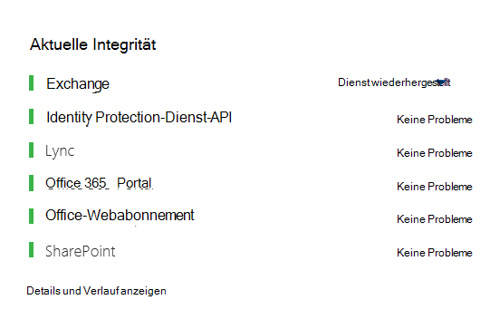
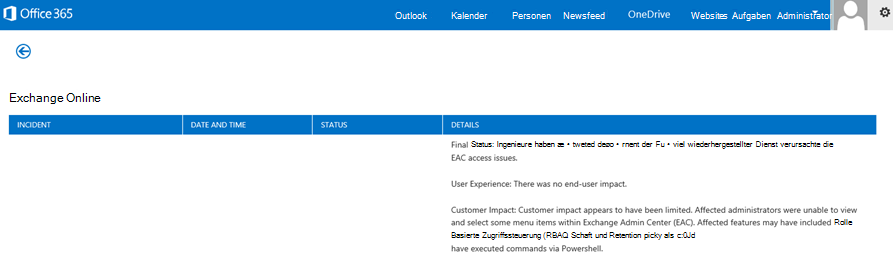
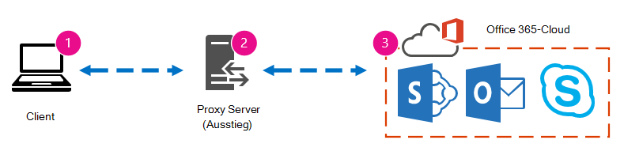
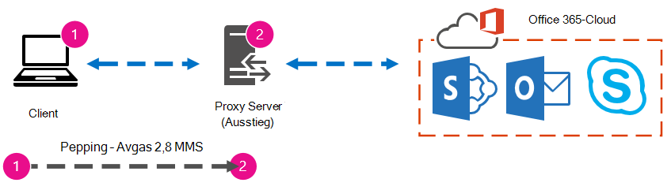

# Office 365-Leistung optimieren mit Basisplänen und Leistungsverlauf 

Es gibt einige einfache Möglichkeiten, die Verbindungsleistung zwischen Office 365 und Ihrem Unternehmen zu überprüfen, mit denen Sie eine grobe Grundlinie für Ihre Konnektivität erstellen können. Wenn Sie den Leistungsverlauf Ihrer Clientcomputerverbindungen kennen, können Sie neue Probleme frühzeitig erkennen, Probleme erkennen und prognostizieren.
  
Wenn Sie es nicht gewohnt sind, an Leistungsproblemen zu arbeiten, soll dieser Artikel Ihnen helfen, einige häufige Fragen zu berücksichtigen, z. B. wie wissen Sie, dass das auftretende Problem ein Leistungsproblem und kein Office 365 Dienstvorfall ist? Wie können Sie langfristig eine gute Leistung planen? Wie können Sie die Leistung im Auge behalten? Wenn Ihr Team oder Ihre Clients bei der Verwendung von Office 365 eine langsame Leistung sehen und Sie sich über diese Fragen fragen, lesen Sie weiter.
  
> [!IMPORTANT]
> **Haben Sie gerade ein Leistungsproblem zwischen Ihrem Client und Office 365?** Führen Sie die Schritte aus, die im [Plan zur Leistungsproblembehandlung für Office 365](performance-troubleshooting-plan.md)beschrieben sind. 
    
## Etwas, das Sie über Office 365 Leistung wissen sollten

Office 365 befinden sich in einem dedizierten Microsoft-Netzwerk mit hoher Kapazität, das nicht nur von der Automatisierung, sondern auch von realen Personen ständig überwacht wird. Ein Teil der Rolle bei der Aufrechterhaltung der Office 365 Cloud besteht darin, die Leistung zu optimieren und zu optimieren, wo dies möglich ist. Da clients of the Office 365 cloud have to connect across the Internet, there is a continuous effort to fine-tune the performance across Office 365 services too. Leistungsverbesserungen enden nie wirklich in der Cloud, und es gibt viele gesammelte Erfahrungen, um die Cloud fehlerfrei und schnell zu halten. Wenn ein Leistungsproblem beim Herstellen einer Verbindung von Ihrem Standort zu Office 365 auftritt, empfiehlt es sich, nicht mit einem Supportfall zu beginnen und darauf zu warten. Stattdessen sollten Sie mit der Untersuchung des Problems von "von innen nach außen" beginnen. Das heißt, beginnen Sie in Ihrem Netzwerk, und arbeiten Sie sich auf Office 365 aus. Bevor Sie einen Fall mit Office 365 Support öffnen, können Sie Daten erfassen und Maßnahmen ergreifen, mit denen Sie Ihr Problem untersuchen und beheben können.
  
> [!IMPORTANT]
> Beachten Sie die Kapazitätsplanung und -begrenzungen in Office 365. Diese Informationen stellen Sie vor die Kurve, wenn Sie versuchen, ein Leistungsproblem zu beheben. Hier ist ein Link zu den [Microsoft 365 und Office 365 Dienstbeschreibungen.](/office365/servicedescriptions/office-365-service-descriptions-technet-library) Dies ist ein zentraler Hub, und alle von Office 365 angebotenen Dienste verfügen über einen Link, der von hier aus zu ihren eigenen Dienstbeschreibungen wechselt. Das bedeutet, wenn Sie die Standardgrenzwerte für SharePoint Online anzeigen müssen, klicken Sie beispielsweise auf [SharePoint Onlinedienstbeschreibung,](/office365/servicedescriptions/sharepoint-online-service-description/sharepoint-online-service-description) und suchen Sie den [Abschnitt SharePoint Onlinebeschränkungen.](/office365/servicedescriptions/sharepoint-online-service-description/sharepoint-online-limits) 
  
Stellen Sie sicher, dass Sie sich mit der Problembehandlung befassen, indem Sie wissen, dass die Leistung eine gleitende Skalierung ist, es geht nicht darum, einen idealisierten Wert zu erreichen und dauerhaft aufrechtzuerhalten (wenn Sie der Meinung sind, dass dies der Fall ist, sind gelegentlich Aufgaben mit hoher Bandbreite wie das Onboarding einer großen Anzahl von Benutzern oder das Durchführen großer Datenmigrationen sehr stressig – planen Sie also die Leistungsauswirkungen. Sie können und sollten eine grobe Vorstellung von Ihren Leistungszielen haben, aber viele Variablen spielen in der Leistung eine Rolle. Daher variiert die Leistung. Dies ist die Art der Leistung. 
  
Bei der Leistungsproblembehandlung geht es nicht darum, bestimmte Ziele zu erreichen und diese Zahlen auf unbestimmte Zeit beizubehalten, es geht darum, vorhandene Aktivitäten zu verbessern, angesichts aller Variablen. 
  
## Okay, wie sieht ein Leistungsproblem aus?

Zunächst müssen Sie sicherstellen, dass es sich bei dem Auftreten tatsächlich um ein Leistungsproblem und nicht um einen Dienstvorfall handelt. Ein Leistungsproblem unterscheidet sich von einem Dienstvorfall in Office 365. Hier erfahren Sie, wie Sie sie voneinander unterscheiden.
  
Wenn der Office 365 Dienst Probleme hat, handelt es sich um einen Dienstvorfall. Im Microsoft 365 Admin Center werden unter **"Aktuelle Integrität"** rote oder gelbe Symbole angezeigt. Möglicherweise stellen Sie auch eine langsame Leistung auf Clientcomputern fest, die eine Verbindung mit Office 365 herstellen. Wenn z. B. der aktuelle Zustand ein rotes Symbol meldet und neben Exchange untersucht **wird,** erhalten Sie möglicherweise auch eine Reihe von Anrufen von Personen in Ihrer Organisation, die sich darüber beschwert haben, dass Clientpostfächer, die Exchange Online verwenden, schlecht funktionieren. In diesem Fall ist es sinnvoll, davon auszugehen, dass Ihre Exchange Online Leistung einfach zum Opfer von Problemen innerhalb des Diensts wurde. 
  

  
An diesem Punkt sollten Sie, der Office 365-Administrator, den **aktuellen Status** überprüfen und dann **häufig Details und Verlauf anzeigen,** um über die Wartung auf dem System auf dem Laufenden zu bleiben. Das **Aktuelle Integritätsdashboard** wurde vorgenommen, um Sie über Änderungen an und Probleme im Dienst zu aktualisieren. Die Hinweise und Erläuterungen, die in den Integritätsverlauf geschrieben wurden, von Administratoren bis hin zu Administratoren, helfen Ihnen dabei, Ihre Auswirkungen zu messen und Sie über laufende Arbeit auf dem Laufenden zu halten. 
  

  
Ein Leistungsproblem ist kein Dienstvorfall, obwohl Vorfälle zu einer langsamen Leistung führen können. Ein Leistungsproblem sieht wie folgt aus:
  
- Ein Leistungsproblem tritt unabhängig davon auf, was der aktuelle Integritätsstatus des Admin **Centers** für den Dienst meldet. 
    
-  Ein Verhalten, das früher relativ nahtlos war, dauert lange, bis es abgeschlossen ist oder nie abgeschlossen ist. 
    
- Sie können das Problem auch replizieren oder zumindest wissen, dass es passieren wird, wenn Sie die richtige Reihe von Schritten ausführen.
    
-  Wenn das Problem zeitweilig auftritt, gibt es immer noch ein Muster, z. B. wissen Sie, dass Sie bis 10:00 Uhr Anrufe von Benutzern haben, die nicht zuverlässig auf Office 365 zugreifen können, und dass die Anrufe gegen Mittag absterben. 
    
Dies klingt wahrscheinlich vertraut. Vielleicht zu vertraut. Sobald Sie wissen, dass es sich um ein Leistungsproblem handelt, wird die Frage gestellt: "Was tun Sie als Nächstes?" Der Rest dieses Artikels hilft Ihnen, genau dies zu ermitteln.
  
## Definieren und Testen des Leistungsproblems

Leistungsprobleme treten häufig im Laufe der Zeit auf, sodass es schwierig sein kann, das eigentliche Problem zu definieren. Sie müssen eine gute Problemanweisung und eine gute Vorstellung vom Problemkontext erstellen, und dann müssen Sie wiederholte Testschritte ausführen, um den Tag zu gewinnen. Andernfalls können Sie ohne eigenes Fehler verloren sein. Warum? Nun, hier sind einige Beispiele für Problemanweisungen, die nicht genügend Informationen liefern:
  
- Das Wechseln von meinem Posteingang zu meinem Kalender war etwas, was ich nicht bemerkt habe, und jetzt ist es eine Coffee-Break. Können Sie festlegen, dass es sich wie gewohnt verhält?
    
- Das Hochladen meiner Dateien in SharePoint Online dauert immer. Warum ist sie im Nachmittag langsam, aber zu jeder anderen Zeit ist sie schnell? Kann es nicht einfach schnell sein?
    
Die obigen Problemhinweise stellen mehrere große Herausforderungen dar. Insbesondere gibt es viele Zweideutigkeiten, mit denen man umgehen muss. Beispiel:
  
- Es ist unklar, wie zwischen Posteingang und Kalender gewechselt wird, um auf dem Laptop zu handeln.
    
- Wenn der Benutzer sagt: "Kann es nicht einfach schnell sein", was ist "schnell"?
    
- Wie lange ist "forever"? Sind dies mehrere Sekunden oder Minuten, oder könnte der Benutzer zum Mittagessen gehen und zehn Minuten nach dem Zurückkehren des Benutzers fertig sein?
    
Dies alles geschieht, ohne zu berücksichtigen, dass der Administrator und die Problembehandlung viele Details von Problemanweisungen wie diesen nicht kennen können. Beispielsweise, wenn das Problem begonnen hat; Dass der Benutzer von zu Hause aus arbeitet und nur einen langsamen Wechsel in einem Heimnetzwerk sieht; Dass der Benutzer mehrere andere RAM-intensive Anwendungen auf dem lokalen Client ausführen muss, oder der Benutzer ein älteres Betriebssystem ausführt oder keine aktuellen Updates ausgeführt hat.
  
Wenn Benutzer ein Leistungsproblem melden, müssen viele Informationen gesammelt werden. Das Sammeln dieser Informationen ist Teil eines Prozesses, der als Bereichsdefinition für das Problem bezeichnet wird oder das Problem untersucht wird. Nachfolgend finden Sie eine einfache Bereichsdefinitionsliste, mit der Sie Informationen zu Ihrem Leistungsproblem sammeln können. Diese Liste ist nicht vollständig, aber sie ist ein Ort, an dem Sie eine eigene starten können: 
  
- An welchem Datum ist das Problem aufgetreten, und zu welcher Tages- oder Nachtzeit?
    
- Welche Art von Clientcomputer haben Sie verwendet, und wie wird eine Verbindung mit dem Unternehmensnetzwerk hergestellt (VPN, kabelgebunden, drahtlos)?
    
- Waren Sie remote oder waren Sie im Büro?
    
- Haben Sie die gleichen Aktionen auf einem anderen Computer versucht und dasselbe Verhalten angezeigt?
    
- Führen Sie die Schritte durch, die Ihnen die Probleme bereiten, damit Sie die Aktionen schreiben können, die Sie ausführen.
    
- Wie langsam ist die Leistung in Sekunden oder Minuten?
    
- Wo befinden Sie sich auf der Ganzen Welt?
    
Einige dieser Fragen sind offensichtlicher als andere. Die meisten Benutzer verstehen, dass eine Problembehandlung die genauen Schritte zum Reproduzieren des Problems erfordert. Wie können Sie schließlich aufzeichnen, was falsch ist, und wie können Sie testen, ob das Problem behoben ist? Weniger offensichtlich sind Dinge wie "Welches Datum und welche Uhrzeit haben Sie das Problem erkannt?" und "Wo in der Welt befinden Sie sich?", Informationen, die zusammen verwendet werden können. Je nachdem, wann der Benutzer gearbeitet hat, können einige Stunden Zeitunterschied dazu führen, dass die Wartung in Teilen des Unternehmensnetzwerks bereits ausgeführt wird. Wenn Ihr Unternehmen beispielsweise über eine Hybridimplementierung verfügt, z. B. eine hybride SharePoint Suche, die Suchindizes sowohl in SharePoint Online als auch in einer lokalen SharePoint Server 2013-Instanz abfragen kann, können Updates in der lokalen Farm ausgeführt werden. Wenn sich Ihr Unternehmen vollständig in der Cloud befindet, kann die Systemwartung das Hinzufügen oder Entfernen von Netzwerkhardware, das Rollout unternehmensweiter Updates oder das Vornehmen von Änderungen an DNS oder anderen Kerninfrastrukturen umfassen.
  
Wenn Sie ein Leistungsproblem beheben, ist dies ein wenig wie ein Tatort, Sie müssen präzise und aufmerksam sein, um Schlussfolgerungen aus den Nachweisen zu ziehen. Dazu müssen Sie eine gute Problemanweisung erhalten, indem Sie Nachweise sammeln. Es sollte den Kontext des Computers, den Kontext des Benutzers, den Beginn des Problems und die genauen Schritte enthalten, die das Leistungsproblem verfügbar gemacht haben. Diese Problem-Anweisung sollte die oberste Seite in Ihren Notizen sein und bleiben. Wenn Sie die Problem-Anweisung erneut durchgehen, nachdem Sie an der Lösung gearbeitet haben, führen Sie die Schritte aus, um zu testen und zu überprüfen, ob das Problem durch die von Ihnen ausgeführten Aktionen behoben wurde. Dies ist wichtig, um zu wissen, wann Ihre Arbeit dort abgeschlossen ist.
  
## Wissen Sie, wie die Leistung aussieht, wenn sie gut war?

Wenn Sie unerzwendt sind, weiß niemand. Niemand hatte Zahlen. Das bedeutet, dass niemand die einfache Frage beantworten kann: "Wie viele Sekunden hat es ge dauern, bis ein Posteingang in Office 365 angezeigt wurde?", oder "Wie lange brauchte es, als die Führungskräfte eine Lync Online-Besprechung hatten?", was für viele Unternehmen ein häufiges Szenario ist.
  
Was hier fehlt, ist eine Leistungsbasislinie.
  
Basispläne geben Ihnen einen Kontext für Ihre Leistung. Je nach den Anforderungen Ihres Unternehmens sollten Sie gelegentlich zu häufigen Basisplänen greifen. Wenn Sie ein größeres Unternehmen sind, übernimmt Ihr Operations-Team möglicherweise bereits Basispläne für Ihre lokale Umgebung. Wenn Sie beispielsweise alle Exchange Server am ersten Montag des Monats und alle Ihre SharePoint Server am dritten Montag patchen, verfügt Ihr Operations-Team wahrscheinlich über eine Liste von Aufgaben und Szenarien, die nach dem Patchen ausgeführt werden, um nachzuweisen, dass kritische Funktionen betriebsbereit sind. Öffnen Sie z. B. den Posteingang, klicken Sie auf "Senden/Empfangen", und stellen Sie sicher, dass die Ordner aktualisiert werden, oder durchsuchen Sie in SharePoint die Hauptseite der Website, navigieren Sie zur Unternehmenssuchseite, und führen Sie eine Suche durch, die Ergebnisse zurückgibt.
  
Wenn sich Ihre Anwendungen in Office 365 befinden, können Sie die Zeit (in Millisekunden) von einem Clientcomputer innerhalb Ihres Netzwerks bis zu einem Ausgangspunkt oder dem Punkt, an dem Sie Ihr Netzwerk verlassen und zu Office 365 gehen, messen. Hier sind einige hilfreiche Baselines, die Sie untersuchen und aufzeichnen können:
  
- Identifizieren Sie die Geräte zwischen Ihrem Clientcomputer und Ihrem Ausgangspunkt, z. B. Ihrem Proxyserver.
    
  - Sie müssen Ihre Geräte kennen, damit Sie Kontext (IP-Adressen, Gerätetyp usw.) für auftretende Leistungsprobleme haben.
    
  - Proxyserver sind häufige Ausgangspunkte, sodass Sie in Ihrem Webbrowser überprüfen können, welcher Proxyserver ggf. verwendet werden soll.
    
  - Es gibt Tools von Drittanbietern, die Ihr Netzwerk ermitteln und zuordnen können, aber die sicherste Möglichkeit, Ihre Geräte zu kennen, besteht darin, ein Mitglied Ihres Netzwerkteams zu fragen.
    
- Identifizieren Sie Ihren Internetdienstanbieter ( Internet Service Provider, ISP), notieren Sie sich die Kontaktinformationen, und fragen Sie, wie viele Leitungen Sie wie viel Bandbreite haben.
    
- Identifizieren Sie innerhalb Ihres Unternehmens Ressourcen für die Geräte zwischen Ihrem Client und dem Ausgangspunkt, oder identifizieren Sie einen Notfallkontakt, mit dem Sie über Netzwerkprobleme sprechen können.
    
Hier sind einige Basispläne, die einfache Tests mit Tools für Sie berechnen können:
  
- Zeit vom Clientcomputer zum Ausgangspunkt in Millisekunden
    
- Zeit von Ihrem Ausgangspunkt bis Office 365 in Millisekunden
    
- Standort in der Welt des Servers, der die URLs für Office 365 beim Durchsuchen auflöst
    
- Die Geschwindigkeit der DNS-Auflösung Ihres ISP in Millisekunden, Inkonsistenzen bei der Paketankunft (Netzwerk-Jitter), Upload- und Downloadzeiten in Millisekunden
    
Wenn Sie mit der Durchführung dieser Schritte nicht vertraut sind, gehen wir in diesem Artikel ausführlicher darauf ein. 
  
## Was ist eine Basislinie?

Sie werden die Auswirkungen kennen, wenn sie schlecht werden, aber wenn Sie Ihre historischen Leistungsdaten nicht kennen, ist es nicht möglich, einen Kontext dafür zu haben, wie schlecht sie möglicherweise geworden sind und wann. Ohne Basislinie fehlt ihnen also der Schlüssel für die Lösung des Puzzles: das Bild auf dem Puzzlefeld. Bei der Leistungsproblembehandlung benötigen Sie einen *Vergleichspunkt.* Einfache Leistungsgrundwerte sind nicht schwierig zu verwenden. Ihr Operations-Team kann damit beauftragt werden, diese nach einem Zeitplan auszuführen. Nehmen wir beispielsweise an, dass Ihre Verbindung wie folgt aussieht: 
  

  
Das bedeutet, dass Sie ihr Netzwerkteam überprüft und festgestellt haben, dass Sie Ihr Unternehmen über einen Proxyserver für das Internet verlassen und dieser Proxy alle Anforderungen verarbeitet, die Ihr Clientcomputer an die Cloud sendet. In diesem Fall sollten Sie eine vereinfachte Version Ihrer Verbindung zeichnen, die alle dazwischen liegenden Geräte auflistet. Fügen Sie nun Tools ein, mit denen Sie die Leistung zwischen dem Client, dem Ausgangspunkt (an dem Sie Ihr Netzwerk für das Internet verlassen) und der Office 365 Cloud testen können.
  

  
Die Optionen werden aufgrund des Umfangs der Expertise, die Sie benötigen, um die Leistungsdaten zu finden, als **"Einfach"** und **"Erweitert"** aufgeführt. Eine Netzwerkablaufverfolgung nimmt im Vergleich zur Ausführung von Befehlszeilentools wie PsPing und TraceTCP viel Zeit in Anspruch. Diese beiden Befehlszeilentools wurden ausgewählt, da sie keine ICMP-Pakete verwenden, die durch Office 365 blockiert werden, und weil sie die Zeit in Millisekunden benötigen, um den Clientcomputer oder Proxyserver zu verlassen (wenn Sie Zugriff haben) und Office 365 eintreffen. Jeder einzelne Hop von einem Computer auf einen anderen endet mit einem Zeitwert, und das ist ideal für Basispläne! Ebenso wichtig ist, dass Sie mit diesen Befehlszeilentools dem Befehl eine Portnummer hinzufügen können. Dies ist nützlich, da Office 365 über Port 443 kommuniziert, der von Secure Sockets Layer and Transport Layer Security (SSL und TLS) verwendet wird. Andere Drittanbietertools sind jedoch möglicherweise bessere Lösungen für Ihre Situation. Microsoft unterstützt nicht alle diese Tools. Wenn Sie psPing und TraceTCP aus irgendeinem Grund nicht verwenden können, wechseln Sie mit einem Tool wie Netmon zu einer Netzwerkablaufverfolgung. 
  
Sie können einen Basisplan vor den Geschäftszeiten, erneut bei starker Nutzung und dann nach Stunden erstellen. Dies bedeutet, dass Sie möglicherweise über eine Ordnerstruktur verfügen, die am Ende ein wenig wie folgt aussieht:
  

  
Sie sollten auch eine Benennungskonvention für Ihre Dateien auswählen. Im Folgenden finden Sie einige Beispiele:
  
- Feb_09_2015_9amPST_PerfBaseline_Netmon_ClientToEgress_Normal
    
- Jan_10_2015_3pmCST_PerfBaseline_PsPing_ClientToO365_bypassProxy_SLOW
    
- Feb_08_2015_2pmEST_PerfBaseline_BADPerf
    
- Feb_08_2015_8-30amEST_PerfBaseline_GoodPerf
    
Es gibt viele verschiedene Möglichkeiten, dies zu tun, aber die Verwendung des Formats **\<dateTime\>\<what's happening in the test\>** ist ein guter Ausgangspunkt. Wenn Sie später versuchen, Probleme zu beheben, ist dies sehr hilfreich. Später können Sie sagen: "Ich habe am 8. Februar zwei Ablaufverfolgungen ausgeführt, eine hat eine gute Leistung und eine schlechte Leistung gezeigt, sodass wir sie vergleichen können". Dies ist äußerst hilfreich für die Problembehandlung. 
  
Sie benötigen eine geordnete Methode, um Ihre historischen Grundwerte beizubehalten. In diesem Beispiel erzeugten die einfachen Methoden drei Befehlszeilenausgabe, und die Ergebnisse wurden als Screenshots gesammelt, es können aber stattdessen Netzwerkerfassungsdateien vorhanden sein. Verwenden Sie die Methode, die für Sie am besten geeignet ist. Store Sie Ihre historischen Basispläne und verweisen Sie auf diese an Punkten, an denen Sie Änderungen am Verhalten von Onlinediensten feststellen. 
  
## Gründe für die Erfassung von Leistungsdaten während eines Pilotprojekts

Es gibt keinen besseren Zeitpunkt, um mit der Erstellung von Basisplänen zu beginnen als während eines Pilotprojekts des Office 365 Diensts. Ihr Büro kann Tausende von Benutzern haben, Hunderte von Tausenden oder fünf, aber selbst bei einer kleinen Anzahl von Benutzern können Sie Tests durchführen, um Leistungseinbußen zu messen. Im Fall eines großen Unternehmens kann eine repräsentative Stichprobe von mehreren Hundert Benutzern, die Office 365 pilotieren, auf mehrere Tausend projiziert werden, damit Sie wissen, wo Probleme auftreten können, bevor sie auftreten.
  
Wenn es sich bei einem kleinen Unternehmen um ein kleines Unternehmen handelt, bei dem das Onboarding bedeutet, dass alle Benutzer gleichzeitig zum Dienst wechseln und es kein Pilotprojekt gibt, behalten Sie Leistungsmaßnahmen bei, sodass Sie Allen Daten anzeigen können, die möglicherweise probleme mit einem fehlerhaften Vorgang beheben müssen. Wenn Sie z. B. bemerken, dass Sie ihr Gebäude in der Zeit, in der es dauert, um eine mittelgroße Grafik hochzuladen, plötzlich ganz schnell durchlaufen können.
  
## Sammeln von Basisplänen

Für alle Problembehandlungspläne müssen Sie mindestens folgende Dinge identifizieren:
  
- Der clientcomputer, den Sie verwenden (der Typ des Computers oder Geräts, eine IP-Adresse und die Aktionen, die das Problem verursacht haben)
    
- Wo sich der Clientcomputer auf der Ganzen Welt befindet (z. B. ob dieser Benutzer über ein VPN zum Netzwerk arbeitet, remote arbeitet oder sich im Unternehmensintranet befindet)
    
- Der Ausgangspunkt, den der Clientcomputer aus Ihrem Netzwerk verwendet (den Punkt, an dem der Datenverkehr Ihr Unternehmen für einen ISP oder das Internet verlässt)
    
 Sie können das Layout Ihres Netzwerks vom Netzwerkadministrator ermitteln. Wenn Sie sich in einem kleinen Netzwerk befinden, sehen Sie sich die Geräte an, die Sie mit dem Internet verbinden, und rufen Sie Ihren ISP an, wenn Sie Fragen zum Layout haben. Erstellen Sie eine Grafik des endgültigen Layouts für Ihre Referenz. 
  
Dieser Abschnitt ist in einfache Befehlszeilentools und -methoden sowie erweiterte Tools unterteilt. Wir befassen uns zuerst mit einfachen Methoden. Wenn Sie jedoch gerade ein Leistungsproblem haben, sollten Sie zu erweiterten Methoden springen und den Beispielaktionsplan für die Leistungsproblembehandlung ausprobieren.
  
### Einfache Methoden

Das Ziel dieser einfachen Methoden besteht darin, einfache Leistungsgrundwerte im Laufe der Zeit zu erlernen, zu verstehen und ordnungsgemäß zu speichern, damit Sie über Office 365 Leistung informiert werden. Hier ist das sehr einfache Diagramm für Einfaches, wie Sie bereits gesehen haben:
  

  
> [!NOTE]
> TraceTCP ist in diesem Screenshot enthalten, da es sich um ein nützliches Tool handelt, um in Millisekunden anzuzeigen, wie lange eine Anforderung für die Verarbeitung benötigt und wie viele Netzwerkhops oder Verbindungen von einem Computer zum nächsten erforderlich sind, die die Anforderung benötigt, um ein Ziel zu erreichen. TraceTCP kann auch die Namen der Server angeben, die während hops verwendet werden, was für eine Microsoft Office 365 Problembehandlung im Support hilfreich sein kann. > TraceTCP-Befehle können sehr einfach sein, z. B.: >  `tracetcp.exe outlook.office365.com:443`> Denken Sie daran, die Portnummer in den Befehl einzuschließen! > [TraceTCP](https://simulatedsimian.github.io/tracetcp_download.html) ist ein kostenloser Download, basiert aber auf Wincap. Wincap ist ein Tool, das auch von Netmon verwendet und installiert wird. Wir verwenden netmon auch im Abschnitt "Erweiterte Methoden". 
  
 Wenn Sie mehrere Büros haben, müssen Sie auch einen Satz von Daten von einem Client an jedem dieser Standorte aufbewahren. Dieser Test misst die Latenz, bei der es sich in diesem Fall um einen Zahlenwert handelt, der die Zeitspanne zwischen dem Senden einer Anforderung an Office 365 durch einen Client und Office 365 der Antwort auf die Anforderung beschreibt. Die Tests stammen aus Ihrer Domäne auf einem Clientcomputer und messen einen Roundtrip von innerhalb Ihres Netzwerks, über einen Ausgangspunkt, über das Internet zu Office 365 und zurück. 
  
Es gibt einige Möglichkeiten, mit dem Ausgangspunkt umzugehen, in diesem Fall dem Proxyserver. Sie können entweder eine Ablaufverfolgung von 1 bis 2 und dann von 2 bis 3 ausführen und dann die Zahlen in Millisekunden hinzufügen, um eine endgültige Summe an den Rand Ihres Netzwerks zu erhalten. Sie können die Verbindung auch so konfigurieren, dass der Proxy für Office 365 Adressen umgangen wird. In einem größeren Netzwerk mit einer Firewall, einem Reverseproxy oder einer Kombination aus den beiden müssen Sie möglicherweise Ausnahmen auf dem Proxyserver vornehmen, über die Datenverkehr für viele URLs übergeben werden kann. Eine Liste der von Office 365 verwendeten Endpunkte finden Sie unter [Office 365 URLs und IP-Adressbereiche.](https://support.office.com/article/8548a211-3fe7-47cb-abb1-355ea5aa88a2) Wenn Sie über einen Authentifizierungsproxy verfügen, beginnen Sie mit dem Testen von Ausnahmen für Folgendes:
  
- Ports 80 und 443
    
- TCP und HTTPs
    
- Verbindungen, die mit einer der folgenden URLs ausgehend sind:
    
- \*.microsoftonline.com
    
- \*.microsoftonline-p.com
    
- \*.sharepoint.com
    
- \*.outlook.com
    
- \*.lync.com
    
- osub.microsoft.com
    
Alle Benutzer müssen ohne Proxyinterferenzen oder Authentifizierung zu diesen Adressen gelangen dürfen. In einem kleineren Netzwerk sollten Sie diese der Proxyumgehungsliste in Ihrem Webbrowser hinzufügen. 
  
Um diese zur Proxyumgehungsliste in Internet Explorer hinzuzufügen, wechseln Sie zu **Extras** \> **Internet options** \> **Connections** \> **LAN settings** \> **Advanced**. Auf der registerkarte "Erweitert" finden Sie auch den Proxyserver und den Proxyserverport. Möglicherweise müssen Sie auf das Kontrollkästchen **Verwenden eines Proxyservers für Ihr LAN** klicken, um auf die Schaltfläche **"Erweitert"** zuzugreifen. Sie sollten sicherstellen, dass der **Proxyserver für lokale Adressen umgangen** wird. Sobald Sie auf **"Erweitert"** klicken, wird ein Textfeld angezeigt, in dem Sie Ausnahmen eingeben können. Trennen Sie die oben aufgeführten Platzhalter-URLs durch Semikolons, z. B.:
  
\*.microsoftonline.com; \*.sharepoint.com
  
Nachdem Sie Ihren Proxy umgangen haben, sollten Sie Ping oder PsPing direkt für eine Office 365-URL verwenden können. Der nächste Schritt ist das Testen von **Ping-outlook.office365.com.** Wenn Sie PsPing oder ein anderes Tool verwenden, mit dem Sie dem Befehl eine Portnummer bereitstellen können, können Sie psPing für **portal.microsoftonline.com:443** verwenden, um die durchschnittliche Roundtripzeit in Millisekunden anzuzeigen. 
  
Die Roundtripzeit (ODER RTT) ist ein Zahlenwert, der misst, wie lange es dauert, um eine HTTP-Anforderung an einen Server wie outlook.office365.com zu senden und eine Antwort zu erhalten, die bestätigt, dass der Server weiß, dass Sie dies getan haben. Dies wird manchmal als RTT abgekürzt angezeigt. Dies sollte relativ kurz dauern.
  
Sie müssen [PSPing](/sysinternals/downloads/psping) oder ein anderes Tool verwenden, das keine ICMP-Pakete verwendet, die von Office 365 blockiert werden, um diesen Test durchführen zu können. 
  
 **Verwenden von PsPing zum Abrufen einer Gesamt-Roundtripzeit in Millisekunden direkt von einer Office 365-URL**
  
1. Führen Sie eine Eingabeaufforderung mit erhöhten Rechten aus, indem Sie die folgenden Schritte ausführen:
    
1. Klicken Sie auf **Start**.
    
2. Geben Sie im **Feld "Suche starten"** cmd ein, und drücken Sie dann STRG+UMSCHALT+EINGABETASTE.
    
3. Wenn das Dialogfeld **Benutzerkontensteuerung** eingeblendet wird, bestätigen Sie die angegebene Aktion und klicken dann auf **Weiter**.
    
2. Navigieren Sie zu dem Ordner, in dem das Tool (in diesem Fall PsPing) installiert ist, und testen Sie diese Office 365 URLs:
    
  - psping admin.microsoft.com:443
    
  - psping microsoft-my.sharepoint.com:443
    
  - psping outlook.office365.com:443
    
  - psping www.yammer.com:443
    
    
  
Achten Sie darauf, die Portnummer 443 einzuschließen. Denken Sie daran, dass Office 365 auf einem verschlüsselten Kanal funktioniert. Wenn Sie PsPing ohne Portnummer ausführen, schlägt Ihre Anforderung fehl. Nachdem Sie ihre kurze Liste angepingt haben, suchen Sie nach der durchschnittlichen Zeit in Millisekunden (ms). Das möchten Sie aufzeichnen!
  

  
Wenn Sie mit der Proxyumgehung nicht vertraut sind und schrittweise vorgehen möchten, müssen Sie zuerst den Namen Ihres Proxyservers ermitteln. Wechseln Sie in Internet Explorer zu **Extras** \> **Internet options** \> **Connections** \> **LAN settings** \> **Advanced**. Auf der Registerkarte **"Erweitert"** wird der Proxyserver aufgeführt. Pingen Sie diesen Proxyserver an einer Eingabeaufforderung, indem Sie diese Aufgabe ausführen: 
  
 **So rufen Sie einen Roundtripwert für phase 1 bis 2 in Millisekunden ab, um den Proxyserver zu pingen und einen Roundtripwert abzurufen**
  
1. Führen Sie eine Eingabeaufforderung mit erhöhten Rechten aus, indem Sie die folgenden Schritte ausführen:
    
1. Klicken Sie auf **Start**.
    
2. Geben Sie im **Feld "Suche starten"** cmd ein, und drücken Sie dann STRG+UMSCHALT+EINGABETASTE.
    
3. Wenn das Dialogfeld **Benutzerkontensteuerung** eingeblendet wird, bestätigen Sie die angegebene Aktion und klicken dann auf **Weiter**.
    
2. Geben Sie Ping \<the name of the proxy server your browser uses, or the IP address of the proxy server\> ein, und drücken Sie dann die EINGABETASTE. Wenn Sie PsPing oder ein anderes Tool installiert haben, können Sie stattdessen dieses Tool verwenden. 
    
    Ihr Befehl kann wie eines der folgenden Beispiele aussehen: 
    
  - Ping-ourproxy.ourdomain.industry.business.com
    
  - ping 155.55.121.55
    
  - ping ourproxy
    
  - psping ourproxy.ourdomain.industry.business.com:80
    
  - psping 155.55.121.55:80
    
  - psping ourproxy:80
    
3. Wenn die Ablaufverfolgung das Senden von Testpaketen beendet, erhalten Sie eine kleine Zusammenfassung, die einen Mittelwert in Millisekunden auflistet, und das ist der Wert, nach dem Sie sich befinden. Erstellen Sie einen Screenshot der Eingabeaufforderung, und speichern Sie sie mithilfe Ihrer Benennungskonvention. An diesem Punkt kann es auch hilfreich sein, das Diagramm mit dem Wert auszufüllen.
    
Vielleicht haben Sie am frühen Morgen eine Spur genommen, und Ihr Client kann schnell zum Proxy gelangen (oder den Ausgangsserver aus dem Internet verlässt). In diesem Fall können Ihre Nummern wie folgt aussehen:
  

  
Wenn Ihr Clientcomputer einer der ausgewählten Computer mit Zugriff auf den Proxyserver (oder Denausgangsserver) ist, können Sie die nächste Testphase ausführen, indem Sie remote eine Verbindung mit diesem Computer herstellen und die Eingabeaufforderung zu PsPing an eine Office 365 URL von dort ausführen. Wenn Sie keinen Zugriff auf diesen Computer haben, können Sie sich an Ihre Netzwerkressourcen wenden, um Hilfe beim nächsten Schritt zu erhalten und genaue Zahlen auf diese Weise zu erhalten. Wenn dies nicht möglich ist, nehmen Sie einen PsPing für die betreffende Office 365-URL und vergleichen Sie ihn mit der PsPing- oder Pingzeit für Ihren Proxyserver. 
  
Wenn Sie beispielsweise 51,84 Millisekunden vom Client zur Office 365-URL haben und 2,8 Millisekunden vom Client zum Proxy (oder Ausgangspunkt) haben, haben Sie 49,04 Millisekunden vom Ausgang zum Office 365. Wenn Sie während der Tageshöhe einen PsPing von 12,25 Millisekunden vom Client zum Proxy haben und 62,01 Millisekunden vom Client zur Office 365-URL, beträgt der Durchschnittswert für den Proxyausgang zur Office 365-URL 49,76 Millisekunden.
  

  
Im Hinblick auf die Problembehandlung finden Sie möglicherweise etwas Interessantes, indem Sie diese Basispläne beibehalten. Wenn Sie beispielsweise feststellen, dass in der Regel zwischen 40 und 59 Millisekunden Latenz vom Proxy- oder Ausgangspunkt zur OFFICE 365-URL besteht, und eine Client-zu-Proxy- oder Egresspunktlatenz von ca. 3 bis 7 Millisekunden haben (abhängig von der Menge des Netzwerkdatenverkehrs, den Sie zu dieser Zeit sehen), werden Sie sicher wissen, dass etwas problematisch ist, wenn ihre letzten drei Client-Proxy- oder Ausgangspunkte eine Latenz von 45 Millisekunden aufweisen.
  
### Erweiterte Methoden

Wenn Sie wirklich wissen möchten, was mit Ihren Internetanforderungen an Office 365 geschieht, müssen Sie sich mit Netzwerkablaufverfolgungen vertraut machen. Es spielt keine Rolle, welche Tools Sie für diese Ablaufverfolgungen bevorzugen, HTTPWatch, Netmon, Message Analyzer, Wireshark, Fiddler, Entwicklerdashboard-Tool oder ein anderes Tool, solange dieses Tool Netzwerkdatenverkehr erfassen und filtern kann. In diesem Abschnitt sehen Sie, dass es von Vorteil ist, mehrere dieser Tools auszuführen, um ein vollständigeres Bild des Problems zu erhalten. Beim Testen fungieren einige dieser Tools auch als Proxys. Zu den Tools, die im Begleitartikel ["Leistungsproblembehandlungsplan für Office 365"](performance-troubleshooting-plan.md)verwendet werden, gehören [Netmon 3.4,](https://www.microsoft.com/download/details.aspx?id=4865) [HTTPWatch](https://www.httpwatch.com/download/)oder [WireShark.](https://www.wireshark.org/)
  
Das Erstellen einer Leistungsbasislinie ist der einfache Teil dieser Methode, und viele der Schritte sind identisch mit der Behandlung eines Leistungsproblems. Für die fortgeschritteneren Methoden zum Erstellen von Basisplänen für die Leistung müssen Sie Netzwerkablaufverfolgungen erstellen und speichern. Die meisten Beispiele in diesem Artikel verwenden SharePoint Online. Sie sollten jedoch eine Liste allgemeiner Aktionen für die Office 365 Dienste entwickeln, die Sie zum Testen und Aufzeichnen abonnieren. Hier ist ein Basisplanbeispiel:
  
- Baseline list for SPO – ** Step 1: ** Browse the home page of the SPO website and do a network trace. Speichern Sie die Ablaufverfolgung. 
    
- Baseline list for SPO - **Step 2:** Search for a term (such for a term (such as your company name) via Enterprise Search and do a network trace. Speichern Sie die Ablaufverfolgung. 
    
- Baseline list for SPO - **Step 3:** Hochladen a large file to a SharePoint Online document library and do a network trace. Speichern Sie die Ablaufverfolgung. 
    
- Baseline list for SPO - **Step 4:** Browse the home page of the OneDrive website and do a network trace. Speichern Sie die Ablaufverfolgung. 
    
Diese Liste sollte die wichtigsten allgemeinen Aktionen enthalten, die Benutzer gegen SharePoint Online ausführen. Beachten Sie, dass der letzte Schritt, um OneDrive for Business nachzuverfolgen, einen Vergleich zwischen der Last der SharePoint Online-Startseite (die häufig von Unternehmen angepasst wird) und OneDrive for Business Homepage erstellt, die selten angepasst wird. Dies ist ein sehr einfacher Test, wenn es um ein langsames Laden SharePoint Onlinewebsite geht. Sie können einen Datensatz dieses Unterschieds in Ihren Tests erstellen.
  
Wenn Sie sich mitten in einem Leistungsproblem befinden, sind viele der Schritte identisch mit denen bei der Erstellung einer Baseline. Netzwerkablaufverfolgungen werden kritisch, daher behandeln  *wir, wie*  die wichtigen Ablaufverfolgungen als Nächstes behandelt werden. 
  
Um ein Leistungsproblem zu beheben, müssen Sie  *zur*  Zeit, in der das Leistungsproblem auftritt, eine Ablaufverfolgung ausführen. Sie benötigen die richtigen Tools zum Erfassen von Protokollen, und Sie benötigen einen Aktionsplan, d. h. eine Liste der Problembehandlungsaktionen, um die bestmöglichen Informationen zu sammeln. Zunächst müssen Sie das Datum und die Uhrzeit des Tests aufzeichnen, damit die Dateien in einem Ordner gespeichert werden können, der das Timing widerspiegelt. Schränken Sie als Nächstes die Problemschritte selbst ein. Dies sind die genauen Schritte, die Sie zum Testen verwenden werden. Vergessen Sie nicht die Grundlagen: Wenn das Problem nur bei Outlook liegt, stellen Sie sicher, dass das Problemverhalten nur in einem Office 365 Dienst auftritt. Wenn Sie den Umfang dieses Problems eingrenzen, können Sie sich auf etwas konzentrieren, das Sie beheben können. 
  
## Siehe auch

[Verwalten von Office 365-Endpunkten](https://support.office.com/article/99cab9d4-ef59-4207-9f2b-3728eb46bf9a)