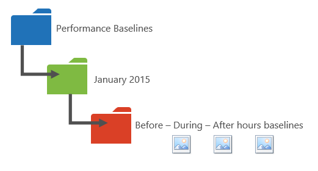

# Office 365-Leistung optimieren mit Basisplänen und Leistungsverlauf Office 365 performance tuning using baselines and performance history

Es gibt einige einfache Möglichkeiten, die Verbindungsleistung zwischen Office 365 und Ihrem Unternehmen zu überprüfen, sodass Sie eine grobe Basislinie ihrer Konnektivität einrichten können.There are some simple ways to check the connection performance between Office 365 and your business that will let you establish a rough baseline of your connectivity. Wenn Sie den Leistungsverlauf ihrer Clientcomputerverbindungen kennen, können Sie auftretende Probleme frühzeitig erkennen, Probleme identifizieren und Vorhersagen.Knowing the performance history of your client computer connections can help you detect emerging issues early, identify, and predict problems.
  
Wenn Sie nicht mit Leistungsproblemen arbeiten, sollten Sie sich in diesem Artikel mit einigen häufig gestellten Fragen vertraut machen, wie Sie wissen, dass das Problem, das Sie sehen, ein Leistungsproblem ist und kein Office 365 Dienst Vorfall ist?If you're not used to working on performance issues, this article is designed to help you consider some common questions, like How do you know the problem you're seeing is a performance issue and not an Office 365 service incident? Wie können Sie langfristig eine gute Leistung planen?How can you plan for good performance, long term? Wie können Sie die Leistung im Auge behalten?How can you keep an eye on performance? Wenn Ihr Team oder Ihre Clients bei der Verwendung von Office 365 eine langsame Leistung erzielen und Sie sich über diese Fragen Gedanken machen, lesen Sie weiter.If your team or clients are seeing slow performance while using Office 365, and you wonder about any of these questions, read on.
  
> [!IMPORTANT]
> **Haben Sie ein Leistungsproblem zwischen Ihrem Client und Office 365 im Moment?****Have a performance issue between your client and Office 365 right now?** Führen Sie die Schritte aus, die im [Leistungsproblem Behandlungsplan für Office 365](performance-troubleshooting-plan.md)beschrieben werden.Follow the steps outlined in the [Performance troubleshooting plan for Office 365](performance-troubleshooting-plan.md). 
    
## Was Sie über Office 365 Leistung wissen solltenSomething you should know about Office 365 performance

Office 365 lebt in einem dedizierten Microsoft-Netzwerk mit hoher Kapazität, das nicht nur von der Automatisierung, sondern auch von echten Personen ständig überwacht wird.Office 365 lives inside a high-capacity, dedicated Microsoft network that is steadily monitored not just by automation, but by real people. Ein Teil der Rolle des Aufrechterhaltens der Office 365 Cloud besteht in der Leistungsoptimierung und-Optimierung, sofern möglich.Part of the role of maintaining the Office 365 cloud is building-in performance tuning and streamlining where it's possible. Da Clients der Office 365 Cloud über das Internet eine Verbindung herstellen müssen, besteht ein kontinuierlicher Aufwand zur Optimierung der Leistung in Office 365 Diensten.Since clients of the Office 365 cloud have to connect across the Internet, there is a continuous effort to fine-tune the performance across Office 365 services too. Leistungsverbesserungen werden in der Cloud nie wirklich angehalten, und es gibt eine Menge gesammelter Erfahrungen, um die Cloud gesund und schnell zu halten.Performance improvements never really stop in the cloud, and there is a lot of accumulated experience with keeping the cloud healthy and quick. Wenn ein Leistungsproblem beim Herstellen einer Verbindung zwischen Ihrem Standort und Office 365 auftritt, sollten Sie am besten nicht mit einem Support Fall beginnen und warten.Should you experience a performance issue connecting from your location to Office 365, it's best not to start with, and wait on, a Support case. Stattdessen sollten Sie mit der Untersuchung des Problems von "Inside Out" beginnen.Instead, you should begin investigating the problem from 'the inside out'. Das heißt, starten Sie innerhalb Ihres Netzwerks, und arbeiten Sie sich an Office 365.That is, start inside of your network, and work your way out to Office 365. Bevor Sie einen Fall mit Office 365-Unterstützung öffnen, können Sie Daten sammeln und Aktionen ausführen, mit denen Ihr Problem erforscht und möglicherweise behoben wird.Before you open a case with Office 365 Support, you can gather data and take actions that will explore, and may resolve, your problem.
  
> [!IMPORTANT]
> Beachten Sie die Kapazitätsplanung und Grenzwerte in Office 365.Be aware of capacity planning and limits in Office 365. Diese Informationen werden Sie bei dem Versuch, ein Leistungsproblem zu beheben, vor die Kurve stellen.That information will put you ahead of the curve when trying to resolve a performance issue. Hier ist ein Link zu den [Microsoft 365-und Office 365-Dienstbeschreibungen](https://docs.microsoft.com/office365/servicedescriptions/office-365-service-descriptions-technet-library).Here's a link to the [Microsoft 365 and Office 365 service descriptions](https://docs.microsoft.com/office365/servicedescriptions/office-365-service-descriptions-technet-library). Dies ist ein zentraler Hub, und alle von Office 365 angebotenen Dienste verfügen über einen Link, der von hier aus zu ihren eigenen Dienstbeschreibungen wechselt.This is a central hub, and all the services offered by Office 365 have a link that goes to their own Service Descriptions from here. Wenn Sie also beispielsweise die Standardgrenzwerte für SharePoint Online anzeigen möchten, klicken Sie auf [SharePoint Online Dienstbeschreibung](https://technet.microsoft.com/library/sharepoint-online-service-description.aspx) , und suchen Sie den [Abschnitt SharePoint Online Grenzwerte](https://go.microsoft.com/fwlink/p/?LinkID=856113).That means, should you need to see the standard limits for SharePoint Online, for example, you would click [SharePoint Online Service Description](https://technet.microsoft.com/library/sharepoint-online-service-description.aspx) and locate its [SharePoint Online Limits section](https://go.microsoft.com/fwlink/p/?LinkID=856113). 
  
Stellen Sie sicher, dass Sie in die Problembehandlung mit dem Verständnis eingehen, dass Leistung eine gleitende Skala ist, dass es nicht darum geht, einen idealisierten Wert zu erzielen und ihn dauerhaft beizubehalten (wenn Sie dies so glauben, sind gelegentliche Aufgaben mit hoher Bandbreite wie das on-Boarding einer großen Anzahl von Benutzern oder das Ausführen großer Datenmigrationen sehr stressig – planen Sie also dieMake sure you go into your troubleshooting with the understanding that performance is a sliding scale, it's not about achieving an idealized value and maintaining it permanently (if you believe this is so, then occasional high-bandwidth tasks like on-boarding a large number of users, or doing large data migrations will be very stressful -- so do plan for performance impacts then). Sie können und sollten eine grobe Vorstellung von ihren Leistungszielen haben, aber viele Variablen spielen in der Leistung, daher variiert die Leistung.You can, and should, have a rough idea of your performance targets, but a lot of variables play into performance, therefore, performance varies. Das ist die Art der Leistung.That's the nature of performance. 
  
Bei der Leistungsproblembehandlung geht es nicht darum, bestimmte Ziele zu erreichen und diese Zahlen auf unbestimmte Zeit beizubehalten, sondern es geht um die Verbesserung vorhandener Aktivitäten, da alle Variablen vorhanden sind.Performance troubleshooting isn't about meeting specific goals and maintaining those numbers indefinitely, it's about improving existing activities, given all the variables. 
  
## Okay, wie sieht ein Leistungsproblem aus?Okay, what does a performance problem look like?

Zunächst müssen Sie sicherstellen, dass das, was Sie erleben, tatsächlich ein Leistungsproblem und kein Dienst Vorfall ist.First, you need to make sure that what you are experiencing is indeed a performance issue and not a service incident. Ein Leistungsproblem unterscheidet sich von einem Dienst Vorfall in Office 365.A performance problem is different from a service incident in Office 365. Hier erfahren Sie, wie Sie sie voneinander unterscheiden.Here's how to tell them apart.
  
Wenn der Office 365 Dienst Probleme hat, handelt es sich um einen Dienst Vorfall.If the Office 365 service is having issues, that's a service incident. Sie werden rote oder gelbe Symbole unter **aktuelle Integrität** im Microsoft 365 Admin Center angezeigt werden, können Sie auch feststellen, langsame Leistung auf Clientcomputern, die sich mit Office 365 verbinden.You will see red or yellow icons under **Current health** in the Microsoft 365 admin center, you may also notice slow performance on client computers connecting to Office 365. Wenn beispielsweise der aktuelle Status ein rotes Symbol meldet und Sie die unter **suchung** neben Exchange sehen, erhalten Sie möglicherweise auch eine Reihe von Anrufen von Personen in Ihrer Organisation, die sich darüber beschweren, dass Clientpostfächer, die Exchange Online verwenden, schlecht ausgeführt werden.For example, if Current health reports a red icon and you see **Investigating** beside Exchange, you might then also receive a bunch of calls from people in your organization who complain that client mailboxes that use Exchange Online are performing badly. In diesem Fall ist es sinnvoll, davon ausgehen, dass Ihre Exchange Online Leistung nur ein Opfer von Problemen innerhalb des Diensts geworden ist.In that case, it's reasonable to assume that your Exchange Online performance just became a victim of issues within the Service. 
  

  
An diesem Punkt sollten Sie, der Office 365 Administrator, die **aktuelle Integrität** überprüfen und dann häufig **Details und Verlauf anzeigen**, um auf dem Laufenden zu bleiben, was die Wartung betrifft, die wir im System durchführen.At this point, you, the Office 365 admin, should check **Current health** and then **View details and history**, frequently, to keep up to date on maintenance we perform on the system. Das **aktuelle Integritäts** Dashboard wurde erstellt, um Sie über Änderungen an und Probleme in dem Dienst zu informieren.The **Current health** dashboard was made to update you about changes to, and problems in, the service. Die Hinweise und Erläuterungen, die in den Integritäts Verlauf geschrieben wurden, Administrator an Administrator, stehen Ihnen zur Verfügung, um ihre Auswirkungen zu beurteilen und um Sie über die laufende Arbeit auf dem Laufenden zu halten.The notes and explanations written to health history, admin to admin, are there to help you gauge your impact, and to keep you posted about ongoing work. 
  

  
Ein Leistungsproblem ist kein Dienst Vorfall, auch wenn Vorfälle eine langsame Leistung verursachen können.A performance issue isn't a service incident, even though incidents can cause slow performance. Ein Leistungsproblem sieht wie folgt aus:A performance issue looks like this:
  
- Ein Leistungsproblem tritt auf, unabhängig davon, was die **aktuelle Integrität** des Admin Centers für den Dienst meldet.A performance issue occurs no matter what the admin center **Current health** is reporting for the service. 
    
-  Ein Verhalten, das früher relativ nahtlos verläuft, erfordert lange Zeit bis zum Abschluss oder wird nie abgeschlossen.A behavior that used to be relatively seamless takes a long time to complete or never completes. 
    
- Sie können das Problem auch replizieren, oder zumindest wissen Sie, dass es passieren wird, wenn Sie die richtige Reihe von Schritten ausführen.You can replicate the problem too, or, at least, you know it will happen if you do the right series of steps.
    
-  Wenn das Problem nur sporadisch auftritt, gibt es ein Muster, beispielsweise wissen Sie, dass Sie von 10:00 Uhr Anrufe von Benutzern haben, die nicht zuverlässig auf Office 365 zugreifen können, und dass die Anrufe um 12.00 Uhr Absterben werden.If the problem is intermittent, there is still a pattern, for example, you know that by 10:00 AM you will have calls from users who can't reliably access Office 365, and that the calls will die down around noon. 
    
Dies klingt wahrscheinlich vertraut; vielleicht zu vertraut.This probably sounds familiar; maybe too familiar. Wenn Sie wissen, dass es sich um ein Leistungsproblem handelt, wird die Frage "Was tun Sie als nächstes tun?".Once you know it's a performance problem, the question becomes, "What do you do next?" Der Rest dieses Artikels hilft Ihnen, genau zu bestimmen.The rest of this article helps you determine exactly that.
  
## Vorgehensweise definieren und Testen des LeistungsproblemsHow to define and test the performance problem

Leistungsprobleme treten häufig im Laufe der Zeit auf, daher kann es schwierig sein, das tatsächliche Problem zu definieren.Performance issues often emerge over time, so it can be challenging to define the actual problem. Sie müssen eine gute Problemstellung und eine gute Idee des Problem Kontexts erstellen, und dann müssen Sie wiederholbare Testschritte durchführen, um den Tag zu gewinnen.You need to create a good problem statement and a good idea of issue context, and then you need to repeatable testing steps to win the day. Andernfalls können Sie verloren gehen, ohne dass Sie selbst verschuldet haben.Otherwise, through no fault of your own, you may be lost. Warum?Why? Nun, hier sind einige Beispiele für Problem-Statements, die nicht genügend Informationen liefern:Well, here are some examples of problems statements that don't provide enough information:
  
- Das Wechseln von meinem Posteingang in meinen Kalender war früher etwas, das ich nicht bemerkt habe, und jetzt ist es ein Kaffeepause.Switching from my Inbox to my Calendar used to be something I didn't notice, and now it's a coffee-break. Kann es wie gewohnt handeln?Can you make it act like it used to?
    
- Das Hochladen von Dateien in SharePoint Online dauert für immer an.Uploading my files to SharePoint Online is taking forever. Warum ist es am Nachmittag langsam, aber jedes andere Mal ist es schnell?Why is it slow in the afternoon, but any other time, it's fast? Kann es nicht einfach schnell sein?Can't it just be fast?
    
Die obigen Problemstellungen stellen mehrere große Herausforderungen dar.There are several large challenges posed by the problem statements above. Konkret gibt es viele Unklarheiten, mit denen Sie umgehen müssen.Specifically, there are a lot of ambiguities to deal with. Beispiel:for example:
  
- Es ist Unklarheiten darüber, wie das Wechseln zwischen Posteingang und Kalender verwendet wurde, um auf dem Laptop zu agieren.It's unclear how switching between Inbox and Calendar used to act on the laptop.
    
- Wenn der Benutzer sagt: "kann nicht einfach schnell sein", was ist "schnell"?When the user says, "Can't it just be fast", what's "fast"?
    
- Wie lange ist "Forever"?How long is "forever"? Ist das einige Sekunden oder Minuten, oder kann der Benutzer zu einem Mittagessen wechseln und es würde zehn Minuten nach dem zurückkehren des Benutzers fertig sein?Is that several seconds, or minutes, or could the user go to lunch and it would finish up ten minutes after the user got back?
    
All dies ist ohne Rücksicht darauf, dass der Administrator und die Problembehandlung viele Details aus Problem Anweisungen wie diese nicht erkennen können.All of this is without considering that the admin and troubleshooter can't be aware of many details from problem statements like these. Zum Beispiel, als das Problem begann; , Dass der Benutzer von zu Hause aus funktioniert und immer nur langsames wechseln in einem Heimnetzwerk sieht; , Dass der Benutzer mehrere andere arbeitsspeicherintensive Anwendungen auf dem lokalen Client ausführen muss, oder dass der Benutzer ein älteres Betriebssystem ausführt oder keine letzten Aktualisierungen ausgeführt hat.For example, when the problem started happening; That the user works from home and only ever sees slow switching while on a home network; That the user must run several other RAM intensive applications on the local client, or the user is running an older operating system or hasn't run recent updates.
  
Wenn Benutzer ein Leistungsproblem melden, werden viele Informationen gesammelt.When users report a performance problem, there's a lot of information to collect. Das Sammeln dieser Informationen ist Teil eines Prozesses, der das Problem als Bereichsdefinition bezeichnet wird, oder Untersuchung.Collecting this information is part of a process called scoping the issue, or investigating it. Im folgenden finden Sie eine grundlegende Bereichs Übersichtsliste, mit der Sie Informationen zu Ihrem Leistungsproblem erfassen können.The following is a basic scoping list you can use to collect information about your performance issue. Diese Liste ist nicht erschöpfend, aber Sie ist die erste Anlaufstelle:This list is not exhaustive, but it's a place to start one of your own: 
  
- An welchem Datum ist das Problem aufgetreten, und um welche Tageszeit oder Nacht?On what date did the issue happen, and around what time of day or night?
    
- Welche Art von Clientcomputer haben Sie verwendet, und wie stellt er eine Verbindung mit dem Unternehmensnetzwerk her (VPN, verkabelt, drahtlos)?What kind of client computer were you using, and how does it connect to the business network (VPN, Wired, Wireless)?
    
- Haben Sie Remote gearbeitet oder waren Sie im Büro?Were you working remotely or were you in the office?
    
- Haben Sie die gleichen Aktionen auf einem anderen Computer ausprobiert und dasselbe Verhalten gesehen?Did you try the same actions on another computer and see the same behavior?
    
- Führen Sie die Schritte durch, die Ihnen die Probleme bereiten, damit Sie die von Ihnen ausgeführten Aktionen schreiben können.Walk through the steps that are giving you the trouble so that you can write the actions you take down.
    
- Wie langsam ist die Leistung in Sekunden oder Minuten?How slow in seconds or minutes is the performance?
    
- Wo auf der Welt befinden Sie sich?Where in the world are you located?
    
Einige dieser Fragen sind offensichtlicher als andere.Some of these questions are more obvious than others. Die meisten Benutzer verstehen, dass eine Problembehandlung die genauen Schritte zum Reproduzieren des Problems benötigt.Most everyone will understand a troubleshooter needs the exact steps to reproduce the issue. Wie sonst können Sie aufzeichnen, was falsch ist, und wie sonst können Sie testen, ob das Problem behoben ist?After all, how else can you record what's wrong, and how else can you test if the issue is fixed? Nicht so offensichtlich sind Dinge wie "Datum und Uhrzeit, zu der das Problem angezeigt wurde?" und "wo in der Welt befinden Sie sich?", Informationen, die gemeinsam verwendet werden können.Less obvious are things like "What date and time did you see the issue?", and "Where in the world are you located?", information that can be used in tandem. Je nachdem, wann der Benutzer arbeitete, kann ein paar Stunden Zeitunterschied bedeuten, dass in Teilen des Netzwerks des Unternehmens bereits Wartungsarbeiten ausgeführt werden.Depending on when the user was working, a few hours of time difference may mean maintenance is already underway on parts of your company's network. Wenn Ihr Unternehmen beispielsweise eine hybride Implementierung wie eine hybride SharePoint-Suche aufweist, die Suchindizes sowohl in SharePoint Online als auch in einer lokalen SharePoint Server 2013-Instanz Abfragen kann, sind Updates möglicherweise in der lokalen Farm im Gange.If, for example, your company has a hybrid implementation, like a hybrid SharePoint Search, which can query search indexes in both SharePoint Online and an On-premises SharePoint Server 2013 instance, updates may be underway in the on-premises farm. Wenn sich Ihr Unternehmen in der Cloud befindet, kann die Systemwartung das Hinzufügen oder Entfernen von Netzwerkhardware, das Bereitstellen von unternehmensweiten Updates oder das vornehmen von Änderungen an DNS oder einer anderen Kerninfrastruktur umfassen.If your company is all in the cloud, system maintenance may include adding or removing network hardware, rolling out updates that are company-wide, or making changes to DNS, or other core infrastructure.
  
Wenn Sie ein Leistungsproblem beheben, ist es ein bisschen wie ein Tatort, Sie müssen genau und aufmerksam sein, um daraus Schlussfolgerungen aus dem Beweis zu ziehen.When you're troubleshooting a performance problem, it's a bit like a crime scene, you need to be precise and observant to draw any conclusions from the evidence. Um dies zu erreichen, müssen Sie eine gute Problem Anweisung erhalten, indem Sie Beweise sammeln.In order to do this, you must get a good problem statement by gathering evidence. Es sollte den Kontext des Computers, den Kontext des Benutzers, wenn das Problem begann, und die genauen Schritte, die das Leistungsproblem verfügbar gemacht enthalten.It should include the computer's context, the user's context, when the problem began, and the exact steps that exposed the performance issue. Diese Problemstellung sollte die oberste Seite in Ihren Notizen sein und bleiben.This problem statement should be, and stay, the topmost page in your notes. Wenn Sie die Problemstellung durchlaufen, nachdem Sie die Lösung bearbeitet haben, führen Sie die Schritte aus, um zu testen und zu überprüfen, ob die von Ihnen ausgeführten Aktionen das Problem gelöst haben.By walking through the problem statement again after you work on the resolution, you are taking the steps to test and prove whether the actions you take have resolved the issue. Dies ist wichtig, um zu wissen, wann Ihre Arbeit dort fertig ist.This is critical to knowing when your work, there, is done.
  
## Wissen Sie, wie die Leistung verwendet wurde, um zu sehen, wenn es gut war?Do you know how performance used to look when it was good?

Wenn Sie Pech haben, weiß niemand Bescheid.If you're unlucky, nobody knows. Niemand hatte Zahlen.Nobody had numbers. Das bedeutet, dass niemand die einfache Frage beantworten kann: "wie viele Sekunden hat es verwendet, um einen Posteingang in Office 365 zu öffnen?" oder "wie lange dauerte es, bis die Führungskräfte eine lync Online Besprechung durchgeführt haben?", was ein gängiges Szenario für viele Unternehmen ist.That means nobody can answer the simple question "About how many seconds did it used to take to bring up an Inbox in Office 365?", or "How long did it used to take when the Executives had a Lync Online meeting?", which is a common scenario for many companies.
  
Hier fehlt eine Leistungsbasis.What's missing here is a performance baseline.
  
Baselines bieten Ihnen einen Kontext für Ihre Leistung.Baselines give you a context for your performance. Je nach den Anforderungen Ihres Unternehmens sollten Sie gelegentlich einen Basisplan erstellen.You should take a baseline occasionally to frequently, depending on the needs of your company. Wenn Sie ein größeres Unternehmen sind, kann Ihr Betriebsteam bereits Basispläne für Ihre lokale Umgebung nutzen.If you are a larger company, your Operations team may take baselines for your on-premises environment already. Wenn Sie beispielsweise alle Exchange-Server am ersten Montag des Monats und alle Ihre SharePoint-Server am dritten Montag Patchen, verfügt Ihr Betriebsteam wahrscheinlich über eine Liste von Aufgaben und Szenarien, die nach dem Patchen ausgeführt werden, um nachzuweisen, dass wichtige Funktionen funktionsfähig sind.For example, if you patch all the Exchange servers on the first Monday of the month, and all your SharePoint servers on the third Monday, your Operations team probably has a list of tasks and scenarios it runs post-patching, to prove that critical functions are operational. Öffnen Sie beispielsweise den Posteingang, klicken Sie auf senden/empfangen, und stellen Sie sicher, dass die Ordner aktualisiert werden, oder führen Sie in SharePoint die Hauptseite der Website durch, navigieren Sie zur Seite Enterprise-Suche, und führen Sie eine Suche aus, die Ergebnisse zurückgibt.For example, opening the Inbox, clicking Send/Receive, and making sure the folders update, or, in SharePoint, browsing the main page of the site, going into the enterprise Search page, and doing a search that returns results.
  
Wenn sich Ihre Anwendungen in Office 365 befinden, sind einige der grundlegendsten Grundlagen, die Sie für die Zeit (in Millisekunden) von einem Clientcomputer innerhalb Ihres Netzwerks, bis hin zu einem Ausgangspunkt oder dem Punkt, an dem Sie Ihr Netzwerk verlassen, und zum ausgehen Office 365 zu ermitteln.If your applications are in Office 365, some of the most fundamental baselines you can take measure the time (in milliseconds) from a client computer inside your network, to an egress point, or the point where you leave your network and go out to Office 365. Hier sind einige hilfreiche Basispläne, die Sie untersuchen und aufzeichnen können:Here are some helpful baselines that you can investigate and record:
  
- Identifizieren Sie die Geräte zwischen dem Clientcomputer und dem Ausgangspunkte, beispielsweise Ihrem Proxy Server.Identify the devices between your client computer and your egress point, for example, your proxy server.
    
  - Sie müssen Ihre Geräte kennen, damit Sie über einen Kontext (IP-Adressen, Gerätetyp, usw.) für Leistungsprobleme verfügen, die entstehen.You need to know your devices so that you have context (IP addresses, type of device, et cetera) for performance problems that arise.
    
  - Proxy Server sind häufige Ausgangspunkte, sodass Sie Ihren Webbrowser überprüfen können, um zu sehen, welchen Proxy Server er verwendet (sofern vorhanden).Proxy servers are common egress points, so you can check your web browser to see what proxy server it is set to use, if any.
    
  - Es gibt Tools von Drittanbietern, die Ihr Netzwerk erkennen und zuordnen können, aber die sicherste Möglichkeit, Ihre Geräte zu kennen, ist, ein Mitglied Ihres Netzwerkteams zu Fragen.There are third party tools that can discover and map your network, but the safest way to know your devices is to ask a member of your network team.
    
- Identifizieren Sie Ihren Internet Dienstanbieter (ISP), notieren Sie Ihre Kontaktinformationen, und Fragen Sie, wie viele Schaltkreise die Bandbreite aufweisen.Identify your Internet service provider (ISP), write down their contact information, and ask how many circuits how much bandwidth you have.
    
- Identifizieren Sie innerhalb Ihres Unternehmens Ressourcen für die Geräte zwischen Ihrem Client und dem Ausgangspunkte, oder identifizieren Sie einen Notfallkontakt, mit dem Sie über Netzwerkprobleme sprechen.Inside your company, identify resources for the devices between your client and the egress point, or identify an emergency contact to talk to about networking issues.
    
Hier sind einige Grundlinien, die einfache Tests mit Tools für Sie berechnen können:Here are some baselines that simple testing with tools can calculate for you:
  
- Zeit zwischen dem Clientcomputer und Ihrem Ausgangspunkte in MillisekundenTime from your client computer to your egress point in milliseconds
    
- Zeit von Ihrem Ausgangspunkte bis Office 365 in MillisekundenTime from your egress point to Office 365 in milliseconds
    
- Speicherort in der Welt des Servers, der die URLs für Office 365 auflöst, wenn Sie durchsuchenLocation in the world of the server that resolves the URLS for Office 365 when you browse
    
- Die Geschwindigkeit der DNS-Auflösung Ihres ISP in Millisekunden, Inkonsistenzen bei der Paket Ankunft (Netzwerk Jitter), Upload-und Downloadzeiten in MillisekundenThe speed of your ISP's DNS resolution in milliseconds, inconsistencies in packet arrival (network jitter), upload and download times in milliseconds
    
Wenn Sie mit der Ausführung dieser Schritte nicht vertraut sind, werden wir in diesem Artikel ausführlicher darauf eingehen.If you're unfamiliar with how to carry out these steps, we'll go into more detail in this article. 
  
## Was ist ein Basisplan?What is a baseline?

Sie kennen die Auswirkungen, wenn es schlecht geht, aber wenn Sie Ihre historischen Leistungsdaten nicht kennen, kann es nicht möglich sein, einen Kontext dafür zu haben, wie schlecht er geworden ist und wann.You'll know the impact when it goes bad, but if you don't know your historical performance data, it's not possible to have a context for how bad it may have become, and when. Ohne einen Basisplan fehlt Ihnen also der Schlüssel Hinweis zur Lösung des Rätsels: das Bild im Puzzle-Feld.So without a baseline, you're missing the key clue to solve the puzzle: the picture on the puzzle box. Bei der Leistungsproblembehandlung benötigen Sie eine  *Vergleichs*  Position.In performance troubleshooting, you need a point of  *comparison*  . Einfache Leistungsbasislinien sind nicht schwer zu übernehmen.Simple performance baselines aren't difficult to take. Ihr Betriebsteam kann mit dem Ausführen dieser Aufgaben nach einem Zeitplan beauftragt werden.Your Operations team can be tasked with carrying these out on a schedule. Angenommen, Ihre Verbindung sieht wie folgt aus:For example, let's say your connection looks like this: 
  

  
Das bedeutet, dass Sie mit Ihrem Netzwerkteam überprüfen und herausgefunden haben, dass Sie Ihr Unternehmen über einen Proxy Server für das Internet verlassen, und dass der Proxy alle Anforderungen verarbeitet, die Ihr Clientcomputer an die Cloud sendet.That means you've checked with your network team and found out that you leave your company for the Internet through a proxy server, and that proxy handles all the requests your client computer sends to the cloud. In diesem Fall sollten Sie eine vereinfachte Version Ihrer Verbindung zeichnen, die alle dazwischen liegenden Geräte auflistet.In this case, you should draw a simplified version of your connection that lists all the intervening devices. Fügen Sie nun Tools ein, mit denen Sie die Leistung zwischen dem Client, dem Ausgangspunkt (wo Sie Ihr Netzwerk für das Internet verlassen) und der Office 365 Cloud testen können.Now, insert tools that you can use to test the performance between the client, the egress point (where you leave your network for the Internet), and the Office 365 cloud.
  

  
Die Optionen werden aufgrund des Umfangs an Fachwissen, das Sie benötigen, um die Leistungsdaten zu finden, als **einfach** und **erweitert** aufgeführt.The options are listed as **Simple** and **Advanced** because of the amount of expertise you need in order to find the performance data. Eine Netzwerkablaufverfolgung dauert im Vergleich zur Ausführung von Befehlszeilentools wie PsPing und TraceTCP viel Zeit.A network trace will take a lot of time, compared to running command-line tools like PsPing and TraceTCP. Diese beiden Befehlszeilentools wurden ausgewählt, da Sie keine ICMP-Pakete verwenden, die von Office 365 blockiert werden, und weil Sie die Zeit in Millisekunden geben, die zum Verlassen des Clientcomputers oder des Proxyservers (sofern Sie Zugriff haben) benötigt werden und zu Office 365 gelangen.These two command-line tools were chosen because they don't use ICMP packets, which will be blocked by Office 365, and because they give the time in milliseconds that it takes to leave the client computer, or proxy server (if you have access) and arrive at Office 365. Jeder einzelne Hop von einem Computer auf einen anderen wird mit einem Zeitwert enden, und das ist für Baselines groß.Each individual hop from one computer to another will end up with a time value, and that's great for baselines! Ebenso wichtig: mit diesen Befehlszeilentools können Sie dem Befehl eine Portnummer hinzufügen, dies ist hilfreich, da Office 365 über Port 443 kommuniziert, bei dem es sich um den von Secure Sockets Layer und Transport Layer Security (SSL und TLS) verwendeten Port handelt.Just as importantly, these command-line tools allow you to add a port number onto the command, this is useful because Office 365 communicates over port 443, which is the port used by Secure Sockets Layer and Transport Layer Security (SSL and TLS). Andere Drittanbietertools sind jedoch möglicherweise bessere Lösungen für Ihre Situation.However, other third-party tools may be better solutions for your situation. Microsoft unterstützt diese Tools nicht, wenn Sie aus irgendeinem Grund PsPing und TraceTCP nicht mehr funktionsfähig machen können, fahren Sie mit einem Tool wie Netmon fort zu einer Netzwerkablaufverfolgung.Microsoft doesn't support all of these tools, so if, for some reason, you can't get PsPing and TraceTCP working, move on to a network trace with a tool like Netmon. 
  
Sie können einen Basisplan vor Geschäftszeiten, wieder bei starker Verwendung und dann wieder nach Stunden nutzen.You can take a baseline before business hours, again during heavy use, and then again after hours. Dies bedeutet, dass Sie am Ende möglicherweise eine Ordnerstruktur haben, die ein bisschen wie folgt aussieht:This means you may have a folder structure that looks a bit like this in the end:
  

  
Sie sollten auch eine Benennungskonvention für Ihre Dateien auswählen.You should also pick a naming convention your files. Im Folgenden finden Sie einige Beispiele:Here are some examples:
  
- Feb_09_2015_9amPST_PerfBaseline_Netmon_ClientToEgress_NormalFeb_09_2015_9amPST_PerfBaseline_Netmon_ClientToEgress_Normal
    
- Jan_10_2015_3pmCST_PerfBaseline_PsPing_ClientToO365_bypassProxy_SLOWJan_10_2015_3pmCST_PerfBaseline_PsPing_ClientToO365_bypassProxy_SLOW
    
- Feb_08_2015_2pmEST_PerfBaseline_BADPerfFeb_08_2015_2pmEST_PerfBaseline_BADPerf
    
- Feb_08_2015_8-30amEST_PerfBaseline_GoodPerfFeb_08_2015_8-30amEST_PerfBaseline_GoodPerf
    
Es gibt viele verschiedene Möglichkeiten, dies zu tun, aber die Verwendung des Formats **\<dateTime\>\<what's happening in the test\>** ist ein guter Ausgangspunkt.There are lots of different ways to do this, but using the format **\<dateTime\>\<what's happening in the test\>** is a good place to start. Das sorgfältige Vorgehen hilft viel, wenn Sie Probleme später beheben möchten.Being diligent about this will help a lot when you are trying to troubleshoot issues later. Später können Sie sagen: "Ich habe am 8. Februar zwei Spuren genommen, eine zeigte eine gute Leistung und eine zeigte sich schlecht, damit wir Sie vergleichen können".Later, you'll be able to say "I took two traces on February 8th, one showed good performance and one showed bad, so we can compare them". Dies ist äußerst hilfreich bei der Problembehandlung.This is extremely helpful for troubleshooting. 
  
Sie müssen eine organisierte Möglichkeit haben, ihre Verlaufs Basislinien beizubehalten.You need to have an organized way to keep your historical baselines. In diesem Beispiel wurden mit den einfachen Methoden drei Befehlszeilenausgaben erstellt, und die Ergebnisse wurden als Bildschirmfotos erfasst, aber möglicherweise haben Sie stattdessen Netzwerk-Capture-Dateien.In this example, the simple methods produced three command line outputs and the results were collected as screen shots, but you may have network capture files instead. Verwenden Sie die Methode, die für Sie am besten geeignet ist.Use the method that works best for you. Speichern Sie Ihre Verlaufs Basislinien, und wenden Sie sich an den Punkten, an denen Sie Änderungen am Verhalten von Onlinediensten bemerken.Store your historical baselines and refer to them at points where you notice changes in the behavior of online services. 
  
## Gründe für das Erfassen von Leistungsdaten während eines PilotprojektsWhy collect performance data during a pilot?

Es gibt keinen besseren Zeitpunkt, um Basispläne zu erstellen als bei einem Pilotprojekt des Office 365 Diensts.There is no better time to start making baselines than during a pilot of the Office 365 service. Ihr Büro verfügt möglicherweise über Tausende von Benutzern, Hunderttausende, oder es kann fünf sein, aber sogar mit einer kleinen Anzahl von Benutzern können Sie Tests durchführen, um Fluktuationen bei der Leistung zu messen.Your office may have thousands of users, hundreds of thousands, or it may have five, but even with a small number of users, you can perform tests to measure fluctuations in performance. Im Fall eines großen Unternehmens kann eine repräsentative Stichprobe von mehreren hundert Benutzern, die Office 365 pilotieren, auf mehrere tausend nach außen projiziert werden, damit Sie wissen, wo Probleme auftreten können, bevor Sie auftreten.In the case of a large company, a representative sample of several hundred users piloting Office 365 can be projected outward to several thousands so you know where issues might arise before they happen.
  
Im Fall eines kleinen Unternehmens, bei dem ein on-Boarding bedeutet, dass alle Benutzer gleichzeitig an den Dienst wechseln und kein Pilotprojekt vorliegt, müssen Sie die Leistungs Maßnahmen so belassen, dass Sie Daten für alle Personen anzeigen können, die möglicherweise eine fehlerhafte Operation beheben müssen.In the case of a small company, where on-boarding means that all users go to the service at the same time and there is no pilot, keep performance measures so that you have data to show to anyone who may have to troubleshoot a badly performing operation. Wenn Sie beispielsweise feststellen, dass Sie plötzlich in der Zeit, in der eine mittelgroße Grafik hochgeladen wurde, wo Sie sehr schnell verwendet wurde, um Ihr Gebäude herumlaufen können.For example, if you notice that all of a sudden you can walk around your building in the time it takes to upload a medium-sized graphic where it used to happen very quickly.
  
## Sammeln von BaselinesHow to collect baselines

Für alle Pläne zur Problembehandlung müssen Sie diese Dinge mindestens identifizieren:For all troubleshooting plans you need to identify these things at a minimum:
  
- Der verwendete Clientcomputer (der Typ des Computers oder Geräts, eine IP-Adresse und die Aktionen, die das Problem verursacht haben)The client computer you're using (the type of computer or device, an IP address, and the actions that caused the issue)
    
- Wo sich der Clientcomputer in der Welt befindet (beispielsweise ob dieser Benutzer in einem VPN mit dem Netzwerk, Remote arbeiten oder im Intranet des Unternehmens arbeitet)Where the client computer is located in the world (for example, whether this user on a VPN to the network, working remotely, or on the company intranet)
    
- Der Ausgangspunkte, den der Clientcomputer in Ihrem Netzwerk verwendet (der Zeitpunkt, an dem der Datenverkehr für einen Internetdienstanbieter oder das Internet aus Ihrem Unternehmen Austritt)The egress point the client computer uses from your network (the point at which traffic leaves your business for an ISP or the Internet)
    
 Sie können das Layout Ihres Netzwerks über den Netzwerkadministrator herausfinden.You can find out the layout of your network from the network administrator. Wenn Sie sich in einem kleinen Netzwerk befinden, schauen Sie sich die Geräte an, die Sie mit dem Internet verbinden, und rufen Sie Ihren ISP an, wenn Sie Fragen zum Layout haben.If you're on a small network, take a look at the devices connecting you to the Internet, and call your ISP if you have questions about the layout. Erstellen Sie eine Grafik des endgültigen Layouts für Ihren Verweis.Create a graphic of the final layout for your reference. 
  
In diesem Abschnitt werden einfache Befehlszeilentools und-Methoden sowie erweiterte Tools-Optionen unterteilt.This section is broken into simple command-line tools and methods, and more advanced tools options. Zunächst werden einfache Methoden behandelt.We'll cover simple methods first. Wenn Sie jedoch im Moment ein Leistungsproblem haben, sollten Sie zu erweiterten Methoden wechseln und den Aktionsplan für die Leistungsproblembehandlung testen.But if you've got a performance problem right now, you should jump to advanced methods and try out the sample performance-troubleshooting action plan.
  
### Einfache MethodenSimple methods

Diese einfachen Methoden zielen darauf ab, einfache Leistungsbasislinien im Laufe der Zeit zu ergreifen, zu verstehen und ordnungsgemäß zu speichern, damit Sie über Office 365 Leistung informiert werden.The objective of these simple methods is to learn to take, understand, and properly store simple performance baselines over time so that you are informed about Office 365 performance. Hier ist das sehr einfache Diagramm für einfache, wie Sie bereits gesehen haben:Here's the very simple diagram for simple, as you've seen before:
  

  
> [!NOTE]
> TraceTCP ist in diesem Screenshot enthalten, da es ein nützliches Tool ist, um in Millisekunden anzuzeigen, wie lange eine Anforderung verarbeitet werden muss und wie viele Netzwerkhops oder Verbindungen von einem Computer zum nächsten, die die Anforderung zum Erreichen eines Ziels benötigt.TraceTCP is included in this screen shot because it's a useful tool for showing, in milliseconds, how long a request takes to process, and how many network hops, or connections from one computer to the next, that the request takes to reach a destination. TraceTCP kann auch die Namen der während des Hops verwendeten Server enthalten, was für eine Microsoft Office 365-Problembehandlung in Support hilfreich sein kann.TraceTCP can also give the names of servers used during hops, which can be useful to a Microsoft Office 365 troubleshooter in Support. > TraceTCP-Befehle können sehr einfach sein, beispielsweise: >  `tracetcp.exe outlook.office365.com:443`> denken Sie daran, die Portnummer in den Befehl einzuschließen!> TraceTCP commands can be very simple, such as: >  `tracetcp.exe outlook.office365.com:443`> Remember to include the port number in the command! > [TraceTCP](https://simulatedsimian.github.io/tracetcp_download.html) ist ein kostenloser Download, stützt sich aber auf Wincap. > [TraceTCP](https://simulatedsimian.github.io/tracetcp_download.html) is a free download, but relies on Wincap. Wincap ist ein Tool, das auch von Netmon verwendet und installiert wird.Wincap is a tool that is also used and installed by Netmon. Wir verwenden auch NetMon im Abschnitt Advanced methods.We also use Netmon in the advanced methods section. 
  
 Wenn Sie mehrere Niederlassungen haben, müssen Sie auch eine Reihe von Daten von einem Client an jedem dieser Standorte beibehalten.If you have multiple offices, you'll need to keep a set of data from a client in each of those locations as well. Dieser Test misst die Wartezeit, bei der es sich in diesem Fall um einen Zahlenwert handelt, der die Zeitspanne zwischen einem Client, der eine Anforderung an Office 365 sendet, und Office 365, der auf die Anforderung antwortet, beschreibt.This test measures latency, which, in this case, is a number value that describes the amount of time between a client sending a request to Office 365, and Office 365 responding to the request. Der Test stammt aus Ihrer Domäne auf einem Clientcomputer und sucht nach einem Roundtrip aus dem Netzwerk, über einen Ausgangs-, über das Internet bis hin zu Office 365 und zurück.The testing originates inside your domain on a client computer, and looks to measure a round trip from inside your network, out through an egress point, across the Internet to Office 365, and back. 
  
Es gibt einige Möglichkeiten, um mit dem Ausgangspunkte zu kämpfen, in diesem Fall dem Proxy Server.There are a few ways to deal with the egress point, in this case, the proxy server. Sie können entweder zwischen 1 und 2 und dann auf 2 bis 3 zurückverfolgen und dann die Zahlen in Millisekunden hinzufügen, um eine endgültige Summe am Rand Ihres Netzwerks zu erhalten.You can either trace from 1 to 2 and then 2 to 3, and then add the numbers in milliseconds to get a final total to the edge of your network. Oder Sie können die Verbindung so konfigurieren, dass der Proxy für Office 365 Adressen umgangen wird.Or, you can configure the connection to bypass the proxy for Office 365 addresses. In einem größeren Netzwerk mit einer Firewall, einem Reverseproxy oder einer Kombination aus beiden müssen Sie möglicherweise Ausnahmen auf dem Proxy Server vornehmen, mit dem Datenverkehr für viele URLs übergeben werden kann.In a larger network with a firewall, reverse proxy, or some combination of the two, you may need to make exceptions on the proxy server that will allow traffic to pass for a lot of URLs. Eine Liste der von Office 365 verwendeten Endpunkte finden Sie unter [Office 365-URLs und IP-Adressbereiche](https://support.office.com/article/8548a211-3fe7-47cb-abb1-355ea5aa88a2).For the list of endpoints used by Office 365, see [Office 365 URLs and IP address ranges](https://support.office.com/article/8548a211-3fe7-47cb-abb1-355ea5aa88a2). Wenn Sie über einen authentifizierenden Proxy verfügen, testen Sie zunächst Ausnahmen für Folgendes:If you have an authenticating proxy, begin by testing exceptions for the following:
  
- Ports 80 und 443Ports 80 and 443
    
- TCP und HTTPSTCP and HTTPs
    
- Verbindungen, die zu einer dieser URLs ausgehen:Connections that are outbound to any of these URLs:
    
- \*. microsoftonline.com\*.microsoftonline.com
    
- \*. microsoftonline-p.com\*.microsoftonline-p.com
    
- \*.sharepoint.com\*.sharepoint.com
    
- \*. Outlook.com\*.outlook.com
    
- \*. lync.com\*.lync.com
    
- osub.microsoft.comosub.microsoft.com
    
Alle Benutzer müssen diese Adressen ohne Proxy-Interferenz oder Authentifizierung abrufen können.All users need to be allowed to get to these addresses without any proxy interference or authentication. In einem kleineren Netzwerk sollten Sie diese zu ihrer Proxyumgehungsliste im Webbrowser hinzufügen.On a smaller network, you should add these to your proxy bypass list in your web browser. 
  
Um diese zu ihrer Proxyumgehungsliste in Internet Explorer hinzuzufügen, wechseln Sie zu **Tools** \> **Internet Options** \> **Connections** \> **LAN Settings** \> **Advanced**.To add these to your proxy bypass list in Internet Explorer, go to **Tools** \> **Internet Options** \> **Connections** \> **LAN settings** \> **Advanced**. Auf der Registerkarte "Erweitert" finden Sie auch den Proxy Server und den Proxy Server Port.The advanced tab is also where you will find your proxy server and proxy server port. Möglicherweise müssen Sie auf das Kontrollkästchen **Proxy Server für LAN verwenden**klicken, um auf die Schaltfläche **erweitert** zuzugreifen.You may need to click the checkbox **Use a proxy server for your LAN**, to access the **Advanced** button. Sie sollten sicherstellen, dass die **Umgehung des Proxyservers für lokale Adressen** aktiviert ist.You'll want to make sure that **Bypass proxy server for local addresses** is checked. Wenn Sie auf **erweitert**klicken, wird ein Textfeld angezeigt, in dem Sie Ausnahmen eingeben können.Once you click **Advanced**, you'll see a text box where you can enter exceptions. Trennen Sie die oben aufgeführten Platzhalter-URLs mit Semikolons, beispielsweise:Separate the wildcard URLs listed above with semi-colons, for example:
  
\*. microsoftonline.com; \*. SharePoint.com\*.microsoftonline.com; \*.sharepoint.com
  
Nachdem Sie Ihren Proxy umgangen haben, sollten Sie in der Lage sein, Ping oder PsPing direkt für eine Office 365-URL zu verwenden.Once you bypass your proxy, you should be able to use ping or PsPing directly on an Office 365 URL. Der nächste Schritt besteht darin, ping- **Outlook.office365.com**zu testen.The next step will be to test ping **outlook.office365.com**. Oder wenn Sie PsPing oder ein anderes Tool verwenden, mit dem Sie eine Portnummer für den Befehl bereitstellen können, PsPing Sie gegen **Portal.microsoftonline.com:443** , um die durchschnittliche Roundtripzeit in Millisekunden anzuzeigen.Or, if you're using PsPing or another tool that will let you supply a port number to the command, PsPing against **portal.microsoftonline.com:443** to see the average round trip time in milliseconds. 
  
Bei der Roundtripzeit (RTT) handelt es sich um einen Zahlenwert, der misst, wie lange es dauert, eine HTTP-Anforderung an einen Server wie Outlook.office365.com zu senden und eine Antwort zurückzugeben, die den Server erkennt, dass Sie es getan haben.The round trip time, or RTT, is a number value that measures how long it takes to send a HTTP request to a server like outlook.office365.com and get a response back that acknowledges the server knows that you did it. Manchmal wird diese Abkürzung als RTT angezeigt.You'll sometimes see this abbreviated as RTT. Dies sollte eine relativ kurze Zeitspanne sein.This should be a relatively short amount of time.
  
Sie müssen [PSPing](https://technet.microsoft.com/sysinternals/jj729731.aspx) oder ein anderes Tool verwenden, das keine ICMP-Pakete verwendet, die von Office 365 blockiert werden, um diesen Test durchführen zu können.You have to use [PSPing](https://technet.microsoft.com/sysinternals/jj729731.aspx) or another tool that does not use ICMP packets which are blocked by Office 365 in order to do this test. 
  
 **Vorgehensweise verwenden von PsPing, um eine allgemeine Roundtrip-Zeit in Millisekunden direkt aus einer Office 365-URL zu erhalten****How to use PsPing to get an overall round trip time in milliseconds directly from an Office 365 URL**
  
1. Führen Sie die folgenden Schritte aus, um eine Eingabeaufforderung mit erhöhten Rechten auszuführen:Run an elevated command prompt by completing these steps:
    
1. Klicken Sie auf **Start**.Click **Start**.
    
2. Geben Sie im Feld **Suche starten** den Befehl cmd ein, und drücken Sie dann STRG + UMSCHALT + EINGABETASTE.In the **Start Search** box, type cmd, and then press CTRL+SHIFT+ENTER.
    
3. Wenn das Dialogfeld **Benutzerkontensteuerung** eingeblendet wird, bestätigen Sie die angegebene Aktion und klicken dann auf **Weiter**.If the **User Account Control** dialog box appears, confirm that the action it displays is what you want, and then click **Continue**.
    
2. Navigieren Sie zu dem Ordner, in dem das Tool (in diesem Fall PsPing) installiert ist, und testen Sie diese Office 365 URLs:Navigate to the folder where the tool (in this case PsPing) is installed and test these Office 365 URLs:
    
  - psping Portal.Office.com:443psping portal.office.com:443
    
  - psping Microsoft-My.SharePoint.com:443psping microsoft-my.sharepoint.com:443
    
  - psping Outlook.office365.com:443psping outlook.office365.com:443
    
  - psping www.Yammer.com:443psping www.yammer.com:443
    
    
  
Stellen Sie sicher, dass Sie die Portnummer 443 angeben.Be sure to include the port number of 443. Denken Sie daran, dass Office 365 auf einem verschlüsselten Kanal funktioniert.Remember that Office 365 works on an encrypted channel. Wenn Sie PsPing ohne die Portnummer haben, tritt bei Ihrer Anforderung ein Fehler auf.If you PsPing without the port number, your request will fail. Nachdem Sie Ihre kurze Liste angepingt haben, suchen Sie nach der durchschnittlichen Zeit in Millisekunden (MS).Once you've pinged your short list, look for the Average time in milliseconds (ms). Das möchten Sie aufzeichnen!That is what you want to record!
  

  
Wenn Sie mit der Proxyumgehung nicht vertraut sind und die Schritte lieber Schritt für Schritt durchführen möchten, müssen Sie zuerst den Namen Ihres Proxyservers herausfinden.If you're not familiar with proxy bypass, and prefer to take things step-by-step, you need to first find out the name of your proxy server. In Internet Explorer wechseln Sie zu **Tools** \> **Internet Options** \> **Connections** \> **LAN Settings** \> **Advanced**.In Internet Explorer go to **Tools** \> **Internet Options** \> **Connections** \> **LAN settings** \> **Advanced**. Auf der Registerkarte **erweitert** wird der Proxy Server aufgelistet angezeigt.The **Advanced** tab is where you will see your proxy server listed. Pingen Sie diesen Proxy Server an einer Eingabeaufforderung aus, indem Sie diese Aufgabe ausführen:Ping that proxy server at a command prompt by completing this task: 
  
 **So Pingen Sie den Proxy Server an und erhalten einen Roundtrip-Wert in Millisekunden für Phase 1 bis 2****To ping the proxy server and get a round trip value in milliseconds for stage 1 to 2**
  
1. Führen Sie die folgenden Schritte aus, um eine Eingabeaufforderung mit erhöhten Rechten auszuführen:Run an elevated command prompt by completing these steps:
    
1. Klicken Sie auf **Start**.Click **Start**.
    
2. Geben Sie im Feld **Suche starten** den Befehl cmd ein, und drücken Sie dann STRG + UMSCHALT + EINGABETASTE.In the **Start Search** box, type cmd, and then press CTRL+SHIFT+ENTER.
    
3. Wenn das Dialogfeld **Benutzerkontensteuerung** eingeblendet wird, bestätigen Sie die angegebene Aktion und klicken dann auf **Weiter**.If the **User Account Control** dialog box appears, confirm that the action it displays is what you want, and then click **Continue**.
    
2. Geben Sie ping \<the name of the proxy server your browser uses, or the IP address of the proxy server\> ein, und drücken Sie die EINGABETASTE.Type ping \<the name of the proxy server your browser uses, or the IP address of the proxy server\> and then press ENTER. Wenn Sie PsPing oder ein anderes Tool installiert haben, können Sie stattdessen auswählen, dieses Tool zu verwenden.If you have PsPing, or some other tool, installed, you can choose to use that tool instead. 
    
    Ihr Befehl kann wie jedes der folgenden Beispiele aussehen:Your command may look like any of these examples: 
    
  - Ping-ourproxy.ourdomain.Industry.Business.comping ourproxy.ourdomain.industry.business.com
    
  - Ping-155.55.121.55ping 155.55.121.55
    
  - Ping-ourproxyping ourproxy
    
  - psping ourproxy.ourdomain.Industry.Business.com:80psping ourproxy.ourdomain.industry.business.com:80
    
  - psping 155.55.121.55:80psping 155.55.121.55:80
    
  - psping ourproxy: 80psping ourproxy:80
    
3. Wenn die Ablaufverfolgung das Senden von Testpaketen beendet, erhalten Sie eine kleine Zusammenfassung, die einen durchschnittlichen Wert in Millisekunden auflistet, und der ist der Wert, nach dem Sie sich befinden.When the trace stops sending test packets, you'll get a small summary that lists an average, in milliseconds, and that's the value you're after. Erstellen Sie einen Screenshot der Eingabeaufforderung, und speichern Sie ihn mit Ihrer Benennungskonvention.Take a screen shot of the prompt and save it using your naming convention. An dieser Position kann es auch hilfreich sein, das Diagramm mit dem Wert auszufüllen.At this point it may also help to fill in the diagram with the value.
    
Vielleichthaben Sie eine Spur in den frühen Morgenstunden, und Ihr Client kann an den Proxy (oder was auch immer Ausstieg-Server mit dem Internet) schnell zu erhalten.Maybe you've taken a trace in the early morning, and your client can get to the proxy (or whatever egress server exits to the Internet) quickly. In diesem Fall können Ihre Nummern wie folgt aussehen:In this case, your numbers may look like this:
  

  
Wenn der Clientcomputer einer der wenigen mit Zugriff auf den Proxy Server (oder den Ausgang) ist, können Sie den nächsten Testabschnitt ausführen, indem Sie eine Remoteverbindung mit diesem Computer herstellen, indem Sie die Eingabeaufforderung ausführen, um von dort aus eine Office 365-URL PsPing.If your client computer is one of the select few with access to the proxy (or egress) server, you can run the next leg of the test by remotely connecting to that computer, running the command prompt to PsPing to an Office 365 URL from there. Wenn Sie keinen Zugriff auf diesen Computer haben, können Sie sich an Ihre Netzwerkressourcen wenden, um Hilfe zum nächsten Bein zu erhalten und so genaue Zahlen zu erhalten.If you don't have access to that computer, you can contact your network resources for help with the next leg and get exact numbers that way. Wenn dies nicht möglich ist, nehmen Sie ein PsPing gegen die fragliche Office 365 URL, und vergleichen Sie Sie mit der PsPing-oder Ping-Zeit mit Ihrem Proxy Server.If that's not possible, take a PsPing against the Office 365 URL in question and compare it to the PsPing or Ping time against your proxy server. 
  
Wenn Sie beispielsweise 51,84 Millisekunden vom Client an die Office 365-URL haben und 2,8 Millisekunden vom Client zum Proxy (oder Ausgangsstelle) haben, haben Sie 49,04 Millisekunden vom Ausgang bis Office 365.For example, if you have 51.84 milliseconds from the client to the Office 365 URL, and you have 2.8 milliseconds from the client to the proxy (or egress point), then you have 49.04 milliseconds from the egress to Office 365. Wenn Sie eine PsPing von 12,25 Millisekunden zwischen dem Client und dem Proxy während der Tages Höhe und 62,01 Millisekunden vom Client in die Office 365-URL haben, beträgt der durchschnittliche Wert für den Proxy Ausstieg an die Office 365-URL 49,76 Millisekunden.Likewise, if you have a PsPing of 12.25 milliseconds from the client to the proxy during the height of the day, and 62.01 milliseconds from the client to the Office 365 URL, then your average value for the proxy egress to the Office 365 URL is 49.76 milliseconds.
  

  
Im Hinblick auf die Problembehandlung finden Sie möglicherweise etwas interessantes, wenn Sie diese Basislinien beibehalten.In terms of troubleshooting, you may find something interesting just from keeping these baselines. Wenn Sie beispielsweise feststellen, dass Sie im allgemeinen etwa 40 bis 59 Millisekunden Wartezeit vom Proxy oder Ausgangspunkte auf die Office 365-URL haben, und haben einen Client zu Proxy-oder Ausgangspunkte Wartezeit von etwa 3 bis 7 Millisekunden (abhängig von der Menge Netzwerkdatenverkehr, den Sie während dieser Tageszeit sehen), dann werden Sie sicherlich wissen, dass etwas problematisch ist, wenn die letzten drei Client-Proxy-oder Ausgangsbasis Linien eine Wartezeit von 45 Millisekunden aufweisen.For example, if you find that you generally have about 40 to 59 milliseconds of latency from the proxy or egress point to the Office 365 URL, and have a client to proxy or egress point latency of about 3 to 7 milliseconds (depending on the amount network traffic you're seeing during that time of day) then you will surely know something is problematic if your last three client to proxy or egress baselines show a latency of 45 milliseconds.
  
### Erweiterte MethodenAdvanced methods

Wenn Sie wirklich wissen möchten, was mit Ihren Internet Anforderungen an Office 365 passiert, müssen Sie sich mit Netzwerkablaufverfolgungen vertraut machen.If you really want to know what is happening with your Internet requests to Office 365, you need to become familiar with network traces. Es spielt keine Rolle, welche Tools Sie für diese Ablaufverfolgungen, HTTPWatch, netmon, Message Analyzer, Wireshark, Fiddler, Developer Dashboard Tool oder andere tun möchten, solange dieses Tool den Netzwerkdatenverkehr erfassen und Filtern kann.It does not matter which tools you prefer for these traces, HTTPWatch, Netmon, Message Analyzer, Wireshark, Fiddler, Developer Dashboard tool or any other will do as long as that tool can capture and filter network traffic. In diesem Abschnitt sehen Sie, dass es vorteilhaft ist, mehr als eines dieser Tools auszuführen, um ein vollständigeres Bild des Problems zu erhalten.You'll see in this section that it's beneficial to run more than one of these tools to get a more complete picture of the problem. Wenn Sie testen, fungieren einige dieser Tools auch als Proxies in Ihrem eigenen Recht.When you're testing, some of these tools also act as proxies in their own right. Zu den im Begleitartikel, dem [Plan zur Leistungsproblembehandlung für Office 365](performance-troubleshooting-plan.md), verwendeten Tools gehören [Netmon 3,4](https://www.microsoft.com/download/details.aspx?id=4865), [HTTPWatch](https://www.httpwatch.com/download/)oder [wireshark](https://www.wireshark.org/).Tools used in the companion article, [Performance troubleshooting plan for Office 365](performance-troubleshooting-plan.md), include [Netmon 3.4](https://www.microsoft.com/download/details.aspx?id=4865), [HTTPWatch](https://www.httpwatch.com/download/), or [WireShark](https://www.wireshark.org/).
  
Das Erstellen einer Leistungsbasislinie ist der einfache Teil dieser Methode, und viele der Schritte sind identisch mit der Behandlung eines Leistungsproblems.Taking a performance baseline is the simple part of this method, and many of the steps are the same as when you troubleshoot a performance issue. Die fortgeschritteneren Methoden zum Erstellen von Basislinien für die Leistung erfordern das übernehmen und Speichern von Netzwerkablaufverfolgungen.The more advanced methods of creating baselines for performance requires you to take and store network traces. In den meisten Beispielen in diesem Artikel wird SharePoint Online verwendet, Sie sollten jedoch eine Liste allgemeiner Aktionen für die Office 365 Dienste entwickeln, für die Sie den Test und die Aufzeichnung abonnieren.Most of the examples in this article use SharePoint Online, but you should develop a list of common actions across the Office 365 services to which you subscribe to test and record. Es folgt ein grundlegendes Beispiel:Here is a baseline example:
  
- Baselineliste für SpO-\* \* Schritt 1: \* \* Durchsuchen Sie die Homepage der SPO-Website, und führen Sie eine Netzwerkablaufverfolgung aus.Baseline list for SPO - \*\* Step 1: \*\* Browse the home page of the SPO website and do a network trace. Speichern Sie die Ablaufverfolgung.Save the trace. 
    
- Baselineliste für SpO- **Schritt 2:** suchen Sie nach einem Begriff (wie Ihrem Firmennamen) über die Unternehmenssuche, und führen Sie eine Netzwerkablaufverfolgung aus.Baseline list for SPO - **Step 2:** Search for a term (such as your company name) via Enterprise Search and do a network trace. Speichern Sie die Ablaufverfolgung.Save the trace. 
    
- Baselineliste für SpO- **Schritt 3:** Hochladen einer großen Datei in eine SharePoint Online Dokumentbibliothek und Ausführen einer Netzwerkablaufverfolgung.Baseline list for SPO - **Step 3:** Upload a large file to a SharePoint Online document library and do a network trace. Speichern Sie die Ablaufverfolgung.Save the trace. 
    
- Baselineliste für SpO- **Step 4:** Durchsuchen der Startseite der OneDrive-Website und Ausführen einer Netzwerkablaufverfolgung.Baseline list for SPO - **Step 4:** Browse the home page of the OneDrive website and do a network trace. Speichern Sie die Ablaufverfolgung.Save the trace. 
    
Diese Liste sollte die wichtigsten allgemeinen Aktionen enthalten, die Benutzer gegen SharePoint Online durchführen.This list should include the most important common actions that users take against SharePoint Online. Beachten Sie, dass der letzte Schritt zur Ablaufverfolgung OneDrive für Unternehmen einen Vergleich zwischen der Last der SharePoint Online Homepage (die häufig von Unternehmen angepasst wird) und OneDrive für Unternehmen Startseite darstellt, die selten angepasst wird.Notice that the last step, to trace going to OneDrive for Business, builds-in a comparison between the load of the SharePoint Online home page (which is often customized by companies) and OneDrive for Business home page, which is seldom customized. Dies ist ein sehr grundlegender Test, wenn es um eine langsame laden SharePoint Online Website geht.This is a very basic test when it comes to a slow-loading SharePoint Online site. Sie können einen Datensatz dieser Differenz in Ihren Tests erstellen.You can build a record of this difference into your testing.
  
Wenn Sie sich mitten in einem Leistungsproblem befinden, sind viele der Schritte identisch mit dem Erstellen eines Basisplans.If you are in the middle of a performance problem, many of the steps are the same as when taking a baseline. Netzwerkablaufverfolgungen werden kritisch, daher behandeln wir,  *wie*  Sie die wichtigsten Ablaufverfolgungen weiterleiten.Network traces become critical, so we'll handle  *how*  to take the important traces next. 
  
Um ein Leistungsproblem zu beheben, müssen Sie  *gerade jetzt*  eine Ablaufverfolgung ausführen, wenn das Leistungsproblem auftritt.To tackle a performance problem,  *right now*  , you need to be taking a trace at the time you are experiencing the performance issue. Sie müssen über die erforderlichen Tools zum Sammeln von Protokollen verfügen, und Sie benötigen einen Aktionsplan, also eine Liste der Problem Behandlungs Aktionen, die Sie ausführen müssen, um die besten Informationen zu sammeln, die Ihnen zur Verfügung stehen.You need to have the proper tools available to gather logs, and you need an action plan, that is, a list of troubleshooting actions to take to gather the best information that you can. Als erstes müssen Sie das Datum und die Uhrzeit des Tests aufzeichnen, damit die Dateien in einem Ordner gespeichert werden können, der das Timing widerspiegelt.The first thing to do is record the date and time of the test so that the files can be saved in a folder that reflect the timing. Als nächstes beschränken Sie die Problemschritte selbst.Next, narrow down to the problem steps themselves. Dies sind die genauen Schritte, die Sie für die Tests verwenden werden.These are the exact steps you will use for testing. Vergessen Sie nicht die Grundlagen: Wenn das Problem nur mit Outlook besteht, stellen Sie sicher, dass das Problemverhalten nur in einem Office 365 Dienst auftritt.Don't forget the basics: if the issue is only with Outlook, make sure to record that the problem behavior happens in only one Office 365 service. Das Einschränken des Umfangs dieses Problems hilft Ihnen, sich auf etwas zu konzentrieren, das Sie lösen können.Narrowing down the scope of this issue will help you to focus on something you can resolve. 
  
## Siehe auchSee also

[Verwalten von Office 365-EndpunktenManaging Office 365 endpoints](https://support.office.com/article/99cab9d4-ef59-4207-9f2b-3728eb46bf9a)

