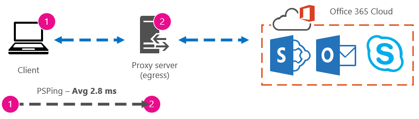

# Office 365-Leistung optimieren mit Basisplänen und Leistungsverlauf 

Es gibt einige einfache Möglichkeiten, die Verbindungsleistung zwischen Office 365 und Ihrem Unternehmen zu überprüfen, mit der Sie einen groben Basisplan für Ihre Konnektivität festlegen können. Wenn Sie den Leistungsverlauf Ihrer Clientcomputerverbindungen kennen, können Sie probleme frühzeitig erkennen, identifizieren und vorhersagen.
  
Wenn Sie es nicht gewohnt sind, an Leistungsproblemen zu arbeiten, soll dieser Artikel Ihnen dabei helfen, einige häufige Fragen zu berücksichtigen, wie Wie wissen Sie, dass das Problem, das Sie sehen, ein Leistungsproblem ist und kein Office 365 Dienstvorfall? Wie können Sie langfristig eine gute Leistung planen? Wie können Sie die Leistung im Auge behalten? Wenn Ihr Team oder Ihre Clients bei der Verwendung von Office 365 eine langsame Leistung sehen und Sie sich fragen, was diese Fragen sind, lesen Sie weiter.
  
> [!IMPORTANT]
> **Haben Sie derzeit ein Leistungsproblem zwischen Ihrem Client und Office 365?** Führen Sie die schritte aus dem [Leistungsbehandlungsplan für Office 365.](performance-troubleshooting-plan.md) 
    
## Etwas, das Sie über Office 365 wissen sollten

Office 365 befindet sich in einem leistungsstarken, dedizierten Microsoft-Netzwerk, das nicht nur von der Automatisierung, sondern auch von echten Personen kontinuierlich überwacht wird. Ein Teil der Rolle der Verwaltung der Office 365 ist die Optimierung und Optimierung der Leistung, wo dies möglich ist. Da Clients der Office 365 über das Internet eine Verbindung herstellen müssen, gibt es kontinuierliche Anstrengungen, die Leistung auch für Office 365 zu optimieren. Leistungsverbesserungen werden in der Cloud nie wirklich beendet, und es gibt eine menge erfahrungs gesammelte Erfahrung, um die Cloud fehlerfrei und schnell zu halten. Sollte es zu einem Leistungsproblem kommen, das eine Verbindung zwischen Ihrem Standort und Office 365, ist es am besten, nicht mit einem Supportfall zu beginnen und zu warten. Stattdessen sollten Sie beginnen, das Problem "von innen nach außen" zu untersuchen. Das heißt, beginnen Sie innerhalb Ihres Netzwerks, und arbeiten Sie sich an Office 365. Bevor Sie einen Fall mit Office 365 öffnen, können Sie Daten sammeln und Aktionen ergreifen, die Ihr Problem untersuchen und möglicherweise beheben.
  
> [!IMPORTANT]
> Beachten Sie die Kapazitätsplanung und Grenzwerte in Office 365. Diese Informationen machen Sie beim Versuch, ein Leistungsproblem zu beheben, vor der Kurve. Hier finden Sie einen Link zu den Microsoft 365 [und Office 365 Dienstbeschreibungen](/office365/servicedescriptions/office-365-service-descriptions-technet-library). Dies ist ein zentraler Hub, und alle von Office 365 angebotenen Dienste verfügen über einen Link, der von hier aus zu ihren eigenen Dienstbeschreibungen führt. Das bedeutet, wenn Sie die Standardbeschränkungen für SharePoint Online sehen müssen, klicken Sie beispielsweise auf [SharePoint Onlinedienstbeschreibung,](/office365/servicedescriptions/sharepoint-online-service-description/sharepoint-online-service-description) und suchen Sie den Abschnitt SharePoint [Onlinelimits](/office365/servicedescriptions/sharepoint-online-service-description/sharepoint-online-limits). 
  
Stellen Sie sicher, dass Sie bei der Problembehandlung mit dem Verständnis beginnen, dass die Leistung eine gleitbare Skalierung ist. Es geht nicht darum, einen idealisierten Wert zu erreichen und ihn dauerhaft zu erhalten (wenn Sie der Meinung sind, dass dies so ist, sind gelegentliche Aufgaben mit hoher Bandbreite wie das Einsteigen einer großen Anzahl von Benutzern oder das Durchführen großer Datenmigrationen sehr stressig – planen Sie daher leistungsauswirkungen. Sie können und sollten eine grobe Vorstellung von Ihren Leistungszielen haben, aber viele Variablen spielen in der Leistung eine Rolle, daher variiert die Leistung. Das ist die Art der Leistung. 
  
Bei der Leistungsbehandlung geht es nicht darum, bestimmte Ziele zu erreichen und diese Zahlen auf unbestimmte Zeit zu erhalten, sondern darum, vorhandene Aktivitäten zu verbessern, wenn alle Variablen vorhanden sind. 
  
## Okay, wie sieht ein Leistungsproblem aus?

Zunächst müssen Sie sicherstellen, dass es sich bei dem Auftreten tatsächlich um ein Leistungsproblem und nicht um einen Dienstvorfall handelt. Ein Leistungsproblem ist anders als bei einem Dienstvorfall in Office 365. Hier erfahren Sie, wie sie voneinander getrennt werden.
  
Wenn beim Office 365 Probleme auftreten, handelt es sich um einen Dienstvorfall. Rote oder gelbe Symbole werden unter Aktuelle Integrität **im** Microsoft 365 Admin Center angezeigt. Möglicherweise wird auch eine langsame Leistung auf Clientcomputern mit verbindungen Office 365. Wenn z. B. die aktuelle Integrität  ein rotes Symbol meldet und Sie untersuchen neben Exchange sehen, erhalten Sie möglicherweise auch eine Reihe von Anrufen von Personen in Ihrer Organisation, die sich darüber beschweren, dass Clientpostfächer, die Exchange Online verwenden, schlecht ausgeführt werden. In diesem Fall kann davon ausgegangen werden, dass ihre Exchange Online gerade ein Opfer von Problemen innerhalb des Diensts wurde. 
  

  
An diesem Punkt sollten Sie, Office 365 Administrator, den aktuellen Status überprüfen und dann Details und Verlauf anzeigen **,** häufig, um über die Wartung auf dem System auf dem laufenden zu bleiben.  Das **Aktuelle Integritätsdashboard** wurde erstellt, um Sie über Änderungen und Probleme im Dienst zu aktualisieren. Die Notizen und Erläuterungen, die in den Integritätsverlauf geschrieben wurden, admin to admin, helfen Ihnen dabei, Ihre Auswirkungen zu messen und Sie über laufende Arbeit auf dem Laufenden zu halten. 
  

  
Bei einem Leistungsproblem handelt es sich nicht um einen Dienstvorfall, auch wenn Vorfälle zu leistungssenkungen führen können. Ein Leistungsproblem sieht wie dies aus:
  
- Es tritt ein Leistungsproblem auf, unabhängig davon, was das Admin Center **Aktuelle Integrität** für den Dienst meldet. 
    
-  Ein Verhalten, das bisher relativ nahtlos war, dauert lange, bis es abgeschlossen ist oder nie abgeschlossen ist. 
    
- Sie können das Problem auch replizieren, oder Sie wissen zumindest, dass es passiert, wenn Sie die richtigen Schritte ausführen.
    
-  Wenn das Problem zeitweise besteht, gibt es immer noch ein Muster, z. B. wissen Sie, dass Sie bis 10:00 Uhr Anrufe von Benutzern erhalten, die nicht zuverlässig auf Office 365 zugreifen können, und dass die Anrufe gegen Mittag absterben. 
    
Das klingt wahrscheinlich vertraut. vielleicht zu vertraut. Sobald Sie wissen, dass es sich um ein Leistungsproblem gibt, wird die Frage gestellt: "Was machen Sie als Nächstes?" Der Rest dieses Artikels hilft Ihnen dabei, genau das zu bestimmen.
  
## Definieren und Testen des Leistungsproblems

Im Laufe der Zeit treten häufig Leistungsprobleme auf, sodass es schwierig sein kann, das eigentliche Problem zu definieren. Sie müssen eine gute Problem-Anweisung und eine gute Vorstellung vom Problemkontext erstellen, und dann müssen Sie wiederholbare Testschritte ausführen, um den Tag zu gewinnen. Andernfalls können Sie ohne eigenes Verschulden verloren gehen. Warum? Nun, hier sind einige Beispiele für Problemanweisungen, die nicht genügend Informationen enthalten:
  
- Der Wechsel von meinem Posteingang zu meinem Kalender war mir nicht aufgefallen, und jetzt ist es eine Kaffeepause. Können Sie dies wie gewohnt tun?
    
- Das Hochladen meiner Dateien in SharePoint Online wird für immer dauern. Warum ist es am Nachmittag langsam, aber zu einem anderen Zeitpunkt ist es schnell? Kann es nicht einfach schnell sein?
    
Die obigen Problemanweisungen stellen mehrere große Herausforderungen dar. Insbesondere gibt es viele Mehrdeutigkeiten, die zu beseitigen sind. Beispiel:
  
- Es ist unklar, wie der Wechsel zwischen Posteingang und Kalender verwendet wurde, um auf dem Laptop zu agieren.
    
- Wenn der Benutzer "Kann es nicht einfach schnell sein" sagt, was ist "schnell"?
    
- Wie lange ist "forever"? Handelt es sich um mehrere Sekunden oder Minuten, oder könnte der Benutzer zum Mittagessen gehen und zehn Minuten nach dem Wiederkommen des Benutzers fertig sein?
    
All dies ist ohne zu beachten, dass der Administrator und die Problembehandlung viele Details aus Problemanweisungen wie diesen nicht kennen können. Beispielsweise, als das Problem begann. Dass der Benutzer von zu Hause aus arbeitet und nur langsames Wechseln in einem Heimnetzwerk sieht; Dass der Benutzer mehrere andere RAM-intensive Anwendungen auf dem lokalen Client ausführen muss, oder dass der Benutzer ein älteres Betriebssystem ausgeführt hat oder die letzten Updates nicht ausgeführt hat.
  
Wenn Benutzer ein Leistungsproblem melden, müssen viele Informationen gesammelt werden. Das Sammeln dieser Informationen ist Teil eines Prozesses, der als Problemsuche oder Untersuchung bezeichnet wird. Im Folgenden finden Sie eine grundlegende Scopingliste, mit der Sie Informationen zu Ihrem Leistungsproblem erfassen können. Diese Liste ist nicht vollständig, aber es ist ein Ort, um eine ihrer eigenen zu starten: 
  
- An welchem Datum ist das Problem passiert, und zu welcher Tages- oder Nachtzeit?
    
- Welche Art von Clientcomputer haben Sie verwendet, und wie stellt er eine Verbindung mit dem Geschäftsnetzwerk (VPN, Verkabelt, Drahtlos) ein?
    
- Arbeiteten Sie remote oder waren Sie im Büro?
    
- Haben Sie die gleichen Aktionen auf einem anderen Computer versucht und dasselbe Verhalten angezeigt?
    
- Gehen Sie durch die Schritte, die Ihnen das Problem machen, damit Sie die Aktionen schreiben können, die Sie ausführen.
    
- Wie langsam ist die Leistung in Sekunden oder Minuten?
    
- Wo auf der Welt befinden Sie sich?
    
Einige dieser Fragen sind offensichtlicher als andere. Die meisten werden verstehen, dass eine Problembehandlung die genauen Schritte zum Reproduzieren des Problems benötigt. Wie sonst können Sie aufzeichnen, was falsch ist, und wie sonst können Sie testen, ob das Problem behoben ist? Weniger offensichtlich sind Dinge wie "Welches Datum und welche Uhrzeit haben Sie das Problem sehen?", und "Wo auf der Welt befinden Sie sich?", Informationen, die zusammen verwendet werden können. Je nachdem, wann der Benutzer gearbeitet hat, kann ein paar Stunden Zeitunterschied bedeuten, dass in Teilen des Unternehmensnetzwerks bereits Wartungsarbeiten durchgeführt werden. Wenn Ihr Unternehmen beispielsweise über eine Hybridimplementierung verfügt, z. B. eine hybride SharePoint-Suche, die Suchindizes sowohl in SharePoint Online als auch in einer lokalen SharePoint Server 2013-Instanz abfragen kann, werden möglicherweise Updates in der lokalen Farm ausgeführt. Wenn Sich Ihr Unternehmen in der Cloud befindet, kann die Systemwartung das Hinzufügen oder Entfernen von Netzwerkhardware, das Roll-out von unternehmensweiten Updates oder das Vornehmen von Änderungen an DNS oder einer anderen Kerninfrastruktur umfassen.
  
Wenn Sie ein Leistungsproblem beheben, ist es ein wenig wie ein Tatort, Sie müssen präzise und aufmerksam sein, um aus den Nachweisen Schlussfolgerungen zu ziehen. Dazu müssen Sie eine gute Problembeweisung erhalten, indem Sie Nachweise sammeln. Es sollte den Computerkontext, den Kontext des Benutzers, den Zeitpunkt des Problems und die genauen Schritte enthalten, die das Leistungsproblem offengelegt haben. Diese Problem-Anweisung sollte die oberste Seite in Ihren Notizen sein und bleiben. Wenn Sie die Problem-Anweisung erneut durchgehen, nachdem Sie an der Lösung arbeiten, nehmen Sie die Schritte vor, um zu testen und zu überprüfen, ob das Problem durch die von Ihnen durchgeführten Aktionen behoben wurde. Dies ist wichtig, um zu wissen, wann Ihre Arbeit dort erledigt ist.
  
## Wissen Sie, wie die Leistung bei guter Leistung aussingt?

Wenn Sie Pech haben, weiß niemand. Niemand hatte Zahlen. Das bedeutet, dass niemand die einfache Frage "Wie viele Sekunden hat es ge dauert, um einen Posteingang in Office 365 auf den Markt zu bringen?" oder "Wie lange hat es ge dauert, bis die Führungskräfte eine Lync Online-Besprechung hatten?" beantworten, was für viele Unternehmen ein gängiges Szenario ist.
  
Was hier fehlt, ist eine Leistungsbasislinie.
  
Baselines geben Ihnen einen Kontext für Ihre Leistung. Sie sollten einen Basisplan gelegentlich bis häufig verwenden, je nach den Anforderungen Ihres Unternehmens. Wenn Sie ein größeres Unternehmen sind, kann Ihr Betriebsteam bereits Basiswerte für Ihre lokale Umgebung erstellen. Wenn Sie beispielsweise alle Exchange-Server am ersten Montag des Monats und alle ihre SharePoint-Server am dritten Montag patchen, verfügt Ihr Betriebsteam wahrscheinlich über eine Liste von Aufgaben und Szenarien, die nach dem Patchen ausgeführt werden, um zu belegen, dass wichtige Funktionen funktionsfähig sind. Öffnen Sie beispielsweise den Posteingang, klicken Sie auf Senden/Empfangen, und stellen Sie sicher, dass die Ordner aktualisiert werden, oder durchsuchen Sie in SharePoint die Hauptseite der Website, gehen Sie zur Unternehmenssuchseite, und führen Sie eine Suche durch, die Ergebnisse zurückgibt.
  
Wenn Sich Ihre Anwendungen in Office 365 befinden, können Sie die Zeit (in Millisekunden) von einem Clientcomputer innerhalb Ihres Netzwerks bis zu einem Ausgangspunkt oder dem Punkt, an dem Sie Ihr Netzwerk verlassen und zu Office 365. Hier sind einige hilfreiche Basiswerte, die Sie untersuchen und aufzeichnen können:
  
- Identifizieren Sie die Geräte zwischen Ihrem Clientcomputer und Ihrem Ausgangspunkt, z. B. Ihrem Proxyserver.
    
  - Sie müssen Ihre Geräte kennen, damit Sie über Kontext (IP-Adressen, Gerätetyp usw.) für leistungsbezogene Probleme verfügen.
    
  - Proxyserver sind häufige Ausgangspunkte, sodass Sie ihren Webbrowser überprüfen können, um zu sehen, welcher Proxyserver verwendet werden soll( falls vorhanden).
    
  - Es gibt Tools von Drittanbietern, die Ihr Netzwerk ermitteln und zuordnungen können, aber die sicherste Möglichkeit, Ihre Geräte zu kennen, ist, ein Mitglied Ihres Netzwerkteams zu fragen.
    
- Identifizieren Sie Ihren Internetdienstanbieter(ISP), notieren Sie sich ihre Kontaktinformationen, und fragen Sie, wie viele Schaltungen über die bandbreite verfügen.
    
- Identifizieren Sie in Ihrem Unternehmen Ressourcen für die Geräte zwischen Ihrem Client und dem Ausgangspunkt, oder identifizieren Sie einen Notfallkontakt, mit dem Sie über Netzwerkprobleme sprechen können.
    
Hier sind einige Basiswerte, die einfache Tests mit Tools für Sie berechnen können:
  
- Zeit vom Clientcomputer zum Ausgangspunkt in Millisekunden
    
- Zeit vom Ausgangspunkt bis Office 365 in Millisekunden
    
- Speicherort in der Welt des Servers, der die URLs für Office 365 beim Browsen aufhebt
    
- Die Geschwindigkeit der DNS-Auflösung Ihres Internetdienstanbieters in Millisekunden, Inkonsistenzen beim Eintreffen von Paketen (Netzwerk jitter), Upload- und Downloadzeiten in Millisekunden
    
Wenn Sie nicht mit der Durchführung dieser Schritte vertraut sind, gehen wir in diesem Artikel ausführlicher darauf ein. 
  
## Was ist ein Basisplan?

Sie werden die Auswirkungen kennen, wenn sie schlecht sind, aber wenn Sie Ihre historischen Leistungsdaten nicht kennen, ist es nicht möglich, einen Kontext dafür zu haben, wie schlecht und wann sie geworden sein könnten. Ohne Basisplan fehlt ihnen also der entscheidende Hinweis zum Lösen des Puzzles: das Bild im Puzzlefeld. Bei der Leistungsbehandlung benötigen Sie einen *Vergleichspunkt.* Einfache Leistungsgrundwerte sind nicht schwer zu nehmen. Ihr Operations-Team kann mit der Ausführung dieser Aufgaben nach einem Zeitplan bef?nnen. Angenommen, Ihre Verbindung sieht wie die folgende aus: 
  

  
Das heißt, Sie haben sich mit Ihrem Netzwerkteam abgesendet und festgestellt, dass Sie Ihr Unternehmen über einen Proxyserver für das Internet verlassen und dass dieser Proxy alle Anforderungen verarbeitet, die Ihr Clientcomputer an die Cloud sendet. In diesem Fall sollten Sie eine vereinfachte Version Ihrer Verbindung zeichnen, in der alle dazwischen liegenden Geräte aufgeführt sind. Fügen Sie nun Tools ein, mit denen Sie die Leistung zwischen dem Client, dem Ausgangspunkt (wo Sie Ihr Netzwerk für das Internet verlassen) und der Office 365 testen können.
  

  
Die Optionen werden  aufgrund  der Menge an Fachwissen, die Sie zum Suchen der Leistungsdaten benötigen, als einfach und erweitert aufgeführt. Eine Netzwerkverfolgung dauert im Vergleich zum Ausführen von Befehlszeilentools wie PsPing und TraceTCP sehr viel Zeit. Diese beiden Befehlszeilentools wurden ausgewählt, da sie keine ICMP-Pakete verwenden, die von Office 365 blockiert werden, und weil sie die Zeit in Millisekunden angeben, die benötigt wird, um den Clientcomputer oder Proxyserver (wenn Sie Zugriff haben) zu verlassen und zu Office 365. Jeder einzelne Hop von einem Computer zum anderen wird mit einem Zeitwert enden, und das ist ideal für Baselines! Ebenso wichtig ist, dass Sie mit diesen Befehlszeilentools dem Befehl eine Portnummer hinzufügen können, da Office 365 über Port 443 kommuniziert, bei dem es sich um den Port handelt, der von SSL und TLS (Secure Sockets Layer and Transport Layer Security) verwendet wird. Andere Drittanbietertools sind jedoch möglicherweise bessere Lösungen für Ihre Situation. Microsoft unterstützt nicht alle diese Tools. Wenn PsPing und TraceTCP aus einem bestimmten Grund nicht funktionieren, wechseln Sie mit einem Tool wie Netmon zu einer Netzwerkverfolgung. 
  
Sie können einen Basisplan vor den Geschäftszeiten, erneut bei starker Nutzung und dann nach Stunden erneut verwenden. Dies bedeutet, dass Sie möglicherweise eine Ordnerstruktur haben, die am Ende ein wenig wie dies aussieht:
  

  
Sie sollten auch eine Benennungskonvention für Ihre Dateien auswählen. Hier sind einige Beispiele:
  
- Feb_09_2015_9amPST_PerfBaseline_Netmon_ClientToEgress_Normal
    
- Jan_10_2015_3pmCST_PerfBaseline_PsPing_ClientToO365_bypassProxy_SLOW
    
- Feb_08_2015_2pmEST_PerfBaseline_BADPerf
    
- Feb_08_2015_8-30amEST_PerfBaseline_GoodPerf
    
Es gibt viele verschiedene Möglichkeiten, dies zu tun, aber die Verwendung des Formats **\<dateTime\>\<what's happening in the test\>** ist ein guter Anfangsort. Die sorgfältige Arbeit in dieser Frage hilft ihnen sehr, wenn Sie später versuchen, Probleme zu beheben. Später können Sie sagen: "Ich habe zwei Spuren am 8. Februar 2013 nennen, eine hat eine gute Leistung gezeigt und eine schlechte, damit wir sie vergleichen können". Dies ist für die Problembehandlung äußerst hilfreich. 
  
Sie benötigen eine organisierte Methode, um Ihre historischen Basiswerte zu erhalten. In diesem Beispiel haben die einfachen Methoden drei Befehlszeilenausgaben erzeugt, und die Ergebnisse wurden als Screenshot gesammelt, aber möglicherweise verfügen Sie stattdessen über Netzwerkaufnahmedateien. Verwenden Sie die Methode, die für Sie am besten funktioniert. Store Sie ihre historischen Basiswerte ein, und verweisen Sie an Punkten darauf, an denen Sie Änderungen im Verhalten von Onlinediensten bemerken. 
  
## Warum leistungsdaten während eines Pilotprojekts sammeln?

Es gibt keinen besseren Zeitpunkt, um Mit dem Erstellen von Basiswerten zu beginnen, als während eines Pilotversuchs Office 365 Dienst. Ihr Büro kann Tausende von Benutzern haben, Hunderttausende oder fünf, aber auch bei einer kleinen Anzahl von Benutzern können Sie Tests durchführen, um Leistungsschwankungen zu messen. Bei einem großen Unternehmen kann eine repräsentative Stichprobe von mehreren hundert Benutzern, die Office 365 pilotieren, nach außen auf mehrere Tausend projiziert werden, damit Sie wissen, wo Probleme auftreten können, bevor sie auftreten.
  
Im Fall eines kleinen Unternehmens, bei dem das On-Boarding bedeutet, dass alle Benutzer gleichzeitig zum Dienst wechseln und es kein Pilotprojekt gibt, sollten Sie Leistungsmaßnahmen so durchführen, dass Sie Daten für alle Benutzer anzeigen können, die möglicherweise Probleme bei der Problembehandlung für einen schlecht ausführenden Vorgang haben. Wenn Sie z. B. bemerken, dass Sie ihr Gebäude in der Zeit, in der es zum Hochladen einer mittelgroßen Grafik benötigt wird, plötzlich um ihr Gebäude herumspazieren können, wo es früher sehr schnell passiert ist.
  
## Sammeln von Basiswerten

Für alle Problembehandlungspläne müssen Sie diese Dinge mindestens identifizieren:
  
- Der clientcomputer, den Sie verwenden (der Typ des Computers oder Geräts, eine IP-Adresse und die Aktionen, die das Problem verursacht haben)
    
- Wo sich der Clientcomputer in der Welt befindet (z. B. ob dieser Benutzer über ein VPN zum Netzwerk, remote oder im Unternehmensintranet arbeitet)
    
- Der Ausgangspunkt, den der Clientcomputer von Ihrem Netzwerk aus verwendet (der Punkt, an dem Der Datenverkehr Ihr Unternehmen für einen Internetdienstanbieter oder das Internet verlässt)
    
 Sie können das Layout Ihres Netzwerks vom Netzwerkadministrator herausfinden. Wenn Sie sich in einem kleinen Netzwerk befinden, schauen Sie sich die Geräte an, die Sie mit dem Internet verbinden, und rufen Sie Ihren Internetdienstanbieter an, wenn Sie Fragen zum Layout haben. Erstellen Sie eine Grafik des endgültigen Layouts für Ihren Verweis. 
  
Dieser Abschnitt ist in einfache Befehlszeilentools und -methoden und erweiterte Toolsoptionen gebrochen. Wir werden zunächst einfache Methoden abdecken. Wenn Sie derzeit jedoch ein Leistungsproblem haben, sollten Sie zu erweiterten Methoden wechseln und den Beispielaktionsplan zur Leistungsproblembehandlung ausprobieren.
  
### Einfache Methoden

Das Ziel dieser einfachen Methoden besteht darin, einfache Leistungsgrundwerte im Laufe der Zeit zu verwenden, zu verstehen und ordnungsgemäß zu speichern, damit Sie über die leistung Office 365 werden. Hier ist das sehr einfache Diagramm für einfache, wie Sie es zuvor gesehen haben:
  

  
> [!NOTE]
> TraceTCP ist in diesem Screenshot enthalten, da es ein nützliches Tool ist, um in Millisekunden anzuzeigen, wie lange eine Anforderung dauert und wie viele Netzwerkhops oder Verbindungen von einem Computer zum nächsten die Anforderung benötigt, um ein Ziel zu erreichen. TraceTCP kann auch die Namen von Servern geben, die während hops verwendet werden, was für eine Microsoft Office 365 im Support hilfreich sein kann. > TraceTCP-Befehle können sehr einfach sein, z. B.: >> Denken Sie daran, die Portnummer in den  `tracetcp.exe outlook.office365.com:443` Befehl zu schließen! > [TraceTCP ist](https://simulatedsimian.github.io/tracetcp_download.html) ein kostenloser Download, basiert jedoch auf Wincap. Wincap ist ein Tool, das auch von Netmon verwendet und installiert wird. Wir verwenden netmon auch im Abschnitt erweiterte Methoden. 
  
 Wenn Sie über mehrere Niederlassungen verfügen, müssen Sie auch an jedem dieser Standorte einen Satz von Daten von einem Client speichern. Dieser Test misst die Latenz, was in diesem Fall ein Zahlenwert ist, der den Zeitraum zwischen dem Senden einer Anforderung an Office 365 und Office 365 antwort auf die Anforderung beschreibt. Der Test stammt aus Ihrer Domäne auf einem Clientcomputer und soll einen Roundtrip von innerhalb Ihres Netzwerks, über einen Ausgangspunkt, über das Internet zu Office 365 und zurück messen. 
  
Es gibt einige Möglichkeiten, um mit dem Ausgangspunkt, in diesem Fall mit dem Proxyserver, um zu umgehen. Sie können entweder von 1 bis 2 und dann von 2 bis 3 ablaufen und dann die Zahlen in Millisekunden hinzufügen, um eine endgültige Summe am Rand Ihres Netzwerks zu erhalten. Sie können die Verbindung auch so konfigurieren, dass der Proxy für Office 365 wird. In einem größeren Netzwerk mit einer Firewall, einem Reverseproxy oder einer Kombination aus beiden müssen Sie möglicherweise Ausnahmen auf dem Proxyserver machen, mit denen Datenverkehr für viele URLs übergeben werden kann. Die Liste der endpunkte, die von Office 365 verwendet werden, finden Sie [unter Office 365 URLs und IP-Adressbereiche](https://support.office.com/article/8548a211-3fe7-47cb-abb1-355ea5aa88a2). Wenn Sie über einen Authentifizierungsproxy verfügen, testen Sie zunächst Ausnahmen für Folgendes:
  
- Ports 80 und 443
    
- TCP und HTTPs
    
- Ausgehende Verbindungen zu einer der folgenden URLs:
    
- \*.microsoftonline.com
    
- \*.microsoftonline-p.com
    
- \*.sharepoint.com
    
- \*.outlook.com
    
- \*.lync.com
    
- osub.microsoft.com
    
Alle Benutzer müssen ohne Proxy-Interferenzen oder Authentifizierung zu diesen Adressen kommen dürfen. In einem kleineren Netzwerk sollten Sie diese der Proxyumgehungsliste in Ihrem Webbrowser hinzufügen. 
  
Um diese ihrer Proxyumgehungsliste in Internet Explorer hinzuzufügen, wechseln Sie zu **Tools** \> **Internet Options** \> **Connections** LAN \> **settings** \> **Advanced**. Auf der erweiterten Registerkarte finden Sie auch den Proxyserver- und Proxyserverport. Möglicherweise müssen Sie auf das Kontrollkästchen **Proxyserver für** Ihr LAN verwenden klicken, um auf die **Schaltfläche Erweitert zu** zugreifen. Sie sollten sicherstellen, dass der **Proxyserver umgehen für lokale** Adressen aktiviert ist. Sobald Sie auf **Erweitert** geklickt haben, wird ein Textfeld angezeigt, in dem Sie Ausnahmen eingeben können. Trennen Sie die oben aufgeführten Platzhalter-URLs durch Semikolon, z. B.:
  
\*.microsoftonline.com; \*.sharepoint.com
  
Nachdem Sie den Proxy umgangen haben, sollten Sie ping oder PsPing direkt für eine Office 365 verwenden können. Im nächsten Schritt testen Sie ping **outlook.office365.com**. Oder wenn Sie PsPing oder ein anderes Tool verwenden, mit dem Sie dem Befehl eine Portnummer angeben können, wird psPing für **portal.microsoftonline.com:443,** um die durchschnittliche Roundtripzeit in Millisekunden zu sehen. 
  
Die Roundtripzeit oder RTT ist ein Zahlenwert, der misst, wie lange es dauert, eine HTTP-Anforderung an einen Server wie outlook.office365.com zu senden und eine Antwort zurück zu erhalten, die bestätigt, dass der Server weiß, dass Sie dies getan haben. Dies wird manchmal als RTT abgekürzt. Dies sollte relativ kurz sein.
  
Sie müssen [PSPing](/sysinternals/downloads/psping) oder ein anderes Tool verwenden, das keine ICMP-Pakete verwendet, die von Office 365 blockiert werden, um diesen Test durchführen zu können. 
  
 **So verwenden Sie PsPing, um eine allgemeine Roundtripzeit in Millisekunden direkt aus einer Office 365 erhalten**
  
1. Führen Sie eine Eingabeaufforderung mit erhöhten Rechten aus, indem Sie die folgenden Schritte ausführen:
    
1. Klicken Sie auf **Start**.
    
2. Geben Sie **im Feld Suche starten** cmd ein, und drücken Sie strg+UMSCHALT+EINGABETASTE.
    
3. Wenn das Dialogfeld **Benutzerkontensteuerung** eingeblendet wird, bestätigen Sie die angegebene Aktion und klicken dann auf **Weiter**.
    
2. Navigieren Sie zu dem Ordner, in dem das Tool (in diesem Fall PsPing) installiert ist, und testen Sie die folgenden Office 365 URLs:
    
  - psping portal.office.com:443
    
  - psping microsoft-my.sharepoint.com:443
    
  - psping outlook.office365.com:443
    
  - psping www.yammer.com:443
    
    
  
Achten Sie darauf, die Portnummer 443 zu verwenden. Denken Sie daran Office 365 auf einem verschlüsselten Kanal funktioniert. Wenn Sie psPing ohne Portnummer verwenden, wird die Anforderung fehlschlagen. Nachdem Sie die kurze Liste angepingt haben, suchen Sie nach der durchschnittlichen Zeit in Millisekunden (ms). Das möchten Sie aufzeichnen!
  

  
Wenn Sie mit der Proxyumgehung nicht vertraut sind und es vorziehen, Schritt für Schritt zu gehen, müssen Sie zuerst den Namen Ihres Proxyservers herausfinden. Wechseln Sie in Internet Explorer zu **Tools** \> **Internet Options** \> **Connections** LAN \> **settings** \> **Advanced**. Auf **der** Registerkarte Erweitert wird der Proxyserver aufgeführt. Pingen Sie diesen Proxyserver an einer Eingabeaufforderung, indem Sie diese Aufgabe ausführen: 
  
 **So pingen Sie den Proxyserver, und erhalten Sie einen Roundtripwert in Millisekunden für Stufe 1 bis 2**
  
1. Führen Sie eine Eingabeaufforderung mit erhöhten Rechten aus, indem Sie die folgenden Schritte ausführen:
    
1. Klicken Sie auf **Start**.
    
2. Geben Sie **im Feld Suche starten** cmd ein, und drücken Sie strg+UMSCHALT+EINGABETASTE.
    
3. Wenn das Dialogfeld **Benutzerkontensteuerung** eingeblendet wird, bestätigen Sie die angegebene Aktion und klicken dann auf **Weiter**.
    
2. Geben Sie ping \<the name of the proxy server your browser uses, or the IP address of the proxy server\> ein, und drücken Sie die EINGABETASTE. Wenn Sie PsPing oder ein anderes Tool installiert haben, können Sie stattdessen dieses Tool verwenden. 
    
    Ihr Befehl kann wie jedes der folgenden Beispiele aussehen: 
    
  - ping ourproxy.ourdomain.industry.business.com
    
  - ping 155.55.121.55
    
  - ping ourproxy
    
  - psping ourproxy.ourdomain.industry.business.com:80
    
  - psping 155.55.121.55:80
    
  - psping ourproxy:80
    
3. Wenn die Ablaufverfolgung das Senden von Testpaketen beendet, erhalten Sie eine kleine Zusammenfassung, die einen Durchschnitt in Millisekunden auflistet, und das ist der Wert, nach dem Sie sind. Machen Sie einen Screenshot der Eingabeaufforderung, und speichern Sie sie mithilfe Ihrer Benennungskonvention. An diesem Punkt kann es auch hilfreich sein, das Diagramm mit dem Wert zu füllen.
    
Vielleicht haben Sie am frühen Morgen eine Ablaufverfolgung genommen, und Ihr Client kann schnell zum Proxy (oder zu jedem aus dem Internet aussteigenden Server) zugreifen. In diesem Fall können Ihre Zahlen wie dies aussehen:
  

  
Wenn Ihr Clientcomputer einer der wenigen ausgewählten Computer mit Zugriff auf den Proxyserver (oder Denkserver) ist, können Sie die nächste Testrunde ausführen, indem Sie eine Remoteverbindung mit diesem Computer herstellen und von dort aus die Eingabeaufforderung für PsPing zu einer Office 365-URL ausführen. Wenn Sie keinen Zugriff auf diesen Computer haben, können Sie sich mit Ihren Netzwerkressourcen in Verbindung setzen, um Hilfe beim nächsten Schritt zu erhalten und auf diese Weise genaue Zahlen zu erhalten. Wenn dies nicht möglich ist, verwenden Sie ein PsPing für die Office 365-URL, und vergleichen Sie sie mit der PsPing- oder Pingzeit mit Ihrem Proxyserver. 
  
Wenn Sie z. B. 51,84 Millisekunden vom Client bis zur Office 365-URL und 2,8 Millisekunden vom Client zum Proxy (oder Ausgangspunkt) haben, haben Sie 49,04 Millisekunden vom Ausgangspunkt bis Office 365. Wenn Sie während der Tageshöhe einen PsPing von 12,25 Millisekunden vom Client zum Proxy und 62,01 Millisekunden vom Client zur Office 365-URL haben, beträgt der durchschnittliche Wert für den Proxy-Abgress zur Office 365-URL 49,76 Millisekunden.
  

  
Im Hinblick auf die Problembehandlung finden Sie möglicherweise etwas Interessantes, indem Sie diese Basiswerte behalten. Beispiel: Wenn Sie feststellen, dass Sie im Allgemeinen über eine Wartezeit von ca. 40 bis 59 Millisekunden vom Proxy oder Ausstieg auf die Office 365-URL verfügen und über einen Client verfügen, der eine Proxy- oder Ausgangspunktlatenz von ca. 3 bis 7 Millisekunden hat (abhängig von der Menge des Netzwerkdatenverkehrs, den Sie während dieser Tageszeit sehen), dann wissen Sie sicher, dass etwas problematisch ist, wenn Ihre letzten drei Client- oder Ausgangsbasiswerte eine Latenz von 45 Millisekunden anzeigen.
  
### Erweiterte Methoden

Wenn Sie wirklich wissen möchten, was mit Ihren Internetanforderungen an Office 365 geschieht, müssen Sie sich mit Netzwerkverfolgungen vertraut machen. Es spielt keine Rolle, welche Tools Sie für diese Ablaufverfolgungen bevorzugen, HTTPWatch, Netmon, Message Analyzer, Wireshark, Fiddler, Developer Dashboard tool oder ein anderes Tool, solange dieses Tool den Netzwerkdatenverkehr erfassen und filtern kann. In diesem Abschnitt sehen Sie, dass es von Vorteil ist, mehrere dieser Tools ausführen zu können, um ein vollständigeres Bild des Problems zu erhalten. Wenn Sie testen, fungieren einige dieser Tools auch als Eigene Proxys. Zu den tools used in the companion article, [Performance troubleshooting plan for Office 365](performance-troubleshooting-plan.md), include [Netmon 3.4](https://www.microsoft.com/download/details.aspx?id=4865), [HTTPWatch](https://www.httpwatch.com/download/), or [WireShark](https://www.wireshark.org/).
  
Das Erstellen einer Leistungsbasislinie ist der einfache Teil dieser Methode, und viele der Schritte sind identisch mit der Behandlung eines Leistungsproblems. Für die fortschrittlicheren Methoden zum Erstellen von Basiswerten für die Leistung müssen Sie Netzwerkverfolgungen erstellen und speichern. In den meisten Beispielen in diesem Artikel wird SharePoint Online verwendet, Sie sollten jedoch eine Liste der allgemeinen Aktionen in den Office 365-Diensten entwickeln, die Sie testen und aufzeichnen. Im Folgenden finden Sie ein Basisbeispiel:
  
- Baseline list for SPO - ** Step 1: ** Browse the home page of the SPO website and do a network trace. Speichern Sie die Ablaufverfolgung. 
    
- Basisplanliste für SPO – **Schritt 2:** Suchen Nach einem Ausdruck (z. B. Ihrem Firmennamen) über Enterprise Suchen und Eine Netzwerkverfolgung. Speichern Sie die Ablaufverfolgung. 
    
- Baseline list for SPO – **Step 3:** Hochladen a large file to a SharePoint Online document library and do a network trace. Speichern Sie die Ablaufverfolgung. 
    
- Baseline list for SPO – **Step 4:** Browse the home page of the OneDrive website and do a network trace. Speichern Sie die Ablaufverfolgung. 
    
Diese Liste sollte die wichtigsten allgemeinen Aktionen enthalten, die Benutzer für online SharePoint ausführen. Beachten Sie, dass im letzten Schritt zur Nachverfolgung von OneDrive for Business ein Vergleich zwischen der Auslastung der SharePoint Online-Homepage (die häufig von Unternehmen angepasst wird) und der selten angepassten OneDrive for Business-Homepage erstellt wird. Dies ist ein sehr grundlegender Test, wenn es um eine langsame SharePoint Onlinewebsite geht. Sie können einen Datensatz dieses Unterschieds in Ihren Tests erstellen.
  
Wenn Sie sich in der Mitte eines Leistungsproblems befinden, sind viele der Schritte identisch mit dem, wenn Sie einen Basisplan erstellen. Netzwerkverfolgungen werden kritisch, daher  behandeln wir, wie die wichtigen Ablaufverfolgungen als Nächstes verwendet werden. 
  
Um ein Leistungsproblem zu  *beheben,*  müssen Sie jetzt eine Ablaufverfolgung zu dem Zeitpunkt, zu dem das Leistungsproblem auftritt, verfolgen. Sie müssen über die richtigen Tools zum Sammeln von Protokollen verfügen, und Sie benötigen einen Aktionsplan, d. h. eine Liste der Zu ergreifende Problembehandlungsaktionen, um die bestmöglichen Informationen zu sammeln. Als Erstes müssen Sie Das Datum und die Uhrzeit des Tests aufzeichnen, damit die Dateien in einem Ordner gespeichert werden können, der den Zeitpunkt wiederspiegelt. Als Nächstes sollten Sie die Problemschritte selbst einstufen. Dies sind die genauen Schritte, die Sie für Tests verwenden werden. Vergessen Sie nicht die Grundlagen: Wenn das Problem nur bei Outlook liegt, müssen Sie sicherstellen, dass das Problemverhalten nur in einem Office 365 ist. Wenn Sie den Umfang dieses Problems einenknen, können Sie sich auf etwas konzentrieren, das Sie beheben können. 
  
## Siehe auch

[Verwalten von Office 365-Endpunkten](https://support.office.com/article/99cab9d4-ef59-4207-9f2b-3728eb46bf9a)