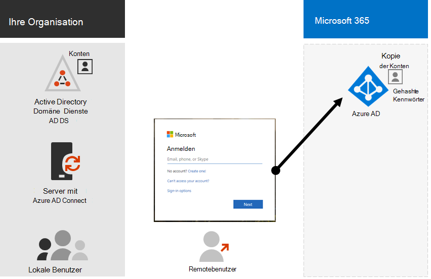
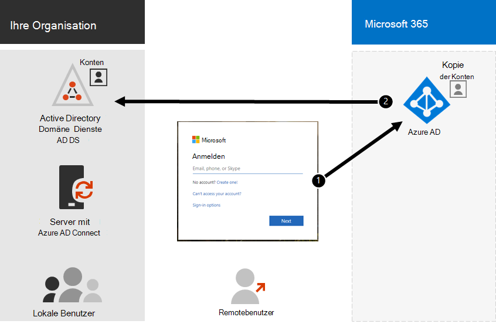

# Hybrididentität und Verzeichnissynchronisierung für Microsoft 365

*Dieser Artikel gilt sowohl für Microsoft 365 Enterprise als auch für Office 365 Enterprise.*

Je nach Ihren Geschäftsanforderungen und technischen Anforderungen ist das Hybrididentitätsmodell und die Verzeichnissynchronisierung die häufigste Wahl für Unternehmenskunden, die Microsoft 365. Mit der Verzeichnissynchronisierung können Sie Identitäten in Ihrem Active Directory Domain Services (AD DS) verwalten, und alle Updates für Benutzerkonten, Gruppen und Kontakte werden mit dem Azure Active Directory(Azure AD)-Mandanten Ihres Microsoft 365-Abonnements synchronisiert.

>[!Note]
>Wenn AD DS-Benutzerkonten zum ersten Mal synchronisiert werden, erhalten sie nicht automatisch eine Microsoft 365-Lizenz und können nicht auf Microsoft 365 zugreifen, z. B. E-Mails. Sie müssen ihnen zuerst einen Verwendungsspeicherort zuweisen. Weisen Sie anschließend diesen Benutzerkonten eine Lizenz zu, entweder einzeln oder dynamisch über die Gruppenmitgliedschaft.
>

## Authentifizierung für Hybrididentität

Bei Verwendung des Hybrididentitätsmodells gibt es zwei Authentifizierungstypen:

- Verwaltete Authentifizierung

  Azure AD verarbeitet den Authentifizierungsprozess mithilfe einer lokal gespeicherten Hashversion des Kennworts oder sendet die Anmeldeinformationen an einen lokalen Software-Agent, der vom lokalen AD DS authentifiziert werden soll.

- Verbundauthentifizierung

  Azure AD leitet den Clientcomputer, der die Authentifizierung anfordert, an einen anderen Identitätsanbieter um.

### Verwaltete Authentifizierung

Es gibt zwei Arten von verwalteter Authentifizierung:

- Kennworthashsynchronisierung (Password hash synchronization, PHS)

  Azure AD führt die Authentifizierung selbst durch.

- Passthrough-Authentifizierung (PTA)

  Azure AD lässt AD DS die Authentifizierung durchführen.

#### Kennworthashsynchronisierung (Password hash synchronization, PHS)

Mit PHS synchronisieren Sie Ihre AD DS-Benutzerkonten mit Microsoft 365 und verwalten Ihre Benutzer lokal. Hashes von Benutzerkennwörtern werden von Ad DS mit Azure AD synchronisiert, sodass die Benutzer lokal und in der Cloud dasselbe Kennwort haben. Dies ist die einfachste Möglichkeit, die Authentifizierung für AD DS-Identitäten in Azure AD zu aktivieren. 

Wenn Kennwörter lokal geändert oder zurückgesetzt werden, werden die neuen Kennworthashes mit Azure AD synchronisiert, sodass Ihre Benutzer immer dasselbe Kennwort für Cloudressourcen und lokale Ressourcen verwenden können. Die Benutzerkennwörter werden niemals an Azure AD gesendet oder in Azure AD im Klartext gespeichert. Einige Premiumfeatures von Azure AD, z. B. Identity Protection, erfordern PHS, unabhängig davon, welche Authentifizierungsmethode ausgewählt ist.
  
Weitere Informationen finden Sie unter Auswählen [der richtigen Authentifizierungsmethode.](/azure/active-directory/hybrid/choose-ad-authn)
  
#### Passthrough-Authentifizierung (PTA)

PTA bietet eine einfache Kennwortüberprüfung für Azure AD-Authentifizierungsdienste mithilfe eines Software-Agents, der auf einem oder mehreren lokalen Servern ausgeführt wird, um die Benutzer direkt mit Ihrem AD DS zu überprüfen. Mit PTA synchronisieren Sie AD DS-Benutzerkonten mit Microsoft 365 und verwalten Ihre Benutzer lokal. 

PTA ermöglicht Es Ihren Benutzern, sich sowohl bei lokalen als auch Microsoft 365 Ressourcen und Anwendungen mit ihrem lokalen Konto und Kennwort zu anmelden. Diese Konfiguration überprüft Benutzerkennwörter direkt mit Ihrem lokalen AD DS, ohne Kennworthashes in Azure AD zu speichern. 

PTA ist auch für Organisationen mit einer Sicherheitsanforderung zum sofortigen Erzwingen von lokalen Benutzerkontozuständen, Kennwortrichtlinien und Anmeldezeiten erforderlich. 
  
Weitere Informationen finden Sie unter Auswählen [der richtigen Authentifizierungsmethode.](/azure/active-directory/hybrid/choose-ad-authn)
  
### Verbundauthentifizierung

Die Verbundauthentifizierung ist in erster Linie für große Unternehmensorganisationen mit komplexeren Authentifizierungsanforderungen. AD DS-Identitäten werden mit Microsoft 365 synchronisiert, und Benutzerkonten werden lokal verwaltet. Bei der Verbundauthentifizierung verfügen Benutzer lokal und in der Cloud über dasselbe Kennwort, und sie müssen sich nicht erneut anmelden, um Microsoft 365. 

Die Verbundauthentifizierung kann zusätzliche Authentifizierungsanforderungen unterstützen, z. B. die smartcardbasierte Authentifizierung oder eine mehrstufige Authentifizierung eines Drittanbieters und ist in der Regel erforderlich, wenn Organisationen eine Authentifizierungsanforderung haben, die nicht systemeigene Unterstützung von Azure AD hat.
 
Weitere Informationen finden Sie unter Auswählen [der richtigen Authentifizierungsmethode.](/azure/active-directory/hybrid/choose-ad-authn)
  
#### Authentifizierungs- und Identitätsanbieter von Drittanbietern

Lokale Verzeichnisobjekte können mit Microsoft 365 synchronisiert werden, und der Zugriff auf Cloudressourcen wird hauptsächlich von einem Identitätsanbieter eines Drittanbieters (IdP) verwaltet. Wenn Ihre Organisation eine Verbundlösung eines Drittanbieters verwendet, können Sie die Anmeldung mit dieser Lösung für Microsoft 365 konfigurieren, sofern die Verbundlösung eines Drittanbieters mit Azure AD kompatibel ist.
  
Weitere Informationen finden Sie in der [Kompatibilitätsliste des Azure](/azure/active-directory/connect/active-directory-aadconnect-federation-compatibility) AD-Verbunds.
  
## AD DS-Vorbereitung

Um einen nahtlosen Übergang zu Microsoft 365 mithilfe der Synchronisierung sicherzustellen, müssen Sie Ihre AD DS-Gesamtstruktur vorbereiten, bevor Sie mit der Microsoft 365 der Verzeichnissynchronisierung beginnen.
  
Die Verzeichnisvorbereitung sollte sich auf die folgenden Aufgaben konzentrieren:

- Entfernen Sie doppelte **proxyAddress-** und **userPrincipalName-Attribute.**
- Aktualisieren Sie leere und ungültige **userPrincipalName-Attribute** mit **gültigen userPrincipalName-Attributen.**
- Entfernen Sie ungültige und fragwürdige Zeichen in den Attributen **givenName**, surname ( **sn** ), **sAMAccountName**, **displayName**, **mail**, **proxyAddresses**, **mailNickname** und **userPrincipalName.** Weitere Informationen zum Vorbereiten von Attributen finden Sie unter Liste der Attribute, die vom Azure Active Directory [synchronisiert werden.](https://go.microsoft.com/fwlink/p/?LinkId=396719)

    > [!NOTE]
    > Dies sind die gleichen Attribute, die Azure AD Verbinden synchronisiert. 
  
## Überlegungen zur Bereitstellung mit mehreren Gesamtstrukturen

Verwenden Sie für mehrere Gesamtstrukturen und SSO-Optionen eine benutzerdefinierte [Installation von Azure AD Verbinden](/azure/active-directory/hybrid/how-to-connect-install-custom).
  
Wenn Ihre Organisation über mehrere Gesamtstrukturen für die Authentifizierung (Anmelde gesamtstrukturen) verfügt, wird Folgendes dringend empfohlen:
  
- **Erwägen Sie, Ihre Gesamtstrukturen zu konsolidieren.** Im Allgemeinen ist mehr Aufwand für die Verwaltung mehrerer Gesamtstrukturen erforderlich. Es sei denn, Ihre Organisation verfügt über Sicherheitseinschränkungen, die die Notwendigkeit separater Gesamtstrukturen erfordern, sollten Sie ihre lokale Umgebung vereinfachen.
- **Nur in der primären Anmelde gesamtstruktur verwenden.** Erwägen Sie, Microsoft 365 nur in Ihrer primären Anmelde gesamtstruktur für den ersten Rollout von Microsoft 365. 

Wenn Sie Ihre AD DS-Bereitstellung mit mehreren Gesamtstrukturen nicht konsolidieren können oder andere Verzeichnisdienste zum Verwalten von Identitäten verwenden, können Sie diese möglicherweise mithilfe von Microsoft oder einem Partner synchronisieren.
  
Weitere Informationen finden Sie unter [Topologies for Azure AD Verbinden.](/azure/active-directory/hybrid/plan-connect-topologies)
  
## Features, die von der Verzeichnissynchronisierung abhängig sind
  
Die Verzeichnissynchronisierung ist für die folgenden Features und Funktionen erforderlich:
  
- Azure AD Seamless Single Sign-On (SSO)
- Skype Koexistenz
- Exchange Hybridbereitstellung, einschließlich:
  - Vollständig freigegebene globale Adressliste (GAL) zwischen Ihrer lokalen Exchange und Microsoft 365.
  - Synchronisierung von GAL-Informationen aus unterschiedlichen E-Mail-Systemen.
  - Die Möglichkeit, Benutzer zu hinzufügen und Benutzer aus Microsoft 365 zu entfernen. Dies erfordert Folgendes:
  - Die Zwei-Wege-Synchronisierung muss während des Setups der Verzeichnissynchronisierung konfiguriert werden. Standardmäßig schreiben Verzeichnissynchronisierungstools Verzeichnisinformationen nur in die Cloud. Wenn Sie die zweiwegs-Synchronisierung konfigurieren, aktivieren Sie die Rückschreibenfunktion, sodass eine begrenzte Anzahl von Objektattributen aus der Cloud kopiert und dann wieder in Ihren lokalen AD DS geschrieben wird. Das Rückschreiben wird auch als Exchange bezeichnet. 
  - Eine lokale Exchange Hybridbereitstellung
  - Die Möglichkeit, einige Benutzerpostfächer in Microsoft 365 zu verschieben, während andere Benutzerpostfächer lokal bleiben.
  - Sichere absender und blockierte Absender werden lokal auf Microsoft 365.
  - Grundlegende Delegierung und Funktion zum Senden von E-Mails im Auftrag.
  - Sie verfügen über eine integrierte lokale Smartcard oder mehrstufige Authentifizierungslösung.
- Synchronisierung von Fotos, Miniaturansichten, Konferenzräumen und Sicherheitsgruppen

## Nächster Schritt

Wenn Sie zur Bereitstellung von Hybrididentität bereit sind, lesen [Sie Vorbereiten der Verzeichnissynchronisierung](prepare-for-directory-synchronization.md).
