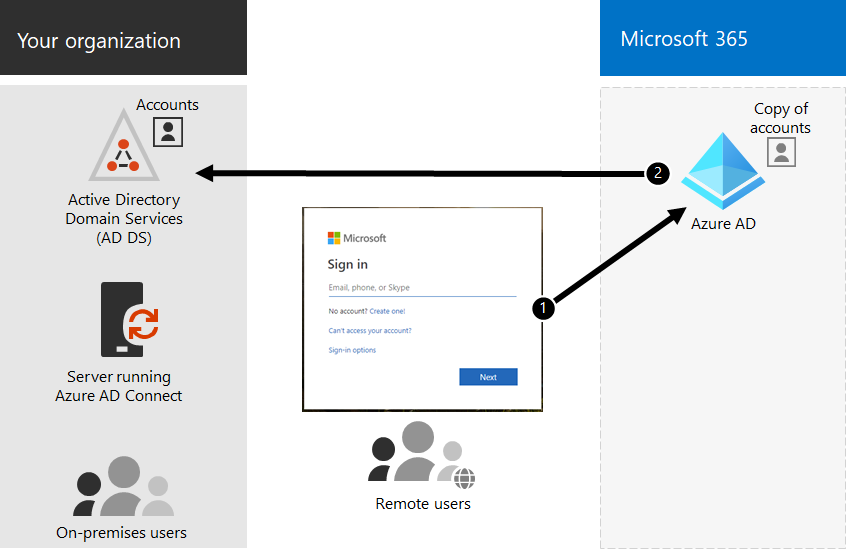

# Hybride Identitäts-und Verzeichnissynchronisierung für Microsoft 365

*Dieser Artikel gilt sowohl für Microsoft 365 Enterprise als auch für Office 365 Enterprise.*

Je nach Ihren geschäftlichen Anforderungen und technischen Anforderungen ist das hybride Identitätsmodell und die Verzeichnissynchronisierung die häufigste Wahl für Unternehmenskunden, die Microsoft 365 annehmen. Mit der Verzeichnissynchronisierung können Sie Identitäten in Ihrer Active Directory-Domänendienste (AD DS) verwalten, und alle Aktualisierungen an Benutzerkonten, Gruppen und Kontakten werden mit dem Azure Active Directory (Azure AD)-Mandanten Ihres Microsoft 365-Abonnements synchronisiert.

>[!Note]
>Wenn AD DS Benutzerkonten zum ersten Mal synchronisiert werden, werden Sie nicht automatisch eine Microsoft 365-Lizenz zugewiesen und können nicht auf Microsoft 365-Dienste wie e-Mail zugreifen. Sie müssen Ihnen zunächst einen Verwendungs Speicherort zuweisen. Weisen Sie dann diesen Benutzerkonten entweder einzeln oder dynamisch über die Gruppenmitgliedschaft eine Lizenz zu.
>

## Authentifizierung für Hybrid Identität

Bei der Verwendung des Hybriden Identitätsmodells gibt es zwei Arten von Authentifizierung:

- Verwaltete Authentifizierung

  Azure AD verarbeitet den Authentifizierungsprozess mithilfe einer lokal gespeicherten Hashversion des Kennworts oder sendet die Anmeldeinformationen an einen lokalen Software-Agent, der vom lokalen AD DS authentifiziert werden soll.

- Verbundauthentifizierung

  Azure AD leitet den Clientcomputer, der die Authentifizierung anfordert, an einen anderen Identitätsanbieter um.

### Verwaltete Authentifizierung

Es gibt zwei Arten der verwalteten Authentifizierung:

- Kennworthashsynchronisierung (Password hash synchronization, PHS)

  Azure AD führt die Authentifizierung selbst durch.

- Passthrough-Authentifizierung (PTA)

  Azure AD lässt AD DS die Authentifizierung durchführen.

#### Kennworthashsynchronisierung (Password hash synchronization, PHS)

Mit PHS synchronisieren Sie Ihre AD DS Benutzerkonten mit Microsoft 365 und verwalten Ihre Benutzer lokal. Hashwerte von Benutzerkennwörtern werden von Ihrem AD DS zu Azure AD synchronisiert, sodass die Benutzer das gleiche Kennwort lokal und in der Cloud haben. Dies ist die einfachste Möglichkeit zum Aktivieren der Authentifizierung für AD DS Identitäten in Azure AD. 

Wenn Kennwörter lokal geändert oder zurückgesetzt werden, werden die neuen Kennworthashs mit Azure AD synchronisiert, sodass Ihre Benutzer immer dasselbe Kennwort für Cloud-Ressourcen und lokale Ressourcen verwenden können. Die Benutzerkennwörter werden nie an Azure AD gesendet oder in Azure AD in Klartext gespeichert. Einige Premium Features von Azure AD, beispielsweise Identitätsschutz, erfordern PHS, unabhängig davon, welche Authentifizierungsmethode ausgewählt ist.
  
Weitere Informationen finden Sie unter [Auswählen der richtigen Authentifizierungsmethode](https://docs.microsoft.com/azure/active-directory/hybrid/choose-ad-authn) .
  
#### Passthrough-Authentifizierung (PTA)

PTA bietet eine einfache Kennwortüberprüfung für Azure AD Authentifizierungsdienste mit einem Software-Agent, der auf einem oder mehreren lokalen Servern läuft, um die Benutzer direkt mit Ihrem AD DS zu validieren. Mit PTA synchronisieren Sie AD DS Benutzerkonten mit Microsoft 365 und verwalten Ihre Benutzer lokal. 

PTA ermöglicht es Ihren Benutzern, sich über Ihr lokales Konto und Ihr Kennwort bei lokalen und Microsoft 365-Ressourcen und-Anwendungen anzumelden. Mit dieser Konfiguration werden Benutzerkennwörter direkt für Ihr lokales AD DS überprüft, ohne dass Kennworthashs in Azure AD gespeichert werden. 

PTA richtet sich auch an Organisationen mit einer Sicherheitsanforderung, um lokale Benutzerkonto Zustände, Kennwortrichtlinien und Anmeldezeiten sofort zu erzwingen. 
  
Weitere Informationen finden Sie unter [Auswählen der richtigen Authentifizierungsmethode](https://docs.microsoft.com/azure/active-directory/hybrid/choose-ad-authn) .
  
### Verbundauthentifizierung

Die Verbundauthentifizierung ist in erster Linie für große Unternehmensorganisationen mit komplexeren Authentifizierungsanforderungen geeignet. AD DS Identitäten werden mit Microsoft 365 synchronisiert, und Benutzerkonten werden lokal verwaltet. Bei der Verbundauthentifizierung haben Benutzer das gleiche Kennwort lokal und in der Cloud, und Sie müssen sich nicht erneut anmelden, um Microsoft 365 zu verwenden. 

Die Verbundauthentifizierung kann zusätzliche Authentifizierungsanforderungen wie Smartcard-basierte Authentifizierung oder mehrstufige Authentifizierung eines Drittanbieters unterstützen und ist in der Regel erforderlich, wenn Organisationen über eine Authentifizierungsanforderung verfügen, die nicht von Azure AD nativ unterstützt wird.
 
Weitere Informationen finden Sie unter [Auswählen der richtigen Authentifizierungsmethode](https://docs.microsoft.com/azure/active-directory/hybrid/choose-ad-authn) .
  
#### Authentifizierungs-und Identitätsanbieter von Drittanbietern

Lokale Verzeichnisobjekte können mit Microsoft 365 synchronisiert werden, und der Zugriff auf Cloud-Ressourcen wird in erster Linie von einem Drittanbieter-Identitätsanbieter (IDP) verwaltet. Wenn Ihre Organisation eine Drittanbieter-Verbundlösung verwendet, können Sie die Anmeldung mit dieser Lösung für Microsoft 365 konfigurieren, vorausgesetzt, die Drittanbieter-Verbundlösung ist mit Azure AD kompatibel.
  
Weitere Informationen finden Sie in der [Liste Azure AD Verbund Kompatibilität](https://docs.microsoft.com/azure/active-directory/connect/active-directory-aadconnect-federation-compatibility) .
  
## AD DS Vorbereitung

Um einen nahtlosen Übergang zu Microsoft 365 mithilfe der Synchronisierung sicherzustellen, müssen Sie Ihre AD DS Gesamtstruktur vorbereiten, bevor Sie mit der Bereitstellung von Microsoft 365 für die Verzeichnissynchronisierung beginnen.
  
Die Verzeichnis Vorbereitung sollte sich auf die folgenden Aufgaben konzentrieren:

- Entfernen Sie doppelte **proxyAddress** -und **userPrincipalName** -Attribute.
- Aktualisieren Sie leere und ungültige **userPrincipalName** -Attribute mit gültigen **userPrincipalName** -Attributen.
- Entfernen Sie ungültige und fragwürdige Zeichen in den Attributen **givenName**, Name ( **SN** ), **sAMAccountName**, **DisplayName**, **Mail**, **proxyAddresses**, **mailNickname**und **userPrincipalName** . Ausführliche Informationen zum Vorbereiten von Attributen finden Sie unter [Liste der Attribute, die mit dem Azure Active Directory Sync-Tool synchronisiert werden](https://go.microsoft.com/fwlink/p/?LinkId=396719).

    > [!NOTE]
    > Dabei handelt es sich um dieselben Attribute, die Azure AD Connect synchronisiert. 
  
## Überlegungen zur Bereitstellung in mehreren Gesamtstrukturen

Verwenden Sie für mehrere Gesamtstrukturen und SSO-Optionen eine [benutzerdefinierte Installation von Azure AD Connect](https://go.microsoft.com/fwlink/p/?LinkId=698430).
  
Wenn Ihre Organisation über mehrere Gesamtstrukturen für die Authentifizierung verfügt (Anmelde Gesamtstrukturen), wird dringend Folgendes empfohlen:
  
- **Sie sollten die Gesamtstruktur konsolidieren.** Im Allgemeinen ist mehr Aufwand erforderlich, um mehrere Gesamtstrukturen beizubehalten. Wenn Ihre Organisation nicht über Sicherheitseinschränkungen verfügt, die separate Gesamtstrukturen erfordern, sollten Sie die lokale Umgebung vereinfachen.
- **Nur in der primären anmeldegesamtstruktur verwenden.** Sie sollten Microsoft 365 nur in ihrer primären anmeldegesamtstruktur für die erste Einführung von Microsoft 365 bereitstellen. 

Wenn Sie Ihre AD DS-Bereitstellung mit mehreren Gesamtstrukturen nicht konsolidieren oder andere Verzeichnisdienste zum Verwalten von Identitäten verwenden, können Sie diese möglicherweise mit der Hilfe von Microsoft oder einem Partner synchronisieren.
  
Weitere Informationen finden Sie unter [Topologien für Azure AD Connect](https://docs.microsoft.com/azure/active-directory/hybrid/plan-connect-topologies) .
  
## Funktionen, die von der Verzeichnissynchronisierung abhängig sind
  
Die Verzeichnissynchronisierung ist für die folgenden Features und Funktionen erforderlich:
  
- Azure AD nahtloses einmaliges Anmelden (Single Sign-on, SSO)
- Skype-Koexistenz
- Exchange-hybridbereitstellung, einschließlich:
  - Vollständig freigegebene globale Adressliste (GAL) zwischen Ihrer lokalen Exchange-Umgebung und Microsoft 365.
  - Synchronisierung von GAL-Informationen aus unterschiedlichen E-Mail-Systemen.
  - Die Möglichkeit, Benutzer zu Microsoft 365-Dienst angeboten hinzuzufügen oder daraus zu entfernen. Dies erfordert Folgendes:
  - Die bidirektionale Synchronisierung muss während der Verzeichnis synchronisierungseinrichtung konfiguriert werden. Standardmäßig schreiben Verzeichnissynchronisierungstools Verzeichnisinformationen nur in die Cloud. Wenn Sie die bidirektionale Synchronisierung konfigurieren, aktivieren Sie die Write-Back-Funktionalität, sodass eine beschränkte Anzahl von Objektattributen aus der Cloud kopiert und anschließend wieder in Ihre lokale AD DS geschrieben wird. Write-Back wird auch als Exchange-Hybrid Modus bezeichnet. 
  - Eine lokale Exchange-hybridbereitstellung
  - Die Möglichkeit, einige Benutzerpostfächer in Microsoft 365 zu verschieben und dabei andere Benutzerpostfächer lokal aufzubewahren.
  - Sichere Absender und blockierte Absender lokal werden nach Microsoft 365 repliziert.
  - Grundlegende Delegierung und Funktion zum Senden von E-Mails im Auftrag.
  - Sie verfügen über eine integrierte lokale Smartcard oder mehrstufige Authentifizierungslösung.
- Synchronisierung von Fotos, Miniaturansichten, Konferenzräumen und Sicherheitsgruppen

## Nächster Schritt

Wenn Sie bereit sind, die Hybrid Identität bereitzustellen, lesen Sie [Vorbereiten der Verzeichnissynchronisierung](prepare-for-directory-synchronization.md).
  
