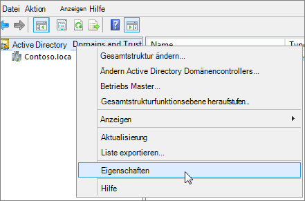
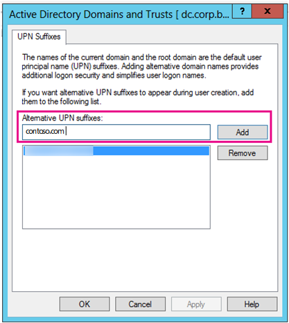

# <a name="prepare-a-non-routable-domain-for-directory-synchronization"></a>Vorbereiten einer nicht routingfähigen Domäne für die Verzeichnissynchronisierung
Wenn Sie Ihr lokales Verzeichnis mit Microsoft 365 synchronisieren, müssen Sie über eine verifizierte Domäne in Azure Active Directory (Azure AD) verfügen. Nur die Benutzerprinzipalnamen (User Principal Names, UPN), die der lokalen Domäne zugeordnet sind, werden synchronisiert. Allerdings wird jeder UPN, der eine nicht Routingfähige Domäne enthält, beispielsweise. local (wie Billa@contoso. local), mit einer. onmicrosoft.com-Domäne (wie Billa@contoso.onmicrosoft.com) synchronisiert. 

Wenn Sie derzeit eine. local-Domäne für ihre Benutzerkonten in Active Directory-Domänendienste (AD DS) verwenden, sollten Sie diese so ändern, dass Sie eine verifizierte Domäne (wie Billa@contoso.com) verwenden, um ordnungsgemäß mit Ihrer Microsoft 365-Domäne zu synchronisieren.
  
## <a name="what-if-i-only-have-a-local-on-premises-domain"></a>Was geschieht, wenn ich nur eine lokale lokale Domäne habe?

Das neueste Tool, mit dem Sie Ihre AD DS mit Azure AD synchronisieren können, heißt Azure AD Connect. Weitere Informationen finden Sie unter [integrieren Ihrer lokalen Identitäten in Azure AD](https://docs.microsoft.com/azure/architecture/reference-architectures/identity/azure-ad).
  
Azure AD Connect synchronisiert den UPN und das Kennwort Ihrer Benutzer, sodass sich Benutzer mit denselben Anmeldeinformationen anmelden können, die Sie lokal verwenden. Allerdings synchronisiert Azure AD Connect nur Benutzer mit Domänen, die von Microsoft 365 überprüft wurden. Dies bedeutet, dass die Domäne auch von Azure AD überprüft wird, da Microsoft 365-Identitäten von Azure AD verwaltet werden. Die Domäne muss also eine gültige Internet Domäne sein (beispielsweise. com,. org, .net,. US usw.). Wenn Ihr interner AD DS nur eine nicht Routingfähige Domäne verwendet (beispielsweise. local), kann dies nicht möglicherweise mit der überprüften Domäne übereinstimmen, die Sie auf Microsoft 365 haben. Sie können dieses Problem beheben, indem Sie entweder Ihre primäre Domäne in Ihrem lokalen AD DS ändern oder ein oder mehrere UPN-Suffixe hinzufügen.
  
### <a name="change-your-primary-domain"></a>**Ändern der primären Domäne**

Ändern Sie Ihre primäre Domäne in eine Domäne, die Sie in Microsoft 365 überprüft haben, beispielsweise contoso.com. Jeder Benutzer mit der Domäne "contoso. local" wird dann auf contoso.com aktualisiert. Anweisungen hierzu finden Sie unter [Funktionsweise der Domänenumbenennung](https://go.microsoft.com/fwlink/p/?LinkId=624174). Dies ist jedoch ein sehr beteiligter Prozess, und eine einfachere Lösung wird im folgenden Abschnitt beschrieben.
  
### <a name="add-upn-suffixes-and-update-your-users-to-them"></a>**Hinzufügen von UPN-Suffixen und Aktualisieren der Benutzer**

Sie können das. local-Problem lösen, indem Sie neue UPN-Suffixe oder-Suffixe in AD DS zur Übereinstimmung mit der Domäne (oder den Domänen) registrieren, die Sie in Microsoft 365 überprüft haben. Nachdem Sie das neue Suffix registriert haben, aktualisieren Sie den Benutzer UPNs so, dass die. local durch den neuen Domänennamen ersetzt wird, sodass ein Benutzerkonto wie Billa@contoso.com aussieht.
  
Nachdem Sie die UPNs für die Verwendung der überprüften Domäne aktualisiert haben, können Sie Ihre lokale AD DS mit Microsoft 365 synchronisieren.
  
 **Schritt 1: Hinzufügen des neuen UPN-Suffix**
  
1. Wählen Sie auf dem AD DS Domänencontroller im Server-Manager **Tools** \> **Active Directory Domänen und Vertrauensstellungen**aus.
    
    **Oder, wenn Sie nicht über Windows Server 2012**
    
    Drücken Sie die **Windows-Taste + R** , um das Dialogfeld **Ausführen** zu öffnen, und geben Sie dann in Domain. msc ein, und wählen Sie dann **OK**aus.
    
    
  
2. Klicken Sie im Fenster **Active Directory Domänen und Vertrauensstellungen** mit der rechten Maustaste auf **Active Directory Domänen und Vertrauensstellungen**, und wählen Sie dann **Eigenschaften**aus.
    
    
  
3. Geben Sie auf der Registerkarte **UPN-Suffixe** im Feld **alternative UPN-Suffixe** ihre neuen UPN-Suffixe oder Suffixe ein, und wählen Sie dann **Add** \> **Apply**aus.
    
    
  
    Klicken Sie auf **OK** , wenn Sie das Hinzufügen von Suffixen abgeschlossen haben. 
    
 **Schritt 2: Ändern des UPN-Suffixes für vorhandene Benutzer**
  
1. Wählen Sie auf dem AD DS Domänencontroller im Server-Manager die Option **Extras** \> **Active Directory Benutzer und Computer**aus.
    
    **Oder, wenn Sie nicht über Windows Server 2012**
    
    Drücken Sie die **Windows-Taste + R** , um das Dialogfeld **Ausführen** zu öffnen, und geben Sie dann DSA. msc ein, und klicken Sie dann auf **OK** .
    
2. Wählen Sie einen Benutzer aus, klicken Sie mit der rechten Maustaste, und wählen Sie dann **Eigenschaften**aus.
    
3. Wählen Sie auf der Registerkarte **Konto** in der Dropdownliste UPN-Suffix das neue UPN-Suffix aus, und wählen Sie dann **OK**aus.
    
    
  
4. Führen Sie diese Schritte für jeden Benutzer aus.
    
   
### <a name="you-can-also-use-windows-powershell-to-change-the-upn-suffix-for-all-users"></a>**Sie können auch Windows PowerShell verwenden, um das UPN-Suffix für alle Benutzer zu ändern.**

Wenn Sie viele Benutzer aktualisieren müssen, ist es einfacher, Windows PowerShell zu verwenden. Im folgenden Beispiel werden die Cmdlets [Get-User](https://go.microsoft.com/fwlink/p/?LinkId=624312) und [festgelegt-User](https://go.microsoft.com/fwlink/p/?LinkId=624313) verwendet, um alle contoso. local-Suffixe in contoso.com zu ändern. 

Beispiel für Feinde können Sie die folgenden Windows PowerShell Befehle ausführen, um alle contoso. local-Suffixe auf contoso.com zu aktualisieren:
    
  ```powershell
  $LocalUsers = Get-ADUser -Filter "UserPrincipalName -like '*contoso.local'" -Properties userPrincipalName -ResultSetSize $null
  $LocalUsers | foreach {$newUpn = $_.UserPrincipalName.Replace("@contoso.local","@contoso.com"); $_ | Set-ADUser -UserPrincipalName $newUpn}
  ```

Weitere Informationen zum Verwenden von Windows PowerShell in AD DS finden Sie unter [Active Directory Windows PowerShell Moduls](https://go.microsoft.com/fwlink/p/?LinkId=624314) . 

