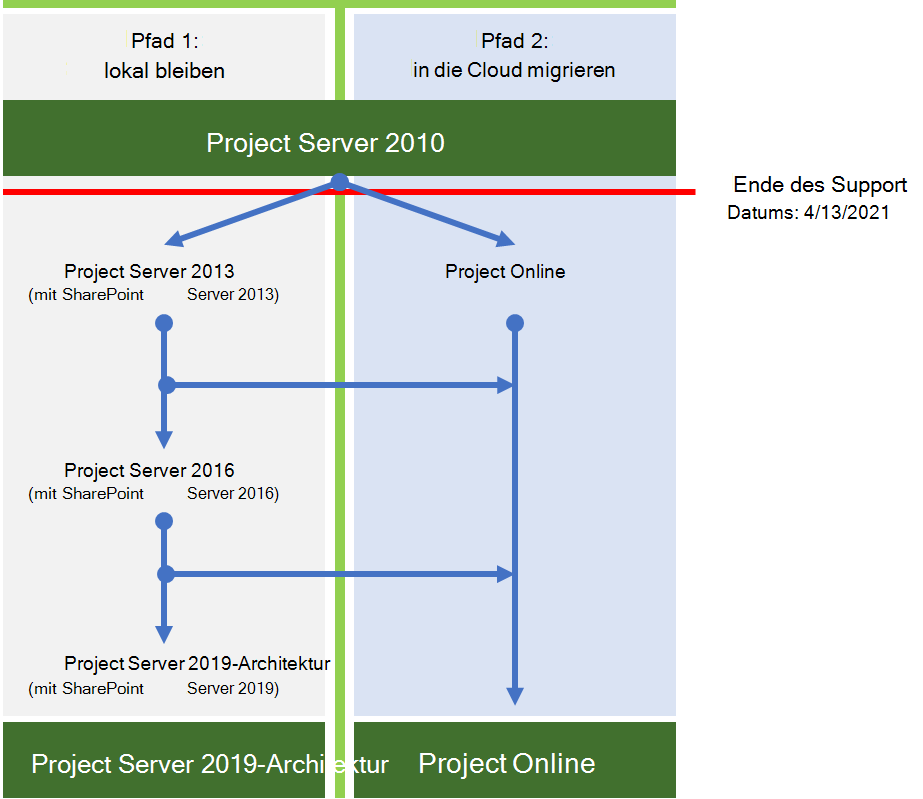

# Project Server 2010 – Roadmap zum Supportende

*Dieser Artikel gilt sowohl für Microsoft 365 Enterprise als auch für Office 365 Enterprise.*

Project Server 2010 wird am **13. April 2021**am Ende der Unterstützung erreichen. Dieses Datum wurde von dem vorherigen Datum des Supports am 13. Oktober 2020 verlängert. Wenn Sie Project Server 2010 derzeit verwenden, beachten Sie, dass diese anderen verwandten Produkte die folgenden Ende der Support Daten haben:

|Produkt |Ende des Support Datums|
|---|---|
|Project 2010 Standard|13. Oktober 2020|
|Project 2010 Professional|13. Oktober 2020|

Weitere Informationen zu Office 2010 Servern, die das Ende der Unterstützung erreichen, finden Sie unter [Upgrade von Office 2010-Servern und-Clientprodukten](plan-upgrade-previous-versions-office.md).

## Was bedeutet das Ende der Unterstützung?

Project Server verfügt wie fast alle Microsoft-Produkte über einen Support-Lebenszyklus, in dem wir neue Features, Bugfixes und Sicherheitsupdates bereitstellen. Dieser Lebenszyklus dauert in der Regel 10 Jahre ab dem Datum der ersten Produktversion, und das Ende dieses Lebenszyklus wird als Ende der Unterstützung des Produkts bezeichnet. Wenn Project Server 2010 am 13. April 2021 das Ende der Unterstützung erreicht, stellt Microsoft nicht mehr Folgendes bereit:

- Technischer Support für Probleme, die auftreten können.

- Fehlerbehebungen für entdeckte Probleme, die sich auf die Stabilität und Benutzerfreundlichkeit des Servers auswirken können.

- Sicherheitsfixes für Sicherheitsanfälligkeiten, die erkannt werden und die den Server möglicherweise anfällig für Sicherheitsverletzungen machen.

- Zeitzonenaktualisierungen.

Die Installation von Project Server 2010 wird weiterhin nach diesem Datum ausgeführt. Aufgrund der oben aufgeführten Änderungen wird jedoch dringend empfohlen, dass Sie so bald wie möglich von Project Server 2010 migrieren.

## Was sind meine Optionen?

Wenn Sie Project Server 2010 verwenden, müssen Sie die folgenden Migrationsoptionen untersuchen:

- Migrieren zu Project Online

- Migrieren Sie zu einer neueren lokalen Version von Project Server (vorzugsweise Project Server 2019).

Hier sind die beiden Wege, die Sie ergreifen können, um das Ende der Unterstützung für Project Server 2010 zu vermeiden.

|Warum sollte ich lieber zu Project Server 2019 migrieren?|Warum sollte ich lieber zu Project Online migrieren?|
|---|---|
|Geschäftsregeln beschränken mich auf das betreiben meines Unternehmens in der Cloud.     Ich benötige die Kontrolle über Updates für meine Umgebung.|Ich habe Mobile oder Remote-Benutzer.     Die Kosten für die Migration lokaler Server sind ein großes Problem (Hardware, Software, Stunden und Aufwand für die Implementierung usw.).     Nach der Migration sind Kosten für die Wartung meiner Umgebung ein großes Problem (beispielsweise automatische Updates, garantierte Verfügbarkeit usw.).|

> [!NOTE]
> Weitere Informationen zu den Optionen für den Wechsel von Ihren Office 2010 Servern finden Sie unter [Ressourcen, die Ihnen beim Upgrade von Office 2010-Servern und-Clients helfen](upgrade-from-office-2010-servers-and-products.md). Beachten Sie, dass Project Server keine Hybrid Konfiguration unterstützt, da Project Server und Project Online nicht denselben Ressourcenpool freigeben können.

### Welche Optionen habe ich für den Projekt Client?

Wenn Sie Project Professional 2010 oder Project Standard 2010 verwenden und ihre Migrationsoptionen untersuchen möchten, haben Sie die folgenden Möglichkeiten:

- Wechseln zu einer neueren Version von Project Professional oder Project Standard.
- Wechseln zu einer Online Lösung wie Project Online oder Project für das Internet.

#### Wechseln zu einer neueren Version des Projekt Clients

Wenn Sie von Project Standard 2010 migrieren, können Sie zu einer neueren Version von Project Standard migrieren (Project Standard 2016 oder Project Standard 2019).  Es wird empfohlen, zur neuesten Version zu wechseln, um die neuesten Features und Funktionen nutzen zu können. Außerdem bedeutet die Migration zu einer niedrigeren aktuellen Version (Project Standard 2016), dass Sie aus dieser Version früher migrieren müssen, wenn das Ende des Support Datums aufkommt.

Ebenso können Sie bei der Migration von Project Professional 2010 eine Migration zu einer neueren Version (Project Professional 2019 oder Project Professional 2016) durch wählen. Wir empfehlen, nach Möglichkeit auf die neueste Version zu wechseln.  Wenn Sie Project Professional zum Herstellen einer Verbindung mit Project Server verwenden, stellen Sie sicher, dass Sie zu einer Version von Project Professional migrieren, die für die Verbindung mit der von Ihnen verwendeten Version von Project Server unterstützt wird.

Project Professional 2010 Benutzer können auch eine Migration zum Project Online-Desktop Client durchsuchen. Es handelt sich um eine abonnementbasierte Version von Project Professional 2019, die in Project Plan 3-und Project Plan 5-Abonnements enthalten ist.

#### Wechseln zu einer Online Lösung

Sie können auch auswählen, ob Sie von Project Professional 2010 oder Project Standard 2010 zu den Abonnement basierten Online Lösungen von Project migrieren möchten. Projektplan 3 und Plan 5 umfassen Project Online und das neueste Cloud-Angebot, [Project für das Internet](https://support.office.com/article/what-can-you-do-with-project-for-the-web-b30f5442-be5f-43d2-9072-c95bff778ea1). Beide bieten eine Reihe von neuen Features und Vorteilen, die es zu erkunden lohnt.

Weitere Informationen zu den in beiden enthaltenen Features sowie zu den Projekt Plan Lizenzen, die Sie enthalten, finden Sie in der [Microsoft Project-Dienstbeschreibung](https://docs.microsoft.com/office365/servicedescriptions/project-online-service-description/project-online-service-description).

## Wichtige Überlegungen, die Sie bei der Planung der Migration von Project Server 2010 treffen müssen

Bei der Planung der Migration von Project Server 2010 müssen Sie Folgendes berücksichtigen:

- **Holen Sie sich Hilfe von einem Microsoft Solution Provider** – ein Upgrade von Project Server 2010 kann eine Herausforderung darstellen und erfordert viel Vorbereitung und Planung. Es kann eine besondere Herausforderung darstellen, wenn Sie Project Server 2010 ursprünglich nicht eingerichtet und konfiguriert haben. Glücklicherweise gibt es Microsoft Solution Provider, denen Sie sich zuwenden können, wer dies für einen Lebensunterhalt tut, unabhängig davon, ob Sie eine Migration zu Project Server 2019 oder zu Project Online planen. Sie können nach einem Microsoft Solution Provider suchen, um Sie bei der Migration im [Microsoft Solution Provider Center](https://go.microsoft.com/fwlink/p/?linkid=841249)zu unterstützen.

- **Planen Sie Ihre Anpassungen** -beachten Sie, dass viele der Anpassungen, die Sie in Ihrer Project Server 2010 Umgebung verwenden, bei der Migration zu Project Server 2019 oder zu Project Online möglicherweise nicht funktionieren. Es gibt große Unterschiede in der Architektur von Project Server zwischen Versionen, sowie die erforderlichen Betriebssysteme, Datenbankserver und Client Webbrowser, die für die Verwendung der neueren Version unterstützt werden. Planen Sie, wie Sie Ihre Anpassungen nach Bedarf in ihrer neuen Umgebung testen oder neu erstellen. Die Planung für Ihr Upgrade stellt auch eine gute Gelegenheit dar, um zu überprüfen, ob eine bestimmte Anpassung beim Fortfahren wirklich benötigt wird. [Erstellen Sie einen Plan für aktuelle Anpassungen beim Upgrade auf SharePoint 2013]( https://docs.microsoft.com/SharePoint/upgrade-and-update/create-a-plan-for-current-customizations-during-upgrade-to-sharepoint-2013) enthält einige hervorragende allgemeine Informationen zum bewerten und Planen Ihrer aktuellen Anpassungen beim Upgrade.

- **Zeit und Geduld** : das Upgrade der Planung, Ausführung und Tests dauert viel Zeit und Mühe, insbesondere wenn Sie ein Upgrade auf Project Server 2019 durchführen. Wenn Sie beispielsweise von Project Server 2010 zu Project Server 2019 migrieren, müssen Sie zunächst von Project Server 2010 zu Project Server 2013 migrieren und dann Ihre Daten überprüfen und dann dasselbe Verfahren ausführen, wenn Sie zu jeder nachfolgenden Version migrieren (zu Project Server 2016 und dann zu Project Server 2019). Möglicherweise möchten Sie sich mit einem Microsoft Solution Provider erkundigen, um die geschätzten Kosten mit den Schätzungen zu vergleichen, wie lange es für Sie dauern wird und zu welchen Kosten.

## Migrieren zu Project Online

Wenn Sie von Project Server 2010 zu Project Online migrieren möchten, können Sie die folgenden Schritte ausführen, um die Projektplandaten manuell zu migrieren:

1. Speichern Sie Ihre Projektpläne von Project Server 2010 in. MPP-Format.

2. Wenn Sie Project Professional 2016, Project Professional 2019 oder den Project Online-Desktop-Client verwenden, öffnen Sie jede MPP-Datei, und speichern und veröffentlichen Sie Sie dann in Project online.

Sie können die PWA-Konfiguration manuell in Project online erstellen (beispielsweise alle erforderlichen benutzerdefinierten Felder oder Enterprise-Kalender neu erstellen). Microsoft Solution Provider können Ihnen auch dabei helfen.

Wichtige Ressourcen:

|Ressource|Beschreibung|
|---|---|
|[Erste Schritte mit Project Online](https://support.office.com/article/e3e5f64f-ada5-4f9d-a578-130b2d4e5f11)|Vorgehensweise zum Einrichten und Verwenden von Project online.|
|[Project Online-Dienstbeschreibung](https://go.microsoft.com/fwlink/p/?linkid=829088)|Informationen zu den verschiedenen Project Online Plänen, die Ihnen zur Verfügung stehen.|

## Migrieren zu einer neueren lokalen Version von Project Server

Wir sind zwar der festen Überzeugung, dass Sie durch die Migration zu Project Online den besten Wert und die Benutzeroberfläche erzielen können, aber wir verstehen auch, dass einige Organisationen Projektdaten in einer lokalen Umgebung aufbewahren müssen. Wenn Sie Ihre Projektdaten lokal beibehalten möchten, können Sie Ihre Project Server 2010 Umgebung zu Project Server 2013, Project Server 2016 oder Project Server 2019 migrieren.

Es wird empfohlen, zu Project Server 2019 zu migrieren, wenn Sie nicht zu Project Online migrieren können. Project Server 2019 enthält die meisten der Features und Fortschritte, die in früheren Versionen von Project Server enthalten sind, und es entspricht am ehesten der mit Project online verfügbaren Funktionalität (einige Features sind jedoch nur in Project online verfügbar).

Nachdem Sie jede Migration abgeschlossen haben, sollten Sie Ihre Daten überprüfen, um sicherzustellen, dass Sie erfolgreich migriert wurden.

> [!NOTE]
> Wenn Sie nur die Migration zu Project Server 2013 erwägen, wenn Sie auf eine lokale Lösung beschränkt sind, ist es wichtig zu beachten, dass nur noch einige Jahre Support übrig geblieben sind. Project Server 2013 mit Service Pack 2 Ende des Support Datums ist 10/13/2023. Weitere Informationen zum Ende der Support Termine finden Sie unter [Microsoft Product Lifecycle Policy](https://go.microsoft.com/fwlink/p/?linkid=842066).

### Wie kann ich zu Project Server 2019 migrieren?

Die architektonischen Unterschiede zwischen Project Server 2010 und Project Server 2019 verhindern einen direkten Migrationspfad. Dies bedeutet, dass Sie Ihre Project Server 2010 Daten in die nächste aufeinanderfolgende Version von Project Server migrieren müssen, bis Sie ein Upgrade auf Project Server 2019 durchführen.

Sie müssen die folgenden Schritte ausführen, um Project Server 2010 auf Project Server 2019 zu aktualisieren:

1. Migrieren Sie zu Project Server 2013.

2. Migrieren von Project Serve 2013 zu Project Server 2016.

3. Migrieren von Project Server 2016 zu Project Server 2019.

Nachdem Sie jede Migration abgeschlossen haben, sollten Sie Ihre Daten überprüfen, um sicherzustellen, dass Sie erfolgreich migriert wurden.

### Schritt 1: Migrieren zu Project Server 2013

Der erste Schritt bei der Migration Ihrer Project Server 2010 Daten zu Project Server 2019 ist die erste Migration zu Project Server 2013.

Ein umfassendes Verständnis dessen, was Sie für ein Upgrade von Project Server 2010 auf Project Server 2013 tun müssen, finden Sie unter [Upgrade to Project Server 2013](https://go.microsoft.com/fwlink/p/?linkid=841822).

Wichtige Ressourcen:

- [Übersicht über den Project Server 2013-Upgradevorgang](https://go.microsoft.com/fwlink/p/?linkid=841822)

  Hier erfahren Sie, was Sie für ein Upgrade von Project Server 2010 auf Project Server 2013 tun müssen.
- [Planen des Upgrades auf Project Server 2013](https://go.microsoft.com/fwlink/p/?linkid=841823)

  Sehen Sie sich die Planungsüberlegungen an, die Sie beim Upgrade von Project Server 2010 auf Project Server 2013, einschließlich System Anforderungen, vornehmen müssen.

[Was ist neu in Project Server 2013-Upgrade](https://go.microsoft.com/fwlink/p/?linkid=841824) gibt Ihnen einige wichtige Änderungen für das Upgrade für diese Version, das bemerkenswerteste:

- Es gibt kein direktes Upgrade auf Project Server 2013. Die Methode der Datenbankanfügung ist die einzige unterstützte Methode für ein Upgrade von Project Server 2010 auf Project Server 2013.

- Durch den Upgradeprozess werden nicht nur Ihre Project Server 2010 Daten in Project Server 2013 Format konvertiert, sondern auch die vier Project Server 2010 Datenbanken werden in einer einzigen Project Web App Datenbank konsolidiert.

- Sowohl SharePoint Server 2013 als auch Project Server 2013 wurden in die anspruchsbasierte Authentifizierung aus der vorherigen Version geändert. Wenn Sie die klassische Authentifizierung verwenden, müssen Sie beim Upgrade Überlegungen vornehmen. Weitere Informationen finden Sie unter [Migrieren von der klassischen Authentifizierung zur anspruchsbasierten Authentifizierung in SharePoint 2013]( https://docs.microsoft.com/sharepoint/upgrade-and-update/migrate-from-classic-mode-to-claims-based-authentication-in-sharepoint-2013).

Wichtige Ressourcen:

- [Übersicht über den Prozess zum Upgrade auf Project Server 2013](https://go.microsoft.com/fwlink/p/?linkid=841274)

- [Upgrade der Datenbanken und Project Web App-Websitesammlungen (Project Server 2013)](https://go.microsoft.com/fwlink/p/?linkid=841272)

- [Microsoft Project Server-Aktualisierungsprozess (Diagramm)](https://go.microsoft.com/fwlink/p/?linkid=841270)

- [Die große Datenbankkonsolidierung Project Server 2010 zu 2013 Migration in 8 einfachen Schritten](https://go.microsoft.com/fwlink/p/?linkid=841271)

### Schritt 2: Migrieren zu Project Server 2016

Nach der Migration zu Project Server 2013 und überprüfen, ob Ihre Daten erfolgreich migriert wurden, besteht der nächste Schritt darin, Ihre Daten zu Project Server 2016 zu migrieren.

Ein umfassendes Verständnis der Schritte, die Sie für ein Upgrade von Project Server 2013 auf Project Server 2016 benötigen, finden Sie unter [Upgrade to Project Server 2016](https://docs.microsoft.com/Project/upgrade-to-project-server-2016).

Wichtige Ressourcen:

- [Übersicht über den Project Server 2016-Upgradevorgang](https://docs.microsoft.com/Project/overview-of-the-project-server-2016-upgrade-process)

  Erfahren Sie, wie Sie ein Upgrade von Project Server 2013 auf Project Server 2016 durchführen müssen.

- [Planen des Upgrades auf Project Server 2016](https://docs.microsoft.com/Project/plan-for-upgrade-to-project-server-2016)

  Sehen Sie sich die Planungsüberlegungen an, die Sie beim Upgrade von Project Server 2013 auf Project Server 2016 vornehmen müssen.

[Dinge, die Sie über das Project Server 2016-Upgrade wissen müssen](https://docs.microsoft.com/project/plan-for-upgrade-to-project-server-2016#thingknow) , enthalten einige wichtige Änderungen für das Upgrade auf diese Version, einschließlich:

- Beachten Sie beim Erstellen der Project Server 2016-Umgebung, in der die Project Server 2013 Daten migriert werden sollen, dass die Installationsdateien für Project Server 2016 in SharePoint Server 2016 enthalten sind. Weitere Informationen finden Sie unter [Deploy Project Server 2016](https://go.microsoft.com/fwlink/p/?linkid=841829).

- Ressourcenpläne sind in Project Server 2016 veraltet. Ihre Project Server 2013 Ressourcenpläne werden zu Ressourcen Projekten in Project Server 2016 und in Project Online migriert. Weitere Informationen finden Sie unter [Übersicht: Ressourcen Engagements](https://support.office.com/article/73eefb5a-81fe-42bf-980e-9532b1bdc870) .

### Schritt 3: Migrieren zu Project Server 2019

Nach der Migration zu Project Server 2016 und überprüfen, ob Ihre Daten erfolgreich migriert wurden, besteht der nächste Schritt darin, Ihre Daten zu Project Server 2019 zu migrieren.

Ein umfassendes Verständnis der Schritte, die Sie für ein Upgrade von Project Server 2016 auf Project Server 2019 benötigen, finden Sie unter [Upgrade to Project Server 2019](https://docs.microsoft.com/Project/upgrade-to-project-server-2016).

Wichtige Ressourcen:

- [Übersicht über den Upgradeprozess für Project Server 2019](https://docs.microsoft.com/project/overview-of-the-project-server-2019-upgrade-process)

  Erfahren Sie, wie Sie ein Upgrade von Project Server 2013 auf Project Server 2016 durchführen müssen.

- [Planen des Upgrades auf Project Server 2019](https://docs.microsoft.com/project/plan-for-upgrade-to-project-server-2019)

  Sehen Sie sich die Planungsüberlegungen an, die Sie beim Upgrade von Project Server 2016 auf Project Server 2019 vornehmen müssen.

[Dinge, die Sie über das Project Server 2019-Upgrade wissen müssen](https://go.microsoft.com/fwlink/p/?linkid=841827) , enthalten einige wichtige Änderungen für das Upgrade auf diese Version, einschließlich:

- Durch den Upgradeprozess werden Ihre Daten aus Ihrer Project Server 2016-Datenbank in die SharePoint Server 2019-Inhaltsdatenbank migriert.  Project Server 2019 erstellt keine eigene Project Server-Datenbank mehr in der SharePoint Server Farm.

- Beachten Sie nach dem Upgrade mehrere Änderungen in Project Web App.  Eine Beschreibung dieser Informationen finden Sie unter [What es New in Project Server 2019](https://docs.microsoft.com/project/what-s-new-for-it-pros-in-project-server-2019#PWAChanges).

**Weitere Ressourcen**:

- [Project Online Service Beschreibungen](https://go.microsoft.com/fwlink/p/?linkid=841280): Weitere Informationen finden Sie in den Features zur Portfolioverwaltung, die in Project Server 2016 und Project Online Premium enthalten sind.

- [Migrationshandbuch für Microsoft Office Project Portfolio Server 2010](https://go.microsoft.com/fwlink/p/?linkid=841279)

## Zusammenfassung der Optionen für Office 2010 Client und Server und Windows 7

Eine visuelle Zusammenfassung der Optionen für Upgrades, Migration und die Cloud für Office 2010-Clients und -Server sowie für Windows 7 finden Sie auf unter dem [Poster zum Supportende](../downloads/Office2010Windows7EndOfSupport.pdf).

Dieses einseitige Poster veranschaulicht auf einfache Weise, welche verschiedenen Pfade Sie wählen können, um zu verhindern, dass Office 2010-Clients und -Serverprodukte sowie Windows 7 das Ende des Supports erreichen. Bevorzugte Pfade und unterstützte Optionen in Microsoft 365 Enterprise sind hervorgehoben.

Sie können dieses Poster in den Formaten „Brief“, „Legal“ oder „Tabloid“ (27,94 x 43,18 cm) [herunterladen](https://github.com/MicrosoftDocs/microsoft-365-docs/raw/public/microsoft-365/downloads/Office2010Windows7EndOfSupport.pdf) und ausdrucken.

## Verwandte Themen

[Upgrade von SharePoint 2010](upgrade-from-sharepoint-2010.md)

[Upgrade von Office 2010-Servern und -Clients](upgrade-from-office-2010-servers-and-products.md)
