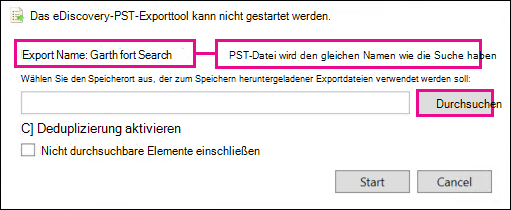

# Wiederherstellen gelöschter Elemente im Postfach eines Benutzers

**Dieser Artikel richtet sich an Administratoren. Versuchen Sie, gelöschte Elemente in Ihrem eigenen Postfach wiederherzustellen?** Führen Sie einen der folgenden Schritte durch: 
- [Wiederherstellen gelöschter Elemente in Outlook für Windows](https://support.office.com/article/49e81f3c-c8f4-4426-a0b9-c0fd751d48ce)
- [Wiederherstellen gelöschter Elemente oder E-Mails in Outlook Online](https://support.office.com/article/c3d8fc15-eeef-4f1c-81df-e27964b7edd4)
- [Wiederherstellen gelöschter e-Mail-Nachrichten in Outlook im Internet](https://support.office.com/article/a8ca78ac-4721-4066-95dd-571842e9fb11)
- [Outlook.com](https://go.microsoft.com/fwlink/p/?LinkID=623435)
   
Hat ein Benutzer Elemente endgültig aus seinem Outlook-Postfach gelöscht? Der Benutzer möchte, dass er zurückkehrt, kann ihn jedoch nicht wiederherstellen. Möglicherweise können Sie die bereinigten Elemente wiederherstellen, wenn Sie nicht dauerhaft aus dem Postfach des Benutzers entfernt wurden. Verwenden Sie dazu das in-Place-eDiscovery-Tool in Exchange Online, um nach gelöschten e-Mails und anderen Elementen (beispielsweise Kontakte, Kalender Termine und Aufgaben) im Postfach eines Benutzers zu suchen. Wenn Sie die gelöschten Elemente finden, können Sie Sie in eine PST-Datei exportieren (auch als Outlook-Datendatei bezeichnet), die der Benutzer dann zum Wiederherstellen der Elemente in seinem Postfach verwenden kann.
  
Im folgenden finden Sie die Schritte zum erneuten aufdecken gelöschter Elemente im Postfach eines Benutzers. Wie lange dauert das? Je nachdem, wie viele Elemente Sie wiederherstellen möchten, kann es zum ersten Mal 20 bis 30 Minuten dauern, bis alle Schritte ausgeführt wurden.
  
> [!NOTE]
> Sie müssen ein Exchange- **Administrator** oder **globaler Administrator** in Microsoft 365 sein oder ein Mitglied der Rollengruppe Organisationsverwaltung in Exchange Online sein, um die Schritte in diesem Artikel ausführen zu können. Weitere Informationen finden Sie unter [Informationen zu Administratorrollen von Microsoft 365](https://support.office.com/article/da585eea-f576-4f55-a1e0-87090b6aaa9d). 
  
## Schritt 1: Zuweisen von eDiscovery-Berechtigungen für sich selbst

Der erste Schritt besteht darin, sich die erforderlichen Berechtigungen in Exchange Online zuzuweisen, sodass Sie das in-Place-eDiscovery-Tool zum Durchsuchen eines Benutzerpostfachs verwenden können. Dieser Vorgang ist nur einmal erforderlich. Wenn Sie in Zukunft ein anderes Postfach durchsuchen müssen, können Sie diesen Schritt überspringen.
  
1. [Wo können Sie sich bei Microsoft 365 for Business](https://support.microsoft.com/office/where-to-sign-into-microsoft-365-for-business-e9eb7d51-5430-4929-91ab-6157c5a050b4) mit Ihrem Geschäfts-oder Schulkonto anmelden? 
    
2. Klicken Sie oben links auf das App-Startfeld  , und klicken Sie dann auf **Admin**.
    
3. Erweitern Sie im linken Navigationsbereich des Microsoft 365 Admin Center den Knoten **Admin**Center, und klicken Sie dann auf **Exchange**.
    
    
  
4. Klicken Sie im Exchange Admin Center auf **Berechtigungen**, und klicken Sie dann auf **Administratorrollen**.
    
5. Wählen Sie in der Listenansicht die Option **Discovery Management**aus, und klicken Sie dann auf Bearbeitungssymbol **Bearbeiten**  .
    
    
  
6. Klicken Sie in der **Rollengruppe**unter **Mitglieder**auf Add-Symbol **Hinzufügen**  .
    
7. Wählen Sie in **Mitglieder auswählen**aus der Liste der Namen aus, klicken Sie auf **Hinzufügen**, und klicken Sie dann auf **OK**.
    
    > [!NOTE]
    > Sie können auch eine Gruppe hinzufügen, der Sie angehören, beispielsweise Organisationsverwaltung oder TenantAdmins. Wenn Sie eine Gruppe hinzufügen, werden anderen Mitgliedern der Gruppe die erforderlichen Berechtigungen zum Ausführen des in-Place-eDiscovery-Tools zugewiesen. 
  
8. Klicken Sie unter **Rollengruppe**auf **Speichern**.
    
9. Melden Sie sich bei Microsoft 365 an.
    
    Sie müssen sich abmelden, bevor Sie mit dem nächsten Schritt beginnen, damit die neuen Berechtigungen wirksam werden.
    
> [!CAUTION]
> Mitglieder der Rollengruppe "Ermittlungsverwaltung" können auf vertrauliche Nachrichteninhalte zugreifen. Dies umfasst das Durchsuchen aller Postfächer in Ihrer Organisation, die Vorschau der Suchergebnisse (und anderer Postfachelemente), das Kopieren der Ergebnisse in ein Ermittlungspostfach und das Exportieren der Suchergebnisse in eine PST-Datei. 
  
[Return to top](recover-deleted-items-in-a-mailbox.md)
  
## Schritt 2: Durchsuchen des Postfachs des Benutzers nach gelöschten Elementen

Wenn Sie eine Compliance-eDiscovery-Suche ausführen, wird der Ordner "refundable Items" in dem von Ihnen gesuchten Postfach automatisch in die Suche einbezogen. Im Ordner "Wiederherstellbare Elemente" werden endgültig gelöschte Elemente gespeichert, bis Sie aus dem Postfach gelöscht (endgültig entfernt) werden. Wenn ein Element nicht bereinigt wurde, sollte es mithilfe des in-Place-eDiscovery-Tools gefunden werden können.
  
1. [Wo können Sie sich bei Microsoft 365 for Business](https://support.microsoft.com/office/where-to-sign-into-microsoft-365-for-business-e9eb7d51-5430-4929-91ab-6157c5a050b4) mit Ihrem Geschäfts-oder Schulkonto anmelden? 
    
2. Klicken Sie oben links auf das App-Startfeld  , und klicken Sie dann auf **Admin**.
    
3. Erweitern Sie im linken Navigationsbereich im Microsoft 365 Admin Center den Knoten **Admin**, und klicken Sie dann auf **Exchange**.
    
4. Klicken Sie in der Exchange-Verwaltungskonsole auf **Richtlinientreue Verwaltung**, klicken Sie auf **in-situ-eDiscovery &amp; -** Speicher, und klicken Sie dann auf **Neues**  .
    
    
  
5. Geben Sie auf der Seite **Name und Beschreibung** einen Namen für die Suche ein (beispielsweise den Namen des Benutzers, für den Sie eine e-Mail-Nachricht wiederhergestellt haben), eine optionale Beschreibung, und klicken Sie dann auf **weiter**.
    
6. Klicken Sie auf der Seite **Post** Fächer auf **zu durchsuchende Postfächer angeben**, und klicken Sie dann auf Add-Symbol **Hinzufügen**  .
    
    
  
7. Suchen Sie den Namen des Benutzers, für den Sie die gelöschte e-Mail wiederhergestellt haben, und wählen Sie ihn aus, klicken Sie auf **Hinzufügen**, und klicken Sie dann auf **OK**.
    
8. Klicken Sie auf **Weiter**.
    
    Die Seite **Suchabfrage** wird angezeigt. Hier definieren Sie die Suchkriterien, mit denen Sie die fehlenden Elemente im Postfach des Benutzers suchen können. 
    
9. Füllen Sie auf der Seite **Suchabfrage** die folgenden Felder aus: 
    
  - **Alle Inhalte einbeziehen** Wählen Sie diese Option aus, um alle Inhalte des Postfachs des Benutzers in die Suchergebnisse einzubeziehen. Wenn Sie diese Option auswählen, können Sie keine weiteren Suchkriterien angeben. 
    
  - **Basierend auf Kriterien filtern** Wählen Sie diese Option aus, um die Suchkriterien anzugeben, einschließlich Schlüsselwörter, Start-und Enddaten, Absender-und Empfängeradressen und Nachrichtentypen. 
    
    
  
|**Field**|**Verwenden Sie diese, um...**|
|:-----|:-----|
|             |Geben Sie Stichwörter, Datumsbereich, Empfänger und Nachrichtentypen an.    |
|             |Suchen Sie nach Nachrichten mit Schlüsselwörtern oder Ausdrücken, und verwenden Sie logische Operatoren wie **und** oder **oder**.    |
|             |Suchen nach Nachrichten, die innerhalb eines Datumsbereichs gesendet oder empfangen wurden.    |
|             |Suchen nach Nachrichten, die von bestimmten Personen empfangen oder gesendet wurden.    |
|             |Suchen Sie nach allen Nachrichtentypen, oder wählen Sie spezifische Objekte aus.    |
   
   > [!TIP]
   >  Hier sind einige Tipps zum Erstellen einer Suchabfrage zum Auffinden fehlender Elemente. Versuchen Sie, so viele Informationen aus dem Benutzer zu erhalten, dass Sie eine Suchabfrage erstellen können, damit Sie finden, wonach Sie suchen. Wenn Sie nicht sicher sind, wie Sie eine fehlende Nachricht finden, sollten Sie die Option **alle Inhalte einbeziehen** verwenden. Die Suchergebnisse enthalten alle Elemente im Ordner "Wiederherstellbare Elemente" des Benutzers, einschließlich des ausgeblendeten Ordners (als Lösch Ordner bezeichnet), die Elemente enthalten, die vom Benutzer gelöscht wurden. Anschließend können Sie zu Schritt 3 wechseln, die Ergebnisse in ein Ermittlungspostfach kopieren und sich die Nachricht im verborgenen Ordner ansehen. Wenn Sie ungefähr wissen, wann die fehlende Nachricht ursprünglich vom Benutzer gesendet oder empfangen wurde, verwenden Sie die Optionen **Startdatum angeben** und **Enddatum angeben** , um einen Datumsbereich bereitzustellen. Dadurch werden alle Nachrichten zurückgegeben, die der Benutzer innerhalb dieses Zeitraums gesendet oder empfangen hat. Die Angabe eines Datumsbereichs ist eine wirklich gute Möglichkeit, die Suchergebnisse einzugrenzen. Wenn Sie wissen, wer die fehlenden e-Mails gesendet hat, verwenden Sie das Feld **von** , um diesen Absender anzugeben. Wenn Sie die Suchergebnisse auf verschiedene Arten von Postfachelementen einschränken möchten, klicken Sie auf **Nachrichtentypen auswählen**, klicken Sie auf **die zu durchsuchenden Nachrichtentypen auswählen**, und wählen Sie dann einen bestimmten Nachrichtentyp aus, nach dem gesucht werden soll. Beispielsweise können Sie nur nach Kalenderelementen oder Kontakten suchen. Hier ist ein Screenshot der verschiedenen Nachrichtentypen, nach denen Sie suchen können. Standardmäßig werden alle Nachrichtentypen gesucht. 
  
   Klicken Sie auf **weiter** , wenn Sie die Seite **Suchabfrage** abgeschlossen haben. 
    
10. Klicken Sie auf der Seite **in-situ-Archiveinstellungen** auf **Fertig stellen** , um die Suche zu starten. Um gelöschte e-Mails wiederherzustellen, gibt es keinen Grund, das Postfach des Benutzers aufzubewahren. 
    
    Nachdem Sie die Suche gestartet haben, zeigt Exchange eine Schätzung der Gesamtgröße und der Anzahl der Elemente an, die von der Suche basierend auf den von Ihnen angegebenen Kriterien zurückgegeben werden.
    
11. Wählen Sie die soeben erstellte Suche aus, **und klicken Sie auf Aktualisierung aktualisieren**  , um die im Detailbereich angezeigten Informationen zu aktualisieren. Der Status der **erfolgreichen Schätzung** zeigt an, dass die Suche abgeschlossen wurde. Exchange zeigt außerdem eine Schätzung der Gesamtanzahl der Elemente (und deren Größe) an, die bei der Suche basierend auf den in Schritt 9 angegebenen Suchkriterien gefunden wurden. 
    
12. Klicken Sie im Detailbereich auf **Suchergebnisse** anzeigen, um die gefundenen Elemente anzuzeigen. Dies kann Ihnen helfen, die gesuchten Elemente zu identifizieren. Wenn Sie feststellen, welche Elemente Sie wiederherstellen möchten, fahren Sie mit Schritt 4 fort, um die Suchergebnisse in eine PST-Datei zu exportieren. 
    
    
  
13. Wenn Sie nicht finden, wonach Sie suchen, können Sie Ihre Suchkriterien überarbeiten, indem Sie die Suche auswählen, auf Bearbeitungssymbol **Bearbeiten**klicken  und dann auf **Suchabfrage**klicken. Ändern Sie die Suchkriterien, und führen Sie dann die Suche erneut aus.
    
[Return to top](recover-deleted-items-in-a-mailbox.md)
  
## Optional Schritt 3: Kopieren der Suchergebnisse in ein Discovery-Postfach

Wenn Sie keine Elemente finden können, indem Sie eine Vorschau der Suchergebnisse anzeigen oder die Elemente im Ordner "Wiederherstellbare Elemente" des Benutzers anzeigen möchten, können Sie die Suchergebnisse in ein spezielles Postfach (als Discovery-Postfach bezeichnet) kopieren und dann dieses Postfach in Outlook im Internet öffnen, um die tatsächlichen Elemente anzuzeigen. Der beste Grund zum Kopieren der Suchergebnisse ist, dass Sie die Elemente im Ordner "refundable Items" des Benutzers anzeigen können. Mehr als wahrscheinlich befindet sich das Element, das Sie wiederherstellen möchten, im Unterordner purges. 
  
1. Wechseln Sie im Exchange Admin Center zu **Compliance Management** \> **in-situ-eDiscovery &amp; Hold**.
    
2. Wählen Sie in der Liste der Suchvorgänge die Suche aus, die Sie in Schritt 2 erstellt haben.
    
3. Klicken **Sie auf Such Suche**  , und klicken Sie dann in der Dropdownliste auf **Suchergebnisse kopieren** . 
    
    
  
4. Klicken Sie auf der Seite **Suchergebnisse kopieren** auf **Durchsuchen**.
    
    
  
5. Klicken Sie unter **Anzeige Name**auf **Ermittlungs Such Postfach**, und klicken Sie dann auf **OK**.
    
    
  
    > [!NOTE]
    > Das Ermittlungs Such Postfach ist ein Standard Ermittlungspostfach, das automatisch in Ihrer Microsoft 365-Organisation erstellt wird. 
  
6. Klicken Sie auf der Seite **Suchergebnisse kopieren** auf **Kopieren** , um den Prozess zum Kopieren der Suchergebnisse in das Ermittlungs Such Postfach zu starten. 
    
    
  
7. Klicken **Sie auf Aktualisierung aktualisieren**  , um die Informationen zum Kopierstatus zu aktualisieren, die im Detailbereich angezeigt werden. 
    
8. Wenn der Kopiervorgang abgeschlossen ist, klicken Sie auf **Öffnen** , um das Ermittlungs Such Postfach zu öffnen, um die Suchergebnisse anzuzeigen. 
    
    
  
    Die in das Ermittlungs Such Postfach kopierten Suchergebnisse werden in einem Ordner platziert, der denselben Namen hat wie die in-situ-eDiscovery-Suche. Sie können auf einen Ordner klicken, um die Elemente in diesem Ordner anzuzeigen.
    
    
  
    Wenn Sie eine Suche ausführen, wird auch der Ordner "refundable Items" des Benutzers durchsucht. Das heißt, wenn Elemente im Ordner "refundable Items" die Suchkriterien erfüllen, sind Sie in den Suchergebnissen enthalten. Elemente im Ordner "Löschungen" sind Elemente, die der Benutzer dauerhaft gelöscht hat (durch Löschen eines Elements aus dem Ordner "Gelöschte Elemente" oder durch Auswählen des Elements und drücken von **UMSCHALT + ENTF**. Ein Benutzer kann das Tool zum Wiederherstellen von gelöschten Elementen in Outlook oder Outlook im Internet verwenden, um Elemente im Ordner "Löschungen" wiederherzustellen. Elemente im Ordner "Säuberungen" sind Elemente, die der Benutzer mithilfe des Tools "Gelöschte Elemente wiederherstellen" gelöscht hat, oder Elemente, die Sie automatisch durch eine auf das Postfach angewendete Richtlinie gelöscht haben. In beiden Fällen kann nur ein Administrator Elemente im Ordner "Säuberungsaktionen" wiederherstellen. 
    
    > [!TIP]
    > Wenn ein Benutzer ein gelöschtes Element nicht mithilfe des Tools "Wiederherstellbare Elemente" finden kann, dieses Element jedoch noch wiederherstellbar ist (d. h., dass es nicht dauerhaft aus dem Postfach entfernt wurde), befindet es sich wahrscheinlich im Ordner "Säuberungen". Achten Sie daher darauf, dass Sie im Ordner "Säuberungsaktionen" nach dem gelöschten Element suchen, das Sie für einen Benutzer wiederherstellen möchten. 
  
[Return to top](recover-deleted-items-in-a-mailbox.md)
  
## Schritt 4: Exportieren der Suchergebnisse in eine PST-Datei

Nachdem Sie das Element gefunden haben, das Sie für einen Benutzer wiederherstellen möchten, besteht der nächste Schritt darin, die Ergebnisse aus der in Schritt 2 ausgeführten Suche in eine PST-Datei zu exportieren. Der Benutzer wird diese PST-Datei im nächsten Schritt verwenden, um das gelöschte Element in seinem Postfach wiederherzustellen.
  
1. Wechseln Sie im Exchange Admin Center zu **Compliance Management** \> **in-situ-eDiscovery &amp; Hold**.
    
2. Wählen Sie in der Liste der Suchvorgänge die Suche aus, die Sie in Schritt 2 erstellt haben.
    
3. Klicken Sie auf **in eine PST-Datei exportieren**.
    
    
  
4. Wenn Sie aufgefordert werden, das eDiscovery-Export Tool zu installieren, klicken Sie auf **Ausführen**.
    
5. Klicken Sie im eDiscovery-PST-Export Tool auf **Durchsuchen** , um den Speicherort anzugeben, an dem die PST-Datei heruntergeladen werden soll. 
    
    
  
    Sie können die Optionen ignorieren, um die Deduplizierung zu aktivieren und nicht durchsuchbare Elemente einzubeziehen.
    
6. Klicken Sie auf **Start** , um die PST-Datei auf Ihren Computer herunterzuladen. 
    
    Das **eDiscovery-PST-Export Tool** zeigt Statusinformationen zum Exportvorgang an. Wenn der Export abgeschlossen ist, können Sie auf die Datei an dem Speicherort zugreifen, an dem Sie heruntergeladen wurde. 
    
[Return to top](recover-deleted-items-in-a-mailbox.md)
  
## Schritt 5: Wiederherstellen der wiederhergestellten Elemente im Postfach des Benutzers

Der letzte Schritt besteht darin, die PST-Datei zu verwenden, die in Schritt 4 exportiert wurde, um die wiederhergestellten Elemente im Postfach des Benutzers wiederherzustellen. Nachdem Sie die PST-Datei an den Benutzer gesendet haben, wird der Rest dieses Schritts vom Benutzer ausgeführt, um die PST-Datei zu öffnen und die wiederhergestellten Elemente dann in einen anderen Ordner im Postfach zu versetzen. Für schrittweise Anleitungen können Sie dem Benutzer auch einen Link zu diesem Thema senden: [Öffnen und Schließen von Outlook-Datendateien (PST)](https://support.office.com/article/381b776d-7511-45a0-953a-0935c79d24f2). Oder Sie können dem Benutzer einen Link zum [Wiederherstellen von gelöschten Elementen in einem Postfach mithilfe einer PST-Datei](recover-deleted-items-in-a-mailbox.md#restoredeleteditems) unten senden und Sie bitten, diese Schritte auszuführen. 
  
 **Senden der PST-Datei an den Benutzer**
  
Der letzte Schritt, den Sie ausführen müssen, ist das Senden der PST-Datei, die in Schritt 4 an den Benutzer exportiert wurde. Es gibt verschiedene Möglichkeiten, dies zu tun:
  
- Fügen Sie die PST-Datei an eine e-Mail-Nachricht an. Wenn Outlook so konfiguriert ist, dass PST-Dateien blockiert werden, müssen Sie die Datei komprimieren und dann an die Nachricht anfügen. Dazu gehen Sie so vor:
    
1. Navigieren Sie im Windows-Explorer oder im Datei-Explorer zur PST-Datei.
    
2. Klicken Sie mit der rechten Maustaste auf die Datei, und wählen Sie dann **in** \> **komprimierten Ordner senden (gezippt)** aus. Windows erstellt eine neue ZIP-Datei und gibt ihr einen identischen Namen als PST-Datei.
    
3. Fügen Sie die komprimierte PST-Datei an eine e-Mail-Nachricht an, und senden Sie Sie an den Benutzer, der die Datei dann nur durch Klicken dekomprimieren kann.
    
- Kopieren Sie die PST-Datei in einen freigegebenen Ordner, auf den der Benutzer zugreifen und diese abrufen kann.
    
Die Schritte im nächsten Abschnitt werden vom Benutzer ausgeführt, um die gelöschten Elemente in Ihrem Postfach wiederherzustellen.
  
 
**Wiederherstellen gelöschter Elemente in einem Postfach mithilfe einer PST-Datei**
  
Sie müssen die Outlook-Desktop-App verwenden, um ein gelöschtes Element mithilfe einer PST-Datei wiederherzustellen. Sie können Outlook Web App oder Outlook im Internet nicht zum Öffnen einer PST-Datei verwenden.
  
1. Klicken Sie in Outlook 2013 oder Outlook 2016 auf die Registerkarte **Datei** . 
    
2. Klicken Sie auf ** &amp; Export öffnen**, und klicken Sie dann auf **Outlook-Datendatei öffnen**.
    
3. Wechseln Sie zu dem Speicherort, an dem Sie die PST-Datei gespeichert haben, die Ihr Administrator gesendet hat.
    
4. Wählen Sie die PST-Datei aus, und klicken Sie dann auf **Öffnen**.
    
    Die PST-Datei wird in der linken Navigationsleiste in Outlook angezeigt.
    
    
  
5. Klicken Sie auf die Pfeile, um die PST-Datei und die Ordner darunter zu erweitern, um das Element zu finden, das Sie wiederherstellen möchten.
    
    
  
    > [!TIP]
    > Suchen Sie im Ordner Löschvorgänge nach dem Element, das Sie wiederherstellen möchten. Dies ist ein ausgeblendeter Ordner, in den bereinigte Elemente verschoben werden. Wahrscheinlich ist das Element, das der Administrator wiederhergestellt hat, in diesem Ordner. 
  
6. Klicken Sie mit der rechten Maustaste auf das Element, das Sie **Move** wiederherstellen möchten, und klicken Sie dann auf \> **anderen Ordner**verschoben.
    
    
  
7. Wenn Sie das Element in Ihren Posteingang verschieben möchten, klicken Sie auf **Posteingang**, und klicken Sie dann auf **OK**.
    
    **Tipp:** Führen Sie einen der folgenden Schritte aus, um andere Elementtypen wiederherzustellen: 
    
  - Um ein Kalenderelement wiederherzustellen, klicken Sie mit der rechten Maustaste darauf **Move** , und klicken Sie dann auf \> **anderen Ordner** \> **Kalender**verschoben.
    
  - Klicken Sie zum Wiederherstellen eines Kontakts mit der rechten Maustaste darauf **Move** , und klicken Sie dann auf \> **andere Ordner** \> **Kontakte**weiterleiten.
    
  - Klicken Sie zum Wiederherstellen einer Aufgabe mit der rechten Maustaste darauf, **Move** und klicken Sie dann auf \> **andere Ordner** \> **Aufgaben**weiterleiten.
    

  
   > [!NOTE]
   > Kalenderelemente, Kontakte und Aufgaben befinden sich direkt im Ordner "Säuberungen" und nicht in einem Unterordner "Kalender", "Kontakte" oder "Vorgänge". Sie können jedoch nach **Typ** sortieren, um ähnliche Elementtypen zu gruppieren. 
    
8. Wenn Sie die erneute Herstellung gelöschter Elemente abgeschlossen haben, klicken Sie mit der rechten Maustaste auf die PST-Datei in der linken Navigationsleiste, und wählen Sie **Close "Name of PST file"** aus.
    
[Return to top](recover-deleted-items-in-a-mailbox.md)
  
## Weitere Informationen

- Ein Benutzer kann ein dauerhaft gelöschtes Element möglicherweise wiederherstellen, wenn der Aufbewahrungszeitraum für gelöschte Elemente für das Element nicht abgelaufen ist. Als Administrator haben Sie möglicherweise angegeben, wie lange Elemente im Ordner "Wiederherstellbare Elemente" für die Wiederherstellung verfügbar sind. Es kann beispielsweise eine Richtlinie geben, die alles löscht, was im Ordner "Gelöschte Elemente" eines Benutzers 30 Tage lang vorliegt, und eine andere Richtlinie, mit der Benutzer Elemente im Ordner "Wiederherstellbare Elemente" für bis zu 14 Tage wiederherstellen können. Allerdings können Sie nach Ablauf dieser 14 Tage möglicherweise weiterhin ein Element im Postfach eines Benutzers mithilfe der Verfahren in diesem Thema wiederherstellen.
    
- Benutzer können ein gelöschtes Element wiederherstellen, wenn es nicht gelöscht wurde und wenn die Aufbewahrungsdauer für das gelöschte Element nicht abgelaufen ist. Wenn Sie Benutzern die Wiederherstellung gelöschter Elemente in Ihrem Postfach erleichtern möchten, zeigen Sie Sie auf eines der folgenden Themen:
    
  - [Wiederherstellen gelöschter Elemente in Outlook für Windows](https://support.office.com/article/49e81f3c-c8f4-4426-a0b9-c0fd751d48ce)
    
  - [Wiederherstellen gelöschter Elemente in Outlook 2010](https://support.office.com/article/cd9dfe12-8e8c-4a21-bbbf-4bd103a3f1fe)
    
  - [Wiederherstellen gelöschter Elemente oder E-Mails in Outlook Online](https://support.office.com/article/c3d8fc15-eeef-4f1c-81df-e27964b7edd4)
    
  - [Wiederherstellen gelöschter e-Mail-Nachrichten in Outlook im Internet](https://support.office.com/article/a8ca78ac-4721-4066-95dd-571842e9fb11)
    
  - [Wiederherstellen eines gelöschten Kontakts in Outlook](https://support.office.com/article/51c83288-6888-4dcd-8c99-4932daabf643)
    
  - [Wiederherstellen gelöschter e-Mail-Nachrichten in Outlook.com](https://go.microsoft.com/fwlink/p/?LinkID=623435)
    
[Return to top](recover-deleted-items-in-a-mailbox.md)
  

