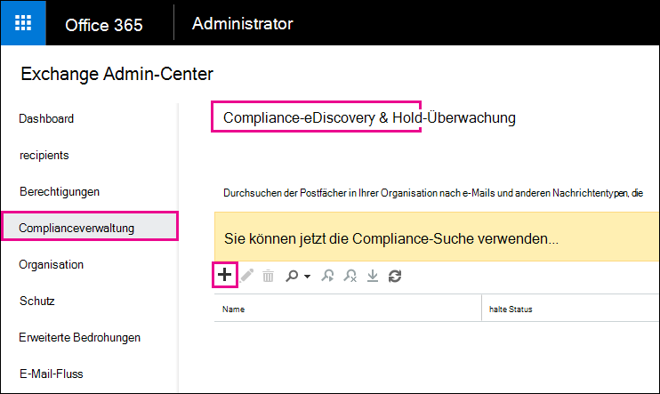

# Wiederherstellen gelöschter Elemente im Postfach eines BenutzersRecover deleted items in a user mailbox

**Dieser Artikel richtet sich an Administratoren. Versuchen Sie, gelöschte Elemente in Ihrem eigenen Postfach wiederherzustellen?****This article is for administrators. Are you trying to recover deleted items in your own mailbox?** Führen Sie einen der folgenden Schritte durch: Try one of the following:
- [Wiederherstellen gelöschter Elemente in Outlook für WindowsRecover deleted items in Outlook for Windows](https://support.office.com/article/49e81f3c-c8f4-4426-a0b9-c0fd751d48ce)
- [Wiederherstellen gelöschter Elemente oder E-Mails in Outlook OnlineRecover deleted items or email in Outlook Web App](https://support.office.com/article/c3d8fc15-eeef-4f1c-81df-e27964b7edd4)
- [Wiederherstellen gelöschter e-Mail-Nachrichten in Outlook im InternetRestore deleted email messages in Outlook on the web](https://support.office.com/article/a8ca78ac-4721-4066-95dd-571842e9fb11)
- [Outlook.comOutlook.com](https://go.microsoft.com/fwlink/p/?LinkID=623435)
   
Hat ein Benutzer Elemente endgültig aus seinem Outlook-Postfach gelöscht?Did a user permanently delete items from their Outlook mailbox? Der Benutzer möchte, dass er zurückkehrt, kann ihn jedoch nicht wiederherstellen.The user wants them back but can't recover them. Möglicherweise können Sie die bereinigten Elemente wiederherstellen, wenn Sie nicht dauerhaft aus dem Postfach des Benutzers entfernt wurden.You may be able recover the purged items if they haven't been permanently removed from the user's mailbox. Verwenden Sie dazu das in-Place-eDiscovery-Tool in Exchange Online, um nach gelöschten e-Mails und anderen Elementen (beispielsweise Kontakte, Kalender Termine und Aufgaben) im Postfach eines Benutzers zu suchen.You do this by using the In-Place eDiscovery tool in Exchange Online to search for deleted email and other items—and such as contacts, calendar appointments, and tasks—in a user's mailbox. Wenn Sie die gelöschten Elemente finden, können Sie Sie in eine PST-Datei exportieren (auch als Outlook-Datendatei bezeichnet), die der Benutzer dann zum Wiederherstellen der Elemente in seinem Postfach verwenden kann.If you find the deleted items, you can export them to a PST file (also called an Outlook Data File), which the user can then use to restore the items back to their mailbox.
  
Im folgenden finden Sie die Schritte zum erneuten aufdecken gelöschter Elemente im Postfach eines Benutzers.Here are the steps for recovering deleted items in a user's mailbox. Wie lange dauert das?How long will this take? Je nachdem, wie viele Elemente Sie wiederherstellen möchten, kann es zum ersten Mal 20 bis 30 Minuten dauern, bis alle Schritte ausgeführt wurden.The first time might take 20 or 30 minutes to complete all the steps, depending on how many items you're trying to recover.
  
> [!NOTE]
> Sie müssen ein Exchange- **Administrator** oder **globaler Administrator** in Microsoft 365 sein oder ein Mitglied der Rollengruppe Organisationsverwaltung in Exchange Online sein, um die Schritte in diesem Artikel ausführen zu können.You have to be an **Exchange administrator** or **Global administrator** in Microsoft 365 or be a member of the Organization Management role group in Exchange Online to perform the steps in this article. Weitere Informationen finden Sie unter [Informationen zu Administratorrollen von Microsoft 365](https://support.office.com/article/da585eea-f576-4f55-a1e0-87090b6aaa9d).For more information, see [About Microsoft 365 admin roles](https://support.office.com/article/da585eea-f576-4f55-a1e0-87090b6aaa9d). 
  
## Schritt 1: Zuweisen von eDiscovery-Berechtigungen für sich selbstStep 1: Assign yourself eDiscovery permissions

Der erste Schritt besteht darin, sich die erforderlichen Berechtigungen in Exchange Online zuzuweisen, sodass Sie das in-Place-eDiscovery-Tool zum Durchsuchen eines Benutzerpostfachs verwenden können.The first step is to assign yourself the necessary permissions in Exchange Online so you can use the In-Place eDiscovery tool to search a user's mailbox. Dieser Vorgang ist nur einmal erforderlich.You only have to do this once. Wenn Sie in Zukunft ein anderes Postfach durchsuchen müssen, können Sie diesen Schritt überspringen.If you have to search another mailbox in the future, you can skip this step.
  
1. [Wo können Sie sich bei Microsoft 365 for Business](https://support.microsoft.com/office/where-to-sign-into-microsoft-365-for-business-e9eb7d51-5430-4929-91ab-6157c5a050b4) mit Ihrem Geschäfts-oder Schulkonto anmelden?[Where to sign in to Microsoft 365 for business](https://support.microsoft.com/office/where-to-sign-into-microsoft-365-for-business-e9eb7d51-5430-4929-91ab-6157c5a050b4) with your work or school account. 
    
2. Klicken Sie oben links auf das App-Startfeld  , und klicken Sie dann auf **Admin**.Select the app launcher icon  in the upper-left and click **Admin**.
    
3. Erweitern Sie im linken Navigationsbereich des Microsoft 365 Admin Center den Knoten **Admin**Center, und klicken Sie dann auf **Exchange**.In the left navigation in the Microsoft 365 admin center, expand **Admin centers**, and then click **Exchange**.
    
    
  
4. Klicken Sie im Exchange Admin Center auf **Berechtigungen**, und klicken Sie dann auf **Administratorrollen**.In the Exchange admin center, click **Permissions**, and then click **Admin roles**.
    
5. Wählen Sie in der Listenansicht die Option **Discovery Management**aus, und klicken Sie dann auf Bearbeitungssymbol **Bearbeiten**  .In the list view, select **Discovery Management**, and then click **Edit**.
    
    
  
6. Klicken Sie in der **Rollengruppe**unter **Mitglieder**auf Add-Symbol **Hinzufügen**  .In **Role Group**, under **Members**, click **Add**.
    
7. Wählen Sie in **Mitglieder auswählen**aus der Liste der Namen aus, klicken Sie auf **Hinzufügen**, und klicken Sie dann auf **OK**.In **Select Members**, select yourself from the list of names, click **Add**, and then click **OK**.
    
    > [!NOTE]
    > Sie können auch eine Gruppe hinzufügen, der Sie angehören, beispielsweise Organisationsverwaltung oder TenantAdmins.You can also add a group that you are a member of, such as Organization Management or TenantAdmins. Wenn Sie eine Gruppe hinzufügen, werden anderen Mitgliedern der Gruppe die erforderlichen Berechtigungen zum Ausführen des in-Place-eDiscovery-Tools zugewiesen.If you add a group, other members of the group will be assigned the necessary permissions to run the In-Place eDiscovery tool. 
  
8. Klicken Sie unter **Rollengruppe**auf **Speichern**.In **Role Group**, click **Save**.
    
9. Melden Sie sich bei Microsoft 365 an.Sign out of Microsoft 365.
    
    Sie müssen sich abmelden, bevor Sie mit dem nächsten Schritt beginnen, damit die neuen Berechtigungen wirksam werden.You have to sign out before you start the next step so the new permissions will take effect.
    
> [!CAUTION]
> Mitglieder der Rollengruppe "Ermittlungsverwaltung" können auf vertrauliche Nachrichteninhalte zugreifen.Members of the Discovery Management role group can access sensitive message content. Dies umfasst das Durchsuchen aller Postfächer in Ihrer Organisation, die Vorschau der Suchergebnisse (und anderer Postfachelemente), das Kopieren der Ergebnisse in ein Ermittlungspostfach und das Exportieren der Suchergebnisse in eine PST-Datei.This includes searching all mailboxes in your organization, previewing the search results (and other mailbox items), copying the results to a discovery mailbox, and exporting the search results to a PST file. 
  
[Return to topReturn to top](recover-deleted-items-in-a-mailbox.md)
  
## Schritt 2: Durchsuchen des Postfachs des Benutzers nach gelöschten ElementenStep 2: Search the user's mailbox for deleted items

Wenn Sie eine Compliance-eDiscovery-Suche ausführen, wird der Ordner "refundable Items" in dem von Ihnen gesuchten Postfach automatisch in die Suche einbezogen.When you run an In-Place eDiscovery search, the Recoverable Items folder in the mailbox that you search is automatically included in the search. Im Ordner "Wiederherstellbare Elemente" werden endgültig gelöschte Elemente gespeichert, bis Sie aus dem Postfach gelöscht (endgültig entfernt) werden.The Recoverable Items folder is where permanently deleted items are stored until they're purged (permanently removed) from the mailbox. Wenn ein Element nicht bereinigt wurde, sollte es mithilfe des in-Place-eDiscovery-Tools gefunden werden können.So, if an item hasn't been purged, you should be able to find it by using the In-Place eDiscovery tool.
  
1. [Wo können Sie sich bei Microsoft 365 for Business](https://support.microsoft.com/office/where-to-sign-into-microsoft-365-for-business-e9eb7d51-5430-4929-91ab-6157c5a050b4) mit Ihrem Geschäfts-oder Schulkonto anmelden?[Where to sign in to Microsoft 365 for business](https://support.microsoft.com/office/where-to-sign-into-microsoft-365-for-business-e9eb7d51-5430-4929-91ab-6157c5a050b4) with your work or school account. 
    
2. Klicken Sie oben links auf das App-Startfeld  , und klicken Sie dann auf **Admin**.Select the app launcher icon  in the upper-left and click **Admin**.
    
3. Erweitern Sie im linken Navigationsbereich im Microsoft 365 Admin Center den Knoten **Admin**, und klicken Sie dann auf **Exchange**.In the left navigation in the Microsoft 365 admin center, expand **Admin**, and then click **Exchange**.
    
4. Klicken Sie in der Exchange-Verwaltungskonsole auf **Richtlinientreue Verwaltung**, klicken Sie auf **in-situ-eDiscovery &amp; -** Speicher, und klicken Sie dann auf **Neues**  .In the Exchange admin center, click **Compliance management**, click **In-Place eDiscovery &amp; Hold**, and then click **New**.
    
    
  
5. Geben Sie auf der Seite **Name und Beschreibung** einen Namen für die Suche ein (beispielsweise den Namen des Benutzers, für den Sie eine e-Mail-Nachricht wiederhergestellt haben), eine optionale Beschreibung, und klicken Sie dann auf **weiter**.On the **Name and description** page, type a name for the search (such as the name of the user you're recovering email for), an optional description, and then click **Next**.
    
6. Klicken Sie auf der Seite **Post** Fächer auf **zu durchsuchende Postfächer angeben**, und klicken Sie dann auf Add-Symbol **Hinzufügen**  .On the **Mailboxes** page, click **Specify mailboxes to search**, and then click **Add**.
    
    
  
7. Suchen Sie den Namen des Benutzers, für den Sie die gelöschte e-Mail wiederhergestellt haben, und wählen Sie ihn aus, klicken Sie auf **Hinzufügen**, und klicken Sie dann auf **OK**.Find and select the name of the user that you're recovering the deleted email for, click **Add**, and then click **OK**.
    
8. Klicken Sie auf **Weiter**.Click **Next**.
    
    Die Seite **Suchabfrage** wird angezeigt.The **Search query** page is displayed. Hier definieren Sie die Suchkriterien, mit denen Sie die fehlenden Elemente im Postfach des Benutzers suchen können.This is where you define the search criteria that will help you find the missing items in user's mailbox. 
    
9. Füllen Sie auf der Seite **Suchabfrage** die folgenden Felder aus:On the **Search query** page, complete the following fields: 
    
  - **Alle Inhalte einbeziehen** Wählen Sie diese Option aus, um alle Inhalte des Postfachs des Benutzers in die Suchergebnisse einzubeziehen.**Include all content** Select this option to include all content in the user's mailbox in the search results. Wenn Sie diese Option auswählen, können Sie keine weiteren Suchkriterien angeben.If you select this option, you can't specify additional search criteria. 
    
  - **Basierend auf Kriterien filtern** Wählen Sie diese Option aus, um die Suchkriterien anzugeben, einschließlich Schlüsselwörter, Start-und Enddaten, Absender-und Empfängeradressen und Nachrichtentypen.**Filter based on criteria** Select this option to specify the search criteria, including keywords, start and end dates, sender and recipient addresses, and message types. 
    
    
  
|**Field****Field**|**Verwenden Sie diese, um...****Use this to...**|
|:-----|:-----|
|             |Geben Sie Stichwörter, Datumsbereich, Empfänger und Nachrichtentypen an.Specify keywords, date range, recipients, and message types.    |
|             |Suchen Sie nach Nachrichten mit Schlüsselwörtern oder Ausdrücken, und verwenden Sie logische Operatoren wie **und** oder **oder**.Search for messages with keywords or phrases, and use logical operators such as **AND** or **OR**.    |
|             |Suchen nach Nachrichten, die innerhalb eines Datumsbereichs gesendet oder empfangen wurden.Search for messages sent or received within a date range.    |
|             |Suchen nach Nachrichten, die von bestimmten Personen empfangen oder gesendet wurden.Search for messages received from or sent to specific people.    |
|             |Suchen Sie nach allen Nachrichtentypen, oder wählen Sie spezifische Objekte aus.Search for all message types or select specific ones.    |
   
   > [!TIP]
   >  Hier sind einige Tipps zum Erstellen einer Suchabfrage zum Auffinden fehlender Elemente.Here are a few tips about how to build a search query to find missing items. Versuchen Sie, so viele Informationen aus dem Benutzer zu erhalten, dass Sie eine Suchabfrage erstellen können, damit Sie finden, wonach Sie suchen.Try to get as much information from the user to help you create a search query so you can find what you're looking for. Wenn Sie nicht sicher sind, wie Sie eine fehlende Nachricht finden, sollten Sie die Option **alle Inhalte einbeziehen** verwenden.If you are not sure how to find a missing message, consider using the **Include all content** option. Die Suchergebnisse enthalten alle Elemente im Ordner "Wiederherstellbare Elemente" des Benutzers, einschließlich des ausgeblendeten Ordners (als Lösch Ordner bezeichnet), die Elemente enthalten, die vom Benutzer gelöscht wurden.The search results will include all items in the user's Recoverable Items folder, including the hidden folder (called the Purges folder) that contain items that have been purged by the user. Anschließend können Sie zu Schritt 3 wechseln, die Ergebnisse in ein Ermittlungspostfach kopieren und sich die Nachricht im verborgenen Ordner ansehen.Then you can go to Step 3, copy the results to a discovery mailbox, and look at the message in the hidden folder. Wenn Sie ungefähr wissen, wann die fehlende Nachricht ursprünglich vom Benutzer gesendet oder empfangen wurde, verwenden Sie die Optionen **Startdatum angeben** und **Enddatum angeben** , um einen Datumsbereich bereitzustellen.If you know approximately when the missing message was originally sent or received by the user, use the **Specify start date** and **Specify end date** options to provide a date range. Dadurch werden alle Nachrichten zurückgegeben, die der Benutzer innerhalb dieses Zeitraums gesendet oder empfangen hat.This will return all messages sent or received by the user within that date range. Die Angabe eines Datumsbereichs ist eine wirklich gute Möglichkeit, die Suchergebnisse einzugrenzen.Specifying a date range is a really good way to narrow the search results. Wenn Sie wissen, wer die fehlenden e-Mails gesendet hat, verwenden Sie das Feld **von** , um diesen Absender anzugeben.If you know who sent the missing email, use the **From** box to specify this sender. Wenn Sie die Suchergebnisse auf verschiedene Arten von Postfachelementen einschränken möchten, klicken Sie auf **Nachrichtentypen auswählen**, klicken Sie auf **die zu durchsuchenden Nachrichtentypen auswählen**, und wählen Sie dann einen bestimmten Nachrichtentyp aus, nach dem gesucht werden soll.If you want to narrow the search results to different types of mailbox items, click **Select message types**, click **Select the message types to search**, and then choose a specific message type to search for. Beispielsweise können Sie nur nach Kalenderelementen oder Kontakten suchen.For example, you can search only for calendar items or contacts. Hier ist ein Screenshot der verschiedenen Nachrichtentypen, nach denen Sie suchen können. Standardmäßig werden alle Nachrichtentypen gesucht.Here's a screenshot of the different message types you can search for; the default is to search for all message types. 
  
   Klicken Sie auf **weiter** , wenn Sie die Seite **Suchabfrage** abgeschlossen haben.Click **Next** when you've completed the **Search query** page. 
    
10. Klicken Sie auf der Seite **in-situ-Archiveinstellungen** auf **Fertig stellen** , um die Suche zu starten.On the **In-Place Hold settings** page, click **Finish** to start the search. Um gelöschte e-Mails wiederherzustellen, gibt es keinen Grund, das Postfach des Benutzers aufzubewahren.To recover deleted email, there's no reason to place the user's mailbox on hold. 
    
    Nachdem Sie die Suche gestartet haben, zeigt Exchange eine Schätzung der Gesamtgröße und der Anzahl der Elemente an, die von der Suche basierend auf den von Ihnen angegebenen Kriterien zurückgegeben werden.After you start the search, Exchange will display an estimate of the total size and number of items that will be returned by the search based on the criteria you specified.
    
11. Wählen Sie die soeben erstellte Suche aus, **und klicken Sie auf Aktualisierung aktualisieren**  , um die im Detailbereich angezeigten Informationen zu aktualisieren.Select the search you just created and click **Refresh** to update the information displayed in the details pane. Der Status der **erfolgreichen Schätzung** zeigt an, dass die Suche abgeschlossen wurde.The status of **Estimate Succeeded** indicates that the search has finished. Exchange zeigt außerdem eine Schätzung der Gesamtanzahl der Elemente (und deren Größe) an, die bei der Suche basierend auf den in Schritt 9 angegebenen Suchkriterien gefunden wurden.Exchange also displays an estimate of the total number of items (and their size) found by the search based on the search criteria you specified in step 9. 
    
12. Klicken Sie im Detailbereich auf **Suchergebnisse** anzeigen, um die gefundenen Elemente anzuzeigen.In the details pane, click **Preview search results** to view the items that were found. Dies kann Ihnen helfen, die gesuchten Elemente zu identifizieren.This might help you identify the item(s) that you're looking for. Wenn Sie feststellen, welche Elemente Sie wiederherstellen möchten, fahren Sie mit Schritt 4 fort, um die Suchergebnisse in eine PST-Datei zu exportieren.If you find the item(s) you're trying to recover, go to step 4 to export the search results to a PST file. 
    
    
  
13. Wenn Sie nicht finden, wonach Sie suchen, können Sie Ihre Suchkriterien überarbeiten, indem Sie die Suche auswählen, auf Bearbeitungssymbol **Bearbeiten**klicken  und dann auf **Suchabfrage**klicken.If you don't find what you're looking for, you can revise your search criteria by selecting the search, clicking **Edit**, and then clicking **Search query**. Ändern Sie die Suchkriterien, und führen Sie dann die Suche erneut aus.Change the search criteria and then rerun the search.
    
[Return to topReturn to top](recover-deleted-items-in-a-mailbox.md)
  
## Optional Schritt 3: Kopieren der Suchergebnisse in ein Discovery-Postfach(Optional) Step 3: Copy the search results to a discovery mailbox

Wenn Sie keine Elemente finden können, indem Sie eine Vorschau der Suchergebnisse anzeigen oder die Elemente im Ordner "Wiederherstellbare Elemente" des Benutzers anzeigen möchten, können Sie die Suchergebnisse in ein spezielles Postfach (als Discovery-Postfach bezeichnet) kopieren und dann dieses Postfach in Outlook im Internet öffnen, um die tatsächlichen Elemente anzuzeigen.If you can't find an items by previewing the search results or if you want to see which items are in the user's Recoverable Items folder, then you can copy the search results to a special mailbox (called a discovery mailbox) and then open that mailbox in Outlook on the web to view the actual items. Der beste Grund zum Kopieren der Suchergebnisse ist, dass Sie die Elemente im Ordner "refundable Items" des Benutzers anzeigen können.The best reason to copy the search results is so you can view the items in the user's Recoverable Items folder. Mehr als wahrscheinlich befindet sich das Element, das Sie wiederherstellen möchten, im Unterordner purges.More than likely, the item you're trying to recover is located in the Purges subfolder. 
  
1. Wechseln Sie im Exchange Admin Center zu **Compliance Management** \> **in-situ-eDiscovery &amp; Hold**.In the Exchange admin center, go to **Compliance management** \> **In-Place eDiscovery &amp; Hold**.
    
2. Wählen Sie in der Liste der Suchvorgänge die Suche aus, die Sie in Schritt 2 erstellt haben.In the list of searches, select the search that you created in Step 2.
    
3. Klicken **Sie auf Such Suche**  , und klicken Sie dann in der Dropdownliste auf **Suchergebnisse kopieren** .Click **Search**, and then click **Copy search results** from the drop-down list. 
    
    
  
4. Klicken Sie auf der Seite **Suchergebnisse kopieren** auf **Durchsuchen**.On the **Copy Search Results** page, click **Browse**.
    
    
  
5. Klicken Sie unter **Anzeige Name**auf **Ermittlungs Such Postfach**, und klicken Sie dann auf **OK**.Under **Display Name**, click **Discovery Search Mailbox**, and then click **OK**.
    
    
  
    > [!NOTE]
    > Das Ermittlungs Such Postfach ist ein Standard Ermittlungspostfach, das automatisch in Ihrer Microsoft 365-Organisation erstellt wird.The Discovery Search Mailbox is a default discovery mailbox that is automatically created in your Microsoft 365 organization. 
  
6. Klicken Sie auf der Seite **Suchergebnisse kopieren** auf **Kopieren** , um den Prozess zum Kopieren der Suchergebnisse in das Ermittlungs Such Postfach zu starten.Back on the **Copy Search Results** page, click **Copy** to start the process to copy the search results to the Discovery Search Mailbox. 
    
    
  
7. Klicken **Sie auf Aktualisierung aktualisieren**  , um die Informationen zum Kopierstatus zu aktualisieren, die im Detailbereich angezeigt werden.Click **Refresh** to update the information about the copying status that is displayed in the details pane. 
    
8. Wenn der Kopiervorgang abgeschlossen ist, klicken Sie auf **Öffnen** , um das Ermittlungs Such Postfach zu öffnen, um die Suchergebnisse anzuzeigen.When the copying is complete, click **Open** to open the Discovery Search Mailbox to view the search results. 
    
    
  
    Die in das Ermittlungs Such Postfach kopierten Suchergebnisse werden in einem Ordner platziert, der denselben Namen hat wie die in-situ-eDiscovery-Suche.The search results copied to the Discovery Search Mailbox are placed in a folder that has the same name as the In-Place eDiscovery search. Sie können auf einen Ordner klicken, um die Elemente in diesem Ordner anzuzeigen.You can click a folder to display the items in that folder.
    
    
  
    Wenn Sie eine Suche ausführen, wird auch der Ordner "refundable Items" des Benutzers durchsucht.When you run a search, the user's Recoverable Items folder is also searched. Das heißt, wenn Elemente im Ordner "refundable Items" die Suchkriterien erfüllen, sind Sie in den Suchergebnissen enthalten.That means if items in the Recoverable Items folder meet the search criteria, they are included in the search results. Elemente im Ordner "Löschungen" sind Elemente, die der Benutzer dauerhaft gelöscht hat (durch Löschen eines Elements aus dem Ordner "Gelöschte Elemente" oder durch Auswählen des Elements und drücken von **UMSCHALT + ENTF**.Items in the Deletions folder are items that the user permanently deleted (by deleting an item from the Deleted Items folder or by selecting it and pressing **Shift+Delete**. Ein Benutzer kann das Tool zum Wiederherstellen von gelöschten Elementen in Outlook oder Outlook im Internet verwenden, um Elemente im Ordner "Löschungen" wiederherzustellen.A user can use the Recover Deleted Items tool in Outlook or Outlook on the web to recover items in the Deletions folder. Elemente im Ordner "Säuberungen" sind Elemente, die der Benutzer mithilfe des Tools "Gelöschte Elemente wiederherstellen" gelöscht hat, oder Elemente, die Sie automatisch durch eine auf das Postfach angewendete Richtlinie gelöscht haben.Items in the Purges folder are items that the user purged by using the Recover Deleted Items tool or items they were automatically purged by a policy applied to the mailbox. In beiden Fällen kann nur ein Administrator Elemente im Ordner "Säuberungsaktionen" wiederherstellen.In either case, only an admin can recover items in the Purges folder. 
    
    > [!TIP]
    > Wenn ein Benutzer ein gelöschtes Element nicht mithilfe des Tools "Wiederherstellbare Elemente" finden kann, dieses Element jedoch noch wiederherstellbar ist (d. h., dass es nicht dauerhaft aus dem Postfach entfernt wurde), befindet es sich wahrscheinlich im Ordner "Säuberungen".If a user can't find a deleted item using the Recoverable Items tool, but that item is still recoverable (meaning that it hasn't been permanently removed from the mailbox), it's more than likely located in the Purges folder. Achten Sie daher darauf, dass Sie im Ordner "Säuberungsaktionen" nach dem gelöschten Element suchen, das Sie für einen Benutzer wiederherstellen möchten.So, be sure to look in the Purges folder for the deleted item you're trying to recover for a user. 
  
[Return to topReturn to top](recover-deleted-items-in-a-mailbox.md)
  
## Schritt 4: Exportieren der Suchergebnisse in eine PST-DateiStep 4: Export the search results to a PST file

Nachdem Sie das Element gefunden haben, das Sie für einen Benutzer wiederherstellen möchten, besteht der nächste Schritt darin, die Ergebnisse aus der in Schritt 2 ausgeführten Suche in eine PST-Datei zu exportieren.After you find the item you're trying to recover for a user, the next step is to export the results from the search you ran in Step 2 to a PST file. Der Benutzer wird diese PST-Datei im nächsten Schritt verwenden, um das gelöschte Element in seinem Postfach wiederherzustellen.The user will use this PST file in the next step to restore the deleted item to their mailbox.
  
1. Wechseln Sie im Exchange Admin Center zu **Compliance Management** \> **in-situ-eDiscovery &amp; Hold**.In the Exchange admin center, go to **Compliance management** \> **In-Place eDiscovery &amp; Hold**.
    
2. Wählen Sie in der Liste der Suchvorgänge die Suche aus, die Sie in Schritt 2 erstellt haben.In the list of searches, select the search that you created in Step 2.
    
3. Klicken Sie auf **in eine PST-Datei exportieren**.Click **Export to a PST file**.
    
    
  
4. Wenn Sie aufgefordert werden, das eDiscovery-Export Tool zu installieren, klicken Sie auf **Ausführen**.If you're prompted to install the eDiscovery Export Tool, click **Run**.
    
5. Klicken Sie im eDiscovery-PST-Export Tool auf **Durchsuchen** , um den Speicherort anzugeben, an dem die PST-Datei heruntergeladen werden soll.In the eDiscovery PST Export Tool, click **Browse** to specify the location where you want to download the PST file. 
    
    
  
    Sie können die Optionen ignorieren, um die Deduplizierung zu aktivieren und nicht durchsuchbare Elemente einzubeziehen.You can ignore the options to enable deduplication and include unsearchable items.
    
6. Klicken Sie auf **Start** , um die PST-Datei auf Ihren Computer herunterzuladen.Click **Start** to download the PST file to your computer. 
    
    Das **eDiscovery-PST-Export Tool** zeigt Statusinformationen zum Exportvorgang an.The **eDiscovery PST Export Tool** displays status information about the export process. Wenn der Export abgeschlossen ist, können Sie auf die Datei an dem Speicherort zugreifen, an dem Sie heruntergeladen wurde.When the export is complete, you can access the file in the location where it was downloaded. 
    
[Return to topReturn to top](recover-deleted-items-in-a-mailbox.md)
  
## Schritt 5: Wiederherstellen der wiederhergestellten Elemente im Postfach des BenutzersStep 5: Restore the recovered items to the user's mailbox

Der letzte Schritt besteht darin, die PST-Datei zu verwenden, die in Schritt 4 exportiert wurde, um die wiederhergestellten Elemente im Postfach des Benutzers wiederherzustellen.The final step is to use the PST file that was exported in step 4 to restore the recovered items to the user's mailbox. Nachdem Sie die PST-Datei an den Benutzer gesendet haben, wird der Rest dieses Schritts vom Benutzer ausgeführt, um die PST-Datei zu öffnen und die wiederhergestellten Elemente dann in einen anderen Ordner im Postfach zu versetzen.After you send the PST file to the user, the remainder of this step is performed by the user to open the PST file and then move the recovered items to another folder in their mailbox. Für schrittweise Anleitungen können Sie dem Benutzer auch einen Link zu diesem Thema senden: [Öffnen und Schließen von Outlook-Datendateien (PST)](https://support.office.com/article/381b776d-7511-45a0-953a-0935c79d24f2).For step-by-step instructions, you can also send the user a link to this topic: [Open and close Outlook Data Files (.pst)](https://support.office.com/article/381b776d-7511-45a0-953a-0935c79d24f2). Oder Sie können dem Benutzer einen Link zum [Wiederherstellen von gelöschten Elementen in einem Postfach mithilfe einer PST-Datei](recover-deleted-items-in-a-mailbox.md#restoredeleteditems) unten senden und Sie bitten, diese Schritte auszuführen.Or you can send the user a link to the [Restore deleted items to a mailbox using a PST file](recover-deleted-items-in-a-mailbox.md#restoredeleteditems) section below and ask them to perform these steps. 
  
 **Senden der PST-Datei an den Benutzer****Send the PST file to the user**
  
Der letzte Schritt, den Sie ausführen müssen, ist das Senden der PST-Datei, die in Schritt 4 an den Benutzer exportiert wurde.The final step that you need to perform is sending the PST file that was exported in step 4 to the user. Es gibt verschiedene Möglichkeiten, dies zu tun:There are a few ways to do this:
  
- Fügen Sie die PST-Datei an eine e-Mail-Nachricht an.Attach the PST file to an email message. Wenn Outlook so konfiguriert ist, dass PST-Dateien blockiert werden, müssen Sie die Datei komprimieren und dann an die Nachricht anfügen.If Outlook is configured to block PST files, then you will have to zip the file and then attach it to the message. Dazu gehen Sie so vor:Here's how:
    
1. Navigieren Sie im Windows-Explorer oder im Datei-Explorer zur PST-Datei.In Windows Explorer or File Explorer, browse to the PST file.
    
2. Klicken Sie mit der rechten Maustaste auf die Datei, und wählen Sie dann **in** \> **komprimierten Ordner senden (gezippt)** aus.Right-click the file, and then select **Send to** \> **Compressed (zipped) folder**. Windows erstellt eine neue ZIP-Datei und gibt ihr einen identischen Namen als PST-Datei.Windows creates a new zip file and gives it an identical name as the PST file.
    
3. Fügen Sie die komprimierte PST-Datei an eine e-Mail-Nachricht an, und senden Sie Sie an den Benutzer, der die Datei dann nur durch Klicken dekomprimieren kann.Attach the compressed PST file to an email message and send it to the user, who can then decompress the file just by clicking it.
    
- Kopieren Sie die PST-Datei in einen freigegebenen Ordner, auf den der Benutzer zugreifen und diese abrufen kann.Copy the PST file to a shared folder that the user can access and retrieve it.
    
Die Schritte im nächsten Abschnitt werden vom Benutzer ausgeführt, um die gelöschten Elemente in Ihrem Postfach wiederherzustellen.The steps in the next section are performed by the user to restore the deleted items to their mailbox.
  
 
**Wiederherstellen gelöschter Elemente in einem Postfach mithilfe einer PST-Datei****Restore deleted items to a mailbox using a PST file**
  
Sie müssen die Outlook-Desktop-App verwenden, um ein gelöschtes Element mithilfe einer PST-Datei wiederherzustellen.You have to use the Outlook desktop app to restore a deleted item by using a PST file. Sie können Outlook Web App oder Outlook im Internet nicht zum Öffnen einer PST-Datei verwenden.You can't use Outlook Web App or Outlook on the web to open a PST file.
  
1. Klicken Sie in Outlook 2013 oder Outlook 2016 auf die Registerkarte **Datei** .In Outlook 2013 or Outlook 2016, click the **File** tab. 
    
2. Klicken Sie auf \*\* &amp; Export öffnen\*\*, und klicken Sie dann auf **Outlook-Datendatei öffnen**.Click **Open &amp; Export**, and then click **Open Outlook Data File**.
    
3. Wechseln Sie zu dem Speicherort, an dem Sie die PST-Datei gespeichert haben, die Ihr Administrator gesendet hat.Browse to the location where you saved the PST file that your administrator sent.
    
4. Wählen Sie die PST-Datei aus, und klicken Sie dann auf **Öffnen**.Select the PST and then click **Open**.
    
    Die PST-Datei wird in der linken Navigationsleiste in Outlook angezeigt.The PST file appears in the left-nav bar in Outlook.
    
    
  
5. Klicken Sie auf die Pfeile, um die PST-Datei und die Ordner darunter zu erweitern, um das Element zu finden, das Sie wiederherstellen möchten.Click the arrows to expand the PST file and the folders under it to locate the item you want to recover.
    
    
  
    > [!TIP]
    > Suchen Sie im Ordner Löschvorgänge nach dem Element, das Sie wiederherstellen möchten.Look in the Purges folder for the item you want to recover. Dies ist ein ausgeblendeter Ordner, in den bereinigte Elemente verschoben werden.This is a hidden folder that purged items are moved to. Wahrscheinlich ist das Element, das der Administrator wiederhergestellt hat, in diesem Ordner.It's likely the item that your administrator recovered is in this folder. 
  
6. Klicken Sie mit der rechten Maustaste auf das Element, das Sie **Move** wiederherstellen möchten, und klicken Sie dann auf \> **anderen Ordner**verschoben.Right-click the item you want to recover and then click **Move** \> **Other Folder**.
    
    
  
7. Wenn Sie das Element in Ihren Posteingang verschieben möchten, klicken Sie auf **Posteingang**, und klicken Sie dann auf **OK**.To move the item to your inbox, click **Inbox**, and then click **OK**.
    
    **Tipp:** Führen Sie einen der folgenden Schritte aus, um andere Elementtypen wiederherzustellen:**Tip:** To recover other types of items, do one of the following: 
    
  - Um ein Kalenderelement wiederherzustellen, klicken Sie mit der rechten Maustaste darauf **Move** , und klicken Sie dann auf \> **anderen Ordner** \> **Kalender**verschoben.To recover a calendar item, right-click it, and then click **Move** \> **Other Folder** \> **Calendar**.
    
  - Klicken Sie zum Wiederherstellen eines Kontakts mit der rechten Maustaste darauf **Move** , und klicken Sie dann auf \> **andere Ordner** \> **Kontakte**weiterleiten.To recover a contact, right-click it, and then click **Move** \> **Other Folder** \> **Contacts**.
    
  - Klicken Sie zum Wiederherstellen einer Aufgabe mit der rechten Maustaste darauf, **Move** und klicken Sie dann auf \> **andere Ordner** \> **Aufgaben**weiterleiten.To recover a task, right-click it, and then click **Move** \> **Other Folder** \> **Tasks**.
    

  
   > [!NOTE]
   > Kalenderelemente, Kontakte und Aufgaben befinden sich direkt im Ordner "Säuberungen" und nicht in einem Unterordner "Kalender", "Kontakte" oder "Vorgänge".Calendar items, contacts, and tasks are located directly in the Purges folder, and not in a Calendar, Contacts, or Tasks subfolder. Sie können jedoch nach **Typ** sortieren, um ähnliche Elementtypen zu gruppieren.However, you can sort by **Type** to group similar types of items. 
    
8. Wenn Sie die erneute Herstellung gelöschter Elemente abgeschlossen haben, klicken Sie mit der rechten Maustaste auf die PST-Datei in der linken Navigationsleiste, und wählen Sie **Close "Name of PST file"** aus.When you're finished recovering deleted items, right-click the PST file in the left-nav bar and select **Close "name of PST file"**.
    
[Return to topReturn to top](recover-deleted-items-in-a-mailbox.md)
  
## Weitere InformationenMore information

- Ein Benutzer kann ein dauerhaft gelöschtes Element möglicherweise wiederherstellen, wenn der Aufbewahrungszeitraum für gelöschte Elemente für das Element nicht abgelaufen ist.It might be possible for a user to recover a permanently deleted item if the deleted item retention period for the item hasn't expired. Als Administrator haben Sie möglicherweise angegeben, wie lange Elemente im Ordner "Wiederherstellbare Elemente" für die Wiederherstellung verfügbar sind.As an admin you may have specified how long items in the Recoverable Items folder are available for recovery. Es kann beispielsweise eine Richtlinie geben, die alles löscht, was im Ordner "Gelöschte Elemente" eines Benutzers 30 Tage lang vorliegt, und eine andere Richtlinie, mit der Benutzer Elemente im Ordner "Wiederherstellbare Elemente" für bis zu 14 Tage wiederherstellen können.For example, there might be a policy that deletes anything that's been in a user's Deleted Items folder for 30 days, and another policy that lets users recover items in the Recoverable Items folder for up to another 14 days. Allerdings können Sie nach Ablauf dieser 14 Tage möglicherweise weiterhin ein Element im Postfach eines Benutzers mithilfe der Verfahren in diesem Thema wiederherstellen.However, after this 14 days, you may still be able to recover an item in a user's mailbox by using the procedures in this topic.
    
- Benutzer können ein gelöschtes Element wiederherstellen, wenn es nicht gelöscht wurde und wenn die Aufbewahrungsdauer für das gelöschte Element nicht abgelaufen ist.Users can recover a deleted item if it hasn't been purged and if the deleted item retention period for that item hasn't expired. Wenn Sie Benutzern die Wiederherstellung gelöschter Elemente in Ihrem Postfach erleichtern möchten, zeigen Sie Sie auf eines der folgenden Themen:To help users recover deleted items in their mailbox, point them to one of the following topics:
    
  - [Wiederherstellen gelöschter Elemente in Outlook für WindowsRecover deleted items in Outlook for Windows](https://support.office.com/article/49e81f3c-c8f4-4426-a0b9-c0fd751d48ce)
    
  - [Wiederherstellen gelöschter Elemente in Outlook 2010Recover deleted items in Outlook 2010](https://support.office.com/article/cd9dfe12-8e8c-4a21-bbbf-4bd103a3f1fe)
    
  - [Wiederherstellen gelöschter Elemente oder E-Mails in Outlook OnlineRecover deleted items or email in Outlook Web App](https://support.office.com/article/c3d8fc15-eeef-4f1c-81df-e27964b7edd4)
    
  - [Wiederherstellen gelöschter e-Mail-Nachrichten in Outlook im InternetRestore deleted email messages in Outlook on the web](https://support.office.com/article/a8ca78ac-4721-4066-95dd-571842e9fb11)
    
  - [Wiederherstellen eines gelöschten Kontakts in OutlookRecover a deleted contact in Outlook](https://support.office.com/article/51c83288-6888-4dcd-8c99-4932daabf643)
    
  - [Wiederherstellen gelöschter e-Mail-Nachrichten in Outlook.comRestore deleted email messages in Outlook.com](https://go.microsoft.com/fwlink/p/?LinkID=623435)
    
[Return to topReturn to top](recover-deleted-items-in-a-mailbox.md)
  

