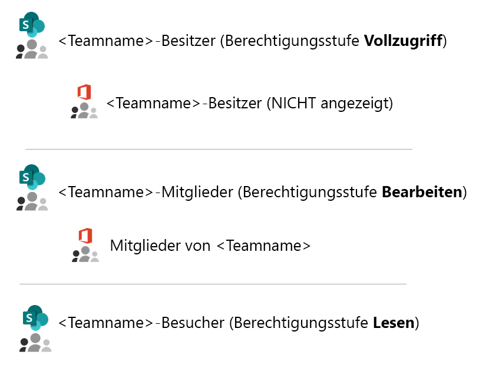
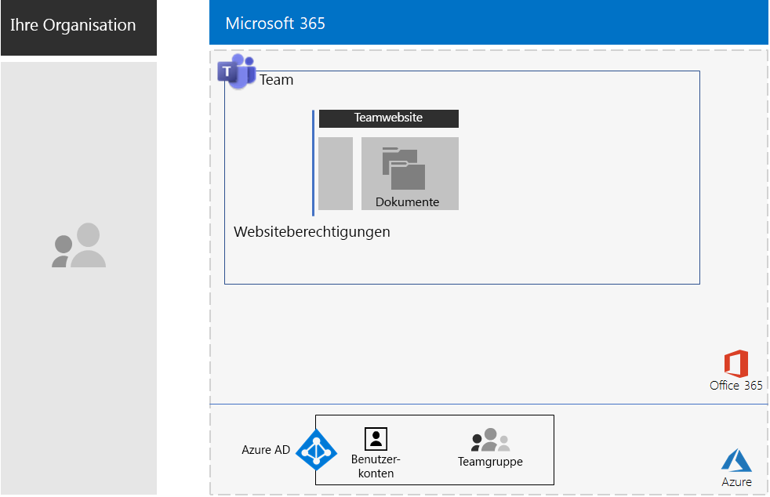
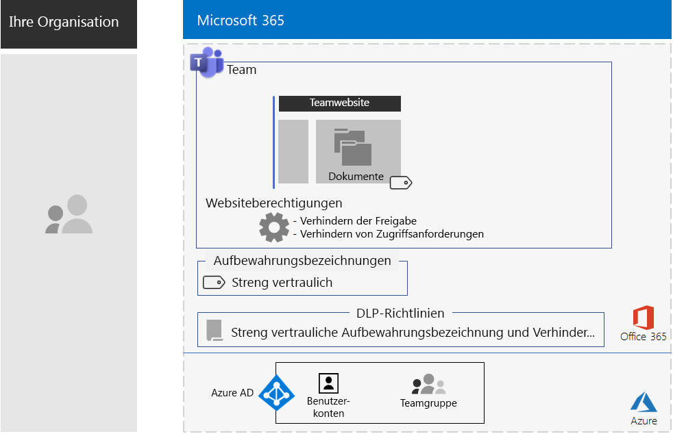
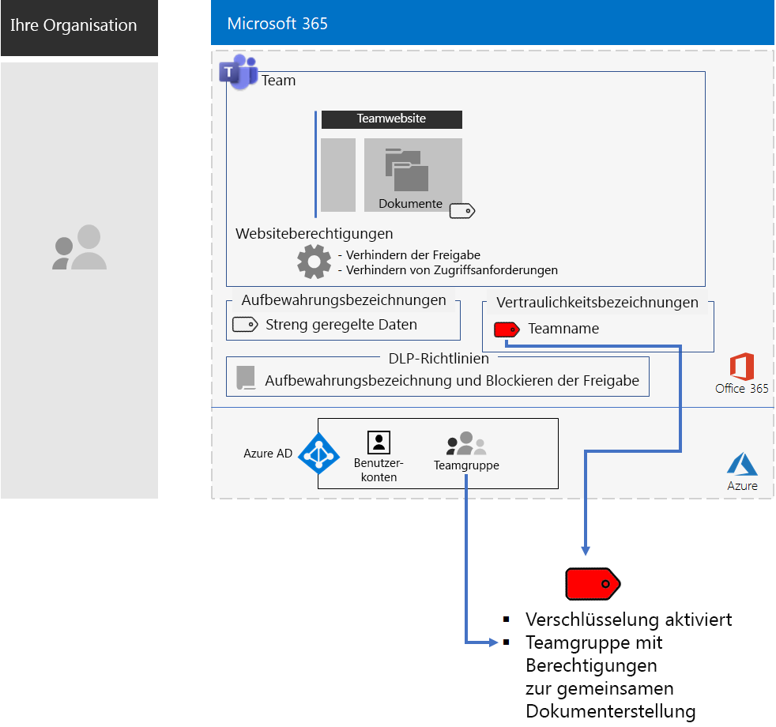
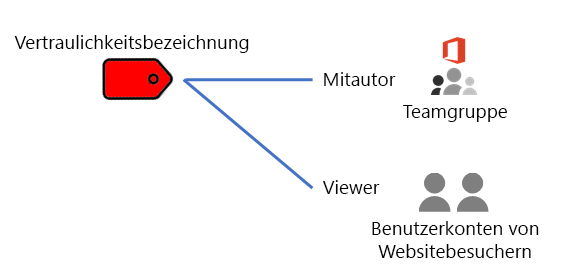
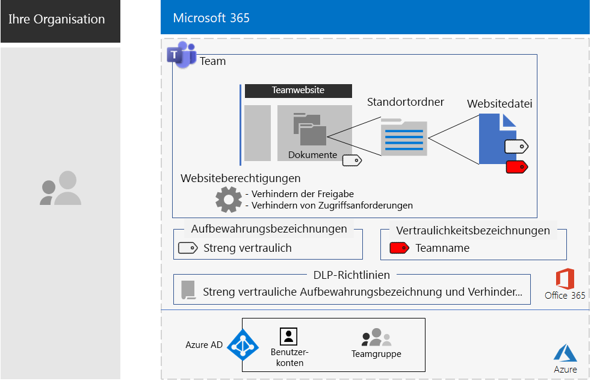

# Teams für streng regulierte Daten

Dieser Artikel enthält Empfehlungen und beschreibt die Schritte zum Konfigurieren eines privaten Teams in Microsoft Teams, das den Zugriff auf Teams-Features, z. B. Chats, Besprechungen und Dateien, auf die Mitglieder und Besitzer der Office 365-Gruppe für dieses Team beschränkt. 

Neben dem privaten Zugriff, der auf der Office 365-Gruppe basiert, wird in diesem Artikel beschrieben, wie die zugrunde liegende private SharePoint-Teamwebsite, auf die Sie über den Abschnitt **Dateien** eines Teamkanals zugreifen können, für die zusätzliche Sicherheit konfiguriert wird, die für die Speicherung von streng regulierten Daten erforderlich ist. Auf dieser SharePoint-Teamwebsite können Sie Dateien, Seiten, einen freigegebenen Kalender, Aufgaben, ein Notizbuch und Listen speichern und gemeinsam bearbeiten.

>[!Note]
> [Hier](teams-sharepoint-online-sites-highly-regulated-data.md) finden Sie ein ähnliches Szenario unter Verwendung von SharePoint.
>

Die Elemente der Konfiguration für ein Team für streng regulierte Daten sind:

- Ein privates Team mit einer entsprechenden Office 365-Gruppe, die über Benutzerkonten für Besitzer und Mitglieder verfügt.
- Zusätzliche Sicherheit auf der zugrunde liegenden SharePoint-Website für das Team, die verhindert,
  - Dass Mitglieder der Website anderen Personen Zugriff gewähren.
  - Dass Nicht-Mitglieder der Website Zugriff auf die Website anfordern.
- Eine Office 365-Aufbewahrungsbezeichnung für die zugrunde liegende SharePoint-Website, die automatisch auf neue Dateien auf der Website angewendet wird, als Standardmethode zum Definieren von Aufbewahrungsrichtlinien.
- Eine DLP-Richtlinie (Data Loss Prevention, Verhinderung von Datenverlust), die anhand der Aufbewahrungsbezeichnung Benutzer daran hindert, Dateien für Empfänger außerhalb der Organisation freizugeben oder an diese zu senden.
- Eine Office 365-Vertraulichkeitsbezeichnung oder eine Unterbezeichnung einer streng regulierten Bezeichnung, für die Verschlüsselung aktiviert ist und die über Co-Autor-Berechtigungen für die Office 365-Gruppe des Teams verfügt. Benutzer wenden die Bezeichnung oder Unterbezeichnung über die Menüleistenoption "Vertraulichkeit" in Word, Excel und PowerPoint auf Dateien an, die im Abschnitt **Dateien** des Teams gespeichert sind.

Hier sehen Sie die resultierende Konfiguration mit einer Vertraulichkeitsbezeichnung.

 Eine einseitige Zusammenfassung dieses Szenarios finden Sie auf dem [Poster für Teams für streng regulierte Daten](./media/secure-teams-highly-regulated-data-scenario/TeamsHighlyRegulatedData.pdf).

Sie können dieses Poster herunterladen als [PDF](https://github.com/MicrosoftDocs/microsoft-365-docs/raw/public/microsoft-365/enterprise/media/secure-teams-highly-regulated-data-scenario/TeamsHighlyRegulatedData.pdf) herunterladen und in den Formaten "Brief", "Legal" oder "Tabloid" (27,94 x 43,18 cm) ausdrucken.

## Phase 1: Konfigurieren eines Teams für stark regulierte Daten

Die End-to-End-Konfiguration umfasst folgende Schritte:

1. Konfigurieren des Identitäts- und Gerätezugriffs.
2. Erstellen eines privaten Teams.
3. Konfigurieren der zugrunde liegenden SharePoint-Website für zusätzliche Sicherheit.
4. Erstellen Sie einer Aufbewahrungsbezeichnung und einer DLP-Richtlinie.
5. Erstellen der Bezeichnung oder einer Unterbezeichnung der streng regulierten Bezeichnung.

### Schritt 1: Konfigurieren des Identitäts- und Gerätezugriffs

Um den Zugriff auf das Team und dessen zugrunde liegende SharePoint-Website zu schützen, stellen Sie sicher, dass Sie [Identitäts- und Gerätezugriffsrichtlinien](https://docs.microsoft.com/microsoft-365/enterprise/identity-access-policies) und die [empfohlenen SharePoint Online-Zugriffsrichtlinien](https://docs.microsoft.com/microsoft-365/enterprise/sharepoint-file-access-policies) konfiguriert haben.

### Schritt 2: Erstellen eines privaten Teams

Folgen Sie [diesen Anweisungen](https://support.office.com/article/create-a-team-from-scratch-174adf5f-846b-4780-b765-de1a0a737e2b), um ein privates Team zu erstellen.

Wenn Sie ein privates Team erstellen, gelten die folgenden Standardberechtigungen:

- Die Office 365-Gruppe für das Team (die Teamgruppe) verfügt über Gruppenbesitzer und Gruppenmitglieder.
- Für die zugrunde liegende SharePoint-Website für das Team (die Teamwebsite):
  - Die Websitesammlungsadministratoren werden für die Teamgruppenbesitzer konfiguriert
  - Für die Teamwebsite: 
    - Die SharePoint-Gruppe der Teamwebsitebesitzer – mit der Berechtigungsstufe "Vollzugriff" – wird auf die Teamgruppenbesitzer festgelegt.
    - Die SharePoint-Gruppe der Teamwebsitemitglieder – mit der Berechtigungsstufe "Bearbeiten" – wird auf die Teamgruppenmitglieder festgelegt.
    - Die SharePoint-Gruppe "Teamwebsitebesucher" – mit der Berechtigungsstufe "Lesen" – enthält keine Gruppen oder Benutzerkonten.

Die folgenden Standardberechtigungen gelten für die Teamwebsite.

 
>[!Note]
>Wenn Sie die SharePoint-Gruppe "\<Teamname > Besitzer" für die Berechtigungsstufe "Bearbeiten" anzeigen, wird "\<Teamname > Besitzer" nicht angezeigt.
>

Die resultierenden Berechtigungen ermöglichen Folgendes:

- Teamgruppenbesitzer können die Website verwalten und haben Vollzugriff auf die Websiteinhalte.
- Teamgruppenmitglieder können Dateien auf der Website erstellen und bearbeiten. 

Die Verwaltung von Berechtigungen entspricht der Verwaltung von Teammitgliedern und -besitzern.

Nachfolgend sehen Sie die daraus resultierende Konfiguration bis zu diesem Punkt.

 
### Schritt 3: Konfigurieren der zugrunde liegenden SharePoint-Website für zusätzliche Sicherheit

Konfigurieren Sie diese Berechtigungseinstellungen auf der Teamwebsite.

1. Klicken Sie in der Symbolleiste auf das Symbol "Einstellungen" und anschließend auf **Websiteberechtigungen**.
2. Klicken Sie im Bereich **Websiteberechtigungen** unter **Freigabeeinstellungen** auf **Freigabeeinstellungen ändern**.
3. Wählen Sie unter **Freigabeberechtigungen** die Option **Nur Websitebesitzer können Dateien, Ordner und die Website teilen** aus.
4. Deaktivieren Sie **Zugriffsanforderungen zulassen**, und klicken Sie dann auf **Speichern**.

Bei diesen Einstellungen ist die Möglichkeit, dass Teamgruppenmitglieder die Teamwebsite mit anderen Mitgliedern oder Nichtmitgliedern teilen, um den Zugriff auf die Teamwebsite anzufordern, deaktiviert.

Nachfolgend sehen Sie die daraus resultierende Konfiguration bis zu diesem Punkt.

 
### Schritt 4: Erstellen Sie einer Aufbewahrungsbezeichnung und einer DLP-Richtlinie

Verwenden Sie [diese Anleitungen](https://docs.microsoft.com/microsoft-365/security/office-365-security/deploy-teams-retention-dlp) für folgende Aktionen:

1. Erstellen und Veröffentlichen einer Aufbewahrungsbezeichnung für stark regulierte Daten (sofern erforderlich).
2. Konfigurieren der Teamwebsite für die in Schritt 1 erstellte Aufbewahrungsbezeichnung.
3. Erstellen einer DLP-Richtlinie für stark regulierte Daten, die die in Schritt 2 erstellte Aufbewahrungsbezeichnung verwendet und Benutzer am Senden von Dateien an Ziele außerhalb der Organisation hindert. Sie können die Richtlinie auch basierend auf [DLP Richtlinienvorlagen](https://docs.microsoft.com/microsoft-365/compliance/data-loss-prevention-policies#dlp-policy-templates) für zusätzliche Anforderungen konfigurieren, z. B. für Vorschriften aus dem Gesundheitswesen oder der Finanzbranche.

Nachfolgend sehen Sie die daraus resultierende Konfiguration bis zu diesem Punkt.

 
### Schritt 5: Erstellen der Bezeichnung oder einer Unterbezeichnung der streng regulierten Bezeichnung

Im Gegensatz zu einer Vertraulichkeitsbezeichnung für streng regulierte Daten, die von jedem auf eine beliebige Datei angewendet werden kann, benötigt ein sicheres Team eine eigene Bezeichnung oder Unterbezeichnung, damit für Dateien, denen diese Bezeichnung oder Unterbezeichnung zugeordnet ist, Folgendes gilt:

- Die Dateien werden verschlüsselt, und die Verschlüsselung ist an die Dateien gebunden.
- Die Dateien enthalten benutzerdefinierte Berechtigungen, sodass sie nur von Mitgliedern der Teamgruppe geöffnet werden können.

Um diese zusätzliche Sicherheitsstufe für die auf der Teamwebsite gespeicherten Dateien zu erreichen, müssen Sie eine neue Vertraulichkeitsbezeichnung konfigurieren, bei der es sich entweder um eine eigene Bezeichnung oder um eine Unterbezeichnung der allgemeinen Bezeichnung für stark regulierten Dateien handelt. Diese wird nur für Teamgruppenmitglieder in der Liste der Bezeichnungen angezeigt.

Verwenden Sie eine Vertraulichkeitsbezeichnung, wenn Sie nur eine kleine Anzahl von Bezeichnungen für die globale Nutzung und für einzelne private Teams benötigen. Verwenden Sie eine Vertraulichkeitsunterbezeichnung, wenn Sie über eine große Anzahl von Bezeichnungen verfügen oder Bezeichnungen für private Teams unter der streng regulierten Bezeichnung organisieren möchten.

[Verwenden Sie diese Anweisungen ](https://docs.microsoft.com/microsoft-365/compliance/encryption-sensitivity-labels) zum Konfigurieren einer separaten Bezeichnung oder einer Unterbezeichnung mit den folgenden Einstellungen:

- Der Name der Bezeichnung enthält den Namen des Teams.
- Die Verschlüsselung ist aktiviert.
- Die Teamgruppe verfügt über Berechtigungen für die gemeinsame Dokumenterstellung.

Hier sehen Sie die resultierende Konfiguration mit der neuen Bezeichnung.

Hier sehen Sie die Beziehung zwischen der Vertraulichkeitsbezeichnung und der Teamgruppe.

>[!Note]
>Wenn Sie die Vertraulichkeitsbezeichnung oder eine Unterbezeichnung für benutzerdefinierte Berechtigungen oder mit einem Ablaufdatum konfigurieren, können Sie die Datei nicht aus Microsoft Teams oder SharePoint öffnen. Sie müssen eine Office-App verwenden.
>

### Benutzerdefinierte Berechtigungen

Sie können auch benutzerdefinierte SharePoint-Websiteberechtigungen für die Teamwebsite und, falls erforderlich, die entsprechende Vertraulichkeitsbezeichnung konfigurieren. Es folgen zwei Beispiele.

#### Beispiel 1: Delegieren der SharePoint-Websiteverwaltung

Wenn der Teambesitzer keine SharePoint-Verwaltungsoberfläche hat oder die Verwaltung der Teamwebsite delegieren möchte, könnte er das Benutzerkonto eines SharePoint-Administrators zur Liste der Teambesitzer hinzufügen. Aber dann hat der SharePoint-Administrator Vollzugriff auf das Team und alle zugehörigen Ressourcen und wäre in der Lage, eine Datei mit angewendeter Vertraulichkeitsbezeichnung zu öffnen. 

Um diese Zuweisung von zu vielen Berechtigungen zu verhindern, fügen Sie das Benutzerkonto des SharePoint-Administrators der SharePoint-Gruppe "Teamwebsitebesitzer" in den erweiterten Berechtigungseinstellungen der Website hinzu. Der SharePoint-Administrator kann die Website verwalten, aber ist nicht in der Lage, auf das Team und seine Ressourcen zuzugreifen oder die Dateien mit zugewiesenen Vertraulichkeitsbezeichnungen zu öffnen.

#### Beispiel 2: Zulassen des schreibgeschützten Zugriffs auf Dateien mit Bezeichnungen

Wenn einige Mitarbeiter den Inhalt von Dateien mit Bezeichnungen in der Teamwebsite nur anzeigen müssen, fügen Sie die einzelnen Benutzerkonten zur

- SharePoint-Gruppe "\<Teamname > Besucher" hinzu, die standardmäßig über die Berechtigungsstufe "Lesen" verfügt. 
- Die Vertraulichkeitsbezeichnung mit Leseberechtigungen.

Hier sehen Sie die resultierenden Berechtigungen für die Bezeichnung.

 
Die Websitebesucher können direkt auf die Teamwebsite zugreifen und die Inhalte von Dateien anzeigen, auf die die Unterbezeichnung angewendet wurde. Da Sie aber keine Mitglieder der Teamgruppe sind, können sie nicht auf das Team oder die zugehörigen Ressourcen zugreifen.

## Phase 2: Fördern der Benutzerakzeptanz für Teammitglieder

Wenn das Team aktiv ist, ist es an der Zeit, die Benutzerakzeptanz dieses Teams und dessen zusätzlicher Sicherheit für Teammitglieder zu fördern.

### Schritt 1: Schulen der Benutzer

Mitglieder der Teamgruppe können auf das Team und alle zugehörigen Ressourcen zugreifen, b. B. Chats, Besprechungen und andere Apps. Wenn Sie mit Dateien aus dem Abschnitt **Dateien** eines Kanals arbeiten, müssen die Mitglieder der Teamgruppe den für das sichere Team erstellten Dateien die Vertraulichkeitsbezeichnung oder eine Unterbezeichnung zuweisen. Es folgt ein Beispiel.

 
Wird die Bezeichnung auf eine Datei angewendet, ist diese abgesichert. Mitglieder der Teamgruppe können sie in Teams öffnen und in Echtzeit zusammenarbeiten. Sie wird verschlüsselt und umfasst die für die Teamgruppenmitglieder festgelegten Co-Autor-Berechtigungen. Wenn die Datei die Website verlässt und an einen böswilligen Benutzer weitergeleitet wird, lässt sich die Datei nur öffnen, und ihr Inhalt kann nur angezeigt werden, wenn die Anmeldeinformationen eines Benutzerkontos angegeben werden, das Mitglied der Teamgruppe ist. 

Schulen Sie Ihre Teammitglieder:

- Vermitteln Sie ihnen, wie wichtig es ist, das neue Team für Chats, Besprechungen, Dateien und andere Ressourcen der Teamwebsite zu nutzen und welche Auswirkungen ein Verlust streng regulierter Daten hat, z. B. rechtliche Konsequenzen, Bußgelder, Ransomware oder Verlust des Wettbewerbsvorteils.
- So greifen Sie auf das Team zu.
- Erklären Sie, wie neue Dateien auf der Website erstellt und neue, lokal gespeicherte Dateien hochgeladen werden.
- Veranschaulichen Sie, wie durch die DLP-Richtlinie verhindert wird, dass Dateien extern freigegeben werden.
- So beschriften Sie Dateien mit der Bezeichnung oder Unterbezeichnung des Teams.
- Veranschaulichen Sie, wie die Bezeichnung oder Unterbezeichnung Dateien schützt, auch wenn sie die Website verlassen.

Diese Schulung sollte praktische Übungen umfassen, damit die Teammitglieder diese Funktionen und deren Ergebnisse ausprobieren können.

### Schritt 2: Durchführen regelmäßiger Verwendungsprüfungen und Behandeln des Feedbacks der Teammitglieder.

In den Wochen nach der Schulung:

- Reagieren Sie umgehend auf Feedback von Teammitgliedern und optimieren Sie die Richtlinien und Konfigurationen.
- Analysieren Sie die Verwendung der Website und vergleichen Sie sie mit den Erwartungen.
- Sicherstellen, dass streng regulierte Dateien korrekt mit der eigens erstellten Vertraulichkeitsbezeichnung oder -unterbezeichnung gekennzeichnet wurden.

  Sie können sehen, welchen Dateien eine Bezeichnung zugeordnet ist, indem Sie einen Ordner in SharePoint anzeigen und über die Option **Spalten ein-/ausblenden** > **Spalte hinzufügen** die Spalte **Vertraulichkeit** hinzufügen.

Ihre Benutzer bei Bedarf erneut schulen.

## Siehe auch

[SharePoint-Websites für streng regulierte Daten](teams-sharepoint-online-sites-highly-regulated-data.md)

[Microsoft 365 Enterprise-Arbeitslasten und -Szenarien](deploy-workloads.md)

[Microsoft 365-Produktivitätsbibliothek](https://aka.ms/productivitylibrary) (https://aka.ms/productivitylibrary)

[Bereitstellungshandbuch](deploy-microsoft-365-enterprise.md)
