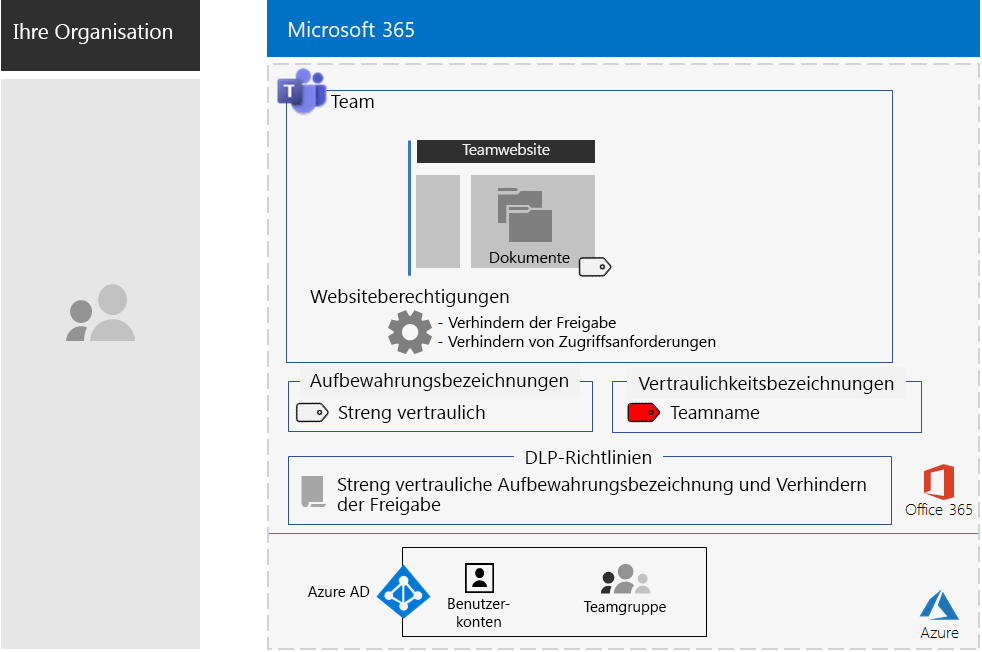
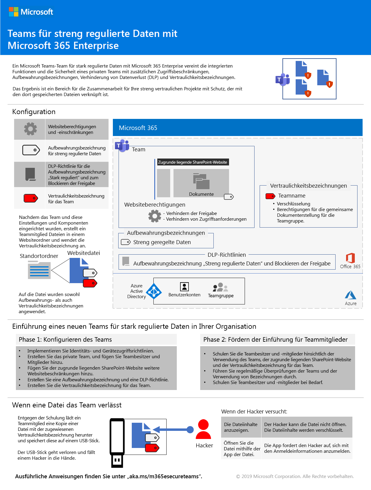
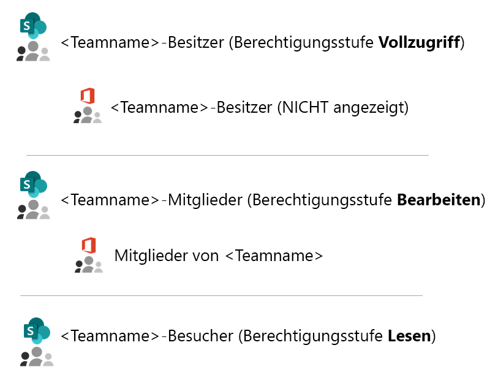
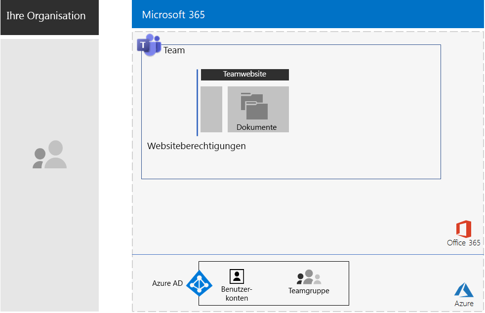
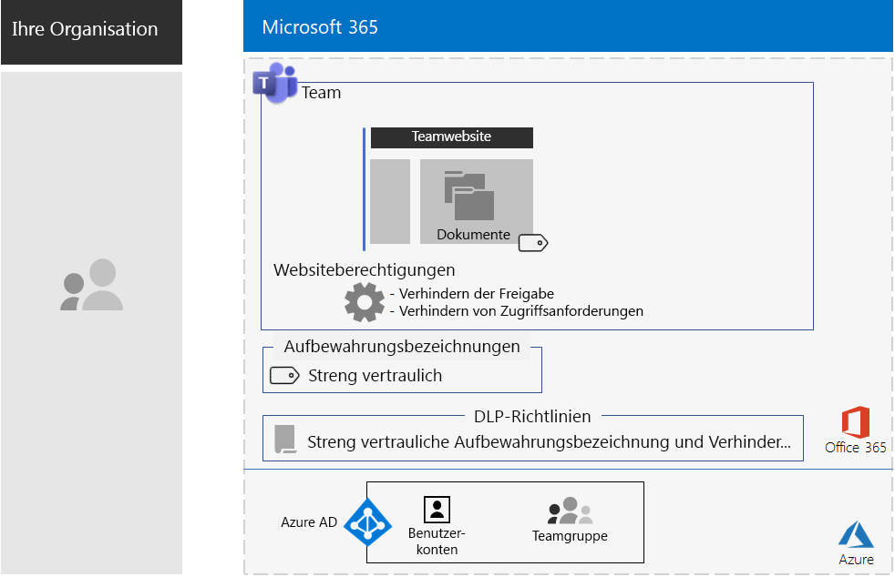
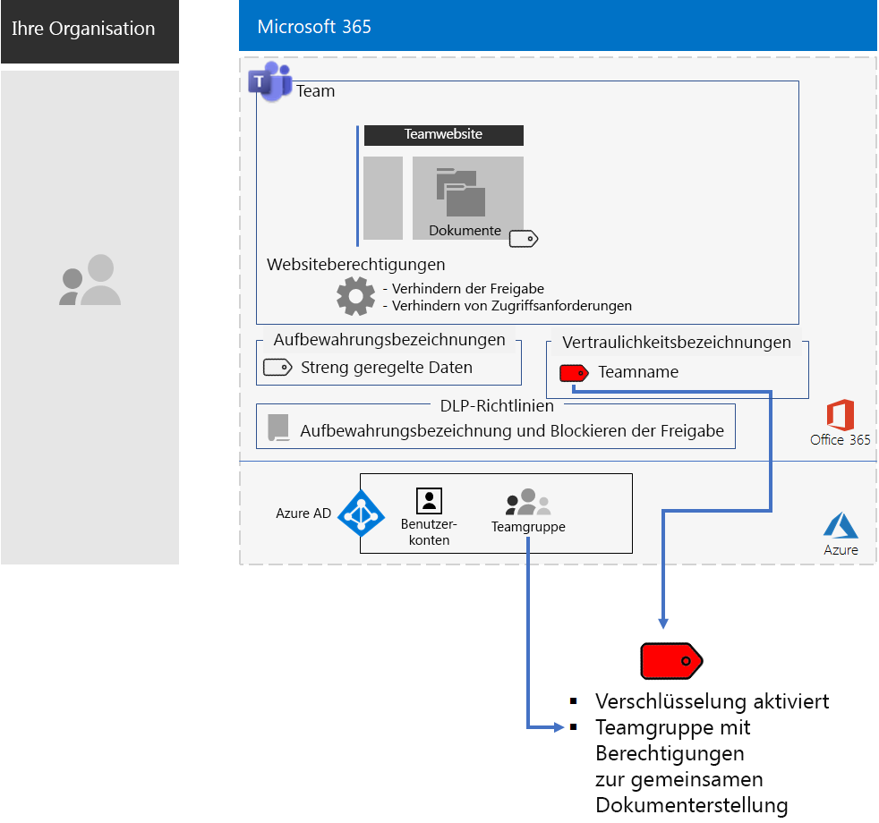
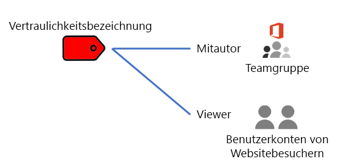
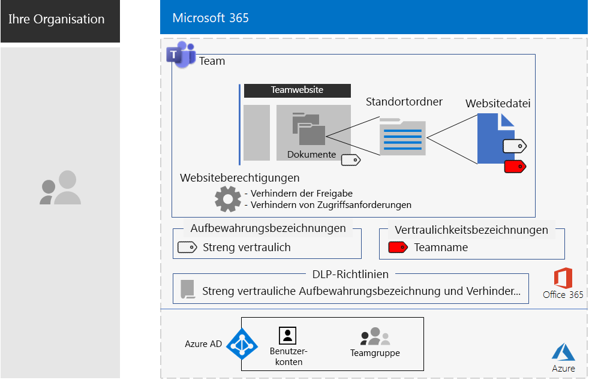

# Teams für streng regulierte DatenTeams for highly regulated data

Dieser Artikel enthält Empfehlungen und beschreibt die Schritte zum Konfigurieren eines privaten Teams in Microsoft Teams, das den Zugriff auf Teams-Features, z. B. Chats, Besprechungen und Dateien, auf die Mitglieder und Besitzer der Microsoft 365-Gruppe für dieses Team beschränkt.This article provides you with recommendations and steps to configure a private team in Microsoft Teams that locks down access to Teams features—such as chats, meetings, and files—to only members and owners of the Microsoft 365 group for the team. 

Neben dem privaten Zugriff, der auf der Microsoft 365-Gruppe basiert, wird in diesem Artikel beschrieben, wie die zugrunde liegende private SharePoint-Teamwebsite, auf die Sie über den Abschnitt **Dateien** eines Teamkanals zugreifen können, für die zusätzliche Sicherheit konfiguriert wird, die für die Speicherung von streng regulierten Daten erforderlich ist.Beyond the private access based on the Microsoft 365 group, this article describes how to configure the underlying private SharePoint team site, which you can access from the **Files** section of a team channel, for the additional security needed to store highly regulated data. Auf dieser SharePoint-Teamwebsite können Sie Dateien, Seiten, einen freigegebenen Kalender, Aufgaben, ein Notizbuch und Listen speichern und gemeinsam bearbeiten.On this SharePoint team site, you can store and collaborate on files, pages, a shared calendar, tasks, a notebook, and lists.

>[!Note]
> [Hier](teams-sharepoint-online-sites-highly-regulated-data.md) finden Sie ein ähnliches Szenario unter Verwendung von SharePoint.A similar scenario using SharePoint is [here](teams-sharepoint-online-sites-highly-regulated-data.md).
>

Die Elemente der Konfiguration für ein Team für streng regulierte Daten sind:The elements of configuration for a team for highly regulated data are:

- Ein privates Team mit einer entsprechenden Microsoft 365-Gruppe, die über Benutzerkonten für Besitzer und Mitglieder verfügt.A private team with a corresponding Microsoft 365 group that has owner and member user accounts.
- Zusätzliche Sicherheit auf der zugrunde liegenden SharePoint-Website für das Team, die verhindert,Additional security on the underlying SharePoint site for the team that:
  - Dass Mitglieder der Website anderen Personen Zugriff gewähren.Prevents members of the site from granting access to others.
  - Dass Nicht-Mitglieder der Website Zugriff auf die Website anfordern.Prevents non-members of the site from requesting access to the site.
- Eine Aufbewahrungsbezeichnung für die zugrunde liegende SharePoint-Website, die automatisch auf neue Dateien auf der Website angewendet wird, als Standardmethode zum Definieren von Aufbewahrungsrichtlinien.A retention label for the underlying SharePoint site that is automatically applied to new files on the site as a default way to define retention policies.
- Eine DLP-Richtlinie (Data Loss Prevention, Verhinderung von Datenverlust), die anhand der Aufbewahrungsbezeichnung Benutzer daran hindert, Dateien für Empfänger außerhalb der Organisation freizugeben oder an diese zu senden.A Data Loss Prevention (DLP) policy that uses the retention label and blocks users from sharing or sending files outside the organization.
- Eine Vertraulichkeitsbezeichnung oder eine Unterbezeichnung einer streng regulierten Bezeichnung, für die Verschlüsselung aktiviert ist und die über Co-Autor-Berechtigungen für die Microsoft 365-Gruppe des Teams verfügt.A sensitivity label or a sublabel of a highly regulated label that has encryption enabled and Co-Author permissions for the Microsoft 365 group of the team. Benutzer wenden die Bezeichnung oder Unterbezeichnung über die Menüleistenoption **Vertraulichkeit** in Word, Excel und PowerPoint auf Dateien an, die im Abschnitt **Dateien** des Teams gespeichert sind.Users apply the label or sublabel to files stored in **Files** section of the team from the **Sensitivity** menu bar option in Word, Excel, and PowerPoint.

Hier sehen Sie die resultierende Konfiguration mit einer Vertraulichkeitsbezeichnung.Here is the resulting configuration with a sensitivity label.

Sehen Sie sich dieses kurze Video an, um eine kurze Übersicht zu erhalten.For a quick overview, watch this short video.

> [!VIDEO https://www.microsoft.com/videoplayer/embed/RE4mGHf]

 Eine einseitige Zusammenfassung dieses Szenarios finden Sie auf dem [Poster für Teams für streng regulierte Daten](../media/secure-teams-highly-regulated-data-scenario/TeamsHighlyRegulatedData.pdf).For a 1-page summary of this scenario, see the [Teams for highly regulated data poster](../media/secure-teams-highly-regulated-data-scenario/TeamsHighlyRegulatedData.pdf).

Sie können dieses Poster auch im [PDF](https://github.com/MicrosoftDocs/microsoft-365-docs/raw/public/microsoft-365/media/secure-teams-highly-regulated-data-scenario/TeamsHighlyRegulatedData.pdf)- oder [PowerPoint](https://github.com/MicrosoftDocs/microsoft-365-docs/raw/public/microsoft-365/media/secure-teams-highly-regulated-data-scenario/Teams-Highly-Regulated-Data-Poster.pptx)-Format herunterladen und in den Formaten "Brief", "Legal" oder "Tabloid" (27,94 x 43,18 cm) ausdrucken.You can also download this poster in [PDF](https://github.com/MicrosoftDocs/microsoft-365-docs/raw/public/microsoft-365/media/secure-teams-highly-regulated-data-scenario/TeamsHighlyRegulatedData.pdf) or [PowerPoint](https://github.com/MicrosoftDocs/microsoft-365-docs/raw/public/microsoft-365/media/secure-teams-highly-regulated-data-scenario/Teams-Highly-Regulated-Data-Poster.pptx) formats and print it on letter, legal, or tabloid (11 x 17)-sized paper.

## Phase 1: Konfigurieren eines Teams für stark regulierte DatenPhase 1: Configure a team for highly regulated data

Die End-to-End-Konfiguration umfasst folgende Schritte:The end-to-end configuration consists of these steps:

1. Konfigurieren des Identitäts- und Gerätezugriffs.Configure identity and device access.
2. Erstellen eines privaten Teams.Create a private team.
3. Konfigurieren der zugrunde liegenden SharePoint-Website für zusätzliche Sicherheit.Configure the underlying SharePoint site for additional security.
4. Erstellen Sie einer Aufbewahrungsbezeichnung und einer DLP-Richtlinie.Create a retention label and DLP policy.
5. Erstellen der Bezeichnung oder einer Unterbezeichnung der streng regulierten Bezeichnung.Create the label or sublabel of the highly regulated label.

### Schritt 1: Konfigurieren des Identitäts- und GerätezugriffsStep 1: Configure identity and device access

Um den Zugriff auf das Team und dessen zugrunde liegende SharePoint-Website zu schützen, stellen Sie sicher, dass Sie [Identitäts- und Gerätezugriffsrichtlinien](https://docs.microsoft.com/microsoft-365/enterprise/identity-access-policies) und die [empfohlenen SharePoint Online-Zugriffsrichtlinien](https://docs.microsoft.com/microsoft-365/enterprise/sharepoint-file-access-policies) konfiguriert haben.To protect access to the team and its underlying SharePoint site, ensure that you have configured [identity and device access policies](https://docs.microsoft.com/microsoft-365/enterprise/identity-access-policies) and the recommended [SharePoint Online access policies](https://docs.microsoft.com/microsoft-365/enterprise/sharepoint-file-access-policies).

### Schritt 2: Erstellen eines privaten TeamsStep 2: Create a private team

Folgen Sie [diesen Anweisungen](https://support.office.com/article/create-a-team-from-scratch-174adf5f-846b-4780-b765-de1a0a737e2b), um ein privates Team zu erstellen.Use [these instructions](https://support.office.com/article/create-a-team-from-scratch-174adf5f-846b-4780-b765-de1a0a737e2b) to create a private team.

Wenn Sie ein privates Team erstellen, gelten die folgenden Standardberechtigungen:When you create a private team, here are the default permissions:

- Die Microsoft 365-Gruppe für das Team (die Teamgruppe) verfügt über Gruppenbesitzer und Gruppenmitglieder.The Microsoft 365 group for the team (the Team Group) has group owners and group members
- Für die zugrunde liegende SharePoint-Website für das Team (die Teamwebsite):For the underlying SharePoint site for the team (the Team Site):
  - Die Websitesammlungsadministratoren werden für die Teamgruppenbesitzer konfiguriertThe Site Collection Administrators is configured for the Team Group owners
  - Für die Teamwebsite:For the Team Site: 
    - Die SharePoint-Gruppe der Teamwebsitebesitzer – mit der Berechtigungsstufe "Vollzugriff" – wird auf die Teamgruppenbesitzer festgelegt.The Team Site Owners SharePoint group—with the Full Control permission level—is set to the Team Group owners
    - Die SharePoint-Gruppe der Teamwebsitemitglieder – mit der Berechtigungsstufe "Bearbeiten" – wird auf die Teamgruppenmitglieder festgelegt.The Team Site Members SharePoint group—with the Edit permission level—is set to the Team Group members
    - Die SharePoint-Gruppe "Teamwebsitebesucher" – mit der Berechtigungsstufe "Lesen" – enthält keine Gruppen oder Benutzerkonten.The Team Site Visitors SharePoint group—with the Read permission level—has no groups or user accounts

Die folgenden Standardberechtigungen gelten für die Teamwebsite.Here are the default permissions for the Team Site.

 
>[!Note]
>Wenn Sie die SharePoint-Gruppe "\<Teamname > Besitzer" für die Berechtigungsstufe "Bearbeiten" anzeigen, wird "\<Teamname > Besitzer" nicht angezeigt.If you view the \<team name> Owners SharePoint group for the Edit permission level, it does not display \<team name> Owners.
>

Die resultierenden Berechtigungen ermöglichen Folgendes:The resulting permissions allow:

- Teamgruppenbesitzer können die Website verwalten und haben Vollzugriff auf die Websiteinhalte.Team Group owners to administer the site and have full control over the site contents.
- Teamgruppenmitglieder können Dateien auf der Website erstellen und bearbeiten.Team Group members to create and edit files on the site. 

Die Verwaltung von Berechtigungen entspricht der Verwaltung von Teammitgliedern und -besitzern.Permissions maintenance is the same as team member and owner maintenance.

Nachfolgend sehen Sie die daraus resultierende Konfiguration bis zu diesem Punkt.Here’s the resulting configuration so far.

 
### Schritt 3: Konfigurieren der zugrunde liegenden SharePoint-Website für zusätzliche SicherheitStep 3: Configure the underlying SharePoint site for additional security

Konfigurieren Sie diese Berechtigungseinstellungen auf der Teamwebsite.From the Team Site, configure these permission settings.

1. Klicken Sie in der Symbolleiste auf das Symbol "Einstellungen" und anschließend auf **Websiteberechtigungen**.In the tool bar, click the settings icon, and then click **Site permissions**.
2. Klicken Sie im Bereich **Websiteberechtigungen** unter **Freigabeeinstellungen** auf **Freigabeeinstellungen ändern**.In the **Site permissions** pane, under **Sharing Settings**, click **Change sharing settings**.
3. Wählen Sie unter **Freigabeberechtigungen** die Option **Nur Websitebesitzer können Dateien, Ordner und die Website teilen** aus.Under **Sharing permissions**, choose **Only site owners can share files, folders, and the site**.
4. Deaktivieren Sie **Zugriffsanforderungen zulassen**, und klicken Sie dann auf **Speichern**.Turn off **Allow access requests**, and then click **Save**.

Bei diesen Einstellungen ist die Möglichkeit, dass Teamgruppenmitglieder die Teamwebsite mit anderen Mitgliedern oder Nichtmitgliedern teilen, um den Zugriff auf die Teamwebsite anzufordern, deaktiviert.With these settings, the ability for Team Group members to share the Team Site with other members or for non-members to request access to the Team Site is disabled.

Nachfolgend sehen Sie die daraus resultierende Konfiguration bis zu diesem Punkt.Here’s the resulting configuration so far.

 
### Schritt 4: Erstellen Sie einer Aufbewahrungsbezeichnung und einer DLP-RichtlinieStep 4: Create a retention label and DLP policy

Verwenden Sie [diese Anleitungen](https://docs.microsoft.com/microsoft-365/security/office-365-security/deploy-teams-retention-dlp) für folgende Aktionen:Use [these instructions](https://docs.microsoft.com/microsoft-365/security/office-365-security/deploy-teams-retention-dlp) to:

1. Erstellen und Veröffentlichen einer Aufbewahrungsbezeichnung für stark regulierte Daten (sofern erforderlich).Create and publish a retention label for highly regulated data (if needed).
2. Konfigurieren der Teamwebsite für die in Schritt 1 erstellte Aufbewahrungsbezeichnung.Configure the Team Site for the retention label created in step 1.
3. Erstellen einer DLP-Richtlinie für stark regulierte Daten, die die in Schritt 2 erstellte Aufbewahrungsbezeichnung verwendet und Benutzer am Senden von Dateien an Ziele außerhalb der Organisation hindert.Create a DLP policy for highly regulated data that uses the retention label created in step 2 and blocks users from sending files outside the organization. Sie können die Richtlinie auch basierend auf [DLP Richtlinienvorlagen](https://docs.microsoft.com/microsoft-365/compliance/data-loss-prevention-policies#dlp-policy-templates) für zusätzliche Anforderungen konfigurieren, z. B. für Vorschriften aus dem Gesundheitswesen oder der Finanzbranche.You can also configure the policy for additional requirements, such as those for health and financial industry regulations, based on [DLP policy templates](https://docs.microsoft.com/microsoft-365/compliance/data-loss-prevention-policies#dlp-policy-templates).

Nachfolgend sehen Sie die daraus resultierende Konfiguration bis zu diesem Punkt.Here’s the resulting configuration so far.

 
### Schritt 5: Erstellen einer Vertraulichkeitsbezeichnung oder einer Unterbezeichnung der streng regulierten VertraulichkeitsbezeichnungStep 5: Create a sensitivity label or a sublabel of the highly regulated sensitivity label

Im Gegensatz zu einer Vertraulichkeitsbezeichnung für streng regulierte Daten, die von jedem auf eine beliebige Datei angewendet werden kann, benötigt ein sicheres Team eine eigene Bezeichnung oder Unterbezeichnung, damit für Dateien, denen diese Bezeichnung oder Unterbezeichnung zugeordnet ist, Folgendes gilt:Unlike a sensitivity label for highly regulated data that anyone can apply to any file, a secure team needs its own label or sublabel so that assigned files:

- Die Dateien werden verschlüsselt, und die Verschlüsselung ist an die Dateien gebunden.Are encrypted and the encryption travels with the file.
- Die Dateien enthalten benutzerdefinierte Berechtigungen, sodass sie nur von Mitgliedern der Teamgruppe geöffnet werden können.Contain custom permissions so that only members of the Team Group can open it.

Um diese zusätzliche Sicherheitsstufe für die auf der Teamwebsite gespeicherten Dateien zu erreichen, müssen Sie eine neue Vertraulichkeitsbezeichnung konfigurieren, bei der es sich entweder um eine eigene Bezeichnung oder um eine Unterbezeichnung der allgemeinen Bezeichnung für stark regulierten Dateien handelt.To accomplish this additional level of security for files stored in the Team Site, you must configure a new sensitivity label that is either its own label a sublabel of the general label for highly regulated files. Diese wird nur für Teamgruppenmitglieder in der Liste der Bezeichnungen angezeigt.Only Team Group members will see it in their list of labels.

Verwenden Sie eine Vertraulichkeitsbezeichnung, wenn Sie nur eine kleine Anzahl von Bezeichnungen für die globale Nutzung und für einzelne private Teams benötigen.Use a sensitivity label when you need a small number of labels for both global use and individual private teams. Verwenden Sie eine Vertraulichkeitsunterbezeichnung, wenn Sie über eine große Anzahl von Bezeichnungen verfügen oder Bezeichnungen für private Teams unter der streng regulierten Bezeichnung organisieren möchten.Use a sensitivity sublabel when you have a large number of labels or want to organize labels for private teams under the highly regulated label.

[Verwenden Sie diese Anweisungen ](https://docs.microsoft.com/microsoft-365/compliance/encryption-sensitivity-labels) zum Konfigurieren einer separaten Bezeichnung oder einer Unterbezeichnung mit den folgenden Einstellungen:[Use these instructions](https://docs.microsoft.com/microsoft-365/compliance/encryption-sensitivity-labels) to configure a separate label or a sublabel with the following settings:

- Der Name der Bezeichnung enthält den Namen des Teams.The name of the label contains the name of the team
- Die Verschlüsselung ist aktiviert.Encryption is enabled
- Die Teamgruppe verfügt über Berechtigungen für die gemeinsame Dokumenterstellung.The Team Group has Co-Author permissions

Hier sehen Sie die resultierende Konfiguration mit der neuen Bezeichnung.Here’s the resulting configuration with the new label.

Hier sehen Sie die Beziehung zwischen der Vertraulichkeitsbezeichnung und der Teamgruppe.Here’s the relationship between the sensitivity label and the Team Group.

>[!Note]
>Wenn Sie die Vertraulichkeitsbezeichnung oder eine Unterbezeichnung für benutzerdefinierte Berechtigungen oder mit einem Ablaufdatum konfigurieren, können Sie die Datei nicht aus Microsoft Teams oder SharePoint öffnen.If you configure the sensitivity label or sublabel for user-defined permissions or with an expiration date, you cannot open the file from Teams or SharePoint. Sie müssen eine Office-App verwenden.You must use an Office app.
>

### Benutzerdefinierte BerechtigungenCustom permissions

Sie können auch benutzerdefinierte SharePoint-Websiteberechtigungen für die Teamwebsite und, falls erforderlich, die entsprechende Vertraulichkeitsbezeichnung konfigurieren.You can also configure custom SharePoint site permissions for the Team Site and, if needed, its corresponding sensitivity label. Es folgen zwei Beispiele.Here are two examples.

#### Beispiel 1: Delegieren der SharePoint-WebsiteverwaltungExample 1: Delegating SharePoint site administration

Wenn der Teambesitzer keine SharePoint-Verwaltungsoberfläche hat oder die Verwaltung der Teamwebsite delegieren möchte, könnte er das Benutzerkonto eines SharePoint-Administrators zur Liste der Teambesitzer hinzufügen.If the team owner does not have SharePoint administration experience or wants to delegate administration of the Team Site, they could add the user account of a SharePoint administrator to the list of team owners. Aber dann hat der SharePoint-Administrator Vollzugriff auf das Team und alle zugehörigen Ressourcen und wäre in der Lage, eine Datei mit angewendeter Vertraulichkeitsbezeichnung zu öffnen.But then the SharePoint administrator would have full access to the team and all its resources and would be able to open a file with the sensitivity label applied. 

Um diese Zuweisung von zu vielen Berechtigungen zu verhindern, fügen Sie das Benutzerkonto des SharePoint-Administrators der SharePoint-Gruppe "Teamwebsitebesitzer" in den erweiterten Berechtigungseinstellungen der Website hinzu.To prevent this over-granting of privileges, add the user account of the SharePoint administrator to the Team Site Owners SharePoint group in the advanced permissions settings of the site. Der SharePoint-Administrator kann die Website verwalten, aber ist nicht in der Lage, auf das Team und seine Ressourcen zuzugreifen oder die Dateien mit zugewiesenen Vertraulichkeitsbezeichnungen zu öffnen.The SharePoint administrator can administer the site but will not be able to access the team and any of its resources or open the files with the sensitivity label assigned.

#### Beispiel 2: Zulassen des schreibgeschützten Zugriffs auf Dateien mit BezeichnungenExample 2: Allowing view-only access to labeled files

Wenn einige Mitarbeiter den Inhalt von Dateien mit Bezeichnungen in der Teamwebsite nur anzeigen müssen, fügen Sie die einzelnen Benutzerkonten zurIf some staff only need to view the contents of labeled files in the Team Site, add their individual user accounts to the:

- SharePoint-Gruppe "\<Teamname > Besucher" hinzu, die standardmäßig über die Berechtigungsstufe "Lesen" verfügt.\<team name> Visitors SharePoint group, which by default has the Read permission level. 
- Die Vertraulichkeitsbezeichnung mit Leseberechtigungen.The sensitivity label with the Viewer permissions.

Hier sehen Sie die resultierenden Berechtigungen für die Bezeichnung.Here are the resulting permissions on the label.

 
Die Websitebesucher können direkt auf die Teamwebsite zugreifen und die Inhalte von Dateien anzeigen, auf die die Unterbezeichnung angewendet wurde.The site visitors will be able to access the Team Site directly and view the contents of files that have the sublabel applied. Da Sie aber keine Mitglieder der Teamgruppe sind, können sie nicht auf das Team oder die zugehörigen Ressourcen zugreifen.But because they are not members of the Team Group, they will not be able to access the team or any of its resources.

## Phase 2: Fördern der Benutzerakzeptanz für TeammitgliederPhase 2: Drive user adoption for team members

Wenn das Team aktiv ist, ist es an der Zeit, die Benutzerakzeptanz dieses Teams und dessen zusätzlicher Sicherheit für Teammitglieder zu fördern.With the team in place, it’s time to drive the adoption of this team and its additional security to team members.

### Schritt 1: Schulen der BenutzerStep 1: Train your users

Mitglieder der Teamgruppe können auf das Team und alle zugehörigen Ressourcen zugreifen, b. B. Chats, Besprechungen und andere Apps.Members of the Team Group can access the team and all of its resources, including chats, meetings, and other apps. Wenn Sie mit Dateien aus dem Abschnitt **Dateien** eines Kanals arbeiten, müssen die Mitglieder der Teamgruppe den für das sichere Team erstellten Dateien die Vertraulichkeitsbezeichnung oder eine Unterbezeichnung zuweisen.When working with files from the **Files** section of a channel, members of the Team Group must assign the sensitivity label or sublabel to files created for the secure team. Es folgt ein Beispiel.Here’s an example.

 
Wird die Bezeichnung auf eine Datei angewendet, ist diese abgesichert.When the label gets applied to the file it is secured. Mitglieder der Teamgruppe können sie in Teams öffnen und in Echtzeit zusammenarbeiten.Members of the Team Group can open it in Teams and collaborate in real time. Sie wird verschlüsselt und umfasst die für die Teamgruppenmitglieder festgelegten Co-Autor-Berechtigungen.It is encrypted and includes the Co-Author permissions set to the Team Group members. Wenn die Datei die Website verlässt und an einen böswilligen Benutzer weitergeleitet wird, lässt sich die Datei nur öffnen, und ihr Inhalt kann nur angezeigt werden, wenn die Anmeldeinformationen eines Benutzerkontos angegeben werden, das Mitglied der Teamgruppe ist.If the file leaves the site and gets forwarded to a malicious user, they will have to supply credentials of a user account that is member of the Team Group to open the file and view its contents. 

Schulen Sie Ihre Teammitglieder:Train your team members:

- Vermitteln Sie ihnen, wie wichtig es ist, das neue Team für Chats, Besprechungen, Dateien und andere Ressourcen der Teamwebsite zu nutzen und welche Auswirkungen ein Verlust streng regulierter Daten hat, z. B. rechtliche Konsequenzen, Bußgelder, Ransomware oder Verlust des Wettbewerbsvorteils.On the importance of using the new team for chats, meetings, files, and the other resources of the Team Site and the consequences of a highly regulated data leak, such as legal ramifications, regulatory fines, ransomware, or loss of competitive advantage.
- So greifen Sie auf das Team zu.How to access the team.
- Erklären Sie, wie neue Dateien auf der Website erstellt und neue, lokal gespeicherte Dateien hochgeladen werden.How to create new files on the site and upload new files stored locally.
- Veranschaulichen Sie, wie durch die DLP-Richtlinie verhindert wird, dass Dateien extern freigegeben werden.How the DLP policy blocks them from sharing files externally.
- So beschriften Sie Dateien mit der Bezeichnung oder Unterbezeichnung des Teams.How to label files with the custom label or sublabel for the team.
- Veranschaulichen Sie, wie die Bezeichnung oder Unterbezeichnung Dateien schützt, auch wenn sie die Website verlassen.How the label or sublabel protects files even when they are leaked off the site.

Diese Schulung sollte praktische Übungen umfassen, damit die Teammitglieder diese Funktionen und deren Ergebnisse ausprobieren können.This training should include hands-on exercises so that your team members can experience these capabilities and their results.

### Schritt 2: Durchführen regelmäßiger Verwendungsprüfungen und Behandeln des Feedbacks der Teammitglieder.Step 2: Conduct periodic reviews of usage and address team member feedback

In den Wochen nach der Schulung:In the weeks after training:

- Reagieren Sie umgehend auf Feedback von Teammitgliedern und optimieren Sie die Richtlinien und Konfigurationen.Quickly address team member feedback and fine tune polices and configurations.
- Analysieren Sie die Verwendung der Website und vergleichen Sie sie mit den Erwartungen.Analyze usage for the team and compare it with usage expectations.
- Sicherstellen, dass streng regulierte Dateien korrekt mit der eigens erstellten Vertraulichkeitsbezeichnung oder -unterbezeichnung gekennzeichnet wurden.Verify that highly regulated files have been properly labeled with the custom sensitivity label or sublabel.

  Sie können sehen, welchen Dateien eine Bezeichnung zugeordnet ist, indem Sie einen Ordner in SharePoint anzeigen und über die Option **Spalten ein-/ausblenden** > **Spalte hinzufügen** die Spalte **Vertraulichkeit** hinzufügen.You can see which files have a label assigned by viewing a folder in SharePoint and adding the **Sensitivity** column through the **Show/hide columns** option of **Add column**.

Ihre Benutzer bei Bedarf erneut schulen.Retrain your users as needed.

## Dies in einer Testumgebung demonstrierenDemonstrate this in a test environment

Wenn Sie eine eigene Testumgebung zum Testen von Teams für sensible und streng vertrauliche Dateien erstellen möchten, lesen Sie [diese Anweisungen](https://docs.microsoft.com/microsoft-365/security/office-365-security/secure-team-for-files-in-a-dev-test-environment).To build out your own test environment to test teams for sensitive and highly confidential files, see [these instructions](https://docs.microsoft.com/microsoft-365/security/office-365-security/secure-team-for-files-in-a-dev-test-environment). 

## Verwendung eines sicheren Teams für ein streng geheimes Projekt in der Contoso CorporationHow the Contoso Corporation used a secure team for a top-secret project

Die Contoso Corporation ist ein fiktiver, aber repräsentativer globaler Mischkonzern.The Contoso Corporation is a fictional but representative global manufacturing conglomerate. Erfahren Sie, wie Contoso die Einführung eines [sicheren Teams](contoso-team-for-top-secret-project.md) für ein streng geheimes Projekt zur Entwicklung und Markteinführung einer neuen Reihe von Produkten und Dienstleistungen konfiguriert und vorangetrieben hat.See how Contoso configured and drove the adoption of a [secure team](contoso-team-for-top-secret-project.md) for a top secret project to develop and bring to market a new set of products and services. 

## Siehe auchSee also

[SharePoint-Websites für streng regulierte DatenSharePoint sites for highly regulated data](teams-sharepoint-online-sites-highly-regulated-data.md)

[Microsoft 365 Enterprise-Arbeitslasten und -SzenarienMicrosoft 365 Enterprise workloads and scenarios](deploy-workloads.md)

[Microsoft 365-Produktivitätsbibliothek](https://aka.ms/productivitylibrary) (https://aka.ms/productivitylibrary)[Microsoft 365 Productivity Library](https://aka.ms/productivitylibrary) (https://aka.ms/productivitylibrary)

[BereitstellungshandbuchDeployment guide](deploy-microsoft-365-enterprise.md)
