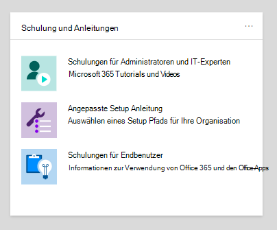

# Einrichtungsanleitung für Microsoft 365- und Office 365-Dienste

Microsoft 365- und Office 365-Setuphandbücher bieten Ihnen maßgeschneiderte Anleitungen und Ressourcen für die Planung und Bereitstellung Ihres Mandanten, Ihrer Apps und Dienste. Diese Leitfäden werden mit denselben bewährten Methoden erstellt, die [Microsoft 365](https://www.microsoft.com/fasttrack/microsoft-365) FastTrack-Onboarding-Experten in einzelnen Interaktionen gemeinsam verwenden, und sie stehen allen Administratoren im Microsoft 365 Admin Center zur Verfügung. Sie bieten Informationen zur Produkteinrichtung, zum Aktivieren von Sicherheitsfeatures, zum Bereitstellen von Tools für die Zusammenarbeit und zum Bereitstellen von Skripts zur Beschleunigung erweiterter Bereitstellungen.

## Zugreifen auf Setuphandbücher im Microsoft 365 Admin Center

Auf die Setuphandbücher kann über die Seite mit den [Setupanleitungen](https://aka.ms/setupguidance) im Microsoft 365 Admin Center zugegriffen werden. Sie können den Status Ihres Fortschritts nachverfolgen, und Sie haben die Möglichkeit, jederzeit zurückzukehren, um eine Anleitung zu vervollständigen. So gelangen Sie zur **Seite mit den Setupanleitungen:**

1. Wechseln Sie [im Microsoft 365 Admin Center](https://admin.microsoft.com/)zur **Startseite.**

2. Suchen Sie die **Karte & Schulungsanleitungen.** 

   

3. Wählen Sie **benutzerdefinierte Setupanleitungen aus.**

   

>[!NOTE]
>Mandantenadministratorberechtigungen sind für den Zugriff auf das Microsoft 365 Admin Center erforderlich.

## Wie funktionieren Setuphandbücher im Microsoft 365 Admin Center?

Jedes Handbuch enthält schrittweise Anweisungen, Ressourcen, Artikel und bei Bedarf Skripts, mit denen Sie Konfigurationsänderungen vornehmen können. Diese Anleitungen bieten Ihnen Auswahlmöglichkeiten, die die spezifischen Anforderungen kleiner und großer Organisationen widerspiegeln. Darüber hinaus enthält die Anleitung Unterstützung für neue und erfahrene Administratoren.

Mithilfe der Anleitungen können Sie während der Planungsphase, während der Bereitstellung und des Rollouts mehr über bestimmte Microsoft 365- und Office 365-Features erfahren oder sie nach Abschluss einer Bereitstellung erneut durcharbeiten, um eine Einstellung zu ändern.

## Anleitungen für die Ersteinrichtung

### Vorbereiten der Umgebung

Das [Handbuch "Vorbereiten Ihrer Umgebung"](https://aka.ms/prepareyourenvironment) hilft Ihnen bei der Vorbereitung der Umgebung Ihrer Organisation für Microsoft 365- und Office 365-Dienste. Unabhängig von Ihren Zielen müssen Sie Aufgaben ausführen, um eine erfolgreiche Bereitstellung sicherzustellen. Um Fehler bei der Vorbereitung Ihrer Umgebung zu vermeiden, erhalten Sie schrittweise Anweisungen zum Herstellen einer Verbindung mit Ihrer Domäne, zum Hinzufügen von Benutzern, zum Zuweisen von Lizenzen, zum Einrichten von E-Mails mit Exchange Online und zum Installieren oder Bereitstellen von Office-Apps. 

### E-Mail-Setupratgeber

Der [E-Mail-Setupratgeber](https://aka.ms/office365setup) bietet Ihnen eine schrittweise Anleitung zum Konfigurieren von Exchange Online für Ihre Organisation. Dazu gehören das Einrichten neuer E-Mail-Konten, das Migrieren von E-Mails und das Konfigurieren des E-Mail-Schutzes. Für eine erfolgreiche E-Mail-Einrichtung verwenden Sie diesen Ratgeber, und Sie erhalten die empfohlene Migrationsmethode basierend auf dem aktuellen E-Mail-System Ihrer Organisation, der Anzahl der zu migrierenden Postfächer und der Art und Weise, wie Sie Benutzer und deren Zugriff verwalten möchten.

### Migrieren von Kontakten und Kalenderelementen in Gmail

Wenn Sie das Postfach eines Gmail-Benutzers zu Microsoft 365 migrieren, werden E-Mail-Nachrichten migriert, Kontakte und Kalenderelemente jedoch nicht. Der [Kontakt-](https://aka.ms/gmailcontactscalendar) und Kalenderratgeber von Gmail bietet Schritte zum Importieren von Google-Kontakten und -Kalenderelementen in Microsoft 365 mithilfe von Import- und Exportmethoden mit Outlook.com, dem Outlook-Client oder PowerShell.

### Microsoft 365-Bereitstellungsratgeber

Der [Microsoft 365-Bereitstellungsratgeber](https://aka.ms/microsoft365setupguide) bietet Ihnen Hilfestellung beim Einrichten von Produktivitätstools, Sicherheitsrichtlinien und Geräteverwaltungsfunktionen. Mit einem Microsoft 365 Business Premium- oder Microsoft 365 Enterprise-Abonnement können Sie diesen Ratgeber zum Einrichten und Konfigurieren der Geräte Ihrer Organisation verwenden. 

Sie erhalten Anleitungen und Zugriff auf Ressourcen, um Ihre Clouddienste zu aktivieren, Geräte auf die neueste unterstützte Version von Windows 10 zu aktualisieren und Geräte mit Azure Active Directory (Azure AD) an einem zentralen Ort zu verbinden.

### Einrichtungshandbuch für Remotearbeit

Das [Setuphandbuch für](https://aka.ms/remoteworksetup) Remotearbeit bietet Organisationen tipps und Ressourcen, die erforderlich sind, um sicherzustellen, dass Ihre Benutzer remote erfolgreich arbeiten können, Ihre Daten sicher sind und die Anmeldeinformationen der Benutzer geschützt sind. 

Sie erhalten Eine Anleitung zur Optimierung des Gerätedatenverkehrs von Remotemitarbeitern zu Microsoft 365-Ressourcen in der Cloud und dem Netzwerk Ihrer Organisation, wodurch sich die Belastung Ihrer Remotezugriffs-VPN-Infrastruktur verringert. 

### Setuphandbuch für Windows Virtual Desktop

Windows Virtual Desktop ist ein umfassender Desktop- und App-Virtualisierungsdienst, der in der Cloud ausgeführt wird. Es ist die einzige virtuelle Desktopinfrastruktur (Virtual Desktop Infrastructure, VDI), die eine vereinfachte Verwaltung, Windows 10 mit mehreren Sitzungen, Optimierungen für Microsoft 365-Apps und Unterstützung für Remotedesktopdienste (RDS)-Umgebungen bietet. Stellen Sie Ihre Windows-Desktops und -Apps in Minuten bereit, skalieren Sie sie in Azure, und erhalten Sie integrierte Sicherheits- und Compliancefeatures. 

Das [Setuphandbuch für Windows Virtual Desktop](https://aka.ms/wvdsetupguide) stellt Administratoren Planungsressourcen und die Voraussetzungen für die Bereitstellung, Einrichtungsanleitungen und zusätzliche Ressourcen zur Verfügung. 

### Einrichtungshandbuch für Microsoft Edge

Microsoft Edge wurde von Grund auf neu erstellt, um Ihnen erstklassige Kompatibilität und Leistung, die Sicherheit und den Datenschutz, die Sie verdienen, sowie neue Features zu bieten, die Ihnen das Beste aus dem Web bieten.

Das [Setuphandbuch](https://aka.ms/edgeadvisor) für Microsoft Edge hilft Ihnen beim Konfigurieren von Enterprise Site Discovery, um zu sehen, welche Websites, auf die in Ihrer Organisation möglicherweise zugegriffen wird, den IE-Modus verwenden müssen, wichtige Sicherheitsfeatures zu überprüfen und zu konfigurieren, Datenschutzrichtlinien und zusätzliche Richtlinien zu konfigurieren, um die Anforderungen Ihrer Organisation zu erfüllen, und den Webzugriff auf Ihren Geräten zu verwalten. Sie können Microsoft Edge auf einzelne Geräte herunterladen, oder wir zeigen Ihnen, wie Sie mit Configuration Manager oder Microsoft Intune für mehrere Benutzer in Ihrer Organisation bereitstellen. 

### Einrichtungshandbuch für Microsoft Search

Microsoft Search hilft Ihrer Organisation, das zu finden, was sie benötigt, um ihre Arbeit zu vervollständigen. Unabhängig davon, ob sie nach Personen, Dateien, Organigrammen, Websites oder Antworten auf häufige Fragen sucht, kann Ihre Organisation Microsoft Search während des gesamten Arbeitstags verwenden, um Antworten zu erhalten.

Mit [dem Microsoft Search-Setuphandbuch](https://aka.ms/MicrosoftSearchSetup) können Sie Microsoft Search konfigurieren, unabhängig davon, ob Sie es für eine Gruppe von Benutzern oder für alle Benutzer in Ihrer Organisation ausführen möchten. Sie weisen Suchadministratoren und Sucheditoren zu und passen dann die Sucherfahrung für Ihre Benutzer mit Antworten und zusätzlichen Optionen an, z. B. das Hinzufügen der Erweiterung Bing zu Chrome oder das Festlegen von Bing als Standardsuchmaschine.

### Intune Configuration Manager – Einrichtungshandbuch für die Co-Management-Verwaltung

Verwenden Sie das [Intune Configuration Manager Co-Management-Setuphandbuch](https://aka.ms/comanagementsetup) für vorhandene Configuration Manager-Clientgeräte und neue internetbasierte Geräte, die Ihre Organisation gemeinsam mit Microsoft Intune und Configuration Manager verwalten möchte. In diesem Bereitstellungshandbuch für die Co-Verwaltung können Sie Windows 10-Geräte verwalten und den Geräten Ihrer Organisation neue Funktionen hinzufügen und gleichzeitig die Vorteile beider Lösungen nutzen.

## Handbücher für Authentifizierung und Zugriff

### Einrichtungshandbuch für Azure AD

Das [Azure AD-Setuphandbuch enthält](https://aka.ms/aadpguidance) Informationen, um sicherzustellen, dass Ihre Organisation über eine starke Sicherheits grundlage verfügt. In diesem Leitfaden richten Sie anfängliche Features ein, z. B. die rollenbasierte Zugriffssteuerung (Azure RBAC) für Administratoren, Azure AD Connect für Ihr lokales Verzeichnis und Azure AD Connect Health, damit Sie die Integrität Ihrer Hybrididentität während automatisierter Synchronisierungen überwachen können. 

Es enthält außerdem wichtige Informationen zum Aktivieren der Self-Service-Kennwortzurücksetzung, bedingten Zugriff und integrierter Drittanbieter-Anmeldung, einschließlich optionaler erweiterter Identitätsschutz und Automatisierung der Benutzerbereitstellung.

### Synchronisieren von Benutzern aus dem Verzeichnis Ihrer Organisation

Der [Assistent zum Synchronisieren von Benutzern aus](https://aka.ms/directorysyncsetup) dem Verzeichnis ihrer Organisation führt Sie durch das Aktivieren der Verzeichnissynchronisierung. Dadurch werden Ihre lokalen und Cloudidentitäten für einen einfacheren Zugriff und eine vereinfachte Verwaltung vereint. Entsperren Sie neue Funktionen wie einmaliges Anmelden, Self-Service-Optionen, automatische Kontobereitstellung, Steuerelemente für bedingten Zugriff und Compliancerichtlinien. Dadurch wird sichergestellt, dass Ihre Benutzer von überall aus Zugriff auf die benötigten Ressourcen haben.

### Planen der kennwortlosen Bereitstellung

Führen Sie ein Upgrade auf einen alternativen Anmeldeansatz durch, mit dem Benutzer mit einer der folgenden kennwortlosen Authentifizierungsmethoden sicher auf ihre Geräte zugreifen können: 

- Windows Hello for Business
- Der Microsoft Authenticator-App
- Sicherheitsschlüssel 

Verwenden Sie den Assistenten zum Planen [der kennwortlosen](https://aka.ms/passwordlesssetup) Bereitstellung, um die besten kennwortlosen Authentifizierungsmethoden zu ermitteln und Anleitungen zur Bereitstellung zu erhalten. 

### Planen der Self-Service-Kennwortzurücksetzung (Self-Service Password Reset, SSPR)

Geben Sie Benutzern die Möglichkeit, ihr Kennwort unabhängig zu ändern oder zurückzusetzen, wenn ihr Konto gesperrt ist oder sie ihr Kennwort vergessen, ohne sich an einen Helpdesktechniker wenden zu müssen. 

Verwenden Sie den Assistenten zum Planen der Self-Service-Kennwortzurücksetzung, um relevante Artikel und Anweisungen zum Konfigurieren der entsprechenden Optionen für das [Azure-Portal](https://aka.ms/SSPRSetupGuide) zu erhalten, die Ihnen bei der Bereitstellung von SSPR in Ihrer Umgebung helfen.

### Bereitstellungsratgeber für Active Directory Federation Services (AD FS)

Der AD FS-Bereitstellungsratgeber bietet Eine schrittweise Anleitung zur Bereitstellung einer lokalen AD FS-Infrastruktur, die Benutzer für Microsoft 365- und Office 365-Dienste authentifiziert.  Mit diesem Leitfaden kann Ihre Organisation AD FS-Komponenten und -Anforderungen überprüfen, für die Bereitstellung erforderliche SSL-Zertifikate erwerben und installieren sowie einen erforderlichen Webanwendungsproxyserver installieren. 

## Leitfäden für Sicherheit und Compliance

### Einrichtungshandbuch für Microsoft Intune 

Richten Sie Microsoft Intune zum Verwalten von Geräten in Ihrer Organisation ein. Für die vollständige Kontrolle über Unternehmensgeräte verwenden Sie die Mobile Device Management (MDM)-Funktionen von Intune. Um die Daten Ihrer Organisation auf gemeinsam genutzten und persönlichen Geräten zu verwalten, können Sie die Mobile Application Management (MAM)-Features von Intune verwenden. 

Mit dem [Microsoft Intune-Setuphandbuch](https://aka.ms/intunesetupguide)richten Sie Geräte- und App-Kompatibilitätsrichtlinien ein, weisen App-Schutzrichtlinien zu und überwachen den Geräte- und App-Schutzstatus. 

### Microsoft Defender für Endpunktratgeber

Der [Ratgeber für Microsoft Defender für Endpunkte](https://aka.ms/mdatpsetup) bietet Anweisungen, mit denen Ihr Unternehmensnetzwerk erweiterte Bedrohungen verhindern, erkennen, untersuchen und darauf reagieren kann. Nehmen Sie eine fundierte Bewertung der Sicherheitslücke Ihrer Organisation vor, und entscheiden Sie, welches Bereitstellungspaket und welche Konfigurationsmethoden am besten sind. 

>[!NOTE]
>Eine Microsoft Volume License ist für Microsoft Defender for Endpoint erforderlich.

### Einrichtungshandbuch für Exchange Online Protection

Microsoft Exchange Online Protection (EOP) ist ein cloudbasierter E-Mail-Filterdienst zum Schutz vor Spam und Schadsoftware mit Features zum Schutz Ihrer Organisation vor Verstößen gegen Messagingrichtlinien. 

Verwenden Sie das [Exchange Online Protection-Setuphandbuch](https://aka.ms/EOPguidance) zum Einrichten von EOP, indem Sie auswählen, welches der drei Bereitstellungsszenarien lokale Postfächer, Hybridpostfächer (Mischung aus lokalen und Cloudpostfächern) oder alle Cloudpostfächer für Ihre Organisation geeignet &mdash; &mdash; sind. Das Handbuch enthält Informationen und Ressourcen zum Einrichten und Überprüfen der Lizenzierung Ihres Benutzers, zum Zuweisen von Berechtigungen im Microsoft 365 Admin Center und zum Konfigurieren der Ansoftware- und Spamrichtlinien Ihrer Organisation im Security & Compliance Center. 

### Microsoft Defender für Office 365 Advisor

Der [Microsoft Defender für Office 365-Ratgeber](https://aka.ms/oatpsetup) schützt Ihre Organisation vor böswilligen Bedrohungen, auf die Ihre Umgebung durch E-Mail-Nachrichten, Links und Tools für die Zusammenarbeit von Drittanbietern stoßen kann. Dieses Handbuch enthält die Ressourcen und Informationen, die Sie beim Vorbereiten und Identifizieren des Plans für Defender für Office 365 unterstützen, der den Anforderungen Ihrer Organisation entspricht. 

### Einrichtungshandbuch für Microsoft Information Protection

Erhalten Sie eine Übersicht über die Funktionen, die Sie auf Ihre Strategie zum Schutz von Informationen anwenden können, damit Sie sicher sein können, dass Ihre vertraulichen Informationen geschützt sind. Verwenden Sie einen vierstufigen Lebenszyklusansatz zum Ermitteln, Klassifizieren, Schützen und Überwachen von vertraulichen Informationen. Das [Setuphandbuch für Microsoft Information Protection](https://aka.ms/mipsetupguide) bietet Anleitungen zum Abschließen jeder dieser Phasen.

### Einrichtungshandbuch für die Microsoft Information Governance

Das [Setuphandbuch](https://aka.ms/migsetupguide) für die Microsoft Information Governance stellt Ihnen die Informationen zur Verfügung, die Sie zum Einrichten und Verwalten der Steuerungsstrategie Ihrer Organisation benötigen, um sicherzustellen, dass Ihre Daten gemäß den von Ihnen festgelegten spezifischen Lebenszyklusrichtlinien klassifiziert und verwaltet werden. In diesem Leitfaden erfahren Sie, wie Sie Bezeichnungen, Bezeichnungsrichtlinien und Aufbewahrungsrichtlinien erstellen, automatisch anwenden oder veröffentlichen, die auf die wiederverwendbaren Inhalts- und Compliancedatensätze Ihrer Organisation angewendet werden. Außerdem erhalten Sie Informationen zum Importieren von CSV-Dateien mit einem Dateiplan für Massenszenarien oder zum manuellen Anwenden auf einzelne Dokumente. 

## Leitfäden für die Zusammenarbeit

### Bereitstellungsratgeber für Microsoft 365-Apps

Mit dem Bereitstellungsratgeber für [Microsoft 365-Apps](https://aka.ms/OPPquickstartguide) können Sie die Geräte Ihrer Benutzer mit der neuesten Version von Office-Produkten wie Word, Excel, PowerPoint und OneNote ausführen. Sie erhalten Anleitungen zu den verschiedenen Bereitstellungsmethoden, die einfache Optionen für die Selbstinstallation in Unternehmensbereitstellungen mit Verwaltungstools enthalten. Die Anweisungen helfen Ihnen bei der Bewertung Ihrer Umgebung, ermitteln Ihre spezifischen Bereitstellungsanforderungen und implementieren die erforderlichen Supporttools, um eine erfolgreiche Installation sicherzustellen. 

### Einrichtungshandbuch für mobile Apps

Das [Setuphandbuch für mobile Apps](https://aka.ms/officeappguidance) enthält Anweisungen zum Herunterladen und Installieren von Office-Apps auf Ihren mobilen Windows-, iOS- und Android-Geräten. In diesem Leitfaden finden Sie schrittweise Informationen zum Herunterladen und Installieren von Microsoft 365- und Office 365-Apps auf Ihrem Smartphone und Tablet.

### Einrichtungshandbuch für Microsoft Teams

Das [Setuphandbuch](https://aka.ms/teamsguidance) für Microsoft Teams bietet Ihrer Organisation Anleitungen zum Einrichten von Teamarbeitsbereichs, die Echtzeitunterhaltungen durch Messaging, Anrufe sowie Audio- und Videobesprechungen für die Team- und private Kommunikation hosten. Sie erhalten die Anweisungen zum Ermitteln der Netzwerkanforderungen Ihrer Organisation mithilfe des Netzwerkplanertools und des Teams-Ratgebers im Teams Admin Center. Für die Zeit nach der Einrichtung enthält der Leitfaden hilfreiche Ressourcen für die ersten Schritte mit Teams.

### Einrichtungshandbuch für SharePoint

Mit [dem Setuphandbuch](https://aka.ms/spoguidance) für SharePoint können Sie Ihre SharePoint-Dokumentspeicherung und -Inhaltsverwaltung einrichten, Websites erstellen, die externe Freigabe konfigurieren, Daten migrieren und erweiterte Einstellungen konfigurieren sowie die Benutzerbindung und -kommunikation innerhalb Ihrer Organisation fördern. Befolgen Sie die Schritte zum Konfigurieren Ihrer Richtlinien für Die Inhaltsfreigabeberechtigungen, wählen Sie Ihre Migrationssynchronisierungstools aus, und aktivieren Sie die Sicherheitseinstellungen für Ihre SharePoint-Umgebung. 

### #A0

Verwenden Sie [das OneDrive-Setuphandbuch,](https://aka.ms/ODfBquickstartguide) um mit den Funktionen für Die Speicherung, Freigabe, Zusammenarbeit und Synchronisierung von OneDrive zu beginnen. OneDrive bietet einen zentralen Ort, an dem Benutzer ihre Microsoft 365-Apps-Dateien synchronisieren, die externe Freigabe konfigurieren, Benutzerdaten migrieren und erweiterte Sicherheits- und Gerätezugriffseinstellungen konfigurieren können. Das #A0 kann mit einem #A1 oder einem eigenständigen #A2 bereitgestellt werden. 

### Yammer Bereitstellungsratgeber

Verbinden Und interagieren Sie in Ihrer Organisation mit Yammer. Der [Yammer-Bereitstellungsratgeber](https://aka.ms/yammerdeploymentguide) bereitet Ihr Yammer durch Hinzufügen von Domänen, Definieren von Administratoren und Kombinieren Yammer vor. Sie erhalten Anleitungen zum Bereitstellen Yammer anschließenden Anpassen des Erscheinungsbilds, Konfigurieren von Sicherheit und Compliance und Verfeinern der Einstellungen.

## Erweiterte Assistenten

### In-Place-Upgrade mit Configuration Manager

Verwenden Sie [das Handbuch "In-Place upgrade with Configuration Manager"](https://aka.ms/win10upgradedemo) beim Upgrade von Windows 7- und Windows 8.1-Geräten auf die neueste Version von Windows 10. Verwenden Sie das bereitgestellte Skript, um die Voraussetzungen zu überprüfen und automatisch ein in-Place-Upgrade zu konfigurieren.

### Bereitstellen von Office für Ihre Benutzer

Bereitstellen von Office-Apps aus der Cloud mit der Möglichkeit, Ihre Installation mithilfe des Office-Bereitstellungstools anzupassen. Das [Handbuch "Bereitstellen von Office ](https://aka.ms/proplusodt) für Ihre Benutzer" hilft Ihnen beim Erstellen einer angepassten Office-Konfiguration mit erweiterten Einstellungen, oder Sie können eine vordefinierte empfohlene Konfiguration verwenden. Unabhängig davon, ob Ihre Benutzer eine Selbstinstallation durchführen oder sie einzeln oder als Massenvorgang für Ihre Benutzer bereitstellen, bietet ihnen dieser erweiterte Assistent schrittanleitungen, um Benutzern eine auf Ihre Organisation zugeschnittene Office-Installation zu ermöglichen.

### Bereitstellen von Office für Remotebenutzer

Da remote arbeiten nun die Norm ist, müssen Benutzer die Office-Einstellungen Ihrer Organisation erhalten, wenn sie nicht mit Ihrem internen Netzwerk verbunden sind oder ihre eigenen Geräte verwenden. 

Verwenden Sie die Anleitung zum Bereitstellen von [Office](https://aka.ms/officeremoteinstall) für Remotebenutzer, um eine angepasste Office-Installation zu erstellen und benutzern dann ein generiertes PowerShell-Skript zu senden, das Office nahtlos mit Ihrer Konfiguration installiert.

### Bereitstellen und Aktualisieren von Microsoft 365-Apps mit Configuration Manager

Für Organisationen, die Configuration Manager verwenden, können Sie den Ratgeber "Bereitstellen und Aktualisieren von [Microsoft 365-Apps mit Configuration Manager"](https://aka.ms/oppinstall) verwenden, um ein Skript zu generieren, mit dem Ihre Microsoft 365-Apps-Bereitstellung automatisch mithilfe bewährter Methoden konfiguriert wird, die von den FastTrack-Technikern empfohlen werden. Verwenden Sie dieses Handbuch, um Bereitstellungsgruppen zu erstellen, Ihre Office-Apps und -Features anzupassen, dynamische oder schlanke Installationen zu konfigurieren und dann das Skript zum Erstellen der Anwendungen, automatischen Bereitstellungsregeln und Gerätesammlungen auszuführen, die Sie für Ihre Bereitstellung benötigen. 
