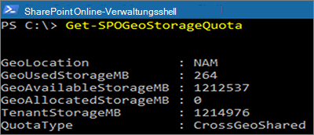

# <a name="sharepoint-storage-quotas-in-multi-geo-environments"></a>SharePoint Speicherkontingente in Multi-Geo-Umgebungen

Alle geografischen Standorte einer Multi-Geo-Umgebung teilen sich das Speicherkontingent des Mandanten.

Mit der SharePoint Geo-Speicherkontingent-Einstellung können Sie das Speicherkontingent jedes geographischen Standorts verwalten. Wenn Sie ein Speicherkontingent einem geographischen Standort zuweisen, wird es zur maximal verfügbaren Menge an Speicherplatz für diesen geographischen Standort und wird vom verfügbaren Mandanten-Speicherkontingent abgezogen. Die verbleibende verfügbare Mandanten-Speicherkontingent wird dann untern den konfigurierten geographischen Standorten aufgeteilt, für die kein bestimmtes Speicherkontingent zuweisen wurde.

Das SharePoint-Speicherkontingent eines geographischen Standorts kann vom SharePoint-Onlineadministrator durch eine Verbindung zum zentralen Standort zugewiesen werden. Geo-Administratoren von Satellitenstandorten können Speicherkontingente sehen, aber nicht zuweisen.

## <a name="configure-a-storage-quota-for-a-geo-location"></a>Ein Speicherkontingent für einen Geo-Standort konfigurieren

Verwenden Sie das [Microsoft SharePoint Online-Modul](https://www.microsoft.com/download/details.aspx?id=35588) und stellen Sie eine Verbindung zum zentralen Standort her, um das Speicherkontingent für einen geographischen Standort zuzuweisen.

Führen Sie cmdlet aus, um ein Speicherkontingent für einen Standort zuzuweisen:

```powershell
Set-SPOGeoStorageQuota -GeoLocation <geolocationcode> -StorageQuotaMB <value>
```

Führen Sie Folgendes aus, um das Speicherkontingent des aktuellen geografischen Standorts anzuzeigen:

```powershell
Get-SPOGeoStorageQuota
```



Führen Sie Folgendes aus, um das Speicherkontingent aller geografischen Standorte anzuzeigen:

```powershell
Get-SPOGeoStorageQuota -AllLocations
```

Legen Sie `StorageQuota value = 0` fest, um das zugewiesene Speicherkontingent eines geographischen Standorts zu entfernen:

```powershell
Set-SPOGeoStorageQuota -GeoLocation <geolocationcode> -StorageQuotaMB 0
```
