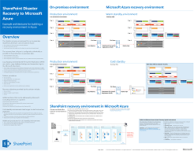

# <a name="sharepoint-server-2013-disaster-recovery-in-microsoft-azure"></a>SharePoint Server 2013 – otfallwiederherstellung in Microsoft Azure

 Mithilfe von Azure können Sie eine Umgebung für die Notfallwiederherstellung für Ihre lokale SharePoint-Farm erstellen. Dieser Artikel beschreibt das Entwerfen und Implementieren dieser Lösung.

 **Schauen Sie sich das Video zur Übersicht über die Notfallwiederherstellung in SharePoint Server 2013 an**.
> [!VIDEO https://www.microsoft.com/videoplayer/embed/1b73ec8f-29bd-44eb-aa3a-f7932784bfd9?autoplay=false]
  
 Bei einem Notfall in Ihrer lokalen SharePoint-Umgebung hat die Wiederinbetriebnahme des Systems höchste Priorität. Eine Notfallwiederherstellung mit SharePoint erfolgt schneller und einfacher, wenn Sie bereits über eine in Microsoft Azure ausgeführte Sicherungsumgebung verfügen. In diesem Video werden wichtigsten Konzepte von einer betriebsbereiten SharePoint-Failoverumgebung erläutert. Außerdem werden die umfassenden Details in diesem Artikel weiter ergänzt.
  
Verwenden Sie diesen Artikel mit dem folgenden Lösungsmodell: **SharePoint-Notfallwiederherstellung in Microsoft Azure**.
  
[](https://go.microsoft.com/fwlink/p/?LinkId=392555)
  
 [PDF](https://go.microsoft.com/fwlink/p/?LinkId=392555) |  [Visio](https://go.microsoft.com/fwlink/p/?LinkId=392554)
  
## <a name="use-azure-infrastructure-services-for-disaster-recovery"></a>Verwenden von Azure Infrastructure Services für Notfallwiederherstellung

Viele Organisationen verfügen über keine Umgebung für die Notfallwiederherstellung für SharePoint, deren lokale Einrichtung und Verwaltung kostspielig sein kann. Azure-Infrastrukturdienste bietet überzeugende Optionen für Notfallwiederherstellungsumgebungen, die flexibler und wirtschaftlicher als die lokalen Alternativen sind.
  
Die Verwendung von Azure-Infrastrukturdienste bietet folgende Vorteile:
  
- **Weniger kostspielige Ressourcen** Im Vergleich zu einer lokalen Umgebung für die Notfallwiederherstellung müssen Sie weniger Ressourcen vorhalten und bezahlen. Die Anzahl der Ressourcen hängt von der gewählten Umgebung für die Notfallwiederherstellung ab: verzögert betriebsbereit, betriebsbereit und unmittelbar betriebsbereit.
    
- **Flexiblere Ressourcen** Bei einem Notfall können Sie Ihre SharePoint-Wiederherstellungsfarm problemlos horizontal hoch skalieren, um die Lastanforderungen zu erfüllen. Skalieren Sie sie horizontal herunter, wenn Sie die Ressourcen nicht mehr benötigen.
    
- **Niedrigere Rechenzentrumsanforderungen** Verwenden Sie Azure-Infrastrukturdienste, statt in ein sekundäres Rechenzentrum in einer anderen Region zu investieren.
    
Es gibt weniger komplexe Möglichkeiten für Organisationen, die gerade erst in die Notfallwiederherstellung einsteigen, und erweiterte Optionen für Organisationen mit hohen Anforderungen an Ausfallsicherheit. Die Definitionen für verzögert betriebsbereite, betriebsbereite oder unmittelbar betriebsbereite Standby-Umgebungen sind ein wenig anders, wenn die Umgebung auf einer Cloudplattform gehostet wird. Die folgende Tabelle beschreibt diese Umgebungen für die Erstellung einer SharePoint-Wiederherstellungsfarm in Azure.
  
**Tabelle: Wiederherstellungsumgebungen**

|**Typ der Wiederherstellungsumgebung**|**Beschreibung**|
|:-----|:-----|
|Unmittelbar betriebsbereit  <br/> |Eine vollständig dimensionierte Farm ist bereitgestellt, die aktualisiert und im Standby-Modus ausgeführt wird.  <br/> |
|Bedingt betriebsbereit  <br/> |Die Farm ist bereitgestellt, und virtuelle Computer werden ausgeführt und aktualisiert.  <br/> Zur Wiederherstellung gehören das Anfügen von Inhaltsdatenbanken, Bereitstellen von Dienstanwendungen und Durchforsten von Inhalten.  <br/> Die Farm kann eine kleinere Version der Produktionsfarm sein und anschließend für den gesamten Benutzerstamm horizontal hochskaliert werden.  <br/> |
|Verzögert betriebsbereit  <br/> |Die Farm ist vollständig erstellt, aber die virtuellen Computer sind nicht in Betrieb.  <br/> Zur Verwaltung der Umgebung zählen das Starten der virtuellen Computer in regelmäßigen Abständen, das Einspielen von Patches und Updates sowie das Überprüfen der Umgebung.  <br/> Starten Sie die vollständige Umgebung bei einem Notfall.  <br/> |
   
Es ist wichtig, die Recovery Time Objectives (RTO) und Recovery Point Objectives (RPO) Ihrer Organisation zu bewerten. Diese Anforderungen bestimmen, welche Umgebung für Ihre Organisation am besten geeignet ist.
  
In den Anleitungen in diesem Artikel wird beschrieben, wie eine betriebsbereite Standby-Umgebung implementiert wird. Sie können sie auch an eine verzögert betriebsbereite Standby-Umgebung anpassen, obwohl Sie zusätzliche Verfahren zur Unterstützung dieser Art von Umgebung befolgen müssen. In diesem Artikel wird nicht die Implementierung einer unmittelbar betriebsbereiten Standby-Umgebung beschrieben.
  
Weitere Informationen zur Notfallwiederherstellung finden Sie unter [High availability and disaster recovery concepts in SharePoint 2013](/SharePoint/administration/high-availability-and-disaster-recovery-concepts) und [Choose a disaster recovery strategy for SharePoint 2013](/SharePoint/administration/plan-for-disaster-recovery).
  
## <a name="solution-description"></a>Beschreibung der Lösung

Die betriebsbereite Standby-Lösung für die Notfallwiederherstellung erfordert die folgende Umgebung:
  
- Eine lokale SharePoint-Produktionsfarm
    
- Eine SharePoint-Farm in Azure für die Wiederherstellung
    
- Eine Standort-zu-Standort-VPN-Verbindung zwischen den beiden Umgebungen
    
Die folgende Abbildung zeigt diese drei Elemente.
  
**Abbildung: Elemente einer betriebsbereiten Standby-Lösung in Windows Azure**


  
Der SQL Server-Protokollversand mit DFS-Replikation (Distributed File System Replication) dient zum Kopieren von Datenbanksicherungen und Transaktionsprotokollen in die Wiederherstellungsfarm in Azure: 
  
- DFSR überträgt Protokolle aus der Produktionsumgebung in die Wiederherstellungsumgebung. In einem WAN-Szenario ist DFSR effizienter als das Versenden der Protokolle direkt an den sekundären Server in Azure.
    
- Protokolle werden in SQL Server in der Wiederherstellungsumgebung in Azure wiedergegeben.
    
- Sie fügen SharePoint-Inhaltsdatenbanken erst per Protokollversand an die Wiederherstellungsumgebung an, wenn ein Wiederherstellungsvorgang durchgeführt wird.
    
Führen Sie die folgenden Schritte aus, um die Farm wiederherzustellen:
  
1. Beenden Sie den Protokollversand.
    
2. Lassen Sie keinen Datenverkehr zur primären Farm mehr zu.
    
3. Geben Sie die letzten Transaktionsprotokolle wieder.
    
4. Fügen Sie die Inhaltsdatenbanken an die Farm an.
    
5. Stellen Sie Dienstanwendungen aus der replizierten Services-Datenbanken wieder her.
    
6. Aktualisieren Sie DNS-Einträge (Domain Name System) so, dass sie auf die Wiederherstellungsfarm zeigen.
    
7. Starten Sie eine vollständige Durchforstung.
    
Wir empfehlen, diese Schritte regelmäßig zu testen und zu dokumentieren, um sicherzustellen, dass Ihre Wiederherstellung bei laufendem System problemlos ausgeführt werden kann. Das Anfügen von Inhaltsdatenbanken und Wiederherstellen von Dienstanwendungen kann einige Zeit in Anspruch nehmen und umfasst in der Regel einige manuelle Konfigurationsschritte.
  
Nachdem eine Wiederherstellung erfolgt ist, bietet Ihnen diese Lösung die in der folgenden Tabelle aufgeführten Elemente.
  
**Tabelle: Wiederherstellungsziele der Lösung**

|**Aspekt**|**Beschreibung**|
|:-----|:-----|
|Websites und Inhalte  <br/> |Websites und Inhalte sind in der Wiederherstellungsumgebung verfügbar.  <br/> |
|Eine neue Instanz der Suche  <br/> |Bei dieser betriebsbereiten Standby-Lösung wird die Suche aus Suchdatenbanken wiederhergestellt. Die Konfiguration von Suchkomponenten in der Wiederherstellungsfarm orientiert sich so weit wie möglich an der Produktionsfarm. Nachdem Websites und Inhalte wiederhergestellt wurden, wird eine vollständige Durchforstung gestartet, um den Suchindex neu zu erstellen. Sie müssen nicht warten, bis die Durchforstung abgeschlossen ist, um die Websites und Inhalte zur Verfügung zu stellen.  <br/> |
|Dienste  <br/> | Dienste, die Daten in Datenbanken speichern, werden von Datenbanken mit Protokollversand wiederhergestellt. Dienste, die keine Daten in Datenbanken speichern, werden einfach gestartet. <br/>  Nicht alle Dienste mit Datenbanken müssen wiederhergestellt werden. Die folgenden Dienste müssen nicht aus Datenbanken wiederhergestellt werden und können nach einem Failover einfach gestartet werden: <br/>  Sammlung von Verwendungs- und Integritätsdaten <br/>  Statusdienst <br/>  Word-Automatisierung <br/>  Alle anderen Dienste, die keine Datenbank verwenden <br/> |
   
Sie können mit Microsoft Consulting Services (MCS) oder einem Partner zusammenarbeiten, um komplexere Wiederherstellungsziele zu erfüllen, die in der folgenden Tabelle zusammengefasst sind.
  
**Tabelle: Andere Elemente, die von MCS oder einem Partner betreut werden können**

|**Aspekt**|**Beschreibung**|
|:-----|:-----|
|Synchronisieren benutzerdefinierter Farmlösungen  <br/> |Im Idealfall ist die Konfiguration der Wiederherstellungsfarm identisch mit der Produktionsfarm. Sie können mit einem Berater oder Partner zusammenarbeiten, um zu prüfen, ob benutzerdefinierte Farmlösungen repliziert werden und ob ein Prozess vorhanden ist, mit dessen Hilfe beide Umgebungen synchron bleiben.  <br/> |
|Verbindungen mit lokalen Datenquellen  <br/> |Es ist möglicherweise unpraktisch, Verbindungen mit Back-End-Datensystemen zu replizieren, z. B. mit Sicherungsdomänencontrollern und Inhaltsquellen für die Suche.  <br/> |
|Wiederherstellungsszenarien für die Suchfunktion  <br/> |Da Bereitstellungen der Unternehmenssuche in der Regel relativ individuell und komplex sind, erfordert das Wiederherstellen von Suchen aus Datenbanken mehr Aufwand. Sie können mit einem Berater oder Partner zusammenarbeiten, um Wiederherstellungsszenarien für die Suchfunktion zu bestimmen und zu implementieren, die Ihre Organisation ggf. benötigt.  <br/> |
   
Bei den Anleitungen in diesem Artikel wird davon ausgegangen, dass die lokale Farm bereits entworfen wurde und bereitgestellt ist.
  
## <a name="detailed-architecture"></a>Detaillierte Architektur

Im Idealfall ist die Konfiguration der Wiederherstellungsfarm in Azure identisch mit der lokalen Produktionsfarm, einschließlich der folgenden Einstellungen:
  
- Dieselbe Zuordnung von Serverrollen
    
- Dieselbe Konfiguration von Anpassungen
    
- Dieselbe Konfiguration der Suchkomponenten
    
Die Umgebung in Azure kann eine kleinere Version der Produktionsfarm sein. Wenn Sie nach einem Failover die Wiederherstellungsfarm horizontal hochskalieren möchten, ist es wichtig, dass jede Art von Serverrolle anfangs zugeordnet ist.
  
Einige Konfigurationen eignen sich möglicherweise nicht für die Replikation in die Failoverumgebung. Stellen Sie sich, dass die Failoververfahren und -umgebung getestet werden, um dafür zu sorgen, dass die Failoverfarm die erwarteten Servicelevel bietet.
  
Diese Lösung schreibt keine bestimmte Topologie für eine SharePoint-Farm vor. Schwerpunkt dieser Lösung ist die Verwendung von Azure für die Failoverfarm und Implementierung von Protokollversand und DFSR zwischen den beiden Umgebungen.
  
### <a name="warm-standby-environments"></a>Betriebsbereite Standby-Umgebungen

In einer betriebsbereiten Standby-Umgebung werden alle virtuellen Computer in der Azure-Umgebung ausgeführt. Die Umgebung ist bereit für eine Failoverübung oder ein tatsächliches Failover.
  
Die folgende Abbildung zeigt eine Notfallwiederherstellungslösung aus einer lokalen SharePoint-Farm in eine Azure-basierten SharePoint-Farm, die als betriebsbereite Standby-Umgebung konfiguriert ist.
  
**Abbildung: Topologie und zentrale Elemente einer Produktionsfarm und einer betriebsbereiten Standby-Wiederherstellungsfarm**


  
Inhalt dieses Diagramms:
  
- Es sind zwei Umgebungen nebeneinander dargestellt: die lokale SharePoint-Farm und die betriebsbereite Standby-Farm in Azure.
    
- Jede Umgebung umfasst eine Dateifreigabe.
    
- Jede Farm hat vier Ebenen. Um Hochverfügbarkeit zu erreichen, enthält jede Ebene zwei Server oder virtuelle Computer, die für eine bestimmte Rolle, z. B. Front-End-Dienste, verteilter Cache, Back-End-Dienste und Datenbanken, identisch konfiguriert sind. Es ist nicht wichtig, in dieser Abbildung bestimmte Komponenten hervorzuheben. Die beiden Farmen sind identisch konfiguriert.
    
- Die vierte Ebene ist die Datenbankebene. Der Protokollversand dient zum Kopieren von Protokollen vom sekundären Datenbankserver, der sich in der lokale Umgebung befindet, in die Dateifreigabe in derselben Umgebung.
    
- DFSR kopiert Dateien aus der Dateifreigabe in der lokalen Umgebung in die Dateifreigabe in der Azure-Umgebung.
    
- Beim Protokollversand werden die Protokolle aus der Dateifreigabe der Azure-Umgebung im primären Replikat in der AlwaysOn-Verfügbarkeitsgruppe in SQL Server in der Wiederherstellungsumgebung wiedergegeben.
    
### <a name="cold-standby-environments"></a>Verzögert betriebsbereite Standby-Umgebungen

In einer verzögert betriebsbereiten Standby-Umgebung können die meisten virtuellen Computer der SharePoint-Farm heruntergefahren werden. (Es wird empfohlen, die virtuellen Computer gelegentlich, z. B. alle zwei Wochen oder einmal im Monat, zu starten, damit sich jeder virtuelle Computer mit der Domäne synchronisieren kann.) Die folgenden virtuellen Computer in der Azure-Wiederherstellungsumgebung müssen stets ausgeführt werden, um sicherzustellen, dass der Protokollversand und DFSR unterbrechungsfrei in Betrieb bleiben:
  
- Die Dateifreigabe
    
- Der primäre Datenbankserver
    
- Mindestens ein virtueller Computer mit Windows Server Active Directory-Domänendienste und DNS
    
Die folgende Abbildung zeigt eine Azure-Failoverumgebung, in der die virtuellen Computer der Dateifreigabe und die virtuellen Computer der primären SharePoint-Datenbank ausgeführt werden. Alle anderen virtuellen Computer mit SharePoint wurden heruntergefahren. Der virtuelle Computer, auf dem Windows Server Active Directory und DNS ausgeführt werden, wird nicht gezeigt.
  
**Abbildung: Verzögert betriebsbereite Standby-Wiederherstellungsfarm mit ausgeführten virtuellen Computern**


  
Nach einem Failover zu einer verzögert betriebsbereiten Standby-Umgebung werden alle virtuellen Computer gestartet, und das Verfahren zum Erreichen von Hochverfügbarkeit der Datenbankserver muss konfiguriert werden, wie z. B. SQL Server AlwaysOn-Verfügbarkeitsgruppen.
  
Wenn mehrere Speichergruppen implementiert sind (Datenbanken sind auf mehrere SQL Server-Hochverfügbarkeitsätze verteilt), muss die primäre Datenbank für jede Speichergruppe für die Annahme der Protokolle der jeweiligen Speichergruppe ausgeführt werden.
  
### <a name="skills-and-experience"></a>Kompetenz und Erfahrung

Mehrere Technologien werden bei dieser Notfallwiederherstellungslösung verwendet. Um sicherzustellen, dass diese Technologien wie erwartet interagieren, muss jede Komponente in der lokalen und Azure-Umgebung installiert und ordnungsgemäß konfiguriert werden. Wir empfehlen, dass Personen oder Teams, die diese Lösung einrichten, über fundierte Kenntnisse und praktische Fertigkeiten mit Technologien verfügen, die in den folgenden Artikeln beschrieben werden:
  
- [Übersicht über DFS-Namespaces und DFS-Replikation](/previous-versions/windows/it-pro/windows-server-2012-R2-and-2012/jj127250(v=ws.11))
    
- [Windows Server-Failoverclustering (WSFC) mit SQL Server](/sql/sql-server/failover-clusters/windows/windows-server-failover-clustering-wsfc-with-sql-server)
    
- [AlwaysOn-Verfügbarkeitsgruppen (SQL Server)](/sql/database-engine/availability-groups/windows/always-on-availability-groups-sql-server)
    
- [Sichern und Wiederherstellen von SQL Server-Datenbanken](/sql/relational-databases/backup-restore/back-up-and-restore-of-sql-server-databases)
    
- [Übersicht über die SharePoint 2013-Installation und -Konfiguration](/SharePoint/install/installation-and-configuration-overview)
    
- [Microsoft Azure](/azure/)
    
Schließlich werden Skripterstellungsfähigkeiten zum Automatisieren von Aufgaben im Zusammenhang mit diesen Technologien empfohlen. Es ist möglich, die verfügbaren Benutzeroberflächen zum Ausführen aller Aufgaben zu verwenden, die in dieser Lösung beschrieben werden. Allerdings kann ein manuelles Verfahren zeitaufwändig und fehleranfällig sein und inkonsistente Ergebnisse liefern.
  
Zusätzlich zu Windows PowerShell gibt es auch Windows PowerShell-Bibliotheken für SQL Server, SharePoint Server und Azure. Vergessen Sie nicht T-SQL, eine Sprache, die die Dauer der Konfiguration und Verwaltung Ihrer Umgebung für Notfallwiederherstellung verkürzen kann.
  
## <a name="disaster-recovery-roadmap"></a>Fahrplan für die Notfallwiederherstellung


  
Dieser Fahrplan setzt vorausgesetzt, dass Sie bereits eine SharePoint Server 2013-Farm in der Produktion bereitgestellt haben.
  
**Tabelle: Fahrplan für die Notfallwiederherstellung**

|**Phase**|**Beschreibung**|
|:-----|:-----|
|Phase 1  <br/> |Entwerfen der Umgebung für die Notfallwiederherstellung  <br/> |
|Phase 2  <br/> |Erstellen des virtuellen Azure-Netzwerks und der VPN-Verbindung  <br/> |
|Phase 3  <br/> |Bereitstellen von Active Directory und Domain Name Services im virtuellen Azure-Netzwerk  <br/> |
|Phase 4  <br/> |Bereitstellen der SharePoint-Wiederherstellungsfarm in Azure  <br/> |
|Phase 5  <br/> |Einrichten der DFS-Replikation zwischen den Farmen  <br/> |
|Phase 6  <br/> |Einrichten des Protokollversands zur Wiederherstellungsfarm  <br/> |
|Phase 7  <br/> | Überprüfen der Lösungen für Failover und Wiederherstellung. Dies umfasst die folgenden Verfahren und Technologien: <br/>  Beenden des Protokollversands <br/>  Wiederherstellen der Sicherungen <br/>  Durchforsten von Inhalten <br/>  Wiederherstellen von Diensten <br/>  Verwalten von DNS-Einträgen <br/> |
   
## <a name="phase-1-design-the-disaster-recovery-environment"></a>Phase 1: Entwerfen der Umgebung für die Notfallwiederherstellung

Befolgen Sie die Anleitungen unter [Microsoft Azure-Architekturen für SharePoint 2013](microsoft-azure-architectures-for-sharepoint-2013.md) für den Entwurf der Umgebung für die Notfallwiederherstellung, einschließlich der SharePoint-Wiederherstellungsfarm. Sie können die Grafiken in der SharePoint [Disaster Recovery Solution in Azure](https://go.microsoft.com/fwlink/p/?LinkId=392554) Visio verwenden, um den Entwurfsprozess zu starten. Es wird empfohlen, dass Sie die gesamte Umgebung vor Beginn der Arbeit in der Azure-Umgebung entwerfen.
  
Zusätzlich zur Anleitung unter [Microsoft Azure-Architekturen für SharePoint 2013](microsoft-azure-architectures-for-sharepoint-2013.md) für das Entwerfen des virtuellen Netzwerks, der VPN-Verbindung, von Active Directory und der SharePoint-Farm müssen Sie der Azure-Umgebung eine Dateifreigaberolle hinzufügen.
  
Zur Unterstützung des Protokollversands in eine Lösung für die Notfallwiederherstellung wird ein virtueller Computer mit einer Dateifreigabe dem Subnetz hinzugefügt, in dem sich die Datenbankrollen befinden. Die Dateifreigabe dient auch als dritter Knoten einer Knotenmehrheit für die SQL Server AlwaysOn-Verfügbarkeitsgruppe. Dies ist die empfohlene Konfiguration für eine SharePoint-Standardfarm, die SQL Server AlwaysOn-Verfügbarkeitsgruppen verwendet. 
  
> [!NOTE]
> Es ist wichtig, die Voraussetzungen für eine Datenbank zur Teilnahme an einer SQL Server AlwaysOn-Verfügbarkeitsgruppe zu überprüfen. Weitere Informationen finden Sie unter [Voraussetzungen, Einschränkungen und Empfehlungen für AlwaysOn-Verfügbarkeitsgruppen](/sql/database-engine/availability-groups/windows/prereqs-restrictions-recommendations-always-on-availability). 
  
**Abbildung: Platzierung eines Dateiservers, der für eine Notfallwiederherstellungslösung verwendet wird**


  
In diesem Diagramm wird ein virtueller Computer mit einer Dateifreigabe demselben Subnetz in Azure hinzugefügt, das die Datenbankserverrollen enthält. Fügen Sie den virtuellen Computer mit der Dateifreigabe keinem Verfügbarkeitssatz mit anderen Serverrollen hinzu, z. B. den SQL Server-Rollen.
  
Wenn Sie um die Hochverfügbarkeit der Protokolle besorgt sind, erwägen Sie eine andere Herangehensweise mit [SQL Server-Sicherung und -Wiederherstellung mit dem Azure-BLOB-Speicherdienst](/sql/relational-databases/backup-restore/sql-server-backup-and-restore-with-microsoft-azure-blob-storage-service). Dies ist ein neues Feature in Azure, das Protokolle direkt in der BLOB-Speicher-URL speichert. Diese Lösung bietet keine Anleitungen zur Verwendung dieses Features.
  
Wenn Sie die Wiederherstellungsfarm entwerfen, bedenken Sie, dass eine erfolgreiche Notfallwiederherstellungsumgebung präzise die Produktionsfarm wiedergibt, die Sie wiederherstellen möchten. Die Größe der Wiederherstellungsfarm ist der wichtigste Aspekt bei Entwurf, Bereitstellung und Tests der Wiederherstellungsfarm. Die Skalierung der Farm ist von Organisation zu Organisation je nach Geschäftsanforderungen unterschiedlich. Möglicherweise kann eine abgespeckte Farm bei einem kurzen Ausfall zum Einsatz kommen, die Sie erst dann hochskalieren, wenn es Leistungs- und Kapazitätsanforderungen erforderlich machen.
  
Richten Sie die Konfiguration der Wiederherstellungsfarm so weit wie möglich an der Produktionsfarm aus, damit sie Ihre Vereinbarung zum Servicelevel (SLA) erfüllt und die Funktionen bietet, die Sie benötigen, um Ihr Unternehmen zu unterstützen. Beim Entwerfen der Umgebung für die Notfallwiederherstellung sollten Sie auch den Änderungsmanagementprozess für Ihre Produktionsumgebung berücksichtigen. Es wird empfohlen, diesen Prozess auf die Wiederherstellungsumgebung auszudehnen, indem Sie die Wiederherstellungsumgebung im gleichen Intervall wie die Produktionsumgebung aktualisieren. Es wird weiter empfohlen, im Rahmen des Änderungsmanagementprozesses eine detaillierte Bestandsliste Ihrer Farmkonfiguration, Anwendungen und Benutzer zu führen. 
  
## <a name="phase-2-create-the-azure-virtual-network-and-vpn-connection"></a>Phase 2: Erstellen des virtuellen Azure-Netzwerks und der VPN-Verbindung

Unter [Verbinden eines lokalen Netzwerks mit einem virtuellen Microsoft Azure-Netzwerk](connect-an-on-premises-network-to-a-microsoft-azure-virtual-network.md) wird das Planen und Bereitstellen des virtuellen Azure-Netzwerks und der VPN-Verbindung erläutert. Befolgen Sie die Anweisungen im Thema zum Ausführen der folgenden Verfahren:
  
- Planen des privaten IP-Adressbereichs des Virtual Networks
    
- Planen der Änderungen der Routinginfrastruktur für das Virtual Network
    
- Planen von Firewallregeln für ein- und ausgehenden Datenverkehr des lokalen VPN-Geräts
    
- Erstellen des standortübergreifenden virtuellen Netzwerks in Azure
    
- Konfigurieren des Routings zwischen Ihrem lokalen Netzwerk und Virtual Networks
    
## <a name="phase-3-deploy-active-directory-and-domain-name-services-to-the-azure-virtual-network"></a>Phase 3: Bereitstellen von Active Directory und Domain Name Services für das virtuelle Azure-Netzwerk

Diese Phase umfasst die Bereitstellung von Windows Server Active Directory und DNS für das Virtual Network in einem Hybridszenario (wie unter [Microsoft Azure-Architekturen für SharePoint 2013](microsoft-azure-architectures-for-sharepoint-2013.md) und in der folgenden Abbildung beschrieben).
  
**Abbildung 4: Hybride Active Directory-Domänenkonfiguration**


  
In der Abbildung werden zwei virtuelle Computer im selben Subnetz bereitgestellt. Diese virtuellen Computer hosten je zwei Rollen: Active Directory und DNS.
  
Lesen Sie vor der Bereitstellung von Active Directory in Azure die [Richtlinien für die Bereitstellung von Windows Server Active Directory auf virtuellen Computern in Azure](/windows-server/identity/ad-ds/introduction-to-active-directory-domain-services-ad-ds-virtualization-level-100). Diese Anleitungen helfen Ihnen zu bestimmen, ob eine andere Architektur oder andere Konfigurationseinstellungen für Ihre Lösung erforderlich sind.
  
Ausführliche Anleitungen zum Einrichten eines Domänencontrollers in Azure finden Sie unter [Installieren eines Active Directory-Replikatdomänencontrollers in Azure Virtual Networks](/windows-server/identity/ad-ds/introduction-to-active-directory-domain-services-ad-ds-virtualization-level-100).
  
Vor dieser Phase haben Sie keine virtuellen Computer im Virtual Network bereitgestellt. Die virtuellen Computer zum Hosten von Active Directory und DNS sind wahrscheinlich nicht die größten virtuellen Computer, die Sie für die Lösung brauchen. Bevor Sie diese virtuellen Computer bereitstellen, erstellen Sie zuerst den größten virtuellen Computer, die Sie in Ihrem Virtual Network verwenden möchten. Dadurch wird sichergestellt, dass Ihre Lösung auf eine Kategorie in Azure festgelegt wird, die die höchste Größe zulässt, die Sie benötigen. Sie müssen diesen virtuellen Computer jetzt nicht konfigurieren. Erstellen Sie ihn einfach, und halten Sie ihn bei Bedarf bereit. Wenn Sie dies nicht tun, können Sie auf eine Einschränkung stoßen, wenn Sie später versuchen, größere virtuelle Computer zu erstellen, was ein bekanntes Problem war, als dieser Artikel verfasst wurde. 
  
## <a name="phase-4-deploy-the-sharepoint-recovery-farm-in-azure"></a>Phase 4: Bereitstellen der SharePoint-Wiederherstellungsfarm in Azure

Stellen Sie die SharePoint-Farm in Virtual Network gemäß Ihren Entwurfsplänen bereit. Es kann nützlich sein, den Artikel [Planen von SharePoint 2013 für Azure-Infrastrukturdienste](/previous-versions/azure/dn275958(v=azure.100)) vor der Bereitstellung von SharePoint-Rollen in Windows Azure zu lesen.
  
Befolgen Sie die folgenden Methoden, die wir beim Erstellen unserer Umgebung für eine Machbarkeitsstudie entwickelt haben:
  
- Erstellen virtueller Computer mithilfe des Azure-Portals oder mithilfe von PowerShell.
    
- Azure und Hyper-V unterstützen keinen dynamischen Arbeitsspeicher. Achten Sie darauf, dass dies in Ihren Leistungs- und Kapazitätsplänen berücksichtigt wird.
    
- Starten Sie virtuelle Computer auf der Azure-Benutzeroberfläche und nicht im Anmeldefenster des virtuellen Computers selbst neu. Die Azure-Benutzeroberfläche funktioniert besser und ist berechenbarer.
    
- Wenn Sie einen virtuellen Computer herunterfahren möchten, um Kosten zu sparen, verwenden Sie die Azure-Benutzeroberfläche. Wenn Sie den virtuellen Computer im Anmeldefenster herunterfahren, fallen weiter Gebühren an.
    
- Verwenden Sie eine Benennungskonvention für die virtuellen Computer.
    
- Achten Sie darauf, in welchem Rechenzentrum die virtuellen Computern bereitgestellt werden.
    
- Das Feature der automatische Skalierung in Azure wird für SharePoint-Rollen nicht unterstützt.
    
- Konfigurieren Sie keine Elemente in der Farm, die wiederhergestellt werden, z. B. Websitesammlungen. 
    
## <a name="phase-5-set-up-dfsr-between-the-farms"></a>Phase 5: Einrichten der DFS-Replikation zwischen den Farmen

Um die Replikation mithilfe von DFSR einzurichten, verwenden Sie das Snap-in DNS-Verwaltung. Melden Sie sich jedoch vor der DFSR-Einrichtung an Ihren lokalen Dateiserver und Azure-Dateiserver an, und aktivieren Sie den Dienst in Windows.
  
Führen Sie im Dashboard Server-Manager die folgenden Schritte aus:
  
- Konfigurieren Sie den lokalen Server.
    
- Starten Sie den **** Assistenten zum Hinzufügen von Rollen und Features.
    
- Öffnen Sie den Knoten **Datei- und Speicherdienste**.
    
- Wählen Sie **DFS-Namespaces** und **DFS-Replikation** aus.
    
- Klicken Sie auf **Weiter**, um den Assistenten abzuschließen.
    
Die folgende Tabelle enthält Links zu DFSR-Referenzartikeln und -Blogbeiträgen.
  
**Tabelle: Referenzartikel für DFSR**

|**Titel**|**Beschreibung**|
|:-----|:-----|
|[Replikation](/previous-versions/windows/it-pro/windows-server-2008-R2-and-2008/cc770278(v=ws.11)) <br/> |TechNet-Thema zur DFS-Verwaltung mit Links für die Replikation  <br/> |
|[DFS-Replikation: Überlebensleitfaden](https://go.microsoft.com/fwlink/p/?LinkId=392737) <br/> |Wiki mit Links zu DFS-Informationen  <br/> |
|[DFS-Replikation: Häufig gestellte Fragen](/previous-versions/windows/it-pro/windows-server-2003/cc773238(v=ws.10)) <br/> |TechNet-Thema zur DFS-Replikation  <br/> |
|[Jose Barretos Blog](/archive/blogs/josebda/) <br/> |Blog eines leitenden Programmmanagers aus dem File Server-Team von Microsoft  <br/> |
|[Das Storage-Team bei Microsoft - File Cabinet Blog](https://go.microsoft.com/fwlink/p/?LinkId=392740) <br/> |Blog zu Dateidiensten und Speicherfeatures in Windows Server  <br/> |
   
## <a name="phase-6-set-up-log-shipping-to-the-recovery-farm"></a>Phase 6: Einrichten des Protokollversands zur Wiederherstellungsfarm

Der Protokollversand ist eine wichtige Komponente für die Einrichtung der Notfallwiederherstellung in dieser Umgebung. Sie können mithilfe des Protokollversands Transaktionsprotokolldateien für Datenbanken aus einer primären Datenbankserverinstanz automatisch an eine sekundäre Datenbankserverinstanz senden. Informationen zum Einrichten des Protokollversands finden Sie unter [Configure log shipping in SharePoint 2013](/sharepoint/administration/configure-log-shipping). 
  
> [!IMPORTANT]
> Die Unterstützung des Protokollversands in SharePoint Server ist auf bestimmte Datenbanken beschränkt. Weitere Informationen finden Sie unter [Unterstützte Hochverfügbarkeits- und Notfallwiederherstellungsoptionen für SharePoint-Datenbanken (SharePoint 2013)](/SharePoint/administration/supported-high-availability-and-disaster-recovery-options-for-sharepoint-databas). 
  
## <a name="phase-7-validate-failover-and-recovery"></a>Phase 7: Überprüfen von Failover und Wiederherstellung

Das Ziel dieser letzten Phase ist das Überprüfen, ob die Notfallwiederherstellungslösung wie geplant funktioniert. Zu diesem Zweck erstellen Sie ein Failoverereignis, durch das die Produktionsfarm beendet und die Wiederherstellungsfarm als Ersatz gestartet wird. Sie können ein Failoverszenario manuell oder mithilfe von Skripts starten.
  
Als erster Schritt werden eingehende Anforderungen für Farmdienste oder Inhalte beendet. Dies ist durch das Deaktivieren der DNS-Einträge oder Herunterfahren der Front-End-Webserver möglich. Nachdem die Farm "ausgefallen" ist, können Sie ein Failover in die Wiederherstellungsfarm ausführen.
  
### <a name="stop-log-shipping"></a>Beenden des Protokollversands

Sie müssen vor der Farmwiederherstellung den Protokollversand beenden. Beenden Sie den Protokollversand zuerst auf dem sekundären Server in Azure und danach lokal auf dem primären Server. Verwenden Sie das folgende Skript, um den Protokollversand zuerst auf dem sekundären Server und dann auf dem primären Server zu beenden. Die Datenbanknamen im Skript können abhängig von Ihrer Umgebung anders lauten.
  
```
-- This script removes log shipping from the server.
-- Commands must be executed on the secondary server first and then on the primary server.

SET NOCOUNT ON
DECLARE  @PriDB nvarchar(max)
,@SecDB nvarchar(250)
,@PriSrv nvarchar(250)
,@SecSrv nvarchar(250)

Set @PriDB= ''
SET @PriDB = UPPER(@PriDB)
SET @PriDB = REPLACE(@PriDB, ' ', '')
SET @PriDB = '''' + REPLACE(@PriDB, ',', ''', ''') + ''''

Set @SecDB = @PriDB

Exec ( 'Select  ''exec master..sp_delete_log_shipping_secondary_database '' + '''''''' + prm.primary_database +  ''''''''   
from msdb.dbo.log_shipping_monitor_primary prm INNER JOIN msdb.dbo.log_shipping_primary_secondaries sec  ON  prm.primary_database=sec.secondary_database
where prm.primary_database in ( ' + @PriDB + ' )')

Exec ( 'Select  ''exec master..sp_delete_log_shipping_primary_secondary '' + '''''''' + prm.Primary_Database + '''''', '''''' + sec.Secondary_Server + '''''', '''''' + sec.Secondary_database + ''''''''   
from msdb.dbo.log_shipping_monitor_primary prm INNER JOIN msdb.dbo.log_shipping_primary_secondaries sec  ON  prm.primary_database=sec.secondary_database
where prm.primary_database in ( ' + @PriDB + ' )')

Exec ( 'Select  ''exec master..sp_delete_log_shipping_primary_database '' + '''''''' + prm.primary_database +  ''''''''   
from msdb.dbo.log_shipping_monitor_primary prm INNER JOIN msdb.dbo.log_shipping_primary_secondaries sec  ON  prm.primary_database=sec.secondary_database
where prm.primary_database in ( ' + @PriDB + ' )')

Exec ( 'Select  ''exec master..sp_delete_log_shipping_secondary_primary '' + '''''''' + prm.primary_server + '''''', '''''' + prm.primary_database +  ''''''''   
from msdb.dbo.log_shipping_monitor_primary prm INNER JOIN msdb.dbo.log_shipping_primary_secondaries sec  ON  prm.primary_database=sec.secondary_database
where prm.primary_database in ( ' + @PriDB + ' )')

```

### <a name="restore-the-backups"></a>Wiederherstellen der Sicherungen

Sicherungen müssen in der Reihenfolge wiederhergestellt werden, in der sie erstellt wurden. Bevor Sie eine Sicherung eines bestimmten Transaktionsprotokolls wiederherstellen können, müssen Sie zunächst die folgenden vorherigen Sicherungen wiederherstellen, ohne ein Rollback für Transaktionen auszuführen, für die ein Commit erfolgt ist (d. h. mithilfe von  `WITH NORECOVERY`):
  
- Die vollständige Datenbanksicherung und die letzte differenzielle Sicherung - Stellen Sie diese Sicherungen wieder her, sofern vorhanden, die vor der Sicherung eines bestimmten Transaktionsprotokolls erstellt wurden. Bevor die letzte vollständige oder differenzielle Sicherung erstellt wurde, verwendete die Datenbank das vollständige Wiederherstellungsmodell oder das massenprotokollierte Wiederherstellungsmodell.
    
- Alle Transaktionsprotokollsicherungen - Stellen Sie Transaktionsprotokollsicherungen wieder her, die nach der vollständigen Datenbanksicherung oder der differenziellen Sicherung (falls Sie eine wiederherstellen) und vor der bestimmten Transaktionsprotokollsicherung erstellt wurden. Protokollsicherungen müssen in der Reihenfolge eingespielt werden, in der sie erstellt wurden, und zwar ohne Lücken in der Protokollkette.
    
Entfernen Sie zum Wiederherstellen der Inhaltsdatenbank auf dem sekundären Server vor der Wiederherstellung alle Datenbankverbindungen. Um die Datenbank wiederherzustellen, führen Sie die folgende SQL-Anweisung aus.
  
```
restore database WSS_Content with recovery

```

> [!IMPORTANT]
> Wenn Sie explizit T-SQL verwenden, geben Sie entweder **WITH NORECOVERY** oder **WITH RECOVERY** in jede RESTORE-Anweisung ein, um Mehrdeutigkeit zu vermeiden. Dies ist besonders wichtig, wenn Sie Skripts schreiben. Nachdem die vollständigen und differenziellen Sicherungen wiederhergestellt wurden, können die Transaktionsprotokolle in SQL Server Management Studio wiederhergestellt werden. Da zudem der Protokollversand bereits angehalten wurde, ist die Inhaltsdatenbank im Standby-Status, sodass Sie den Status in Vollzugriff ändern müssen.
  
Klicken Sie in SQL Server Management Studio mit der rechten Maustaste auf die Datenbank **WSS_Content**, zeigen Sie auf **Aufgaben** > **Wiederherstellen**, und klicken Sie dann auf **Transaktionsprotokoll** (wenn Sie nicht die vollständige Sicherung wiederhergestellt haben, ist diese Option nicht verfügbar). Weitere Informationen finden Sie unter [Wiederherstellen einer Transaktionsprotokollsicherung (SQL Server)](/sql/relational-databases/backup-restore/restore-a-transaction-log-backup-sql-server).
  
### <a name="crawl-the-content-source"></a>Durchforsten der Inhaltsquelle

Sie müssen eine vollständige Durchforstung für jede Inhaltsquelle starten, um den Suchdienst wiederherzustellen. Beachten Sie, dass einige Analyseinformationen aus der lokalen Farm, z. B. Suchempfehlungen, verloren gehen. Bevor Sie die vollständigen Durchforstungen starten, geben Sie mithilfe des Windows PowerShell-Cmdlets **Restore-SPEnterpriseSearchServiceApplication** und mit Protokollversand ausgeführte und replizierte Suchverwaltungsdatenbank **Search_Service__DB_ <GUID>** an. Dieses Cmdlet gibt Suchkonfiguration, Schema, verwaltete Eigenschaften, Regeln und Quellen an und erstellt eine Reihe anderer Standardkomponenten.
  
Um eine vollständige Durchforstung zu starten, führen Sie die folgenden Schritte aus:
  
1. Wechseln Sie in der SharePoint 2013-Zentraladministration zu **Anwendungsverwaltung** > **Dienstanwendungen** > **Dienstanwendungen verwalten**, und klicken Sie dann auf die Suchdienstanwendung, die durchforstet werden soll.
    
2. Klicken Sie auf der Seite **Suchverwaltung** auf **Inhaltsquellen**, zeigen Sie auf die gewünschte Inhaltsquelle, klicken Sie auf den Pfeil und dann auf **Vollständige Durchforstung starten**.
    
### <a name="recover-farm-services"></a>Wiederherstellen von Farmdiensten

Die folgende Tabelle zeigt die Vorgehensweise beim Wiederherstellen von Diensten von Datenbanken mit Protokollversand, die Dienste, die zwar Datenbanken haben, deren Wiederherstellung mit Protokollversand jedoch nicht empfohlen wird, und die Dienste ohne Datenbanken.
  
> [!IMPORTANT]
> Beim Wiederherstellen einer lokalen SharePoint-Datenbank in der Azure-Umgebung werden keine SharePoint-Dienste wiederhergestellt, die Sie nicht bereits manuell in Azure installiert haben. 
  
**Tabelle: Referenz der Dienstanwendungsdatenbanken**

|**Stellen Sie diese Dienste aus Datenbanken mit Protokollversand wieder her**|**Diese Dienste haben Datenbanken, aber es wird empfohlen, diese Dienste zu starten, ohne ihre Datenbanken wiederherzustellen**|**Diese Dienste speichern keine Daten in Datenbanken. Starten Sie diese Dienste nach dem Failover**|
|:-----|:-----|:-----|
| Maschineller Übersetzungsdienst <br/>  Verwalteter Metadatendienst <br/>  Secure Store Service <br/>  Benutzerprofil. (Nur die Datenbanken Profil und Communitytags werden unterstützt. Die Datenbank Synchronisierung wird nicht unterstützt.) <br/>  Microsoft SharePoint Foundation-Abonnementeinstellungendienst <br/> | Sammlung von Verwendungs- und Integritätsdaten <br/>  Statusdienst <br/>  Word-Automatisierung <br/> | Excel Services <br/>  PerformancePoint-Dienste <br/>  PowerPoint-Konvertierung <br/>  Visio-Grafikdienst <br/>  Arbeitsverwaltung <br/> |
   
Das folgende Beispiel zeigt, wie der verwaltete Metadatendienst aus einer Datenbank wiederhergestellt wird.
  
Verwendet wird die vorhandene DatenbankManaged_Metadata_DB.Diese Datenbank arbeitet mit Protokollversand, doch in der sekundären Farm gibt es keine aktive Dienstanwendung, weshalb eine Verbindung damit hergestellt werden muss, nachdem die Dienstanwendung eingerichtet wurde.
  
Verwenden Sie zuerst  `New-SPMetadataServiceApplication`, und geben Sie dann den Parameter  `DatabaseName` mit dem Namen der wiederhergestellten Datenbank an.
  
Konfigurieren Sie als Nächstes die neue verwaltete Metadatendienstanwendung auf dem sekundären Server wie folgt:
  
- Name: Verwalteter Metadatendienst
    
- Datenbankserver: Der Datenbanknamen aus dem versendeten Transaktionsprotokoll
    
- Datenbankname:Managed_Metadata_DB
    
- Anwendungspool: SharePoint-Dienstanwendungen 
    
### <a name="manage-dns-records"></a>Verwalten von DNS-Einträgen

Sie müssen DNS-Einträge manuell so erstellen, dass sie auf Ihre SharePoint-Farm zeigen.
  
In den meisten Fällen, wenn Sie über mehrere Front-End-Webserver verfügen, ist es sinnvoll, das Feature des Netzwerklastenausgleichs in Windows Server 2012 oder ein Hardware-Lastenausgleichsmodul zum Verteilen von Anforderungen zwischen den Web-Front-End-Servern in Ihrer Farm zu nutzen. Mit dem Netzwerklastenausgleich können Sie auch das Risiko verringern, indem Sie Anforderungen an die anderen Server verteilen, sollte einer Ihrer Web-Front-End-Server ausfallen. 
  
Beim Einrichten von Netzwerklastenausgleich wird dem Cluster in der Regel eine einzelne IP-Adresse zugewiesen. Anschließend erstellen Sie einen DNS-Hosteintrag im DNS-Anbieter für Ihr Netzwerk, der auf den Cluster zeigt. (Für dieses Projekt implementieren wir einen DNS-Server in Azure zum Zweck der Ausfallsicherheit für den Fall eines Ausfalls des lokalen Rechenzentrums.) Sie können z. B. einen DNS-Eintrag im DNS-Manager in Active Directory mit dem Namen  `https://sharepoint.contoso.com` erstellen, der auf die IP-Adresse Ihres Clusters mit Lastenausgleich zeigt.
  
Für den externen Zugriff auf Ihre SharePoint-Farm können Sie einen Hostdatensatz auf einem externen DNS-Server mit derselben URL erstellen, die Clients in Ihrem Intranet verwenden (z. B. ), die auf eine externe IP-Adresse in Ihrer Firewall `https://sharepoint.contoso.com` verweist. (Eine bewährte Methode in diesem Beispiel ist das Einrichten von geteilten DNS, sodass der interne DNS-Server autorisierend für Anforderungen ist und Anforderungen direkt an den SharePoint-Farmcluster weiterleite, anstatt DNS-Anforderungen an ihren externen `contoso.com` DNS-Server weiter zu weiterleiten.) Anschließend können Sie die externe IP-Adresse der internen IP-Adresse Ihres lokalen Clusters zuordnungen, sodass Clients die gesuchten Ressourcen finden.
  
Von hier aus können Sie auf verschiedene Szenarien für die Notfallwiederherstellung stoßen:
  
 **Beispielszenario: die lokale SharePoint-Farm ist aufgrund eines Hardwareausfalls in der lokalen SharePoint-Farm nicht verfügbar.** In diesem Fall können Sie nach Durchführung der Schritte für ein Failover auf die SharePoint-Farm in Azure den Netzwerklastenausgleich für die Web-Front-End-Server der SharePoint-Wiederherstellungsfarm so konfigurieren, wie dies in der lokalen Farm erfolgt ist. Sie können dann den Hosteintrag in Ihrem internen DNS-Anbieter so umleiten, dass auf die Cluster-IP-Adresse der Wiederherstellungsfarm gezeigt wird. Es kann einige Zeit dauern, bis auf Clients zwischengespeicherte DNS-Einträge aktualisiert werden und auf die Wiederherstellungsfarm zeigen.
  
 **Beispielszenario: Das lokale Rechenzentrum ist vollständig unbrauchbar.** Diesem Szenario kann aufgrund einer Naturkatastrophe wie Brand oder Überschwemmung auftreten. Für diesen Fall verfügt Ihr Unternehmen wahrscheinlich über ein sekundäres Rechenzentrum, das in einer anderen Region gehostet wird, und auch über ein Azure-Subnetz mit eigenen Verzeichnisdiensten und DNS. Wie im vorherigen Szenario der Notfallwiederherstellung können Ihre internen und externen DNS-Einträge so umgeleitet werden, dass sie auf die SharePoint-Farm in Azure zeigen. Beachten Sie auch hier, dass die Weitergabe von DNS-Einträgen einige Zeit dauern kann.
  
Wenn Sie Websitesammlungen mit Hostnamen verwenden, wie unter Architektur und Bereitstellung von Websitesammlungen mit Hostnamen [(SharePoint 2013)](/SharePoint/administration/host-named-site-collection-architecture-and-deployment)empfohlen, verfügen Sie möglicherweise über mehrere Websitesammlungen, die von derselben Webanwendung in Ihrer SharePoint-Farm gehostet werden, mit eindeutigen DNS-Namen (z. B. `https://sales.contoso.com` und `https://marketing.contoso.com` ). In diesem Fall können Sie DNS-Einträge für jede Websitesammlung erstellen, die auf die IP-Adresse Ihres Clusters zeigen. Sobald eine Anforderung Ihre SharePoint-Web-Front-End-Server erreicht, übernehmen sie das Weiterleiten jeder Anforderung zur gewünschten Websitesammlung.
  
## <a name="microsoft-proof-of-concept-environment"></a>Microsoft-Umgebung für Machbarkeitsstudie

Wir haben für diese Lösung eine Umgebung zum Machbarkeitsnachweis entwickelt und getestet. Das Ziel unserer Testumgebung war das Bereitstellen und Wiederherstellen einer SharePoint-Farm, wie sie in einer Kundenumgebung vorkommen kann. Wir haben einige Annahmen getroffen, wussten aber, dass die Farm alle standardmäßigen Funktionen ohne jegliche Anpassungen bereitstellen sollte. Die Topologie wurde auf Hochverfügbarkeit ausgelegt, indem auf bewährten Methoden aus dem Außendienst und der Produktgruppe basierende Anleitungen befolgt wurden.
  
Die folgende Tabelle beschreibt die virtuellen Hyper-V-Computer, die wir für die lokale Testumgebung erstellt und konfiguriert haben.
  
**Tabelle: Virtuelle Computer für lokalen Test**

|**Servername**|**Rolle**|**Konfiguration**|
|:-----|:-----|:-----|
|DC1  <br/> |Domänencontroller mit Active Directory  <br/> |Zwei Prozessoren  <br/> Von 512 MB bis 4 GB RAM  <br/> 1 x 127-GB-Festplatte  <br/> |
|RRAS  <br/> |Mit der Rolle "Routing- und RAS-Dienst (RRAS)" konfigurierter Server  <br/> |Zwei Prozessoren  <br/> 2-8 GB RAM  <br/> 1 x 127-GB-Festplatte  <br/> |
|FS1  <br/> |Dateiserver mit Freigaben für Sicherungen und einem Endpunkt für DFSR  <br/> |Vier Prozessoren  <br/> 2-12 GB RAM  <br/> 1 x 127-GB-Festplatte  <br/> 1 x 1-TB-Festplatte (SAN)  <br/> 1 x 750-GB-Festplatte  <br/> |
|SP-WFE1, SP-WFE2  <br/> |Front-End-Webserver  <br/> |Vier Prozessoren  <br/> 16 GB RAM  <br/> |
|SP-APP1, SP-APP2, SP-APP3  <br/> |Anwendungsserver  <br/> |Vier Prozessoren  <br/> 2-16 GB RAM  <br/> |
|SP-SQL-HA1, SP-SQL-HA2  <br/> |Mit SQL Server 2012 AlwaysOn-Verfügbarkeitsgruppen konfigurierte Datenbankserver für hohe Verfügbarkeit. Diese Konfiguration arbeitet mit SP-SQL-HA1 und SP-SQL-HA2 als primärem und sekundärem Replikat.  <br/> |Vier Prozessoren  <br/> 2-16 GB RAM  <br/> |
   
Die folgende Tabelle beschreibt die Laufwerkskonfigurationen der virtuellen Hyper-V-Computer, die wir für die Front-End-Webserver und Anwendungsserver für die lokale Testumgebung erstellt und konfiguriert haben.
  
**Tabelle: Laufwerksanforderungen an die virtuellen Computer für die Front-End-Web- und Anwendungsserver in der lokalen Testumgebung**

|**Laufwerksbuchstabe**|**Größe**|**Name des Verzeichnisses**|**Pfad**|
|:-----|:-----|:-----|:-----|
|C  <br/> |80  <br/> |Systemlaufwerk  <br/> |<DriveLetter>:\\Program Files\\Microsoft SQL Server\\  <br/> |
|E  <br/> |80  <br/> |Protokolllaufwerk (40 GB)  <br/> |<DriveLetter>:\\Program Files\\Microsoft SQL Server\\MSSQL10_50.MSSQLSERVER\\MSSQL\\DATA  <br/> |
|F  <br/> |80  <br/> |Seite (36 GB)  <br/> |<DriveLetter>:\\Program Files\\Microsoft SQL Server\\MSSQL\\DATA  <br/> |
   
Die folgende Tabelle beschreibt die Laufwerkskonfigurationen für die virtuellen Hyper-V-Computer, die wir als lokale Datenbankserver erstellt und konfiguriert haben. Greifen Sie auf der Seite **Datenbankmodulkonfiguration** auf die Registerkarte **Datenverzeichnisse** zu, um die Einstellungen in der folgenden Tabelle festzulegen und zu bestätigen.
  
**Tabelle: Laufwerksanforderungen an die virtuellen Computer für die Datenbankserver in der lokalen Testumgebung**

|**Laufwerksbuchstabe**|**Größe**|**Name des Verzeichnisses**|**Pfad**|
|:-----|:-----|:-----|:-----|
|C  <br/> |80  <br/> |Datenstammverzeichnis  <br/> |<DriveLetter>:\\Program Files\\Microsoft SQL Server\\  <br/> |
|E  <br/> |500  <br/> |Benutzerdatenbankverzeichnis  <br/> |<DriveLetter>:\\Program Files\\Microsoft SQL Server\\MSSQL10_50.MSSQLSERVER\\MSSQL\\DATA  <br/> |
|F  <br/> |500  <br/> |Protokollverzeichnis der Benutzerdatenbank  <br/> |<DriveLetter>:\\Program Files\\Microsoft SQL Server\\MSSQL10_50.MSSQLSERVER\\MSSQL\\DATA  <br/> |
|G  <br/> |500  <br/> |Temporäres Datenbankverzeichnis  <br/> |<DriveLetter>:\\Program Files\\Microsoft SQL Server\\MSSQL10_50.MSSQLSERVER\\MSSQL\\DATA  <br/> |
|H  <br/> |500  <br/> |Temporäres Datenbankprotokollverzeichnis  <br/> |<DriveLetter>:\\Program Files\\Microsoft SQL Server\\MSSQL10_50.MSSQLSERVER\\MSSQL\\DATA  <br/> |
   
### <a name="setting-up-the-test-environment"></a>Einrichten der Testumgebung

Während der verschiedenen Phasen hat das Testteam in der Regel zunächst in der lokalen Architektur und anschließend in der entsprechenden Azure-Umgebung gearbeitet. Dies entspricht der allgemeinen Praxis, wenn interne Produktionsfarmen bereits ausgeführt werden. Noch wichtiger ist, dass Sie die aktuelle Produktionslast, Kapazität und normale Leistung kennen. Zum Erstellen eines Notfallwiederherstellungsmodells, das geschäftlichen Anforderungen erfüllen kann, sollten Sie zudem die Größe der Wiederherstellungsfarmserver bestimmen, um ein Mindestmaß an Service leisten zu können. In einer verzögert betriebsbereit bzw. betriebsbereiten Standby-Umgebung ist eine Wiederherstellungsfarm normalerweise kleiner als eine Produktionsfarm. Nachdem die Wiederherstellungsfarm stabil die Produktion aufgenommen hat, kann die Farm entsprechend den zu erfüllenden Arbeitslastvorgaben hochskaliert werden.
  
Wir haben unsere Testumgebung in den folgenden drei Phasen bereitgestellt:
  
- Einrichten der Infrastruktur der Hybridumgebung
    
- Bereitstellen der Server
    
- Bereitstellen der SharePoint-Farmen
    
#### <a name="set-up-the-hybrid-infrastructure"></a>Einrichten der Infrastruktur der Hybridumgebung

In dieser Phase erfolgte das Einrichten einer Domänenumgebung für die lokale Farm und Wiederherstellungsfarm in Azure. Zusätzlich zu den normalen Aufgaben im Zusammenhang mit der Konfiguration von Active Directory implementierte das Testteam eine Routinglösung und eine VPN-Verbindung zwischen den beiden Umgebungen.
  
#### <a name="provision-the-servers"></a>Bereitstellen der Server

Zusätzlich zu den Farmservern mussten Server für die Domänencontroller bereitgestellt sowie ein Server für RRAS und die Standort-zu-Standort-VPN-Verbindung konfiguriert werden. Für den DFSR-Dienst wurden zwei Dateiserver und für Tester mehrere Clientcomputer bereitgestellt.
  
#### <a name="deploy-the-sharepoint-farms"></a>Bereitstellen der SharePoint-Farmen

Die SharePoint-Farmen wurden in zwei Phasen bereitgestellt, um bei Bedarf die Stabilisierung der Umgebung und die Problembehandlung zu vereinfachen. In der ersten Phase wurde jede Farm zur Unterstützung der erforderlichen Funktionen auf der Mindestanzahl von Servern für die einzelnen Ebenen der Topologie bereitgestellt.
  
Die Datenbankserver mit SQL Server wurden installiert, bevor die Server mit SharePoint 2013 erstellt wurden. Da es sich um eine neue Bereitstellung handelt, haben wir die Verfügbarkeitsgruppen vor der Bereitstellung von SharePoint erstellt. Wir haben basierend auf bewährten MCS-Methoden drei Gruppen erstellt. 
  
> [!NOTE]
> Erstellen Sie Platzhalterdatenbanken, damit Sie Verfügbarkeitsgruppen vor der Installation von SharePoint erstellen können. Weitere Informationen finden Sie unter [Konfigurieren von SQL Server 2012 AlwaysOn-Verfügbarkeitsgruppen für SharePoint 2013](/SharePoint/administration/configure-an-alwayson-availability-group)
  
Wir haben die Farm erstellt und weitere Server in der folgenden Reihenfolge hinzugefügt:
  
- SP-SQL-HA1 und SP-SQL-HA2 bereitgestellt.
    
- AlwaysOn konfiguriert und die drei Verfügbarkeitsgruppen für die Farm erstellt. 
    
- SP-APP1 zum Hosten der Zentraladministration bereitgestellt.
    
- SP-WFE1 und SP-WFE2 zum Hosten des verteilten Caches bereitgestellt. 
    
Wir haben den Parameter  _skipRegisterAsDistributedCachehost_ bei der Ausführung von **psconfig.exe** an der Befehlszeile angegeben. Weitere Informationen finden Sie unter [Planen von Feeds und des Diensts für den verteilten Cache in SharePoint Server 2013](/sharepoint/administration/plan-for-feeds-and-the-distributed-cache-service). 
  
Wir haben die folgenden Schritte in der Wiederherstellungsumgebung wiederholt:
  
- AZ-SQL-HA1 und AZ-SQL-HA2 bereitgestellt.
    
- AlwaysOn konfiguriert und die drei Verfügbarkeitsgruppen für die Farm erstellt.
    
- AZ-APP1 zum Hosten der Zentraladministration bereitgestellt.
    
- AZ-WFE1 und AZ-WFE2 zum Hosten des verteilten Caches bereitgestellt.
    
Nachdem wir den verteilten Cache konfiguriert sowie Testbenutzer und Testinhalte hinzugefügt hatten, begannen wir mit Stufe 2 der Bereitstellung. Diese erforderte die horizontale Hochskalierung der Ebenen und die Konfiguration der Farmserver zur Unterstützung der in der Farmarchitektur beschriebenen Hochverfügbarkeitstopologie.
  
Die folgende Tabelle beschreibt die virtuellen Computer, Subnetze und Verfügbarkeitsätze, die wir für unsere Wiederherstellungsfarm eingerichtet haben.
  
**Tabelle: Infrastruktur der Wiederherstellungsfarm**

|**Servername**|**Rolle**|**Konfiguration**|**Subnetz**|**Verfügbarkeitssatz**|
|:-----|:-----|:-----|:-----|:-----|
|spDRAD  <br/> |Domänencontroller mit Active Directory  <br/> |Zwei Prozessoren  <br/> Von 512 MB bis 4 GB RAM  <br/> 1 x 127-GB-Festplatte  <br/> |sp-ADservers  <br/> ||
|AZ-SP-FS  <br/> |Dateiserver mit Freigaben für Sicherungen und einem Endpunkt für DFSR  <br/> | A5-Konfiguration: <br/>  Zwei Prozessoren <br/>  14 GB RAM <br/>  1 x 127-GB-Festplatte <br/>  1 x 135-GB-Festplatte <br/>  1 x 127-GB-Festplatte <br/>  1 x 150-GB-Festplatte <br/> |sp-databaseservers  <br/> |DATA_SET  <br/> |
|AZ-WFE1, AZ -WFE2  <br/> |Front-End-Webserver  <br/> | A5-Konfiguration: <br/>  Zwei Prozessoren <br/>  14 GB RAM <br/>  1 x 127-GB-Festplatte <br/> |sp-webservers  <br/> |WFE_SET  <br/> |
|AZ -APP1, AZ -APP2, AZ -APP3  <br/> |Anwendungsserver  <br/> | A5-Konfiguration: <br/>  Zwei Prozessoren <br/>  14 GB RAM <br/>  1 x 127-GB-Festplatte <br/> |sp-applicationservers  <br/> |APP_SET  <br/> |
|AZ -SQL-HA1, AZ -SQL-HA2  <br/> |Datenbankserver und die primären und sekundären Replikate für AlwaysOn-Verfügbarkeitsgruppen  <br/> | A5-Konfiguration: <br/>  Zwei Prozessoren <br/>  14 GB RAM <br/> |sp-databaseservers  <br/> |DATA_SET  <br/> |
   
### <a name="operations"></a>Betriebliche Vorgänge

Nachdem das Testteam die Farmumgebungen stabilisiert und Funktionstests abgeschlossen hatte, begann es mit den folgenden betrieblichen Vorgängen zum Konfigurieren der lokalen Wiederherstellungsumgebung:
  
- Konfigurieren vollständiger und differenzieller Sicherungen
    
- Konfigurieren von DFSR auf den Dateiservern, die Transaktionsprotokolle zwischen der lokalen Umgebung und der Azure-Umgebung übertragen
    
- Konfigurieren des Protokollversands auf dem primären Datenbankserver
    
- Stabilisieren, Überprüfen und Problembehandlung des Protokollversands den Anforderungen entsprechend. Dies umfasste das Bestimmen und Dokumentieren aller Verhalten, die möglicherweise Probleme verursachen, z. B. Netzwerklatenz, die zu Protokollversand- oder DFSR-Dateisynchronisierungsfehlern führen können.
    
### <a name="databases"></a>Datenbanken

Für unsere Failovertests haben wir die folgenden Datenbanken verwendet: 
  
- WSS_Content
    
- ManagedMetadata
    
- Profile DB
    
- Sync DB
    
- Social DB
    
- Content Type Hub (eine Datenbank für einen dedizierten Inhaltstyp-Veröffentlichungshub)
    
## <a name="troubleshooting-tips"></a>Tipps zur Problembehandlung

In diesem Abschnitt werden die Probleme, die während der Tests aufgetreten sind, und die dazugehörigen Lösungen erläutert. 
  
### <a name="using-the-term-store-management-tool-caused-the-error-the-managed-metadata-store-or-connection-is-currently-not-available"></a>Bei Verwenden des Terminologiespeicher-Verwaltungstools ist der folgende Fehler aufgetreten: "Verwalteter Metadatenspeicher oder Verbindung derzeit nicht verfügbar."

Stellen Sie sicher, dass das von der Webanwendung verwendete Anwendungspoolkonto über die Berechtigung "Lesezugriff auf den Terminologiespeicher" verfügt.
  
### <a name="custom-term-sets-are-not-available-in-the-site-collection"></a>Benutzerdefinierte Ausdruckssätze stehen in der Websitesammlung nicht zur Verfügung

Suchen Sie nach einer fehlenden Dienstanwendungszuordnung zwischen Ihrer Inhaltswebsitesammlung und Ihrem Inhaltstyphub. Vergewissern Sie sich außerdem, dass auf dem Bildschirm **Verwaltete Metadaten- <site collection name> Verbindung** diese Option aktiviert ist: **Diese Dienstanwendung ist der Standardspeicherort für spaltenspezifische Ausdruckssätze**.
  
### <a name="the-get-adforest-windows-powershell-command-generates-the-error-the-term-get-adforest-is-not-recognized-as-the-name-of-a-cmdlet-function-script-file-or-operable-program"></a>Der Windows PowerShell-Befehl Get-ADForest erzeugt den folgenden Fehler: "Die Benennung Get-ADForest wurde nicht als Name eines Cmdlets, einer Funktion, einer Skriptdatei oder eines ausführbaren Programms erkannt."

Beim Einrichten von Benutzerprofilen benötigen Sie den Active Directory-Gesamtstrukturnamen. Stellen Sie im Assistenten zum Hinzufügen von Rollen und Features sicher, dass das Active Directory-Modul für Windows PowerShell (unter **Remoteserver-Verwaltungstools > Rollenverwaltungstools > AD DS- und AD LDS-Tools**) aktiviert ist. Führen Sie außerdem die folgenden Befehle aus, bevor Sie **Get-ADForest** verwenden, um sicherzustellen, dass Ihre Softwareabhängigkeiten geladen werden.
  
```
Import-module servermanager
Import-module activedirectory

```

### <a name="availability-group-creation-fails-at-starting-the-alwayson_health-xevent-session-on-server-name"></a>Erstellen der Verfügbarkeitsgruppe missling beim Starten der "AlwaysOn_health"-XEvent-Sitzung auf <server name>

Stellen Sie sicher, dass beide Knoten Ihres Failoverclusters den Status "In Betrieb" und nicht "Angehalten" oder "Beendet" haben. 
  
### <a name="sql-server-log-shipping-job-fails-with-access-denied-error-trying-to-connect-to-the-file-share"></a>SQL Server-Protokollversandauftrag misslingt mit dem Fehler "Zugriff verweigert" beim Versuch, eine Verbindung mit der Dateifreigabe herzustellen

Stellen Sie sicher, dass der SQL Server-Agent mit Netzwerkanmeldeinformationen und nicht mit den Standardanmeldeinformationen ausgeführt wird.
  
### <a name="sql-server-log-shipping-job-indicates-success-but-no-files-are-copied"></a>Der SQL Server-Protokollversandauftrag war erfolgreich, es wurden aber keine Dateien kopiert.

Dies geschieht, weil die Standardsicherungseinstellung für eine Verfügbarkeitsgruppe **Sekundäres Replikat bevorzugen** ist. Stellen Sie sicher, dass Sie den Protokollversandauftrag auf dem sekundären Server für die Verfügbarkeitsgruppe und nicht auf dem primären Server ausgeführt haben. Andernfalls misslingt der Auftrag. 
  
### <a name="managed-metadata-service-or-other-sharepoint-service-fails-to-start-automatically-after-installation"></a>Verwalteter Metadatendienst (oder anderer SharePoint-Dienst) wird nach der Installation nicht automatisch gestartet

Je nach Leistung und aktueller Last Ihrer SharePoint-Server kann das Starten von Diensten mehrere Minuten dauern. Klicken Sie für den Dienst manuell auf **Starten**, und räumen Sie genügend Zeit für den Start ein, während Sie gelegentlich den Bildschirm Dienste auf dem Server aktualisieren, um den Status zu überwachen. Für den Fall, dass der Dienst beendet bleibt, aktivieren Sie die SharePoint-Diagnoseprotokollierung, versuchen, den Dienst neu zu starten, und überprüfen dann das Protokoll auf Fehler. Weitere Informationen finden Sie unter [Configure diagnostic logging in SharePoint 2013](/sharepoint/administration/configure-diagnostic-logging)
  
### <a name="after-changing-dns-to-the-azure-failover-environment-client-browsers-continue-to-use-the-old-ip-address-for-the-sharepoint-site"></a>Nach dem Ändern von DNS auf die Azure-Failoverumgebung verwenden Clientbrowser weiterhin die alte IP-Adresse für die SharePoint-Website.

Die DNS-Änderung wird möglicherweise nicht für alle Clients sofort sichtbar. Führen Sie auf einem Testclient den folgenden Befehl an einer Eingabeaufforderung mit erhöhten Rechten aus, und versuchen Sie erneut, auf die Website zuzugreifen.
  
```
Ipconfig /flushdns
```

## <a name="additional-resources"></a>Zusätzliche Ressourcen

[Unterstützte Hochverfügbarkeits- und Notfallwiederherstellungsoptionen für SharePoint-Datenbanken](/sharepoint/administration/supported-high-availability-and-disaster-recovery-options-for-sharepoint-databas)
  
[Konfigurieren von SQL Server 2012 AlwaysOn-Verfügbarkeitsgruppen für SharePoint 2013](/SharePoint/administration/configure-an-alwayson-availability-group)
  
## <a name="see-also"></a>Siehe auch

[Microsoft 365-Lösungs- und Architekturcenter](../solutions/index.yml)