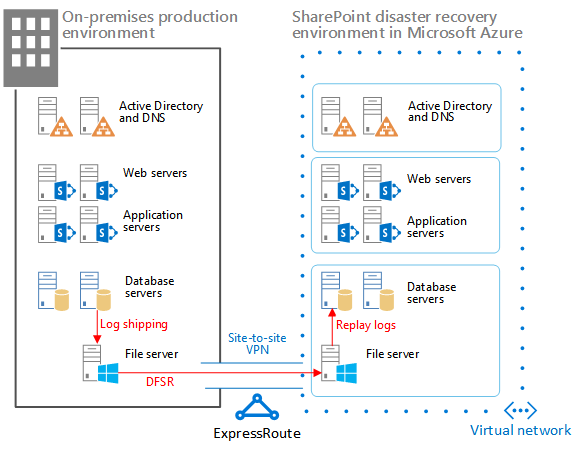

# <a name="sharepoint-server-2013-disaster-recovery-in-microsoft-azure"></a><span data-ttu-id="35a00-103">SharePoint Server 2013 – otfallwiederherstellung in Microsoft Azure</span><span class="sxs-lookup"><span data-stu-id="35a00-103">SharePoint Server 2013 Disaster Recovery in Microsoft Azure</span></span>

 <span data-ttu-id="35a00-104">Mithilfe von Azure können Sie eine Umgebung für die Notfallwiederherstellung für Ihre lokale SharePoint-Farm erstellen.</span><span class="sxs-lookup"><span data-stu-id="35a00-104">Using Azure, you can create a disaster-recovery environment for your on-premises SharePoint farm.</span></span> <span data-ttu-id="35a00-105">Dieser Artikel beschreibt das Entwerfen und Implementieren dieser Lösung.</span><span class="sxs-lookup"><span data-stu-id="35a00-105">This article describes how to design and implement this solution.</span></span>

 <span data-ttu-id="35a00-106">**Schauen Sie sich das Video zur Übersicht über die Notfallwiederherstellung in SharePoint Server 2013 an**.</span><span class="sxs-lookup"><span data-stu-id="35a00-106">**Watch the SharePoint Server 2013 disaster recovery overview video**</span></span>
> [!VIDEO https://www.microsoft.com/videoplayer/embed/1b73ec8f-29bd-44eb-aa3a-f7932784bfd9?autoplay=false]
  
 <span data-ttu-id="35a00-p102">Bei einem Notfall in Ihrer lokalen SharePoint-Umgebung hat die Wiederinbetriebnahme des Systems höchste Priorität. Eine Notfallwiederherstellung mit SharePoint erfolgt schneller und einfacher, wenn Sie bereits über eine in Microsoft Azure ausgeführte Sicherungsumgebung verfügen. In diesem Video werden wichtigsten Konzepte von einer betriebsbereiten SharePoint-Failoverumgebung erläutert. Außerdem werden die umfassenden Details in diesem Artikel weiter ergänzt.</span><span class="sxs-lookup"><span data-stu-id="35a00-p102">When disaster strikes your SharePoint on-premises environment, your top priority is to get the system running again quickly. Disaster recovery with SharePoint is quicker and easier when you have a backup environment already running in Microsoft Azure. This video explains the main concepts of a SharePoint warm failover environment and complements the full details available in this article.</span></span>
  
<span data-ttu-id="35a00-110">Verwenden Sie diesen Artikel mit dem folgenden Lösungsmodell: **SharePoint-Notfallwiederherstellung in Microsoft Azure**.</span><span class="sxs-lookup"><span data-stu-id="35a00-110">Use this article with the following solution model: **SharePoint Disaster Recovery in Microsoft Azure**.</span></span>
  
<span data-ttu-id="35a00-111">[](https://go.microsoft.com/fwlink/p/?LinkId=392555)</span><span class="sxs-lookup"><span data-stu-id="35a00-111">[](https://go.microsoft.com/fwlink/p/?LinkId=392555)</span></span>
  
 <span data-ttu-id="35a00-112">[PDF](https://go.microsoft.com/fwlink/p/?LinkId=392555) |  [Visio](https://go.microsoft.com/fwlink/p/?LinkId=392554)</span><span class="sxs-lookup"><span data-stu-id="35a00-112">[PDF](https://go.microsoft.com/fwlink/p/?LinkId=392555) |  [Visio](https://go.microsoft.com/fwlink/p/?LinkId=392554)</span></span>
  
## <a name="use-azure-infrastructure-services-for-disaster-recovery"></a><span data-ttu-id="35a00-113">Verwenden von Azure Infrastructure Services für Notfallwiederherstellung</span><span class="sxs-lookup"><span data-stu-id="35a00-113">Use Azure Infrastructure Services for disaster recovery</span></span>

<span data-ttu-id="35a00-p103">Viele Organisationen verfügen über keine Umgebung für die Notfallwiederherstellung für SharePoint, deren lokale Einrichtung und Verwaltung kostspielig sein kann. Azure-Infrastrukturdienste bietet überzeugende Optionen für Notfallwiederherstellungsumgebungen, die flexibler und wirtschaftlicher als die lokalen Alternativen sind.</span><span class="sxs-lookup"><span data-stu-id="35a00-p103">Many organizations do not have a disaster recovery environment for SharePoint, which can be expensive to build and maintain on-premises. Azure Infrastructure Services provides compelling options for disaster recovery environments that are more flexible and less expensive than the on-premises alternatives.</span></span>
  
<span data-ttu-id="35a00-116">Die Verwendung von Azure-Infrastrukturdienste bietet folgende Vorteile:</span><span class="sxs-lookup"><span data-stu-id="35a00-116">The advantages for using Azure Infrastructure Services include:</span></span>
  
- <span data-ttu-id="35a00-p104">**Weniger kostspielige Ressourcen** Im Vergleich zu einer lokalen Umgebung für die Notfallwiederherstellung müssen Sie weniger Ressourcen vorhalten und bezahlen. Die Anzahl der Ressourcen hängt von der gewählten Umgebung für die Notfallwiederherstellung ab: verzögert betriebsbereit, betriebsbereit und unmittelbar betriebsbereit.</span><span class="sxs-lookup"><span data-stu-id="35a00-p104">**Fewer costly resources** Maintain and pay for fewer resources than on-premises disaster recovery environments. The number of resources depends on which disaster-recovery environment you choose: cold standby, warm standby, or hot standby.</span></span>
    
- <span data-ttu-id="35a00-p105">**Flexiblere Ressourcen** Bei einem Notfall können Sie Ihre SharePoint-Wiederherstellungsfarm problemlos horizontal hoch skalieren, um die Lastanforderungen zu erfüllen. Skalieren Sie sie horizontal herunter, wenn Sie die Ressourcen nicht mehr benötigen.</span><span class="sxs-lookup"><span data-stu-id="35a00-p105">**Better resource flexibility** In the event of a disaster, easily scale out your recovery SharePoint farm to meet load requirements. Scale in when you no longer need the resources.</span></span>
    
- <span data-ttu-id="35a00-121">**Niedrigere Rechenzentrumsanforderungen** Verwenden Sie Azure-Infrastrukturdienste, statt in ein sekundäres Rechenzentrum in einer anderen Region zu investieren.</span><span class="sxs-lookup"><span data-stu-id="35a00-121">**Lower datacenter commitment** Use Azure Infrastructure Services instead of investing in a secondary datacenter in a different region.</span></span>
    
<span data-ttu-id="35a00-p106">Es gibt weniger komplexe Möglichkeiten für Organisationen, die gerade erst in die Notfallwiederherstellung einsteigen, und erweiterte Optionen für Organisationen mit hohen Anforderungen an Ausfallsicherheit. Die Definitionen für verzögert betriebsbereite, betriebsbereite oder unmittelbar betriebsbereite Standby-Umgebungen sind ein wenig anders, wenn die Umgebung auf einer Cloudplattform gehostet wird. Die folgende Tabelle beschreibt diese Umgebungen für die Erstellung einer SharePoint-Wiederherstellungsfarm in Azure.</span><span class="sxs-lookup"><span data-stu-id="35a00-p106">There are less-complex options for organizations just getting started with disaster recovery and advanced options for organizations with high-resilience requirements. The definitions for cold, warm, and hot standby environments are a little different when the environment is hosted on a cloud platform. The following table describes these environments for building a SharePoint recovery farm in Azure.</span></span>
  
<span data-ttu-id="35a00-125">**Tabelle: Wiederherstellungsumgebungen**</span><span class="sxs-lookup"><span data-stu-id="35a00-125">**Table: Recovery environments**</span></span>

|<span data-ttu-id="35a00-126">**Typ der Wiederherstellungsumgebung**</span><span class="sxs-lookup"><span data-stu-id="35a00-126">**Type of recovery environment**</span></span>|<span data-ttu-id="35a00-127">**Beschreibung**</span><span class="sxs-lookup"><span data-stu-id="35a00-127">**Description**</span></span>|
|:-----|:-----|
|<span data-ttu-id="35a00-128">Unmittelbar betriebsbereit</span><span class="sxs-lookup"><span data-stu-id="35a00-128">Hot</span></span>  <br/> |<span data-ttu-id="35a00-129">Eine vollständig dimensionierte Farm ist bereitgestellt, die aktualisiert und im Standby-Modus ausgeführt wird.</span><span class="sxs-lookup"><span data-stu-id="35a00-129">A fully sized farm is provisioned, updated, and running on standby.</span></span>  <br/> |
|<span data-ttu-id="35a00-130">Bedingt betriebsbereit</span><span class="sxs-lookup"><span data-stu-id="35a00-130">Warm</span></span>  <br/> |<span data-ttu-id="35a00-131">Die Farm ist bereitgestellt, und virtuelle Computer werden ausgeführt und aktualisiert.</span><span class="sxs-lookup"><span data-stu-id="35a00-131">The farm is built and virtual machines are running and updated.</span></span>  <br/> <span data-ttu-id="35a00-132">Zur Wiederherstellung gehören das Anfügen von Inhaltsdatenbanken, Bereitstellen von Dienstanwendungen und Durchforsten von Inhalten.</span><span class="sxs-lookup"><span data-stu-id="35a00-132">Recovery includes attaching content databases, provisioning service applications, and crawling content.</span></span>  <br/> <span data-ttu-id="35a00-133">Die Farm kann eine kleinere Version der Produktionsfarm sein und anschließend für den gesamten Benutzerstamm horizontal hochskaliert werden.</span><span class="sxs-lookup"><span data-stu-id="35a00-133">The farm can be a smaller version of the production farm and then scaled out to serve the full user base.</span></span>  <br/> |
|<span data-ttu-id="35a00-134">Verzögert betriebsbereit</span><span class="sxs-lookup"><span data-stu-id="35a00-134">Cold</span></span>  <br/> |<span data-ttu-id="35a00-135">Die Farm ist vollständig erstellt, aber die virtuellen Computer sind nicht in Betrieb.</span><span class="sxs-lookup"><span data-stu-id="35a00-135">The farm is fully built, but the virtual machines are stopped.</span></span>  <br/> <span data-ttu-id="35a00-136">Zur Verwaltung der Umgebung zählen das Starten der virtuellen Computer in regelmäßigen Abständen, das Einspielen von Patches und Updates sowie das Überprüfen der Umgebung.</span><span class="sxs-lookup"><span data-stu-id="35a00-136">Maintaining the environment includes starting the virtual machines from time to time, patching, updating, and verifying the environment.</span></span>  <br/> <span data-ttu-id="35a00-137">Starten Sie die vollständige Umgebung bei einem Notfall.</span><span class="sxs-lookup"><span data-stu-id="35a00-137">Start the full environment in the event of a disaster.</span></span>  <br/> |
   
<span data-ttu-id="35a00-p107">Es ist wichtig, die Recovery Time Objectives (RTO) und Recovery Point Objectives (RPO) Ihrer Organisation zu bewerten. Diese Anforderungen bestimmen, welche Umgebung für Ihre Organisation am besten geeignet ist.</span><span class="sxs-lookup"><span data-stu-id="35a00-p107">It's important to evaluate your organization's Recovery Time Objectives (RTOs) and Recovery Point Objectives (RPOs). These requirements determine which environment is the most appropriate investment for your organization.</span></span>
  
<span data-ttu-id="35a00-p108">In den Anleitungen in diesem Artikel wird beschrieben, wie eine betriebsbereite Standby-Umgebung implementiert wird. Sie können sie auch an eine verzögert betriebsbereite Standby-Umgebung anpassen, obwohl Sie zusätzliche Verfahren zur Unterstützung dieser Art von Umgebung befolgen müssen. In diesem Artikel wird nicht die Implementierung einer unmittelbar betriebsbereiten Standby-Umgebung beschrieben.</span><span class="sxs-lookup"><span data-stu-id="35a00-p108">The guidance in this article describes how to implement a warm standby environment. You can also adapt it to a cold standby environment, although you need to follow additional procedures to support this kind of environment. This article does not describe how to implement a hot standby environment.</span></span>
  
<span data-ttu-id="35a00-143">Weitere Informationen zur Notfallwiederherstellung finden Sie unter [High availability and disaster recovery concepts in SharePoint 2013](/SharePoint/administration/high-availability-and-disaster-recovery-concepts) und [Choose a disaster recovery strategy for SharePoint 2013](/SharePoint/administration/plan-for-disaster-recovery).</span><span class="sxs-lookup"><span data-stu-id="35a00-143">For more information about disaster recovery solutions, see [High availability and disaster recovery concepts in SharePoint 2013](/SharePoint/administration/high-availability-and-disaster-recovery-concepts) and [Choose a disaster recovery strategy for SharePoint 2013](/SharePoint/administration/plan-for-disaster-recovery).</span></span>
  
## <a name="solution-description"></a><span data-ttu-id="35a00-144">Beschreibung der Lösung</span><span class="sxs-lookup"><span data-stu-id="35a00-144">Solution description</span></span>

<span data-ttu-id="35a00-145">Die betriebsbereite Standby-Lösung für die Notfallwiederherstellung erfordert die folgende Umgebung:</span><span class="sxs-lookup"><span data-stu-id="35a00-145">The warm standby disaster-recovery solution requires the following environment:</span></span>
  
- <span data-ttu-id="35a00-146">Eine lokale SharePoint-Produktionsfarm</span><span class="sxs-lookup"><span data-stu-id="35a00-146">An on-premises SharePoint production farm</span></span>
    
- <span data-ttu-id="35a00-147">Eine SharePoint-Farm in Azure für die Wiederherstellung</span><span class="sxs-lookup"><span data-stu-id="35a00-147">A recovery SharePoint farm in Azure</span></span>
    
- <span data-ttu-id="35a00-148">Eine Standort-zu-Standort-VPN-Verbindung zwischen den beiden Umgebungen</span><span class="sxs-lookup"><span data-stu-id="35a00-148">A site-to-site VPN connection between the two environments</span></span>
    
<span data-ttu-id="35a00-149">Die folgende Abbildung zeigt diese drei Elemente.</span><span class="sxs-lookup"><span data-stu-id="35a00-149">The following figure illustrates these three elements.</span></span>
  
<span data-ttu-id="35a00-150">**Abbildung: Elemente einer betriebsbereiten Standby-Lösung in Windows Azure**</span><span class="sxs-lookup"><span data-stu-id="35a00-150">**Figure: Elements of a warm standby solution in Azure**</span></span>


  
<span data-ttu-id="35a00-152">Der SQL Server-Protokollversand mit DFS-Replikation (Distributed File System Replication) dient zum Kopieren von Datenbanksicherungen und Transaktionsprotokollen in die Wiederherstellungsfarm in Azure:</span><span class="sxs-lookup"><span data-stu-id="35a00-152">SQL Server log shipping with Distributed File System Replication (DFSR) is used to copy database backups and transaction logs to the recovery farm in Azure:</span></span> 
  
- <span data-ttu-id="35a00-p109">DFSR überträgt Protokolle aus der Produktionsumgebung in die Wiederherstellungsumgebung. In einem WAN-Szenario ist DFSR effizienter als das Versenden der Protokolle direkt an den sekundären Server in Azure.</span><span class="sxs-lookup"><span data-stu-id="35a00-p109">DFSR transfers logs from the production environment to the recovery environment. In a WAN scenario, DFSR is more efficient than shipping the logs directly to the secondary server in Azure.</span></span>
    
- <span data-ttu-id="35a00-155">Protokolle werden in SQL Server in der Wiederherstellungsumgebung in Azure wiedergegeben.</span><span class="sxs-lookup"><span data-stu-id="35a00-155">Logs are replayed to the SQL Server in the recovery environment in Azure.</span></span>
    
- <span data-ttu-id="35a00-156">Sie fügen SharePoint-Inhaltsdatenbanken erst per Protokollversand an die Wiederherstellungsumgebung an, wenn ein Wiederherstellungsvorgang durchgeführt wird.</span><span class="sxs-lookup"><span data-stu-id="35a00-156">You don't attach log-shipped SharePoint content databases in the recovery environment until a recovery exercise is performed.</span></span>
    
<span data-ttu-id="35a00-157">Führen Sie die folgenden Schritte aus, um die Farm wiederherzustellen:</span><span class="sxs-lookup"><span data-stu-id="35a00-157">Perform the following steps to recover the farm:</span></span>
  
1. <span data-ttu-id="35a00-158">Beenden Sie den Protokollversand.</span><span class="sxs-lookup"><span data-stu-id="35a00-158">Stop log shipping.</span></span>
    
2. <span data-ttu-id="35a00-159">Lassen Sie keinen Datenverkehr zur primären Farm mehr zu.</span><span class="sxs-lookup"><span data-stu-id="35a00-159">Stop accepting traffic to the primary farm.</span></span>
    
3. <span data-ttu-id="35a00-160">Geben Sie die letzten Transaktionsprotokolle wieder.</span><span class="sxs-lookup"><span data-stu-id="35a00-160">Replay the final transaction logs.</span></span>
    
4. <span data-ttu-id="35a00-161">Fügen Sie die Inhaltsdatenbanken an die Farm an.</span><span class="sxs-lookup"><span data-stu-id="35a00-161">Attach the content databases to the farm.</span></span>
    
5. <span data-ttu-id="35a00-162">Stellen Sie Dienstanwendungen aus der replizierten Services-Datenbanken wieder her.</span><span class="sxs-lookup"><span data-stu-id="35a00-162">Restore service applications from the replicated services databases.</span></span>
    
6. <span data-ttu-id="35a00-163">Aktualisieren Sie DNS-Einträge (Domain Name System) so, dass sie auf die Wiederherstellungsfarm zeigen.</span><span class="sxs-lookup"><span data-stu-id="35a00-163">Update Domain Name System (DNS) records to point to the recovery farm.</span></span>
    
7. <span data-ttu-id="35a00-164">Starten Sie eine vollständige Durchforstung.</span><span class="sxs-lookup"><span data-stu-id="35a00-164">Start a full crawl.</span></span>
    
<span data-ttu-id="35a00-p110">Wir empfehlen, diese Schritte regelmäßig zu testen und zu dokumentieren, um sicherzustellen, dass Ihre Wiederherstellung bei laufendem System problemlos ausgeführt werden kann. Das Anfügen von Inhaltsdatenbanken und Wiederherstellen von Dienstanwendungen kann einige Zeit in Anspruch nehmen und umfasst in der Regel einige manuelle Konfigurationsschritte.</span><span class="sxs-lookup"><span data-stu-id="35a00-p110">We recommend that you rehearse these steps regularly and document them to help ensure that your live recovery runs smoothly. Attaching content databases and restoring service applications can take some time and typically involves some manual configuration.</span></span>
  
<span data-ttu-id="35a00-167">Nachdem eine Wiederherstellung erfolgt ist, bietet Ihnen diese Lösung die in der folgenden Tabelle aufgeführten Elemente.</span><span class="sxs-lookup"><span data-stu-id="35a00-167">After a recovery is performed, this solution provides the items listed in the following table.</span></span>
  
<span data-ttu-id="35a00-168">**Tabelle: Wiederherstellungsziele der Lösung**</span><span class="sxs-lookup"><span data-stu-id="35a00-168">**Table: Solution recovery objectives**</span></span>

|<span data-ttu-id="35a00-169">**Aspekt**</span><span class="sxs-lookup"><span data-stu-id="35a00-169">**Item**</span></span>|<span data-ttu-id="35a00-170">**Beschreibung**</span><span class="sxs-lookup"><span data-stu-id="35a00-170">**Description**</span></span>|
|:-----|:-----|
|<span data-ttu-id="35a00-171">Websites und Inhalte</span><span class="sxs-lookup"><span data-stu-id="35a00-171">Sites and content</span></span>  <br/> |<span data-ttu-id="35a00-172">Websites und Inhalte sind in der Wiederherstellungsumgebung verfügbar.</span><span class="sxs-lookup"><span data-stu-id="35a00-172">Sites and content are available in the recovery environment.</span></span>  <br/> |
|<span data-ttu-id="35a00-173">Eine neue Instanz der Suche</span><span class="sxs-lookup"><span data-stu-id="35a00-173">A new instance of search</span></span>  <br/> |<span data-ttu-id="35a00-p111">Bei dieser betriebsbereiten Standby-Lösung wird die Suche aus Suchdatenbanken wiederhergestellt. Die Konfiguration von Suchkomponenten in der Wiederherstellungsfarm orientiert sich so weit wie möglich an der Produktionsfarm. Nachdem Websites und Inhalte wiederhergestellt wurden, wird eine vollständige Durchforstung gestartet, um den Suchindex neu zu erstellen. Sie müssen nicht warten, bis die Durchforstung abgeschlossen ist, um die Websites und Inhalte zur Verfügung zu stellen.</span><span class="sxs-lookup"><span data-stu-id="35a00-p111">In this warm standby solution, search is not restored from search databases. Search components in the recovery farm are configured as similarly as possible to the production farm. After the sites and content are restored, a full crawl is started to rebuild the search index. You do not need to wait for the crawl to complete to make the sites and content available.</span></span>  <br/> |
|<span data-ttu-id="35a00-178">Dienste</span><span class="sxs-lookup"><span data-stu-id="35a00-178">Services</span></span>  <br/> | <span data-ttu-id="35a00-p112">Dienste, die Daten in Datenbanken speichern, werden von Datenbanken mit Protokollversand wiederhergestellt. Dienste, die keine Daten in Datenbanken speichern, werden einfach gestartet.</span><span class="sxs-lookup"><span data-stu-id="35a00-p112">Services that store data in databases are restored from the log-shipped databases. Services that do not store data in databases are simply started.</span></span> <br/>  <span data-ttu-id="35a00-p113">Nicht alle Dienste mit Datenbanken müssen wiederhergestellt werden. Die folgenden Dienste müssen nicht aus Datenbanken wiederhergestellt werden und können nach einem Failover einfach gestartet werden:</span><span class="sxs-lookup"><span data-stu-id="35a00-p113">Not all services with databases need to be restored. The following services do not need to be restored from databases and can simply be started after failover:</span></span> <br/>  <span data-ttu-id="35a00-183">Sammlung von Verwendungs- und Integritätsdaten</span><span class="sxs-lookup"><span data-stu-id="35a00-183">Usage and Health Data Collection</span></span> <br/>  <span data-ttu-id="35a00-184">Statusdienst</span><span class="sxs-lookup"><span data-stu-id="35a00-184">State service</span></span> <br/>  <span data-ttu-id="35a00-185">Word-Automatisierung</span><span class="sxs-lookup"><span data-stu-id="35a00-185">Word automation</span></span> <br/>  <span data-ttu-id="35a00-186">Alle anderen Dienste, die keine Datenbank verwenden</span><span class="sxs-lookup"><span data-stu-id="35a00-186">Any other service that doesn't use a database</span></span> <br/> |
   
<span data-ttu-id="35a00-p114">Sie können mit Microsoft Consulting Services (MCS) oder einem Partner zusammenarbeiten, um komplexere Wiederherstellungsziele zu erfüllen, die in der folgenden Tabelle zusammengefasst sind.</span><span class="sxs-lookup"><span data-stu-id="35a00-p114">You can work with Microsoft Consulting Services (MCS) or a partner to address more-complex recovery objectives. These are summarized in the following table.</span></span>
  
<span data-ttu-id="35a00-189">**Tabelle: Andere Elemente, die von MCS oder einem Partner betreut werden können**</span><span class="sxs-lookup"><span data-stu-id="35a00-189">**Table: Other items that can be addressed by MCS or a partner**</span></span>

|<span data-ttu-id="35a00-190">**Aspekt**</span><span class="sxs-lookup"><span data-stu-id="35a00-190">**Item**</span></span>|<span data-ttu-id="35a00-191">**Beschreibung**</span><span class="sxs-lookup"><span data-stu-id="35a00-191">**Description**</span></span>|
|:-----|:-----|
|<span data-ttu-id="35a00-192">Synchronisieren benutzerdefinierter Farmlösungen</span><span class="sxs-lookup"><span data-stu-id="35a00-192">Synchronizing custom farm solutions</span></span>  <br/> |<span data-ttu-id="35a00-p115">Im Idealfall ist die Konfiguration der Wiederherstellungsfarm identisch mit der Produktionsfarm. Sie können mit einem Berater oder Partner zusammenarbeiten, um zu prüfen, ob benutzerdefinierte Farmlösungen repliziert werden und ob ein Prozess vorhanden ist, mit dessen Hilfe beide Umgebungen synchron bleiben.</span><span class="sxs-lookup"><span data-stu-id="35a00-p115">Ideally, the recovery farm configuration is identical to the production farm. You can work with a consultant or partner to evaluate whether custom farm solutions are replicated and whether the process is in place for keeping the two environments synchronized.</span></span>  <br/> |
|<span data-ttu-id="35a00-195">Verbindungen mit lokalen Datenquellen</span><span class="sxs-lookup"><span data-stu-id="35a00-195">Connections to data sources on-premises</span></span>  <br/> |<span data-ttu-id="35a00-196">Es ist möglicherweise unpraktisch, Verbindungen mit Back-End-Datensystemen zu replizieren, z. B. mit Sicherungsdomänencontrollern und Inhaltsquellen für die Suche.</span><span class="sxs-lookup"><span data-stu-id="35a00-196">It might not be practical to replicate connections to back-end data systems, such as backup domain controller (BDC) connections and search content sources.</span></span>  <br/> |
|<span data-ttu-id="35a00-197">Wiederherstellungsszenarien für die Suchfunktion</span><span class="sxs-lookup"><span data-stu-id="35a00-197">Search restore scenarios</span></span>  <br/> |<span data-ttu-id="35a00-p116">Da Bereitstellungen der Unternehmenssuche in der Regel relativ individuell und komplex sind, erfordert das Wiederherstellen von Suchen aus Datenbanken mehr Aufwand. Sie können mit einem Berater oder Partner zusammenarbeiten, um Wiederherstellungsszenarien für die Suchfunktion zu bestimmen und zu implementieren, die Ihre Organisation ggf. benötigt.</span><span class="sxs-lookup"><span data-stu-id="35a00-p116">Because enterprise search deployments tend to be fairly unique and complex, restoring search from databases requires a greater investment. You can work with a consultant or partner to identify and implement search restore scenarios that your organization might require.</span></span>  <br/> |
   
<span data-ttu-id="35a00-200">Bei den Anleitungen in diesem Artikel wird davon ausgegangen, dass die lokale Farm bereits entworfen wurde und bereitgestellt ist.</span><span class="sxs-lookup"><span data-stu-id="35a00-200">The guidance provided in this article assumes that the on-premises farm is already designed and deployed.</span></span>
  
## <a name="detailed-architecture"></a><span data-ttu-id="35a00-201">Detaillierte Architektur</span><span class="sxs-lookup"><span data-stu-id="35a00-201">Detailed architecture</span></span>

<span data-ttu-id="35a00-202">Im Idealfall ist die Konfiguration der Wiederherstellungsfarm in Azure identisch mit der lokalen Produktionsfarm, einschließlich der folgenden Einstellungen:</span><span class="sxs-lookup"><span data-stu-id="35a00-202">Ideally, the recovery farm configuration in Azure is identical to the production farm on-premises, including the following:</span></span>
  
- <span data-ttu-id="35a00-203">Dieselbe Zuordnung von Serverrollen</span><span class="sxs-lookup"><span data-stu-id="35a00-203">The same representation of server roles</span></span>
    
- <span data-ttu-id="35a00-204">Dieselbe Konfiguration von Anpassungen</span><span class="sxs-lookup"><span data-stu-id="35a00-204">The same configuration of customizations</span></span>
    
- <span data-ttu-id="35a00-205">Dieselbe Konfiguration der Suchkomponenten</span><span class="sxs-lookup"><span data-stu-id="35a00-205">The same configuration of search components</span></span>
    
<span data-ttu-id="35a00-p117">Die Umgebung in Azure kann eine kleinere Version der Produktionsfarm sein. Wenn Sie nach einem Failover die Wiederherstellungsfarm horizontal hochskalieren möchten, ist es wichtig, dass jede Art von Serverrolle anfangs zugeordnet ist.</span><span class="sxs-lookup"><span data-stu-id="35a00-p117">The environment in Azure can be a smaller version of the production farm. If you plan to scale out the recovery farm after failover, it's important that each type of server role be initially represented.</span></span>
  
<span data-ttu-id="35a00-p118">Einige Konfigurationen eignen sich möglicherweise nicht für die Replikation in die Failoverumgebung. Stellen Sie sich, dass die Failoververfahren und -umgebung getestet werden, um dafür zu sorgen, dass die Failoverfarm die erwarteten Servicelevel bietet.</span><span class="sxs-lookup"><span data-stu-id="35a00-p118">Some configurations might not be practical to replicate in the failover environment. Be sure to test the failover procedures and environment to help ensure that the failover farm provides the expected service level.</span></span>
  
<span data-ttu-id="35a00-p119">Diese Lösung schreibt keine bestimmte Topologie für eine SharePoint-Farm vor. Schwerpunkt dieser Lösung ist die Verwendung von Azure für die Failoverfarm und Implementierung von Protokollversand und DFSR zwischen den beiden Umgebungen.</span><span class="sxs-lookup"><span data-stu-id="35a00-p119">This solution doesn't prescribe a specific topology for a SharePoint farm. The focus of this solution is to use Azure for the failover farm and to implement log shipping and DFSR between the two environments.</span></span>
  
### <a name="warm-standby-environments"></a><span data-ttu-id="35a00-212">Betriebsbereite Standby-Umgebungen</span><span class="sxs-lookup"><span data-stu-id="35a00-212">Warm standby environments</span></span>

<span data-ttu-id="35a00-p120">In einer betriebsbereiten Standby-Umgebung werden alle virtuellen Computer in der Azure-Umgebung ausgeführt. Die Umgebung ist bereit für eine Failoverübung oder ein tatsächliches Failover.</span><span class="sxs-lookup"><span data-stu-id="35a00-p120">In a warm standby environment, all virtual machines in the Azure environment are running. The environment is ready for a failover exercise or event.</span></span>
  
<span data-ttu-id="35a00-215">Die folgende Abbildung zeigt eine Notfallwiederherstellungslösung aus einer lokalen SharePoint-Farm in eine Azure-basierten SharePoint-Farm, die als betriebsbereite Standby-Umgebung konfiguriert ist.</span><span class="sxs-lookup"><span data-stu-id="35a00-215">The following figure illustrates a disaster recovery solution from an on-premises SharePoint farm to an Azure-based SharePoint farm that is configured as a warm standby environment.</span></span>
  
<span data-ttu-id="35a00-216">**Abbildung: Topologie und zentrale Elemente einer Produktionsfarm und einer betriebsbereiten Standby-Wiederherstellungsfarm**</span><span class="sxs-lookup"><span data-stu-id="35a00-216">**Figure: Topology and key elements of a production farm and a warm standby recovery farm**</span></span>


  
<span data-ttu-id="35a00-218">Inhalt dieses Diagramms:</span><span class="sxs-lookup"><span data-stu-id="35a00-218">In this diagram:</span></span>
  
- <span data-ttu-id="35a00-219">Es sind zwei Umgebungen nebeneinander dargestellt: die lokale SharePoint-Farm und die betriebsbereite Standby-Farm in Azure.</span><span class="sxs-lookup"><span data-stu-id="35a00-219">Two environments are illustrated side by side: the on-premises SharePoint farm and the warm standby farm in Azure.</span></span>
    
- <span data-ttu-id="35a00-220">Jede Umgebung umfasst eine Dateifreigabe.</span><span class="sxs-lookup"><span data-stu-id="35a00-220">Each environment includes a file share.</span></span>
    
- <span data-ttu-id="35a00-p121">Jede Farm hat vier Ebenen. Um Hochverfügbarkeit zu erreichen, enthält jede Ebene zwei Server oder virtuelle Computer, die für eine bestimmte Rolle, z. B. Front-End-Dienste, verteilter Cache, Back-End-Dienste und Datenbanken, identisch konfiguriert sind. Es ist nicht wichtig, in dieser Abbildung bestimmte Komponenten hervorzuheben. Die beiden Farmen sind identisch konfiguriert.</span><span class="sxs-lookup"><span data-stu-id="35a00-p121">Each farm includes four tiers. To achieve high availability, each tier includes two servers or virtual machines that are configured identically for a specific role, such as front-end services, distributed cache, back-end services, and databases. It isn't important in this illustration to call out specific components. The two farms are configured identically.</span></span>
    
- <span data-ttu-id="35a00-p122">Die vierte Ebene ist die Datenbankebene. Der Protokollversand dient zum Kopieren von Protokollen vom sekundären Datenbankserver, der sich in der lokale Umgebung befindet, in die Dateifreigabe in derselben Umgebung.</span><span class="sxs-lookup"><span data-stu-id="35a00-p122">The fourth tier is the database tier. Log shipping is used to copy logs from the secondary database server in the on-premises environment to the file share in the same environment.</span></span>
    
- <span data-ttu-id="35a00-227">DFSR kopiert Dateien aus der Dateifreigabe in der lokalen Umgebung in die Dateifreigabe in der Azure-Umgebung.</span><span class="sxs-lookup"><span data-stu-id="35a00-227">DFSR copies files from the file share in the on-premises environment to the file share in the Azure environment.</span></span>
    
- <span data-ttu-id="35a00-228">Beim Protokollversand werden die Protokolle aus der Dateifreigabe der Azure-Umgebung im primären Replikat in der AlwaysOn-Verfügbarkeitsgruppe in SQL Server in der Wiederherstellungsumgebung wiedergegeben.</span><span class="sxs-lookup"><span data-stu-id="35a00-228">Log shipping replays the logs from the file share in the Azure environment to the primary replica in the SQL Server AlwaysOn availability group in the recovery environment.</span></span>
    
### <a name="cold-standby-environments"></a><span data-ttu-id="35a00-229">Verzögert betriebsbereite Standby-Umgebungen</span><span class="sxs-lookup"><span data-stu-id="35a00-229">Cold standby environments</span></span>

<span data-ttu-id="35a00-p123">In einer verzögert betriebsbereiten Standby-Umgebung können die meisten virtuellen Computer der SharePoint-Farm heruntergefahren werden. (Es wird empfohlen, die virtuellen Computer gelegentlich, z. B. alle zwei Wochen oder einmal im Monat, zu starten, damit sich jeder virtuelle Computer mit der Domäne synchronisieren kann.) Die folgenden virtuellen Computer in der Azure-Wiederherstellungsumgebung müssen stets ausgeführt werden, um sicherzustellen, dass der Protokollversand und DFSR unterbrechungsfrei in Betrieb bleiben:</span><span class="sxs-lookup"><span data-stu-id="35a00-p123">In a cold standby environment, most of the SharePoint farm virtual machines can be shut down. (We recommend occasionally starting the virtual machines, such as every two weeks or once a month, so that each virtual machine can sync with the domain.) The following virtual machines in the Azure recovery environment must remain running to help ensure continuous operations of log shipping and DFSR:</span></span>
  
- <span data-ttu-id="35a00-232">Die Dateifreigabe</span><span class="sxs-lookup"><span data-stu-id="35a00-232">The file share</span></span>
    
- <span data-ttu-id="35a00-233">Der primäre Datenbankserver</span><span class="sxs-lookup"><span data-stu-id="35a00-233">The primary database server</span></span>
    
- <span data-ttu-id="35a00-234">Mindestens ein virtueller Computer mit Windows Server Active Directory-Domänendienste und DNS</span><span class="sxs-lookup"><span data-stu-id="35a00-234">At least one virtual machine running Windows Server Active Directory Domain Services and DNS</span></span>
    
<span data-ttu-id="35a00-p124">Die folgende Abbildung zeigt eine Azure-Failoverumgebung, in der die virtuellen Computer der Dateifreigabe und die virtuellen Computer der primären SharePoint-Datenbank ausgeführt werden. Alle anderen virtuellen Computer mit SharePoint wurden heruntergefahren. Der virtuelle Computer, auf dem Windows Server Active Directory und DNS ausgeführt werden, wird nicht gezeigt.</span><span class="sxs-lookup"><span data-stu-id="35a00-p124">The following figure shows an Azure failover environment in which the file share virtual machine and the primary SharePoint database virtual machine are running. All other SharePoint virtual machines are stopped. The virtual machine that is running Windows Server Active Directory and DNS is not shown.</span></span>
  
<span data-ttu-id="35a00-238">**Abbildung: Verzögert betriebsbereite Standby-Wiederherstellungsfarm mit ausgeführten virtuellen Computern**</span><span class="sxs-lookup"><span data-stu-id="35a00-238">**Figure: Cold standby recovery farm with running virtual machines**</span></span>


  
<span data-ttu-id="35a00-240">Nach einem Failover zu einer verzögert betriebsbereiten Standby-Umgebung werden alle virtuellen Computer gestartet, und das Verfahren zum Erreichen von Hochverfügbarkeit der Datenbankserver muss konfiguriert werden, wie z. B. SQL Server AlwaysOn-Verfügbarkeitsgruppen.</span><span class="sxs-lookup"><span data-stu-id="35a00-240">After failover to a cold standby environment, all virtual machines are started, and the method to achieve high availability of the database servers must be configured, such as SQL Server AlwaysOn availability groups.</span></span>
  
<span data-ttu-id="35a00-241">Wenn mehrere Speichergruppen implementiert sind (Datenbanken sind auf mehrere SQL Server-Hochverfügbarkeitsätze verteilt), muss die primäre Datenbank für jede Speichergruppe für die Annahme der Protokolle der jeweiligen Speichergruppe ausgeführt werden.</span><span class="sxs-lookup"><span data-stu-id="35a00-241">If multiple storage groups are implemented (databases are spread across more than one SQL Server high availability set), the primary database for each storage group must be running to accept the logs associated with its storage group.</span></span>
  
### <a name="skills-and-experience"></a><span data-ttu-id="35a00-242">Kompetenz und Erfahrung</span><span class="sxs-lookup"><span data-stu-id="35a00-242">Skills and experience</span></span>

<span data-ttu-id="35a00-p125">Mehrere Technologien werden bei dieser Notfallwiederherstellungslösung verwendet. Um sicherzustellen, dass diese Technologien wie erwartet interagieren, muss jede Komponente in der lokalen und Azure-Umgebung installiert und ordnungsgemäß konfiguriert werden. Wir empfehlen, dass Personen oder Teams, die diese Lösung einrichten, über fundierte Kenntnisse und praktische Fertigkeiten mit Technologien verfügen, die in den folgenden Artikeln beschrieben werden:</span><span class="sxs-lookup"><span data-stu-id="35a00-p125">Multiple technologies are used in this disaster recovery solution. To help ensure that these technologies interact as expected, each component in the on-premises and Azure environment must be installed and configured correctly. We recommend that the person or team who sets up this solution have a strong working knowledge of and hands-on skills with the technologies described in the following articles:</span></span>
  
- <span data-ttu-id="35a00-246">[Übersicht über DFS-Namespaces und DFS-Replikation](/previous-versions/windows/it-pro/windows-server-2012-R2-and-2012/jj127250(v=ws.11))</span><span class="sxs-lookup"><span data-stu-id="35a00-246">[Distributed File System (DFS) Replication Services](/previous-versions/windows/it-pro/windows-server-2012-R2-and-2012/jj127250(v=ws.11))</span></span>
    
- [<span data-ttu-id="35a00-247">Windows Server-Failoverclustering (WSFC) mit SQL Server</span><span class="sxs-lookup"><span data-stu-id="35a00-247">Windows Server Failover Clustering (WSFC) with SQL Server</span></span>](/sql/sql-server/failover-clusters/windows/windows-server-failover-clustering-wsfc-with-sql-server)
    
- [<span data-ttu-id="35a00-248">AlwaysOn-Verfügbarkeitsgruppen (SQL Server)</span><span class="sxs-lookup"><span data-stu-id="35a00-248">AlwaysOn Availability Groups (SQL Server)</span></span>](/sql/database-engine/availability-groups/windows/always-on-availability-groups-sql-server)
    
- [<span data-ttu-id="35a00-249">Sichern und Wiederherstellen von SQL Server-Datenbanken</span><span class="sxs-lookup"><span data-stu-id="35a00-249">Back Up and Restore of SQL Server Databases</span></span>](/sql/relational-databases/backup-restore/back-up-and-restore-of-sql-server-databases)
    
- [<span data-ttu-id="35a00-250">Übersicht über die SharePoint 2013-Installation und -Konfiguration</span><span class="sxs-lookup"><span data-stu-id="35a00-250">SharePoint Server 2013 installation and farm deployment</span></span>](/SharePoint/install/installation-and-configuration-overview)
    
- [<span data-ttu-id="35a00-251">Microsoft Azure</span><span class="sxs-lookup"><span data-stu-id="35a00-251">Microsoft Azure</span></span>](/azure/)
    
<span data-ttu-id="35a00-p126">Schließlich werden Skripterstellungsfähigkeiten zum Automatisieren von Aufgaben im Zusammenhang mit diesen Technologien empfohlen. Es ist möglich, die verfügbaren Benutzeroberflächen zum Ausführen aller Aufgaben zu verwenden, die in dieser Lösung beschrieben werden. Allerdings kann ein manuelles Verfahren zeitaufwändig und fehleranfällig sein und inkonsistente Ergebnisse liefern.</span><span class="sxs-lookup"><span data-stu-id="35a00-p126">Finally, we recommend scripting skills that you can use to automate tasks associated with these technologies. It's possible to use the available user interfaces to complete all the tasks described in this solution. However, a manual approach can be time consuming and error prone and delivers inconsistent results.</span></span>
  
<span data-ttu-id="35a00-p127">Zusätzlich zu Windows PowerShell gibt es auch Windows PowerShell-Bibliotheken für SQL Server, SharePoint Server und Azure. Vergessen Sie nicht T-SQL, eine Sprache, die die Dauer der Konfiguration und Verwaltung Ihrer Umgebung für Notfallwiederherstellung verkürzen kann.</span><span class="sxs-lookup"><span data-stu-id="35a00-p127">In addition to Windows PowerShell, there are also Windows PowerShell libraries for SQL Server, SharePoint Server, and Azure. Don't forget T-SQL, which can also help reduce the time to configure and maintain your disaster-recovery environment.</span></span>
  
## <a name="disaster-recovery-roadmap"></a><span data-ttu-id="35a00-257">Fahrplan für die Notfallwiederherstellung</span><span class="sxs-lookup"><span data-stu-id="35a00-257">Disaster recovery roadmap</span></span>


  
<span data-ttu-id="35a00-259">Dieser Fahrplan setzt vorausgesetzt, dass Sie bereits eine SharePoint Server 2013-Farm in der Produktion bereitgestellt haben.</span><span class="sxs-lookup"><span data-stu-id="35a00-259">This roadmap assumes that you already have a SharePoint Server 2013 farm deployed in production.</span></span>
  
<span data-ttu-id="35a00-260">**Tabelle: Fahrplan für die Notfallwiederherstellung**</span><span class="sxs-lookup"><span data-stu-id="35a00-260">**Table: Roadmap for disaster recovery**</span></span>

|<span data-ttu-id="35a00-261">**Phase**</span><span class="sxs-lookup"><span data-stu-id="35a00-261">**Phase**</span></span>|<span data-ttu-id="35a00-262">**Beschreibung**</span><span class="sxs-lookup"><span data-stu-id="35a00-262">**Description**</span></span>|
|:-----|:-----|
|<span data-ttu-id="35a00-263">Phase 1</span><span class="sxs-lookup"><span data-stu-id="35a00-263">Phase 1</span></span>  <br/> |<span data-ttu-id="35a00-264">Entwerfen der Umgebung für die Notfallwiederherstellung</span><span class="sxs-lookup"><span data-stu-id="35a00-264">Design the disaster recovery environment.</span></span>  <br/> |
|<span data-ttu-id="35a00-265">Phase 2</span><span class="sxs-lookup"><span data-stu-id="35a00-265">Phase 2</span></span>  <br/> |<span data-ttu-id="35a00-266">Erstellen des virtuellen Azure-Netzwerks und der VPN-Verbindung</span><span class="sxs-lookup"><span data-stu-id="35a00-266">Create the Azure virtual network and VPN connection.</span></span>  <br/> |
|<span data-ttu-id="35a00-267">Phase 3</span><span class="sxs-lookup"><span data-stu-id="35a00-267">Phase 3</span></span>  <br/> |<span data-ttu-id="35a00-268">Bereitstellen von Active Directory und Domain Name Services im virtuellen Azure-Netzwerk</span><span class="sxs-lookup"><span data-stu-id="35a00-268">Deploy Windows Active Directory and Domain Name Services to the Azure virtual network.</span></span>  <br/> |
|<span data-ttu-id="35a00-269">Phase 4</span><span class="sxs-lookup"><span data-stu-id="35a00-269">Phase 4</span></span>  <br/> |<span data-ttu-id="35a00-270">Bereitstellen der SharePoint-Wiederherstellungsfarm in Azure</span><span class="sxs-lookup"><span data-stu-id="35a00-270">Deploy the SharePoint recovery farm in Azure.</span></span>  <br/> |
|<span data-ttu-id="35a00-271">Phase 5</span><span class="sxs-lookup"><span data-stu-id="35a00-271">Phase 5</span></span>  <br/> |<span data-ttu-id="35a00-272">Einrichten der DFS-Replikation zwischen den Farmen</span><span class="sxs-lookup"><span data-stu-id="35a00-272">Set up DFSR between the farms.</span></span>  <br/> |
|<span data-ttu-id="35a00-273">Phase 6</span><span class="sxs-lookup"><span data-stu-id="35a00-273">Phase 6</span></span>  <br/> |<span data-ttu-id="35a00-274">Einrichten des Protokollversands zur Wiederherstellungsfarm</span><span class="sxs-lookup"><span data-stu-id="35a00-274">Set up log shipping to the recovery farm.</span></span>  <br/> |
|<span data-ttu-id="35a00-275">Phase 7</span><span class="sxs-lookup"><span data-stu-id="35a00-275">Phase 7</span></span>  <br/> | <span data-ttu-id="35a00-p128">Überprüfen der Lösungen für Failover und Wiederherstellung. Dies umfasst die folgenden Verfahren und Technologien:</span><span class="sxs-lookup"><span data-stu-id="35a00-p128">Validate failover and recovery solutions. This includes the following procedures and technologies:</span></span> <br/>  <span data-ttu-id="35a00-278">Beenden des Protokollversands</span><span class="sxs-lookup"><span data-stu-id="35a00-278">Stop log shipping.</span></span> <br/>  <span data-ttu-id="35a00-279">Wiederherstellen der Sicherungen</span><span class="sxs-lookup"><span data-stu-id="35a00-279">Restore the backups.</span></span> <br/>  <span data-ttu-id="35a00-280">Durchforsten von Inhalten</span><span class="sxs-lookup"><span data-stu-id="35a00-280">Crawl content.</span></span> <br/>  <span data-ttu-id="35a00-281">Wiederherstellen von Diensten</span><span class="sxs-lookup"><span data-stu-id="35a00-281">Recover services.</span></span> <br/>  <span data-ttu-id="35a00-282">Verwalten von DNS-Einträgen</span><span class="sxs-lookup"><span data-stu-id="35a00-282">Manage DNS records.</span></span> <br/> |
   
## <a name="phase-1-design-the-disaster-recovery-environment"></a><span data-ttu-id="35a00-283">Phase 1: Entwerfen der Umgebung für die Notfallwiederherstellung</span><span class="sxs-lookup"><span data-stu-id="35a00-283">Phase 1: Design the disaster recovery environment</span></span>

<span data-ttu-id="35a00-284">Befolgen Sie die Anleitungen unter [Microsoft Azure-Architekturen für SharePoint 2013](microsoft-azure-architectures-for-sharepoint-2013.md) für den Entwurf der Umgebung für die Notfallwiederherstellung, einschließlich der SharePoint-Wiederherstellungsfarm.</span><span class="sxs-lookup"><span data-stu-id="35a00-284">Use the guidance in [Microsoft Azure Architectures for SharePoint 2013](microsoft-azure-architectures-for-sharepoint-2013.md) to design the disaster-recovery environment, including the SharePoint recovery farm.</span></span> <span data-ttu-id="35a00-285">Sie können die Grafiken in der [Datei SharePoint Disaster Recovery Solution in Azure](https://go.microsoft.com/fwlink/p/?LinkId=392554) Visio verwenden, um den Entwurfsprozess zu starten.</span><span class="sxs-lookup"><span data-stu-id="35a00-285">You can use the graphics in the [SharePoint Disaster Recovery Solution in Azure](https://go.microsoft.com/fwlink/p/?LinkId=392554) Visio file to start the design process.</span></span> <span data-ttu-id="35a00-286">Es wird empfohlen, dass Sie die gesamte Umgebung vor Beginn der Arbeit in der Azure-Umgebung entwerfen.</span><span class="sxs-lookup"><span data-stu-id="35a00-286">We recommend that you design the entire environment before beginning any work in the Azure environment.</span></span>
  
<span data-ttu-id="35a00-287">Zusätzlich zur Anleitung unter [Microsoft Azure-Architekturen für SharePoint 2013](microsoft-azure-architectures-for-sharepoint-2013.md) für das Entwerfen des virtuellen Netzwerks, der VPN-Verbindung, von Active Directory und der SharePoint-Farm müssen Sie der Azure-Umgebung eine Dateifreigaberolle hinzufügen.</span><span class="sxs-lookup"><span data-stu-id="35a00-287">In addition to the guidance provided in [Microsoft Azure Architectures for SharePoint 2013](microsoft-azure-architectures-for-sharepoint-2013.md) for designing the virtual network, VPN connection, Active Directory, and SharePoint farm, be sure to add a file share role to the Azure environment.</span></span>
  
<span data-ttu-id="35a00-p130">Zur Unterstützung des Protokollversands in eine Lösung für die Notfallwiederherstellung wird ein virtueller Computer mit einer Dateifreigabe dem Subnetz hinzugefügt, in dem sich die Datenbankrollen befinden. Die Dateifreigabe dient auch als dritter Knoten einer Knotenmehrheit für die SQL Server AlwaysOn-Verfügbarkeitsgruppe. Dies ist die empfohlene Konfiguration für eine SharePoint-Standardfarm, die SQL Server AlwaysOn-Verfügbarkeitsgruppen verwendet.</span><span class="sxs-lookup"><span data-stu-id="35a00-p130">To support log shipping in a disaster-recovery solution, a file share virtual machine is added to the subnet where the database roles reside. The file share also serves as the third node of a Node Majority for the SQL Server AlwaysOn availability group. This is the recommended configuration for a standard SharePoint farm that uses SQL Server AlwaysOn availability groups.</span></span> 
  
> [!NOTE]
> <span data-ttu-id="35a00-p131">Es ist wichtig, die Voraussetzungen für eine Datenbank zur Teilnahme an einer SQL Server AlwaysOn-Verfügbarkeitsgruppe zu überprüfen. Weitere Informationen finden Sie unter [Voraussetzungen, Einschränkungen und Empfehlungen für AlwaysOn-Verfügbarkeitsgruppen](/sql/database-engine/availability-groups/windows/prereqs-restrictions-recommendations-always-on-availability).</span><span class="sxs-lookup"><span data-stu-id="35a00-p131">It is important to review the prerequisites for a database to participate in a SQL Server AlwaysOn availability group. For more information, see [Prerequisites, Restrictions, and Recommendations for AlwaysOn Availability Groups](/sql/database-engine/availability-groups/windows/prereqs-restrictions-recommendations-always-on-availability).</span></span> 
  
<span data-ttu-id="35a00-293">**Abbildung: Platzierung eines Dateiservers, der für eine Notfallwiederherstellungslösung verwendet wird**</span><span class="sxs-lookup"><span data-stu-id="35a00-293">**Figure: Placement of a file server used for a disaster recovery solution**</span></span>


  
<span data-ttu-id="35a00-p132">In diesem Diagramm wird ein virtueller Computer mit einer Dateifreigabe demselben Subnetz in Azure hinzugefügt, das die Datenbankserverrollen enthält. Fügen Sie den virtuellen Computer mit der Dateifreigabe keinem Verfügbarkeitssatz mit anderen Serverrollen hinzu, z. B. den SQL Server-Rollen.</span><span class="sxs-lookup"><span data-stu-id="35a00-p132">In this diagram, a file share virtual machine is added to the same subnet in Azure that contains the database server roles. Do not add the file share virtual machine to an availability set with other server roles, such as the SQL Server roles.</span></span>
  
<span data-ttu-id="35a00-p133">Wenn Sie um die Hochverfügbarkeit der Protokolle besorgt sind, erwägen Sie eine andere Herangehensweise mit [SQL Server-Sicherung und -Wiederherstellung mit dem Azure-BLOB-Speicherdienst](/sql/relational-databases/backup-restore/sql-server-backup-and-restore-with-microsoft-azure-blob-storage-service). Dies ist ein neues Feature in Azure, das Protokolle direkt in der BLOB-Speicher-URL speichert. Diese Lösung bietet keine Anleitungen zur Verwendung dieses Features.</span><span class="sxs-lookup"><span data-stu-id="35a00-p133">If you are concerned about the high availability of the logs, consider taking a different approach by using [SQL Server backup and restore with Azure Blob Storage Service](/sql/relational-databases/backup-restore/sql-server-backup-and-restore-with-microsoft-azure-blob-storage-service). This is a new feature in Azure that saves logs directly to a blob storage URL. This solution does not include guidance about using this feature.</span></span>
  
<span data-ttu-id="35a00-p134">Wenn Sie die Wiederherstellungsfarm entwerfen, bedenken Sie, dass eine erfolgreiche Notfallwiederherstellungsumgebung präzise die Produktionsfarm wiedergibt, die Sie wiederherstellen möchten. Die Größe der Wiederherstellungsfarm ist der wichtigste Aspekt bei Entwurf, Bereitstellung und Tests der Wiederherstellungsfarm. Die Skalierung der Farm ist von Organisation zu Organisation je nach Geschäftsanforderungen unterschiedlich. Möglicherweise kann eine abgespeckte Farm bei einem kurzen Ausfall zum Einsatz kommen, die Sie erst dann hochskalieren, wenn es Leistungs- und Kapazitätsanforderungen erforderlich machen.</span><span class="sxs-lookup"><span data-stu-id="35a00-p134">When you design the recovery farm, keep in mind that a successful disaster recovery environment accurately reflects the production farm that you want to recover. The size of the recovery farm is not the most important thing in the recovery farm's design, deployment, and testing. Farm scale varies from organization to organization based on business requirements. It might be possible to use a scaled-down farm for a short outage or until performance and capacity demands require you to scale the farm.</span></span>
  
<span data-ttu-id="35a00-p135">Richten Sie die Konfiguration der Wiederherstellungsfarm so weit wie möglich an der Produktionsfarm aus, damit sie Ihre Vereinbarung zum Servicelevel (SLA) erfüllt und die Funktionen bietet, die Sie benötigen, um Ihr Unternehmen zu unterstützen. Beim Entwerfen der Umgebung für die Notfallwiederherstellung sollten Sie auch den Änderungsmanagementprozess für Ihre Produktionsumgebung berücksichtigen. Es wird empfohlen, diesen Prozess auf die Wiederherstellungsumgebung auszudehnen, indem Sie die Wiederherstellungsumgebung im gleichen Intervall wie die Produktionsumgebung aktualisieren. Es wird weiter empfohlen, im Rahmen des Änderungsmanagementprozesses eine detaillierte Bestandsliste Ihrer Farmkonfiguration, Anwendungen und Benutzer zu führen.</span><span class="sxs-lookup"><span data-stu-id="35a00-p135">Configure the recovery farm as identically as possible to the production farm so that it meets your service level agreement (SLA) requirements and provides the functionality that you need to support your business. When you design the disaster recovery environment, also look at your change management process for your production environment. We recommend that you extend the change management process to the recovery environment by updating the recovery environment at the same interval as the production environment. As part of the change management process, we recommend maintaining a detailed inventory of your farm configuration, applications, and users.</span></span> 
  
## <a name="phase-2-create-the-azure-virtual-network-and-vpn-connection"></a><span data-ttu-id="35a00-308">Phase 2: Erstellen des virtuellen Azure-Netzwerks und der VPN-Verbindung</span><span class="sxs-lookup"><span data-stu-id="35a00-308">Phase 2: Create the Azure virtual network and VPN connection</span></span>

<span data-ttu-id="35a00-p136">Unter [Verbinden eines lokalen Netzwerks mit einem virtuellen Microsoft Azure-Netzwerk](connect-an-on-premises-network-to-a-microsoft-azure-virtual-network.md) wird das Planen und Bereitstellen des virtuellen Azure-Netzwerks und der VPN-Verbindung erläutert. Befolgen Sie die Anweisungen im Thema zum Ausführen der folgenden Verfahren:</span><span class="sxs-lookup"><span data-stu-id="35a00-p136">[Connect an on-premises network to a Microsoft Azure virtual network](connect-an-on-premises-network-to-a-microsoft-azure-virtual-network.md) shows you how to plan and deploy the virtual network in Azure and how to create the VPN connection. Follow the guidance in the topic to complete the following procedures:</span></span>
  
- <span data-ttu-id="35a00-311">Planen des privaten IP-Adressbereichs des Virtual Networks</span><span class="sxs-lookup"><span data-stu-id="35a00-311">Plan the private IP address space of the Virtual Network.</span></span>
    
- <span data-ttu-id="35a00-312">Planen der Änderungen der Routinginfrastruktur für das Virtual Network</span><span class="sxs-lookup"><span data-stu-id="35a00-312">Plan the routing infrastructure changes for the Virtual Network.</span></span>
    
- <span data-ttu-id="35a00-313">Planen von Firewallregeln für ein- und ausgehenden Datenverkehr des lokalen VPN-Geräts</span><span class="sxs-lookup"><span data-stu-id="35a00-313">Plan firewall rules for traffic to and from the on-premises VPN device.</span></span>
    
- <span data-ttu-id="35a00-314">Erstellen des standortübergreifenden virtuellen Netzwerks in Azure</span><span class="sxs-lookup"><span data-stu-id="35a00-314">Create the cross-premises virtual network in Azure.</span></span>
    
- <span data-ttu-id="35a00-315">Konfigurieren des Routings zwischen Ihrem lokalen Netzwerk und Virtual Networks</span><span class="sxs-lookup"><span data-stu-id="35a00-315">Configure routing between your on-premises network and the Virtual Network.</span></span>
    
## <a name="phase-3-deploy-active-directory-and-domain-name-services-to-the-azure-virtual-network"></a><span data-ttu-id="35a00-316">Phase 3: Bereitstellen von Active Directory und Domain Name Services für das virtuelle Azure-Netzwerk</span><span class="sxs-lookup"><span data-stu-id="35a00-316">Phase 3: Deploy Active Directory and Domain Name Services to the Azure virtual network</span></span>

<span data-ttu-id="35a00-317">Diese Phase umfasst die Bereitstellung von Windows Server Active Directory und DNS für das Virtual Network in einem Hybridszenario (wie unter [Microsoft Azure-Architekturen für SharePoint 2013](microsoft-azure-architectures-for-sharepoint-2013.md) und in der folgenden Abbildung beschrieben).</span><span class="sxs-lookup"><span data-stu-id="35a00-317">This phase includes deploying both Windows Server Active Directory and DNS to the Virtual Network in a hybrid scenario as described in [Microsoft Azure Architectures for SharePoint 2013](microsoft-azure-architectures-for-sharepoint-2013.md) and as illustrated in the following figure.</span></span>
  
<span data-ttu-id="35a00-318">**Abbildung 4: Hybride Active Directory-Domänenkonfiguration**</span><span class="sxs-lookup"><span data-stu-id="35a00-318">**Figure: Hybrid Active Directory domain configuration**</span></span>


  
<span data-ttu-id="35a00-p137">In der Abbildung werden zwei virtuelle Computer im selben Subnetz bereitgestellt. Diese virtuellen Computer hosten je zwei Rollen: Active Directory und DNS.</span><span class="sxs-lookup"><span data-stu-id="35a00-p137">In the illustration, two virtual machines are deployed to the same subnet. These virtual machines are each hosting two roles: Active Directory and DNS.</span></span>
  
<span data-ttu-id="35a00-p138">Lesen Sie vor der Bereitstellung von Active Directory in Azure die [Richtlinien für die Bereitstellung von Windows Server Active Directory auf virtuellen Computern in Azure](/windows-server/identity/ad-ds/introduction-to-active-directory-domain-services-ad-ds-virtualization-level-100). Diese Anleitungen helfen Ihnen zu bestimmen, ob eine andere Architektur oder andere Konfigurationseinstellungen für Ihre Lösung erforderlich sind.</span><span class="sxs-lookup"><span data-stu-id="35a00-p138">Before deploying Active Directory in Azure, read [Guidelines for Deploying Windows Server Active Directory on Azure Virtual Machines](/windows-server/identity/ad-ds/introduction-to-active-directory-domain-services-ad-ds-virtualization-level-100). These guidelines help you determine whether you need a different architecture or different configuration settings for your solution.</span></span>
  
<span data-ttu-id="35a00-324">Ausführliche Anleitungen zum Einrichten eines Domänencontrollers in Azure finden Sie unter [Installieren eines Active Directory-Replikatdomänencontrollers in Azure Virtual Networks](/windows-server/identity/ad-ds/introduction-to-active-directory-domain-services-ad-ds-virtualization-level-100).</span><span class="sxs-lookup"><span data-stu-id="35a00-324">For detailed guidance on setting up a domain controller in Azure, see [Install a Replica Active Directory Domain Controller in Azure Virtual Networks](/windows-server/identity/ad-ds/introduction-to-active-directory-domain-services-ad-ds-virtualization-level-100).</span></span>
  
<span data-ttu-id="35a00-p139">Vor dieser Phase haben Sie keine virtuellen Computer im Virtual Network bereitgestellt. Die virtuellen Computer zum Hosten von Active Directory und DNS sind wahrscheinlich nicht die größten virtuellen Computer, die Sie für die Lösung brauchen. Bevor Sie diese virtuellen Computer bereitstellen, erstellen Sie zuerst den größten virtuellen Computer, die Sie in Ihrem Virtual Network verwenden möchten. Dadurch wird sichergestellt, dass Ihre Lösung auf eine Kategorie in Azure festgelegt wird, die die höchste Größe zulässt, die Sie benötigen. Sie müssen diesen virtuellen Computer jetzt nicht konfigurieren. Erstellen Sie ihn einfach, und halten Sie ihn bei Bedarf bereit. Wenn Sie dies nicht tun, können Sie auf eine Einschränkung stoßen, wenn Sie später versuchen, größere virtuelle Computer zu erstellen, was ein bekanntes Problem war, als dieser Artikel verfasst wurde.</span><span class="sxs-lookup"><span data-stu-id="35a00-p139">Before this phase, you didn't deploy virtual machines to the Virtual Network. The virtual machines for hosting Active Directory and DNS are likely not the largest virtual machines you need for the solution. Before you deploy these virtual machines, first create the largest virtual machine that you plan to use in your Virtual Network. This helps ensure that your solution lands on a tag in Azure that allows the largest size you need. You do not need to configure this virtual machine at this time. Simply create it, and set it aside. If you do not do this, you might run into a limitation when you try to create larger virtual machines later, which was an issue at the time this article was written.</span></span> 
  
## <a name="phase-4-deploy-the-sharepoint-recovery-farm-in-azure"></a><span data-ttu-id="35a00-332">Phase 4: Bereitstellen der SharePoint-Wiederherstellungsfarm in Azure</span><span class="sxs-lookup"><span data-stu-id="35a00-332">Phase 4: Deploy the SharePoint recovery farm in Azure</span></span>

<span data-ttu-id="35a00-p140">Stellen Sie die SharePoint-Farm in Virtual Network gemäß Ihren Entwurfsplänen bereit. Es kann nützlich sein, den Artikel [Planen von SharePoint 2013 für Azure-Infrastrukturdienste](/previous-versions/azure/dn275958(v=azure.100)) vor der Bereitstellung von SharePoint-Rollen in Windows Azure zu lesen.</span><span class="sxs-lookup"><span data-stu-id="35a00-p140">Deploy the SharePoint farm in your Virtual Network according to your design plans. It might be helpful to review [Planning for SharePoint 2013 on Azure Infrastructure Services](/previous-versions/azure/dn275958(v=azure.100)) before you deploy SharePoint roles in Azure.</span></span>
  
<span data-ttu-id="35a00-335">Befolgen Sie die folgenden Methoden, die wir beim Erstellen unserer Umgebung für eine Machbarkeitsstudie entwickelt haben:</span><span class="sxs-lookup"><span data-stu-id="35a00-335">Consider the following practices that we learned by building our proof of concept environment:</span></span>
  
- <span data-ttu-id="35a00-336">Erstellen virtueller Computer mithilfe des Azure-Portals oder mithilfe von PowerShell.</span><span class="sxs-lookup"><span data-stu-id="35a00-336">Create virtual machines by using the Azure portal or PowerShell.</span></span>
    
- <span data-ttu-id="35a00-p141">Azure und Hyper-V unterstützen keinen dynamischen Arbeitsspeicher. Achten Sie darauf, dass dies in Ihren Leistungs- und Kapazitätsplänen berücksichtigt wird.</span><span class="sxs-lookup"><span data-stu-id="35a00-p141">Azure and Hyper-V do not support dynamic memory. Be sure this is factored into your performance and capacity plans.</span></span>
    
- <span data-ttu-id="35a00-p142">Starten Sie virtuelle Computer auf der Azure-Benutzeroberfläche und nicht im Anmeldefenster des virtuellen Computers selbst neu. Die Azure-Benutzeroberfläche funktioniert besser und ist berechenbarer.</span><span class="sxs-lookup"><span data-stu-id="35a00-p142">Restart virtual machines through the Azure interface, not from the virtual machine logon itself. Using the Azure interface works better and is more predictable.</span></span>
    
- <span data-ttu-id="35a00-p143">Wenn Sie einen virtuellen Computer herunterfahren möchten, um Kosten zu sparen, verwenden Sie die Azure-Benutzeroberfläche. Wenn Sie den virtuellen Computer im Anmeldefenster herunterfahren, fallen weiter Gebühren an.</span><span class="sxs-lookup"><span data-stu-id="35a00-p143">If you want to shut down a virtual machine to save costs, use the Azure interface. If you shut down from the virtual machine logon, charges continue to accrue.</span></span>
    
- <span data-ttu-id="35a00-343">Verwenden Sie eine Benennungskonvention für die virtuellen Computer.</span><span class="sxs-lookup"><span data-stu-id="35a00-343">Use a naming convention for the virtual machines.</span></span>
    
- <span data-ttu-id="35a00-344">Achten Sie darauf, in welchem Rechenzentrum die virtuellen Computern bereitgestellt werden.</span><span class="sxs-lookup"><span data-stu-id="35a00-344">Pay attention to which datacenter location the virtual machines are being deployed.</span></span>
    
- <span data-ttu-id="35a00-345">Das Feature der automatische Skalierung in Azure wird für SharePoint-Rollen nicht unterstützt.</span><span class="sxs-lookup"><span data-stu-id="35a00-345">The automatic scaling feature in Azure is not supported for SharePoint roles.</span></span>
    
- <span data-ttu-id="35a00-346">Konfigurieren Sie keine Elemente in der Farm, die wiederhergestellt werden, z. B. Websitesammlungen.</span><span class="sxs-lookup"><span data-stu-id="35a00-346">Do not configure items in the farm that will be restored, such as site collections.</span></span> 
    
## <a name="phase-5-set-up-dfsr-between-the-farms"></a><span data-ttu-id="35a00-347">Phase 5: Einrichten der DFS-Replikation zwischen den Farmen</span><span class="sxs-lookup"><span data-stu-id="35a00-347">Phase 5: Set up DFSR between the farms</span></span>

<span data-ttu-id="35a00-p144">Um die Replikation mithilfe von DFSR einzurichten, verwenden Sie das Snap-in DNS-Verwaltung. Melden Sie sich jedoch vor der DFSR-Einrichtung an Ihren lokalen Dateiserver und Azure-Dateiserver an, und aktivieren Sie den Dienst in Windows.</span><span class="sxs-lookup"><span data-stu-id="35a00-p144">To set up file replication by using DFSR, use the DNS Management snap-in. However, before the DFSR setup, log on to your on-premises file server and Azure file server and enable the service in Windows.</span></span>
  
<span data-ttu-id="35a00-350">Führen Sie im Dashboard Server-Manager die folgenden Schritte aus:</span><span class="sxs-lookup"><span data-stu-id="35a00-350">From the Server Manager Dashboard, complete the following steps:</span></span>
  
- <span data-ttu-id="35a00-351">Konfigurieren Sie den lokalen Server.</span><span class="sxs-lookup"><span data-stu-id="35a00-351">Configure the local server.</span></span>
    
- <span data-ttu-id="35a00-352">Starten Sie den \*\*\*\* Assistenten zum Hinzufügen von Rollen und Features.</span><span class="sxs-lookup"><span data-stu-id="35a00-352">Start the **Add Roles and Features Wizard**.</span></span>
    
- <span data-ttu-id="35a00-353">Öffnen Sie den Knoten **Datei- und Speicherdienste**.</span><span class="sxs-lookup"><span data-stu-id="35a00-353">Open the **File and Storage Services** node.</span></span>
    
- <span data-ttu-id="35a00-354">Wählen Sie **DFS-Namespaces** und **DFS-Replikation** aus.</span><span class="sxs-lookup"><span data-stu-id="35a00-354">Select **DFS Namespaces** and **DFS replication**.</span></span>
    
- <span data-ttu-id="35a00-355">Klicken Sie auf **Weiter**, um den Assistenten abzuschließen.</span><span class="sxs-lookup"><span data-stu-id="35a00-355">Click **Next** to finish the wizard steps.</span></span>
    
<span data-ttu-id="35a00-356">Die folgende Tabelle enthält Links zu DFSR-Referenzartikeln und -Blogbeiträgen.</span><span class="sxs-lookup"><span data-stu-id="35a00-356">The following table provides links to DFSR reference articles and blog posts.</span></span>
  
<span data-ttu-id="35a00-357">**Tabelle: Referenzartikel für DFSR**</span><span class="sxs-lookup"><span data-stu-id="35a00-357">**Table: Reference articles for DFSR**</span></span>

|<span data-ttu-id="35a00-358">**Titel**</span><span class="sxs-lookup"><span data-stu-id="35a00-358">**Title**</span></span>|<span data-ttu-id="35a00-359">**Beschreibung**</span><span class="sxs-lookup"><span data-stu-id="35a00-359">**Description**</span></span>|
|:-----|:-----|
|<span data-ttu-id="35a00-360">[Replikation](/previous-versions/windows/it-pro/windows-server-2008-R2-and-2008/cc770278(v=ws.11))</span><span class="sxs-lookup"><span data-stu-id="35a00-360">[Replication](/previous-versions/windows/it-pro/windows-server-2008-R2-and-2008/cc770278(v=ws.11))</span></span> <br/> |<span data-ttu-id="35a00-361">TechNet-Thema zur DFS-Verwaltung mit Links für die Replikation</span><span class="sxs-lookup"><span data-stu-id="35a00-361">DFS Management TechNet topic with links for replication</span></span>  <br/> |
|[<span data-ttu-id="35a00-362">DFS-Replikation: Überlebensleitfaden</span><span class="sxs-lookup"><span data-stu-id="35a00-362">DFS Replication: Survival Guide</span></span>](https://go.microsoft.com/fwlink/p/?LinkId=392737) <br/> |<span data-ttu-id="35a00-363">Wiki mit Links zu DFS-Informationen</span><span class="sxs-lookup"><span data-stu-id="35a00-363">Wiki with links to DFS information</span></span>  <br/> |
|<span data-ttu-id="35a00-364">[DFS-Replikation: Häufig gestellte Fragen](/previous-versions/windows/it-pro/windows-server-2003/cc773238(v=ws.10))</span><span class="sxs-lookup"><span data-stu-id="35a00-364">[DFS Replication: Frequently Asked Questions](/previous-versions/windows/it-pro/windows-server-2003/cc773238(v=ws.10))</span></span> <br/> |<span data-ttu-id="35a00-365">TechNet-Thema zur DFS-Replikation</span><span class="sxs-lookup"><span data-stu-id="35a00-365">DFS Replication TechNet topic</span></span>  <br/> |
|[<span data-ttu-id="35a00-366">Jose Barretos Blog</span><span class="sxs-lookup"><span data-stu-id="35a00-366">Jose Barreto's Blog</span></span>](/archive/blogs/josebda/) <br/> |<span data-ttu-id="35a00-367">Blog eines leitenden Programmmanagers aus dem File Server-Team von Microsoft</span><span class="sxs-lookup"><span data-stu-id="35a00-367">Blog written by a Principal Program Manager on the File Server team at Microsoft</span></span>  <br/> |
|[<span data-ttu-id="35a00-368">Das Storage-Team bei Microsoft - File Cabinet Blog</span><span class="sxs-lookup"><span data-stu-id="35a00-368">The Storage Team at Microsoft - File Cabinet Blog</span></span>](https://go.microsoft.com/fwlink/p/?LinkId=392740) <br/> |<span data-ttu-id="35a00-369">Blog zu Dateidiensten und Speicherfeatures in Windows Server</span><span class="sxs-lookup"><span data-stu-id="35a00-369">Blog about file services and storage features in Windows Server</span></span>  <br/> |
   
## <a name="phase-6-set-up-log-shipping-to-the-recovery-farm"></a><span data-ttu-id="35a00-370">Phase 6: Einrichten des Protokollversands zur Wiederherstellungsfarm</span><span class="sxs-lookup"><span data-stu-id="35a00-370">Phase 6: Set up log shipping to the recovery farm</span></span>

<span data-ttu-id="35a00-p145">Der Protokollversand ist eine wichtige Komponente für die Einrichtung der Notfallwiederherstellung in dieser Umgebung. Sie können mithilfe des Protokollversands Transaktionsprotokolldateien für Datenbanken aus einer primären Datenbankserverinstanz automatisch an eine sekundäre Datenbankserverinstanz senden. Informationen zum Einrichten des Protokollversands finden Sie unter [Configure log shipping in SharePoint 2013](/sharepoint/administration/configure-log-shipping).</span><span class="sxs-lookup"><span data-stu-id="35a00-p145">Log shipping is the critical component for setting up disaster recovery in this environment. You can use log shipping to automatically send transaction log files for databases from a primary database server instance to a secondary database server instance. To set up log shipping, see [Configure log shipping in SharePoint 2013](/sharepoint/administration/configure-log-shipping).</span></span> 
  
> [!IMPORTANT]
> <span data-ttu-id="35a00-p146">Die Unterstützung des Protokollversands in SharePoint Server ist auf bestimmte Datenbanken beschränkt. Weitere Informationen finden Sie unter [Unterstützte Hochverfügbarkeits- und Notfallwiederherstellungsoptionen für SharePoint-Datenbanken (SharePoint 2013)](/SharePoint/administration/supported-high-availability-and-disaster-recovery-options-for-sharepoint-databas).</span><span class="sxs-lookup"><span data-stu-id="35a00-p146">Log shipping support in SharePoint Server is limited to certain databases. For more information, see [Supported high availability and disaster recovery options for SharePoint databases (SharePoint 2013)](/SharePoint/administration/supported-high-availability-and-disaster-recovery-options-for-sharepoint-databas).</span></span> 
  
## <a name="phase-7-validate-failover-and-recovery"></a><span data-ttu-id="35a00-376">Phase 7: Überprüfen von Failover und Wiederherstellung</span><span class="sxs-lookup"><span data-stu-id="35a00-376">Phase 7: Validate failover and recovery</span></span>

<span data-ttu-id="35a00-p147">Das Ziel dieser letzten Phase ist das Überprüfen, ob die Notfallwiederherstellungslösung wie geplant funktioniert. Zu diesem Zweck erstellen Sie ein Failoverereignis, durch das die Produktionsfarm beendet und die Wiederherstellungsfarm als Ersatz gestartet wird. Sie können ein Failoverszenario manuell oder mithilfe von Skripts starten.</span><span class="sxs-lookup"><span data-stu-id="35a00-p147">The goal of this final phase is to verify that the disaster recovery solution works as planned. To do this, create a failover event that shuts down the production farm and starts up the recovery farm as a replacement. You can start a failover scenario manually or by using scripts.</span></span>
  
<span data-ttu-id="35a00-p148">Als erster Schritt werden eingehende Anforderungen für Farmdienste oder Inhalte beendet. Dies ist durch das Deaktivieren der DNS-Einträge oder Herunterfahren der Front-End-Webserver möglich. Nachdem die Farm "ausgefallen" ist, können Sie ein Failover in die Wiederherstellungsfarm ausführen.</span><span class="sxs-lookup"><span data-stu-id="35a00-p148">The first step is to stop incoming user requests for farm services or content. You can do this by disabling DNS entries or by shutting down the front-end web servers. After the farm is "down," you can fail over to the recovery farm.</span></span>
  
### <a name="stop-log-shipping"></a><span data-ttu-id="35a00-383">Beenden des Protokollversands</span><span class="sxs-lookup"><span data-stu-id="35a00-383">Stop log shipping</span></span>

<span data-ttu-id="35a00-p149">Sie müssen vor der Farmwiederherstellung den Protokollversand beenden. Beenden Sie den Protokollversand zuerst auf dem sekundären Server in Azure und danach lokal auf dem primären Server. Verwenden Sie das folgende Skript, um den Protokollversand zuerst auf dem sekundären Server und dann auf dem primären Server zu beenden. Die Datenbanknamen im Skript können abhängig von Ihrer Umgebung anders lauten.</span><span class="sxs-lookup"><span data-stu-id="35a00-p149">You must stop log shipping before farm recovery. Stop log shipping on the secondary server in Azure first, and then stop it on the primary server on-premises. Use the following script to stop log shipping on the secondary server first and then on the primary server. The database names in the script might be different, depending on your environment.</span></span>
  
```
-- This script removes log shipping from the server.
-- Commands must be executed on the secondary server first and then on the primary server.

SET NOCOUNT ON
DECLARE  @PriDB nvarchar(max)
,@SecDB nvarchar(250)
,@PriSrv nvarchar(250)
,@SecSrv nvarchar(250)

Set @PriDB= ''
SET @PriDB = UPPER(@PriDB)
SET @PriDB = REPLACE(@PriDB, ' ', '')
SET @PriDB = '''' + REPLACE(@PriDB, ',', ''', ''') + ''''

Set @SecDB = @PriDB

Exec ( 'Select  ''exec master..sp_delete_log_shipping_secondary_database '' + '''''''' + prm.primary_database +  ''''''''   
from msdb.dbo.log_shipping_monitor_primary prm INNER JOIN msdb.dbo.log_shipping_primary_secondaries sec  ON  prm.primary_database=sec.secondary_database
where prm.primary_database in ( ' + @PriDB + ' )')

Exec ( 'Select  ''exec master..sp_delete_log_shipping_primary_secondary '' + '''''''' + prm.Primary_Database + '''''', '''''' + sec.Secondary_Server + '''''', '''''' + sec.Secondary_database + ''''''''   
from msdb.dbo.log_shipping_monitor_primary prm INNER JOIN msdb.dbo.log_shipping_primary_secondaries sec  ON  prm.primary_database=sec.secondary_database
where prm.primary_database in ( ' + @PriDB + ' )')

Exec ( 'Select  ''exec master..sp_delete_log_shipping_primary_database '' + '''''''' + prm.primary_database +  ''''''''   
from msdb.dbo.log_shipping_monitor_primary prm INNER JOIN msdb.dbo.log_shipping_primary_secondaries sec  ON  prm.primary_database=sec.secondary_database
where prm.primary_database in ( ' + @PriDB + ' )')

Exec ( 'Select  ''exec master..sp_delete_log_shipping_secondary_primary '' + '''''''' + prm.primary_server + '''''', '''''' + prm.primary_database +  ''''''''   
from msdb.dbo.log_shipping_monitor_primary prm INNER JOIN msdb.dbo.log_shipping_primary_secondaries sec  ON  prm.primary_database=sec.secondary_database
where prm.primary_database in ( ' + @PriDB + ' )')

```

### <a name="restore-the-backups"></a><span data-ttu-id="35a00-388">Wiederherstellen der Sicherungen</span><span class="sxs-lookup"><span data-stu-id="35a00-388">Restore the backups</span></span>

<span data-ttu-id="35a00-p150">Sicherungen müssen in der Reihenfolge wiederhergestellt werden, in der sie erstellt wurden. Bevor Sie eine Sicherung eines bestimmten Transaktionsprotokolls wiederherstellen können, müssen Sie zunächst die folgenden vorherigen Sicherungen wiederherstellen, ohne ein Rollback für Transaktionen auszuführen, für die ein Commit erfolgt ist (d. h. mithilfe von  `WITH NORECOVERY`):</span><span class="sxs-lookup"><span data-stu-id="35a00-p150">Backups must be restored in the order in which they were created. Before you can restore a particular transaction log backup, you must first restore the following previous backups without rolling back uncommitted transactions (that is, by using  `WITH NORECOVERY`):</span></span>
  
- <span data-ttu-id="35a00-p151">Die vollständige Datenbanksicherung und die letzte differenzielle Sicherung - Stellen Sie diese Sicherungen wieder her, sofern vorhanden, die vor der Sicherung eines bestimmten Transaktionsprotokolls erstellt wurden. Bevor die letzte vollständige oder differenzielle Sicherung erstellt wurde, verwendete die Datenbank das vollständige Wiederherstellungsmodell oder das massenprotokollierte Wiederherstellungsmodell.</span><span class="sxs-lookup"><span data-stu-id="35a00-p151">The full database backup and the last differential backup - Restore these backups, if any exist, taken before the particular transaction log backup. Before the most recent full or differential database backup was created, the database was using the full recovery model or bulk-logged recovery model.</span></span>
    
- <span data-ttu-id="35a00-p152">Alle Transaktionsprotokollsicherungen - Stellen Sie Transaktionsprotokollsicherungen wieder her, die nach der vollständigen Datenbanksicherung oder der differenziellen Sicherung (falls Sie eine wiederherstellen) und vor der bestimmten Transaktionsprotokollsicherung erstellt wurden. Protokollsicherungen müssen in der Reihenfolge eingespielt werden, in der sie erstellt wurden, und zwar ohne Lücken in der Protokollkette.</span><span class="sxs-lookup"><span data-stu-id="35a00-p152">All transaction log backups - Restore any transaction log backups taken after the full database backup or the differential backup (if you restore one) and before the particular transaction log backup. Log backups must be applied in the sequence in which they were created, without any gaps in the log chain.</span></span>
    
<span data-ttu-id="35a00-p153">Entfernen Sie zum Wiederherstellen der Inhaltsdatenbank auf dem sekundären Server vor der Wiederherstellung alle Datenbankverbindungen. Um die Datenbank wiederherzustellen, führen Sie die folgende SQL-Anweisung aus.</span><span class="sxs-lookup"><span data-stu-id="35a00-p153">To recover the content database on the secondary server so that the sites render, remove all database connections before recovery. To restore the database, run the following SQL statement.</span></span>
  
```
restore database WSS_Content with recovery

```

> [!IMPORTANT]
> <span data-ttu-id="35a00-p154">Wenn Sie explizit T-SQL verwenden, geben Sie entweder **WITH NORECOVERY** oder **WITH RECOVERY** in jede RESTORE-Anweisung ein, um Mehrdeutigkeit zu vermeiden. Dies ist besonders wichtig, wenn Sie Skripts schreiben. Nachdem die vollständigen und differenziellen Sicherungen wiederhergestellt wurden, können die Transaktionsprotokolle in SQL Server Management Studio wiederhergestellt werden. Da zudem der Protokollversand bereits angehalten wurde, ist die Inhaltsdatenbank im Standby-Status, sodass Sie den Status in Vollzugriff ändern müssen.</span><span class="sxs-lookup"><span data-stu-id="35a00-p154">When you use T-SQL explicitly, specify either **WITH NORECOVERY** or **WITH RECOVERY** in every RESTORE statement to eliminate ambiguity—this is very important when writing scripts. After the full and differential backups are restored, the transaction logs can be restored in SQL Server Management Studio. Also, because log shipping is already stopped, the content database is in a standby state, so you must change the state to full access.</span></span>
  
<span data-ttu-id="35a00-p155">Klicken Sie in SQL Server Management Studio mit der rechten Maustaste auf die Datenbank **WSS_Content**, zeigen Sie auf **Aufgaben** > **Wiederherstellen**, und klicken Sie dann auf **Transaktionsprotokoll** (wenn Sie nicht die vollständige Sicherung wiederhergestellt haben, ist diese Option nicht verfügbar). Weitere Informationen finden Sie unter [Wiederherstellen einer Transaktionsprotokollsicherung (SQL Server)](/sql/relational-databases/backup-restore/restore-a-transaction-log-backup-sql-server).</span><span class="sxs-lookup"><span data-stu-id="35a00-p155">In SQL Server Management Studio, right-click the **WSS_Content** database, point to **Tasks** > **Restore**, and then click **Transaction Log** (if you have not restored the full backup, this is not available). For more information, see[Restore a Transaction Log Backup (SQL Server)](/sql/relational-databases/backup-restore/restore-a-transaction-log-backup-sql-server).</span></span>
  
### <a name="crawl-the-content-source"></a><span data-ttu-id="35a00-402">Durchforsten der Inhaltsquelle</span><span class="sxs-lookup"><span data-stu-id="35a00-402">Crawl the content source</span></span>

<span data-ttu-id="35a00-p156">Sie müssen eine vollständige Durchforstung für jede Inhaltsquelle starten, um den Suchdienst wiederherzustellen. Beachten Sie, dass einige Analyseinformationen aus der lokalen Farm, z. B. Suchempfehlungen, verloren gehen. Bevor Sie die vollständigen Durchforstungen starten, geben Sie mithilfe des Windows PowerShell-Cmdlets **Restore-SPEnterpriseSearchServiceApplication** und mit Protokollversand ausgeführte und replizierte Suchverwaltungsdatenbank **Search_Service__DB_ <GUID>** an. Dieses Cmdlet gibt Suchkonfiguration, Schema, verwaltete Eigenschaften, Regeln und Quellen an und erstellt eine Reihe anderer Standardkomponenten.</span><span class="sxs-lookup"><span data-stu-id="35a00-p156">You must start a full crawl for each content source to restore the Search Service. Note that you lose some analytics information from the on-premises farm, such as search recommendations. Before you start the full crawls, use the Windows PowerShell cmdlet **Restore-SPEnterpriseSearchServiceApplication** and specify the log-shipped and replicated Search Administration database, **Search_Service__DB_<GUID>**. This cmdlet gives the search configuration, schema, managed properties, rules, and sources and creates a default set of the other components.</span></span>
  
<span data-ttu-id="35a00-407">Um eine vollständige Durchforstung zu starten, führen Sie die folgenden Schritte aus:</span><span class="sxs-lookup"><span data-stu-id="35a00-407">To start a full crawl, complete the following steps:</span></span>
  
1. <span data-ttu-id="35a00-408">Wechseln Sie in der SharePoint 2013-Zentraladministration zu **Anwendungsverwaltung** > **Dienstanwendungen** > **Dienstanwendungen verwalten**, und klicken Sie dann auf die Suchdienstanwendung, die durchforstet werden soll.</span><span class="sxs-lookup"><span data-stu-id="35a00-408">In the SharePoint 2013 Central Administration, go to **Application Management** > **Service Applications** > **Manage service applications**, and then click the Search Service application that you want to crawl.</span></span>
    
2. <span data-ttu-id="35a00-409">Klicken Sie auf der Seite **Suchverwaltung** auf **Inhaltsquellen**, zeigen Sie auf die gewünschte Inhaltsquelle, klicken Sie auf den Pfeil und dann auf **Vollständige Durchforstung starten**.</span><span class="sxs-lookup"><span data-stu-id="35a00-409">On the **Search Administration** page, click **Content Sources**, point to the content source that you want, click the arrow, and then click **Start Full Crawl**.</span></span>
    
### <a name="recover-farm-services"></a><span data-ttu-id="35a00-410">Wiederherstellen von Farmdiensten</span><span class="sxs-lookup"><span data-stu-id="35a00-410">Recover farm services</span></span>

<span data-ttu-id="35a00-411">Die folgende Tabelle zeigt die Vorgehensweise beim Wiederherstellen von Diensten von Datenbanken mit Protokollversand, die Dienste, die zwar Datenbanken haben, deren Wiederherstellung mit Protokollversand jedoch nicht empfohlen wird, und die Dienste ohne Datenbanken.</span><span class="sxs-lookup"><span data-stu-id="35a00-411">The following table shows how to recover services that have log-shipped databases, the services that have databases but are not recommended to restore with log shipping, and the services that do not have databases.</span></span>
  
> [!IMPORTANT]
> <span data-ttu-id="35a00-412">Beim Wiederherstellen einer lokalen SharePoint-Datenbank in der Azure-Umgebung werden keine SharePoint-Dienste wiederhergestellt, die Sie nicht bereits manuell in Azure installiert haben.</span><span class="sxs-lookup"><span data-stu-id="35a00-412">Restoring an on-premises SharePoint database into the Azure environment will not recover any SharePoint services that you did not already install in Azure manually.</span></span> 
  
<span data-ttu-id="35a00-413">**Tabelle: Referenz der Dienstanwendungsdatenbanken**</span><span class="sxs-lookup"><span data-stu-id="35a00-413">**Table: Service application database reference**</span></span>

|<span data-ttu-id="35a00-414">**Stellen Sie diese Dienste aus Datenbanken mit Protokollversand wieder her**</span><span class="sxs-lookup"><span data-stu-id="35a00-414">**Restore these services from log-shipped databases**</span></span>|<span data-ttu-id="35a00-415">**Diese Dienste haben Datenbanken, aber es wird empfohlen, diese Dienste zu starten, ohne ihre Datenbanken wiederherzustellen**</span><span class="sxs-lookup"><span data-stu-id="35a00-415">**These services have databases, but we recommend that you start these services without restoring their databases**</span></span>|<span data-ttu-id="35a00-416">**Diese Dienste speichern keine Daten in Datenbanken. Starten Sie diese Dienste nach dem Failover**</span><span class="sxs-lookup"><span data-stu-id="35a00-416">**These services do not store data in databases; start these services after failover**</span></span>|
|:-----|:-----|:-----|
| <span data-ttu-id="35a00-417">Maschineller Übersetzungsdienst</span><span class="sxs-lookup"><span data-stu-id="35a00-417">Machine Translation Service</span></span> <br/>  <span data-ttu-id="35a00-418">Verwalteter Metadatendienst</span><span class="sxs-lookup"><span data-stu-id="35a00-418">Managed Metadata Service</span></span> <br/>  <span data-ttu-id="35a00-419">Secure Store Service</span><span class="sxs-lookup"><span data-stu-id="35a00-419">Secure Store Service</span></span> <br/>  <span data-ttu-id="35a00-p157">Benutzerprofil. (Nur die Datenbanken Profil und Communitytags werden unterstützt. Die Datenbank Synchronisierung wird nicht unterstützt.)</span><span class="sxs-lookup"><span data-stu-id="35a00-p157">User Profile. (Only the Profile and Social Tagging databases are supported. The Synchronization database is not supported.)</span></span> <br/>  <span data-ttu-id="35a00-423">Microsoft SharePoint Foundation-Abonnementeinstellungendienst</span><span class="sxs-lookup"><span data-stu-id="35a00-423">Microsoft SharePoint Foundation Subscription Settings Service</span></span> <br/> | <span data-ttu-id="35a00-424">Sammlung von Verwendungs- und Integritätsdaten</span><span class="sxs-lookup"><span data-stu-id="35a00-424">Usage and Health Data Collection</span></span> <br/>  <span data-ttu-id="35a00-425">Statusdienst</span><span class="sxs-lookup"><span data-stu-id="35a00-425">State service</span></span> <br/>  <span data-ttu-id="35a00-426">Word-Automatisierung</span><span class="sxs-lookup"><span data-stu-id="35a00-426">Word automation</span></span> <br/> | <span data-ttu-id="35a00-427">Excel Services</span><span class="sxs-lookup"><span data-stu-id="35a00-427">Excel Services</span></span> <br/>  <span data-ttu-id="35a00-428">PerformancePoint-Dienste</span><span class="sxs-lookup"><span data-stu-id="35a00-428">PerformancePoint Services</span></span> <br/>  <span data-ttu-id="35a00-429">PowerPoint-Konvertierung</span><span class="sxs-lookup"><span data-stu-id="35a00-429">PowerPoint Conversion</span></span> <br/>  <span data-ttu-id="35a00-430">Visio-Grafikdienst</span><span class="sxs-lookup"><span data-stu-id="35a00-430">Visio Graphics Service</span></span> <br/>  <span data-ttu-id="35a00-431">Arbeitsverwaltung</span><span class="sxs-lookup"><span data-stu-id="35a00-431">Work Management</span></span> <br/> |
   
<span data-ttu-id="35a00-432">Das folgende Beispiel zeigt, wie der verwaltete Metadatendienst aus einer Datenbank wiederhergestellt wird.</span><span class="sxs-lookup"><span data-stu-id="35a00-432">The following example shows how to restore the Managed Metadata service from a database.</span></span>
  
<span data-ttu-id="35a00-p158">Verwendet wird die vorhandene DatenbankManaged_Metadata_DB.Diese Datenbank arbeitet mit Protokollversand, doch in der sekundären Farm gibt es keine aktive Dienstanwendung, weshalb eine Verbindung damit hergestellt werden muss, nachdem die Dienstanwendung eingerichtet wurde.</span><span class="sxs-lookup"><span data-stu-id="35a00-p158">This uses the existing Managed_Metadata_DB database. This database is log shipped, but there is no active service application on the secondary farm, so it needs to be connected after the service application is in place.</span></span>
  
<span data-ttu-id="35a00-435">Verwenden Sie zuerst  `New-SPMetadataServiceApplication`, und geben Sie dann den Parameter  `DatabaseName` mit dem Namen der wiederhergestellten Datenbank an.</span><span class="sxs-lookup"><span data-stu-id="35a00-435">First, use  `New-SPMetadataServiceApplication`, and specify the  `DatabaseName` switch with the name of the restored database.</span></span>
  
<span data-ttu-id="35a00-436">Konfigurieren Sie als Nächstes die neue verwaltete Metadatendienstanwendung auf dem sekundären Server wie folgt:</span><span class="sxs-lookup"><span data-stu-id="35a00-436">Next, configure the new Managed Metadata Service Application on the secondary server, as follows:</span></span>
  
- <span data-ttu-id="35a00-437">Name: Verwalteter Metadatendienst</span><span class="sxs-lookup"><span data-stu-id="35a00-437">Name: Managed Metadata Service</span></span>
    
- <span data-ttu-id="35a00-438">Datenbankserver: Der Datenbanknamen aus dem versendeten Transaktionsprotokoll</span><span class="sxs-lookup"><span data-stu-id="35a00-438">Database server: The database name from the shipped transaction log</span></span>
    
- <span data-ttu-id="35a00-439">Datenbankname:Managed_Metadata_DB</span><span class="sxs-lookup"><span data-stu-id="35a00-439">Database name: Managed_Metadata_DB</span></span>
    
- <span data-ttu-id="35a00-440">Anwendungspool: SharePoint-Dienstanwendungen</span><span class="sxs-lookup"><span data-stu-id="35a00-440">Application pool: SharePoint Service Applications</span></span> 
    
### <a name="manage-dns-records"></a><span data-ttu-id="35a00-441">Verwalten von DNS-Einträgen</span><span class="sxs-lookup"><span data-stu-id="35a00-441">Manage DNS records</span></span>

<span data-ttu-id="35a00-442">Sie müssen DNS-Einträge manuell so erstellen, dass sie auf Ihre SharePoint-Farm zeigen.</span><span class="sxs-lookup"><span data-stu-id="35a00-442">You must manually create DNS records to point to your SharePoint farm.</span></span>
  
<span data-ttu-id="35a00-p159">In den meisten Fällen, wenn Sie über mehrere Front-End-Webserver verfügen, ist es sinnvoll, das Feature des Netzwerklastenausgleichs in Windows Server 2012 oder ein Hardware-Lastenausgleichsmodul zum Verteilen von Anforderungen zwischen den Web-Front-End-Servern in Ihrer Farm zu nutzen. Mit dem Netzwerklastenausgleich können Sie auch das Risiko verringern, indem Sie Anforderungen an die anderen Server verteilen, sollte einer Ihrer Web-Front-End-Server ausfallen.</span><span class="sxs-lookup"><span data-stu-id="35a00-p159">In most cases where you have multiple front-end web servers, it makes sense to take advantage of the Network Load Balancing feature in Windows Server 2012 or a hardware load balancer to distribute requests among the web-front-end servers in your farm. Network load balancing can also help reduce risk by distributing requests to the other servers if one of your web-front-end servers fails.</span></span> 
  
<span data-ttu-id="35a00-p160">Beim Einrichten von Netzwerklastenausgleich wird dem Cluster in der Regel eine einzelne IP-Adresse zugewiesen. Anschließend erstellen Sie einen DNS-Hosteintrag im DNS-Anbieter für Ihr Netzwerk, der auf den Cluster zeigt. (Für dieses Projekt implementieren wir einen DNS-Server in Azure zum Zweck der Ausfallsicherheit für den Fall eines Ausfalls des lokalen Rechenzentrums.) Sie können z. B. einen DNS-Eintrag im DNS-Manager in Active Directory mit dem Namen  `https://sharepoint.contoso.com` erstellen, der auf die IP-Adresse Ihres Clusters mit Lastenausgleich zeigt.</span><span class="sxs-lookup"><span data-stu-id="35a00-p160">Typically, when you set up network load balancing, your cluster is assigned a single IP address. You then create a DNS host record in the DNS provider for your network that points to the cluster. (For this project, we put a DNS server in Azure for resiliency in case of an on-premises datacenter failure.) For instance, you can create a DNS record, in DNS Manager in Active Directory, for example, called  `https://sharepoint.contoso.com`, that points to the IP address for your load-balanced cluster.</span></span>
  
<span data-ttu-id="35a00-448">Für den externen Zugriff auf Ihre SharePoint-Farm können Sie einen Hostdatensatz auf einem externen DNS-Server mit derselben URL erstellen, die Clients in Ihrem Intranet verwenden (z. B. ), die auf eine externe IP-Adresse in Ihrer Firewall `https://sharepoint.contoso.com` verweist.</span><span class="sxs-lookup"><span data-stu-id="35a00-448">For external access to your SharePoint farm, you can create a host record on an external DNS server with the same URL that clients use on your intranet (for example, `https://sharepoint.contoso.com`) that points to an external IP address in your firewall.</span></span> <span data-ttu-id="35a00-449">(Eine bewährte Methode in diesem Beispiel ist das Einrichten von geteilten DNS, sodass der interne DNS-Server autorisierend für Anforderungen ist und Anforderungen direkt an den SharePoint-Farmcluster weiterleite, anstatt DNS-Anforderungen an ihren externen `contoso.com` DNS-Server weiter zu weiterleiten.) Anschließend können Sie die externe IP-Adresse der internen IP-Adresse Ihres lokalen Clusters zuordnungen, sodass Clients die gesuchten Ressourcen finden.</span><span class="sxs-lookup"><span data-stu-id="35a00-449">(A best practice, using this example, is to set up split DNS so that the internal DNS server is authoritative for `contoso.com` and routes requests directly to the SharePoint farm cluster, rather than routing DNS requests to your external DNS server.) You can then map the external IP address to the internal IP address of your on-premises cluster so that clients find the resources they are looking for.</span></span>
  
<span data-ttu-id="35a00-450">Von hier aus können Sie auf verschiedene Szenarien für die Notfallwiederherstellung stoßen:</span><span class="sxs-lookup"><span data-stu-id="35a00-450">From here, you might run into a couple of different disaster-recovery scenarios:</span></span>
  
 <span data-ttu-id="35a00-p162">**Beispielszenario: die lokale SharePoint-Farm ist aufgrund eines Hardwareausfalls in der lokalen SharePoint-Farm nicht verfügbar.** In diesem Fall können Sie nach Durchführung der Schritte für ein Failover auf die SharePoint-Farm in Azure den Netzwerklastenausgleich für die Web-Front-End-Server der SharePoint-Wiederherstellungsfarm so konfigurieren, wie dies in der lokalen Farm erfolgt ist. Sie können dann den Hosteintrag in Ihrem internen DNS-Anbieter so umleiten, dass auf die Cluster-IP-Adresse der Wiederherstellungsfarm gezeigt wird. Es kann einige Zeit dauern, bis auf Clients zwischengespeicherte DNS-Einträge aktualisiert werden und auf die Wiederherstellungsfarm zeigen.</span><span class="sxs-lookup"><span data-stu-id="35a00-p162">**Example scenario: The on-premises SharePoint farm is unavailable because of hardware failure in the on-premises SharePoint farm.** In this case, after you have completed the steps for failover to the Azure SharePoint farm, you can configure network load balancing on the recovery SharePoint farm's web-front-end servers, the same way you did with the on-premises farm. You can then redirect the host record in your internal DNS provider to point to the recovery farm's cluster IP address. Note that it can take some time before cached DNS records on clients are refreshed and point to the recovery farm.</span></span>
  
 <span data-ttu-id="35a00-p163">**Beispielszenario: Das lokale Rechenzentrum ist vollständig unbrauchbar.** Diesem Szenario kann aufgrund einer Naturkatastrophe wie Brand oder Überschwemmung auftreten. Für diesen Fall verfügt Ihr Unternehmen wahrscheinlich über ein sekundäres Rechenzentrum, das in einer anderen Region gehostet wird, und auch über ein Azure-Subnetz mit eigenen Verzeichnisdiensten und DNS. Wie im vorherigen Szenario der Notfallwiederherstellung können Ihre internen und externen DNS-Einträge so umgeleitet werden, dass sie auf die SharePoint-Farm in Azure zeigen. Beachten Sie auch hier, dass die Weitergabe von DNS-Einträgen einige Zeit dauern kann.</span><span class="sxs-lookup"><span data-stu-id="35a00-p163">**Example scenario: The on-premises datacenter is lost completely.** This scenario might occur due to a natural disaster, such as a fire or flood. In this case, for an enterprise, you would likely have a secondary datacenter hosted in another region as well as your Azure subnet that has its own directory services and DNS. As in the previous disaster scenario, you can redirect your internal and external DNS records to point to the Azure SharePoint farm. Again, take note that DNS-record propagation can take some time.</span></span>
  
<span data-ttu-id="35a00-460">Wenn Sie Websitesammlungen mit Hostnamen verwenden, wie unter Architektur und Bereitstellung von Websitesammlungen mit Hostnamen [(SharePoint 2013)](/SharePoint/administration/host-named-site-collection-architecture-and-deployment)empfohlen, verfügen Sie möglicherweise über mehrere Websitesammlungen, die von derselben Webanwendung in Ihrer SharePoint-Farm gehostet werden, mit eindeutigen DNS-Namen (z. B. `https://sales.contoso.com` und `https://marketing.contoso.com` ).</span><span class="sxs-lookup"><span data-stu-id="35a00-460">If you are using host-named site collections, as recommended in [Host-named site collection architecture and deployment (SharePoint 2013)](/SharePoint/administration/host-named-site-collection-architecture-and-deployment), you might have several site collections hosted by the same web application in your SharePoint farm, with unique DNS names (for example, `https://sales.contoso.com` and `https://marketing.contoso.com`).</span></span> <span data-ttu-id="35a00-461">In diesem Fall können Sie DNS-Einträge für jede Websitesammlung erstellen, die auf die IP-Adresse Ihres Clusters zeigen.</span><span class="sxs-lookup"><span data-stu-id="35a00-461">In this case, you can create DNS records for each site collection that point to your cluster IP address.</span></span> <span data-ttu-id="35a00-462">Sobald eine Anforderung Ihre SharePoint-Web-Front-End-Server erreicht, übernehmen sie das Weiterleiten jeder Anforderung zur gewünschten Websitesammlung.</span><span class="sxs-lookup"><span data-stu-id="35a00-462">After a request reaches your SharePoint web-front-end servers, they handle routing each request to the appropriate site collection.</span></span>
  
## <a name="microsoft-proof-of-concept-environment"></a><span data-ttu-id="35a00-463">Microsoft-Umgebung für Machbarkeitsstudie</span><span class="sxs-lookup"><span data-stu-id="35a00-463">Microsoft proof-of-concept environment</span></span>

<span data-ttu-id="35a00-p165">Wir haben für diese Lösung eine Umgebung zum Machbarkeitsnachweis entwickelt und getestet. Das Ziel unserer Testumgebung war das Bereitstellen und Wiederherstellen einer SharePoint-Farm, wie sie in einer Kundenumgebung vorkommen kann. Wir haben einige Annahmen getroffen, wussten aber, dass die Farm alle standardmäßigen Funktionen ohne jegliche Anpassungen bereitstellen sollte. Die Topologie wurde auf Hochverfügbarkeit ausgelegt, indem auf bewährten Methoden aus dem Außendienst und der Produktgruppe basierende Anleitungen befolgt wurden.</span><span class="sxs-lookup"><span data-stu-id="35a00-p165">We designed and tested a proof-of-concept environment for this solution. The design goal for our test environment was to deploy and recover a SharePoint farm that we might find in a customer environment. We made several assumptions, but we knew that the farm needed to provide all of the out-of-the-box functionality without any customizations. The topology was designed for high availability by using best practice guidance from the field and product group.</span></span>
  
<span data-ttu-id="35a00-468">Die folgende Tabelle beschreibt die virtuellen Hyper-V-Computer, die wir für die lokale Testumgebung erstellt und konfiguriert haben.</span><span class="sxs-lookup"><span data-stu-id="35a00-468">The following table describes the Hyper-V virtual machines that we created and configured for the on-premises test environment.</span></span>
  
<span data-ttu-id="35a00-469">**Tabelle: Virtuelle Computer für lokalen Test**</span><span class="sxs-lookup"><span data-stu-id="35a00-469">**Table: Virtual machines for on-premises test**</span></span>

|<span data-ttu-id="35a00-470">**Servername**</span><span class="sxs-lookup"><span data-stu-id="35a00-470">**Server name**</span></span>|<span data-ttu-id="35a00-471">**Rolle**</span><span class="sxs-lookup"><span data-stu-id="35a00-471">**Role**</span></span>|<span data-ttu-id="35a00-472">**Konfiguration**</span><span class="sxs-lookup"><span data-stu-id="35a00-472">**Configuration**</span></span>|
|:-----|:-----|:-----|
|<span data-ttu-id="35a00-473">DC1</span><span class="sxs-lookup"><span data-stu-id="35a00-473">DC1</span></span>  <br/> |<span data-ttu-id="35a00-474">Domänencontroller mit Active Directory</span><span class="sxs-lookup"><span data-stu-id="35a00-474">Domain controller with Active Directory.</span></span>  <br/> |<span data-ttu-id="35a00-475">Zwei Prozessoren</span><span class="sxs-lookup"><span data-stu-id="35a00-475">Two processors</span></span>  <br/> <span data-ttu-id="35a00-476">Von 512 MB bis 4 GB RAM</span><span class="sxs-lookup"><span data-stu-id="35a00-476">From 512 MB through 4 GB of RAM</span></span>  <br/> <span data-ttu-id="35a00-477">1 x 127-GB-Festplatte</span><span class="sxs-lookup"><span data-stu-id="35a00-477">1 x 127-GB hard disk</span></span>  <br/> |
|<span data-ttu-id="35a00-478">RRAS</span><span class="sxs-lookup"><span data-stu-id="35a00-478">RRAS</span></span>  <br/> |<span data-ttu-id="35a00-479">Mit der Rolle "Routing- und RAS-Dienst (RRAS)" konfigurierter Server</span><span class="sxs-lookup"><span data-stu-id="35a00-479">Server configured with the Routing and Remote Access Service (RRAS) role.</span></span>  <br/> |<span data-ttu-id="35a00-480">Zwei Prozessoren</span><span class="sxs-lookup"><span data-stu-id="35a00-480">Two processors</span></span>  <br/> <span data-ttu-id="35a00-481">2-8 GB RAM</span><span class="sxs-lookup"><span data-stu-id="35a00-481">2-8 GB of RAM</span></span>  <br/> <span data-ttu-id="35a00-482">1 x 127-GB-Festplatte</span><span class="sxs-lookup"><span data-stu-id="35a00-482">1 x 127-GB hard disk</span></span>  <br/> |
|<span data-ttu-id="35a00-483">FS1</span><span class="sxs-lookup"><span data-stu-id="35a00-483">FS1</span></span>  <br/> |<span data-ttu-id="35a00-484">Dateiserver mit Freigaben für Sicherungen und einem Endpunkt für DFSR</span><span class="sxs-lookup"><span data-stu-id="35a00-484">File server with shares for backups and an end point for DFSR.</span></span>  <br/> |<span data-ttu-id="35a00-485">Vier Prozessoren</span><span class="sxs-lookup"><span data-stu-id="35a00-485">Four processors</span></span>  <br/> <span data-ttu-id="35a00-486">2-12 GB RAM</span><span class="sxs-lookup"><span data-stu-id="35a00-486">2-12 GB of RAM</span></span>  <br/> <span data-ttu-id="35a00-487">1 x 127-GB-Festplatte</span><span class="sxs-lookup"><span data-stu-id="35a00-487">1 x 127-GB hard disk</span></span>  <br/> <span data-ttu-id="35a00-488">1 x 1-TB-Festplatte (SAN)</span><span class="sxs-lookup"><span data-stu-id="35a00-488">1 x 1-TB hard disk (SAN)</span></span>  <br/> <span data-ttu-id="35a00-489">1 x 750-GB-Festplatte</span><span class="sxs-lookup"><span data-stu-id="35a00-489">1 x 750-GB hard disk</span></span>  <br/> |
|<span data-ttu-id="35a00-490">SP-WFE1, SP-WFE2</span><span class="sxs-lookup"><span data-stu-id="35a00-490">SP-WFE1, SP-WFE2</span></span>  <br/> |<span data-ttu-id="35a00-491">Front-End-Webserver</span><span class="sxs-lookup"><span data-stu-id="35a00-491">Front-end web servers.</span></span>  <br/> |<span data-ttu-id="35a00-492">Vier Prozessoren</span><span class="sxs-lookup"><span data-stu-id="35a00-492">Four processors</span></span>  <br/> <span data-ttu-id="35a00-493">16 GB RAM</span><span class="sxs-lookup"><span data-stu-id="35a00-493">16 GB of RAM</span></span>  <br/> |
|<span data-ttu-id="35a00-494">SP-APP1, SP-APP2, SP-APP3</span><span class="sxs-lookup"><span data-stu-id="35a00-494">SP-APP1, SP-APP2, SP-APP3</span></span>  <br/> |<span data-ttu-id="35a00-495">Anwendungsserver</span><span class="sxs-lookup"><span data-stu-id="35a00-495">Application servers.</span></span>  <br/> |<span data-ttu-id="35a00-496">Vier Prozessoren</span><span class="sxs-lookup"><span data-stu-id="35a00-496">Four processors</span></span>  <br/> <span data-ttu-id="35a00-497">2-16 GB RAM</span><span class="sxs-lookup"><span data-stu-id="35a00-497">2-16 GB of RAM</span></span>  <br/> |
|<span data-ttu-id="35a00-498">SP-SQL-HA1, SP-SQL-HA2</span><span class="sxs-lookup"><span data-stu-id="35a00-498">SP-SQL-HA1, SP-SQL-HA2</span></span>  <br/> |<span data-ttu-id="35a00-p166">Mit SQL Server 2012 AlwaysOn-Verfügbarkeitsgruppen konfigurierte Datenbankserver für hohe Verfügbarkeit. Diese Konfiguration arbeitet mit SP-SQL-HA1 und SP-SQL-HA2 als primärem und sekundärem Replikat.</span><span class="sxs-lookup"><span data-stu-id="35a00-p166">Database servers, configured with SQL Server 2012 AlwaysOn availability groups to provide high availability. This configuration uses SP-SQL-HA1 and SP-SQL-HA2 as the primary and secondary replicas.</span></span>  <br/> |<span data-ttu-id="35a00-501">Vier Prozessoren</span><span class="sxs-lookup"><span data-stu-id="35a00-501">Four processors</span></span>  <br/> <span data-ttu-id="35a00-502">2-16 GB RAM</span><span class="sxs-lookup"><span data-stu-id="35a00-502">2-16 GB of RAM</span></span>  <br/> |
   
<span data-ttu-id="35a00-503">Die folgende Tabelle beschreibt die Laufwerkskonfigurationen der virtuellen Hyper-V-Computer, die wir für die Front-End-Webserver und Anwendungsserver für die lokale Testumgebung erstellt und konfiguriert haben.</span><span class="sxs-lookup"><span data-stu-id="35a00-503">The following table describes drive configurations for the Hyper-V virtual machines that we created and configured for the front-end web and application servers for the on-premises test environment.</span></span>
  
<span data-ttu-id="35a00-504">**Tabelle: Laufwerksanforderungen an die virtuellen Computer für die Front-End-Web- und Anwendungsserver in der lokalen Testumgebung**</span><span class="sxs-lookup"><span data-stu-id="35a00-504">**Table: Virtual machine drive requirements for the Front End Web and Application servers for the on-premises test**</span></span>

|<span data-ttu-id="35a00-505">**Laufwerksbuchstabe**</span><span class="sxs-lookup"><span data-stu-id="35a00-505">**Drive letter**</span></span>|<span data-ttu-id="35a00-506">**Größe**</span><span class="sxs-lookup"><span data-stu-id="35a00-506">**Size**</span></span>|<span data-ttu-id="35a00-507">**Name des Verzeichnisses**</span><span class="sxs-lookup"><span data-stu-id="35a00-507">**Directory name**</span></span>|<span data-ttu-id="35a00-508">**Pfad**</span><span class="sxs-lookup"><span data-stu-id="35a00-508">**Path**</span></span>|
|:-----|:-----|:-----|:-----|
|<span data-ttu-id="35a00-509">C</span><span class="sxs-lookup"><span data-stu-id="35a00-509">C</span></span>  <br/> |<span data-ttu-id="35a00-510">80</span><span class="sxs-lookup"><span data-stu-id="35a00-510">80</span></span>  <br/> |<span data-ttu-id="35a00-511">Systemlaufwerk</span><span class="sxs-lookup"><span data-stu-id="35a00-511">System drive</span></span>  <br/> |<span data-ttu-id="35a00-512"><DriveLetter>:\\Program Files\\Microsoft SQL Server</span><span class="sxs-lookup"><span data-stu-id="35a00-512"><DriveLetter>:\\Program Files\\Microsoft SQL Server</span></span>\\  <br/> |
|<span data-ttu-id="35a00-513">E</span><span class="sxs-lookup"><span data-stu-id="35a00-513">E</span></span>  <br/> |<span data-ttu-id="35a00-514">80</span><span class="sxs-lookup"><span data-stu-id="35a00-514">80</span></span>  <br/> |<span data-ttu-id="35a00-515">Protokolllaufwerk (40 GB)</span><span class="sxs-lookup"><span data-stu-id="35a00-515">Log drive (40 GB)</span></span>  <br/> |<span data-ttu-id="35a00-516"><DriveLetter>:\\Program Files\\Microsoft SQL Server\\MSSQL10_50.MSSQLSERVER\\MSSQL\\DATA</span><span class="sxs-lookup"><span data-stu-id="35a00-516"><DriveLetter>:\\Program Files\\Microsoft SQL Server\\MSSQL10_50.MSSQLSERVER\\MSSQL\\DATA</span></span>  <br/> |
|<span data-ttu-id="35a00-517">F</span><span class="sxs-lookup"><span data-stu-id="35a00-517">F</span></span>  <br/> |<span data-ttu-id="35a00-518">80</span><span class="sxs-lookup"><span data-stu-id="35a00-518">80</span></span>  <br/> |<span data-ttu-id="35a00-519">Seite (36 GB)</span><span class="sxs-lookup"><span data-stu-id="35a00-519">Page (36 GB)</span></span>  <br/> |<span data-ttu-id="35a00-520"><DriveLetter>:\\Program Files\\Microsoft SQL Server\\MSSQL\\DATA</span><span class="sxs-lookup"><span data-stu-id="35a00-520"><DriveLetter>:\\Program Files\\Microsoft SQL Server\\MSSQL\\DATA</span></span>  <br/> |
   
<span data-ttu-id="35a00-p167">Die folgende Tabelle beschreibt die Laufwerkskonfigurationen für die virtuellen Hyper-V-Computer, die wir als lokale Datenbankserver erstellt und konfiguriert haben. Greifen Sie auf der Seite **Datenbankmodulkonfiguration** auf die Registerkarte **Datenverzeichnisse** zu, um die Einstellungen in der folgenden Tabelle festzulegen und zu bestätigen.</span><span class="sxs-lookup"><span data-stu-id="35a00-p167">The following table describes drive configurations for the Hyper-V virtual machines created and configured to serve as the on-premises database servers. On the **Database Engine Configuration** page, access the **Data Directories** tab to set and confirm the settings shown in the following table.</span></span>
  
<span data-ttu-id="35a00-523">**Tabelle: Laufwerksanforderungen an die virtuellen Computer für die Datenbankserver in der lokalen Testumgebung**</span><span class="sxs-lookup"><span data-stu-id="35a00-523">**Table: Virtual machine drive requirements for the database server for the on-premises test**</span></span>

|<span data-ttu-id="35a00-524">**Laufwerksbuchstabe**</span><span class="sxs-lookup"><span data-stu-id="35a00-524">**Drive letter**</span></span>|<span data-ttu-id="35a00-525">**Größe**</span><span class="sxs-lookup"><span data-stu-id="35a00-525">**Size**</span></span>|<span data-ttu-id="35a00-526">**Name des Verzeichnisses**</span><span class="sxs-lookup"><span data-stu-id="35a00-526">**Directory name**</span></span>|<span data-ttu-id="35a00-527">**Pfad**</span><span class="sxs-lookup"><span data-stu-id="35a00-527">**Path**</span></span>|
|:-----|:-----|:-----|:-----|
|<span data-ttu-id="35a00-528">C</span><span class="sxs-lookup"><span data-stu-id="35a00-528">C</span></span>  <br/> |<span data-ttu-id="35a00-529">80</span><span class="sxs-lookup"><span data-stu-id="35a00-529">80</span></span>  <br/> |<span data-ttu-id="35a00-530">Datenstammverzeichnis</span><span class="sxs-lookup"><span data-stu-id="35a00-530">Data root directory</span></span>  <br/> |<span data-ttu-id="35a00-531"><DriveLetter>:\\Program Files\\Microsoft SQL Server</span><span class="sxs-lookup"><span data-stu-id="35a00-531"><DriveLetter>:\\Program Files\\Microsoft SQL Server</span></span>\\  <br/> |
|<span data-ttu-id="35a00-532">E</span><span class="sxs-lookup"><span data-stu-id="35a00-532">E</span></span>  <br/> |<span data-ttu-id="35a00-533">500</span><span class="sxs-lookup"><span data-stu-id="35a00-533">500</span></span>  <br/> |<span data-ttu-id="35a00-534">Benutzerdatenbankverzeichnis</span><span class="sxs-lookup"><span data-stu-id="35a00-534">User database directory</span></span>  <br/> |<span data-ttu-id="35a00-535"><DriveLetter>:\\Program Files\\Microsoft SQL Server\\MSSQL10_50.MSSQLSERVER\\MSSQL\\DATA</span><span class="sxs-lookup"><span data-stu-id="35a00-535"><DriveLetter>:\\Program Files\\Microsoft SQL Server\\MSSQL10_50.MSSQLSERVER\\MSSQL\\DATA</span></span>  <br/> |
|<span data-ttu-id="35a00-536">F</span><span class="sxs-lookup"><span data-stu-id="35a00-536">F</span></span>  <br/> |<span data-ttu-id="35a00-537">500</span><span class="sxs-lookup"><span data-stu-id="35a00-537">500</span></span>  <br/> |<span data-ttu-id="35a00-538">Protokollverzeichnis der Benutzerdatenbank</span><span class="sxs-lookup"><span data-stu-id="35a00-538">User database log directory</span></span>  <br/> |<span data-ttu-id="35a00-539"><DriveLetter>:\\Program Files\\Microsoft SQL Server\\MSSQL10_50.MSSQLSERVER\\MSSQL\\DATA</span><span class="sxs-lookup"><span data-stu-id="35a00-539"><DriveLetter>:\\Program Files\\Microsoft SQL Server\\MSSQL10_50.MSSQLSERVER\\MSSQL\\DATA</span></span>  <br/> |
|<span data-ttu-id="35a00-540">G</span><span class="sxs-lookup"><span data-stu-id="35a00-540">G</span></span>  <br/> |<span data-ttu-id="35a00-541">500</span><span class="sxs-lookup"><span data-stu-id="35a00-541">500</span></span>  <br/> |<span data-ttu-id="35a00-542">Temporäres Datenbankverzeichnis</span><span class="sxs-lookup"><span data-stu-id="35a00-542">Temp DB directory</span></span>  <br/> |<span data-ttu-id="35a00-543"><DriveLetter>:\\Program Files\\Microsoft SQL Server\\MSSQL10_50.MSSQLSERVER\\MSSQL\\DATA</span><span class="sxs-lookup"><span data-stu-id="35a00-543"><DriveLetter>:\\Program Files\\Microsoft SQL Server\\MSSQL10_50.MSSQLSERVER\\MSSQL\\DATA</span></span>  <br/> |
|<span data-ttu-id="35a00-544">H</span><span class="sxs-lookup"><span data-stu-id="35a00-544">H</span></span>  <br/> |<span data-ttu-id="35a00-545">500</span><span class="sxs-lookup"><span data-stu-id="35a00-545">500</span></span>  <br/> |<span data-ttu-id="35a00-546">Temporäres Datenbankprotokollverzeichnis</span><span class="sxs-lookup"><span data-stu-id="35a00-546">Temp DB log directory</span></span>  <br/> |<span data-ttu-id="35a00-547"><DriveLetter>:\\Program Files\\Microsoft SQL Server\\MSSQL10_50.MSSQLSERVER\\MSSQL\\DATA</span><span class="sxs-lookup"><span data-stu-id="35a00-547"><DriveLetter>:\\Program Files\\Microsoft SQL Server\\MSSQL10_50.MSSQLSERVER\\MSSQL\\DATA</span></span>  <br/> |
   
### <a name="setting-up-the-test-environment"></a><span data-ttu-id="35a00-548">Einrichten der Testumgebung</span><span class="sxs-lookup"><span data-stu-id="35a00-548">Setting up the test environment</span></span>

<span data-ttu-id="35a00-p168">Während der verschiedenen Phasen hat das Testteam in der Regel zunächst in der lokalen Architektur und anschließend in der entsprechenden Azure-Umgebung gearbeitet. Dies entspricht der allgemeinen Praxis, wenn interne Produktionsfarmen bereits ausgeführt werden. Noch wichtiger ist, dass Sie die aktuelle Produktionslast, Kapazität und normale Leistung kennen. Zum Erstellen eines Notfallwiederherstellungsmodells, das geschäftlichen Anforderungen erfüllen kann, sollten Sie zudem die Größe der Wiederherstellungsfarmserver bestimmen, um ein Mindestmaß an Service leisten zu können. In einer verzögert betriebsbereit bzw. betriebsbereiten Standby-Umgebung ist eine Wiederherstellungsfarm normalerweise kleiner als eine Produktionsfarm. Nachdem die Wiederherstellungsfarm stabil die Produktion aufgenommen hat, kann die Farm entsprechend den zu erfüllenden Arbeitslastvorgaben hochskaliert werden.</span><span class="sxs-lookup"><span data-stu-id="35a00-p168">During the different deployment phases, the test team typically worked on the on-premises architecture first and then on the corresponding Azure environment. This reflects the general real-world cases where in-house production farms are already running. What is even more important is that you should know the current production workload, capacity, and typical performance. In addition to building a disaster recovery model that can meet business requirements, you should size the recovery farm servers to deliver a minimum level of service. In a cold or warm standby environment, a recovery farm is typically smaller than a production farm. After the recovery farm is stable and in production, the farm can be scaled up and out to meet workload requirements.</span></span>
  
<span data-ttu-id="35a00-555">Wir haben unsere Testumgebung in den folgenden drei Phasen bereitgestellt:</span><span class="sxs-lookup"><span data-stu-id="35a00-555">We deployed our test environment in the following three phases:</span></span>
  
- <span data-ttu-id="35a00-556">Einrichten der Infrastruktur der Hybridumgebung</span><span class="sxs-lookup"><span data-stu-id="35a00-556">Set up the hybrid infrastructure</span></span>
    
- <span data-ttu-id="35a00-557">Bereitstellen der Server</span><span class="sxs-lookup"><span data-stu-id="35a00-557">Provision the servers</span></span>
    
- <span data-ttu-id="35a00-558">Bereitstellen der SharePoint-Farmen</span><span class="sxs-lookup"><span data-stu-id="35a00-558">Deploy the SharePoint farms</span></span>
    
#### <a name="set-up-the-hybrid-infrastructure"></a><span data-ttu-id="35a00-559">Einrichten der Infrastruktur der Hybridumgebung</span><span class="sxs-lookup"><span data-stu-id="35a00-559">Set up the hybrid infrastructure</span></span>

<span data-ttu-id="35a00-p169">In dieser Phase erfolgte das Einrichten einer Domänenumgebung für die lokale Farm und Wiederherstellungsfarm in Azure. Zusätzlich zu den normalen Aufgaben im Zusammenhang mit der Konfiguration von Active Directory implementierte das Testteam eine Routinglösung und eine VPN-Verbindung zwischen den beiden Umgebungen.</span><span class="sxs-lookup"><span data-stu-id="35a00-p169">This phase involved setting up a domain environment for the on-premises farm and for the recovery farm in Azure. In addition to the normal tasks associated with configuring Active Directory, the test team implemented a routing solution and a VPN connection between the two environments.</span></span>
  
#### <a name="provision-the-servers"></a><span data-ttu-id="35a00-562">Bereitstellen der Server</span><span class="sxs-lookup"><span data-stu-id="35a00-562">Provision the servers</span></span>

<span data-ttu-id="35a00-p170">Zusätzlich zu den Farmservern mussten Server für die Domänencontroller bereitgestellt sowie ein Server für RRAS und die Standort-zu-Standort-VPN-Verbindung konfiguriert werden. Für den DFSR-Dienst wurden zwei Dateiserver und für Tester mehrere Clientcomputer bereitgestellt.</span><span class="sxs-lookup"><span data-stu-id="35a00-p170">In addition to the farm servers, it was necessary to provision servers for the domain controllers and configure a server to handle RRAS as well as the site-to-site VPN. Two file servers were provisioned for the DFSR service, and several client computers were provisioned for testers.</span></span>
  
#### <a name="deploy-the-sharepoint-farms"></a><span data-ttu-id="35a00-565">Bereitstellen der SharePoint-Farmen</span><span class="sxs-lookup"><span data-stu-id="35a00-565">Deploy the SharePoint farms</span></span>

<span data-ttu-id="35a00-p171">Die SharePoint-Farmen wurden in zwei Phasen bereitgestellt, um bei Bedarf die Stabilisierung der Umgebung und die Problembehandlung zu vereinfachen. In der ersten Phase wurde jede Farm zur Unterstützung der erforderlichen Funktionen auf der Mindestanzahl von Servern für die einzelnen Ebenen der Topologie bereitgestellt.</span><span class="sxs-lookup"><span data-stu-id="35a00-p171">The SharePoint farms were deployed in two stages in order to simplify environment stabilization and troubleshooting, if required. During the first stage, each farm was deployed on the minimum number of servers for each tier of the topology to support the required functionality.</span></span>
  
<span data-ttu-id="35a00-p172">Die Datenbankserver mit SQL Server wurden installiert, bevor die Server mit SharePoint 2013 erstellt wurden. Da es sich um eine neue Bereitstellung handelt, haben wir die Verfügbarkeitsgruppen vor der Bereitstellung von SharePoint erstellt. Wir haben basierend auf bewährten MCS-Methoden drei Gruppen erstellt.</span><span class="sxs-lookup"><span data-stu-id="35a00-p172">We created the database servers with SQL Server installed before creating the SharePoint 2013 servers. Because this was a new deployment, we created the availability groups before deploying SharePoint. We created three groups based on MCS best practice guidance.</span></span> 
  
> [!NOTE]
> <span data-ttu-id="35a00-p173">Erstellen Sie Platzhalterdatenbanken, damit Sie Verfügbarkeitsgruppen vor der Installation von SharePoint erstellen können. Weitere Informationen finden Sie unter [Konfigurieren von SQL Server 2012 AlwaysOn-Verfügbarkeitsgruppen für SharePoint 2013](/SharePoint/administration/configure-an-alwayson-availability-group)</span><span class="sxs-lookup"><span data-stu-id="35a00-p173">Create placeholder databases so that you can create availability groups before the SharePoint installation. For more information, see [Configure SQL Server 2012 AlwaysOn Availability Groups for SharePoint 2013](/SharePoint/administration/configure-an-alwayson-availability-group)</span></span>
  
<span data-ttu-id="35a00-573">Wir haben die Farm erstellt und weitere Server in der folgenden Reihenfolge hinzugefügt:</span><span class="sxs-lookup"><span data-stu-id="35a00-573">We created the farm and joined additional servers in the following order:</span></span>
  
- <span data-ttu-id="35a00-574">SP-SQL-HA1 und SP-SQL-HA2 bereitgestellt.</span><span class="sxs-lookup"><span data-stu-id="35a00-574">Provision SP-SQL-HA1 and SP-SQL-HA2.</span></span>
    
- <span data-ttu-id="35a00-575">AlwaysOn konfiguriert und die drei Verfügbarkeitsgruppen für die Farm erstellt.</span><span class="sxs-lookup"><span data-stu-id="35a00-575">Configure AlwaysOn and create the three availability groups for the farm.</span></span> 
    
- <span data-ttu-id="35a00-576">SP-APP1 zum Hosten der Zentraladministration bereitgestellt.</span><span class="sxs-lookup"><span data-stu-id="35a00-576">Provision SP-APP1 to host Central Administration.</span></span>
    
- <span data-ttu-id="35a00-577">SP-WFE1 und SP-WFE2 zum Hosten des verteilten Caches bereitgestellt.</span><span class="sxs-lookup"><span data-stu-id="35a00-577">Provision SP-WFE1 and SP-WFE2 to host the distributed cache.</span></span> 
    
<span data-ttu-id="35a00-578">Wir haben den Parameter  _skipRegisterAsDistributedCachehost_ bei der Ausführung von **psconfig.exe** an der Befehlszeile angegeben.</span><span class="sxs-lookup"><span data-stu-id="35a00-578">We used the  _skipRegisterAsDistributedCachehost_ parameter when we ran **psconfig.exe** at the command line.</span></span> <span data-ttu-id="35a00-579">Weitere Informationen finden Sie unter [Planen von Feeds und des Diensts für den verteilten Cache in SharePoint Server 2013](/sharepoint/administration/plan-for-feeds-and-the-distributed-cache-service).</span><span class="sxs-lookup"><span data-stu-id="35a00-579">For more information, see [Plan for feeds and the Distributed Cache service in SharePoint Server 2013](/sharepoint/administration/plan-for-feeds-and-the-distributed-cache-service).</span></span> 
  
<span data-ttu-id="35a00-580">Wir haben die folgenden Schritte in der Wiederherstellungsumgebung wiederholt:</span><span class="sxs-lookup"><span data-stu-id="35a00-580">We repeated the following steps in the recovery environment:</span></span>
  
- <span data-ttu-id="35a00-581">AZ-SQL-HA1 und AZ-SQL-HA2 bereitgestellt.</span><span class="sxs-lookup"><span data-stu-id="35a00-581">Provision AZ-SQL-HA1 and AZ-SQL-HA2.</span></span>
    
- <span data-ttu-id="35a00-582">AlwaysOn konfiguriert und die drei Verfügbarkeitsgruppen für die Farm erstellt.</span><span class="sxs-lookup"><span data-stu-id="35a00-582">Configure AlwaysOn and create the three availability groups for the farm.</span></span>
    
- <span data-ttu-id="35a00-583">AZ-APP1 zum Hosten der Zentraladministration bereitgestellt.</span><span class="sxs-lookup"><span data-stu-id="35a00-583">Provision AZ-APP1 to host Central Administration.</span></span>
    
- <span data-ttu-id="35a00-584">AZ-WFE1 und AZ-WFE2 zum Hosten des verteilten Caches bereitgestellt.</span><span class="sxs-lookup"><span data-stu-id="35a00-584">Provision AZ-WFE1 and AZ-WFE2 to host the distributed cache.</span></span>
    
<span data-ttu-id="35a00-p175">Nachdem wir den verteilten Cache konfiguriert sowie Testbenutzer und Testinhalte hinzugefügt hatten, begannen wir mit Stufe 2 der Bereitstellung. Diese erforderte die horizontale Hochskalierung der Ebenen und die Konfiguration der Farmserver zur Unterstützung der in der Farmarchitektur beschriebenen Hochverfügbarkeitstopologie.</span><span class="sxs-lookup"><span data-stu-id="35a00-p175">After we configured the distributed cache and added test users and test content, we started stage two of the deployment. This required scaling out the tiers and configuring the farm servers to support the high-availability topology described in the farm architecture.</span></span>
  
<span data-ttu-id="35a00-587">Die folgende Tabelle beschreibt die virtuellen Computer, Subnetze und Verfügbarkeitsätze, die wir für unsere Wiederherstellungsfarm eingerichtet haben.</span><span class="sxs-lookup"><span data-stu-id="35a00-587">The following table describes the virtual machines, subnets, and availability sets we set up for our recovery farm.</span></span>
  
<span data-ttu-id="35a00-588">**Tabelle: Infrastruktur der Wiederherstellungsfarm**</span><span class="sxs-lookup"><span data-stu-id="35a00-588">**Table: Recovery farm infrastructure**</span></span>

|<span data-ttu-id="35a00-589">**Servername**</span><span class="sxs-lookup"><span data-stu-id="35a00-589">**Server name**</span></span>|<span data-ttu-id="35a00-590">**Rolle**</span><span class="sxs-lookup"><span data-stu-id="35a00-590">**Role**</span></span>|<span data-ttu-id="35a00-591">**Konfiguration**</span><span class="sxs-lookup"><span data-stu-id="35a00-591">**Configuration**</span></span>|<span data-ttu-id="35a00-592">**Subnetz**</span><span class="sxs-lookup"><span data-stu-id="35a00-592">**Subnet**</span></span>|<span data-ttu-id="35a00-593">**Verfügbarkeitssatz**</span><span class="sxs-lookup"><span data-stu-id="35a00-593">**Availability set**</span></span>|
|:-----|:-----|:-----|:-----|:-----|
|<span data-ttu-id="35a00-594">spDRAD</span><span class="sxs-lookup"><span data-stu-id="35a00-594">spDRAD</span></span>  <br/> |<span data-ttu-id="35a00-595">Domänencontroller mit Active Directory</span><span class="sxs-lookup"><span data-stu-id="35a00-595">Domain controller with Active Directory</span></span>  <br/> |<span data-ttu-id="35a00-596">Zwei Prozessoren</span><span class="sxs-lookup"><span data-stu-id="35a00-596">Two processors</span></span>  <br/> <span data-ttu-id="35a00-597">Von 512 MB bis 4 GB RAM</span><span class="sxs-lookup"><span data-stu-id="35a00-597">From 512 MB through 4 GB of RAM</span></span>  <br/> <span data-ttu-id="35a00-598">1 x 127-GB-Festplatte</span><span class="sxs-lookup"><span data-stu-id="35a00-598">1 x 127-GB hard disk</span></span>  <br/> |<span data-ttu-id="35a00-599">sp-ADservers</span><span class="sxs-lookup"><span data-stu-id="35a00-599">sp-ADservers</span></span>  <br/> ||
|<span data-ttu-id="35a00-600">AZ-SP-FS</span><span class="sxs-lookup"><span data-stu-id="35a00-600">AZ-SP-FS</span></span>  <br/> |<span data-ttu-id="35a00-601">Dateiserver mit Freigaben für Sicherungen und einem Endpunkt für DFSR</span><span class="sxs-lookup"><span data-stu-id="35a00-601">File server with shares for backups and an endpoint for DFSR</span></span>  <br/> | <span data-ttu-id="35a00-602">A5-Konfiguration:</span><span class="sxs-lookup"><span data-stu-id="35a00-602">A5 configuration:</span></span> <br/>  <span data-ttu-id="35a00-603">Zwei Prozessoren</span><span class="sxs-lookup"><span data-stu-id="35a00-603">Two processors</span></span> <br/>  <span data-ttu-id="35a00-604">14 GB RAM</span><span class="sxs-lookup"><span data-stu-id="35a00-604">14 GB of RAM</span></span> <br/>  <span data-ttu-id="35a00-605">1 x 127-GB-Festplatte</span><span class="sxs-lookup"><span data-stu-id="35a00-605">1 x 127-GB hard disk</span></span> <br/>  <span data-ttu-id="35a00-606">1 x 135-GB-Festplatte</span><span class="sxs-lookup"><span data-stu-id="35a00-606">1 x 135-GB hard disk</span></span> <br/>  <span data-ttu-id="35a00-607">1 x 127-GB-Festplatte</span><span class="sxs-lookup"><span data-stu-id="35a00-607">1 x 127-GB hard disk</span></span> <br/>  <span data-ttu-id="35a00-608">1 x 150-GB-Festplatte</span><span class="sxs-lookup"><span data-stu-id="35a00-608">1 x 150-GB hard disk</span></span> <br/> |<span data-ttu-id="35a00-609">sp-databaseservers</span><span class="sxs-lookup"><span data-stu-id="35a00-609">sp-databaseservers</span></span>  <br/> |<span data-ttu-id="35a00-610">DATA_SET</span><span class="sxs-lookup"><span data-stu-id="35a00-610">DATA_SET</span></span>  <br/> |
|<span data-ttu-id="35a00-611">AZ-WFE1, AZ -WFE2</span><span class="sxs-lookup"><span data-stu-id="35a00-611">AZ-WFE1, AZ -WFE2</span></span>  <br/> |<span data-ttu-id="35a00-612">Front-End-Webserver</span><span class="sxs-lookup"><span data-stu-id="35a00-612">Front End Web servers</span></span>  <br/> | <span data-ttu-id="35a00-613">A5-Konfiguration:</span><span class="sxs-lookup"><span data-stu-id="35a00-613">A5 configuration:</span></span> <br/>  <span data-ttu-id="35a00-614">Zwei Prozessoren</span><span class="sxs-lookup"><span data-stu-id="35a00-614">Two processors</span></span> <br/>  <span data-ttu-id="35a00-615">14 GB RAM</span><span class="sxs-lookup"><span data-stu-id="35a00-615">14 GB of RAM</span></span> <br/>  <span data-ttu-id="35a00-616">1 x 127-GB-Festplatte</span><span class="sxs-lookup"><span data-stu-id="35a00-616">1 x 127-GB hard disk</span></span> <br/> |<span data-ttu-id="35a00-617">sp-webservers</span><span class="sxs-lookup"><span data-stu-id="35a00-617">sp-webservers</span></span>  <br/> |<span data-ttu-id="35a00-618">WFE_SET</span><span class="sxs-lookup"><span data-stu-id="35a00-618">WFE_SET</span></span>  <br/> |
|<span data-ttu-id="35a00-619">AZ -APP1, AZ -APP2, AZ -APP3</span><span class="sxs-lookup"><span data-stu-id="35a00-619">AZ -APP1, AZ -APP2, AZ -APP3</span></span>  <br/> |<span data-ttu-id="35a00-620">Anwendungsserver</span><span class="sxs-lookup"><span data-stu-id="35a00-620">Application servers</span></span>  <br/> | <span data-ttu-id="35a00-621">A5-Konfiguration:</span><span class="sxs-lookup"><span data-stu-id="35a00-621">A5 configuration:</span></span> <br/>  <span data-ttu-id="35a00-622">Zwei Prozessoren</span><span class="sxs-lookup"><span data-stu-id="35a00-622">Two processors</span></span> <br/>  <span data-ttu-id="35a00-623">14 GB RAM</span><span class="sxs-lookup"><span data-stu-id="35a00-623">14 GB of RAM</span></span> <br/>  <span data-ttu-id="35a00-624">1 x 127-GB-Festplatte</span><span class="sxs-lookup"><span data-stu-id="35a00-624">1 x 127-GB hard disk</span></span> <br/> |<span data-ttu-id="35a00-625">sp-applicationservers</span><span class="sxs-lookup"><span data-stu-id="35a00-625">sp-applicationservers</span></span>  <br/> |<span data-ttu-id="35a00-626">APP_SET</span><span class="sxs-lookup"><span data-stu-id="35a00-626">APP_SET</span></span>  <br/> |
|<span data-ttu-id="35a00-627">AZ -SQL-HA1, AZ -SQL-HA2</span><span class="sxs-lookup"><span data-stu-id="35a00-627">AZ -SQL-HA1, AZ -SQL-HA2</span></span>  <br/> |<span data-ttu-id="35a00-628">Datenbankserver und die primären und sekundären Replikate für AlwaysOn-Verfügbarkeitsgruppen</span><span class="sxs-lookup"><span data-stu-id="35a00-628">Database servers and primary and secondary replicas for AlwaysOn availability groups</span></span>  <br/> | <span data-ttu-id="35a00-629">A5-Konfiguration:</span><span class="sxs-lookup"><span data-stu-id="35a00-629">A5 configuration:</span></span> <br/>  <span data-ttu-id="35a00-630">Zwei Prozessoren</span><span class="sxs-lookup"><span data-stu-id="35a00-630">Two processors</span></span> <br/>  <span data-ttu-id="35a00-631">14 GB RAM</span><span class="sxs-lookup"><span data-stu-id="35a00-631">14 GB of RAM</span></span> <br/> |<span data-ttu-id="35a00-632">sp-databaseservers</span><span class="sxs-lookup"><span data-stu-id="35a00-632">sp-databaseservers</span></span>  <br/> |<span data-ttu-id="35a00-633">DATA_SET</span><span class="sxs-lookup"><span data-stu-id="35a00-633">DATA_SET</span></span>  <br/> |
   
### <a name="operations"></a><span data-ttu-id="35a00-634">Betriebliche Vorgänge</span><span class="sxs-lookup"><span data-stu-id="35a00-634">Operations</span></span>

<span data-ttu-id="35a00-635">Nachdem das Testteam die Farmumgebungen stabilisiert und Funktionstests abgeschlossen hatte, begann es mit den folgenden betrieblichen Vorgängen zum Konfigurieren der lokalen Wiederherstellungsumgebung:</span><span class="sxs-lookup"><span data-stu-id="35a00-635">After the test team stabilized the farm environments and completed functional testing, they started the following operations tasks required to configure the on-premises recovery environment:</span></span>
  
- <span data-ttu-id="35a00-636">Konfigurieren vollständiger und differenzieller Sicherungen</span><span class="sxs-lookup"><span data-stu-id="35a00-636">Configure full and differential backups.</span></span>
    
- <span data-ttu-id="35a00-637">Konfigurieren von DFSR auf den Dateiservern, die Transaktionsprotokolle zwischen der lokalen Umgebung und der Azure-Umgebung übertragen</span><span class="sxs-lookup"><span data-stu-id="35a00-637">Configure DFSR on the file servers that transfer transaction logs between the on-premises environment and the Azure environment.</span></span>
    
- <span data-ttu-id="35a00-638">Konfigurieren des Protokollversands auf dem primären Datenbankserver</span><span class="sxs-lookup"><span data-stu-id="35a00-638">Configure log shipping on the primary database server.</span></span>
    
- <span data-ttu-id="35a00-p176">Stabilisieren, Überprüfen und Problembehandlung des Protokollversands den Anforderungen entsprechend. Dies umfasste das Bestimmen und Dokumentieren aller Verhalten, die möglicherweise Probleme verursachen, z. B. Netzwerklatenz, die zu Protokollversand- oder DFSR-Dateisynchronisierungsfehlern führen können.</span><span class="sxs-lookup"><span data-stu-id="35a00-p176">Stabilize, validate, and troubleshoot log shipping, as required. This included identifying and documenting any behavior that might cause issues, such as network latency, which would cause log shipping or DFSR file synchronization failures.</span></span>
    
### <a name="databases"></a><span data-ttu-id="35a00-641">Datenbanken</span><span class="sxs-lookup"><span data-stu-id="35a00-641">Databases</span></span>

<span data-ttu-id="35a00-642">Für unsere Failovertests haben wir die folgenden Datenbanken verwendet:</span><span class="sxs-lookup"><span data-stu-id="35a00-642">Our failover tests involved the following databases:</span></span> 
  
- <span data-ttu-id="35a00-643">WSS_Content</span><span class="sxs-lookup"><span data-stu-id="35a00-643">WSS_Content</span></span>
    
- <span data-ttu-id="35a00-644">ManagedMetadata</span><span class="sxs-lookup"><span data-stu-id="35a00-644">ManagedMetadata</span></span>
    
- <span data-ttu-id="35a00-645">Profile DB</span><span class="sxs-lookup"><span data-stu-id="35a00-645">Profile DB</span></span>
    
- <span data-ttu-id="35a00-646">Sync DB</span><span class="sxs-lookup"><span data-stu-id="35a00-646">Sync DB</span></span>
    
- <span data-ttu-id="35a00-647">Social DB</span><span class="sxs-lookup"><span data-stu-id="35a00-647">Social DB</span></span>
    
- <span data-ttu-id="35a00-648">Content Type Hub (eine Datenbank für einen dedizierten Inhaltstyp-Veröffentlichungshub)</span><span class="sxs-lookup"><span data-stu-id="35a00-648">Content Type Hub (a database for a dedicated Content Type Syndication Hub)</span></span>
    
## <a name="troubleshooting-tips"></a><span data-ttu-id="35a00-649">Tipps zur Problembehandlung</span><span class="sxs-lookup"><span data-stu-id="35a00-649">Troubleshooting tips</span></span>

<span data-ttu-id="35a00-650">In diesem Abschnitt werden die Probleme, die während der Tests aufgetreten sind, und die dazugehörigen Lösungen erläutert.</span><span class="sxs-lookup"><span data-stu-id="35a00-650">The section explains the problems we encountered during our testing and their solutions.</span></span> 
  
### <a name="using-the-term-store-management-tool-caused-the-error-the-managed-metadata-store-or-connection-is-currently-not-available"></a><span data-ttu-id="35a00-651">Bei Verwenden des Terminologiespeicher-Verwaltungstools ist der folgende Fehler aufgetreten: "Verwalteter Metadatenspeicher oder Verbindung derzeit nicht verfügbar."</span><span class="sxs-lookup"><span data-stu-id="35a00-651">Using the Term Store Management Tool caused the error, "The Managed Metadata Store or Connection is currently not available."</span></span>

<span data-ttu-id="35a00-652">Stellen Sie sicher, dass das von der Webanwendung verwendete Anwendungspoolkonto über die Berechtigung "Lesezugriff auf den Terminologiespeicher" verfügt.</span><span class="sxs-lookup"><span data-stu-id="35a00-652">Ensure that the application pool account used by the web application has the Read Access to Term Store permission.</span></span>
  
### <a name="custom-term-sets-are-not-available-in-the-site-collection"></a><span data-ttu-id="35a00-653">Benutzerdefinierte Ausdruckssätze stehen in der Websitesammlung nicht zur Verfügung</span><span class="sxs-lookup"><span data-stu-id="35a00-653">Custom term sets are not available in the site collection</span></span>

<span data-ttu-id="35a00-p177">Suchen Sie nach einer fehlenden Dienstanwendungszuordnung zwischen Ihrer Inhaltswebsitesammlung und Ihrem Inhaltstyphub. Vergewissern Sie sich außerdem, dass auf dem Bildschirm **Verwaltete Metadaten- <site collection name> Verbindung** diese Option aktiviert ist: **Diese Dienstanwendung ist der Standardspeicherort für spaltenspezifische Ausdruckssätze**.</span><span class="sxs-lookup"><span data-stu-id="35a00-p177">Check for a missing service application association between your content site collection and your content type hub. In addition, under the **Managed Metadata - <site collection name> Connection** properties screen, make sure this option is enabled: **This service application is the default storage location for column specific term sets.**</span></span>
  
### <a name="the-get-adforest-windows-powershell-command-generates-the-error-the-term-get-adforest-is-not-recognized-as-the-name-of-a-cmdlet-function-script-file-or-operable-program"></a><span data-ttu-id="35a00-656">Der Windows PowerShell-Befehl Get-ADForest erzeugt den folgenden Fehler: "Die Benennung Get-ADForest wurde nicht als Name eines Cmdlets, einer Funktion, einer Skriptdatei oder eines ausführbaren Programms erkannt."</span><span class="sxs-lookup"><span data-stu-id="35a00-656">The Get-ADForest Windows PowerShell command generates the error, "The term 'Get-ADForest' is not recognized as the name of a cmdlet, function, script file, or operable program."</span></span>

<span data-ttu-id="35a00-p178">Beim Einrichten von Benutzerprofilen benötigen Sie den Active Directory-Gesamtstrukturnamen. Stellen Sie im Assistenten zum Hinzufügen von Rollen und Features sicher, dass das Active Directory-Modul für Windows PowerShell (unter **Remoteserver-Verwaltungstools > Rollenverwaltungstools > AD DS- und AD LDS-Tools**) aktiviert ist. Führen Sie außerdem die folgenden Befehle aus, bevor Sie **Get-ADForest** verwenden, um sicherzustellen, dass Ihre Softwareabhängigkeiten geladen werden.</span><span class="sxs-lookup"><span data-stu-id="35a00-p178">When setting up user profiles, you need the Active Directory forest name. In the Add Roles and Features Wizard, ensure that you have enabled the Active Directory Module for Windows PowerShell (under the **Remote Server Administration Tools>Role Administration Tools>AD DS and AD LDS Tools** section). In addition, run the following commands before using **Get-ADForest** to help ensure that your software dependencies are loaded.</span></span>
  
```
Import-module servermanager
Import-module activedirectory

```

### <a name="availability-group-creation-fails-at-starting-the-alwayson_health-xevent-session-on-server-name"></a><span data-ttu-id="35a00-660">Erstellen der Verfügbarkeitsgruppe missling beim Starten der "AlwaysOn_health"-XEvent-Sitzung auf <server name></span><span class="sxs-lookup"><span data-stu-id="35a00-660">Availability group creation fails at Starting the 'AlwaysOn_health' XEvent session on '<server name>'</span></span>

<span data-ttu-id="35a00-661">Stellen Sie sicher, dass beide Knoten Ihres Failoverclusters den Status "In Betrieb" und nicht "Angehalten" oder "Beendet" haben.</span><span class="sxs-lookup"><span data-stu-id="35a00-661">Ensure that both nodes of your failover cluster are in the Status "Up" and not "Paused" or "Stopped".</span></span> 
  
### <a name="sql-server-log-shipping-job-fails-with-access-denied-error-trying-to-connect-to-the-file-share"></a><span data-ttu-id="35a00-662">SQL Server-Protokollversandauftrag misslingt mit dem Fehler "Zugriff verweigert" beim Versuch, eine Verbindung mit der Dateifreigabe herzustellen</span><span class="sxs-lookup"><span data-stu-id="35a00-662">SQL Server log shipping job fails with access denied error trying to connect to the file share</span></span>

<span data-ttu-id="35a00-663">Stellen Sie sicher, dass der SQL Server-Agent mit Netzwerkanmeldeinformationen und nicht mit den Standardanmeldeinformationen ausgeführt wird.</span><span class="sxs-lookup"><span data-stu-id="35a00-663">Ensure that your SQL Server Agent is running under network credentials, instead of the default credentials.</span></span>
  
### <a name="sql-server-log-shipping-job-indicates-success-but-no-files-are-copied"></a><span data-ttu-id="35a00-664">Der SQL Server-Protokollversandauftrag war erfolgreich, es wurden aber keine Dateien kopiert.</span><span class="sxs-lookup"><span data-stu-id="35a00-664">SQL Server log shipping job indicates success, but no files are copied</span></span>

<span data-ttu-id="35a00-p179">Dies geschieht, weil die Standardsicherungseinstellung für eine Verfügbarkeitsgruppe **Sekundäres Replikat bevorzugen** ist. Stellen Sie sicher, dass Sie den Protokollversandauftrag auf dem sekundären Server für die Verfügbarkeitsgruppe und nicht auf dem primären Server ausgeführt haben. Andernfalls misslingt der Auftrag.</span><span class="sxs-lookup"><span data-stu-id="35a00-p179">This happens because the default backup preference for an availability group is **Prefer Secondary**. Ensure that you run the log shipping job from the secondary server for the availability group instead of the primary; otherwise, the job will fail silently.</span></span> 
  
### <a name="managed-metadata-service-or-other-sharepoint-service-fails-to-start-automatically-after-installation"></a><span data-ttu-id="35a00-667">Verwalteter Metadatendienst (oder anderer SharePoint-Dienst) wird nach der Installation nicht automatisch gestartet</span><span class="sxs-lookup"><span data-stu-id="35a00-667">Managed Metadata service (or other SharePoint service) fails to start automatically after installation</span></span>

<span data-ttu-id="35a00-668">Je nach Leistung und aktueller Last Ihrer SharePoint-Server kann das Starten von Diensten mehrere Minuten dauern.</span><span class="sxs-lookup"><span data-stu-id="35a00-668">Services might take several minutes to start, depending on the performance and current load of your SharePoint Server.</span></span> <span data-ttu-id="35a00-669">Klicken Sie für den Dienst manuell auf **Starten**, und räumen Sie genügend Zeit für den Start ein, während Sie gelegentlich den Bildschirm Dienste auf dem Server aktualisieren, um den Status zu überwachen.</span><span class="sxs-lookup"><span data-stu-id="35a00-669">Manually click **Start** for the service and provide adequate time for startup while occasionally refreshing the Services on Server screen to monitor its status.</span></span> <span data-ttu-id="35a00-670">Für den Fall, dass der Dienst beendet bleibt, aktivieren Sie die SharePoint-Diagnoseprotokollierung, versuchen, den Dienst neu zu starten, und überprüfen dann das Protokoll auf Fehler.</span><span class="sxs-lookup"><span data-stu-id="35a00-670">In case the service remains stopped, enable SharePoint diagnostic logging, attempt to start the service again, and then check the log for errors.</span></span> <span data-ttu-id="35a00-671">Weitere Informationen finden Sie unter [Konfigurieren der Diagnoseprotokollierung in SharePoint 2013](/sharepoint/administration/configure-diagnostic-logging)</span><span class="sxs-lookup"><span data-stu-id="35a00-671">For more information, see [Configure diagnostic logging in SharePoint 2013](/sharepoint/administration/configure-diagnostic-logging)</span></span>
  
### <a name="after-changing-dns-to-the-azure-failover-environment-client-browsers-continue-to-use-the-old-ip-address-for-the-sharepoint-site"></a><span data-ttu-id="35a00-672">Nach dem Ändern von DNS auf die Azure-Failoverumgebung verwenden Clientbrowser weiterhin die alte IP-Adresse für die SharePoint-Website.</span><span class="sxs-lookup"><span data-stu-id="35a00-672">After changing DNS to the Azure failover environment, client browsers continue to use the old IP address for the SharePoint site</span></span>

<span data-ttu-id="35a00-p181">Die DNS-Änderung wird möglicherweise nicht für alle Clients sofort sichtbar. Führen Sie auf einem Testclient den folgenden Befehl an einer Eingabeaufforderung mit erhöhten Rechten aus, und versuchen Sie erneut, auf die Website zuzugreifen.</span><span class="sxs-lookup"><span data-stu-id="35a00-p181">Your DNS change might not be visible to all clients immediately. On a test client, perform the following command from an elevated command prompt and attempt to access the site again.</span></span>
  
```
Ipconfig /flushdns
```

## <a name="additional-resources"></a><span data-ttu-id="35a00-675">Zusätzliche Ressourcen</span><span class="sxs-lookup"><span data-stu-id="35a00-675">Additional resources</span></span>

[<span data-ttu-id="35a00-676">Unterstützte Hochverfügbarkeits- und Notfallwiederherstellungsoptionen für SharePoint-Datenbanken</span><span class="sxs-lookup"><span data-stu-id="35a00-676">Supported high availability and disaster recovery options for SharePoint databases</span></span>](/sharepoint/administration/supported-high-availability-and-disaster-recovery-options-for-sharepoint-databas)
  
[<span data-ttu-id="35a00-677">Konfigurieren von SQL Server 2012 AlwaysOn-Verfügbarkeitsgruppen für SharePoint 2013</span><span class="sxs-lookup"><span data-stu-id="35a00-677">Configure SQL Server 2012 AlwaysOn Availability Groups for SharePoint 2013</span></span>](/SharePoint/administration/configure-an-alwayson-availability-group)
  
## <a name="see-also"></a><span data-ttu-id="35a00-678">Siehe auch</span><span class="sxs-lookup"><span data-stu-id="35a00-678">See Also</span></span>

[<span data-ttu-id="35a00-679">Microsoft 365-Lösungs- und Architekturcenter</span><span class="sxs-lookup"><span data-stu-id="35a00-679">Microsoft 365 solution and architecture center</span></span>](../solutions/index.yml)