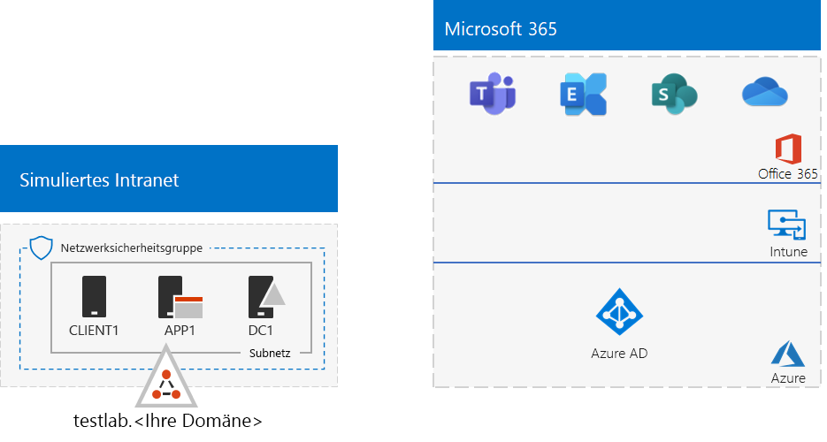
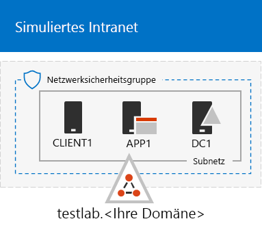
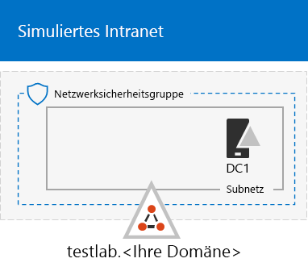
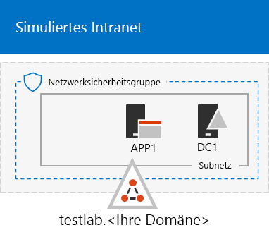

# <a name="the-simulated-enterprise-base-configuration"></a><span data-ttu-id="3fd06-103">Die simulierte Unternehmensstandardkonfiguration</span><span class="sxs-lookup"><span data-stu-id="3fd06-103">The simulated enterprise base configuration</span></span>

<span data-ttu-id="3fd06-104">*Diese Testumgebungsanleitung kann für Microsoft 365 Enterprise- und Office 365 Enterprise-Testumgebungen verwendet werden.*</span><span class="sxs-lookup"><span data-stu-id="3fd06-104">*This Test Lab Guide can be used for both Microsoft 365 Enterprise and Office 365 Enterprise test environments.*</span></span>

<span data-ttu-id="3fd06-105">Dieser Artikel bietet Schrittanleitungen zum Erstellen einer vereinfachten Umgebung für Microsoft 365 Enterprise, die Folgendes umfasst:</span><span class="sxs-lookup"><span data-stu-id="3fd06-105">This article provides you with step-by-step instructions to create a simplified environment for Microsoft 365 Enterprise that includes:</span></span>

- <span data-ttu-id="3fd06-106">Eine Testversion oder ein kostenpflichtiges Abonnement für Microsoft 365 E5.</span><span class="sxs-lookup"><span data-stu-id="3fd06-106">A Microsoft 365 E5 trial or paid subscription.</span></span>
- <span data-ttu-id="3fd06-107">Ein vereinfachtes Unternehmensintranet mit Internetzugriff, das aus drei virtuellen Computern in einem virtuellen Azure-Netzwerk (DC1, APP1 und CLIENT1) besteht.</span><span class="sxs-lookup"><span data-stu-id="3fd06-107">A simplified organization intranet connected to the Internet, consisting of three virtual machines on an Azure virtual network (DC1, APP1, and CLIENT1).</span></span>
 


<span data-ttu-id="3fd06-109">Sie können die resultierende Umgebung verwenden, um die Features und Funktionen von [Microsoft 365 Enterprise](https://www.microsoft.com/microsoft-365/enterprise) zu testen, mit zusätzlichen [Testumgebungsanleitungen](m365-enterprise-test-lab-guides.md) oder selbst.</span><span class="sxs-lookup"><span data-stu-id="3fd06-109">You can use the resulting environment to test the features and functionality of [Microsoft 365 Enterprise](https://www.microsoft.com/microsoft-365/enterprise) with additional [Test Lab Guides](m365-enterprise-test-lab-guides.md) or on your own.</span></span>


> [!TIP]
> <span data-ttu-id="3fd06-111">Klicken Sie [hier](../media/m365-enterprise-test-lab-guides/Microsoft365EnterpriseTLGStack.pdf), um eine visuelle Darstellung aller Artikel im Stapel der Testumgebungsanleitungen in Microsoft 365 Enterprise zu erhalten.</span><span class="sxs-lookup"><span data-stu-id="3fd06-111">Click [here](../media/m365-enterprise-test-lab-guides/Microsoft365EnterpriseTLGStack.pdf) for a visual map to all the articles in the Microsoft 365 Enterprise Test Lab Guide stack.</span></span>

## <a name="phase-1-create-a-simulated-intranet"></a><span data-ttu-id="3fd06-112">Phase 1: Erstellen eines simulierten Intranets</span><span class="sxs-lookup"><span data-stu-id="3fd06-112">Phase 1: Create a simulated intranet</span></span>

<span data-ttu-id="3fd06-113">In dieser Phase erstellen Sie ein simuliertes Intranet in den Azure-Infrastrukturdiensten, das einen Active Directory Domain Services(AD DS)-Domänencontroller, einen Anwendungsserver und einen Clientcomputer umfasst.</span><span class="sxs-lookup"><span data-stu-id="3fd06-113">In this phase, you build a simulated intranet in Azure infrastructure services that includes an Active Directory Domain Services (AD DS) domain controller, an application server, and a client computer.</span></span> 

<span data-ttu-id="3fd06-114">Sie verwenden diese Computer in zusätzlichen [Microsoft 365 Enterprise-Testumgebungsanleitungen](m365-enterprise-test-lab-guides.md), um Hybrid-Identitäten und andere Funktionen zu konfigurieren und zu demonstrieren.</span><span class="sxs-lookup"><span data-stu-id="3fd06-114">You'll use these computers in additional [Microsoft 365 Enterprise Test Lab Guides](m365-enterprise-test-lab-guides.md) to configure and demonstrate hybrid identity and other capabilities.</span></span>

### <a name="method-1-build-your-simulated-intranet-with-an-azure-resource-manager-template"></a><span data-ttu-id="3fd06-115">Methode 1: Erstellen eines simulierten Intranets mit einer Azure Ressourcenmanager-Vorlage</span><span class="sxs-lookup"><span data-stu-id="3fd06-115">Method 1: Build your simulated intranet with an Azure Resource Manager template</span></span>

<span data-ttu-id="3fd06-p101">Bei dieser Methode verwenden Sie eine Azure Resource Manager-Vorlage (ARM), um das simulierte Intranet auszubauen. ARM-Vorlagen enthalten alle Anweisungen zum Erstellen der Azure-Netzwerkinfrastruktur, die virtuellen Computer und die dazugehörige Konfiguration.</span><span class="sxs-lookup"><span data-stu-id="3fd06-p101">In this method, you use an Azure Resource Manager (ARM) template to build out the simulated intranet. ARM templates contain all of the instructions to create the Azure networking infrastructure, the virtual machines, and their configuration.</span></span>

<span data-ttu-id="3fd06-118">Lesen Sie vor der Bereitstellung der Vorlage die [Infodatei auf der Vorlagenseite](https://github.com/maxskunkworks/TLG/tree/master/tlg-base-config_3-vm.m365-ems) und halten Sie folgende Informationen bereit:</span><span class="sxs-lookup"><span data-stu-id="3fd06-118">Prior to deploying the template, read through the [template README page](https://github.com/maxskunkworks/TLG/tree/master/tlg-base-config_3-vm.m365-ems) and have the following information ready:</span></span>

- <span data-ttu-id="3fd06-p102">Der öffentliche DNS-Domänenname Ihrer Testumgebung (Testlabor.\<Ihre öffentlichen Domäne>). Sie müssen diesen Namen in das Feld **Domänenname** der Seite **Benutzerdefinierte Bereitstellung** einegben.</span><span class="sxs-lookup"><span data-stu-id="3fd06-p102">The public DNS domain name of your test environment (testlab.\<your public domain>). You’ll need to enter this name in the **Domain Name field** of the **Custom deployment** page.</span></span>
- <span data-ttu-id="3fd06-p103">Ein DNS-Präfix für die URLs der öffentlichen IP-Adressen Ihrer virtueller Computer. Sie müssen diese Bezeichnung in das Feld **DNS-Präfix** der Seite **Benutzerdefinierte Bereitstellung** eingeben.</span><span class="sxs-lookup"><span data-stu-id="3fd06-p103">A DNS label prefix for the URLs of the public IP addresses of your virtual machines. You’ll need to enter this label in the **Dns Label Prefix** field of the **Custom deployment** page.</span></span>

<span data-ttu-id="3fd06-123">Klicken Sie nach dem Lesen der Anweisungen auf **In Azure bereitstellen** in der [Infodatei auf der Vorlagenseite](https://github.com/maxskunkworks/TLG/tree/master/tlg-base-config_3-vm.m365-ems), um loszulegen.</span><span class="sxs-lookup"><span data-stu-id="3fd06-123">After reading through the instructions, click **Deploy to Azure** on the [template README page](https://github.com/maxskunkworks/TLG/tree/master/tlg-base-config_3-vm.m365-ems) to get started.</span></span>

>[!Note]
><span data-ttu-id="3fd06-124">Das anhand der ARM-Vorlage erstellte simulierte Intranet erfordert ein kostenpflichtiges Azure-Abonnement.</span><span class="sxs-lookup"><span data-stu-id="3fd06-124">The simulated intranet built by the ARM template requires a paid Azure subscription.</span></span>
>

<span data-ttu-id="3fd06-125">Hier finden Sie Ihre Konfiguration nach Abschluss der Vorlage.</span><span class="sxs-lookup"><span data-stu-id="3fd06-125">Here is your configuration after the template is complete.</span></span>



### <a name="method-2-build-your-simulated-intranet-with-azure-powershell"></a><span data-ttu-id="3fd06-127">Methode 2: Erstellen Ihres simulierten Intranets mit Azure PowerShell</span><span class="sxs-lookup"><span data-stu-id="3fd06-127">Method 2: Build your simulated intranet with Azure PowerShell</span></span>

<span data-ttu-id="3fd06-128">Bei dieser Methode verwenden Sie Windows PowerShell und das Azure PowerShell-Modul zum Erstellen der Netzwerkinfrastruktur, der virtuellen Computer und ihrer Konfiguration.</span><span class="sxs-lookup"><span data-stu-id="3fd06-128">In this method, you use Windows PowerShell and the Azure PowerShell module to build out the networking infrastructure, the virtual machines, and their configuration.</span></span>

<span data-ttu-id="3fd06-p104">Verwenden Sie diese Methode, wenn Sie Erfahrungen mit dem Erstellen von Elementen der Azure-Infrastruktur für jeden einzelnen Schritt mit PowerShell sammeln möchten. Sie können dann die PowerShell-Befehlsblöcke für eine eigene Bereitstellung von anderen virtuellen Computern in Azure anpassen.</span><span class="sxs-lookup"><span data-stu-id="3fd06-p104">Use this method if you want to get experience creating elements of Azure infrastructure one step at a time with PowerShell. You can then customize the PowerShell command blocks for your own deployment of other virtual machines in Azure.</span></span>

#### <a name="step-1-create-dc1"></a><span data-ttu-id="3fd06-131">Phase 1: Erstellen von DC1</span><span class="sxs-lookup"><span data-stu-id="3fd06-131">Step 1: Create DC1</span></span>

<span data-ttu-id="3fd06-132">In dieser Phase erstellen wir ein virtuelles Azure-Netzwerk und fügen DC1 hinzu, einen virtuellen Computer, der ein Domänencontroller für eine AD DS-Domäne ist.</span><span class="sxs-lookup"><span data-stu-id="3fd06-132">In this step, we create an Azure virtual network and add DC1, a virtual machine that is a domain controller for an AD DS domain.</span></span>

<span data-ttu-id="3fd06-133">Starten Sie zunächst eine Windows PowerShell-Eingabeaufforderung auf dem lokalen Computer.</span><span class="sxs-lookup"><span data-stu-id="3fd06-133">First, start a Windows PowerShell command prompt on your local computer.</span></span>
  
> [!NOTE]
> <span data-ttu-id="3fd06-p105">In den folgenden Befehlssätzen wird die aktuelle Version von Azure PowerShell verwendet. Informationen dazu finden Sie unter [Get started with Azure PowerShell cmdlets](https://docs.microsoft.com/powershell/azureps-cmdlets-docs/).</span><span class="sxs-lookup"><span data-stu-id="3fd06-p105">The following command sets use the latest version of Azure PowerShell. See [Get started with Azure PowerShell cmdlets](https://docs.microsoft.com/powershell/azureps-cmdlets-docs/).</span></span> 
  
<span data-ttu-id="3fd06-136">Melden Sie sich mit dem folgenden Befehl bei Ihrem Azure-Konto an.</span><span class="sxs-lookup"><span data-stu-id="3fd06-136">Sign in to your Azure account with the following command.</span></span>
  
```powershell
Connect-AzAccount
```

<span data-ttu-id="3fd06-137">Rufen Sie den Namen Ihres Abonnements mithilfe des folgenden Befehls ab.</span><span class="sxs-lookup"><span data-stu-id="3fd06-137">Get your subscription name using the following command.</span></span>
  
```powershell
Get-AzSubscription | Sort Name | Select Name
```

<span data-ttu-id="3fd06-p106">Legen Sie Ihr Azure-Abonnement fest. Ersetzen Sie alles innerhalb der Anführungszeichen, einschließlich der Zeichen „<“ und „>“, durch den entsprechenden Namen.</span><span class="sxs-lookup"><span data-stu-id="3fd06-p106">Set your Azure subscription. Replace everything within the quotes, including the < and > characters, with the correct name.</span></span>
  
```powershell
$subscr="<subscription name>"
Get-AzSubscription -SubscriptionName $subscr | Select-AzSubscription
```

<span data-ttu-id="3fd06-p107">Im nächsten Schritt wird eine neue Ressourcengruppe für Ihr simuliertes Unternehmenstestlabor erstellt. Verwenden Sie zum Ermitteln eines eindeutigen Ressourcengruppennamens diesen Befehl, mit dem die vorhandenen Ressourcengruppen aufgeführt werden.</span><span class="sxs-lookup"><span data-stu-id="3fd06-p107">Next, create a new resource group for your simulated enterprise test lab. To determine a unique resource group name, use this command to list your existing resource groups.</span></span>
  
```powershell
Get-AzResourceGroup | Sort ResourceGroupName | Select ResourceGroupName
```

<span data-ttu-id="3fd06-p108">Erstellen Sie die neue Ressourcengruppe mit diesen Befehlen. Ersetzen Sie alles innerhalb der Anführungszeichen, einschließlich der Zeichen „<“ und „>“, durch die entsprechenden Namen.</span><span class="sxs-lookup"><span data-stu-id="3fd06-p108">Create your new resource group with these commands. Replace everything within the quotes, including the < and > characters, with the correct names.</span></span>
  
```powershell
$rgName="<resource group name>"
$locName="<location name, such as West US>"
New-AzResourceGroup -Name $rgName -Location $locName
```

<span data-ttu-id="3fd06-p109">Als Nächstes erstellen Sie das virtuelle Netzwerk „TestLab“, in dem das Corpnet-Subnetz der simulierten Unternehmensumgebung gehostet und mit einer Netzwerksicherheitsgruppe geschützt wird. Tragen Sie den Namen Ihrer Ressourcengruppe ein, und führen Sie diese Befehle an der PowerShell-Eingabeaufforderung auf dem lokalen Computer aus.</span><span class="sxs-lookup"><span data-stu-id="3fd06-p109">Next, you create the TestLab virtual network that will host the Corpnet subnet of the simulated enterprise environment and protect it with a network security group. Fill in the name of your resource group and run these commands at the PowerShell command prompt on your local computer.</span></span>
  
```powershell
$rgName="<name of your new resource group>"
$locName=(Get-AzResourceGroup -Name $rgName).Location
$corpnetSubnet=New-AzVirtualNetworkSubnetConfig -Name Corpnet -AddressPrefix 10.0.0.0/24
New-AzVirtualNetwork -Name TestLab -ResourceGroupName $rgName -Location $locName -AddressPrefix 10.0.0.0/8 -Subnet $corpnetSubnet -DNSServer 10.0.0.4
$rule1=New-AzNetworkSecurityRuleConfig -Name "RDPTraffic" -Description "Allow RDP to all VMs on the subnet" -Access Allow -Protocol Tcp -Direction Inbound -Priority 100 -SourceAddressPrefix Internet -SourcePortRange * -DestinationAddressPrefix * -DestinationPortRange 3389
New-AzNetworkSecurityGroup -Name Corpnet -ResourceGroupName $rgName -Location $locName -SecurityRules $rule1
$vnet=Get-AzVirtualNetwork -ResourceGroupName $rgName -Name TestLab
$nsg=Get-AzNetworkSecurityGroup -Name Corpnet -ResourceGroupName $rgName
Set-AzVirtualNetworkSubnetConfig -VirtualNetwork $vnet -Name Corpnet -AddressPrefix "10.0.0.0/24" -NetworkSecurityGroup $nsg
$vnet | Set-AzVirtualNetwork
```

<span data-ttu-id="3fd06-146">Als Nächstes erstellen Sie den virtuellen DC1-Computer und konfigurieren ihn als einen Domänencontroller für **testlab.**\<Ihre öffentliche Domäne> AD DS-Domäne und einen DNS-Server für die virtuellen Computer des virtuellen Netzwerks TestLab.</span><span class="sxs-lookup"><span data-stu-id="3fd06-146">Next, you create the DC1 virtual machine and configure it as a domain controller for the **testlab.**\<your public domain> AD DS domain and a DNS server for the virtual machines of the TestLab virtual network.</span></span> <span data-ttu-id="3fd06-147">Wenn der Name der öffentlichen Domäne **<span>contoso</span>.com** ist, ist die virtuelle Maschine DC1 ein Domänencontroller für die Domäne **<span>testlab</span>.contoso.com**.</span><span class="sxs-lookup"><span data-stu-id="3fd06-147">For example, if your public domain name is **<span>contoso</span>.com**, the DC1 virtual machine will be a domain controller for the **<span>testlab</span>.contoso.com** domain.</span></span>
  
<span data-ttu-id="3fd06-148">Geben Sie zum Erstellen eines virtuellen Azure-Computers für DC1 den Namen Ihrer Ressourcengruppe ein, und führen Sie über die PowerShell-Eingabeaufforderung auf Ihrem lokalen Computer die nachfolgenden Befehle aus.</span><span class="sxs-lookup"><span data-stu-id="3fd06-148">To create an Azure virtual machine for DC1, fill in the name of your resource group and run these commands at the PowerShell command prompt on your local computer.</span></span>
  
```powershell
$rgName="<resource group name>"
$locName=(Get-AzResourceGroup -Name $rgName).Location
$vnet=Get-AzVirtualNetwork -Name TestLab -ResourceGroupName $rgName
$pip=New-AzPublicIpAddress -Name DC1-PIP -ResourceGroupName $rgName -Location $locName -AllocationMethod Dynamic
$nic=New-AzNetworkInterface -Name DC1-NIC -ResourceGroupName $rgName -Location $locName -SubnetId $vnet.Subnets[0].Id -PublicIpAddressId $pip.Id -PrivateIpAddress 10.0.0.4
$vm=New-AzVMConfig -VMName DC1 -VMSize Standard_A2_V2
$cred=Get-Credential -Message "Type the name and password of the local administrator account for DC1."
$vm=Set-AzVMOperatingSystem -VM $vm -Windows -ComputerName DC1 -Credential $cred -ProvisionVMAgent -EnableAutoUpdate
$vm=Set-AzVMSourceImage -VM $vm -PublisherName MicrosoftWindowsServer -Offer WindowsServer -Skus 2016-Datacenter -Version "latest"
$vm=Add-AzVMNetworkInterface -VM $vm -Id $nic.Id
$vm=Set-AzVMOSDisk -VM $vm -Name "DC1-OS" -DiskSizeInGB 128 -CreateOption FromImage
$diskConfig=New-AzDiskConfig -AccountType "Standard_LRS" -Location $locName -CreateOption Empty -DiskSizeGB 20
$dataDisk1=New-AzDisk -DiskName "DC1-DataDisk1" -Disk $diskConfig -ResourceGroupName $rgName
$vm=Add-AzVMDataDisk -VM $vm -Name "DC1-DataDisk1" -CreateOption Attach -ManagedDiskId $dataDisk1.Id -Lun 1
New-AzVM -ResourceGroupName $rgName -Location $locName -VM $vm
```

<span data-ttu-id="3fd06-p111">Sie werden nach einem Benutzernamen und Kennwort für das lokale Administratorkonto auf DC1 gefragt. Verwenden Sie ein sicheres Kennwort, und notieren Sie den Namen und das Kennwort an einem sicheren Ort.</span><span class="sxs-lookup"><span data-stu-id="3fd06-p111">You will be prompted for a user name and password for the local administrator account on DC1. Use a strong password and record both the name and password in a secure location.</span></span>
  
<span data-ttu-id="3fd06-151">Stellen Sie dann eine Verbindung mit dem virtuellen Computer DC1 her.</span><span class="sxs-lookup"><span data-stu-id="3fd06-151">Next, connect to the DC1 virtual machine.</span></span>
  
1. <span data-ttu-id="3fd06-152">Klicken Sie im [Azure-Portal](https://portal.azure.com) auf **Ressourcengruppen >** [Name der neuen Ressourcengruppe] **> DC1 > Verbinden**.</span><span class="sxs-lookup"><span data-stu-id="3fd06-152">In the [Azure portal](https://portal.azure.com), click **Resource Groups >** [the name of your new resource group] **> DC1 > Connect**.</span></span>
    
2. <span data-ttu-id="3fd06-p112">Klicken Sie im Bereich „Öffnen“ auf  **RDP-Datei herunterladen**. Öffnen Sie die Datei „DC1.rdp“, die heruntergeladen wird, und klicken Sie dann auf **Verbinden**.</span><span class="sxs-lookup"><span data-stu-id="3fd06-p112">In the open pane, click **Download RDP file**. Open the DC1.rdp file that is downloaded, and then click **Connect**.</span></span>
    
3. <span data-ttu-id="3fd06-155">Geben Sie den Namen des lokalen DC1-Administratorkontos an:</span><span class="sxs-lookup"><span data-stu-id="3fd06-155">Specify the DC1 local administrator account name:</span></span>
    
   - <span data-ttu-id="3fd06-156">Für Windows 7:</span><span class="sxs-lookup"><span data-stu-id="3fd06-156">For Windows 7:</span></span>
    
     <span data-ttu-id="3fd06-p113">Klicken Sie im Dialogfeld **Windows-Sicherheit** auf **Anderes Konto verwenden**. Geben Sie unter **Benutzername** den Namen **DC1\\**[Kontoname des lokalen Administrators] ein.</span><span class="sxs-lookup"><span data-stu-id="3fd06-p113">In the **Windows Security** dialog box, click **Use another account**. In **User name**, type **DC1\\**[Local administrator account name].</span></span>
    
   - <span data-ttu-id="3fd06-159">Für Windows 8 oder Windows 10:</span><span class="sxs-lookup"><span data-stu-id="3fd06-159">For Windows 8 or Windows 10:</span></span>
    
     <span data-ttu-id="3fd06-p114">Klicken Sie im Dialogfeld **Windows-Sicherheit** auf **Weitere Optionen**, und klicken Sie dann auf **Anderes Konto verwenden**. Geben Sie unter **Benutzername** den Namen **DC1\\**[Kontoname des lokalen Administrators] ein.</span><span class="sxs-lookup"><span data-stu-id="3fd06-p114">In the **Windows Security** dialog box, click **More choices**, and then click **Use a different account**. In **User name**, type **DC1\\**[Local administrator account name].</span></span>
    
4. <span data-ttu-id="3fd06-162">Geben Sie unter **Kennwort** das Kennwort des lokalen Administratorkontos ein, und klicken Sie dann auf **OK**.</span><span class="sxs-lookup"><span data-stu-id="3fd06-162">In **Password**, type the password of the local administrator account, and then click **OK**.</span></span>
    
5. <span data-ttu-id="3fd06-163">Klicken Sie auf **Ja**, wenn Sie dazu aufgefordert werden.</span><span class="sxs-lookup"><span data-stu-id="3fd06-163">When prompted, click **Yes**.</span></span>
    
<span data-ttu-id="3fd06-164">Im nächsten Schritt führen Sie diesen Befehl über eine Windows PowerShell-Eingabeaufforderung mit Administratorrechten auf DC1 aus, um ein zusätzliches Datenlaufwerk als neues Volume mit dem Laufwerkbuchstaben „F:" hinzuzufügen.</span><span class="sxs-lookup"><span data-stu-id="3fd06-164">Next, add an extra data disk as a new volume with the drive letter F: with this command at an administrator-level Windows PowerShell command prompt on DC1.</span></span>
  
```powershell
Get-Disk | Where PartitionStyle -eq "RAW" | Initialize-Disk -PartitionStyle MBR -PassThru | New-Partition -AssignDriveLetter -UseMaximumSize | Format-Volume -FileSystem NTFS -NewFileSystemLabel "WSAD Data"
```

<span data-ttu-id="3fd06-p115">Konfigurieren Sie als Nächstes DC1 als Domänencontroller und DNS-Server für die Domäne **testlab.**\<Ihr öffentlicher Domänenname>. Geben Sie Ihren öffentlichen Domänennamen an, entfernen Sie die Zeichen \< und „>“, und führen Sie die folgenden Befehle an einer Windows PowerShell-Eingabeaufforderung auf Administratorebene auf DC1 aus.</span><span class="sxs-lookup"><span data-stu-id="3fd06-p115">Next, configure DC1 as a domain controller and DNS server for the **testlab.**\<your public domain> domain. Specify your public domain name, remove the \< and > characters, and then run these commands at an administrator-level Windows PowerShell command prompt on DC1.</span></span>
  
```powershell
$yourDomain="<your public domain>"
Install-WindowsFeature AD-Domain-Services -IncludeManagementTools
Install-ADDSForest -DomainName testlab.$yourDomain -DatabasePath "F:\NTDS" -SysvolPath "F:\SYSVOL" -LogPath "F:\Logs"
```
<span data-ttu-id="3fd06-p116">Sie müssen ein Administratorkennwort für den abgesicherten Modus angeben. Bewahren Sie das Kennwort an einem sicheren Ort auf.</span><span class="sxs-lookup"><span data-stu-id="3fd06-p116">You will need to specify a safe mode administrator password. Store this password in a secure location.</span></span>
  
<span data-ttu-id="3fd06-169">Beachten Sie, dass der Abschluss dieser Befehle ein paar Minuten in Anspruch nehmen kann.</span><span class="sxs-lookup"><span data-stu-id="3fd06-169">Note that these commands can take a few minutes to complete.</span></span>
  
<span data-ttu-id="3fd06-170">Stellen Sie nach dem Neustart von DC1 wieder eine Verbindung zum virtuellen DC1-Computer her.</span><span class="sxs-lookup"><span data-stu-id="3fd06-170">After DC1 restarts, reconnect to the DC1 virtual machine.</span></span>
  
1. <span data-ttu-id="3fd06-171">Klicken Sie im [Azure-Portal](https://portal.azure.com) auf **Ressourcengruppen >** [Ihre Ressourcengruppe] **> DC1 > Verbinden**.</span><span class="sxs-lookup"><span data-stu-id="3fd06-171">In the [Azure portal](https://portal.azure.com), click **Resource Groups >** [your resource group name] **> DC1 > Connect**.</span></span>
    
2. <span data-ttu-id="3fd06-172">Führen Sie die Datei „DC1.rdp“ aus, die heruntergeladen wurde, und klicken Sie dann auf **Verbinden**.</span><span class="sxs-lookup"><span data-stu-id="3fd06-172">Run the DC1.rdp file that is downloaded, and then click **Connect**.</span></span>
    
3. <span data-ttu-id="3fd06-p117">Klicken Sie unter **Windows-Sicherheit** auf **Anderes Konto verwenden**. Geben Sie unter **Benutzername** den Namen **TESTLAB\\**[Kontoname des lokalen Administrators] ein.</span><span class="sxs-lookup"><span data-stu-id="3fd06-p117">In **Windows Security**, click **Use another account**. In **User name**, type **TESTLAB\\**[Local administrator account name].</span></span>
    
4. <span data-ttu-id="3fd06-175">Geben Sie unter **Kennwort** das Kennwort des lokalen Administratorkontos ein, und klicken Sie dann auf **OK**.</span><span class="sxs-lookup"><span data-stu-id="3fd06-175">In **Password**, type the password of the local administrator account, and then click **OK**.</span></span>
    
5. <span data-ttu-id="3fd06-176">Klicken Sie auf **Ja**, wenn Sie dazu aufgefordert werden.</span><span class="sxs-lookup"><span data-stu-id="3fd06-176">When prompted, click **Yes**.</span></span>
    
<span data-ttu-id="3fd06-p118">Im nächsten Schritt erstellen Sie ein Benutzerkonto in Active Directory, das bei der Anmeldung an Mitgliedscomputern der Domäne TESTLAB verwendet wird. Führen Sie diesen Befehl an einer Windows PowerShell-Eingabeaufforderung auf Administratorebene aus.</span><span class="sxs-lookup"><span data-stu-id="3fd06-p118">Next, create a user account in Active Directory that will be used when logging in to TESTLAB domain member computers. Run this command at an administrator-level Windows PowerShell command prompt.</span></span>
  
```powershell
New-ADUser -SamAccountName User1 -AccountPassword (read-host "Set user password" -assecurestring) -name "User1" -enabled $true -PasswordNeverExpires $true -ChangePasswordAtLogon $false
```

<span data-ttu-id="3fd06-p119">Beachten Sie, dass Sie von dem Befehl aufgefordert werden, das Kennwort des Kontos „Benutzer1“ anzugeben. Da dieses Konto für Remotedesktopverbindungen für alle Mitgliedscomputer der Domäne TESTLAB verwendet wird, sollten Sie ein sicheres Kennwort wählen. Notieren Sie das Kennwort des Kontos „Benutzer1“, und bewahren Sie es an einem sicheren Ort auf.</span><span class="sxs-lookup"><span data-stu-id="3fd06-p119">Note that this command prompts you to supply the User1 account password. Because this account will be used for remote desktop connections for all TESTLAB domain member computers, choose a strong password. Record the User1 account password and store it in a secured location.</span></span>
  
<span data-ttu-id="3fd06-p120">Konfigurieren Sie als Nächstes das neue Konto „Benutzer1“ als Domänen-, Unternehmens- und Schemaadministrator aus. Führen Sie diesen Befehl an der Windows PowerShell-Eingabeaufforderung auf Administratorebene aus.</span><span class="sxs-lookup"><span data-stu-id="3fd06-p120">Next, configure the new User1 account as a domain, enterprise, and schema administrator. Run this command at the administrator-level Windows PowerShell command prompt.</span></span>
  
```powershell
$yourDomain="<your public domain>"
$domainName = "testlab."+$yourDomain
$userName="user1@" + $domainName
$userSID=(New-Object System.Security.Principal.NTAccount($userName)).Translate([System.Security.Principal.SecurityIdentifier]).Value
$groupNames=@("Domain Admins","Enterprise Admins","Schema Admins")
ForEach ($name in $groupNames) {Add-ADPrincipalGroupMembership -Identity $userSID -MemberOf (Get-ADGroup -Identity $name).SID.Value}
```

<span data-ttu-id="3fd06-184">Schließen Sie die Remotedesktopsitzung mit DC1, und stellen Sie dann mit dem Konto „TESTLAB\\Benutzer1“ wieder eine Verbindung her.</span><span class="sxs-lookup"><span data-stu-id="3fd06-184">Close the Remote Desktop session with DC1 and then reconnect using the TESTLAB\\User1 account.</span></span>
  
<span data-ttu-id="3fd06-185">Führen Sie als Nächstes den folgenden Befehl an einer Windows PowerShell-Eingabeaufforderung auf Administratorebene aus, um Datenverkehr für das Tool Ping zuzulassen.</span><span class="sxs-lookup"><span data-stu-id="3fd06-185">Next, to allow traffic for the Ping tool, run this command at an administrator-level Windows PowerShell command prompt.</span></span>
  
```powershell
Set-NetFirewallRule -DisplayName "File and Printer Sharing (Echo Request - ICMPv4-In)" -enabled True
```

<span data-ttu-id="3fd06-186">Dies ist Ihre aktuelle Konfiguration.</span><span class="sxs-lookup"><span data-stu-id="3fd06-186">This is your current configuration.</span></span>
  

  
#### <a name="step-2-configure-app1"></a><span data-ttu-id="3fd06-188">Schritt 2: Konfigurieren von APP1</span><span class="sxs-lookup"><span data-stu-id="3fd06-188">Step 2: Configure APP1</span></span>

<span data-ttu-id="3fd06-189">In diesem Schritt erstellen und konfigurieren Sie APP1, ein Anwendungsserver, der zunächst Web- und Dateifreigabedienste bereitstellt.</span><span class="sxs-lookup"><span data-stu-id="3fd06-189">In this step, you create and configure APP1, which is an application server that initially provides web and file sharing services.</span></span>

<span data-ttu-id="3fd06-190">Geben Sie zum Erstellen eines virtuellen Azure-Computers für APP1 den Namen Ihrer Ressourcengruppe ein, und führen Sie über die Eingabeaufforderung auf Ihrem lokalen Computer die nachfolgenden Befehle aus.</span><span class="sxs-lookup"><span data-stu-id="3fd06-190">To create an Azure Virtual Machine for APP1, fill in the name of your resource group and run these commands at the  command prompt on your local computer.</span></span>
  
```powershell
$rgName="<resource group name>"
$locName=(Get-AzResourceGroup -Name $rgName).Location
$vnet=Get-AzVirtualNetwork -Name TestLab -ResourceGroupName $rgName
$pip=New-AzPublicIpAddress -Name APP1-PIP -ResourceGroupName $rgName -Location $locName -AllocationMethod Dynamic
$nic=New-AzNetworkInterface -Name APP1-NIC -ResourceGroupName $rgName -Location $locName -SubnetId $vnet.Subnets[0].Id -PublicIpAddressId $pip.Id
$vm=New-AzVMConfig -VMName APP1 -VMSize Standard_A2_V2
$cred=Get-Credential -Message "Type the name and password of the local administrator account for APP1."
$vm=Set-AzVMOperatingSystem -VM $vm -Windows -ComputerName APP1 -Credential $cred -ProvisionVMAgent -EnableAutoUpdate
$vm=Set-AzVMSourceImage -VM $vm -PublisherName MicrosoftWindowsServer -Offer WindowsServer -Skus 2016-Datacenter -Version "latest"
$vm=Add-AzVMNetworkInterface -VM $vm -Id $nic.Id
$vm=Set-AzVMOSDisk -VM $vm -Name "APP1-OS" -DiskSizeInGB 128 -CreateOption FromImage
New-AzVM -ResourceGroupName $rgName -Location $locName -VM $vm
```

<span data-ttu-id="3fd06-191">Im nächsten Schritt stellen Sie eine Verbindung mit dem virtuellen Computer APP1 mit dem Kontonamen und Kennwort des lokalen Administratorkontos von APP1 her und öffnen dann eine Windows PowerShell-Eingabeaufforderung.</span><span class="sxs-lookup"><span data-stu-id="3fd06-191">Next, connect to the APP1 virtual machine using the APP1 local administrator account name and password, and then open a Windows PowerShell command prompt.</span></span>
  
<span data-ttu-id="3fd06-192">Führen Sie zum Überprüfen der Namensauflösung und der Netzwerkkommunikation zwischen APP1 und DC1 den Befehl **ping dc1.testlab.**\<Ihr öffentlicher Domänenname> aus, und vergewissern Sie sich, dass vier Antworten vorhanden sind.</span><span class="sxs-lookup"><span data-stu-id="3fd06-192">To check name resolution and network communication between APP1 and DC1, run the **ping dc1.testlab.**\<your public domain name> command and verify that there are four replies.</span></span>
  
<span data-ttu-id="3fd06-193">Verknüpfen Sie als Nächstes unter Verwendung der folgenden Befehle an der Windows PowerShell-Eingabeaufforderung den virtuellen Computer APP1 mit der Domäne TESTLAB.</span><span class="sxs-lookup"><span data-stu-id="3fd06-193">Next, join the APP1 virtual machine to the TESTLAB domain with these commands at the Windows PowerShell prompt.</span></span>
  
```powershell
$yourDomain="<your public domain name>"
Add-Computer -DomainName ("testlab." + $yourDomain)
Restart-Computer
```

<span data-ttu-id="3fd06-194">Beachten Sie, dass Sie nach der Ausführung des Befehls **Add-Computer** die Anmeldeinformationen für das Domänenkonto „TESTLAB\\Benutzer1“ eingeben müssen.</span><span class="sxs-lookup"><span data-stu-id="3fd06-194">Note that you must supply the TESTLAB\\User1 domain account credentials after running the **Add-Computer** command.</span></span>
  
<span data-ttu-id="3fd06-195">Stellen Sie nach dem Neustart von APP1 eine Verbindung über das Konto „TESLAB\\Benutzer1“ damit her, und öffnen Sie dann eine Windows PowerShell-Eingabeaufforderung auf Administratorebene.</span><span class="sxs-lookup"><span data-stu-id="3fd06-195">After APP1 restarts, connect to it using the TESTLAB\\User1 account, and then open an administrator-level Windows PowerShell command prompt.</span></span>
  
<span data-ttu-id="3fd06-196">Im nächsten Schritt richten Sie APP1 mit dem folgenden Befehl in der Windows PowerShell-Eingabeaufforderung auf Administratorebene auf APP1 als Webserver ein.</span><span class="sxs-lookup"><span data-stu-id="3fd06-196">Next, make APP1 a web server with this command at an administrator-level Windows PowerShell command prompt on APP1.</span></span>
  
```powershell
Install-WindowsFeature Web-WebServer -IncludeManagementTools
```

<span data-ttu-id="3fd06-197">Erstellen Sie als Nächstes einen freigegebenen Ordner und eine Textdatei innerhalb des Ordners auf APP1 mit diesen PowerShell-Befehlen.</span><span class="sxs-lookup"><span data-stu-id="3fd06-197">Next, create a shared folder and a text file within the folder on APP1 with these PowerShell commands.</span></span>
  
```powershell
New-Item -path c:\files -type directory
Write-Output "This is a shared file." | out-file c:\files\example.txt
New-SmbShare -name files -path c:\files -changeaccess TESTLAB\User1
```

<span data-ttu-id="3fd06-198">Dies ist Ihre aktuelle Konfiguration.</span><span class="sxs-lookup"><span data-stu-id="3fd06-198">This is your current configuration.</span></span>
  

  
#### <a name="step-3-configure-client1"></a><span data-ttu-id="3fd06-200">Schritt 3: Konfigurieren von CLIENT1</span><span class="sxs-lookup"><span data-stu-id="3fd06-200">Step 3: Configure CLIENT1</span></span>

<span data-ttu-id="3fd06-201">In diesem Schritt wird CLIENT1 erstellt und konfiguriert, der als typischer Laptop, als Tablet oder als Desktopcomputer im Intranet fungiert.</span><span class="sxs-lookup"><span data-stu-id="3fd06-201">In this step, you create and configure CLIENT1, which acts as a typical laptop, tablet, or desktop computer on the intranet.</span></span>

> [!NOTE]  
> <span data-ttu-id="3fd06-p121">Der folgende Befehlssatz erstellt CLIENT1 unter Windows Server 2016 Datacenter. Er gilt für alle Arten von Azure-Abonnements. Wenn Sie über ein Visual Studio-basiertes Azure-Abonnement verfügen, können Sie CLIENT1 unter Windows 10 mit dem [Azure-Portal](https://portal.azure.com) erstellen.</span><span class="sxs-lookup"><span data-stu-id="3fd06-p121">The following command set creates CLIENT1 running Windows Server 2016 Datacenter, which can be done for all types of Azure subscriptions. If you have a Visual Studio-based Azure subscription, you can create CLIENT1 running Windows 10 with the [Azure portal](https://portal.azure.com).</span></span> 
  
<span data-ttu-id="3fd06-204">Geben Sie zum Erstellen eines virtuellen Azure-Computers für CLIENT1 den Namen Ihrer Ressourcengruppe ein, und führen Sie über die Eingabeaufforderung auf Ihrem lokalen Computer die nachfolgenden Befehle aus.</span><span class="sxs-lookup"><span data-stu-id="3fd06-204">To create an Azure Virtual Machine for CLIENT1, fill in the name of your resource group and run these commands at the  command prompt on your local computer.</span></span>
  
```powershell
$rgName="<resource group name>"
$locName=(Get-AzResourceGroup -Name $rgName).Location
$vnet=Get-AzVirtualNetwork -Name TestLab -ResourceGroupName $rgName
$pip=New-AzPublicIpAddress -Name CLIENT1-PIP -ResourceGroupName $rgName -Location $locName -AllocationMethod Dynamic
$nic=New-AzNetworkInterface -Name CLIENT1-NIC -ResourceGroupName $rgName -Location $locName -SubnetId $vnet.Subnets[0].Id -PublicIpAddressId $pip.Id
$vm=New-AzVMConfig -VMName CLIENT1 -VMSize Standard_A2_V2
$cred=Get-Credential -Message "Type the name and password of the local administrator account for CLIENT1."
$vm=Set-AzVMOperatingSystem -VM $vm -Windows -ComputerName CLIENT1 -Credential $cred -ProvisionVMAgent -EnableAutoUpdate
$vm=Set-AzVMSourceImage -VM $vm -PublisherName MicrosoftWindowsServer -Offer WindowsServer -Skus 2016-Datacenter -Version "latest"
$vm=Add-AzVMNetworkInterface -VM $vm -Id $nic.Id
$vm=Set-AzVMOSDisk -VM $vm -Name "CLIENT1-OS" -DiskSizeInGB 128 -CreateOption FromImage
New-AzVM -ResourceGroupName $rgName -Location $locName -VM $vm
```

<span data-ttu-id="3fd06-205">Im nächsten Schritt stellen Sie eine Verbindung mit dem virtuellen Computer CLIENT1 mit dem Kontonamen und Kennwort des lokalen Administratorkontos von CLIENT1 her und öffnen dann eine Windows PowerShell-Eingabeaufforderung auf Administratorebene.</span><span class="sxs-lookup"><span data-stu-id="3fd06-205">Next, connect to the CLIENT1 virtual machine using the CLIENT1 local administrator account name and password, and then open an administrator-level Windows PowerShell command prompt.</span></span>
  
<span data-ttu-id="3fd06-206">Führen Sie zum Überprüfen der Namensauflösung und der Netzwerkkommunikation zwischen CLIENT1 und DC1 den Befehl **ping dc1.testlab.**\<Ihr öffentlicher Domänenname> an einer Windows PowerShell-Eingabeaufforderung aus, und vergewissern Sie sich, dass vier Antworten vorhanden sind.</span><span class="sxs-lookup"><span data-stu-id="3fd06-206">To check name resolution and network communication between CLIENT1 and DC1, run the **ping dc1.testlab.**\<your public domain name> command at a Windows PowerShell command prompt and verify that there are four replies.</span></span>
  
<span data-ttu-id="3fd06-207">Verknüpfen Sie als Nächstes unter Verwendung der folgenden Befehle an der Windows PowerShell-Eingabeaufforderung den virtuellen Computer CLIENT1 mit der Domäne TESTLAB.</span><span class="sxs-lookup"><span data-stu-id="3fd06-207">Next, join the CLIENT1 virtual machine to the TESTLAB domain with these commands at the Windows PowerShell prompt.</span></span>
  
```powershell
$yourDomain="<your public domain name>"
Add-Computer -DomainName ("testlab." + $yourDomain)
Restart-Computer
```

<span data-ttu-id="3fd06-208">Beachten Sie, dass Sie nach der Ausführung des Befehls **Add-Computer** die Anmeldeinformationen für das Domänenkonto „TESTLAB\\Benutzer1“ eingeben müssen.</span><span class="sxs-lookup"><span data-stu-id="3fd06-208">Note that you must supply your TESTLAB\\User1 domain account credentials after running the **Add-Computer** command.</span></span>
  
<span data-ttu-id="3fd06-209">Stellen Sie nach dem Neustart von CLIENT1 eine Verbindung über den Kontonamen und das Kennwort von „TESTLAB\\Benutzer1“ damit her, und öffnen Sie dann eine Windows PowerShell-Eingabeaufforderung auf Administratorebene.</span><span class="sxs-lookup"><span data-stu-id="3fd06-209">After CLIENT1 restarts, connect to it using the TESTLAB\\User1 account name and password, and then open an administrator-level Windows PowerShell command prompt.</span></span>
  
<span data-ttu-id="3fd06-210">Überprüfen Sie im nächsten Schritt, ob Sie von CLIENT1 aus auf Web- und Dateifreigaberessourcen auf APP1 zugreifen können.</span><span class="sxs-lookup"><span data-stu-id="3fd06-210">Next, verify that you can access web and file share resources on APP1 from CLIENT1.</span></span>
  
1. <span data-ttu-id="3fd06-211">Klicken Sie im Server-Manager im Strukturbereich auf **Lokaler Server**.</span><span class="sxs-lookup"><span data-stu-id="3fd06-211">In Server Manager, in the tree pane, click **Local Server**.</span></span>
    
2. <span data-ttu-id="3fd06-212">Klicken Sie in **Eigenschaften für CLIENT1** neben **Verstärkte Sicherheitskonfiguration für IE** auf **Ein**.</span><span class="sxs-lookup"><span data-stu-id="3fd06-212">In **Properties for CLIENT1**, click **On** next to **IE Enhanced Security Configuration**.</span></span>
    
3. <span data-ttu-id="3fd06-213">Klicken Sie unter **Verstärkte Sicherheitskonfiguration für Internet Explorer** für **Administratoren** und für **Benutzer** auf **Aus**, und klicken Sie dann auf **OK**.</span><span class="sxs-lookup"><span data-stu-id="3fd06-213">In **Internet Explorer Enhanced Security Configuration**, click **Off** for **Administrators** and **Users**, and then click **OK**.</span></span>
    
4. <span data-ttu-id="3fd06-214">Klicken Sie auf dem Startbildschirm auf **Internet Explorer** und dann auf **OK**.</span><span class="sxs-lookup"><span data-stu-id="3fd06-214">From the Start screen, click **Internet Explorer**, and then click **OK**.</span></span>
    
5. <span data-ttu-id="3fd06-p122">Geben Sie in der Adressleiste **http<span>://</span>app1.testab.**\<Ihr öffentlicher Domänenname>**/** ein, und drücken Sie dann die EINGABETASTE. Nun sollte die standardmäßige Internetinformationsdienste-Webseite für APP1 angezeigt werden.</span><span class="sxs-lookup"><span data-stu-id="3fd06-p122">In the Address bar, type **http<span>://</span>app1.testab.**\<your public domain name>**/**, and then press ENTER. You should see the default Internet Information Services web page for APP1.</span></span>
    
6. <span data-ttu-id="3fd06-217">Klicken Sie auf der Desktop-Taskleiste auf das Symbol für den Datei-Explorer.</span><span class="sxs-lookup"><span data-stu-id="3fd06-217">From the desktop taskbar, click the File Explorer icon.</span></span>
    
7. <span data-ttu-id="3fd06-p123">Geben Sie in der Adressleiste **\\\\app1\\Files** ein, und drücken Sie dann die EINGABETASTE. Nun sollte ein Ordnerfenster mit dem Inhalt des freigegebenen Ordners „Files“ angezeigt werden.</span><span class="sxs-lookup"><span data-stu-id="3fd06-p123">In the address bar, type **\\\\app1\\Files**, and then press ENTER. You should see a folder window with the contents of the Files shared folder.</span></span>
    
8. <span data-ttu-id="3fd06-p124">Doppelklicken Sie im Fenster des freigegebenen Ordners **Files** auf die Datei **Example.txt**. Nun sollte der Inhalt der Datei „Example.txt“ angezeigt werden.</span><span class="sxs-lookup"><span data-stu-id="3fd06-p124">In the **Files** shared folder window, double-click the **Example.txt** file. You should see the contents of the Example.txt file.</span></span>
    
9. <span data-ttu-id="3fd06-222">Schließen Sie das Fenster **example.txt - Editor** und das Fenster des freigegebenen Ordners **Files**.</span><span class="sxs-lookup"><span data-stu-id="3fd06-222">Close the **example.txt - Notepad** and the **Files** shared folder windows.</span></span>
    
<span data-ttu-id="3fd06-223">Dies ist Ihre aktuelle Konfiguration.</span><span class="sxs-lookup"><span data-stu-id="3fd06-223">This is your current configuration.</span></span>
  


## <a name="phase-2-create-your-microsoft-365-e5-subscription"></a><span data-ttu-id="3fd06-225">Phase 2: Erstellen Ihres Abonnements für Microsoft 365 E5</span><span class="sxs-lookup"><span data-stu-id="3fd06-225">Phase 2: Create your Microsoft 365 E5 subscription</span></span>

<span data-ttu-id="3fd06-p125">In dieser Phase erstellen Sie ein neues Abonnement für Microsoft 365 E5, das einen neuen Azure AD-Mandanten verwendet, der von Ihrem Produktionsabonnement getrennt ist. Dies können Sie auf zwei Arten tun:</span><span class="sxs-lookup"><span data-stu-id="3fd06-p125">In this phase, you create a new Microsoft 365 E5 subscription that uses a new Azure AD tenant, one that is separate from your production subscription. You can do this in two ways:</span></span>

- <span data-ttu-id="3fd06-228">Verwenden Sie ein Testabonnement von Microsoft 365 E5.</span><span class="sxs-lookup"><span data-stu-id="3fd06-228">Use a trial subscription of Microsoft 365 E5.</span></span> 

  <span data-ttu-id="3fd06-p126">Das Testabonnement von Microsoft 365 E5 gilt für 30 Tage, die problemlos auf 60 Tage verlängert werden können. Wenn das Testabonnement abläuft, müssen Sie entweder zu einem kostenpflichtigen Abonnement wechseln oder eine neue Testversion erstellen. Durch Erstellen neuer Testabonnements müssen Sie Ihre Konfiguration verlassen, was im Hintergrund zu komplexen Szenarien führen kann.</span><span class="sxs-lookup"><span data-stu-id="3fd06-p126">The Microsoft 365 E5 trial subscription is 30 days, which can be easily extended to 60 days. When the trial subscription expires, you must either convert it to a paid subscription or create a new trial subscription. Creating new trial subscriptions means you will leave your configuration, which could include complex scenarios, behind.</span></span>  

- <span data-ttu-id="3fd06-232">Verwenden Sie ein separates Produktionsabonnement von Microsoft 365 E5 mit einer kleinen Anzahl von Lizenzen.</span><span class="sxs-lookup"><span data-stu-id="3fd06-232">Use a separate production subscription of Microsoft 365 E5 with a small number of licenses.</span></span>

  <span data-ttu-id="3fd06-p127">Dabei entstehen zusätzliche Kosten, aber es wird sichergestellt, dass Sie über eine funktionierende Testumgebung zum Testen von Features, Konfigurationen und Szenarien verfüge, die nicht abläuft. Sie können dieselbe Testumgebung über die gesamten Zeiträume für Machbarkeitsstudien, Demos für Mitarbeiter und Führungskräfte sowie für Anwendungsentwicklung und Tests verwenden. Dies ist die empfohlene Methode.</span><span class="sxs-lookup"><span data-stu-id="3fd06-p127">This is an additional cost, but ensures that you have a working test environment to try features, configurations, and scenarios that does not expire. You can use the same test environment over the long term for proofs of concept, demonstration to peers and management, and application development and testing. This is the recommended method.</span></span>

### <a name="sign-up-for-an-office-365-e5-trial-subscription"></a><span data-ttu-id="3fd06-236">Registrieren für ein Office 365 E5-Testabonnement</span><span class="sxs-lookup"><span data-stu-id="3fd06-236">Sign up for an Office 365 E5 trial subscription</span></span>

<span data-ttu-id="3fd06-237">Melden Sie sich über das Azure-Portal mit dem CORP\User1-Konto bei CLIENT1 an.</span><span class="sxs-lookup"><span data-stu-id="3fd06-237">Connect to CLIENT1 with the CORP\User1 account from the Azure portal.</span></span>

<span data-ttu-id="3fd06-238">Wenn Sie ein neues Office 365 E5-Testabonnement erstellen möchten, führen Sie die Anweisungen in [Phase 1](lightweight-base-configuration-microsoft-365-enterprise.md#phase-1-create-your-office-365-e5-subscription) der Testumgebungsanleitung zur einfachen Standardkonfiguration aus.</span><span class="sxs-lookup"><span data-stu-id="3fd06-238">To create a new Office 365 E5 trial subscription, perform the instructions in [Phase 1](lightweight-base-configuration-microsoft-365-enterprise.md#phase-1-create-your-office-365-e5-subscription) of the lightweight base configuration Test Lab Guide.</span></span>

<span data-ttu-id="3fd06-239">Wenn Sie Ihr neues Office 365 E5-Testabonnement konfigurieren möchten, führen Sie die Anweisungen in [Phase 2](lightweight-base-configuration-microsoft-365-enterprise.md#phase-2-configure-your-office-365-trial-subscription) der Testumgebungsanleitung zur einfachen Standardkonfiguration aus.</span><span class="sxs-lookup"><span data-stu-id="3fd06-239">To configure your new Office 365 E5 trial subscription, perform the instructions in [Phase 2](lightweight-base-configuration-microsoft-365-enterprise.md#phase-2-configure-your-office-365-trial-subscription) of the lightweight base configuration Test Lab Guide.</span></span>

#### <a name="using-an-office-365-e5-test-environment"></a><span data-ttu-id="3fd06-240">Verwenden einer Office 365 E5-Testumgebung</span><span class="sxs-lookup"><span data-stu-id="3fd06-240">Using an Office 365 E5 test environment</span></span>

<span data-ttu-id="3fd06-241">Wenn Sie nur eine Office 365-Testumgebung benötigen, sind Sie hier fertig.</span><span class="sxs-lookup"><span data-stu-id="3fd06-241">If all you need is an Office 365 test environment, you can stop here.</span></span> 

<span data-ttu-id="3fd06-242">Weitere Testumgebungsanleitungen, die sowohl für Office 365 als auch für Microsoft 365 gelten, finden Sie unter [Microsoft 365 Enterprise-Testumgebungsanleitungen](m365-enterprise-test-lab-guides.md).</span><span class="sxs-lookup"><span data-stu-id="3fd06-242">See [Microsoft 365 Enterprise Test Lab Guides](m365-enterprise-test-lab-guides.md) for additional Test Lab Guides that apply to both Office 365 and Microsoft 365.</span></span>

### <a name="add-a-microsoft-365-e5-trial-subscription"></a><span data-ttu-id="3fd06-243">Hinzufügen eines Testabonnements für Microsoft 365 E5</span><span class="sxs-lookup"><span data-stu-id="3fd06-243">Add a Microsoft 365 E5 trial subscription</span></span>

<span data-ttu-id="3fd06-244">Um ein Microsoft 365 E5-Testabonnement zu testen und Ihre Benutzerkonten mit Lizenzen zu konfigurieren, führen Sie die Anweisungen in [Phase 3](lightweight-base-configuration-microsoft-365-enterprise.md#phase-3-add-a-microsoft-365-e5-trial-subscription) der Testumgebungsanleitung zur einfachen Standardkonfiguration aus.</span><span class="sxs-lookup"><span data-stu-id="3fd06-244">To a Microsoft 365 E5 trial subscription and configure your users accounts with licenses, perform the instructions in [Phase 3](lightweight-base-configuration-microsoft-365-enterprise.md#phase-3-add-a-microsoft-365-e5-trial-subscription) of the lightweight base configuration Test Lab Guide.</span></span>

  
## <a name="results"></a><span data-ttu-id="3fd06-245">Ergebnisse</span><span class="sxs-lookup"><span data-stu-id="3fd06-245">Results</span></span>

<span data-ttu-id="3fd06-246">Ihre Testumgebung verfügt nun über Folgendes:</span><span class="sxs-lookup"><span data-stu-id="3fd06-246">Your test environment now has:</span></span>
  
- <span data-ttu-id="3fd06-247">Ein Testabonnement für Microsoft 365 E5.</span><span class="sxs-lookup"><span data-stu-id="3fd06-247">Microsoft 365 E5 trial subscription.</span></span>
- <span data-ttu-id="3fd06-248">Alle entsprechenden Benutzerkonten sind für die Verwendung von Microsoft 365 E5 aktiviert.</span><span class="sxs-lookup"><span data-stu-id="3fd06-248">All your appropriate user accounts are enabled to use Microsoft 365 E5.</span></span>
- <span data-ttu-id="3fd06-249">Ein simuliertes und vereinfachtes Intranet.</span><span class="sxs-lookup"><span data-stu-id="3fd06-249">A simulated and simplified intranet.</span></span>
    
<span data-ttu-id="3fd06-250">Dies ist Ihre endgültige Konfiguration.</span><span class="sxs-lookup"><span data-stu-id="3fd06-250">This is your final configuration.</span></span>
  

  
<span data-ttu-id="3fd06-252">Sie können nun die zusätzlichen Funktionen von [Microsoft 365 Enterprise](https://www.microsoft.com/microsoft-365/enterprise) ausprobieren.</span><span class="sxs-lookup"><span data-stu-id="3fd06-252">You are now ready to experiment with additional features of [Microsoft 365 Enterprise](https://www.microsoft.com/microsoft-365/enterprise).</span></span>
  
## <a name="next-steps"></a><span data-ttu-id="3fd06-253">Nächste Schritte</span><span class="sxs-lookup"><span data-stu-id="3fd06-253">Next steps</span></span>

<span data-ttu-id="3fd06-254">Sehen Sie sich diese zusätzlichen Testumgebungsanleitungen an:</span><span class="sxs-lookup"><span data-stu-id="3fd06-254">Explore these additional sets of Test Lab Guides:</span></span>
  
- [<span data-ttu-id="3fd06-255">Identität</span><span class="sxs-lookup"><span data-stu-id="3fd06-255">Identity</span></span>](m365-enterprise-test-lab-guides.md#identity)
- [<span data-ttu-id="3fd06-256">Verwaltung mobiler Geräte</span><span class="sxs-lookup"><span data-stu-id="3fd06-256">Mobile device management</span></span>](m365-enterprise-test-lab-guides.md#mobile-device-management)
- [<span data-ttu-id="3fd06-257">Schutz von Daten</span><span class="sxs-lookup"><span data-stu-id="3fd06-257">Information protection</span></span>](m365-enterprise-test-lab-guides.md#information-protection)

## <a name="see-also"></a><span data-ttu-id="3fd06-258">Siehe auch</span><span class="sxs-lookup"><span data-stu-id="3fd06-258">See also</span></span>

[<span data-ttu-id="3fd06-259">Testumgebungsanleitungen für Microsoft 365 Enterprise</span><span class="sxs-lookup"><span data-stu-id="3fd06-259">Microsoft 365 Enterprise Test Lab Guides</span></span>](m365-enterprise-test-lab-guides.md)

[<span data-ttu-id="3fd06-260">Bereitstellen von Microsoft 365 Enterprise</span><span class="sxs-lookup"><span data-stu-id="3fd06-260">Deploy Microsoft 365 Enterprise</span></span>](deploy-microsoft-365-enterprise.md)

[<span data-ttu-id="3fd06-261">Dokumentation zu Microsoft 365 Enterprise</span><span class="sxs-lookup"><span data-stu-id="3fd06-261">Microsoft 365 Enterprise documentation</span></span>](https://docs.microsoft.com/microsoft-365-enterprise/)
