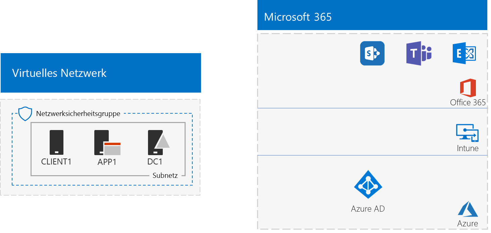
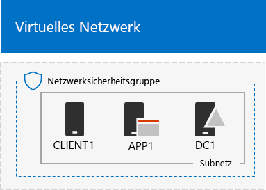
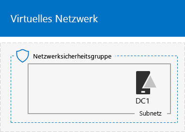
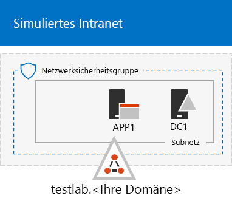

# <a name="the-simulated-enterprise-base-configuration"></a>Die simulierte Unternehmensstandardkonfiguration

Dieser Artikel bietet Schrittanleitungen zum Erstellen einer vereinfachten Umgebung für Microsoft 365 Enterprise, die Folgendes umfasst:

- Eine Testversion oder ein kostenpflichtiges Abonnement für Microsoft 365 E5.
- Ein vereinfachtes Unternehmensintranet mit Internetzugriff, das aus drei virtuellen Computern in einem virtuellen Azure-Netzwerk (DC1, APP1 und CLIENT1) besteht.
 


Sie können die resultierende Umgebung verwenden, um die Features und Funktionen von [Microsoft 365 Enterprise](https://www.microsoft.com/microsoft-365/enterprise) zu testen, mit zusätzlichen [Testumgebungsanleitungen](m365-enterprise-test-lab-guides.md) oder selbst.


> [!TIP]
> Klicken Sie [hier](https://aka.ms/m365etlgstack), um eine visuelle Darstellung aller Artikel im Stapel der Testumgebungsanleitungen in Microsoft 365 Enterprise zu erhalten.

## <a name="phase-1-create-a-simulated-intranet"></a>Phase 1: Erstellen eines simulierten Intranets

In dieser Phase erstellen Sie ein simuliertes Intranet in den Azure-Infrastrukturdiensten, das einen Active Directory Domain Services(AD DS)-Domänencontroller, einen Anwendungsserver und einen Clientcomputer umfasst. 

Sie verwenden diese Computer in zusätzlichen [Microsoft 365 Enterprise-Testumgebungsanleitungen](m365-enterprise-test-lab-guides.md), um Hybrid-Identitäten und andere Funktionen zu konfigurieren und zu demonstrieren.

### <a name="method-1-build-your-simulated-intranet-with-an-azure-resource-manager-template"></a>Methode 1: Erstellen eines simulierten Intranets mit einer Azure Ressourcenmanager-Vorlage

Bei dieser Methode verwenden Sie eine Azure Resource Manager-Vorlage (ARM), um das simulierte Intranet auszubauen. ARM-Vorlagen enthalten alle Anweisungen zum Erstellen der Azure-Netzwerkinfrastruktur, die virtuellen Computer und die dazugehörige Konfiguration.

Lesen Sie vor der Bereitstellung der Vorlage die [Infodatei auf der Vorlagenseite](https://github.com/maxskunkworks/TLG/tree/master/tlg-base-config_3-vm.m365-ems) und halten Sie folgende Informationen bereit:

- Der öffentliche DNS-Domänenname Ihrer Testumgebung (Testlabor.\<Ihre öffentlichen Domäne>). Sie müssen diesen Namen in das Feld **Domänenname** der Seite **Benutzerdefinierte Bereitstellung** einegben.
- Ein DNS-Präfix für die URLs der öffentlichen IP-Adressen Ihrer virtueller Computer. Sie müssen diese Bezeichnung in das Feld **DNS-Präfix** der Seite **Benutzerdefinierte Bereitstellung** eingeben.

Klicken Sie nach dem Lesen der Anweisungen auf **In Azure bereitstellen** in der [Infodatei auf der Vorlagenseite](https://github.com/maxskunkworks/TLG/tree/master/tlg-base-config_3-vm.m365-ems), um loszulegen.

>[!Note]
>Das anhand der ARM-Vorlage erstellte simulierte Intranet erfordert ein kostenpflichtiges Azure-Abonnement.
>

Hier finden Sie Ihre Konfiguration nach Abschluss der Vorlage.



### <a name="method-2-build-your-simulated-intranet-with-azure-powershell"></a>Methode 2: Erstellen Ihres simulierten Intranets mit Azure PowerShell

Bei dieser Methode verwenden Sie Windows PowerShell und das Azure PowerShell-Modul zum Erstellen der Netzwerkinfrastruktur, der virtuellen Computer und ihrer Konfiguration.

Verwenden Sie diese Methode, wenn Sie Erfahrungen mit dem Erstellen von Elementen der Azure-Infrastruktur für jeden einzelnen Schritt mit PowerShell sammeln möchten. Sie können dann die PowerShell-Befehlsblöcke für eine eigene Bereitstellung von anderen virtuellen Computern in Azure anpassen.

#### <a name="step-1-create-dc1"></a>Phase 1: Erstellen von DC1

In dieser Phase erstellen wir ein virtuelles Azure-Netzwerk und fügen DC1 hinzu, einen virtuellen Computer, der ein Domänencontroller für eine AD DS-Domäne ist.

Starten Sie zunächst eine Windows PowerShell-Eingabeaufforderung auf dem lokalen Computer.
  
> [!NOTE]
> In den folgenden Befehlssätzen wird die aktuelle Version von Azure PowerShell verwendet. Informationen dazu finden Sie unter [Get started with Azure PowerShell cmdlets](https://docs.microsoft.com/powershell/azureps-cmdlets-docs/). 
  
Melden Sie sich mit dem folgenden Befehl bei Ihrem Azure-Konto an.
  
```
Connect-AzAccount
```

Rufen Sie den Namen Ihres Abonnements mithilfe des folgenden Befehls ab.
  
```
Get-AzSubscription | Sort Name | Select Name
```

Legen Sie Ihr Azure-Abonnement fest. Ersetzen Sie alles innerhalb der Anführungszeichen, einschließlich der Zeichen „<“ und „>“, durch den entsprechenden Namen.
  
```
$subscr="<subscription name>"
Get-AzSubscription -SubscriptionName $subscr | Select-AzSubscription
```

Im nächsten Schritt wird eine neue Ressourcengruppe für Ihr simuliertes Unternehmenstestlabor erstellt. Verwenden Sie zum Ermitteln eines eindeutigen Ressourcengruppennamens diesen Befehl, mit dem die vorhandenen Ressourcengruppen aufgeführt werden.
  
```
Get-AzResourceGroup | Sort ResourceGroupName | Select ResourceGroupName
```

Erstellen Sie die neue Ressourcengruppe mit diesen Befehlen. Ersetzen Sie alles innerhalb der Anführungszeichen, einschließlich der Zeichen „<“ und „>“, durch die entsprechenden Namen.
  
```
$rgName="<resource group name>"
$locName="<location name, such as West US>"
New-AzResourceGroup -Name $rgName -Location $locName
```

Als Nächstes erstellen Sie das virtuelle Netzwerk „TestLab“, in dem das Corpnet-Subnetz der simulierten Unternehmensumgebung gehostet und mit einer Netzwerksicherheitsgruppe geschützt wird. Tragen Sie den Namen Ihrer Ressourcengruppe ein, und führen Sie diese Befehle an der PowerShell-Eingabeaufforderung auf dem lokalen Computer aus.
  
```
$rgName="<name of your new resource group>"
$locName=(Get-AzResourceGroup -Name $rgName).Location
$corpnetSubnet=New-AzVirtualNetworkSubnetConfig -Name Corpnet -AddressPrefix 10.0.0.0/24
New-AzVirtualNetwork -Name TestLab -ResourceGroupName $rgName -Location $locName -AddressPrefix 10.0.0.0/8 -Subnet $corpnetSubnet -DNSServer 10.0.0.4
$rule1=New-AzNetworkSecurityRuleConfig -Name "RDPTraffic" -Description "Allow RDP to all VMs on the subnet" -Access Allow -Protocol Tcp -Direction Inbound -Priority 100 -SourceAddressPrefix Internet -SourcePortRange * -DestinationAddressPrefix * -DestinationPortRange 3389
New-AzNetworkSecurityGroup -Name Corpnet -ResourceGroupName $rgName -Location $locName -SecurityRules $rule1
$vnet=Get-AzVirtualNetwork -ResourceGroupName $rgName -Name TestLab
$nsg=Get-AzNetworkSecurityGroup -Name Corpnet -ResourceGroupName $rgName
Set-AzVirtualNetworkSubnetConfig -VirtualNetwork $vnet -Name Corpnet -AddressPrefix "10.0.0.0/24" -NetworkSecurityGroup $nsg
$vnet | Set-AzVirtualNetwork
```

Als Nächstes erstellen Sie den virtuellen DC1-Computer und konfigurieren ihn als einen Domänencontroller für **testlab.**\<Ihre öffentliche Domäne> AD DS-Domäne und einen DNS-Server für die virtuellen Computer des virtuellen Netzwerks TestLab. Wenn der Name der öffentlichen Domäne **<span>contoso</span>.com** ist, ist die virtuelle Maschine DC1 ein Domänencontroller für die Domäne **<span>testlab</span>.contoso.com**.
  
Geben Sie zum Erstellen eines virtuellen Azure-Computers für DC1 den Namen Ihrer Ressourcengruppe ein, und führen Sie über die PowerShell-Eingabeaufforderung auf Ihrem lokalen Computer die nachfolgenden Befehle aus.
  
```
$rgName="<resource group name>"
$locName=(Get-AzResourceGroup -Name $rgName).Location
$vnet=Get-AzVirtualNetwork -Name TestLab -ResourceGroupName $rgName
$pip=New-AzPublicIpAddress -Name DC1-PIP -ResourceGroupName $rgName -Location $locName -AllocationMethod Dynamic
$nic=New-AzNetworkInterface -Name DC1-NIC -ResourceGroupName $rgName -Location $locName -SubnetId $vnet.Subnets[0].Id -PublicIpAddressId $pip.Id -PrivateIpAddress 10.0.0.4
$vm=New-AzVMConfig -VMName DC1 -VMSize Standard_A1
$cred=Get-Credential -Message "Type the name and password of the local administrator account for DC1."
$vm=Set-AzVMOperatingSystem -VM $vm -Windows -ComputerName DC1 -Credential $cred -ProvisionVMAgent -EnableAutoUpdate
$vm=Set-AzVMSourceImage -VM $vm -PublisherName MicrosoftWindowsServer -Offer WindowsServer -Skus 2016-Datacenter -Version "latest"
$vm=Add-AzVMNetworkInterface -VM $vm -Id $nic.Id
$vm=Set-AzVMOSDisk -VM $vm -Name "DC1-OS" -DiskSizeInGB 128 -CreateOption FromImage
$diskConfig=New-AzDiskConfig -AccountType "Standard_LRS" -Location $locName -CreateOption Empty -DiskSizeGB 20
$dataDisk1=New-AzDisk -DiskName "DC1-DataDisk1" -Disk $diskConfig -ResourceGroupName $rgName
$vm=Add-AzVMDataDisk -VM $vm -Name "DC1-DataDisk1" -CreateOption Attach -ManagedDiskId $dataDisk1.Id -Lun 1
New-AzVM -ResourceGroupName $rgName -Location $locName -VM $vm
```

Sie werden nach einem Benutzernamen und Kennwort für das lokale Administratorkonto auf DC1 gefragt. Verwenden Sie ein sicheres Kennwort, und notieren Sie den Namen und das Kennwort an einem sicheren Ort.
  
Stellen Sie dann eine Verbindung mit dem virtuellen Computer DC1 her.
  
1. Klicken Sie im [Azure-Portal](https://portal.azure.com) auf **Ressourcengruppen >** [Name der neuen Ressourcengruppe] **> DC1 > Verbinden**.
    
2. Klicken Sie im Bereich „Öffnen“ auf  **RDP-Datei herunterladen**. Öffnen Sie die Datei „DC1.rdp“, die heruntergeladen wird, und klicken Sie dann auf **Verbinden**.
    
3. Geben Sie den Namen des lokalen DC1-Administratorkontos an:
    
   - Für Windows 7:
    
     Klicken Sie im Dialogfeld **Windows-Sicherheit** auf **Anderes Konto verwenden**. Geben Sie unter **Benutzername** den Namen **DC1\\**[Kontoname des lokalen Administrators] ein.
    
   - Für Windows 8 oder Windows 10:
    
     Klicken Sie im Dialogfeld **Windows-Sicherheit** auf **Weitere Optionen**, und klicken Sie dann auf **Anderes Konto verwenden**. Geben Sie unter **Benutzername** den Namen **DC1\\**[Kontoname des lokalen Administrators] ein.
    
4. Geben Sie unter **Kennwort** das Kennwort des lokalen Administratorkontos ein, und klicken Sie dann auf **OK**.
    
5. Klicken Sie auf **Ja**, wenn Sie dazu aufgefordert werden.
    
Im nächsten Schritt führen Sie diesen Befehl über eine Windows PowerShell-Eingabeaufforderung mit Administratorrechten auf DC1 aus, um ein zusätzliches Datenlaufwerk als neues Volume mit dem Laufwerkbuchstaben „F:" hinzuzufügen.
  
```
Get-Disk | Where PartitionStyle -eq "RAW" | Initialize-Disk -PartitionStyle MBR -PassThru | New-Partition -AssignDriveLetter -UseMaximumSize | Format-Volume -FileSystem NTFS -NewFileSystemLabel "WSAD Data"
```

Konfigurieren Sie als Nächstes DC1 als Domänencontroller und DNS-Server für die Domäne **testlab.**\<Ihr öffentlicher Domänenname>. Geben Sie Ihren öffentlichen Domänennamen an, entfernen Sie die Zeichen \< und „>“, und führen Sie die folgenden Befehle an einer Windows PowerShell-Eingabeaufforderung auf Administratorebene auf DC1 aus.
  
```
$yourDomain="<your public domain>"
Install-WindowsFeature AD-Domain-Services -IncludeManagementTools
Install-ADDSForest -DomainName testlab.$yourDomain -DatabasePath "F:\NTDS" -SysvolPath "F:\SYSVOL" -LogPath "F:\Logs"
```
Sie müssen ein Administratorkennwort für den abgesicherten Modus angeben. Bewahren Sie das Kennwort an einem sicheren Ort auf.
  
Beachten Sie, dass der Abschluss dieser Befehle ein paar Minuten in Anspruch nehmen kann.
  
Stellen Sie nach dem Neustart von DC1 wieder eine Verbindung zum virtuellen DC1-Computer her.
  
1. Klicken Sie im [Azure-Portal](https://portal.azure.com) auf **Ressourcengruppen >** [Ihre Ressourcengruppe] **> DC1 > Verbinden**.
    
2. Führen Sie die Datei „DC1.rdp“ aus, die heruntergeladen wurde, und klicken Sie dann auf **Verbinden**.
    
3. Klicken Sie unter **Windows-Sicherheit** auf **Anderes Konto verwenden**. Geben Sie unter **Benutzername** den Namen **TESTLAB\\**[Kontoname des lokalen Administrators] ein.
    
4. Geben Sie unter **Kennwort** das Kennwort des lokalen Administratorkontos ein, und klicken Sie dann auf **OK**.
    
5. Klicken Sie auf **Ja**, wenn Sie dazu aufgefordert werden.
    
Im nächsten Schritt erstellen Sie ein Benutzerkonto in Active Directory, das bei der Anmeldung an Mitgliedscomputern der Domäne TESTLAB verwendet wird. Führen Sie diesen Befehl an einer Windows PowerShell-Eingabeaufforderung auf Administratorebene aus.
  
```
New-ADUser -SamAccountName User1 -AccountPassword (read-host "Set user password" -assecurestring) -name "User1" -enabled $true -PasswordNeverExpires $true -ChangePasswordAtLogon $false
```

Beachten Sie, dass Sie von dem Befehl aufgefordert werden, das Kennwort des Kontos „Benutzer1“ anzugeben. Da dieses Konto für Remotedesktopverbindungen für alle Mitgliedscomputer der Domäne TESTLAB verwendet wird, sollten Sie ein sicheres Kennwort wählen. Notieren Sie das Kennwort des Kontos „Benutzer1“, und bewahren Sie es an einem sicheren Ort auf.
  
Konfigurieren Sie als Nächstes das neue Konto „Benutzer1“ als Domänen-, Unternehmens- und Schemaadministrator aus. Führen Sie diesen Befehl an der Windows PowerShell-Eingabeaufforderung auf Administratorebene aus.
  
```
$yourDomain="<your public domain>"
$domainName = "testlab"+$yourDomain
$userName="user1@" + $domainName
$userSID=(New-Object System.Security.Principal.NTAccount($userName)).Translate([System.Security.Principal.SecurityIdentifier]).Value
$groupNames=@("Domain Admins","Enterprise Admins","Schema Admins")
ForEach ($name in $groupNames) {Add-ADPrincipalGroupMembership -Identity $userSID -MemberOf (Get-ADGroup -Identity $name).SID.Value}
```

Schließen Sie die Remotedesktopsitzung mit DC1, und stellen Sie dann mit dem Konto „TESTLAB\\Benutzer1“ wieder eine Verbindung her.
  
Führen Sie als Nächstes den folgenden Befehl an einer Windows PowerShell-Eingabeaufforderung auf Administratorebene aus, um Datenverkehr für das Tool Ping zuzulassen.
  
```
Set-NetFirewallRule -DisplayName "File and Printer Sharing (Echo Request - ICMPv4-In)" -enabled True
```

Dies ist Ihre aktuelle Konfiguration.
  

  
#### <a name="step-2-configure-app1"></a>Schritt 2: Konfigurieren von APP1

In diesem Schritt erstellen und konfigurieren Sie APP1, ein Anwendungsserver, der zunächst Web- und Dateifreigabedienste bereitstellt.

Geben Sie zum Erstellen eines virtuellen Azure-Computers für APP1 den Namen Ihrer Ressourcengruppe ein, und führen Sie über die Eingabeaufforderung auf Ihrem lokalen Computer die nachfolgenden Befehle aus.
  
```
$rgName="<resource group name>"
$locName=(Get-AzResourceGroup -Name $rgName).Location
$vnet=Get-AzVirtualNetwork -Name TestLab -ResourceGroupName $rgName
$pip=New-AzPublicIpAddress -Name APP1-PIP -ResourceGroupName $rgName -Location $locName -AllocationMethod Dynamic
$nic=New-AzNetworkInterface -Name APP1-NIC -ResourceGroupName $rgName -Location $locName -SubnetId $vnet.Subnets[0].Id -PublicIpAddressId $pip.Id
$vm=New-AzVMConfig -VMName APP1 -VMSize Standard_A1
$cred=Get-Credential -Message "Type the name and password of the local administrator account for APP1."
$vm=Set-AzVMOperatingSystem -VM $vm -Windows -ComputerName APP1 -Credential $cred -ProvisionVMAgent -EnableAutoUpdate
$vm=Set-AzVMSourceImage -VM $vm -PublisherName MicrosoftWindowsServer -Offer WindowsServer -Skus 2016-Datacenter -Version "latest"
$vm=Add-AzVMNetworkInterface -VM $vm -Id $nic.Id
$vm=Set-AzVMOSDisk -VM $vm -Name "APP1-OS" -DiskSizeInGB 128 -CreateOption FromImage
New-AzVM -ResourceGroupName $rgName -Location $locName -VM $vm
```

Im nächsten Schritt stellen Sie eine Verbindung mit dem virtuellen Computer APP1 mit dem Kontonamen und Kennwort des lokalen Administratorkontos von APP1 her und öffnen dann eine Windows PowerShell-Eingabeaufforderung.
  
Führen Sie zum Überprüfen der Namensauflösung und der Netzwerkkommunikation zwischen APP1 und DC1 den Befehl **ping dc1.testlab.**\<Ihr öffentlicher Domänenname> aus, und vergewissern Sie sich, dass vier Antworten vorhanden sind.
  
Verknüpfen Sie als Nächstes unter Verwendung der folgenden Befehle an der Windows PowerShell-Eingabeaufforderung den virtuellen Computer APP1 mit der Domäne TESTLAB.
  
```
$yourDomain="<your public domain name>"
Add-Computer -DomainName ("testlab" + $yourDomain)
Restart-Computer
```

Beachten Sie, dass Sie nach der Ausführung des Befehls **Add-Computer** die Anmeldeinformationen für das Domänenkonto „TESTLAB\\Benutzer1“ eingeben müssen.
  
Stellen Sie nach dem Neustart von APP1 eine Verbindung über das Konto „TESLAB\\Benutzer1“ damit her, und öffnen Sie dann eine Windows PowerShell-Eingabeaufforderung auf Administratorebene.
  
Im nächsten Schritt richten Sie APP1 mit dem folgenden Befehl in der Windows PowerShell-Eingabeaufforderung auf Administratorebene auf APP1 als Webserver ein.
  
```
Install-WindowsFeature Web-WebServer -IncludeManagementTools
```

Erstellen Sie als Nächstes einen freigegebenen Ordner und eine Textdatei innerhalb des Ordners auf APP1 mit diesen PowerShell-Befehlen.
  
```
New-Item -path c:\files -type directory
Write-Output "This is a shared file." | out-file c:\files\example.txt
New-SmbShare -name files -path c:\files -changeaccess TESTLAB\User1
```

Dies ist Ihre aktuelle Konfiguration.
  

  
#### <a name="step-3-configure-client1"></a>Schritt 3: Konfigurieren von CLIENT1

In diesem Schritt wird CLIENT1 erstellt und konfiguriert, der als typischer Laptop, als Tablet oder als Desktopcomputer im Intranet fungiert.

> [!NOTE]  
> Der folgende Befehlssatz erstellt CLIENT1 unter Windows Server 2016 Datacenter. Er gilt für alle Arten von Azure-Abonnements. Wenn Sie über ein Visual Studio-basiertes Azure-Abonnement verfügen, können Sie CLIENT1 unter Windows 10 mit dem [Azure-Portal](https://portal.azure.com) erstellen. 
  
Geben Sie zum Erstellen eines virtuellen Azure-Computers für CLIENT1 den Namen Ihrer Ressourcengruppe ein, und führen Sie über die Eingabeaufforderung auf Ihrem lokalen Computer die nachfolgenden Befehle aus.
  
```
$rgName="<resource group name>"
$locName=(Get-AzResourceGroup -Name $rgName).Location
$vnet=Get-AzVirtualNetwork -Name TestLab -ResourceGroupName $rgName
$pip=New-AzPublicIpAddress -Name CLIENT1-PIP -ResourceGroupName $rgName -Location $locName -AllocationMethod Dynamic
$nic=New-AzNetworkInterface -Name CLIENT1-NIC -ResourceGroupName $rgName -Location $locName -SubnetId $vnet.Subnets[0].Id -PublicIpAddressId $pip.Id
$vm=New-AzVMConfig -VMName CLIENT1 -VMSize Standard_A1
$cred=Get-Credential -Message "Type the name and password of the local administrator account for CLIENT1."
$vm=Set-AzVMOperatingSystem -VM $vm -Windows -ComputerName CLIENT1 -Credential $cred -ProvisionVMAgent -EnableAutoUpdate
$vm=Set-AzVMSourceImage -VM $vm -PublisherName MicrosoftWindowsServer -Offer WindowsServer -Skus 2016-Datacenter -Version "latest"
$vm=Add-AzVMNetworkInterface -VM $vm -Id $nic.Id
$vm=Set-AzVMOSDisk -VM $vm -Name "CLIENT1-OS" -DiskSizeInGB 128 -CreateOption FromImage
New-AzVM -ResourceGroupName $rgName -Location $locName -VM $vm
```

Im nächsten Schritt stellen Sie eine Verbindung mit dem virtuellen Computer CLIENT1 mit dem Kontonamen und Kennwort des lokalen Administratorkontos von CLIENT1 her und öffnen dann eine Windows PowerShell-Eingabeaufforderung auf Administratorebene.
  
Führen Sie zum Überprüfen der Namensauflösung und der Netzwerkkommunikation zwischen CLIENT1 und DC1 den Befehl **ping dc1.testlab.**\<Ihr öffentlicher Domänenname> an einer Windows PowerShell-Eingabeaufforderung aus, und vergewissern Sie sich, dass vier Antworten vorhanden sind.
  
Verknüpfen Sie als Nächstes unter Verwendung der folgenden Befehle an der Windows PowerShell-Eingabeaufforderung den virtuellen Computer CLIENT1 mit der Domäne TESTLAB.
  
```
$yourDomain="<your public domain name>"
Add-Computer -DomainName ("testlab" + $yourDomain)
Restart-Computer
```

Beachten Sie, dass Sie nach der Ausführung des Befehls **Add-Computer** die Anmeldeinformationen für das Domänenkonto „TESTLAB\\Benutzer1“ eingeben müssen.
  
Stellen Sie nach dem Neustart von CLIENT1 eine Verbindung über den Kontonamen und das Kennwort von „TESTLAB\\Benutzer1“ damit her, und öffnen Sie dann eine Windows PowerShell-Eingabeaufforderung auf Administratorebene.
  
Überprüfen Sie im nächsten Schritt, ob Sie von CLIENT1 aus auf Web- und Dateifreigaberessourcen auf APP1 zugreifen können.
  
1. Klicken Sie im Server-Manager im Strukturbereich auf **Lokaler Server**.
    
2. Klicken Sie in **Eigenschaften für CLIENT1** neben **Verstärkte Sicherheitskonfiguration für IE** auf **Ein**.
    
3. Klicken Sie unter **Verstärkte Sicherheitskonfiguration für Internet Explorer** für **Administratoren** und für **Benutzer** auf **Aus**, und klicken Sie dann auf **OK**.
    
4. Klicken Sie auf dem Startbildschirm auf **Internet Explorer** und dann auf **OK**.
    
5. Geben Sie in der Adressleiste **http<span>://</span>app1.testab.**\<Ihr öffentlicher Domänenname>**/** ein, und drücken Sie dann die EINGABETASTE. Nun sollte die standardmäßige Internetinformationsdienste-Webseite für APP1 angezeigt werden.
    
6. Klicken Sie auf der Desktop-Taskleiste auf das Symbol für den Datei-Explorer.
    
7. Geben Sie in der Adressleiste **\\\\app1\\Files** ein, und drücken Sie dann die EINGABETASTE. Nun sollte ein Ordnerfenster mit dem Inhalt des freigegebenen Ordners „Files“ angezeigt werden.
    
8. Doppelklicken Sie im Fenster des freigegebenen Ordners **Files** auf die Datei **Example.txt**. Nun sollte der Inhalt der Datei „Example.txt“ angezeigt werden.
    
9. Schließen Sie das Fenster **example.txt - Editor** und das Fenster des freigegebenen Ordners **Files**.
    
Dies ist Ihre aktuelle Konfiguration.
  


## <a name="phase-2-create-your-microsoft-365-e5-subscriptions"></a>Phase 2: Ihre Abonnements für Microsoft 365 E5 erstellen

In dieser Phase erstellen Sie ein neues Abonnement für Microsoft 365 E5, das einen neuen Azure AD-Mandanten verwendet, der von Ihrem Produktionsabonnement getrennt ist. Dies können Sie auf zwei Arten tun:

- Verwenden Sie ein Testabonnement von Microsoft 365 E5. 

  Das Testabonnement von Microsoft 365 E5 gilt für 30 Tage, die problemlos auf 60 Tage verlängert werden können. Wenn das Testabonnement abläuft, müssen Sie entweder zu einem kostenpflichtigen Abonnement wechseln oder eine neue Testversion erstellen. Durch Erstellen neuer Testabonnements müssen Sie Ihre Konfiguration verlassen, was im Hintergrund zu komplexen Szenarien führen kann.  
- Verwenden Sie ein separates Produktionsabonnement von Microsoft 365 E5 mit einer kleinen Anzahl von Lizenzen.

  Dabei entstehen zusätzliche Kosten, aber es wird sichergestellt, dass Sie über eine funktionierende Testumgebung zum Testen von Features, Konfigurationen und Szenarien verfüge, die nicht abläuft. Sie können dieselbe Testumgebung über die gesamten Zeiträume für Machbarkeitsstudien, Demos für Mitarbeiter und Führungskräfte sowie für Anwendungsentwicklung und Tests verwenden. Dies ist die empfohlene Methode.

### <a name="use-trial-subscriptions"></a>Verwenden von Testabonnements

Folgen Sie als Erstes den Schritten von Phase 2 und 3 unter [Office 365 Dev/Test-Umgebung](https://docs.microsoft.com/office365/enterprise/office-365-dev-test-environment), um eine einfache Dev/Test-Umgebung für Office 365 zu erstellen.

>[!Note]
>Dann fordern wir Sie dazu auf, ein Office 365-Testabonnement zu erstellen, damit Ihre Dev/Test-Umgebung über einen separaten Azure AD-Mandanten verfügt, der getrennt ist von allen kostenpflichtigen Abonnements, die Sie aktuell haben. Diese Trennung bedeutet, dass Sie Benutzer zum Testmandanten hinzufügen und entfernen können, ohne dass dies Auswirkungen auf Ihre Produktionsabonnements hat.
>

Fügen Sie als Nächstes das Testabonnement für Microsoft 365 E5 hinzu und weisen Sie ihrem globalen Administratorkonto eine Microsoft 365-Lizenz zu.

1. Melden Sie sich mit einer privaten Instanz eines Internetbrowsers mit den Anmeldeinformationen Ihres globalen Administratorkontos beim Microsoft 365 Admin Center unter [http://admin.microsoft.com](http://admin.microsoft.com) an. 
    
2. Klicken Sie auf der Registerkarte **Microsoft 365 Admin Center** im linken Navigationsbereich auf **Abrechnung > Dienste kaufen**.
    
3. Finden Sie auf der Seite**Dienste kaufen** das Element **Microsoft 365 E5**. Zeigen Sie mit Ihrem Mauszeiger darauf und klicken Sie **Kostenlose Testversion starten**.

4. Wählen Sie auf der Seite **Microsoft 365 E5 Testversion** aus, ob Sie eine SMS oder einen Anruf erhalten möchten, geben Sie Ihre Telefonnummer ein und klicken Sie dann **SMS an mich senden** oder **Mich anrufen**.

5. Klicken Sie auf der Seite für die **Bestätigung Ihrer Bestellung** auf **Jetzt versuchen**.

6. Klicken Sie auf der Seite **Bestellbestätigung** auf **Weiter**.

7. Klicken Sie im Microsoft 365 Admin Center **Aktiver Benutzer** und klicken Sie dann auf Ihr Administratorkonto.

8. Klicken Sie **Bearbeiten** für **Produktlizenzen**.

9. Deaktivieren Sie die Lizenz für Office 365 Enterprise E5 und aktivieren Sie die Lizenz für Microsoft 365 E5.

10. Klicken Sie auf **Speichern > Schließen > Schließen**.

 Als Nächstes,***wenn Sie die Schritte in Phase 3 der *** [Office 365 Dev/Test-Umgebung](https://docs.microsoft.com/office365/enterprise/office-365-dev-test-environment) abgeschlossen haben, wiederholen Sie die Schritte 8 bis 11 des vorherigen Verfahrens für alle Ihre anderen Konten (Benutzer 2, Benutzer 3, Benutzer 4 und Benutzer 5).
  
> [!NOTE]
> Das Testabonnement für Microsoft 365 E5 ist 30 Tage gültig. Ändern Sie für eine dauerhafte Testumgebung dieses Testabonnement in ein kostenpflichtiges Abonnement mit einer kleinen Anzahl von Lizenzen.
  
Ihre Testumgebung verfügt nun über Folgendes:
  
- Ein Testabonnement für Microsoft 365 E5.
- Alle Ihre entsprechenden Benutzerkonten (entweder nur der globale Administrator oder alle fünf Benutzerkonten) können Microsoft 365 E5 verwenden.
    
### <a name="results"></a>Ergebnisse

Ihre Testumgebung verfügt nun über Folgendes:
  
- Ein Testabonnement für Microsoft 365 E5.
- Alle Ihre entsprechenden Benutzerkonten (entweder nur der globale Administrator oder alle fünf Benutzerkonten) können Microsoft 365 E5 verwenden.
    
Dies ist Ihre endgültige Konfiguration.
  

  
Sie können nun die zusätzlichen Funktionen von [Microsoft 365 Enterprise](https://www.microsoft.com/microsoft-365/enterprise) ausprobieren.
  
## <a name="next-steps"></a>Nächste Schritte

Sehen Sie sich diese zusätzlichen Testumgebungsanleitungen an:
  
- [Identität](m365-enterprise-test-lab-guides.md#identity)
- [Verwaltung mobiler Geräte](m365-enterprise-test-lab-guides.md#mobile-device-management)
- [Schutz von Daten](m365-enterprise-test-lab-guides.md#information-protection)

## <a name="see-also"></a>Siehe auch

[Testumgebungsanleitungen für Microsoft 365 Enterprise](m365-enterprise-test-lab-guides.md)

[Bereitstellen von Microsoft 365 Enterprise](deploy-microsoft-365-enterprise.md)

[Dokumentation zu Microsoft 365 Enterprise](https://docs.microsoft.com/microsoft-365-enterprise/)
