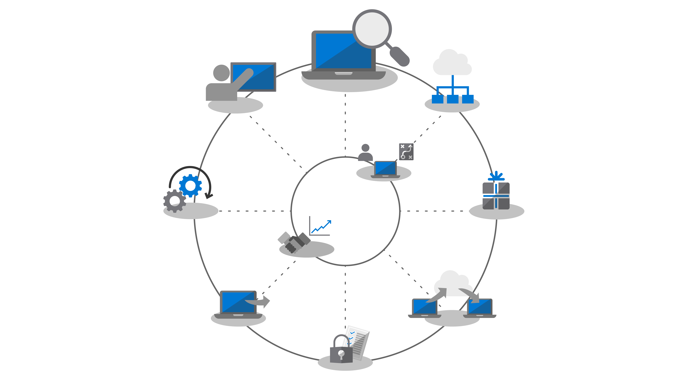

# Schritt 1: Geräte- und App-BereitschaftStep 1: Device and App Readiness

<table>
<thead>
<td></td>
<td>
<strong>Schritt 1: Geräte- und App-Bereitschaft</strong><strong>Step 1: Device and App Readiness</strong>

Beginnen Sie Ihre Desktopbereitstellung mit einer Bestandsaufnahme Ihrer Geräte und Apps, priorisieren Sie, was Sie für Ihre weitere Arbeit benötigen, testen Sie priorisierte Apps und Geräte, und beheben Sie dann ggf. Probleme, um sich auf die Bereitstellung vorzubereiten.Begin your desktop deployment project with an inventory of your devices and apps, prioritize what you need to move forward, test prioritized apps and devices, then remediate what’s needed to get ready for deployment.
</td>
<td></td>
</thead>
</table>

>[!NOTE]
>Die Geräte- und App-Bereitschaft ist der erste Schritt in unserem empfohlenem Bereitstellungsprozess, bei dem die ganzheitlichen Aspekte der Anwendungs- und Hardwarekompatibilität behandelt werden.Device and App Readiness is the first step in our recommended deployment process wheel by covering the holistic aspects of application and hardware compatibility. Den vollständigen Desktopbereitstellungsprozess finden Sie im [Desktopbereitstellungscenter](https://aka.ms/HowToShift).To see the full desktop deployment process, visit the [Desktop Deployment Center](https://aka.ms/HowToShift).
>

In der Vergangenheit war die Anwendungs- und Hardwarekompatibilität bei der Aktualisierung der Desktops der Benutzer eine große Herausforderung. Aber es gibt gute Nachrichten: Wenn Sie auf Windows 10 und Microsoft 365 Apps for Enterprise umsteigen möchten, werden alle Anwendungen, die in den letzten zehn Jahren geschrieben wurden, auf Windows 10 ausgeführt, und alle COM-Add-Ins und VBA-Makros, die Ihre Organisation in älteren Versionen von Office (z. B. Office 2010) verwendete, funktionieren (ohne Änderungen) weiterhin in den neusten Versionen von Office.In the past, a major hurdle to upgrading the users’ desktops is application and hardware compatibility. The good news as you plan your shift to Windows 10 and Microsoft 365 Apps for enterprise, is just about any application written in the last 10 years will run on Windows 10, and any COM add-ins and VBA macros your organization used on versions of Office dating back to Office 2010, will continue to work on the latest versions of Office, without modification.

Nichtsdestotrotz ist das Überprüfen der Anwendungs- und Hardwarekompatibilität in Abhängigkeit von der Größe und dem Alter Ihrer Organisation mit großer Wahrscheinlichkeit nach wie vor ein wichtiger erster Schritt in unserem empfohlenen Bereitstellungsprozess, der aus acht Phasen besteht.That said, depending on the size and age of your organization, verifying application and hardware compatibility is likely still an essential initial step in our recommended 8-phase deployment process.

In diesem Artikel führen wir Sie durch diese erste Phase – die Geräte- und App-Bereitschaft – mithilfe der Microsoft-Tools zur Bewertung der Bereitschaft, einschließlich des neuen Tools Desktop Analytics, bei dem es sich um eine intelligente cloudbasierte Lösung handelt, die mit Ihrer Windows-Lizenz verfügbar ist.In this article we take you through that first phase – Device and App Readiness – using Microsoft readiness assessment tools including the Desktop Analytics, an intelligent cloud-based solution available with your Windows license.

## Windows 10-KompatibilitätsüberprüfungWindows 10 Compatibility Scan

Vor der Bereitstellung von Windows 10 empfiehlt Microsoft, die Bereitschaft Ihrer vorhandenen Windows 7- oder Windows 8/8.1-Geräte zu überprüfen.Before deploying Windows 10 Microsoft recommends checking the readiness of your existing devices running Windows 7 or 8/8.1. Das Windows 10-Installationsmedium unterstützt eine Befehlszeilenoption für die Datei "setup.exe" zum Ausführen des Upgrades, mit der nur die Kompatibilität überprüft, das Upgrade aber nicht ausgeführt wird.Windows 10 installation media supports a command line switch for the setup.exe to run the upgrade but only check for compatibility, not actually perform the upgrade. ScanOnly kann nur als skriptgesteuerte Batchdatei ausgeführt oder in eine Microsoft Endpoint Configuration Manager-Tasksequenz integriert werden, einschließlich der Möglichkeit, ScanOnly direkt aus dem Netzwerk auszuführen, ohne das Windows 10-Installationsmedium zuvor auf das lokale Gerät zu streamen.ScanOnly can be run as a scripted batch file or integrated into a Microsoft Endpoint Configuration Manager task sequence, including the ability to run the ScanOnly directly from the network so the Windows 10 installation media isn't streamed down to the local device. Nach Abschluss von ScanOnly werden die Ergebnisse über Rückgabecodes in von "setup.exe" generierte Protokolldateien zurückgegeben.When ScanOnly completes the results are returned via return codes in log files generated by Setup.EXE.   

Ein Beispiel für eine ScanOnly-Befehlszeile, die die Kompatibilitätsüberprüfung ohne Benutzereingriff ausführt, sieht wie folgt aus:A sample ScanOnly command line that completes the compatibility scan silently would look like the below:

    Setup.EXE /Auto Upgrade /Quiet /NoReboot /Compat ScanOnly

Weitere Informationen zu ScanOnly und anderen Windows-Setupbefehlsoptionen finden Sie unter [Windows Setup-Befehlszeilenoptionen](https://aka.ms/setupswitches).For more information on ScanOnly and other Windows setup command switches please review the [Windows Setup Command-line Options](https://aka.ms/setupswitches).

## Empfohlenes Tool: Desktop AnalyticsRecommended Tool: Desktop Analytics

Desktop Analytics bietet viele Vorteile gegenüber herkömmlichen Desktopverwaltungssystemen und ist unser empfohlenes Tool.Desktop Analytics offers many advantages over traditional desktop management systems and is our recommended tool. Für Windows Analytics Upgrade Readiness müssen keine Agents bereitgestellt werden, und das Tool führt Sie durch die erforderlichen Schritte unter Verwendung der beim Upgraden von Hunderten von Millionen von Verbraucher-PCs gesammelten Informationen zur Anwendungs- und Treiberkompatibilität.It is agentless and guides you through what needs to be done making use of application and driver compatibility information gathered through the upgrade of hundreds of millions of consumer PCs. Anhand dieser Informationen erhalten Sie eine detaillierte Bewertung, indem Kompatibilitätsprobleme identifiziert werden, die Ihr Upgrade blockieren könnten, unterstützt durch Links zu vorgeschlagenen Korrekturen, die Microsoft bekannt sind.This information gives you a detailed assessment, identifying compatibility issues that might block your upgrade, supported with links to suggested fixes known to Microsoft.

Um Desktop Analytics einzurichten, müssen Sie zuerst ein Azure-Abonnement einrichten und einen Azure Log Analytics-Arbeitsbereich hinzufügen.To set up Desktop Analytics you’ll first need to set up an Azure subscription and include an Azure Log Analytics workspace to that. Sobald der Dienst Desktop Analytics ausgeführt wird, können Sie jedes mit dem Internet verbundene Windows 7 SP1- oder neuere Gerät über Gruppenrichtlinieneinstellungen registrieren – so einfach ist das.Once you have the Desktop Analytics service running, you can then enroll any Internet-connected Windows 7 SP1 or newer device via Group Policy settings - it’s that simple. Es müssen keine Agents bereitgestellt werden, und der visuelle Workflow von Desktop Analytics führt Sie von der Pilotbereitstellung bis zur Produktionsbereitstellung.There are no agents to deploy, and Desktop Analytics’ visual workflow guides you from pilot to production deployment. Wenn Sie möchten, können Sie Daten von Desktop Analytics in Softwarebereitstellungstools wie Microsoft Endpoint Configuration Manager (Current Branch) exportieren, um PCs direkt zu adressieren und Sammlungen zu erstellen, sobald sie für die Bereitstellung bereit sind.If you wish, you can export data from Desktop Analytics to software deployment tools such as Microsoft Endpoint Configuration Manager (Current Branch), to target PCs directly and build collections as they become ready for deployment.

Wenn Sie Windows Desktop derzeit nicht für Ihre Umgebung eingerichtet haben oder sich für eine Testversion registrieren möchten, wechseln Sie zur Desktop Analytics-Seite](https://www.aka.ms/desktopanalytics), und legen Sie los.If you don’t currently have Desktop Analytics set up for your environment or would like to sign up for a trial, go the Desktop Analytics page](https://www.aka.ms/desktopanalytics) and get started.

## Prozess der Geräte- und App-BereitschaftDevice and App Readiness Process

Geräte- und App-Bereitschaft besteht aus vier Schritten: 1.Device and App Readiness is comprised of four steps: 1. Inventar, 2.Inventory, 2. Priorisieren, 3.Prioritize, 3. Testen, 4.Test, 4. Fehlerbehebung.Remediate. Lassen Sie uns alle Schritte nach einander betrachten.Let’s look at each of these in turn.

### 1\.1\. BestandsaufnahmeInventory

Der Dienst Desktop Analytics verwendet einen Prozess ohne Agent zur Bestandsaufnahme der Computer und Anwendungen Ihrer gesamten Desktopumgebung.Desktop Analytics uses an agent-less process to inventory the computers and applications across your desktop estate. Er stellt außerdem Berichte zu häufig besuchten Internetwebsites, Apps und Intranetspeicherorten bereit, um Sie später bei den Kompatibilitätstests zu unterstützen.It also provides reports on highly visited Internet sites, apps, and Intranet locations to help you with compatibility testing later.

### 2\.2\. PriorisierenPrioritize

Nach der Bestandsaufnahme können Sie Desktop Analytics verwenden, um die am häufigsten verwendeten Apps und die am häufigsten in Ihrer Organisation verwendete Hardware zu identifizieren und zu priorisieren, und ermitteln, worauf Sie sich konzentrieren müssen, um so viele Computer wie möglich für die Bereitstellung vorzubereiten.With inventory taken, Desktop Analytics helps you to identify and prioritize the most common apps and hardware used in your organization, as well as what to focus on to unblock as many PCs as possible for deployment.

Außerdem erhalten Sie Hilfestellung zur Beurteilung der Updates, die erforderlich sind, um Probleme beim nächsten Schritt, nämlich beim Testen, zu beheben.It also provides guidance to help you assess the updates necessary to resolve issues during the next step: testing.

### 3\.3\. TestenTesting

Sie werden feststellen, dass die meisten Anwendungen, Treiber und Add-Ins der Bestandsaufnahme in der vorliegenden Form funktionieren.You will find that most of the applications, drivers, and add-ins inventoried will work as-is. Für Elemente, bei denen Desktop Analytics Probleme feststellt, erhalten Sie bekannte Informationen, z. B., wo Versionsupdates zur Behebung von Kompatibilitätsproblemen zu finden sind.For items Desktop Analytics assesses to have issues, it provides you with known information including where to find version updates to resolve compatibility problems. Anstatt Zeit und Ressourcen auf die Lösung komplexer Probleme in nicht kritischen, selten bereitgestellten Anwendungen und älteren Geräten aufzuwenden, können Sie stattdessen mit Benutzern arbeiten, um diese Elemente zurückzuziehen und zu ersetzen.Rather than devoting time and resource resolving complex issues in non-critical, sparsely deployed applications and older devices, you may choose instead to work with users to retire and replace these items.

Desktop Analytics kann auch zur Bewertung der browserbasierten Kompatibilität verwendet werden. Dabei werden Websites und Web-Apps mit Benutzerzugriff identifiziert, die noch ActiveX-Steuerelemente verwenden, sowie Browser-Hilfsobjekte, VBScript, oder andere veraltete Technologie, die nicht vom Microsoft Edge Browser unterstützt wird.You can use Desktop Analytics to assess browser-based compatibility issues too, identifying websites and web apps accessed by users still using ActiveX controls, Browser Helper Objects, VBScript, or other legacy technology not supported by the Microsoft Edge browser. Ihre Benutzer müssen weiterhin Internet Explorer 11 für diese Websites verwenden, und Sie können sie mit dem Enterprise Mode Site List Manager zur [Unternehmensmodus-Websiteliste](https://docs.microsoft.com/microsoft-edge/deploy/emie-to-improve-compatibility) hinzufügen.Your users will still need to use Internet Explorer 11 for these sites, and you can add them to the [Enterprise Mode site list](https://docs.microsoft.com/microsoft-edge/deploy/emie-to-improve-compatibility), using the Enterprise Mode Site List Manager.

Um Ihnen den Umstieg auf Microsoft 365 Apps for Enterprise zu erleichtern, können Sie außerdem das [Readiness Toolkit für Office](https://docs.microsoft.com/deployoffice/readiness-toolkit-application-compatibility-microsoft-365-apps) zum Testen der Kompatibilität Ihrer Add-Ins und VBA-Makros (Microsoft Visual Basic für Applikationen) verwenden.Additionally, to assist in your move to Microsoft 365 Apps for enterprise, you may wish to make use of the [Readiness Toolkit for Office](https://docs.microsoft.com/deployoffice/readiness-toolkit-application-compatibility-microsoft-365-apps) to test the compatibility of your add-ins and Microsoft Visual Basic for Applications (VBA) macros.

### 4\. Fehlerbehebung4\. Remediation

Die letzte Phase der Geräte- und App-Bereitschaft ist die Fehlerbehebung.The final phase of device and app readiness is to ‘remediate’. In dieser Phase sammeln Sie die erforderlichen Software- oder Treiberpakete; Sie werden diese verwenden, um ältere Versionen im Rahmen des Bereitstellungsprozesses zu ersetzen oder zu aktualisieren.Here you’ll want to collect the required software or driver packages; you are going to use these to supersede or update older versions as part of the deployment process.

Wenn Sie die Liste zu behebender Probleme durcharbeiten, werden Sie sehen, dass immer mehr PCs „Bereit für die Bereitstellung“ werden. Dies bedeutet, dass sowohl die Treiber als auch die Apps auf den PCs als kompatibel mit der Version von Windows 10 gekennzeichnet werden, auf die Sie für die Bereitstellung abzielen.As you work through the list remediating issues, you’ll see that more and more PCs become “Ready for Deployment”. This means that both the drivers and apps on the PCs are noted as compatible with the version of Windows 10 you are targeting for deployment.

### Configuration Manager-Softwareinventur für AnwendungspriorisierungConfiguration Manager Software Inventory for Application Prioritization

Configuration Manager-Softwareinventur ist eine Alternative zur Verwendung von cloudbasierten Analyselösungen für die Geräte- und App-Bereitschaft.Configuration Manager software inventory is an alternative to using cloud-based analytics solutions for device and app readiness. Sie können Installationszählungen verwenden und weitere Informationen zu bestimmten Computern abrufen, um Kompatibilitätstests und -validierungen zu priorisieren und Anwendungspakete über Paketeinstellungen mit Windows 10 kompatibel zu machen.You can use installation counts and drill into specific computers to help prioritize compatibility testing and validation and set application packages as compatible with Windows 10 via package settings. Obwohl diese Option nicht die Möglichkeit bietet, bekannte Kompatibilitätsinformationen mit den Analysediensten von Microsoft zu vergleichen, kann sie eine effektive Lösung sein, um eine kleinere Gruppe priorisierter Apps für manuelle Tests zu adressieren.While this option does not offer the ability to compare known compatibility information with Microsoft’s analytics services, it can be an effective solution to target a smaller set of prioritized apps for manual testing. 

Weitere Informationen finden Sie unter [Einführung in die Softwareinventur in Configuration Manager](https://docs.microsoft.com/mem/configmgr/core/clients/manage/inventory/introduction-to-software-inventory) und zum Festlegen von Plattformanforderungen in Anwendungspaketen in [Pakete und Programme im Configuration Manager](https://docs.microsoft.com/mem/configmgr/apps/deploy-use/packages-and-programs).For more information, see [Introduction to software inventory in Configuration Manager](https://docs.microsoft.com/mem/configmgr/core/clients/manage/inventory/introduction-to-software-inventory) and setting platform requirements in application packages in [Packages and programs in Configuration Manager](https://docs.microsoft.com/mem/configmgr/apps/deploy-use/packages-and-programs).

## App AssureApp Assure

Ein weiteres Tool, das Ihnen bei der Kompatibilität von Windows 10 und Microsoft 365 Apps for Enterprise-Apps hilft, ist das Programm [App Assure](https://aka.ms/appassure), das über das FastTrack Center verfügbar ist.Another tool to help with Windows 10 and Microsoft 365 Apps for enterprise app compatibility is the [App Assure](https://aka.ms/appassure) program available through the FastTrack Center. Im Falle gültiger Anwendungsprobleme kann ein Microsoft-Techniker Ihnen über App Assure ohne zusätzliche Kosten bei der Behebung der Anwendungsinkompatibilität helfen.In the event of valid application issues, a Microsoft engineer with work with you at no additional cost through App Assure to help remediate the application incompatibility.

## Fortgesetzte Verwendung von DiagnosedatentoolsContinued Use of Diagnostic Data Tools

Desktop Analytics ist nicht nur ein Tool, das Sie beim Umstieg auf Windows 10 und Microsoft 365 Apps for Enterprise unterstützt.Desktop Analytics isn’t just a tool to help you shift to Windows 10 and Microsoft 365 Apps for enterprise. Wenn Sie Desktops haben, auf denen Windows 10 und Office 365 ausgeführt wird, können Sie diese verwenden, um die Bereitstellung sowie halbjährliche Featureupdates zu verwalten, damit Sie immer auf dem aktuellen Stand sind.Once you have desktops running on Windows 10 and Office 365 you can use it to help maintain your deployment and manage semi-annual Feature Updates so that you can stay current.

## Nächster SchrittNext Step 

## [Schritt 2: Verzeichnis- und NetzwerkbereitschaftStep 2: Directory and Network Readiness](https://aka.ms/mdd2)
