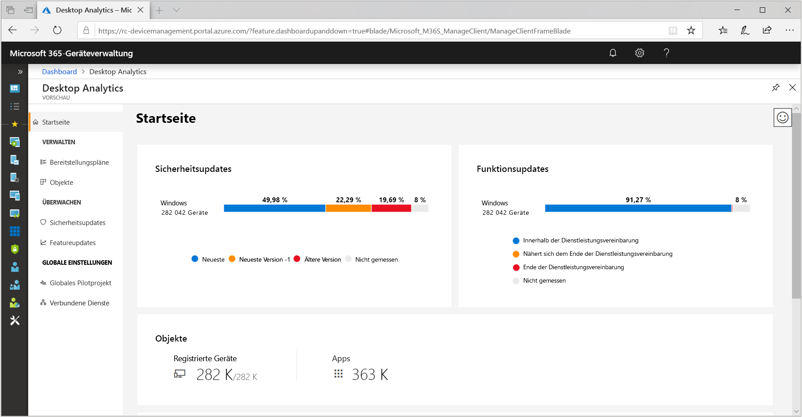
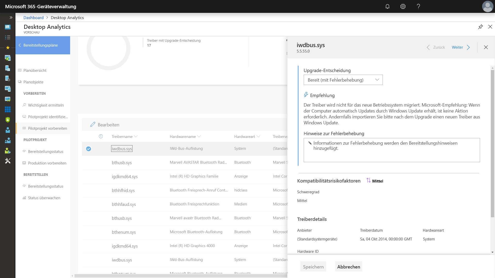
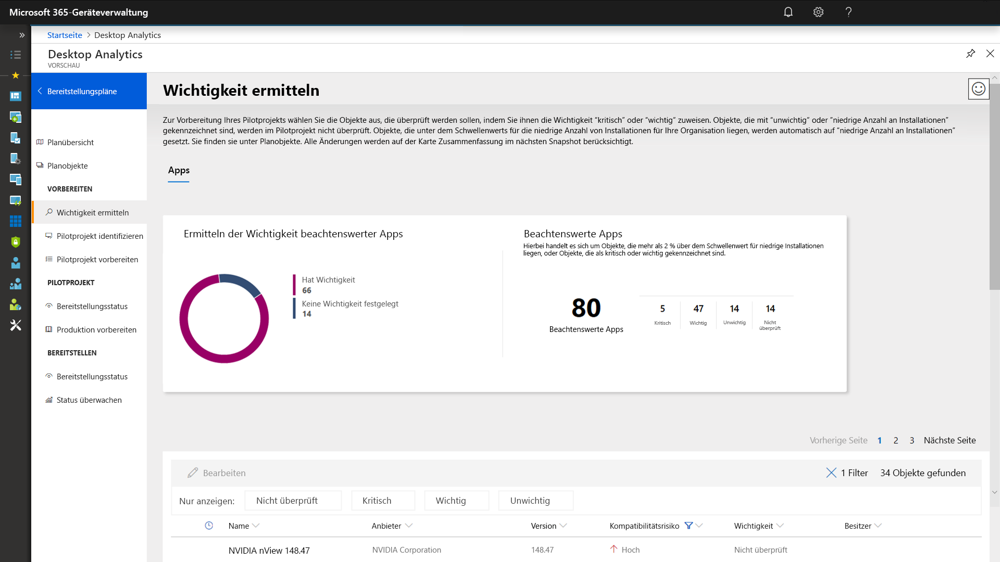
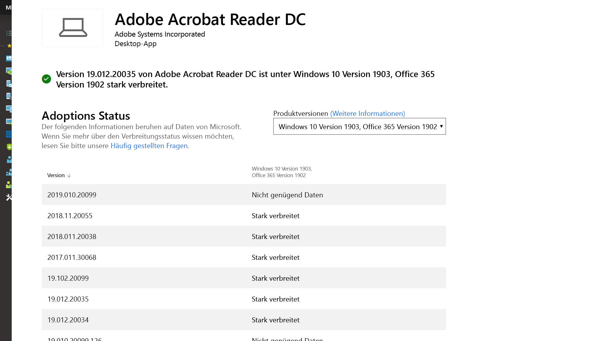
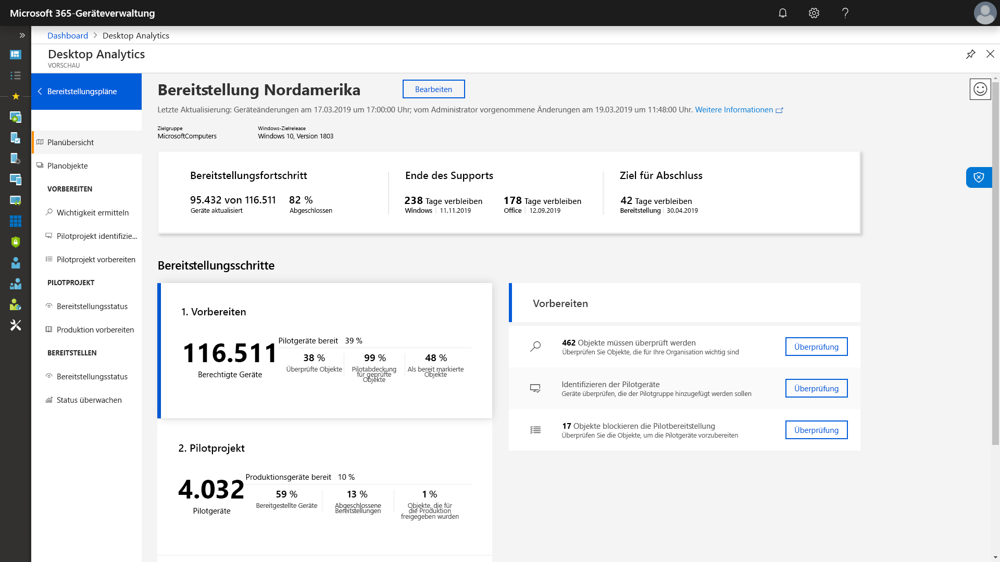

# Schritt 1: Geräte- und App-Bereitschaft

<table>
<thead>
<td></td>
<td>
<strong>Schritt 1: Geräte- und App-Bereitschaft</strong>

Beginnen Sie Ihre Desktopbereitstellung mit einer Bestandsaufnahme Ihrer Geräte und Apps, priorisieren Sie, was Sie für Ihre weitere Arbeit benötigen, testen Sie priorisierte Apps und Geräte, und beheben Sie dann ggf. Probleme, um sich auf die Bereitstellung vorzubereiten.
</td>
<td></td>
</thead>
</table>

>[!NOTE]
>Die Geräte- und App-Bereitschaft ist der erste Schritt in unserem empfohlenem Bereitstellungsprozess, bei dem die ganzheitlichen Aspekte der Anwendungs- und Hardwarekompatibilität behandelt werden. Den vollständigen Desktopbereitstellungsprozess finden Sie im [Desktopbereitstellungscenter](https://aka.ms/HowToShift).
>

In der Vergangenheit war die Anwendungs- und Hardwarekompatibilität bei der Aktualisierung der Desktops der Benutzer eine große Herausforderung. Aber es gibt gute Nachrichten: Wenn Sie auf Windows 10 und Office 365 ProPlus umsteigen möchten, werden alle Anwendungen, die in den letzten zehn Jahren geschrieben wurden, auf Windows 10 ausgeführt, und alle COM-Add-Ins und VBA-Makros, die Ihre Organisation in älteren Versionen von Office (z. B. Office 2010) verwendete, funktionieren (ohne Änderungen) weiterhin in den neusten Versionen von Office.

Nichtsdestotrotz ist das Überprüfen der Anwendungs- und Hardwarekompatibilität in Abhängigkeit von der Größe und dem Alter Ihrer Organisation mit großer Wahrscheinlichkeit nach wie vor ein wichtiger erster Schritt in unserem empfohlenen Bereitstellungsprozess, der aus acht Phasen besteht.

In diesem Artikel führen wir Sie durch diese erste Phase – die Geräte- und App-Bereitschaft – mithilfe der Microsoft-Tools zur Bewertung der Bereitschaft, einschließlich des neuen Tools Desktop Analytics, bei dem es sich um eine intelligente cloudbasierte Lösung handelt, die mit Ihrer Windows-Lizenz verfügbar ist.

## Windows 10-Kompatibilitätsüberprüfung

Vor der Bereitstellung von Windows 10 empfiehlt Microsoft, die Bereitschaft Ihrer vorhandenen Windows 7- oder Windows 8/8.1-Geräte zu überprüfen. Das Windows 10-Installationsmedium unterstützt eine Befehlszeilenoption für die Datei "setup.exe" zum Ausführen des Upgrades, mit der nur die Kompatibilität überprüft, das Upgrade aber nicht ausgeführt wird. ScanOnly kann nur als skriptgesteuerte Batchdatei ausgeführt oder in eine Microsoft Endpoint Configuration Manager-Tasksequenz integriert werden, einschließlich der Möglichkeit, ScanOnly direkt aus dem Netzwerk auszuführen, ohne das Windows 10-Installationsmedium zuvor auf das lokale Gerät zu streamen. Nach Abschluss von ScanOnly werden die Ergebnisse über Rückgabecodes in von "setup.exe" generierte Protokolldateien zurückgegeben.   

Ein Beispiel für eine ScanOnly-Befehlszeile, die die Kompatibilitätsüberprüfung ohne Benutzereingriff ausführt, sieht wie folgt aus:

    Setup.EXE /Auto Upgrade /Quiet /NoReboot /Compat ScanOnly

Weitere Informationen zu ScanOnly und anderen Windows-Setupbefehlsoptionen finden Sie unter [Windows Setup-Befehlszeilenoptionen](https://aka.ms/setupswitches).

## Empfohlenes Tool: Desktop Analytics

Desktop Analytics bietet viele Vorteile gegenüber herkömmlichen Desktopverwaltungssystemen und ist unser empfohlenes Tool. Für Windows Analytics Upgrade Readiness müssen keine Agents bereitgestellt werden, und das Tool führt Sie durch die erforderlichen Schritte unter Verwendung der beim Upgraden von Hunderten von Millionen von Verbraucher-PCs gesammelten Informationen zur Anwendungs- und Treiberkompatibilität. Anhand dieser Informationen erhalten Sie eine detaillierte Bewertung, indem Kompatibilitätsprobleme identifiziert werden, die Ihr Upgrade blockieren könnten, unterstützt durch Links zu vorgeschlagenen Korrekturen, die Microsoft bekannt sind.

Um Desktop Analytics einzurichten, müssen Sie zuerst ein Azure-Abonnement einrichten und einen Azure Log Analytics-Arbeitsbereich hinzufügen. Sobald der Dienst Desktop Analytics ausgeführt wird, können Sie jedes mit dem Internet verbundene Windows 7 SP1- oder neuere Gerät über Gruppenrichtlinieneinstellungen registrieren – so einfach ist das. Es müssen keine Agents bereitgestellt werden, und der visuelle Workflow von Desktop Analytics führt Sie von der Pilotbereitstellung bis zur Produktionsbereitstellung. Wenn Sie möchten, können Sie Daten von Desktop Analytics in Softwarebereitstellungstools wie Microsoft Endpoint Configuration Manager (Current Branch) exportieren, um PCs direkt zu adressieren und Sammlungen zu erstellen, sobald sie für die Bereitstellung bereit sind.

Wenn Sie Windows Desktop derzeit nicht für Ihre Umgebung eingerichtet haben oder sich für eine Testversion registrieren möchten, wechseln Sie zur Desktop Analytics-Seite](https://www.aka.ms/desktopanalytics), und legen Sie los.

## Prozess der Geräte- und App-Bereitschaft

Geräte- und App-Bereitschaft besteht aus vier Schritten: 1. Inventar, 2. Priorisieren, 3. Testen, 4. Fehlerbehebung. Lassen Sie uns alle Schritte nach einander betrachten.

### 1\. Bestandsaufnahme

Der Dienst Desktop Analytics verwendet einen Prozess ohne Agent zur Bestandsaufnahme der Computer und Anwendungen Ihrer gesamten Desktopumgebung. Er stellt außerdem Berichte zu häufig besuchten Internetwebsites, Apps und Intranetspeicherorten bereit, um Sie später bei den Kompatibilitätstests zu unterstützen.

### 2\. Priorisieren

Nach der Bestandsaufnahme können Sie Desktop Analytics verwenden, um die am häufigsten verwendeten Apps und die am häufigsten in Ihrer Organisation verwendete Hardware zu identifizieren und zu priorisieren, und ermitteln, worauf Sie sich konzentrieren müssen, um so viele Computer wie möglich für die Bereitstellung vorzubereiten.

Außerdem erhalten Sie Hilfestellung zur Beurteilung der Updates, die erforderlich sind, um Probleme beim nächsten Schritt, nämlich beim Testen, zu beheben.

### 3\. Testen

Sie werden feststellen, dass die meisten Anwendungen, Treiber und Add-Ins der Bestandsaufnahme in der vorliegenden Form funktionieren. Für Elemente, bei denen Desktop Analytics Probleme feststellt, erhalten Sie bekannte Informationen, z. B., wo Versionsupdates zur Behebung von Kompatibilitätsproblemen zu finden sind. Anstatt Zeit und Ressourcen auf die Lösung komplexer Probleme in nicht kritischen, selten bereitgestellten Anwendungen und älteren Geräten aufzuwenden, können Sie stattdessen mit Benutzern arbeiten, um diese Elemente zurückzuziehen und zu ersetzen.

Desktop Analytics kann auch zur Bewertung der browserbasierten Kompatibilität verwendet werden. Dabei werden Websites und Web-Apps mit Benutzerzugriff identifiziert, die noch ActiveX-Steuerelemente verwenden, sowie Browser-Hilfsobjekte, VBScript, oder andere veraltete Technologie, die nicht vom Microsoft Edge Browser unterstützt wird. Ihre Benutzer müssen weiterhin Internet Explorer 11 für diese Websites verwenden, und Sie können sie mit dem Enterprise Mode Site List Manager zur [Unternehmensmodus-Websiteliste](https://docs.microsoft.com/microsoft-edge/deploy/emie-to-improve-compatibility) hinzufügen.

Um Ihnen den Umstieg auf Office 365 ProPlus zu erleichtern, können Sie außerdem das [Readiness Toolkit für Office](https://docs.microsoft.com/deployoffice/use-the-readiness-toolkit-to-assess-application-compatibility-for-office-365-pro) zum Testen der Kompatibilität Ihrer Add-Ins und VBA-Makros (Microsoft Visual Basic für Applikationen) verwenden.

### 4\. Fehlerbehebung

Die letzte Phase der Geräte- und App-Bereitschaft ist die Fehlerbehebung. In dieser Phase sammeln Sie die erforderlichen Software- oder Treiberpakete; Sie werden diese verwenden, um ältere Versionen im Rahmen des Bereitstellungsprozesses zu ersetzen oder zu aktualisieren.

Wenn Sie die Liste zu behebender Probleme durcharbeiten, werden Sie sehen, dass immer mehr PCs „Bereit für die Bereitstellung“ werden. Dies bedeutet, dass sowohl die Treiber als auch die Apps auf den PCs als kompatibel mit der Version von Windows 10 gekennzeichnet werden, auf die Sie für die Bereitstellung abzielen.

### Configuration Manager-Softwareinventur für Anwendungspriorisierung

Configuration Manager-Softwareinventur ist eine Alternative zur Verwendung von cloudbasierten Analyselösungen für die Geräte- und App-Bereitschaft. Sie können Installationszählungen verwenden und weitere Informationen zu bestimmten Computern abrufen, um Kompatibilitätstests und -validierungen zu priorisieren und Anwendungspakete über Paketeinstellungen mit Windows 10 kompatibel zu machen. Obwohl diese Option nicht die Möglichkeit bietet, bekannte Kompatibilitätsinformationen mit den Analysediensten von Microsoft zu vergleichen, kann sie eine effektive Lösung sein, um eine kleinere Gruppe priorisierter Apps für manuelle Tests zu adressieren. 

Weitere Informationen finden Sie unter [Einführung in die Softwareinventur in Configuration Manager](https://docs.microsoft.com/configmgr/core/clients/manage/inventory/introduction-to-software-inventory) und zum Festlegen von Plattformanforderungen in Anwendungspaketen in [Pakete und Programme im Configuration Manager](https://docs.microsoft.com/configmgr/apps/deploy-use/packages-and-programs).

## App Assure

Ein weiteres Tool, das Ihnen bei der Kompatibilität von Windows 10 und Office 365 ProPlus-Apps hilft, ist das Programm [App Assure](https://aka.ms/appassure), das über das FastTrack Center verfügbar ist. Im Falle gültiger Anwendungsprobleme kann ein Microsoft-Techniker Ihnen über App Assure ohne zusätzliche Kosten bei der Behebung der Anwendungsinkompatibilität helfen.

## Fortgesetzte Verwendung von Diagnosedatentools

Desktop Analytics ist nicht nur ein Tool, das Sie beim Umstieg auf Windows 10 und Office 365 ProPlus unterstützt. Wenn Sie Desktops haben, auf denen Windows 10 und Office 365 ausgeführt wird, können Sie diese verwenden, um die Bereitstellung sowie halbjährliche Featureupdates zu verwalten, damit Sie immer auf dem aktuellen Stand sind.

## Nächster Schritt 

## [Schritt 2: Verzeichnis- und Netzwerkbereitschaft](https://aka.ms/mdd2)
