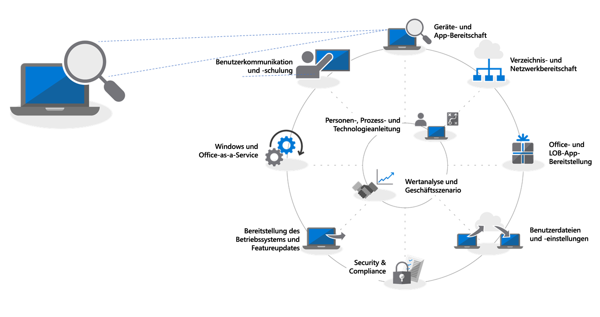
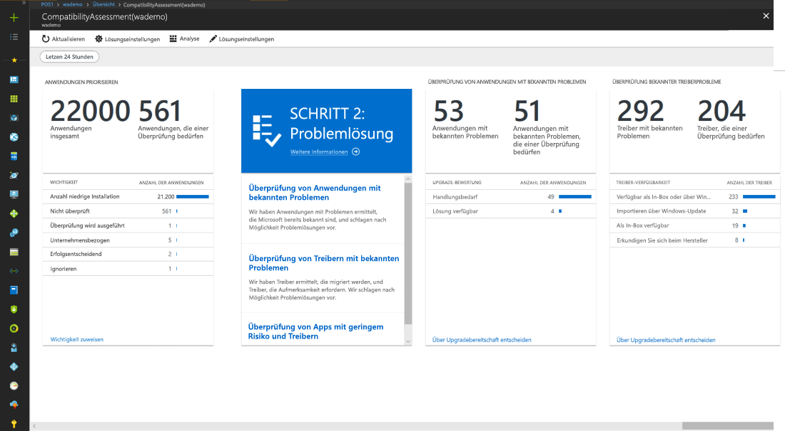
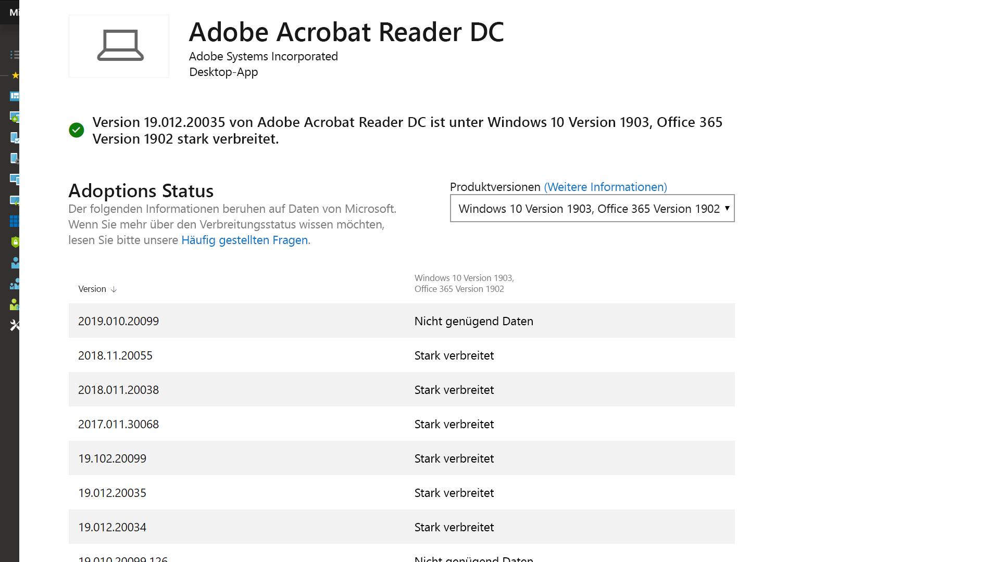

# Schritt 1: Geräte- und App-BereitschaftStep 1: Device and App Readiness

Beginnen Sie Ihre Desktopbereitstellung mit einer Bestandsaufnahme Ihrer Geräte und Apps, priorisieren Sie, was Sie für Ihre weitere Arbeit benötigen, testen Sie priorisierte Apps und Geräte, und beheben Sie dann ggf. Probleme, um sich auf die Bereitstellung vorzubereiten.Begin your desktop deployment project with an inventory of your devices and apps, prioritize what you to move forward, test prioritized apps and devices, then remediate what’s needed to get ready for deployment.

<table>
<thead>
<td></td>
<td>
<strong>Schritt 1: Geräte- und App-Bereitschaft</strong><strong>Step 1: Device and App Readiness</strong>

Beginnen Sie Ihre Desktopbereitstellung mit einer Bestandsaufnahme Ihrer Geräte und Apps, priorisieren Sie, was Sie für Ihre weitere Arbeit benötigen, testen Sie priorisierte Apps und Geräte, und beheben Sie dann ggf. Probleme, um sich auf die Bereitstellung vorzubereiten.Begin your desktop deployment project with an inventory of your devices and apps, prioritize what you to move forward, test prioritized apps and devices, then remediate what’s needed to get ready for deployment.
</td>
<td></td>
</thead>
</table>

>[!NOTE]
>Die Geräte- und App-Bereitschaft ist der erste Schritt in unserem empfohlenem Bereitstellungsprozess, bei dem die ganzheitlichen Aspekte der Anwendungs- und Hardwarekompatibilität behandelt werden. Den vollständigen Desktopbereitstellungsprozess finden Sie im [Bereitstellungscenter für modernen Desktop](https://aka.ms/HowToShift).Device and App Readiness is the first step in our recommended deployment process wheel by covering the holistic aspects of application and hardware compatibility. To see the full desktop deployment process, visit the [Modern Desktop Deployment Center](https://aka.ms/HowToShift).
>

In der Vergangenheit war die Anwendungs- und Hardwarekompatibilität bei der Aktualisierung der Desktops der Benutzer eine große Herausforderung. Aber es gibt gute Nachrichten: Wenn Sie auf Windows 10 und Office 365 ProPlus umsteigen möchten, werden alle Anwendungen, die in den letzten zehn Jahren geschrieben wurden, auf Windows 10 ausgeführt, und alle COM-Add-Ins und VBA-Makros, die Ihre Organisation in älteren Versionen von Office (z. B. Office 2010) verwendete, funktionieren (ohne Änderungen) weiterhin in den neusten Versionen von Office.In the past, a major hurdle to upgrading the users’ desktops is application and hardware compatibility. The good news as you plan your shift to Windows 10 and Office 365 ProPlus, is just about any application written in the last 10 years will run on Windows 10, and any COM add-ins and VBA macros your organization used on versions of Office dating back to Office 2010, will continue to work on the latest versions of Office, without modification.

Nichtsdestotrotz ist das Überprüfen der Anwendungs- und Hardwarekompatibilität in Abhängigkeit von der Größe und dem Alter Ihrer Organisation mit großer Wahrscheinlichkeit nach wie vor ein wichtiger erster Schritt in unserem empfohlenen Bereitstellungsprozess, der aus acht Phasen besteht.That said, depending on the size and age of your organization, verifying application and hardware compatibility is likely still an essential initial step in our recommended 8-phase deployment process.

In diesem Artikel führen wir Sie durch diese erste Phase – die Geräte- und App-Bereitschaft – mithilfe des neuen Upgradebereitschaft-Tools von Windows Analytics, bei dem es sich um eine intelligente, cloudbasierte Lösung handelt, die mit Ihrer Windows-Lizenz verfügbar ist.In this article we take you through that first phase – Device and App Readiness – using the new Windows Analytics Upgrade Readiness tool, an intelligent cloud-based solution available with your Windows license.

Wenn Sie Windows Analytics derzeit nicht für Ihre Umgebung eingerichtet haben oder sich für eine Testversion registrieren möchten, wechseln Sie zur [Windows Analytics-Seite](http://www.aka.ms/windowsanalytics), und legen Sie los.If you don’t currently have Windows Analytics set up for your environment or would like to sign up for a trial, go the [Windows Analytics page](http://www.aka.ms/windowsanalytics) and get started.

## Empfohlenes Tool: Upgradebereitschaft von Windows AnalyticsRecommended Tool: Windows Analytics Upgrade Readiness

Das Tool für die Upgradebereitschaft von Windows Analytics bietet viele Vorteile gegenüber herkömmlichen Desktopverwaltungssystemen und ist unser empfohlenes Tool. Es arbeitet ohne Agent. Sie werden durch die erforderlichen Aufgaben geführt, und es werden die Informationen zur Anwendungs- und Treiberkompatibilität verwendet, die beim Aktualisieren Hunderter Millionen Kunden-PCs gesammelt wurden, damit Sie eine ausführliche Bewertung erhalten und Kompatibilitätsprobleme identifizieren können, die möglicherweise Ihr Upgrade blockieren. Außerdem erhalten Sie Links zu vorgeschlagenen Korrekturen, die Microsoft bekannt sind.Windows Analytics Upgrade Readiness offers many advantages over traditional desktop management systems and is our recommended tool. It is agentless; it guides you through what needs to be done; and, it makes use of application and driver compatibility information gathered through the upgrade of hundreds of millions of consumer PCs, to give you a detailed assessment, identifying compatibility issues that might block your upgrade, with links to suggested fixes known to Microsoft.

Um das Tool für die Upgradebereitschaft von Windows Analytics einzurichten, müssen Sie zunächst ein Azure-Abonnement einrichten und darin einen Azure Log Analytics-Arbeitsbereich einschließen. Wenn der Upgradebereitschaftsdienst von Windows Analytics ausgeführt wird, können Sie alle mit dem Internet verbundenen Windows 7-Geräte mit SP1 oder höher über die Gruppenrichtlinieneinstellungen registrieren. So einfach ist das! Es müssen keine Agents bereitgestellt werden. Anhand des visuellen Workflows des Tools für die Upgradebereitschaft von Windows Analytics werden Sie von der Pilotphase bis hin zur Produktionsbereitstellung geführt. Wenn Sie möchten, können Sie Daten aus der Upgradebereitschaft von Windows Analytics in Softwarebereitstellungstools, z. B. System Center Configuration Manager, exportieren, um direkt auf PCs abzuzielen und Sammlungen zu erstellen, wenn diese bereit zur Bereitstellung sind.To set up Window Analytics Upgrade Readiness you’ll first need to set up an Azure subscription and include an Azure Log Analytics workspace to that. Once you have the Windows Analytics Upgrade Readiness service running, you can then enroll any Internet-connected Windows 7 SP1 or newer device via Group Policy settings. It’s that simple. There are no agents to deploy, and Windows Analytics Upgrade Readiness’s visual workflow guides you from pilot to production deployment. If you wish, you can export data from Windows Analytics Upgrade Readiness to software deployment tools such as System Center Configuration Manager, to target PCs directly and build collections as they become ready for deployment.

## Prozess der Geräte- und App-BereitschaftDevice and App Readiness Process

Die Geräte- und App-Bereitschaft umfasst vier Schritte: 1. Bestandsaufnahme, 2. Priorisieren, 3. Testen, 4. Fehlerbehebung. Wir werden uns nun näher mit den einzelnen Schritten befassen.Device and App Readiness compromises four steps: 1. Inventory, 2. Prioritize, 3. Test, 4. Remediate. Let’s look at each of these in turn.

### 1\. Bestandsaufnahme1\. Inventory

Der Upgradebereitschaftsdienst von Windows Analytics verwendet einen Prozess ohne Agent, um eine Bestandsaufnahme der Computer, Anwendungen und Office-Add-Ins über Ihren Desktop hinweg zu erstellen.Windows Analytics Upgrade Readiness service uses an agent-less process to inventory the computers, applications and Office add-ins across your desktop estate.

Er stellt außerdem Berichte zu häufig besuchten Internetwebsites, Apps und Intranetspeicherorten bereit, um Sie später bei den Kompatibilitätstests zu unterstützen.It also provides reports on highly visited Internet sites, apps and Intranet locations to help you with compatibility testing later.

### 2\. Priorisieren2\. Prioritize

Nach der Bestandsaufnahme können Sie die Upgradebereitschaft von Windows Analytics verwenden, um die am häufigsten verwendeten Apps und die am häufigsten in Ihrer Organisation verwendete Hardware zu identifizieren und zu priorisieren, und ermitteln, worauf Sie sich konzentrieren müssen, um so viele Computer wie möglich für die Bereitstellung vorzubereiten.With inventory taken, Windows Analytics Upgrade Readiness helps you to identify and prioritize the most common apps and hardware used in your organization, and what to focus on to unblock as many PCs as possible for deployment,

Außerdem erhalten Sie Hilfestellung zur Beurteilung der Updates, die erforderlich sind, um Probleme beim nächsten Schritt, nämlich beim Testen, zu beheben.also providing guidance to help you assess the updates are necessary to resolve issues during the next step: testing.

### 3\. Testen3\. Testing

Sie werden feststellen, dass die meisten Anwendungen, Treiber und Add-Ins der Bestandsaufnahme in der vorliegenden Form funktionieren. Für Elemente, bei denen die Upgradebereitschaft von Windows Analytics Probleme feststellt, erhalten Sie bekannte Informationen, z. B., wo Versionsupdates zur Behebung von Kompatibilitätsproblemen zu finden sind. Anstatt Zeit und Ressourcen auf die Lösung komplexer Probleme in nicht kritischen, selten bereitgestellten Anwendungen und älteren Geräten aufzuwenden, können Sie stattdessen mit Benutzern arbeiten, um diese Elemente zurückzuziehen und zu ersetzen.You will find that most of the applications, drivers, and add-ins inventoried, will work as-is. For items Windows Analytics Upgrade Readiness assesses to have issues, it provides you with known information, including where to find version updates to resolve compatibility problems. Rather than devoting time and resource resolving complex issues in non-critical, sparsely deployed applications and older devices, you may choose instead to work with users to retire and replace these items.

Sie können die Upgradebereitschaft von Windows Analytics verwenden, um auch browserbasierte Kompatibilitätsprobleme zu beurteilen und dabei Websites und Web-Apps identifizieren, auf die von Benutzern zugegriffen wird und die immer noch ActiveX-Steuerelemente, Browserhilfsobjekte, VBScript oder andere veraltete Technologien verwenden, die vom Microsoft Edge-Browser nicht unterstützt werden. Ihre Benutzer müssen weiterhin Internet Explorer 11 für diese Websites verwenden, und Sie können diese mithilfe des Enterprise Mode Site List Managers der [Siteliste für den Unternehmensmodus](https://docs.microsoft.com/de-DE/microsoft-edge/deploy/emie-to-improve-compatibility) hinzufügen.You can use Windows Analytics Upgrade Readiness to assess browser-based compatibility issues too, identifying websites and web apps accessed by users still using ActiveX controls, Browser Helper Objects, VBScript, or other legacy technology not supported by the Microsoft Edge browser. Your users will still need to use Internet Explorer 11 for these sites, and you can add them to the [Enterprise Mode site list](https://docs.microsoft.com/de-DE/microsoft-edge/deploy/emie-to-improve-compatibility), using the Enterprise Mode Site List Manager.

Um Ihnen den Umstieg auf Office 365 ProPlus zu erleichtern, können Sie außerdem das [Readiness Toolkit für Office](https://docs.microsoft.com/de-DE/deployoffice/use-the-readiness-toolkit-to-assess-application-compatibility-for-office-365-pro) zum Testen der Kompatibilität Ihrer Add-Ins und VBA-Makros (Microsoft Visual Basic für Applikationen) verwenden.Additionally, to assist in your move to Office 365 ProPlus, you may wish to make use of the [Readiness Toolkit for Office](https://docs.microsoft.com/de-DE/deployoffice/use-the-readiness-toolkit-to-assess-application-compatibility-for-office-365-pro) to test the compatibility of your add-ins and Microsoft Visual Basic for Applications (VBA) macros.

### 4\. Fehlerbehebung4\. Remediation

Die letzte Phase der Geräte- und App-Bereitschaft ist die Fehlerbehebung. In dieser Phase sammeln Sie die erforderlichen Software- oder Treiberpakete; Sie werden diese verwenden, um ältere Versionen im Rahmen des Bereitstellungsprozesses zu ersetzen oder zu aktualisieren.As the final phase of device and app readiness is to ‘remediate’. Here you’ll want to collect the required software or driver packages; you are going to use these to supersede or update older versions as part of the deployment process.

Wenn Sie die Liste zu behebender Probleme durcharbeiten, werden Sie sehen, dass immer mehr PCs „Bereit für die Bereitstellung“ werden. Dies bedeutet, dass sowohl die Treiber als auch die Apps auf den PCs als kompatibel mit der Version von Windows 10 gekennzeichnet werden, auf die Sie für die Bereitstellung abzielen.As you work through the list remediating issues, you’ll see that more and more PCs become “Ready for Deployment”. This means that both the drivers and apps on the PCs are noted as compatible with the version of Windows 10 you are targeting for deployment.

## Weiterverwendung von TelemetrietoolsContinued use of telemetry tools

Die Upgradebereitschaft von Windows Analytics ist nicht nur ein Tool, das Sie beim Umstieg auf Windows 10 und Office ProPlus 365 unterstützt. Wenn Sie Desktops haben, auf denen Windows 10 und Office 365 ausgeführt wird, können Sie diese verwenden, um die Bereitstellung sowie halbjährliche Featureupdates zu verwalten, damit Sie immer auf dem aktuellen Stand sind.Windows Analytics Upgrade Readiness isn’t just a tool to help you shift to Windows 10 and Office 365 ProPlus. Once you have desktops running on Windows 10 and Office 365 you can use it to help maintain your deployment and manage semi-annual Feature Updates so that you can stay current.

## Nächster SchrittNext Step 

## [Schritt 2: Verzeichnis- und NetzwerkbereitschaftStep 2: Directory and Network Readiness](https://aka.ms/mdd2)