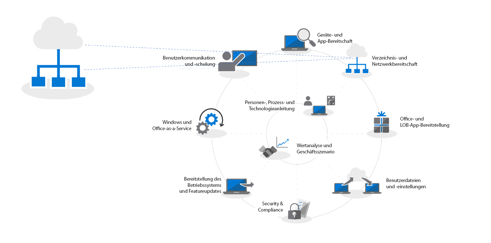
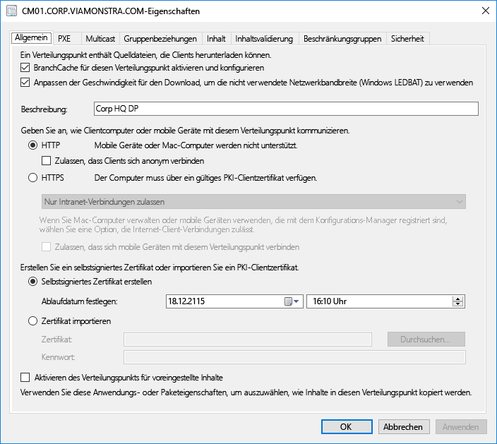
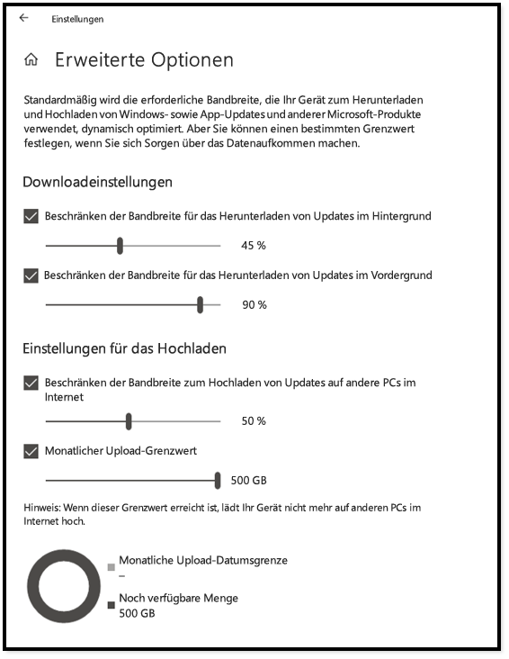
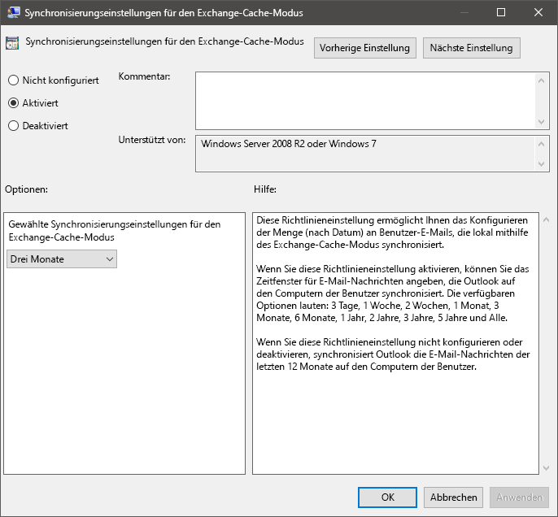
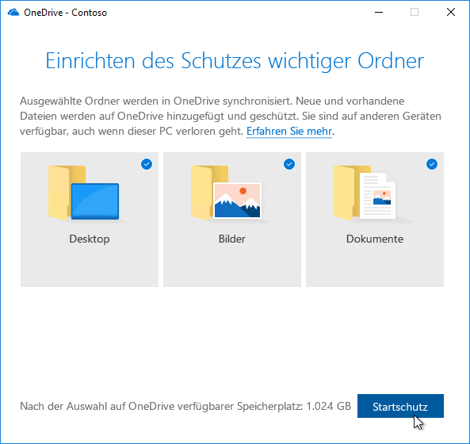

# Schritt 2: Verzeichnis- und Netzwerkbereitschaft

Stellen Sie sicher, dass das Verzeichnis und das Netzwerk konfiguriert und bereit sind, den Wechsel zu Windows 10 und Office 365 ProPlus zu unterstützen. Hierzu muss Azure Active Directory Services für Benutzer aktiviert sein, und das Netzwerk muss in der Lage sein, den normalen Datenverkehr sowie die Bewegung von potenziell riesigen Mengen an Daten zu verarbeiten, während PCs aktualisiert und Benutzerdateien, Einstellungen und Anwendungen wiederhergestellt werden.

<table>
<thead>
<td></td>
<td>
<strong>Schritt 2: Verzeichnis- und Netzwerkbereitschaft</strong>

Mit der Cloud verbundene Dienste in Office 365 ProPlus und neue Bereitstellungsoptionen wie Windows Autopilot erfordern Azure Active Directory. Netzwerk und Konnektivität sind auch wichtige Bereiche, die beim Verschieben von Windows-Abbildern, Apps, Treibern und zugehörigen Dateien auf Ihre Computer geplant werden müssen. Erfahren Sie, wie Sie mit neuen Tools und Bereitstellungsoptionen den Netzwerkverkehr reduzieren und optimieren können.
</td>
<td></td>
</thead>
</table>

>[!NOTE]
>Die Verzeichnis- und Netzwerkbereitschaft ist der zweite Schritt in unserem empfohlenem Bereitstellungsprozess, der sich auf Azure Active Directory und die Netzwerkoptimierung konzentriert. Den vollständigen Desktopbereitstellungsprozess finden Sie im [Bereitstellungscenter für modernen Desktop](https://aka.ms/HowToShift).
>

Die Verzeichnis- und Netzwerkbereitschaft ist eine grundlegende Voraussetzung, um eine reibungslose Betriebssystem- und Desktopbereitstellung zu gewährleisten. Wie bei der automatisierten Bereitstellung ist es auch hier wichtig, dass Dateifreigaben erreichbar sind, und das Netzwerk muss die Übertragung von sehr großen Dateien auf möglicherweise Hunderte oder Tausende von PCs gleichzeitig unterstützen.

Beim Wechsel zu Windows 10 und Office 365 ProPlus müssen Sie außerdem sicherstellen, dass cloudbasierte Identität in Azure Active Directory eingerichtet ist. Dies ist nicht nur für die Aktivierung von Office 365 ProPlus äußerst wichtig, sondern ermöglicht Ihnen auch, moderne Bereitstellungslösungen wie Windows Autopilot zu nutzen.

In diesem Artikel erfahren Sie mehr über die Tools und Optionen zum Vorbereiten der Verzeichnisdienste sowie Benutzer- und Geräteberechtigungen für die Bereitstellung in Windows 10 und Office 365 ProPlus.

## Hinzufügen von Azure Active Directory

Wenn Ihre Organisation bereits Office 365, Exchange Online, Microsoft Intune oder andere Microsoft Online-Dienste verwendet, ist die gute Nachricht, dass Sie bereits Azure Active Directory verwenden. Wenn dies der Fall ist, müssen Sie nur sicherzustellen, dass die Benutzer, für die Sie die Desktopbereitstellung vornehmen möchten, in Ihrem Azure Active Directory vorhanden sind, und dass Lizenzen zugewiesen wurden.

Wenn Sie Azure Active Directory noch nicht verwenden, gibt es [umfassende Ressourcen](https://docs.microsoft.com/de-DE/azure/active-directory/), die Ihnen bei der Einrichtung helfen. Sie sind möglicherweise für die persönliche Unterstützung über Microsoft FastTrack berechtigt, als Teil Ihrer Office 365-Lizenz. Weitere Informationen über Microsoft Fastrack finden Sie [hier](https://fasttrack.microsoft.com).

Sobald Sie Azure Active Directory eingerichtet haben, können sich die Benutzer anmelden und ihre Office 365 ProPlus-Apps aktivieren, und Sie können die Microsoft Intune- oder Windows Autopilot-Bereitstellung für die automatisierte Bereitstellung von Apps und Richtlinien verwenden.

## Netzwerkbereitschaft

Sie müssen bei der Planung der Bereitstellung die Anforderungen an die Netzwerkbandbreite berücksichtigen. Es gibt drei Hauptkomponenten in einer Bereitstellung, die sich auf das Netzwerk auswirken: PC-Imaging, Softwareupdates und Benutzerpersonalisierung. Zusammen können sie mehr als 20 GB pro PC für die anfängliche Migration beanspruchen sowie oft mindestens 1 GB pro Monat und PC, um den PC auf dem neuesten Stand zu halten.

Sehen wir uns zunächst die Anforderungen jeder einzelnen dieser drei Hauptkomponenten an:

### PC-Imageerstellung

Das unten aufgeführte Diagramm hilft Ihnen beim Planen basierend auf der Imagegröße. Bei Windows-Images ohne Anpassungen sollten Sie in der Regel 3 GB pro PC einplanen, während Sie für angepasste Images mit Apps möglicherweise 6 GB oder mehr benötigen. Sie müssen möglicherweise auch Treiberpakete berücksichtigen. Diese können einige Hundert Megabyte pro PC, manchmal bis zu 1GB groß sein.

### Softwareupdates

Sie müssen nach Netzwerkbandbreite für Softwareupdates einplanen. Windows 10 und Office 365 ProPlus verwenden ein Servicemodell mit monatlichen und halbjährliche Updates. Wenn Sie mit diesem Modell noch nicht vertraut sind, erfahren Sie [hier](https://docs.microsoft.com/de-DE/windows/deployment/update/waas-overview) mehr zu seiner Funktionsweise.

Das neue Servicemodell umfasst Featureupdates für Windows zwei Mal im Jahr, halbjährliche Kanalupdates für Office und monatliche Qualitätsupdates. Featureupdates sind in der Regel 2 bis 4 GB groß, und halbjährliche Kanalupdates für Office 300 bis 400 MB pro Update. Dann gibt es noch die monatlichen Qualitätsupdates. Diese können ein paar Hundert Megabyte (MB) bis über 1 GB groß sein. Dies liegt daran, dass monatliche Updates kumulativ sind, sodass ihre Größe während der Lebensdauer für jede Version von Windows 10 stetig zunimmt. Es gibt jedoch Tools, mit denen sich die Datenmenge reduzieren lässt, die zum Implementieren von Updates im Netzwerk übertragen werden muss. Dies wird weiter unten ausführlicher erläutert.

### Benutzerpersonalisierung

Die dritte Komponente, die berücksichtigt werden muss, ist die Benutzeranpassung. Hier müssen Sie Netzwerkbandbreite einplanen, um die Wiederherstellung von Benutzerdateien, ihrer Einstellungen und ihrer Anwendungen als Teil des PC-Aktualisierungs- oder -Ersetzungsprozesses zu ermöglichen. Zusammen sind diese Elemente häufig größer als 20 GB pro PC. Bei einigen Benutzern können Sie 100 GB überschreiten.

## **Beschränken der Bandbreite**

Eine Möglichkeit, um die Auswirkungen des auf die Bereitstellung bezogenen Datenverkehrs im Netzwerk zu beschränken, ist die Drosselung mit der BITS-Einstellung (Background Intelligent Transfer Service) auf Clients. BITS verwendet eine adaptive Bitrate (ABR), um die Bandbreite anzupassen, die für Bereitstellungszwecke verfügbar ist. Sie kann mit einer Gruppenrichtlinie auf Clients konfiguriert werden.

[Informationen zu BITS](https://docs.microsoft.com/de-DE/windows/desktop/bits/about-bits)

Wenn Sie System Center Configuration Manager verwenden, können Sie auch BITS-fähige Verteilungspunkte konfigurieren oder Multicast mit WDS aktivieren.

Die Drosselung von bestimmtem Datenverkehr bedeutet, dass der normale Netzwerkdatenverkehr weniger durch PCs, die Updates und Anwendungen herunterladen, beeinträchtigt wird. Indem ein bestimmter Prozentsatz der Bandbreite für diese Vorgänge reserviert wird, wird sichergestellt, dass die Produktivität durch die Windows- oder Office-Bereitstellung nicht beeinträchtigt wird, und Prozesse werden weiterhin nach Bedarf ausgeführt. Dies kann jedoch dazu führen, dass die Ausfallzeiten bei der Bereitstellung länger werden, wenn der Benutzerzugriff während der Durchführung einer Bereitstellung auf dem PC gesperrt ist.

Glücklicherweise gibt es neue Tools, die es Ihnen erleichtern, die Auswirkungen umfangreicher Desktopbereitstellung auf das Netzwerk zu verwalten, einschließlich LEDBAT zur Optimierung der Nutzung der verfügbaren Bandbreite sowie Peer-zu-Peer-Optionen (P2P), mit denen der Bereitstellungsverkehr vom Zentrum des Netzwerks an die Peripherie verlagert wird.

## **Aufräumen der Bandbreite**

LEDBAT (Low Extra Delay Background Transport), das in Windows Server 2019 and System Center Configuration Manager Version 1806 unterstützt wird, ist auf die Optimierung des Netzwerkverkehrs für Windows-Clients ausgelegt.

[Top 10 Netzwerkfeatures in Windows Server 2019: \#9 LEDBAT – Latency Optimized Background Transport](https://blogs.technet.microsoft.com/networking/2018/07/25/ledbat/)

Im Gegensatz zur herkömmlichen Drosselung kann LEDBAT die gesamte verfügbare Netzwerkbandbreite als Hintergrundaufgabe nutzen und sofort Bandbreite bereitstellen, wenn anderer Datenverkehr sie anfordert. Im Gegensatz zu BITS gibt es hierbei keine Verzögerung. Alles ist automatisiert, es ist keine manuelle Optimierung oder Planung erforderlich, und alles ist serverseitig eingerichtet. Dies ermöglicht potenziell riesige Leistungsgewinne.

## **Peer-zu-Peer-Optionen**

Peer-zu-Peer-Optionen werden zunehmend bei Windows 10-Migrationen, für PC-Imaging, Softwareupdates und Benutzerpersonalisierung verwendet. Sie sind auch nützlich, um Build-zu-Build-Upgrades nach der anfänglichen Bereitstellung von Windows 10 zu vereinfachen. Wir erläutern hier mehrere Beispiele, um durch Windows 10 und Office verursachten Datenverkehr vom Zentrum des Netzwerks weg zu leiten, wobei die Notwendigkeit herkömmlicher Drosselungsansätze verringert wird. PCs können dann die aktualisierten Dateien, die sie benötigen, auf den Peercomputern im lokalen Netzwerk finden und müssen sie nicht von einem Verteilungspunkt oder aus dem Internet herunterladen.

**BranchCache** unterstützt Sie beim Herunterladen von Inhalten aus verteilten Umgebungen, ohne dass das Netzwerk ausgelastet wird. Es bietet zwei Optionen: Den Modus „Gehosteter Cache“, mit dem Sie lokale Server zum Zwischenspeichern von Inhalt verwenden können, und den Modus „Verteilter Cache“ (ein Modus, der in System Center Configuration Manager unterstützt wird), mit dem Clients bereits heruntergeladenen Inhalt miteinander teilen können.

**Peercache** Clients, die von System Center Configuration Manager unterstützt werden, können darüber hinaus den Peercache verwenden. Dies ermöglicht PCs, die zuverlässig im Netzwerk verfügbar sind, Quellen für die Inhaltsverteilung zu hosten. Sie sollten diese Option nicht für alle PCs aktivieren, sondern nur für Ziele mit einer zuverlässigen Netzwerkverbindung als Hosts (z. B. Desktop, Minitower- oder Tower-PCs). Der Peercache kann möglicherweise sogar für Bereitstellungsaufgaben funktionieren, die beim Setup in Windows PE-Phasen ausgeführt werden.

Hinweis: BranchCache and Peercache ergänzen sich und können zusammen in derselben Umgebung ausgeführt werden.

[Branch-Cache und Peercache](https://blogs.technet.microsoft.com/swisspfe/2018/01/25/branch-cache-vs-peer-cache/)

**Übermittlungsoptimierung** Die Übermittlungsoptimierung ist eine weitere Peer-zu-Peer Technologie für die Zwischenspeicherung, die auf dem Netzwerk basierende Steuerungen für Windows-Bereitstellungen bietet. Verwenden Sie die Windows 10-Übermittlungsoptimierung, um integrierte UWP-Apps zu aktualisieren und um Anwendungen aus dem Microsoft Store sowie Softwareupdates mit Express-Updates zu installieren. Sie ist seit den frühen Versionen von Windows 10 verfügbar, wurde jedoch erst kürzlich mit System Center Configuration Manager integriert. Seit Windows 10 Version 1803 bedeuten neue Konfigurationsoptionen, dass Sie jetzt unabhängig voneinander Bandbreitengrenzwerte für die Aktualisierung im Hintergrund und Vordergrundaufgaben wie das Installieren einer App aus dem Store festlegen können.

**Weitere Aspekte für Office 365 ProPlus**

Nachfolgend sind drei Elemente aufgeführt, mit denen die Netzwerkauslastung aufgrund von Office 365 ProPlus-Bereitstellungen verringert werden kann.

**Binary Delta Compression (Binärdeltakomprimierung)** Office 365 ProPlus verwendet die Binary Delta Compression, um die Bandbreite zu verringern, die von Softwareupdates beim Aktualisieren von der neuesten Version von Office 365 ProPlus auf die nächste Version beansprucht wird. Indem nur die Änderungen auf Binärebene im Vergleich zur vorherigen Version abgerufen werden, werden die Auswirkung der monatlich wachsenden kumulativen Updates minimiert. So können bis zu mehrere Hundert MB von Daten pro PC jeden Monat eingespart werden. Um diese Funktion nutzen zu können, können Sie jedoch keine Versionen überspringen. Fall Sie dies doch tun, müssen Sie das gesamte kumulative Update herunterladen.

[Herunterladen von Updates für Office 365](https://docs.microsoft.com/de-DE/deployoffice/overview-of-the-update-process-for-office-365-proplus#download-the-updates-for-office-365-proplus)

**Outlook-Datendateien** Outlook wird oft so konfiguriert, dass es das gesamte Postfach eines Benutzer für die Offlineverwendung lokal zwischenspeichert. Dies bedeutet, dass bei jeder Windows-Bereitstellung, außer bei einem direkten Upgrade, die Outlook-Datendateien nach der Aktualisierung wieder neu erstellt werden müssen. Dies ist ein automatisierter Prozess, wobei die Outlook-Postfachgrößen in der Regel auf 100 GB festgelegt ist und das erneute lokale Zwischenspeichern des gesamten Postfachs die Übertragung einer großen Datenmenge erfordert. Um die Auslastung des Netzwerks zu verringern, sollten Sie die Verwendung einer Gruppenrichtlinie in Betracht ziehen, mit der die Einstellung für die offline zu speichernden Mails verringert wird. In Outlook in Office 365 ProPlus oder Outlook 2016 ist der Standardwert auf zwölf Monate festgelegt. Ziehen Sie in Betracht, diese Einstellung in einen bis sechs Monate zu ändern. Die Änderung dieser Einstellung wirkt sich nicht auf die Größe des Onlinepostfachs aus, und Sie können das gesamte Postfach weiterhin mit Outlook durchsuchen, wenn Sie online sind.

**OneDrive-Dateien bei Bedarf und Verschieben von bekannten Ordnern** OneDrive ist eine hervorragende Möglichkeit zum Synchronisieren und Schützen von Benutzerdateien auf PCs und anderen Geräten in der Cloud. Mit der Option zum Verschieben von bekannten Ordnern können Sie die Synchronisierung von Dateien aus den Ordnern „Desktop“, „Dokumente“ und „Bilder“ in OneDrive erzwingen, sodass diese Dateien zur Verfügung stehen, wenn der Benutzer sich bei einem neuen Gerät oder auf einem PC mit neuem Image anmeldet. Beachten Sie jedoch, dass Sie aufgrund der umfangreichen Größe an Dateien, die in den Ordnern „Desktop“, „Dokumente“ und „Bilder“ gespeichert sind, das Rollout von Richtlinien, die OneDrive auf den PCs aktivieren und erzwingen, genau planen müssen. Eine Option besteht darin, die Gruppenrichtlinie-Netzwerksteuerungen zu verwenden, um die von OneDrive-Synchronisierungsdienst verwendete Bandbreite zu drosseln.

[Einrichten der Verschiebung bekannter Ordner](https://techcommunity.microsoft.com/t5/Microsoft-OneDrive-Blog/Migrate-Your-Files-to-OneDrive-Easily-with-Known-Folder-Move/ba-p/207076)

[OneDrive-Dateien nach Bedarf](https://www.microsoft.com/de-DE/microsoft-365/blog/2017/05/11/introducing-onedrive-files-on-demand-and-additional-features-making-it-easier-to-access-and-share-files/)

Wenn Sie OneDrive noch nicht ausgerollt haben, ist der Übergang von Windows 7 zu Windows 10 eine gute Gelegenheit, um OneDrive zu aktivieren, und es kann problemlos in Office 365 ProPlus integriert werden. Ziehen Sie den Beginn dieses Rollouts in Betracht, wenn Sie die App- und Gerätebereitschaft bearbeiten. Hierdurch erhalten Sie bei der Dateisynchronisierung einen Vorsprung, bevor Sie mit dem Verschieben von Windows-Images und dem Bereitstellen von Apps über das Netzwerk beginnen.

## Nächster Schritt 

## [Schritt 3: Liefern von Office- und Branchen-Apps](https://aka.ms/mdd3)

## Vorheriger Schritt:

## [Schritt 1: Geräte- und App-Bereitschaft](https://aka.ms/mdd1)

## Feedback

Ihre Meinung ist uns wichtig. Wählen Sie die Art von Feedback, die Sie geben möchten:

Feedback zu Produkten – Melden Sie sich an, um Feedback zur Dokumentation zu geben

Unser neues Feedbacksystem basiert auf GitHub-Problemen. Erfahren Sie mehr über diese Änderung in unserem Blogbeitrag.
