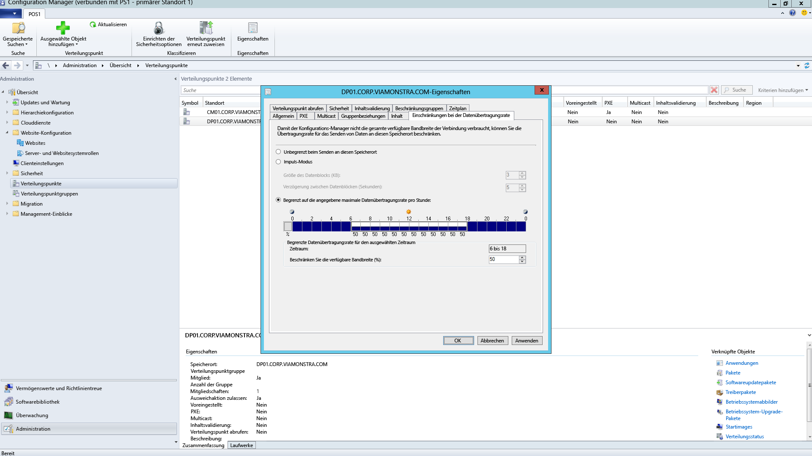
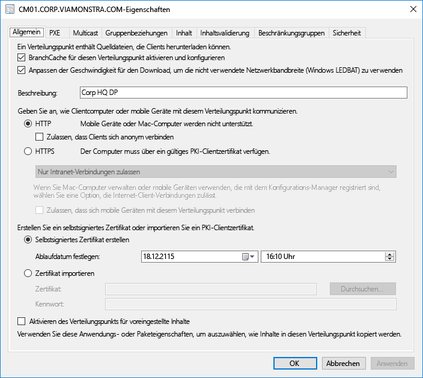
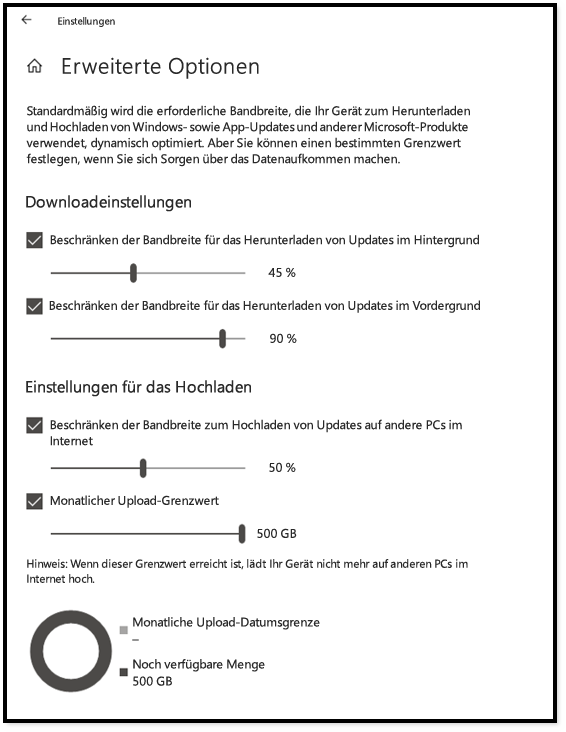
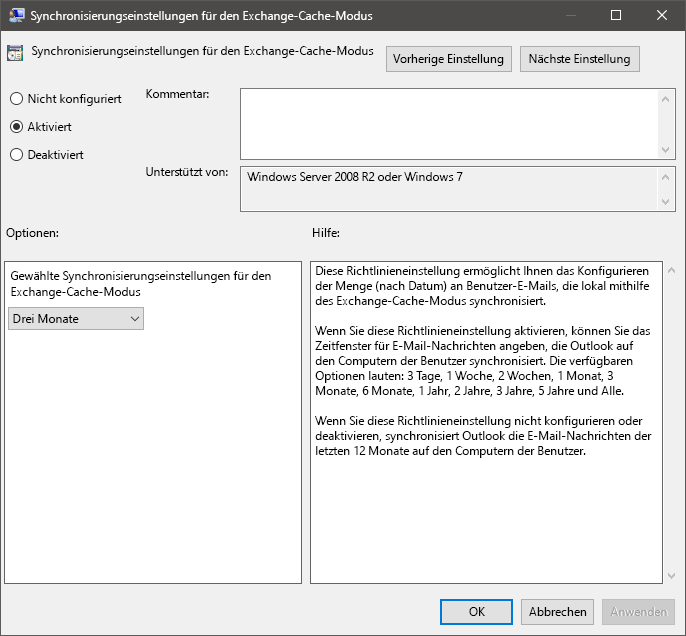
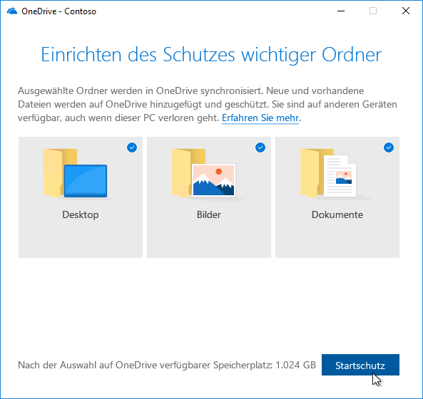

# Schritt 2: Verzeichnis- und NetzwerkbereitschaftStep 2: Directory and Network Readiness

Ensure your directory and the network are configured and ready to support to your shift to Windows 10 and Microsoft 365 Apps for enterprise.Ensure your directory and the network are configured and ready to support to your shift to Windows 10 and Microsoft 365 Apps for enterprise. This will require Azure Active Directory Services to be in place for users, and your network must have the capacity to handle both its regular traffic and the movement of potentially vast amounts of data as PCs are upgraded, and users’ files, settings and applications are restored.This will require Azure Active Directory Services to be in place for users, and your network must have the capacity to handle both its regular traffic and the movement of potentially vast amounts of data as PCs are upgraded, and users’ files, settings and applications are restored.

<table>
<thead>
<td></td>
<td>
<strong>Schritt 2: Verzeichnis- und Netzwerkbereitschaft</strong><strong>Step 2: Directory and Network Readiness</strong>

Cloud connected services in Microsoft 365 Apps for enterprise and new deployment options like Windows Autopilot require Azure Active Directory.Cloud connected services in Microsoft 365 Apps for enterprise and new deployment options like Windows Autopilot require Azure Active Directory. Your network and connectivity are also important areas to plan when moving Windows images, apps, drivers and related files to your PCs.Your network and connectivity are also important areas to plan when moving Windows images, apps, drivers and related files to your PCs. Learn how new tools and deployment options reduce and streamline network traffic.Learn how new tools and deployment options reduce and streamline network traffic.
</td>
<td></td>
</thead>
</table>

>[!NOTE]
>Die Verzeichnis- und Netzwerkbereitschaft ist der zweite Schritt in unserem empfohlenem Bereitstellungsprozess, der sich auf Azure Active Directory und die Netzwerkoptimierung konzentriert.Directory and Network Readiness is the second step in our recommended deployment process wheel focusing on Azure Active Directory and optimizing the network. Den vollständigen Desktopbereitstellungsprozess finden Sie im [Desktopbereitstellungscenter](https://aka.ms/HowToShift).To see the full desktop deployment process, visit the [Desktop Deployment Center](https://aka.ms/HowToShift).
>

Directory and Network readiness is fundamental to ensuring a smooth OS and desktop deployment.Directory and Network readiness is fundamental to ensuring a smooth OS and desktop deployment. As with any automated deployment, it is important to ensure your file shares can be reached, and your network will need to be able to support the transfer of very large files, possibly to hundreds or even thousands of PCs at a time.As with any automated deployment, it is important to ensure your file shares can be reached, and your network will need to be able to support the transfer of very large files, possibly to hundreds or even thousands of PCs at a time.

With your shift to Windows 10 and Microsoft 365 Apps for enterprise you also now need to make sure that cloud-based identity is set up with Azure Active Directory.With your shift to Windows 10 and Microsoft 365 Apps for enterprise you also now need to make sure that cloud-based identity is set up with Azure Active Directory. This is key not only to activating Microsoft 365 Apps for enterprise, it also allows you to take advantage of modern provisioning solutions like Windows Autopilot.This is key not only to activating Microsoft 365 Apps for enterprise, it also allows you to take advantage of modern provisioning solutions like Windows Autopilot.

In diesem Artikel erfahren Sie mehr über die Tools und Optionen zum Vorbereiten der Verzeichnisdienste sowie Benutzer- und Geräteberechtigungen für die Bereitstellung in Windows 10 und Microsoft 365 Apps for Enterprise.In this article we’ll explore the tools and options to prepare your directory services, and user and device permissions, ready for deployment to Windows 10 and Microsoft 365 Apps for enterprise.

## Hinzufügen von Azure Active DirectoryAdding Azure Active Directory

Wenn Ihre Organisation bereits Office 365, Exchange Online, Microsoft Intune oder andere Microsoft Online-Dienste verwendet, ist die gute Nachricht, dass Sie bereits Azure Active Directory verwenden.If your organization already uses Office 365, Exchange Online, Microsoft Intune, or other Microsoft Online services, the good news is you are already using Azure Active Directory. Wenn dies der Fall ist, müssen Sie nur sicherzustellen, dass die Benutzer, für die Sie die Desktopbereitstellung vornehmen möchten, in Ihrem Azure Active Directory vorhanden sind, und dass Lizenzen zugewiesen wurden.If you are, you just need to ensure that the users you are targeting for desktop deployment are in your Azure Active Directory and that licenses have been assigned.

Wenn Sie Azure Active Directory noch nicht verwenden, gibt es [zahlreiche Ressourcen](https://docs.microsoft.com/azure/active-directory/), die Ihnen bei der Einrichtung helfen.If you are not currently using Azure Active Directory, there are [numerous resources](https://docs.microsoft.com/azure/active-directory/) to help you set it up. Sie sind möglicherweise zu persönlicher Unterstützung über Microsoft FastTrack berechtigt, als Teil Ihrer Lizenz.You may well qualify for personalized assistance via Microsoft FastTrack, as part of your license. Weitere Informationen über Microsoft FastTrack erhalten Sie [hier](https://fasttrack.microsoft.com).You can check out more about Microsoft FastTrack [here](https://fasttrack.microsoft.com).

Sobald Sie Azure Active Directory eingerichtet haben, können sich die Benutzer anmelden und ihre Microsoft 365 Apps for Enterprise-Apps aktivieren, und Sie können die Microsoft Intune- oder Windows Autopilot-Bereitstellung für die automatisierte Bereitstellung von Apps und Richtlinien verwenden.Once you have Azure Active Directory in place, your users can sign in to and activate their Microsoft 365 Apps for enterprise apps, and you can use Microsoft Intune or Windows Autopilot deployment for automated deployment of apps and policy.

## NetzwerkbereitschaftNetwork Readiness

Sie müssen bei der Planung der Bereitstellung die Anforderungen an die Netzwerkbandbreite berücksichtigen.You must consider bandwidth requirements when planning your deployments. Es gibt drei Hauptkomponenten in einer Bereitstellung, die sich auf das Netzwerk auswirken: PC-Imaging, Softwareupdates und Benutzerpersonalisierung.There are three main components in a deployment that will have an impact on your network – PC imaging, software updates, and user personalization. Zusammen können sie mehr als 20 GB pro PC für die anfängliche Migration beanspruchen sowie oft mindestens 1 GB pro Monat und PC, um den PC auf dem neuesten Stand zu halten.Between them, this can mean in excess of 20 GB per PC for the initial migration, and often 1 GB or more per month per PC to stay up-to-date.

Sehen wir uns zunächst die Anforderungen jeder einzelnen dieser drei Hauptkomponenten an:Let’s start by exploring the requirements of each of these three main components:

### PC-ImageerstellungPC Imaging

Bei Windows-Images ohne Anpassungen sollten Sie in der Regel 3 GB pro PC einplanen, während Sie für angepasste Images mit Apps möglicherweise 6 GB oder mehr benötigen.For Windows Images with no customization you should plan typically for 3GB per PC, while for customized images with apps you may need to allow 6GB, or more. Sie müssen möglicherweise auch Treiberpakete berücksichtigen. Diese können einige Hundert Megabyte pro PC, manchmal bis zu 1GB groß sein.You may also need to consider Driver packages; these can be a few hundred megabytes per PC, sometimes up to 1GB.

### SoftwareupdatesSoftware Updates

Sie müssen nach Netzwerkbandbreite für Softwareupdates einplanen.You’ll need to plan network bandwidth for software updates. Windows 10 und Microsoft 365 Apps for Enterprise verwenden ein neues Wartungsmodell mit monatlichen und halbjährlichen Updates.Windows 10 and Microsoft 365 Apps for enterprise use a new servicing model delivering monthly and semi-annual updates. Wenn Sie mit diesem Modell noch nicht vertraut sind, erfahren Sie [hier](https://docs.microsoft.com/windows/deployment/update/waas-overview) mehr zu seiner Funktionsweise.If you are new to this model, you can learn more about how this works [here](https://docs.microsoft.com/windows/deployment/update/waas-overview).

The new servicing model includes Feature Updates for Windows twice a year, Office Semi-Annual Enterprise Channel Updates, and monthly Quality Updates.The new servicing model includes Feature Updates for Windows twice a year, Office Semi-Annual Enterprise Channel Updates, and monthly Quality Updates. Feature Updates are typically 2 – 4GB in size, and Office Semi-Annual Enterprise Channel updates are 300 – 400 MB per update.Feature Updates are typically 2 – 4GB in size, and Office Semi-Annual Enterprise Channel updates are 300 – 400 MB per update. Then there are the monthly Quality Updates.Then there are the monthly Quality Updates. These may range from a few hundred megabytes to over a gigabyte.These may range from a few hundred megabytes to over a gigabyte. This is because monthly updates are cumulative, so these increase in size over the servicing lifetime for each Windows 10 version.This is because monthly updates are cumulative, so these increase in size over the servicing lifetime for each Windows 10 version. That said, there are tools that can help reduce the amount of data that must pass over the network to implement updates.That said, there are tools that can help reduce the amount of data that must pass over the network to implement updates. We will cover this in more detail below.We will cover this in more detail below.

### BenutzerpersonalisierungUser Personalization

The third component to consider is user personalization.The third component to consider is user personalization. Here you need to plan network bandwidth to accommodate the restoring of user files, their settings, and their applications as part of the PC refresh or replacement process.Here you need to plan network bandwidth to accommodate the restoring of user files, their settings, and their applications as part of the PC refresh or replacement process. Together, these items often exceed 20 GB per PC; for some users these may exceed 100 GB.Together, these items often exceed 20 GB per PC; for some users these may exceed 100 GB.

## Beschränken der BandbreiteLimiting Bandwidth

One way to limit the impact of deployment-related traffic on the network is to throttle it using the BITS (Background Intelligent Transfer Service) setting on clients.One way to limit the impact of deployment-related traffic on the network is to throttle it using the BITS (Background Intelligent Transfer Service) setting on clients. BITS uses an Adaptive Bit Rate (ABR) to adjust bandwidth available for deployment purposes; it can be configured on clients using Group Policy.BITS uses an Adaptive Bit Rate (ABR) to adjust bandwidth available for deployment purposes; it can be configured on clients using Group Policy.

[Informationen zu BITSAbout BITS](https://docs.microsoft.com/windows/desktop/bits/about-bits)

Wenn Sie Microsoft Endpoint Configuration Manager (Current Branch) verwenden, können Sie auch BITS-fähige Verteilungspunkte konfigurieren oder Multicast mit WDS aktivieren.If you use Microsoft Endpoint Configuration Manager (Current Branch), you can also configure BITS-enabled Distribution Points or enable multicast with WDS.

Throttling specific traffic means that normal network traffic is less impacted by PCs downloading updates and applications.Throttling specific traffic means that normal network traffic is less impacted by PCs downloading updates and applications. But carving out a certain percentage of bandwidth for these tasks helps ensure productivity isn’t impacted by Windows or Office deployment and processes continue to run as needed, it can worsen deployment-related downtime, with users locked out of their PCs while a deployment runs.But carving out a certain percentage of bandwidth for these tasks helps ensure productivity isn’t impacted by Windows or Office deployment and processes continue to run as needed, it can worsen deployment-related downtime, with users locked out of their PCs while a deployment runs.

Glücklicherweise gibt es neue Tools, die es Ihnen erleichtern, die Auswirkungen umfangreicher Desktopbereitstellung auf das Netzwerk zu verwalten, einschließlich LEDBAT zur Optimierung der Nutzung der verfügbaren Bandbreite sowie Peer-zu-Peer-Optionen (P2P), mit denen der Bereitstellungsverkehr vom Zentrum des Netzwerks an die Peripherie verlagert wird.Fortunately, there are new tools to make it easier for you to manage the network impact of a large-scale desktop deployment, including LEDBAT to optimize use of available bandwidth, and peer-to-peer (P2P) options to move deployment traffic away from the center of the network and out to the perimeter

## Aufräumen der BandbreiteScavenging Bandwidth

LEDBAT (Low Extra Delay Background Transport), das in Windows Server 2019 and Microsoft Endpoint Configuration Manager (Current Branch) unterstützt wird, ist auf die Optimierung des Netzwerkdatenverkehrs für Windows-Clients ausgelegt.Low Extra Delay Background Transport (LEDBAT), supported in Windows Server 2019 and Microsoft Endpoint Configuration Manager (Current Branch), is designed to optimize network traffic to Windows clients.

[Top 10 Netzwerkfeatures in Windows Server 2019: \#9 LEDBAT – Latency Optimized Background TransportTop 10 Networking Features in Windows Server 2019: \#9 LEDBAT – Latency Optimized Background Transport](https://blogs.technet.microsoft.com/networking/2018/07/25/ledbat/)

Unlike traditional throttling, LEDBAT can use all available network bandwidth as a background task, instantly yielding bandwidth when other traffic requests it.Unlike traditional throttling, LEDBAT can use all available network bandwidth as a background task, instantly yielding bandwidth when other traffic requests it. Unlike BITS there is no delay; everything is automated – no manual tuning or scheduling required, and everything is setup server side.Unlike BITS there is no delay; everything is automated – no manual tuning or scheduling required, and everything is setup server side. This affords potentially massive performance gains.This affords potentially massive performance gains.

## Peer-zu-Peer-OptionenPeer-to-Peer options

Peer-to-Peer options are increasingly being used in Windows 10 migrations, for PC imaging, software updates and user personalization.Peer-to-Peer options are increasingly being used in Windows 10 migrations, for PC imaging, software updates and user personalization. They are also valuable in facilitating build-to-build upgrades after your initial Windows 10 deployment.They are also valuable in facilitating build-to-build upgrades after your initial Windows 10 deployment. Here we will cover several examples to help move Windows 10 and Office-related traffic away from the center of the network, reducing the need for classic throttling approaches, and allowing PCs to find the update files they need on peers in their local network rather than downloading them from a distribution point or the internet.Here we will cover several examples to help move Windows 10 and Office-related traffic away from the center of the network, reducing the need for classic throttling approaches, and allowing PCs to find the update files they need on peers in their local network rather than downloading them from a distribution point or the internet.

**BranchCache** can help you download content in distributed environments without saturating the network.**BranchCache** can help you download content in distributed environments without saturating the network. It comes in two options: Hosted Cache Mode, which lets you use local servers to cache content, and Distributed Cache Mode (a mode supported in Configuration Manager), which lets clients share already downloaded content with each other.It comes in two options: Hosted Cache Mode, which lets you use local servers to cache content, and Distributed Cache Mode (a mode supported in Configuration Manager), which lets clients share already downloaded content with each other.

**Peercache** Clients, die von Configuration Manager unterstützt werden, können darüber hinaus den Peercache verwenden.**Peer Cache** Clients supported by Configuration Manager can also make use of Peer Cache. Dies ermöglicht PCs, die zuverlässig im Netzwerk verfügbar sind, Quellen für die Inhaltsverteilung zu hosten. This allows PCs that are reliably available on the network to host source for content distribution. Sie sollten diese Option nicht für alle PCs aktivieren, sondern nur für Geräte mit einer zuverlässigen Netzwerkverbindung als Hosts (z. B. Desktop, Minitower- oder Tower-PCs).You won’t want to enable this all of your PCs – only target devices with reliable network connections as hosts (e.g. desktop, mini-tower, or tower PCs). Der Peercache kann möglicherweise sogar für Bereitstellungsaufgaben funktionieren, die beim Setup in Windows PE-Phasen ausgeführt werden.Peer Cache can even work for deployment tasks running in Windows PE phases during setup.

Hinweis: BranchCache and Peercache ergänzen sich und können zusammen in derselben Umgebung ausgeführt werden.Note: BranchCache and Peer Cache are complementary and can work together in the same environment.

[Branch-Cache und Peer-CacheBranchCache vs. Peer Cache](https://blogs.technet.microsoft.com/swisspfe/2018/01/25/branch-cache-vs-peer-cache/)

**Übermittlungsoptimierung** Die Übermittlungsoptimierung ist eine weitere Peer-zu-Peer Technologie für die Zwischenspeicherung, die auf dem Netzwerk basierende Steuerungen für Bereitstellungen bietet.**Delivery Optimization** Delivery Optimization is another peer-to-peer caching technology, providing network-based controls for deployments. Verwenden Sie die Windows 10-Übermittlungsoptimierung, um integrierte UWP-Apps zu aktualisieren und um Anwendungen aus dem Microsoft Store sowie Softwareupdates mit Express-Updates zu installieren.Windows 10 Delivery Optimization to update built-in UWP apps, also to install applications from the Microsoft Store, and for software updates using Express Updates. Sie ist seit den frühen Versionen von Windows 10 verfügbar, wurde jedoch erst kürzlich mit Microsoft Endpoint Configuration Manager (Current Branch) integriert.It has been available since early versions of Windows 10, though it has only recently integrated with Microsoft Endpoint Configuration Manager (Current Branch). Seit Windows 10 Version 1803 bedeuten neue Konfigurationsoptionen, dass Sie jetzt unabhängig voneinander Bandbreitengrenzwerte für die Aktualisierung im Hintergrund und Vordergrundaufgaben wie das Installieren einer App aus dem Store festlegen können.Since Windows 10 version 1803 new configuration options mean you can now independently set bandwidth limits for background updates and foreground jobs such as an app install from the Store. Die Windows-Übermittlungsoptimierung unterstützt nun auch Microsoft 365 Apps for Enterprise bei Clientupdates, verfügbar in allen unterstützten Clientupdatekanälen.Windows Delivery Optimization now also supports Microsoft 365 Apps for enterprise during client updates, available in all supported client update channels. Unterstützung für Windows-Übermittlungsoptimierung bei der Erstinstallation von Clients ist in Kürze verfügbar.Support for Windows Delivery Optimization during client initial installation will be coming soon.  

**Zusätzliche Überlegungen zu Microsoft 365 Apps for Enterprise****Additional Considerations for Microsoft 365 Apps for enterprise**

Zusätzlich zur Nutzung der Übermittlungsoptimierung finden Sie hier drei Elemente, die Ihnen helfen, Ihre Netzwerklast durch die Microsoft 365 Apps for Enterprise-Bereitstellungen zu reduzieren.In addition to leveraging Delivery Optimization, here are three items that will help reduce your network load due to Microsoft 365 Apps for enterprise deployments.

**Binary Delta Compression** Microsoft 365 Apps for enterprise uses Binary Delta Compression to reduce bandwidth consumed by software updates when updating from the most recent release of Microsoft 365 Apps for enterprise to the next release.**Binary Delta Compression** Microsoft 365 Apps for enterprise uses Binary Delta Compression to reduce bandwidth consumed by software updates when updating from the most recent release of Microsoft 365 Apps for enterprise to the next release. By only pulling the binary level changes from the previous release, the impact from month-over-month growth of cumulative updates is minimized.By only pulling the binary level changes from the previous release, the impact from month-over-month growth of cumulative updates is minimized. This has the potential of saving several hundred megabytes of data, per PC, each month.This has the potential of saving several hundred megabytes of data, per PC, each month. In order to use this capability though, you cannot skip releases.In order to use this capability though, you cannot skip releases. If you do, then the full cumulative update must be downloaded.If you do, then the full cumulative update must be downloaded.

[Herunterladen von Updates für Microsoft 365 AppsDownloading Updates for Microsoft 365 Apps](https://docs.microsoft.com/deployoffice/overview-update-process-microsoft-365-apps#download-the-updates-for-microsoft-365-apps)

**Outlook-Datendateien** Outlook wird oft so konfiguriert, dass es das gesamte Postfach der Benutzer für die Offlineverwendung lokal zwischenspeichert.**Outlook Data Files** Outlook is often configured to cache users’ entire mailbox locally for use offline. Dies gilt für alle Windows-Bereitstellungen, mit Ausnahme direkter Upgrades. Diese erfordern, dass sich die Outlook-Datendateien der Benutzer nach dem Upgrade selbst neu erstellen.In any Windows deployment, except an in-place upgrade, that requires the users’ Outlook Data Files to rebuild themselves after the upgrade. Dies ist ein automatisierter Prozess, aber bei den Outlook-Postfachbeschränkungen, die normalerweise auf maximal 100 GB festgelegt sind, bedeutet das erneute lokale Zwischenspeichern des gesamten Postfachs für alle Benutzer eine Menge Datentransfer.This is an automated process, but with Outlook mailbox limits typically set to up to 100GB, re-caching the entire mailbox locally for all users means a lot of data transfer. Zum Reduzieren der Netzwerklast können Sie beispielsweise die Gruppenrichtlinie verwenden, um die Einstellung für "E-Mail im Offlinemodus" zu verringern.To reduce the network load you may want to consider using Group Policy to reduce the “Mail to keep offline” setting. In Microsoft 365 Apps for Enterprise oder Office 2016 ist der Standardwert für Outlook auf 12 Monate festgelegt.In Microsoft 365 Apps for enterprise or Office 2016 the default value for Outlook is set to 12 months. Um die Auswirkungen auf das Netzwerk zu reduzieren, sollten Sie für den Offlinecache eine Dauer von 1 bis 6 Monaten festlegen.In order to reduce network impact consider setting the offline cache to last between 1 to 6 months. Das Ändern dieser Einstellung hat keinen Einfluss auf die Größe des Onlinepostfachs, und das gesamte Postfach kann weiterhin über Outlook durchsucht werden, wenn es online ist.Changing this setting does not affect the size of the online mailbox, and the entire mailbox can still be searched via Outlook when online.

**OneDrive-Dateien bei Bedarf und Verschieben von bekannten Ordnern** OneDrive ist eine hervorragende Möglichkeit zum Synchronisieren und Schützen von Benutzerdateien auf PCs und anderen Geräten in der Cloud.**OneDrive Files on Demand and Known Folder Move** OneDrive is a great way to synchronize and protect user files from PCs and other devices in the cloud. Mit der Option zum Verschieben von bekannten Ordnern können Sie die Synchronisierung von Dateien aus den Ordnern "Desktop", "Dokumente" und "Bilder" in OneDrive erzwingen, sodass diese Dateien zur Verfügung stehen, wenn der Benutzer sich bei einem neuen Gerät oder auf einem PC mit neuem Image anmeldet.With Known Folder Move, you can enforce file sync from a user’s Desktop, Documents, and Pictures folders to OneDrive making those files available when signing into a new device a or reimaged PC. Beachten Sie jedoch, dass Sie aufgrund der umfangreichen Größe an Dateien, die in den Ordnern "Desktop", "Dokumente" und "Bilder" gespeichert sind, das Rollout von Richtlinien, die OneDrive auf den PCs aktivieren und erzwingen, genau planen müssen.Remember though, due to the sheer size and number of files kept in Desktop, Documents, and Pictures locations, you’ll want to be planful with the rollout of policies enabling and enforcing OneDrive on your PCs. Eine Option besteht darin, die Gruppenrichtlinie-Netzwerksteuerungen zu verwenden, um die von OneDrive-Synchronisierungsdienst verwendete Bandbreite zu drosseln.One option is to use Group Policy Network controls to throttle bandwidth used by the OneDrive sync service.

[Einrichten der Verschiebung bekannter OrdnerSetup Known Folder Move](https://techcommunity.microsoft.com/t5/Microsoft-OneDrive-Blog/Migrate-Your-Files-to-OneDrive-Easily-with-Known-Folder-Move/ba-p/207076)

[OneDrive-Dateien nach BedarfOneDrive Files on Demand](https://www.microsoft.com/microsoft-365/blog/2017/05/11/introducing-onedrive-files-on-demand-and-additional-features-making-it-easier-to-access-and-share-files/)

Wenn Sie OneDrive noch nicht bereitgestellt haben, ist der Übergang von Windows 7 zu Windows 10 eine gute Gelegenheit, um OneDrive zu aktivieren, und es kann problemlos in Microsoft 365 Apps for Enterprise integriert werden.If you haven’t already rolled out OneDrive, the shift from Windows 7 to Windows 10 is a perfect opportunity to enable OneDrive and it integrates seamlessly Microsoft 365 Apps for enterprise. Ziehen Sie den Beginn dieses Rollouts in Betracht, wenn Sie die App- und Gerätebereitschaft bearbeiten.Consider starting this roll-out while working through your app and device readiness. Hierdurch erhalten Sie bei der Dateisynchronisierung einen Vorsprung, bevor Sie mit dem Verschieben von Windows-Images und dem Bereitstellen von Apps über das Netzwerk beginnen.This will give file sync a head start before you start moving Windows images and deploying apps over your network.

## Nächster SchrittNext Step 

## [Schritt 3: Liefern von Office- und Branchen-AppsStep 3: Office and LOB App Delivery](https://aka.ms/mdd3)

## Vorheriger Schritt:Previous Step:

## [Schritt 1: Geräte- und App-BereitschaftStep 1: Device and App Readiness](https://aka.ms/mdd1)

## FeedbackFeedback

We'd love to hear your thoughts.We'd love to hear your thoughts. Choose the type you'd like to provide:Choose the type you'd like to provide:

Feedback zu Produkten – Melden Sie sich an, um Feedback zur Dokumentation zu gebenProduct feedback Sign in to give documentation feedback

Our new feedback system is built on GitHub Issues.Our new feedback system is built on GitHub Issues. Read about this change in our blog post.Read about this change in our blog post.
