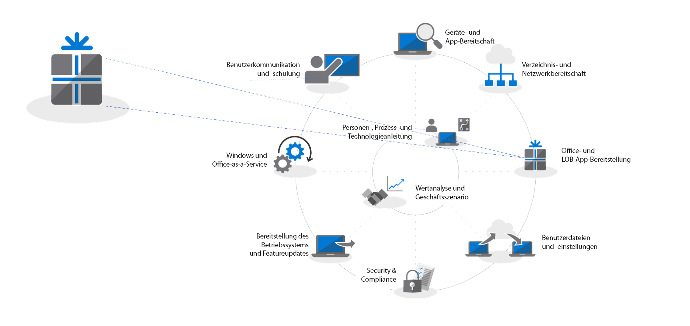
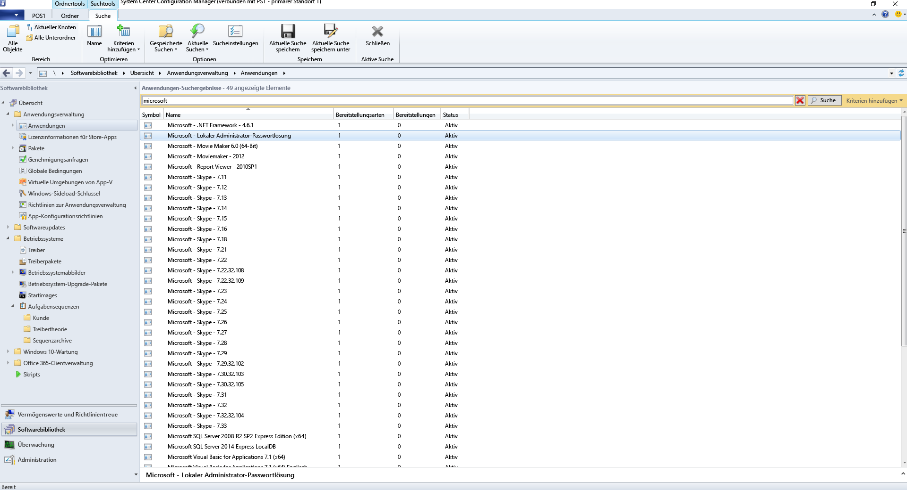
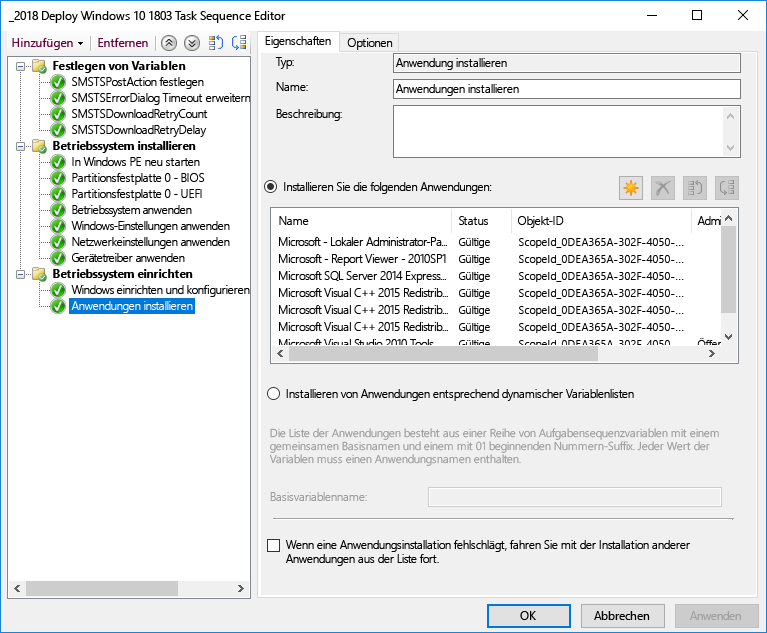
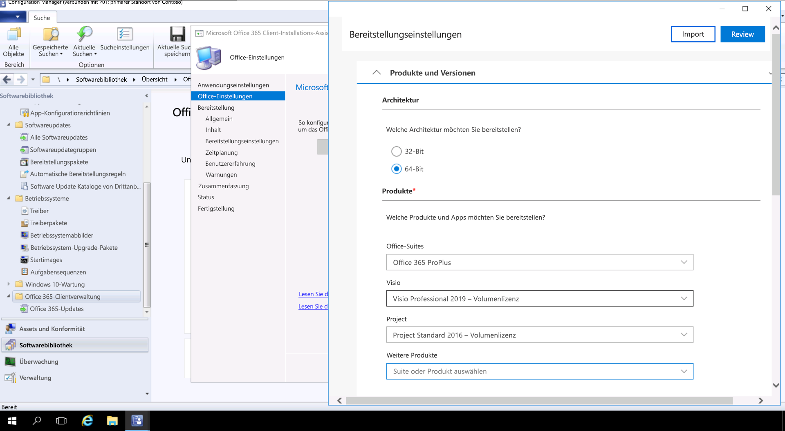

# Schritt 3: Liefern von Office- und Branchen-Apps

<table>
<thead>
<td></td>
<td>
<strong>Schritt 3: Liefern von Office- und Branchen-Apps</strong>

Stellen Sie sicher, dass Ihre Apps für eine automatische Installation verpackt und bereit sind. Erfahren Sie, wie Sie durch eine Klick-und-Los-Verpackung mit Office 365 ProPlus neue Optionen erhalten, um Ihre Office-Apps zu konfigurieren, zu liefern und auf dem neuesten Stand zu halten.
</td>
<td></td>
</thead>
</table>

>[!NOTE]
>Office- und LOB-App-Bereitstellung ist der dritte Schritt in unserem empfohlenen Bereitstellungprozess-Rad, der die Optionen für die Installation von Office und LOB abdeckt. Für eine erfolgreiche Bereitstellung sollten Sie die ersten beiden Schritte nicht überspringen.  Den vollständigen Desktopbereitstellungsprozess finden Sie im [Desktopbereitstellungscenter](https://aka.ms/HowToShift).
>

Sie sind nun bereit, Ihre Office- und Branchen-Apps bereitzustellen. Es gibt eine Reihe von Möglichkeiten, dies zu tun, darunter auch einige interessante neue Optionen. Während einige Anwendungen nur als kompilierte 32-Bit- oder 64-Bit-Version verfügbar sind, bieten andere wie z. B. Office 365 ProPlus sowohl nativen kompilierten 32-Bit- als auch 64-Bit-Code. Sie müssen die wichtige Entscheidung treffen, welche Version Sie bereitstellen möchten. Um zusätzliche Rechenleistung und RAM zu nutzen, empfiehlt Microsoft die 64-Bit-Version, wenn keine 32-Bit-Abhängigkeiten vorhanden sind. Wechseln Sie zu Schritt 1 Geräte- und App-Bereitschaft, um alle möglichen Herausforderungen im Bezug auf Add-In- oder dateibezogene Kompatibilität zu ermitteln.

Wenn Ihnen nichts im Wege steht, empfehlen wir Ihnen, die 64-Bit-Version aller Apps bereitzustellen, einschließlich Microsoft Office. Die nativen kompilierten 64-Bit-Apps bieten die beste Leistung und sind auf die Zukunft ausgelegt.

Es gibt viele Methoden und Modelle für die Installation von Apps unter Windows. Sehen wir uns also die Optionen an, die Ihnen für die Lieferung zur Verfügung stehen.

[Windows 10-Anwendungsmanagement](https://docs.microsoft.com/windows/application-management/)

## MSI-basierte Bereitstellungen

Für Ihre Branchen-Apps verwenden Sie wahrscheinlich MSI-basierte Pakete oder ausführbare Dateien, und Sie installieren Apps als Teil einer Aufgabensequenz für die Betriebssystembereitstellung. In Windows 10 werden diese Pakete weiterhin verwendet.

Software-Bereitstellungstools wie System Center Configuration Manager und Microsoft Intune sind ebenfalls für die Lieferung von Apps in MSI-Paketen optimiert. Nachdem Sie Ihre Apps unter Windows 10 geprüft haben, können Sie System Center Configuration Manager (aktueller Zweig) für die App-Lieferung verwenden. Wenn Sie das Unternehmensportal in Microsoft Intune verwenden, können Sie die Auswahl der von der IT genehmigten Apps, die Ihrer Organisation zu Verfügung stehen, erweitern, sodass auch die neuesten Anwendungen enthalten sind. Benutzer können dann selbst auswählen, was sie benötigen.

## PC-Imageerstellung

Eine andere häufig verwendete Methode der App-Bereitstellung ist PC-Imageerstellung. In diesem Fall werden Anwendungen entweder über die Tasksequenz oder manuell auf einem Beispiel-PC installiert. Dann wird ein Systemabbild mit den erforderlichen vorinstallierten Anwendungen aufgezeichnet. Der Imaging-Ansatz zur Erstellung und Erfassung kann bei der Bereitstellung neuer PCs Zeit sparen, aber denken Sie daran, dass Betriebssysteme und Apps innerhalb des Abbilds schnell veraltet sein können. Das kumulative Updatemodell in Windows 10 und Office 365 ProPlus hilft bei diesem Problem, beseitigt es aber nicht vollständig. Deshalb empfehlen wir einen schlanken Imaging-Ansatz, bei dem Ihre Anwendungen zur Bereitstellungszeit von außerhalb des Images installiert werden.

Wenn Sie Office 365 ProPlus in das Image einbeziehen möchten, denken Sie daran, dass dies eine benutzerbasierte Aktivierung erfordert. Es kann nicht vom Systemadministrator bereits aktiviert werden. Verwenden Sie das Office-Bereitstellungstool auf dem Gerät, von dem Sie ein Image erstellen, und überspringen Sie die Benutzeranmeldung. Nach der Bereitstellung des Images können sich Endbenutzer mit ihren Office 365-Anmeldeinformationen anmelden und Office 365 ProPlus aktivieren.

[Erstellen einer Aufgabensequenz zum Installieren des Betriebssystems](https://docs.microsoft.com/sccm/osd/deploy-use/create-a-task-sequence-to-install-an-operating-system)

[Bereitstellen von Office 365 ProPlus als Bestandteil eines Betriebssystemabbilds](https://docs.microsoft.com/deployoffice/deploy-office-365-proplus-as-part-of-an-operating-system-image)

## Office Klick-und-Los 

Office 365 ProPlus wird mit Klick-und-Los installiert, und Klick-und-Los ersetzt MSI-basierte Pakete in jeder anstehenden Office 2019-Version für Windows. Es bringt eine Reihe von Vorteilen mit sich, einschließlich einer schnelleren Installation, einer schnelleren und effizienteren Aktualisierung und einer saubereren Deinstallation. 

Per Klick-und-Los bereitgestellte Programme werden in einer virtuellen Anwendungsumgebung auf Ihrem Computer ausgeführt und können deshalb parallel mit anderen Anwendungen existieren, ohne Konflikte auszulösen; zudem beanspruchen sie auch nur ungefähr die Hälfte des Speicherplatzes, den sie als MSI-basiertes Paket benötigen würden. Office-Anwendungen werden über das [Office-Bereitstellungstool](https://www.microsoft.com/download/details.aspx?id=49117) bereitgestellt und verwaltet, das das Office-Setup-Programm benötigt, um Ihre Office-Apps herunterzuladen, zu konfigurieren und anzupassen. Das Office-Bereitstellungstools liest eine XML-Konfigurationsdatei, die die Metadaten-Anweisungen zum Konfigurieren und Anpassen Ihrer Office-Installation bereitstellt.

Microsoft empfiehlt die Verwendung des [Office-Anpassungstools](https://config.office.com/) zum Anpassen der Bereitstellungseinstellungen und Erstellen Ihrer XML-Konfigurationsdatei. Über das Office-Anpassungstool können Sie festlegen, welche Anwendungen und Sprachen installiert und wie die Anwendungen aktualisiert werden. Außerdem können Sie damit die Anwendungs- und Installationsoberflächeneinstellungen vornehmen.

Wenn Sie System Center Configuration Manager verwenden, können Sie dies weiter für die allgemeine Bereitstellung von Office 365 ProPlus verwenden. System Center Configuration Manager (aktueller Zweig) hat native Unterstützung für das aktualisierte Office Customization Tool, Paketanpassung für Klick-und-Los zum Installationszeitpunkt und native Unterstützung für die Verwaltung von Software-Updates nach der Installation.

[Bereitstellungshandbuch für Office 365 ProPlus](https://docs.microsoft.com/deployoffice/deployment-guide-for-office-365-proplus)

[Entfernen vorhandener MSI-Versionen von Office beim Upgrade auf Office 365 ProPlus](https://docs.microsoft.com/deployoffice/upgrade-from-msi-version)

[Verwalten von Office 365 ProPlus mit Configuration Manager](https://docs.microsoft.com/sccm/sum/deploy-use/manage-office-365-proplus-updates)

[Zuweisen von Office 365-Apps zu Windows 10-Geräten mit Microsoft Intune](https://docs.microsoft.com/intune/apps-add-office365)

## Browserbasierte Apps

Es gibt einige Dinge zu berücksichtigen, um sicherzustellen, dass Ihre browserbasierten Anwendung weiterhin wie erwartet funktionieren. Wenn Sie über bestimmte Websites und Apps verfügen, von denen Sie wissen, dass es Kompatibilitätsprobleme mit Microsoft Edge gibt, können Sie die Enterprise Mode-Websiteliste verwenden, damit die Websites automatisch mit Internet Explorer 11 geöffnet werden.

Wenn Sie darüber hinaus wissen, dass Ihre Intranetwebsites nicht ordnungsgemäß mit Microsoft Edge funktionieren, können Sie festlegen, dass alle Intranetwebsites automatisch mit Internet Explorer 11 geöffnet werden. Dieser Vorgang verwendet eine XML-Datei, um zu bestimmen, ob IE11 für jede Website verwendet wird, wobei eine Gruppenrichtlinie zum Erzwingen der Einstellungen verwendet wird.

[Der Unternehmensmodus](https://docs.microsoft.com/internet-explorer/ie11-deploy-guide/what-is-enterprise-mode#what-is-enterprise-mode)

Bisher haben wir ausschließlich allgemein bekannte Bereitstellungsmethoden behandelt. Allerdings gibt es zwei neue Ansätze für die App-Bereitstellung, die Sie in Betracht ziehen sollten.

## Microsoft Store für Unternehmen 

Microsoft Store für Unternehmen bietet eine flexible Möglichkeit, kostenlose und kostenpflichtige Apps im Handumdrehen auf Windows 10-Geräten zu entdecken, erwerben, verwalten und verteilen. Als IT-Administrator können Sie ausgewählte Microsoft Store-Apps mit Ihren eigenen Apps in Ihrem eigenen privaten Store veröffentlichen und bei Bedarf Lizenzen zuweisen oder erneut verwenden. Ihre Benutzer werden ausschließlich zu diesem Store umgeleitet, sodass sie nur genehmigte Apps finden und installieren können.

Store-Apps können systemeigen als UWP-Apps entwickelt sein, oder Sie können mithilfe der Desktop-Brücke vorhandene Apps für den Store packen und eine moderne Benutzeroberflächen für Windows 10 hinzufügen. Außer dem Code, mit dem Sie die Oberfläche von Windows 10 ansprechender gestalten, bleibt Ihre App unverändert und wird weiterhin im voll vertrauenswürdigen Benutzermodus ausgeführt.

## MSIX-Containerisierung

Eine neue Option für das Packen von Anwendungen ist MSIX. MSIX verwendet die in Windows verfügbare Containerisierungstechnik, um die besten Aspekte von Klick-und-Los, UWP und MSI-Packen zu vereinen. Mit Tools zum Migrieren vorhandener Installationsprogramme wie z. B. EXE, MSI, APPV und APPX direkt in MSIX vereint MSIX-Containerisierung alle heute verwendeten Installationstechnologien in einer einzigen Methode. MSIX-Unterstützung ist in den aktuellen Versionen von Windows enthalten: alle Geräte mit Windows 10 RS5 oder neuer enthalten alles, was Sie zum Installieren und Ausführen von mit MSIX gepackten Apps benötigen. Windows 10 integriert empfangene MSIX-Container dynamisch, während die Anwendungen getrennt vom Betriebssystem aufbewahrt werden.

Containerisierung bedeutet die saubere Deinstallation und Entfernung von Paketen, im Gegensatz zu MSI- und EXE-basierten Paketen, die möglicherweise Objekte auf dem System zurücklassen. Außerdem müssen nur standardmäßige Benutzeranmeldeinformationen zum Installieren von Anwendungen verwendet werden. Es sind keine Administratoranmeldeinformationen zum Installieren von MSIX-Containern erforderlich. MSIX-Container lassen sich außerdem effizienter aktualisieren. Wenn ein Update veröffentlicht wird, werden durch die Verwendung von Unterschieden auf Blockebene nur neue Netto-Binärdaten angewendet, sodass die Nutzlast des Updates verringert wird und so schnellere Bereitstellungen möglich sind, die weniger Netzwerkbandbreite verbrauchen.

Weitere Informationen über MSIX finden Sie auf der Website der [MSIX Tech Community](https://techcommunity.microsoft.com/t5/MSIX/ct-p/MSIX)

## Nächster Schritt

## [Schritt 4: Benutzerdateien und Einstellungen](https://aka.ms/mdd4)

## Vorheriger Schritt

## [Schritt 2: Verzeichnis- und Netzwerkbereitschaft](https://aka.ms/mdd2) 