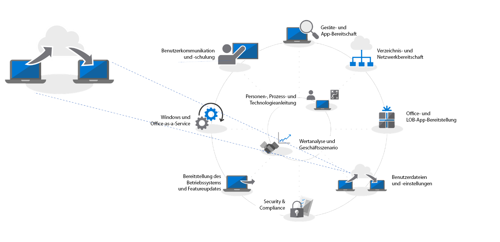

# Schritt 4: Migration von Benutzerdateien und -einstellungen

Das Verschieben der Dateien und Einstellungen der Benutzer auf die neuen oder aktualisierten PCs ist in kritischer Vorgang, der auf keinen Fall fehlschlagen darf. Sie können die einzelnen PCs manuell migrieren oder eine der verschiedenen Möglichkeiten zur Automatisierung des Prozesses wählen. Unabhängig davon, welche Migrationsmethode Sie auswählen, müssen Sie drei Aspekte berücksichtigen: Die Übertragung der Benutzerdateien, der Einstellungen und die Verwaltung des Layouts von Startmenü und Taskleiste in Windows 10.

<table>
<thead>
<td></td>
<td>
<strong>Schritt 4: Benutzerdateien und Einstellungen</strong>

Wenn Computer aktualisiert oder ersetzt werden, können Sie Zeit sparen, indem Sie das Sichern und Wiederherstellen des Benutzerstatus automatisieren. Mit neuen Optionen für die Synchronisierung von Clouddateien können Sie die Synchronisierung von Desktop-, Dokument- und Bildordnern mit OneDrive pro Benutzer erzwingen, sodass ein nahtloser Dateizugriff von neuen Windows-Installationen aus gewährleistet ist.
</td>
<td></td>
</thead>
</table>

>[!NOTE]
>Obwohl Sie die bisher von Ihnen verwendeten Migrationsprozesse auch weiterhin verwenden können, empfehlen wir Ihnen beim Übergang zu Office 365 ProPlus, das Verfahren zum Verschieben von bekannten Ordnern in OneDrive zu verwenden (siehe unten). Den vollständigen Desktopbereitstellungsprozess finden Sie im [Desktopbereitstellungscenter](https://aka.ms/HowToShift).
>

Eine der schwierigsten und häufig hochgradig manuellen Aufgaben einer umfangreichen Bereitstellung ist das Übertragen der Dateien und Einstellungen Ihrer Benutzer. In diesem Artikel werden die verfügbaren Optionen zum Migrieren von Benutzern auf neue, aktualisierte und mit neuen Images versehene PCs behandelt.

## Manuelle Migration

Wenn es darum geht zu entscheiden, welche Daten beim Wechsel zu einem neuen PC oder einer neuen Version von Windows beibehalten werden sollen, möchten manchen Benutzer alles behalten und andere die Gelegenheit zum Bereinigen ihrer Laufwerke nutzen. Aus diesem Grund entscheiden sich einige IT-Abteilung dazu, die Migration der Benutzerdateien manuell durchzuführen, wobei in einigen Fällen Supportteams die Benutzer unterstützen müssen. In anderen Fällen richten sie Support-Center für die Benutzer ein, zu denen die Benutzer ihre PCs bringen. Unabhängig von der gewählten Methode können die Benutzer in die Entscheidung einbezogen werden, was übertragen und was gelöscht werden soll.

Ob dies eine Option für Ihrer Organisation darstellt, hängt vom Umfang der Migration ab, die Sie planen. Sie ist ganz klar durch die Zeit und die physischen Gegebenheiten begrenzt, wie zum Beispiel durch die direkte Arbeit mit den Benutzern, das Ermitteln ihrer Anforderungen und das Kopieren der Dateien auf den neuen oder aktualisierten PC.

Wenn Sie sich für eine manuelle Migration entscheiden, müssen Sie möglicherweise beurteilen, ob Sie die Aufgabe bis Januar 2020 bewältigen können, wenn die für Windows 7 endet. Wenn dies zweifelhaft ist, sehen Sie sich die unten aufgeführten automatisierten Optionen an, oder fordern Sie weitere Mitarbeiter an, die Sie unterstützen können.

## Automatisierte Migration mit USMT 

Für umfangreiche Bereitstellungen können Sie einen Großteil des Prozesses mit automatisierten Bereitstellungstools, die auf Aufgabensequenzen basieren, automatisieren, wie z. B. System Center Configuration Manager oder das Microsoft Deployment Toolkit (MDT). Beide Lösungen verwenden USMT (User State Migration Tool, Migtrationstool für den Benutzerstatus) als Teil ihre Ende-zu-Ende-Bereitstellungsprozesses. USMT ist Teil des [Windows Assessment and Deployment Kit (Windows ADK)](https://docs.microsoft.com/de-DE/windows-hardware/get-started/adk-install)

USMT erfasst Benutzerkonten, Benutzerdateien, Betriebssystemeinstellungen und Anwendungseinstellungen und migriert diese in eine neue Windows-Installation. Darüber hinaus ermöglicht es Ihnen als IT-Administrator die genaue Kontrolle darüber, was migriert wird, und Sie können optional unerwünschte Dateitypen (z. B. Audio- und Videodateien) oder ausführbare Dateien ausschließen.

Während der Migration muss ausreichende Serverspeicherkapazität vorhanden sein, um als temporärer Migrationsspeicher zu fungieren. Hierbei bietet USMT zwei wichtige Funktionen. Erstens kann es pro PC die Menge des benötigten Speicherplatzes schätzen, und zweitens ermöglicht es die Verschlüsselung des Migrationsspeichers und verringert damit das Risiko, dass die Daten während des Speicherns auf Dateiservern manipuliert werden.

Wenn Sie eine PC-Aktualisierung ausführen und nicht die primäre Windows-Partition neu formatieren, haben Sie mit USMT auch die Möglichkeit, einen Hard-Link-Migrationsspeicher zu verwenden. Dieser Vorgang behält den Benutzerstatus auf dem PC bei, während das alte Betriebssystem und die Apps entfernt und aktualisiert werden. Da der Wiederherstellungsvorgang von der gleichen lokalen Partition aus erfolgt, bietet diese Option erhebliche Verbesserungen bei der Leistung und verringert den Netzwerkdatenverkehr.

  [Migrationstool für den Benutzerstatus (USMT)](https://docs.microsoft.com/de-DE/windows/deployment/usmt/usmt-overview)

## Verschieben bekannter Ordner in OneDrive

Wenn die Benutzer OneDrive nutzen oder wenn Sie OneDrive im Rahmen dieser Bereitstellung hinzufügen, steht Ihnen eine neue Option zur Verfügung. Indem es die Cloud zum Synchronisieren von Benutzerdateien verwendet, bietet das OneDrive-Feature zum Verschieben bekannter Ordner ein Maß an Flexibilität, das sich mit den Optionen für eine lokale Netzwerk-basierte Dateimigration nicht erreichen lässt. Wenn das Feature vor der Migration aktiviert wurde, bietet es sicheren Zugriff auf neue oder aktualisierte PCs, und es entfällt die Notwendigkeit, temporäre Migrationsspeicher auf den eigenen Servern zu erstellen. Darüber hinaus ist es potenziell für den Benutzer vollständig transparent.

  [Umleiten und Verschieben von bekannten Windows-Ordnern in OneDrive](https://docs.microsoft.com/de-DE/onedrive/redirect-known-folders)

Wenn Sie OneDrive bereits verwenden, ist Ihnen bekannt, dass Benutzer die Ordner und Speicherorte auswählen können, die sie von OneDrive oder SharePoint auf ihrem Gerät synchronisieren möchten, wobei es jedoch beim Endbenutzer liegt, dies einzurichten. Durch das Verschieben bekannter Ordner können Sie die Ordner „Dokumente“, „Desktop“ und „Bilder“ in einem Benutzerprofils als Ziel auswählen und diese alle in OneDrive schützen. Ein Benutzer kann dies selbst durchführen, wobei Sie dies jedoch auch, und das ist in diesem Szenario wichtig, über [Gruppenrichtlinieneinstellungen erzwingen können](https://docs.microsoft.com/de-DE/onedrive/use-group-policy?redirectSourcePath=%252fen-us%252farticle%252fUse-Group-Policy-to-control-OneDrive-sync-client-settings-0ecb2cf5-8882-42b3-a6e9-be6bda30899c).

Mit dem Feature für das Verschieben von bekannten Ordnern ändern Benutzer ihren Arbeitsablauf nicht: Alles sieht vor, während und nach der Synchronisierung mit OneDrive so aus wie immer. Über Gruppenrichtlinien können Sie auch auswählen, ob Benutzer benachrichtigt werden, dass ihre Dokumente, Bilder und ihr Desktop in OneDrive geschützt sind. Wenn Sie dies nicht tun möchten, findet alles unbemerkt im Hintergrund statt. Die Benutzer werden nur darauf aufmerksam, wenn sie einen neuen PC erhalten oder ihr PC aktualisiert wurde. Sobald sich ein Benutzer bei seinem OneDrive-Konto anmeldet, stehen diese Dateien wieder zur Verfügung und werden auf dem neuen PC wiederhergestellt. Außerdem können Benutzer jederzeit über ihre Smartphones oder andere Geräte auf ihre Dateien in OneDrive zugreifen.

Die Authentifizierung für OneDrive wird durch Azure Active Directory geregelt. Um die Sicherheit noch weiter zu erhöhen, können Sie ganz einfach die mehrstufige Authentifizierung aktivieren, und Sie können Richtlinien festlegen, mit denen die Upload- und Download-Bandbreite für OneDrive gesteuert wird, um die Netzwerkaktivität zu beschränken.

Sie müssen nicht jeden Benutzer zur gleichen Zeit migrieren. Sollten Sie das Rollout der Gruppenrichtlinieneinstellungen phasenweise vornehmen oder [das Synchronisieren von Dateien auf PCs in der Domäne beschränken](https://docs.microsoft.com/de-DE/powershell/module/sharepoint-online/Set-SPOTenantSyncClientRestriction?view=sharepoint-ps).

## Anpassung des Startmenüs und der Taskleiste

OneDrive ist darauf ausgelegt, Dateien und Ordner zu synchronisieren und zu schützen, und nicht auf die Synchronisierung von Anwendungs- oder Windows-Einstellungen. Zu diesem Zweck haben Sie in der Vergangenheit möglicherweise die Methode zum Kopieren von Profilen verwendet, um die Standardlayouts für Startmenü- und Taskleisteneinstellungen der Benutzer zu konfigurieren. In Windows 10 Pro, Enterprise und Education können Sie Gruppenrichtlinien, MDM, PowerShell oder Bereitstellungspakete verwenden, um [angepasste Startmenü- und Taskleistenlayouts](https://docs.microsoft.com/de-DE/windows/configuration/windows-10-start-layout-options-and-policies) bereitzustellen. Es muss kein neues Image erstellt werden, und das Layout kann einfach aktualisiert werden, indem Sie die XML-Datei überschreiben, die das Layout enthält.

Konfigurieren Sie zum Erstellen eines neuen Layouts einfach ein Beispielsystem, und verwenden Sie das PowerShell-Cmdlet [Export-StartLayout](https://docs.microsoft.com/de-DE/powershell/module/startlayout/export-startlayout?view=win10-ps) zum Erstellen einer XML-Datei. Speichern Sie diese Datei dann in einer Netzwerkfreigabe, oder legen Sie die Datei lokal im Cache als Teil der Bereitstellungsabfolge ab. Es muss nur als schreibgeschützte Datei darauf zugegriffen werden können, sobald sich der Endbenutzer anmeldet. Sie können dann die Richtlinie oder das [Import-StartLayout](https://docs.microsoft.com/de-DE/powershell/module/startlayout/import-startlayout?view=win10-ps)-Cmdlet verwenden, um auf diese Datei zu verweisen.

## Entfernen von nicht benötigten In-Box-Apps

Windows 10 umfasst in der Standardinstallation viele nützliche integrierte Apps, wobei Sie jedoch möglicherweise einige dieser Apps von den verwalteten PCs entfernen möchten. Sie können die Installation auch so konfigurieren, dass diese Apps nicht erneut auftreten, wie z. B. XBOX oder Zune Music. Sie können eine Liste dieser Apps mit Befehlen von [PowerShell Get-AppxPackage](https://technet.microsoft.com/de-DE/library/hh856044.aspx) abrufen und dann die Apps, die Sie nicht bereitstellen möchten, mit dem Befehl [Remove-AppxPackage](https://technet.microsoft.com/de-DE/library/hh856038.aspx) entfernen. Alternativ können Sie die Windows-Imagedatei (.img) vor der Bereitstellung offline mounten und die Pakete, die Sie nicht verwenden möchten, mit dem [Deployment Image Servicing and Management (DISM)](https://docs.microsoft.com/de-DE/windows-hardware/manufacture/desktop/what-is-dism)-Befehlszeilentool und dem Befehl [Remove-AppxProvisionedPackage](https://docs.microsoft.com/de-DE/powershell/module/dism/remove-appxprovisionedpackage?view=win10-ps) extrahieren.

## Nächster Schritt

## [Schritt 5: Überlegungen zu Sicherheit und Compliance](https://aka.ms/mdd5)

## Vorheriger Schritt

## [Schritt 3: Liefern von Office- und Branchen-Apps](https://aka.ms/mdd3)