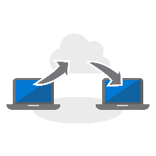

# Schritt 4: Migration von Benutzerdateien und -einstellungenStep 4: User Files and Settings Migration

Das Verschieben der Dateien und Einstellungen der Benutzer auf die neuen oder aktualisierten PCs ist in kritischer Vorgang, der auf keinen Fall fehlschlagen darf.Moving users’ files and settings to their new or refreshed PCs is a critical process, failure is not an option. Sie können die einzelnen PCs manuell migrieren oder eine der verschiedenen Möglichkeiten zur Automatisierung des Prozesses wählen.You can migrate each PC manually or you choose one of several ways to automate the process. Unabhängig davon, welche Migrationsmethode Sie auswählen, müssen Sie drei Aspekte berücksichtigen: Die Übertragung der Benutzerdateien, der Einstellungen und die Verwaltung des Layouts von Startmenü und Taskleiste in Windows 10.Whichever migration method you choose there are three main considerations to be addressed – the transfer of users’ files, their settings, and managing Windows 10 Start and taskbar layouts.

<table>
<thead>
<td></td>
<td>
<strong>Schritt 4: Benutzerdateien und Einstellungen</strong><strong>Step 4: User Files and Settings</strong>

Wenn Computer aktualisiert oder ersetzt werden, können Sie Zeit sparen, indem Sie das Sichern und Wiederherstellen des Benutzerstatus automatisieren. Mit neuen Optionen für die Synchronisierung von Clouddateien können Sie die Synchronisierung von Desktop-, Dokument- und Bildordnern mit OneDrive pro Benutzer erzwingen, sodass ein nahtloser Dateizugriff von neuen Windows-Installationen aus gewährleistet ist.When refreshing or replacing PCs, save time by automating user state backup and restore. New options for cloud file sync allow you to enforce per user sync of Desktop, Documents and Pictures folders to OneDrive for seamless file access from new Windows installs.
</td>
<td></td>
</thead>
</table>

>[!NOTE]
>Obwohl Sie die bisher von Ihnen verwendeten Migrationsprozesse auch weiterhin verwenden können, empfehlen wir Ihnen beim Übergang zu Office 365 ProPlus, das Verfahren zum Verschieben von bekannten Ordnern in OneDrive zu verwenden (siehe unten).While you can continue to use migration processes you have used in the past, with your shift to Office 365 ProPlus we recommend you use OneDrive ‘Known Folder Move’ (see below). Den vollständigen Desktopbereitstellungsprozess finden Sie im [Desktopbereitstellungscenter](https://aka.ms/HowToShift).To see the full desktop deployment process, visit the [Desktop Deployment Center](https://aka.ms/HowToShift).
>

Eine der schwierigsten und häufig hochgradig manuellen Aufgaben einer umfangreichen Bereitstellung ist das Übertragen der Dateien und Einstellungen Ihrer Benutzer. In diesem Artikel werden die verfügbaren Optionen zum Migrieren von Benutzern auf neue, aktualisierte und mit neuen Images versehene PCs behandelt.One of the trickiest and often most manual tasks of a large-scale deployment is the transferring of your users' files and settings. In this article we will cover the options available to you to migrate users to new, refreshed and re-imaged PCs.

## Manuelle MigrationManual Migration

Wenn es darum geht zu entscheiden, welche Daten beim Wechsel zu einem neuen PC oder einer neuen Version von Windows beibehalten werden sollen, möchten manchen Benutzer alles behalten und andere die Gelegenheit zum Bereinigen ihrer Laufwerke nutzen. Aus diesem Grund entscheiden sich einige IT-Abteilung dazu, die Migration der Benutzerdateien manuell durchzuführen, wobei in einigen Fällen Supportteams die Benutzer unterstützen müssen. In anderen Fällen richten sie Support-Center für die Benutzer ein, zu denen die Benutzer ihre PCs bringen. Unabhängig von der gewählten Methode können die Benutzer in die Entscheidung einbezogen werden, was übertragen und was gelöscht werden soll.When it comes to deciding on what to keep when moving to a new PC or a new version of Windows some users may want to keep everything, others may want to take the opportunity to clean up their drives. Because of this, some IT departments choose to handle user file migration manually, sometimes by having support teams visit users; sometimes by setting up support centers for users to bring their PCs to the support team. Either way users can be involved in deciding what to transfer and what to discard.

Ob dies eine Option für Ihrer Organisation darstellt, hängt vom Umfang der Migration ab, die Sie planen. Sie ist ganz klar durch die Zeit und die physischen Gegebenheiten begrenzt, wie zum Beispiel durch die direkte Arbeit mit den Benutzern, das Ermitteln ihrer Anforderungen und das Kopieren der Dateien auf den neuen oder aktualisierten PC.Whether this is an option in your organization will depend on the scale of the migration you are planning. Clearly it is limited to the time and physics involved in working directly with users, understanding their needs, copying files across to their new, or freshly updated PC.

Wenn Sie sich für eine manuelle Migration entscheiden, schauen Sie sich die folgenden automatischen Optionen an, oder fordern Sie weitere Personen zur Unterstützung an.If you are opting for a manual migration, look into using one of the automated options below, or request more people to help.

## Automatisierte Migration mit USMTAutomated Migration using USMT 

Für umfangreiche Bereitstellungen können Sie einen Großteil des Prozesses mit automatisierten Bereitstellungstools, die auf Tasksequenzen basieren, automatisieren, wie z. B. Microsoft Endpoint Configuration Manager oder das Microsoft Deployment Toolkit (MDT). Beide Lösungen verwenden USMT (User State Migration Tool, Migtrationstool für den Benutzerstatus) als Teil ihres End-to-End-Bereitstellungsprozesses. USMT ist Teil des [Windows Assessment and Deployment Kit (Windows ADK)](https://docs.microsoft.com/windows-hardware/get-started/adk-install).For large-scale deployments you can automate much of the process using task sequence-based deployment automation tools such as Microsoft Endpoint Configuration Manager or the Microsoft Deployment Toolkit (MDT). Both these solutions make use User State Migration Tool (USMT) as part of their end-to-end deployment process. USMT is part of the [Windows Assessment and Deployment Kit (Windows ADK)](https://docs.microsoft.com/windows-hardware/get-started/adk-install)

USMT erfasst Benutzerkonten, Benutzerdateien, Betriebssystemeinstellungen und Anwendungseinstellungen und migriert diese in eine neue Windows-Installation. Darüber hinaus ermöglicht es Ihnen als IT-Administrator die genaue Kontrolle darüber, was migriert wird, und Sie können optional unerwünschte Dateitypen (z. B. Audio- und Videodateien) oder ausführbare Dateien ausschließen.USMT captures user accounts, user files, operating system settings, and application settings, and them migrates them to a new Windows installation. It also gives you, the IT Admin, control of exactly what gets migrated and, optionally, can exclude unwanted file types – for example audio and video files, or executables.

Während der Migration muss ausreichende Serverspeicherkapazität vorhanden sein, um als temporärer Migrationsspeicher zu fungieren. Hierbei bietet USMT zwei wichtige Funktionen. Erstens kann es pro PC die Menge des benötigten Speicherplatzes schätzen, und zweitens ermöglicht es die Verschlüsselung des Migrationsspeichers und verringert damit das Risiko, dass die Daten während des Speicherns auf Dateiservern manipuliert werden.During the migration process you will need to have sufficient server storage capacity available to act as your temporary migration store. Here USMT offers two important features. First, it can estimate, per PC, the amount of storage you will need. Second, it allows for migration stores to be encrypted, reducing the risk of data being compromised while being stored on file servers.

Wenn Sie eine PC-Aktualisierung ausführen und nicht die primäre Windows-Partition neu formatieren, haben Sie mit USMT auch die Möglichkeit, einen Hard-Link-Migrationsspeicher zu verwenden. Dieser Vorgang behält den Benutzerstatus auf dem PC bei, während das alte Betriebssystem und die Apps entfernt und aktualisiert werden. Da der Wiederherstellungsvorgang von der gleichen lokalen Partition aus erfolgt, bietet diese Option erhebliche Verbesserungen bei der Leistung und verringert den Netzwerkdatenverkehr.Where you are performing a PC refresh and not reformatting the primary Windows partition, you also have the option of using a hard-link migration store with USMT. This process preserves user state on the PC while the old operating system and apps are removed and refreshed. With the restore process coming from the same local partition, this option offers significant improvements on performance, and reduces network traffic.

[Migrationstool für den Benutzerstatus (USMT)User State Migration Tool (USMT) Overview](https://docs.microsoft.com/windows/deployment/usmt/usmt-overview)

## Verschieben bekannter Ordner in OneDriveOneDrive Known Folder Move

Wenn die Benutzer OneDrive nutzen oder wenn Sie OneDrive im Rahmen dieser Bereitstellung hinzufügen, steht Ihnen eine neue Option zur Verfügung. Indem es die Cloud zum Synchronisieren von Benutzerdateien verwendet, bietet das OneDrive-Feature zum Verschieben bekannter Ordner ein Maß an Flexibilität, das sich mit den Optionen für eine lokale Netzwerk-basierte Dateimigration nicht erreichen lässt. Wenn das Feature vor der Migration aktiviert wurde, bietet es sicheren Zugriff auf neue oder aktualisierte PCs, und es entfällt die Notwendigkeit, temporäre Migrationsspeicher auf den eigenen Servern zu erstellen. Darüber hinaus ist es potenziell für den Benutzer vollständig transparent.If your users are on OneDrive or you are adding OneDrive in as part of this deployment, there is new option available to you. Using the cloud to synchronize user files, OneDrive “Known Folder Move” feature provides a level of flexibility not possible with local network-based file migration options. If enabled prior to migration, it provides secure access on new or refreshed PCs and, it eliminates the need to create temporary migration stores on your own servers. It is also has the potential to be completely transparent to the user.

[Umleiten und Verschieben von bekannten Windows-Ordnern in OneDriveRedirect and move Windows known folders to OneDrive](https://docs.microsoft.com/onedrive/redirect-known-folders)

Wenn Sie OneDrive bereits verwenden, ist Ihnen bekannt, dass Benutzer die Ordner und Speicherorte auswählen können, die sie von OneDrive oder SharePoint auf ihrem Gerät synchronisieren möchten, wobei es jedoch beim Endbenutzer liegt, dies einzurichten. Durch das Verschieben bekannter Ordner können Sie die Ordner „Dokumente“, „Desktop“ und „Bilder“ in einem Benutzerprofils als Ziel auswählen und diese alle in OneDrive schützen. Ein Benutzer kann dies selbst durchführen, wobei Sie dies jedoch auch, und das ist in diesem Szenario wichtig, über [Gruppenrichtlinieneinstellungen erzwingen können](https://docs.microsoft.com/onedrive/use-group-policy?redirectSourcePath=%252fen-us%252farticle%252fUse-Group-Policy-to-control-OneDrive-sync-client-settings-0ecb2cf5-8882-42b3-a6e9-be6bda30899c).If you’re already using OneDrive, you will know that users can select the folders and locations they would like to sync from OneDrive or SharePoint to their device, but that effectively puts the burden on the end user to set it up. With Known Folder Move, you can target the Documents, Desktop and Pictures folders within a user profile and protect it all on OneDrive. A user can do this themselves or, importantly for this scenario, you can [enforce this using Group Policy settings](https://docs.microsoft.com/onedrive/use-group-policy?redirectSourcePath=%252fen-us%252farticle%252fUse-Group-Policy-to-control-OneDrive-sync-client-settings-0ecb2cf5-8882-42b3-a6e9-be6bda30899c).

Mit dem Feature für das Verschieben von bekannten Ordnern ändern Benutzer ihren Arbeitsablauf nicht: Alles sieht vor, während und nach der Synchronisierung mit OneDrive so aus wie immer. Über Gruppenrichtlinien können Sie auch auswählen, ob Benutzer benachrichtigt werden, dass ihre Dokumente, Bilder und ihr Desktop in OneDrive geschützt sind. Wenn Sie dies nicht tun möchten, findet alles unbemerkt im Hintergrund statt. Die Benutzer werden nur darauf aufmerksam, wenn sie einen neuen PC erhalten oder ihr PC aktualisiert wurde. Sobald sich ein Benutzer bei seinem OneDrive-Konto anmeldet, stehen diese Dateien wieder zur Verfügung und werden auf dem neuen PC wiederhergestellt. Außerdem können Benutzer jederzeit über ihre Smartphones oder andere Geräte auf ihre Dateien in OneDrive zugreifen.With Known Folder Move, users don’t change their workflow – everything looks the same before, during and after synchronization with OneDrive is complete. Through Group Policy you can even choose whether or not to notify users that their documents, pictures and desktop are protected in OneDrive. If you choose not to, it all happens silently in the background. The users will only be aware when they take delivery of a new PC or their PC is refreshed. As soon as they sign in to their OneDrive account, these files will be available again, and will be restored to their new PC. And of course, OneDrive means they will also their files securely at any time from their phones and other devices.

Die Authentifizierung für OneDrive wird durch Azure Active Directory geregelt. Um die Sicherheit noch weiter zu erhöhen, können Sie ganz einfach die mehrstufige Authentifizierung aktivieren, und Sie können Richtlinien festlegen, mit denen die Upload- und Download-Bandbreite für OneDrive gesteuert wird, um die Netzwerkaktivität zu beschränken.Authentication for OneDrive powered by Azure Active Directory, so for extra security, you can easily enable multi-factor authentication, and you can set policies to control the upload and download bandwidth OneDrive uses to limit network activity.

Sie müssen nicht jeden Benutzer zur gleichen Zeit migrieren. Sollten Sie das Rollout der Gruppenrichtlinieneinstellungen phasenweise vornehmen oder [das Synchronisieren von Dateien auf PCs in der Domäne beschränken](https://docs.microsoft.com/powershell/module/sharepoint-online/Set-SPOTenantSyncClientRestriction?view=sharepoint-ps).You don’t have to migrate every use at the same time. You may want phase the roll-out of the Group Policy settings, or [limit file sync to domain-joined PCs](https://docs.microsoft.com/powershell/module/sharepoint-online/Set-SPOTenantSyncClientRestriction?view=sharepoint-ps).

## Anpassung des Startmenüs und der TaskleisteStart Menu and Task Bar Customization

OneDrive ist darauf ausgelegt, Dateien und Ordner zu synchronisieren und zu schützen, und nicht auf die Synchronisierung von Anwendungs- oder Windows-Einstellungen. Zu diesem Zweck haben Sie in der Vergangenheit möglicherweise die Methode zum Kopieren von Profilen verwendet, um die Standardlayouts für Startmenü- und Taskleisteneinstellungen der Benutzer zu konfigurieren. In Windows 10 Pro, Enterprise und Education können Sie Gruppenrichtlinien, MDM, PowerShell oder Bereitstellungspakete verwenden, um [angepasste Startmenü- und Taskleistenlayouts](https://docs.microsoft.com/windows/configuration/windows-10-start-layout-options-and-policies) bereitzustellen. Es muss kein neues Image erstellt werden, und das Layout kann einfach aktualisiert werden, indem Sie die XML-Datei überschreiben, die das Layout enthält.OneDrive is designed to sync and protect files and folders; it does not sync application or Windows settings. To do this in the past you may have used the copy profile method to configure standard layouts for users’ Start menus and taskbar settings. In Windows 10 Pro, Enterprise, and Education, you can use Group Policy, MDM, PowerShell, or provisioning packages, to deploy [customized Start and taskbar layouts](https://docs.microsoft.com/windows/configuration/windows-10-start-layout-options-and-policies). No reimaging is required, and the layout can be updated simply by overwriting the .xml file that contains the layout.

Konfigurieren Sie zum Erstellen eines neuen Layouts einfach ein Beispielsystem, und verwenden Sie das PowerShell-Cmdlet [Export-StartLayout](https://docs.microsoft.com/powershell/module/startlayout/export-startlayout?view=win10-ps) zum Erstellen einer XML-Datei. Speichern Sie diese Datei dann in einer Netzwerkfreigabe, oder legen Sie die Datei lokal im Cache als Teil der Bereitstellungsabfolge ab. Es muss nur als schreibgeschützte Datei darauf zugegriffen werden können, sobald sich der Endbenutzer anmeldet. Sie können dann die Richtlinie oder das [Import-StartLayout](https://docs.microsoft.com/powershell/module/startlayout/import-startlayout?view=win10-ps)-Cmdlet verwenden, um auf diese Datei zu verweisen.To create a new layout simply configure a sample system, and use the PowerShell [Export-StartLayout](https://docs.microsoft.com/powershell/module/startlayout/export-startlayout?view=win10-ps) cmdlet to generate an XML file, then place this file on a network share, or cache it locally as part of your deployment sequence; it just needs to be reachable as Read-only file once the user signs in. You can then use policy or the [Import-StartLayout](https://docs.microsoft.com/powershell/module/startlayout/import-startlayout?view=win10-ps) cmdlet to reference this file.

## Entfernen von nicht benötigten In-Box-AppsRemoving unwanted in-box apps

Windows 10 umfasst in der Standardinstallation viele nützliche integrierte Apps, wobei Sie jedoch möglicherweise einige dieser Apps von den verwalteten PCs entfernen möchten. Sie können die Installation auch so konfigurieren, dass diese Apps nicht erneut auftreten, wie z. B. XBOX oder Zune Music. Sie können eine Liste dieser Apps mit Befehlen von [PowerShell Get-AppxPackage](https://technet.microsoft.com/library/hh856044.aspx) abrufen und dann die Apps, die Sie nicht bereitstellen möchten, mit dem Befehl [Remove-AppxPackage](https://technet.microsoft.com/library/hh856038.aspx) entfernen. Alternativ können Sie die Windows-Imagedatei (.img) vor der Bereitstellung offline mounten und die Pakete, die Sie nicht verwenden möchten, mit dem [Deployment Image Servicing and Management (DISM)](https://docs.microsoft.com/windows-hardware/manufacture/desktop/what-is-dism)-Befehlszeilentool und dem Befehl [Remove-AppxProvisionedPackage](https://docs.microsoft.com/powershell/module/dism/remove-appxprovisionedpackage?view=win10-ps) extrahieren.Windows 10 includes many useful built-in apps as part of the standard installation, but you may want to remove some of these from your managed PCs, and even configure your installation to prevent those apps from returning, for example, XBOX or Zune Music. You can retrieve a list of these apps using the [PowerShell Get-AppxPackage](https://technet.microsoft.com/library/hh856044.aspx) commands, and remove those you do not want using the [Remove-AppxPackage](https://technet.microsoft.com/library/hh856038.aspx) command. Alternatively, you can mount the Windows Image (.img) file offline before deployment, and extract packages you do not want using the [Deployment Image Servicing and Management (DISM)](https://docs.microsoft.com/windows-hardware/manufacture/desktop/what-is-dism) command line tool and the [Remove-AppxProvisionedPackage](https://docs.microsoft.com/powershell/module/dism/remove-appxprovisionedpackage?view=win10-ps) command.

## Nächster SchrittNext Step

## [Schritt 5: Überlegungen zu Sicherheit und ComplianceStep 5: Security and Compliance Considerations](https://aka.ms/mdd5)

## Vorheriger SchrittPrevious Step

## [Schritt 3: Liefern von Office- und Branchen-AppsStep 3: Office and LOB App Delivery](https://aka.ms/mdd3)
