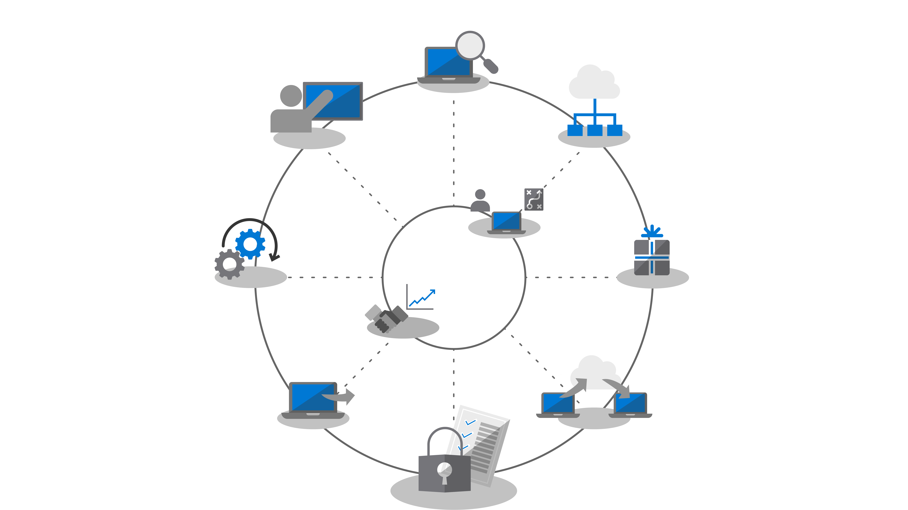
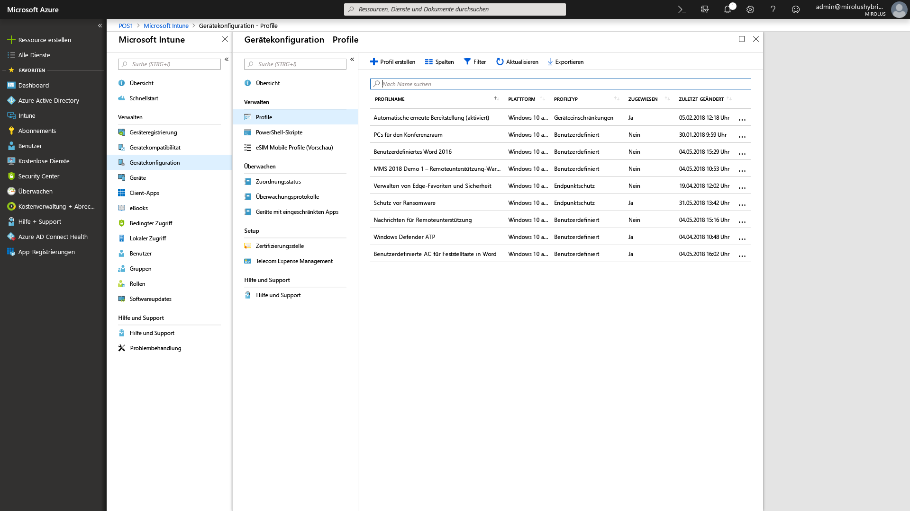

# Schritt 5: Überlegungen zu Sicherheit und Compliance

<table>
<thead>
<td></td>
<td>
<strong>Schritt 5: Überlegungen zu Sicherheit und Compliance</strong>

Windows 10 und Microsoft 365 Apps for Enterprise bieten neue Methoden zum Schützen von Daten, Geräten und Benutzern und können schnell Bedrohungen erkennen und darauf reagieren. Erfahren Sie außerdem, wie Sie mit häufigen Problemen im Zusammenhang mit der Datenträgerverschlüsselung, Antischadsoftware-Apps und Richtlinien beim Umstieg auf Windows 10 umgehen.
</td>
<td></td>
</thead>
</table>

>[!NOTE]
>Sicherheit und Compliance ist der fünfte Schritt in dem von uns empfohlenen Rad für den Bereitstellungsprozess, der die Sicherheit in Windows 10 und Microsoft 365 Apps for Enterprise sowie Compliance behandelt. Den vollständigen Desktopbereitstellungsprozess finden Sie im [Desktopbereitstellungscenter](https://aka.ms/HowToShift).
>

Überprüfen Sie nun die Optionen für die Nutzung neuer Sicherheits- und Compliance-Funktionen im Rahmen der Windows 10- und Microsoft 365 Apps for Enterprise-Bereitstellung zusammen mit den Aspekten und allgemeinen Hindernissen beim Übergang von früheren Versionen von Windows und Office. Viele der sicherheitsbezogenen Funktionen in Windows 10 treiben bereits allein den Übergang zu neueren Plattformen voran. Darüber hinaus bieten die Integration mit Clouddiensten und Identitätsoptionen in Azure Active Directory Zugriff auf neue und fortlaufend aktualisierte Schutzmechanismen für Ihre Daten, Geräte und Benutzer.

## Überwinden potenzieller sicherheitsbezogener Bereitstellungsblockaden

Bevor wir die neuen Möglichkeiten erläutern, die Sie beim Übergang zu Windows 10 und Microsoft 365 Apps for Enterprise hinzufügen können, und wie Sie diese Erfahrungen mit der Cloud verbinden, sehen wir uns zunächst einmal einige Trends an, die den Bereitstellungsprozess häufig behindern.

### Datenträgerverschlüsselung

Eines der anfänglichen Probleme, auf das Sie möglicherweise zuerst stoßen, ist die Datenträgerverschlüsselung. Viele Lösungen für die Datenträgerverschlüsselung können nicht einfach von einer früheren Version von Windows auf eine neuere Version von Windows aktualisiert werden.

Einige Lösungen zur Datenträgerverschlüsselung ermöglichen Ihnen, Upgrades mit der Option „/reflectdrivers“ im Windows-Setup für bestimmte Versionen der Plattformen durchzuführen, wobei andere Lösungen erfordern, dass Sie den Datenträger vor der Bereitstellung zunächst entschlüsseln und nach der Installation von Windows 10 erneut verschlüsseln. Einige Lösungen ermöglichen außerdem nicht den Übergang vom Master Boot Record (MBR) mit einem älteren BIOS zu einer GUID Partition Tabelle (GPT), die für UEFI erforderlich ist. Dies ist wichtig, da eine 64-Bit-Version von Windows 10 mit UEFI erforderlich ist, damit die neuen, auf Virtualisierung basierenden Sicherheitsfunktionen in Windows 10 erforderlich ist. Diese werden weiter unten erläutert.

Eine Möglichkeit zur Lösung dieser Probleme ist die Verwendung von BitLocker in Windows 10, das in Windows 10 Pro und höhere Editionen enthalten ist. BitLocker ermöglicht Ihnen, den Schutz für Betriebssystemupgrades und Feature-Updates als Teil des Prozesses auszusetzen.

[Grundlegende BitLocker-Bereitstellung](https://docs.microsoft.com/windows/security/information-protection/bitlocker/bitlocker-basic-deployment)

### Kompatibilität mit Antiviren- und Antischadsoftware

Als zweiten Punkt möchten wir anführen, dass zwar mehr als [99 % der Windows-Anwendungen zwischen Windows 7 und Windows 10 kompatibel sind](https://www.microsoft.com/microsoft-365/blog/2018/09/06/helping-customers-shift-to-a-modern-desktop/), wobei Antivirensoftware-Apps (AV) oder VPN-Clients (Virtual Privat Network) häufig eine Ausnahme darstellen. Diese Anwendungen implementieren oft nicht standardmäßige Entwicklungsmethoden und APIs und verwenden häufig nicht dokumentierte Vorgehensweisen zum Schutz Ihres Systems oder zum Herstellen der Verbindung mit Netzwerkressourcen.

Daher können diese Apps naturgemäß empfindlich sein, was Änderungen beim Übergang zu einer neuen Version von Windows betrifft. Wenn Ihre AV- oder VPN-Software in Windows 10 oder nach dem Upgrade nicht funktioniert, können Sie das Problem in der Regel dadurch beheben, dass Sie die App durch ein App ersetzen, die für Windows 10 getestet wurde und unterstützt wird.

### Sicherheitsrichtlinien

Die Active Directory-Gruppenrichtlinieneinstellungen, die Sie für ältere Versionen von Windows und Office verwendet haben, können möglicherweise nicht direkt in Windows 10 und Microsoft 365 Apps for Enterprise übernommen werden, und Sie müssen verschiedene Aspekte für die neueren Sicherheits- und Compliance-Funktionen berücksichtigen. Es empfiehlt sich, das Microsoft Security Compliance-Toolkit zu nutzen, um einen Grundeindruck der Sicherheitsrichtlinien für die aktuellen Versionen von Windows und Office zu erhalten. Darüber hinaus ist es sinnvoll, dass Sie sich die Richtlinien für die Verwaltung mobiler Geräte im Rahmen von Microsoft Intune ansehen.

## 

## Neue Sicherheits- und Compliancefunktionen in Microsoft 365

Sie haben nun mehr über die Aspekte erfahren, die Sie beim Übertragen der aktuellen Schutzfunktionen berücksichtigen und vor dem Übergang beachten müssen. Sehen wir uns jetzt die neuen Möglichkeiten an, die Sie beim Übergang zu Windows 10, Microsoft 365 Apps for Enterprise und cloudbasierten Optionen aus EMS und darüber hinaus nutzen können.

### Identitäts- und Zugriffsverwaltung

Wir beginnen bei der Identitäts- und Zugriffsverwaltung. Azure Active Directory ist die erste Wahl bei der Identitätskontrolle für Apps, Geräte und Clouddienste und der moderne Ansatz für die Verbindung mit Microsoft 365 und anderen Clouddiensten. Der bedingte Zugriff ermöglicht Ihnen, verschiedene Authentifizierungsanforderungen zu definieren, basierend darauf, von wo Sie sich anmelden, welches Gerät Sie verwenden und ob anomales Verhalten auftritt.

Auf Geräteebene können biometrische Merkmale eindeutige IDs für den einfachen und sicheren Zugriff auf Ihre Geräte und Apps bereitstellen und somit die Verwendung von Kennwörtern überflüssig machen. Windows Hello bietet eine gerätebasierte mehrstufige Authentifizierung. Es nutzt das Gerät selbst, Ihre PIN oder eindeutige biometrische Kennzeichen wie Ihr Gesicht oder Ihren Fingerabdruck, was Sie über eine Richtlinie erzwingen können.

[Grundlagen der Identitätsverwaltung in Azure](https://docs.microsoft.com/azure/active-directory/fundamentals/identity-fundamentals)

[Grundlegendes zu Azure-Identitätslösungen](https://docs.microsoft.com/azure/active-directory/fundamentals/understand-azure-identity-solutions)

[Bedingter Zugriff in Azure Active Directory](https://docs.microsoft.com/azure/active-directory/conditional-access/overview)

[Windows Hello for Business](https://docs.microsoft.com/windows/security/identity-protection/hello-for-business/hello-identity-verification)

### Auf Virtualisierung basierende Sicherheit

Über die Identität hinausgehend können Sie jetzt auch einen kontinuierlichen Schutz vor bekannten und unbekannten Bedrohungen aktivieren. Hierzu verwendet Windows 10 im Kern auf Virtualisierung basierende Sicherheit, um die Integrität beim Booten und Codeintegrität mit Secure Boot zu gewährleisten. Darüber hinaus können wir den Identitätsdiebstahl mit Credential Guard verhindern, indem geheime Schlüssel von Benutzern isoliert von Windows gespeichert werden. Außerdem kann Application Guard browserbasierte Bedrohungen isolierten und Maßnahmen dagegen ergreifen, indem der Browser in einem isolierten Container ausgeführt wird. Alle diese Technologien verwenden die auf Virtualisierung basierende Sicherheit in Windows 10 und sind grundlegende Änderungen, die nicht auf einem Windows 7-System auf Hardware-Ebene repliziert werden können. Beachten Sie, dass sie darüber hinaus UEFI, 64-Bit-Windows und die Unterstützung der Virtualisierungserweiterung mit SLAT erfordern.

[Mehr zur auf Virtualisierung basierenden Sicherheit](https://docs.microsoft.com/windows-hardware/design/device-experiences/oem-vbs)

### Sicherheitsverbesserungen durch Clouddienste

Clouddienste bieten eine zusätzliche Stufe für optionalen Schutz, um die Sicherheit von Windows und Office zu verbessern. Sie können Ihnen eine neue Stufe der Kontrolle bieten, häufig in Echtzeit, mit der neue Angriffe und Angriffstypen sofort erkannt, abgewehrt und behandelt werden können(insbesondere im Vergleich zu herkömmlichen Softwareaktualisierungen und AV-Signaturdateien), wohingegen die Bereitstellungsdauer von Antworten und Updates grundsätzlich langsamer ist.

Zusammen mit Microsoft Intelligent Security Graph haben Sie schnelleren Zugriff auf Informationen zu und Schutzfunktionen gegen aufkommende Bedrohungen. Hier sind einige Beispiele dafür aufgeführt, welche Funktionen Sie nutzen können, angefangen bei Office.

**[Verhinderung von Datenverlust](https://docs.microsoft.com/office365/securitycompliance/data-loss-prevention-policies)** ist in Microsoft 365 Apps for Enterprise integriert und informiert Benutzer von Sicherheitsrichtlinien, wenn hochgradig riskante Inhalte wie Kreditkarten- oder Ausweisnummern erkannt werden. Die Richtlinien können nach der Benachrichtigung der Benutzer darüber informieren oder das Senden und Freigeben blockieren.

**[Azure Information Protection](https://docs.microsoft.com/azure/information-protection/rms-client/client-admin-guide) ** ist ein Dienst, der Office ergänzt und mit dem Benutzer auf einfache Weise ihre Office-Dateien klassifizieren und bezeichnen können. Er kann automatische Aktionen für Dateien mit Bezeichnungen ausführen, z. B. Verschlüsselung oder Sperren der Weitergabe.

Wir haben darüber hinaus den Schutz durch **[sichere Links](https://docs.microsoft.com/office365/securitycompliance/atp-safe-links)** in Office-Apps eingeführt, um Sie bekannten Websites mit böswilligen Inhalten anhand einer dynamischen Liste zu schützen.

Zusätzlich dazu gehen **[sichere Anlagen](https://docs.microsoft.com/office365/securitycompliance/atp-safe-attachments)** in Outlook und als Teil von Exchange Online geht weit über das Filtern von E-Mail-Nachrichten zum Prüfen von Anhängen hinaus. Wenn ein Anhang mit einem hohen Risiko erkannt wird, informiert Sichere Anlagen den Benutzer über bekannte böswillige Anhänge und entfernt sie aus der E-Mail.

**[Office 365-Nachrichtenverschlüsselung](https://docs.microsoft.com/office365/securitycompliance/encryption) ** (OME) kann ebenfalls verwendet werden, um die Sicherheit von E-Mails und gesendeten Anhängen zu gewährleisten, wobei sichergestellt wird, dass nur die beabsichtigten Empfänger den E-Mail-Inhalt anzeigen können. OME arbeitet nahtlos mit Google-, Yahoo- und Microsoft-Endbenutzerkonto-Authentifizierung zusammen, und die Einmalkennungen ermöglichen Benutzern anderer E-Mail-Dienste, E-Mails ebenfalls sicher zu empfangen.

#### Zusätzliche Schutzfunktionen in Windows 10

**[Windows Defender Application Control](https://docs.microsoft.com/windows/security/threat-protection/windows-defender-application-control/windows-defender-application-control)** in Windows 10 verwendet eine genehmigte Liste mit zugelassenen und nicht zugelassenen Anwendungen, die Microsoft auf ihre Sicherheit überprüft hat und die von Endpunkt-Sicherheitsrichtlinien mit Microsoft Intune verwaltet werden.

**[Microsoft Defender Advanced Threat Protection](https://docs.microsoft.com/windows/security/threat-protection/windows-defender-atp/overview)** ist eine einheitliche Plattform für präventiven Schutz, Erkennung nach einem Angriff, automatisierte Untersuchung und Reaktion. Es schützt Endgeräte vor Cyber-Bedrohungen, erkennt fortgeschrittene Angriffe und Datenschutzverletzungen, automatisiert Sicherheitsvorfälle und verbessert die Sicherheitslage.

**[Exploit Guard](https://docs.microsoft.com/windows/security/threat-protection/windows-defender-exploit-guard/windows-defender-exploit-guard)** verringert die Angriffsfläche bei ausgeführten Anwendungen, indem er verhindert, dass Schadsoftware in Windows eindringt, und indem er nicht vertrauenswürdigen Prozessen den Zugriff auf geschützte Ordner verweigert.

#### Microsoft Intune

[Microsoft Intune](https://docs.microsoft.com/intune/introduction-intune) fungiert als cloudbasierter Verwaltungsdienst für Szenarien mit Mobilgeräten, einschließlich iOS-, Android- und Windows-Geräten. Es kann nun für die gemeinsame Verwaltung konfiguriert werden, um Steuerungen für bestimmte Workloads zu ergänzen und erweitern, die von Configuration Manager verwaltet werden. Ein Vorteil hierbei ist, dass für Geräte, die auf geschützte Ressourcen zugreifen, durchgesetzt werden kann, dass sie sich bei der Geräteverwaltung registrieren, auch wenn es sich um nicht verwaltete Geräte oder Geräte handelt, die nicht der Domäne oder Azure AD beigetreten sind. Sie können auch die Vorteile einer granularen Konfiguration und der Erzwingung von Compliance-Richtlinien auf Ebene des Betriebssystems und von Anwendungen nutzen. Anwendungsrichtlinien und Einstellungen können zentral konfiguriert und für Microsoft 365 Apps for Enterprise und Store-Apps in Windows 10 mit Microsoft Intune durchgesetzt werden.

## Nächster Schritt

## [Schritt 6: Bereitstellung des Betriebssystems und Featureupdates](https://aka.ms/mdd6)

## Vorheriger Schritt 

## [Schritt 4: Benutzerdateien und Einstellungen](https://aka.ms/mdd4)
