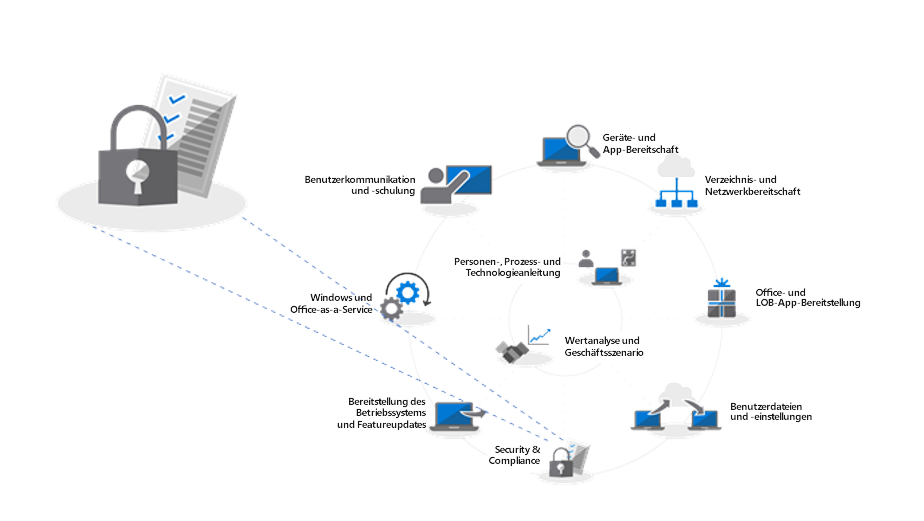
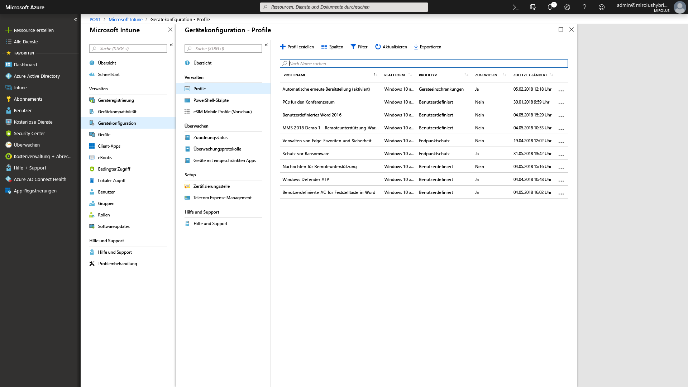

# Schritt 5: Überlegungen zu Sicherheit und ComplianceStep 5: Security and Compliance Considerations

<table>
<thead>
<td></td>
<td>
<strong>Schritt 5: Überlegungen zu Sicherheit und Compliance</strong><strong>Step 5: Security and Compliance Considerations</strong>

Windows 10 und Office 365 ProPlus bieten neue Methoden zum Schützen von Daten, Geräten und Benutzern und können schnell Bedrohungen erkennen und darauf reagieren. Erfahren Sie außerdem, wie Sie mit häufigen Problemen im Zusammenhang mit der Datenträgerverschlüsselung, Antischadsoftware-Apps und Richtlinien beim Umstieg auf Windows 10 umgehen.Windows 10 and Office 365 ProPlus provide new ways to protect your data, devices and users and quickly detect and respond to threats. Also, learn how to deal with common problems associated with disk encryption, anti-malware apps and policies when moving to Windows 10.
</td>
<td></td>
</thead>
</table>

>[!NOTE]
>Sicherheit und Compliance ist der fünfte Schritt in dem von uns empfohlenen Rad für den Bereitstellungsprozess, der die Sicherheit in Windows 10 und Office 365 ProPlus sowie Compliance behandelt.Security and Compliance is the fifth step in our recommended deployment process wheel covering Windows 10 and Office 365 ProPlus security and compliance considerations. Wenn Sie den vollständigen Desktopbereitstellungsprozess sehen möchten, besuchen Sie das [Bereitstellungscenter für modernen Desktop](https://aka.ms/HowToShift).To see the full desktop deployment process, visit the [Desktop Deployment Center](https://aka.ms/HowToShift).
>

Überprüfen Sie nun die Optionen für die Nutzung neuer Sicherheits- und Compliance-Funktionen im Rahmen der Windows 10- und Office 365 ProPlus-Bereitstellung zusammen mit den Aspekten und allgemeinen Hindernissen beim Übergang von früheren Versionen von Windows und Office.Now it's time to review options for targeting new security and compliance capabilities as part of your Windows 10 and Office 365 ProPlus deployment, along with the considerations and common blockers when moving from previous versions of Windows and Office. Viele der sicherheitsbezogenen Funktionen in Windows 10 treiben bereits allein den Übergang zu neueren Plattformen voran.Many of the security-related capabilities in Windows 10 alone are driving the shift to the newer platform. Darüber hinaus bieten die Integration mit Clouddiensten in Office 365 und Identitätsoptionen in Azure Active Directory Zugriff auf neue und fortlaufend aktualisierte Schutzmechanismen für Ihre Daten, Geräte und Benutzer.Also, integration with cloud services in Office 365 and identity options using Azure Active Directory brings access to new and continually updated protections for your data, devices and users.

## Überwinden potenzieller sicherheitsbezogener BereitstellungsblockadenOvercoming Potential Security-Related Deployment Blockers

Bevor wir die neuen Möglichkeiten erläutern, die Sie beim Übergang zu Windows 10 und Office 365 ProPlus hinzufügen können, und wie Sie diese Erfahrungen mit der Cloud verbinden, sehen wir uns zunächst einmal einige Trends an, die den Bereitstellungsprozess häufig behindern.Before explaining new capabilities that you can add as you move to Windows 10 and Office 365 ProPlus and connect those experiences to the cloud, let’s start with a few trends we’re seeing that can often interrupt deployment progress.

### DatenträgerverschlüsselungDisk Encryption

Eines der anfänglichen Probleme, auf das Sie möglicherweise zuerst stoßen, ist die Datenträgerverschlüsselung. Viele Lösungen für die Datenträgerverschlüsselung können nicht einfach von einer früheren Version von Windows auf eine neuere Version von Windows aktualisiert werden.First one of the initial challenges you might encounter is hard disk encryption. Many solutions for hard disk encryption cannot easily be upgraded from a previous version of Windows to a newer version of Windows.

Einige Lösungen zur Datenträgerverschlüsselung ermöglichen Ihnen, Upgrades mit der Option „/reflectdrivers“ im Windows-Setup für bestimmte Versionen der Plattformen durchzuführen, wobei andere Lösungen erfordern, dass Sie den Datenträger vor der Bereitstellung zunächst entschlüsseln und nach der Installation von Windows 10 erneut verschlüsseln. Einige Lösungen ermöglichen außerdem nicht den Übergang vom Master Boot Record (MBR) mit einem älteren BIOS zu einer GUID Partition Tabelle (GPT), die für UEFI erforderlich ist. Dies ist wichtig, da eine 64-Bit-Version von Windows 10 mit UEFI erforderlich ist, damit die neuen, auf Virtualisierung basierenden Sicherheitsfunktionen in Windows 10 erforderlich ist. Diese werden weiter unten erläutert.Some disk encryption solutions allow you to perform the upgrades when using the ‘/reflectdrivers’ option with Windows Setup on certain versions of their platforms, but others may require you to unencrypt the drive prior to deployment, then re-encrypt after Windows 10 is installed. Some solutions also do not allow you to move from Master Boot Record (MBR), using legacy BIOS, to GUID Partition Table (GPT), required for UEFI. This is important because a 64-bit version of Windows 10 with UEFI is required for the new virtualization-based security capabilities in Windows 10 and those are explained below.

Eine Möglichkeit zur Lösung dieser Probleme ist die Verwendung von BitLocker in Windows 10, das in Windows 10 Pro und höhere Editionen enthalten ist. BitLocker ermöglicht Ihnen, den Schutz für Betriebssystemupgrades und Feature-Updates als Teil des Prozesses auszusetzen.One option to resolve these issues is using BitLocker in Windows 10, which is included in Windows 10 Pro and higher editions. BitLocker allows you to suspend protection for OS upgrades and Feature Updates as part of the process.

  [Grundlegende BitLocker-Bereitstellung](https://docs.microsoft.com/de-DE/windows/security/information-protection/bitlocker/bitlocker-basic-deployment)[Bitlocker basic deployment](https://docs.microsoft.com/en-us/windows/security/information-protection/bitlocker/bitlocker-basic-deployment)

### Kompatibilität mit Antiviren- und AntischadsoftwareAntivirus and Antimalware Application Compatibility

Als zweiten Punkt möchten wir anführen, dass zwar mehr als [99 % der Windows-Anwendungen zwischen Windows 7 und Windows 10 kompatibel sind](https://www.microsoft.com/en-us/microsoft-365/blog/2018/09/06/helping-customers-shift-to-a-modern-desktop/), wobei Antivirensoftware-Apps (AV) oder VPN-Clients (Virtual Privat Network) häufig eine Ausnahme darstellen. Diese Anwendungen implementieren oft nicht standardmäßige Entwicklungsmethoden und APIs und verwenden häufig nicht dokumentierte Vorgehensweisen zum Schutz Ihres Systems oder zum Herstellen der Verbindung mit Netzwerkressourcen.Second, while we’ve seen that more than [99% of Windows applications are compatible](https://www.microsoft.com/en-us/microsoft-365/blog/2018/09/06/helping-customers-shift-to-a-modern-desktop/) between Windows 7 and Windows 10, the exceptions are often anti-virus (AV) apps or Virtual Private Network (VPN) clients. These applications often implement non-standard development practices and APIs, using often undocumented ways to protect your system or connect you to network resources.

Daher können diese Apps naturgemäß empfindlich sein, was Änderungen beim Übergang zu einer neuen Version von Windows betrifft. Wenn Ihre AV- oder VPN-Software in Windows 10 oder nach dem Upgrade nicht funktioniert, können Sie das Problem in der Regel dadurch beheben, dass Sie die App durch ein App ersetzen, die für Windows 10 getestet wurde und unterstützt wird.As a result, these apps by nature can be fragile to changes when shifting to a new version of Windows. If your AV or VPN software doesn’t work in Windows 10 or after upgrading, the fix is typically to replace the app you’re using with something supported and tested on Windows 10.

### SicherheitsrichtlinienSecurity Policies

Die Active Directory-Gruppenrichtlinieneinstellungen, die Sie für ältere Versionen von Windows und Office verwendet haben, können möglicherweise nicht direkt in Windows 10 und Office 365 ProPlus übernommen werden, und Sie müssen verschiedene Aspekte für die neueren Sicherheits- und Compliance-Funktionen berücksichtigen. Es empfiehlt sich, das Microsoft Security Compliance-Toolkit zu nutzen, um einen Grundeindruck der Sicherheitsrichtlinien für die aktuellen Versionen von Windows und Office zu erhalten. Darüber hinaus ist es sinnvoll, dass Sie sich die Richtlinien für die Verwaltung mobiler Geräte im Rahmen von Microsoft Intune ansehen.Your Active Directory Group Policy settings used for older versions of Windows and Office may not translate directly to Windows 10 and Office 365 ProPlus, and there are different considerations with newer security and compliance capabilities. It’s a good idea to use the Microsoft Security Compliance Toolkit to get a baseline of the security policies for current versions of Windows and Office. Additionally, it’s worth looking into Mobile Device Management policies as part of Microsoft Intune.

## 

## Neue Sicherheits- und Compliancefunktionen in Microsoft 365New Security and Compliance Capabilities in Microsoft 365

Sie haben nun mehr über die Aspekte erfahren, die Sie beim Übertragen der aktuellen Schutzfunktionen berücksichtigen müssen und was Sie vor dem Übergang beachten müssen. Sehen wir uns jetzt die neuen Möglichkeiten an, die Sie beim Übergang zu Windows 10, Office 365 ProPlus und cloudbasierten Optionen aus EMS und darüber hinaus nutzen können.Now, those were considerations for moving your current protections forward and things to be aware of before your shift. Now let’s take a look at new capabilities that you can take advantage of when moving to Windows 10, Office 365 ProPlus and cloud-based options from EMS and beyond.

### Identitäts- und ZugriffsverwaltungIdentity and Access Management

Wir beginnen bei der Identitäts- und Zugriffsverwaltung. Azure Active Directory ist die erste Wahl bei der Identitätskontrolle für Apps, Geräte und Clouddienste und der moderne Ansatz für die Verbindung mit Office 365 und anderen Clouddiensten. Der bedingte Zugriff ermöglicht Ihnen, verschiedene Authentifizierungsanforderungen zu definieren, basierend darauf, von wo Sie sich anmelden, welches Gerät Sie verwenden und ob anomales Verhalten auftritt.Starting with identity and access management. Azure Active Directory is the identity control plane for apps, devices and Cloud services and is the modern way to connect to Office 365 and other Cloud services. Conditional access allows you to define different authentication requirements based on where you are logging in from, which device you're using, as well as things like anomalous behaviors.

Auf Geräteebene können biometrische Merkmale eindeutige IDs für den einfachen und sicheren Zugriff auf Ihre Geräte und Apps bereitstellen und somit die Verwendung von Kennwörtern überflüssig machen. Windows Hello bietet eine gerätebasierte mehrstufige Authentifizierung. Es nutzt das Gerät selbst, Ihre PIN oder eindeutige biometrische Kennzeichen wie Ihr Gesicht oder Ihren Fingerabdruck, was Sie über eine Richtlinie erzwingen können.At the device level, biometrics can provide unique identifiers for simpler and more secure access to your devices and apps - as you move toward the goal of eliminating passwords. Windows Hello offers device-based, multi-factor authentication. It relies on the device itself, your PIN, or unique biometric identifier such as your face or fingerprint, which you can enforce via policy.

  [Grundlagen der Identitätsverwaltung in Azure](https://docs.microsoft.com/de-DE/azure/active-directory/fundamentals/identity-fundamentals)[Fundamentals of Azure identity management](https://docs.microsoft.com/en-us/azure/active-directory/fundamentals/identity-fundamentals)

  [Grundlegendes zu Azure-Identitätslösungen](https://docs.microsoft.com/de-DE/azure/active-directory/fundamentals/understand-azure-identity-solutions)[Understand Azure identity solutions](https://docs.microsoft.com/en-us/azure/active-directory/fundamentals/understand-azure-identity-solutions)

  [Bedingter Zugriff in Azure Active Directory](https://docs.microsoft.com/de-DE/azure/active-directory/conditional-access/overview)[Azure Active Directory Conditional Access](https://docs.microsoft.com/en-us/azure/active-directory/conditional-access/overview)

  [Windows Hello for Business](https://docs.microsoft.com/de-DE/windows/security/identity-protection/hello-for-business/hello-identity-verification)[Windows Hello for Business](https://docs.microsoft.com/en-us/windows/security/identity-protection/hello-for-business/hello-identity-verification)

### Auf Virtualisierung basierende SicherheitVirtualization-based security

Über die Identität hinausgehend können Sie jetzt auch einen kontinuierlichen Schutz vor bekannten und unbekannten Bedrohungen aktivieren. Hierzu verwendet Windows 10 im Kern auf Virtualisierung basierende Sicherheit, um die Integrität beim Booten und Codeintegrität mit Secure Boot zu gewährleisten. Darüber hinaus können wir den Identitätsdiebstahl mit Credential Guard verhindern, indem geheime Schlüssel von Benutzern isoliert von Windows gespeichert werden. Außerdem kann Application Guard browserbasierte Bedrohungen isolierten und Maßnahmen dagegen ergreifen, indem der Browser in einem isolierten Container ausgeführt wird. Alle diese Technologien verwenden die auf Virtualisierung basierende Sicherheit in Windows 10 und sind grundlegende Änderungen, die nicht auf einem Windows 7-System auf Hardware-Ebene repliziert werden können. Beachten Sie, dass sie darüber hinaus UEFI, 64-Bit-Windows und die Unterstützung der Virtualisierungserweiterung mit SLAT erfordern.Now beyond identity, you can also enable continuous protection against both known and unknown threats and to do this Windows 10 uses virtualization-based security at the core to ensure boot integrity and code integrity using Secure Boot. We can help also stop credential theft with Credential Guard by maintaining user secrets in isolation from Windows. And, Application Guard can isolate and mitigate browser-based threats by running the browser in an isolated container. All of these technologies use virtualization-based security in Windows 10 and are foundational changes that cannot be replicated on a Windows 7 system – note that these also require UEFI, 64-bit Windows and virtualization extension support with SLAT – at the hardware level.

  [Mehr zur auf Virtualisierung basierenden Sicherheit](https://docs.microsoft.com/de-DE/windows-hardware/design/device-experiences/oem-vbs)[More on Virtualization-based Security](https://docs.microsoft.com/en-us/windows-hardware/design/device-experiences/oem-vbs)

### Sicherheitsverbesserungen durch ClouddiensteSecurity enhancements from cloud services

Clouddienste bieten eine zusätzliche Stufe für optionalen Schutz, um die Sicherheit von Windows und Office zu verbessern. Sie können Ihnen eine neue Stufe der Kontrolle bieten, häufig in Echtzeit, mit der neue Angriffe und Angriffstypen sofort erkannt, abgewehrt und behandelt werden können(insbesondere im Vergleich zu herkömmlichen Softwareaktualisierungen und AV-Signaturdateien), wohingegen die Bereitstellungsdauer von Antworten und Updates grundsätzlich langsamer ist.Cloud services provide another layer of optional protection to improve Windows and Office security. These can give you a new level of often real-time control that can instantly detect, resist and respond to new attacks and attack types – especially compared to traditional software updating and AV signature files – where response and update deployment times are inherently slower.

Zusammen mit Microsoft Intelligent Security Graph haben Sie schnelleren Zugriff auf Informationen zu und Schutzfunktionen gegen aufkommende Bedrohungen. Hier sind einige Beispiele dafür aufgeführt, welche Funktionen Sie nutzen können, angefangen bei Office.Along with the Microsoft Intelligent Security Graph, you have faster access to both information and protections from emerging threats. Here are a few examples of what you can take advantage of, starting with Office.

  **
  [Verhinderung von Datenverlust (Data Loss Prevention, DLP)](https://docs.microsoft.com/de-DE/office365/securitycompliance/data-loss-prevention-policies)\*\* ist in Office 365 ProPlus integriert und informiert Benutzer von Sicherheitsrichtlinien, wenn hochgradig riskante Inhalte wie Kreditkarten- oder Ausweisnummern erkannt werden. Die Richtlinien können nach der Benachrichtigung der Benutzer darüber informieren oder das Senden blockieren.**[Data Loss Prevention](https://docs.microsoft.com/en-us/office365/securitycompliance/data-loss-prevention-policies)** built into Office 365 ProPlus, helps inform users of security policies when high risk content like credit card or identification numbers are detected. Policies can inform or block sending and sharing after notifying users.

  **
  [Azure Information Protection](https://docs.microsoft.com/de-DE/azure/information-protection/rms-client/client-admin-guide) \*\* ist ein Dienst, der Office ergänzt und mit dem Benutzer auf einfache Weise ihre Office-Dateien klassifizieren und bezeichnen können. Er kann automatische Aktionen für Dateien mit Bezeichnungen ausführen, z. B. Verschlüsselung oder Sperren der Weitergabe.**[Azure Information Protection](https://docs.microsoft.com/en-us/azure/information-protection/rms-client/client-admin-guide)** is a complementary service that can be used with Office, allowing users to easily classify and label their Office files. It can trigger automatic action on labeled files, such as encryption or locking down sharing.

Wir haben darüber hinaus den Schutz durch **[sichere Links](https://docs.microsoft.com/de-DE/office365/securitycompliance/atp-safe-links)** in Office-Apps eingeführt, um Sie bekannten Websites mit böswilligen Inhalten anhand einer dynamischen Liste zu schützen.We've also introduced **[Safe Links](https://docs.microsoft.com/en-us/office365/securitycompliance/atp-safe-links)** protection across Office apps to protect you against a dynamic list of known malicious websites.

Zusätzlich dazu gehen **[sichere Anlagen](https://docs.microsoft.com/de-DE/office365/securitycompliance/atp-safe-attachments)** in Outlook und als Teil von Exchange Online geht weit über das Filtern von E-Mail-Nachrichten zum Prüfen von Anhängen hinaus. Wenn ein Anhang mit einem hohen Risiko erkannt wird, informiert Sichere Anlagen den Benutzer über bekannte böswillige Anhänge und entfernt sie aus der E-Mail.Additionally, **[Safe Attachments](https://docs.microsoft.com/en-us/office365/securitycompliance/atp-safe-attachments)** in Outlook and as part of Exchange Online goes beyond email filtering to inspect attachments. If a high-risk attachment is identified, Safe Attachments will inform the user of known malicious attachments and remove them from email.

  **
  [Office 365-Nachrichtenverschlüsselung](https://docs.microsoft.com/de-DE/office365/securitycompliance/encryption) \*\* (OME) kann ebenfalls verwendet werden, um die Sicherheit von E-Mails und gesendeten Anhängen zu gewährleisten, wobei sichergestellt wird, dass nur die beabsichtigten Empfänger den E-Mail-Inhalt anzeigen können. OME arbeitet nahtlos mit Google-, Yahoo- und Microsoft-Endbenutzerkonto-Authentifizierung zusammen, und die Einmalkennungen ermöglichen Benutzern anderer E-Mail-Dienste, E-Mails ebenfalls sicher zu empfangen.**[Office 365 Message Encryption](https://docs.microsoft.com/en-us/office365/securitycompliance/encryption)** (OME) can also be used to safeguard email and attachments sent, ensuring only intended recipients can view email content. OME works seamlessly with Google, Yahoo, and Microsoft consumer account authentication, and one-time passcodes allow users of other email services to securely receive email as well.

#### Zusätzliche Schutzfunktionen in Windows 10Additional Windows 10 protections

  **
  [Windows Defender Application Control](https://docs.microsoft.com/de-DE/windows/security/threat-protection/windows-defender-application-control/windows-defender-application-control)\*\* in Windows 10 verwendet eine genehmigte Liste mit zugelassenen und nicht zugelassenen Anwendungen, die Microsoft auf ihre Sicherheit überprüft hat und die von Endpunkt-Sicherheitsrichtlinien mit Microsoft Intune verwaltet werden.**[Windows Defender Application Control](https://docs.microsoft.com/en-us/windows/security/threat-protection/windows-defender-application-control/windows-defender-application-control)** in Windows 10 operates off an approved allow and deny list of applications that Microsoft has checked for safety and all that is managed by endpoint protection policies using Microsoft Intune.

  **
  [Windows Defender Advanced Threat Protection](https://docs.microsoft.com/de-DE/windows/security/threat-protection/windows-defender-atp/overview) \*\* ist eine einheitliche Plattform für vorbeugenden Schutz, Erkennung nach einem Verstoß, automatisierte Untersuchung und Antworten. Es schützt Endpunkte vor Cyberbedrohungen, erkennt fortschrittliche Angriffe und Datenverstöße, automatisiert Sicherheitsvorfälle und verbessert den Sicherheitsstand.**[Windows Defender Advanced Threat Protection](https://docs.microsoft.com/en-us/windows/security/threat-protection/windows-defender-atp/overview)** is a unified platform for preventative protection, post-breach detection, automated investigation, and response. It protects endpoints from cyber threats; detects advanced attacks and data breaches, automates security incidents and improves security posture.

  **
  [Exploit Guard](https://docs.microsoft.com/de-DE/windows/security/threat-protection/windows-defender-exploit-guard/windows-defender-exploit-guard)\*\* verringert die Angriffsfläche bei ausgeführten Anwendungen, indem er verhindert, dass Schadsoftware in Windows eindringt, und indem er nicht vertrauenswürdigen Prozessen den Zugriff auf geschützte Ordner verweigert.**[Exploit Guard](https://docs.microsoft.com/en-us/windows/security/threat-protection/windows-defender-exploit-guard/windows-defender-exploit-guard)** helps reduce the attack surface for running applications by preventing malware from getting into Windows and blocking untrusted processes from accessing protected folders.

#### Microsoft IntuneMicrosoft Intune

  [Microsoft Intune](https://docs.microsoft.com/de-DE/intune/introduction-intune) fungiert als ein cloudbasierter Verwaltungsdienst für Szenarien mit mobilen Geräten, einschließlich iOS-, Android- und Windows-Geräten. Es kann nun für die gemeinsame Verwaltung konfiguriert werden, um Steuerungen für bestimmte Workloads zu ergänzen und zu erweitern, die von System Center Configuration Manager verwaltet werden. Ein Vorteil hierbei ist, dass für Geräte, die auf geschützte Ressourcen zugreifen, durchgesetzt werden kann, dass sie sich bei der Geräteverwaltung registrieren, auch wenn es sich um nicht verwaltete Geräte oder Geräte, die nicht der Domäne oder Azure AD beigetreten sind, handelt. Sie können auch die Vorteile einer granularen Konfiguration und der Erzwingung von Compliance-Richtlinien auf Ebene des Betriebssystems und von Anwendungen nutzen. Anwendungsrichtlinien und Einstellungen können zentral konfiguriert und für Office 365 ProPlus und Store-Apps in Windows 10 mit Microsoft Intune durchgesetzt werden.[Microsoft Intune](https://docs.microsoft.com/en-us/intune/introduction-intune) serves as a Cloud based management service for mobile scenarios, including IOS, Android and Windows devices, and can now be configured for co-management to complement and extend controls for specific workloads managed by System Center Configuration Manager. One advantage here is that, devices accessing protected resources can be required to enroll into device management – even non-managed, non-domain joined or non-Azure AD joined devices. You can also take advantage of granular configuration and compliance policy enforcement at the operating system and application level. Application policies and settings can be configured centrally and enforced for Office 365 ProPlus and Store apps in Windows 10 using Microsoft Intune.

## Nächster SchrittNext Step

## [Schritt 6: Bereitstellung des Betriebssystems und FeatureupdatesStep 6: OS Deployment and Feature Updates](https://aka.ms/mdd6)

## Vorheriger SchrittPrevious Step 

## [Schritt 4: Benutzerdateien und EinstellungenStep 4: User Files and Settings](https://aka.ms/mdd4)
