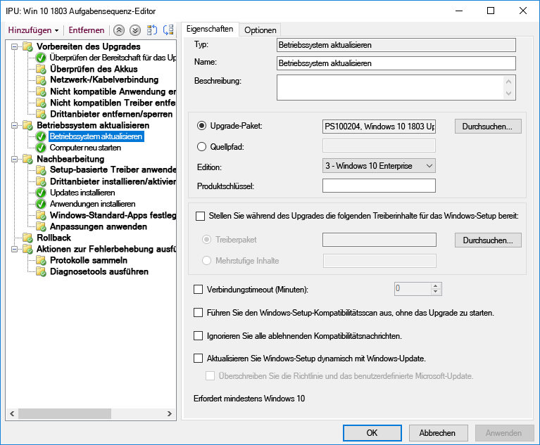
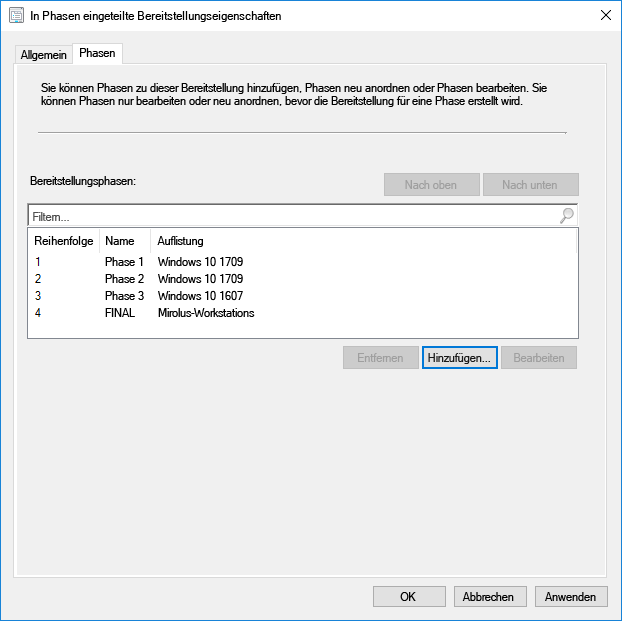
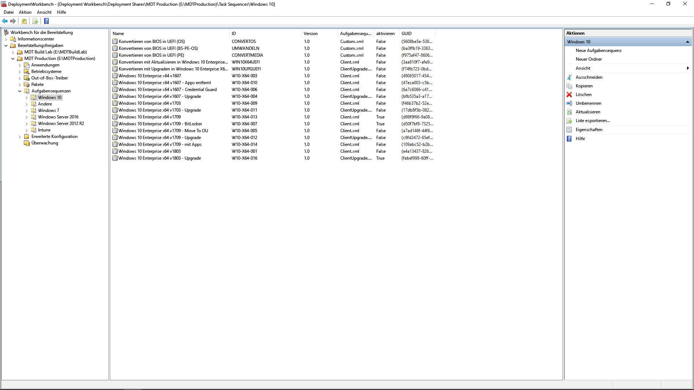

# Schritt 6: Bereitstellung des Betriebssystems und FeatureupdatesStep 6: OS Deployment and Feature Updates

<table>
<thead>
<td></td>
<td>
<strong>Schritt 6: Bereitstellung des Betriebssystems und Featureupdates</strong><strong>Step 6: OS Deployment and Feature Updates</strong>

Eine Bereitstellung basierend auf einer Aufgabenfolge wird zum Automatisieren von umfangreichen und stufenweisen Bereitstellungen für Bare-Metal-Installationen, Computeraktualisierungen und eines Computeraustauschs verwendet. Mithilfe von Aktualisierungsaufgabenfolgen können Sie im Hinblick auf größere halbjährliche Updates auf dem Laufenden bleiben. Windows Autopilot ist eine neue Ergänzung, durch die der Anschaffungsprozess eines neuen Computers modernisiert wird.Task sequence-based deployment is used to automate large scale, phased deployment for bare metal installs, PC refresh and PC replacement. Upgrade task sequences will also help you stay current with major semi-annual updates. And Windows Autopilot is a recent addition that modernizes the new PC acquisition process.
</td>
<td></td>
</thead>
</table>

>[!NOTE]
>Betriebssystembereitstellung und Featureupdates sind der sechste Schritt in dem von uns empfohlenen Rad für den Bereitstellungsprozess, der die Bereitstellung von Windows 10, Upgrades und Featureupdates behandelt.OS Deployment and Feature Updates is the sixth step in our recommended deployment process wheel covering Windows 10 OS deployment, upgrades and Feature Updates. Den vollständigen Desktopbereitstellungsprozess finden Sie im [Desktopbereitstellungscenter](https://aka.ms/HowToShift).To see the full desktop deployment process, visit the [Desktop Deployment Center](https://aka.ms/HowToShift).
>

Wenn Sie dem Rad für den Bereitstellungsprozess bis hier gefolgt sind, haben Sie die Schritte für die Geräte- und App-Bereitschaft zumindest teilweise abgeschlossen, Ihre Infrastruktur vorbereitet, App-Pakete konfiguriert und gesammelt, verfügen über einen Plan für die Migration von Benutzerdateien und das Konfigurieren von Standardeinstellungen sowie Pläne für die Beibehaltung vorhandener und möglicherweise auch für die Bereitstellung neuer Sicherheitssteuerungen.If you’ve been following the deployment process wheel till now, you’ve at least partially completed the steps for device and app readiness, prepared your infrastructure, configured and collected app packages, have a plan in place for migrating user files and configuring default settings as well as have plans for retaining your existing security controls and perhaps deploying new ones.

Sie sind jetzt an einer Stelle angelangt, an der Sie diese ganzen Puzzleteile zusammensetzen, um die Installation von Windows 10 und Office 365 ProPlus und den erforderlichen Treibern. Apps und anderen Komponenten so weit wie möglich zu automatisieren.Now we’ve arrived at the stage where you’re putting all these pieces together to automate as much as you can to install Windows 10 and Office 365 ProPlus, along with the necessary drivers, apps and whatever else is needed.

Letztlich ist das beste Maß für den Erfolg einer Betriebssystembereitstellung die Erfüllung der Benutzererwartungen und die Vermeidung von Arbeitsunterbrechungen. In diesem Schritt stellen Sie die Pilotbenutzer als Teil einer gestaffelten Bereitstellung bereit und testen sie. Hier noch ein Tipp, bevor Sie die Bereitstellung ausweiten: Sie müssen in unserem Rad für den Bereitstellungsprozess mit Schritt 8 fortfahren ([Benutzerkommunikation und -schulung](https://aka.ms/mdd8)), um sicherzustellen, dass die Benutzer über die anstehenden Änderungen informiert und entsprechend vorbereitet sind und dass Sie Ihren Rolloutfortschritt anhand einer fortlaufenden Überprüfung durch die phasenweise Bereitstellung messen können.Ultimately, the best measure of success with an OS deployment is meeting user expectations and avoiding disruptions in their work. And in this step, you’ll start testing and deploying to pilot users as part of a phased deployment. And one tip here, before you broaden deployment, you’ll need to skip ahead to step 8 on our deployment process wheel – [User Communications and Training](https://aka.ms/mdd8) to make sure users are informed and prepared for changes coming their way and that you can measure your roll-out pace with continuous validation using Phased Deployment.

## Windows Imaging-ProzessWindows Imaging Process

Die meisten Organisationen verwenden das Verfahren des PC-Imagings zum Konfigurieren und Erfassen eines Windows-Klons, einschließlich eines Basissatzes von wenigen installierten Standard-Apps, oder sogar ein noch einfacheres Image, das nur die Anwendungsruntimes und -updates enthält. Für diesen Vorgang verwenden Sie am besten einen virtuellen Computer, um unerwartete Kompatibilitätsprobleme mit Treibern zu vermeiden, und für Automatisierungszwecke.Most organizations use the process of PC imaging to configure and capture a clone of Windows, including a base set of a few standard apps installed, or an even a thinner image with only application runtimes and updates. The best way to do this is using a virtual machine for this process to avoid any unexpected driver-related compatibility issues and for automation purposes.

Wenn Sie den Weg der Imageerfassung wählen, sollten Sie so viele Aufgaben wie möglich automatisieren, damit Sie ein Image von höchster Qualität erhalten und einen wiederholbaren Prozess einrichten. Bei den meisten Bereitstellungen ist es ebenfalls empfehlenswert, vor dem Erfassen so wenige Anpassungen und vorinstallierte Apps in das Windows-Image aufzunehmen. Dies wir auch als „Thin Image“-Ansatz bezeichnet, durch den Bandbreite im Netzwerk gespart werden kann, indem die Anzahl der Apps im Image reduziert wird. Wenn Sie mit einem einfachen Image beginnen, können Sie die erforderlichen Apps, Sprachen und Konfigurationen in Layern hinzufügen, die dynamisch auf die Benutzer zugeschnitten werden können.If going the image capture route, it’s best to automate as much as possible to ensure the best quality image and a repeatable process. For most deployments, it is also recommended to put as little customization and pre-installed apps as possible in the Windows image prior to capturing. This is what is called a ‘thin image’ approach, which can save overall bandwidth on the network by eliminating the number of apps within the image. By starting with a thin base image, you can layer on required apps, languages and configurations dynamically tailored to users.

Während des Erstellungs- und Erfassungsvorgangs verwenden Tools wie der Microsoft Endpoint Configuration Manager (Current Branch) und das Microsoft Deployment Toolkit das Systemvorbereitungstool (auch als „Sysprep“ bezeichnet) zusammen mit dem Befehl zum Generalisieren, um das Image vor dem Erfassen der Windows 10-Installation als Image wieder zu versiegeln.During the build and capture process, tools like Microsoft Endpoint Configuration Manager (Current Branch) and the Microsoft Deployment Toolkit use the System Preparation Tool – or Sysprep – along with the “Generalize” command to reseal your image before they capture the Windows 10 installation as an image.

Das erfasste Image hat das Windows-Image-Format (WIM), wie jedes standardmäßige Windows-Installationsmedium. Sobald Sie Ihre eigene WIM-Datei erstellt haben, können Sie eine andere Tasksequenz als Teil der Betriebssystembereitstellung im Configuration Manager oder Microsoft Deployment Toolkit verwenden, um mit der Bereitstellung zusammenhängenden Aufgaben durchzuführen, das Image anzuwenden und Aufgaben vor und nach der Anwendung des Windows-Images auszuführen.The captured image will have the Windows image – or WIM – format like standard Windows installation media. Once you have your custom WIM file, you can use another task sequence as part of your OS deployment in Configuration Manager or Microsoft Deployment Toolkit to perform deployment-related tasks, to apply the image and run tasks before and after your Windows image is applied.

[Erstellen eines Windows 10-ReferenzimagesCreate a Windows 10 Reference Image](https://docs.microsoft.com/windows/deployment/deploy-windows-mdt/create-a-windows-10-reference-image)

[Erstellen einer Tasksequenz zum Installieren des BetriebssystemsCreate a task sequence to install an Operating System](https://docs.microsoft.com/configmgr/osd/deploy-use/create-a-task-sequence-to-install-an-operating-system)

### BereitstellungsartenDeployment Types

Sobald Sie ein benutzerdefiniertes Image erstellt haben, wird die Installation oder der Migrationstyp in die folgenden Kategorien unterteilt:With your custom image ready, the installation or migration type will fall into the following categories:

  - Die erste Kategorie ist die **Bare-Metal-Bereitstellung**. Dies ist das Szenario, das zum Bereitstellen eines Images auf einem sauberen Datenträger oder zum erneuten Erstellen eines Images für einen Computer verwendet wird, bei dem Sie keine der Daten auf dem Datenträger beibehalten möchten.First, **bare metal deployment**. This is the scenario used to deploy an image to a clean disk, or to reimage a computer where you don’t intend to keep any of the data on the disk

  - Die zweite Kategorie, ähnlich der Bare-Metal-Bereitstellung, ist die **Computeraktualisierung**. Der Hauptunterschied ist hierbei, dass der Benutzerstatus auf dem Datenträger erhalten bleibt\* bzw. nach dem Abschluss der Installation wiederhergestellt wird.And second, similar to bare metal, is **Computer Refresh,** with the key difference that user state remains on the disk\* or will be restored after the install is complete

  - Die dritte Kategorie ist der **Computerersatz**. Wie der Name bereits andeutet, ersetzen Sie hier einen PC durch einen anderen PC. In diesem Fall wird häufig eine Sicherung der Benutzerdateien vom ersten PC an einem zentralen Speicherort vorgenommen, und die Dateien werden anschließend auf dem zweiten Computer wiederhergestellt.And last is **Computer Replacement**. Here as the name implies, you are replacing a PC with another PC. In this case, there is often a backup of user files from the first PC to a central location, then a restore of those files to the second PC.

Alle drei dieser Szenarien haben eines gemeinsam: Sie verwenden für die Ausführung eine Aufgabensequenz, wobei in jedem Fall ein benutzerdefiniertes Image angewendet werden kann.All three of these scenarios have something in common, they use a task sequence to run, and a custom image can be applied each time.

[Mehr über Windows 10-BereitstellungsszenarienMore About Windows 10 Deployment Scenarios](https://docs.microsoft.com/windows/deployment/windows-10-deployment-scenarios)

### Direktes Upgrade durch Aufgabensequenz-AutomatisierungIn-place Upgrade using Task Sequence Automation

Zusätzlich zu diesen Bereitstellungstypen gibt es nun eine neue Option als eine Tasksequenz von Microsoft Endpoint Configuration Manager (Current Branch) in Windows 10: das direkte Upgrade mit der Upgrade-Tasksequenz.In addition to these deployment types, there is a new option available now as a Microsoft Endpoint Configuration Manager (Current Branch) Task Sequence with Windows 10 – and in-place upgrade using the Upgrade Task Sequence.

Direkte Upgrades von einer vorherigen Version von Windows erfordern keine Aufgabensequenz. Dieser Ansatz wird jedoch empfohlen, wenn Sie die Bereitstellung auf Unternehmensebene durchführen. bei einem direkten Upgrade können Sie kein benutzerdefiniertes Image mit Anwendungen verwenden. Sie können jedoch die standardmäßige install.wim anhand von Offline-Servicing aktualisieren. Sie können beispielsweise sicherstellen, dass vor dem Upgrade die neuesten Windows-Updates angewendet wurden.In-place upgrades from a previous version of Windows do not require a task sequence, but it is a recommended approach when deploying at enterprise scale. An in-place upgrade does not allow you to apply a custom image with applications, but you can update the default install.wim using offline servicing. For example, you can to make sure it has the latest Windows updates applied prior to performing upgrades.

Das direkte Upgrade verwendet das Windows-Setup. Das Setup-Programm führt mehrere kleine Überprüfungen vor der Installation durch und sucht dabei nach bekannten Kompatibilitätsproblemen. Es behält darüber hinaus den Benutzerstatus und die Anwendungen bei und entfernt nur, was mit der zu installierenden Version von Windows 10 nicht kompatibel ist. Mit dieser Option werden die zuvor installierten Anwendungen und der Benutzerstatus beibehalten. Ein direktes Upgrade ermöglicht Ihnen außerdem, ein Rollback auf das vorherige Betriebssystem durchzuführen, wenn dies zur Problembehandlung notwendig ist.In-place upgrade uses windows setup. The setup engine runs several small pre-installation checks looking for known compatibility issues. It also preserves the user state and applications and only removes what isn’t compatible with the version of Windows 10 being installed. With this option, previously installed applications and user state are preserved. In-place upgrade also allows you to roll-back to the previous OS installed if needed for troubleshooting purposes.

[Windows 10-Überprüfung vor dem Upgrade mit setup.exeWindows 10 Pre-Upgrade Validation Using setup.exe](https://blogs.technet.microsoft.com/mniehaus/2015/08/23/windows-10-pre-upgrade-validation-using-setup-exe/)

Das Szenario des direkten Upgrades kann zum Migrieren von älteren Versionen von Windows auf Windows 10 sowie als Upgrade von älteren Windows 10-Versionen verwendet werden. Nachdem das Windows-Setup das Upgrade abgeschlossen hat, kann die Aufgabensequenz weiter ausgeführt werden und Anwendungen wie Office aktualisieren, Treiber ersetzen und Personalisierungseinstellungen anwenden. Ebenso können Sie mit der Upgrade-Aufgabensequenz die Aufgaben vor der Installation oder Überprüfungen vor dem Durchführen des Upgrades vornehmen.The in-place upgrade scenario can be used to migrate to Windows 10 from legacy versions of Windows, as well as upgrade from previous versions of Windows 10. After Windows Setup completes the upgrade, your task sequence can continue to run and upgrade applications like Office, replace drivers, and apply personalization settings. Likewise, you can use the Upgrade Task Sequence to perform pre-installation tasks or checks prior to carrying out the upgrade.

[Durchführen eines direkten Upgrades auf Windows 10 mit dem Configuration ManagerPerform an in-place upgrade to Windows 10 using Configuration Manager](https://docs.microsoft.com/windows/deployment/upgrade/upgrade-to-windows-10-with-system-center-configuraton-manager)

[Erstellen einer Aufgabensequenz für ein Betriebssystemupgrade in Configuration ManagerCreate a task sequence to upgrade an OS in Configuration Manager](https://docs.microsoft.com/configmgr/osd/deploy-use/create-a-task-sequence-to-upgrade-an-operating-system)

### Phasenweise BereitstellungPhased Deployment

Beim Planen der Bereitstellung sehen Sie bestimmte Computer für die Bare-Metal-, Aktualisierungs-, Ersetzungs- und Upgradepfade vor. Der empfohlene Ansatz ist in diesem Fall die phasenweise Bereitstellung auf Sammlungen ähnlicher Computer. Auf diese Weise können Sie die Kompatibilität, Lieferung und Automatisierung, Benutzerakzeptanz, Netzwerkbandbreitennutzung und andere Faktoren überprüfen, bevor Sie den Umfang der Bereitstellung erweitern.As you're planning your deployment, you'll be targeting computers for bare metal, refresh, replace and upgrade paths. The recommended approach in this case is to use phased deployment to collections of similar machines. This way, you can validate compatibility, delivery and automation, user acceptance, network bandwidth consumption, and other factors before increasing the scale of your deployment.

### Empfohlenen Tools: Microsoft Endpoint Configuration Manager (Current Branch) und das Microsoft Deployment ToolkitRecommended Tools: Microsoft Endpoint Configuration Manager (Current Branch) and the Microsoft Deployment Toolkit

Unabhängig vom gewählten Bereitstellungstyp müssen Sie sicherstellen, dass er so weit wie möglich automatisiert ist, damit eine gewisse Vorhersagbarkeit und Wiederholbarkeit gegeben ist. Microsoft bietet zwei Lösungen zum Automatisieren der Betriebssystembereitstellung mit automatisieren Aufgabensequenzen an:Regardless of the deployment type you choose, you’ll want to make sure it’s as automated as possible for predictability and repeatability. Microsoft offers two solutions to automate OS deployment using automated task sequences:

  - **[Microsoft Endpoint Configuration Manager](https://docs.microsoft.com/configmgr/core/understand/introduction)** (ConfigMgr) bietet integrierte Funktionen für die Betriebssystembereitstellung, die die Funktionen für die Softwareverteilung und die Verwaltung von Softwareupdates ergänzen. ConfigMgr wird von zahlreichen Organisationen aller Größen genutzt und unterstützt alle vier Arten der Windows-Bereitstellung. Optional können Sie ConfigMgr mit Microsoft Intune integrieren, um weitere Funktionen für die Bereitstellung und Geräteverwaltung nutzen zu können.**[Microsoft Endpoint Configuration Manager](https://docs.microsoft.com/configmgr/core/understand/introduction)** (ConfigMgr) provides built-in operating system deployment capabilities to complement its capabilities for software distribution and software update management. ConfigMgr is widely used by organizations of all sizes and supports all four Windows deployment types. Optionally, you can integrate ConfigMgr with Microsoft Intune to add additional capabilities for deployment and device management.

  - Eine weitere beliebte Bereitstellungsmethode ist das kostenlose \*\* [Microsoft Deployment Toolkit](https://docs.microsoft.com/windows/deployment/deploy-windows-mdt/get-started-with-the-microsoft-deployment-toolkit) \*\* (MDT), das in der Regel von kleinen und mittleren Organisationen für die Betriebssystembereitstellung verwendet wird. Das MDT benötigt nur sehr wenig Infrastruktur. MDT kann in Windows Deployment Services (WDS) für das Booten im Netzwerk integriert werden. Es unterstützt alle vier Bereitstellungstypen sowie die Installation von Anwendungen, Treibern und Einstellungen. Darüber hinaus kann MDT natürlich auch in Configuration Manager integriert werden.And one other popular deployment option is the free **[Microsoft Deployment Toolkit](https://docs.microsoft.com/windows/deployment/deploy-windows-mdt/get-started-with-the-microsoft-deployment-toolkit)** (MDT) which is typically used by small and medium sized organizations for OS deployment. This requires very little infrastructure. MDT integrates with Windows Deployment Services (WDS) for network boot. It supports all four deployment types as well as installation of applications, drivers, and settings. And of course, MDT can even be integrated with Configuration Manager.

### Windows AutopilotWindows Autopilot

Mit einer neuen Option von Windows 10 können Sie neue PCs als Bestandteil Ihres Hardware-Aktualisierungszyklus mit dem Windows Autopilot konfigurieren.A new option with Windows 10 is to configure new PCs as part of your hardware refresh cycle using Windows Autopilot. Hierbei können Sie mit Hardwareanbietern zusammenarbeiten, um die standardmäßige Windows-Setup-Umgebung anzupassen, indem Sie z. B. Optionen wie Lizenzvereinbarungen oder Diagnosedaten-Einstellungen, die Benutzern angezeigt werden, entfernen.Here you can work with supporting hardware vendors to customize the default Windows setup experience – for example by eliminating options presented to users, like Licensing Agreements or diagnostic data settings.

Wenn sich ein Benutzer dann während des Setups mit seinen Azure AD-Anmeldedaten bei dem PC anmeldet, registriert sich das Gerät bei Microsoft Intune, das dann den Bereitstellungsprozess übernimmt und Anwendungen, die Konfiguration von Softwareupdates und Compliance-Richtlinien anwendet. Optional kann Windows Autopilot auch verhindern, dass der Benutzer erst dann auf die erste Sitzung zugreifen kann, wenn die Bereitstellung abgeschlossen ist.Then, when a user signs in to the PC during setup using their Azure AD credentials, the device enrolls into Microsoft Intune, which can then take over the deployment process and apply applications, software updates configurations and compliance policies. Windows Autopilot can also optionally prevent the user from accessing the first session until provisioning is complete.

[Übersicht über Windows AutopilotOverview of Windows Autopilot](https://docs.microsoft.com/windows/deployment/windows-autopilot/windows-10-autopilot)

[Voraussetzungen für Windows AutopilotWindows Autopilot Prerequisites](https://docs.microsoft.com/windows/deployment/windows-autopilot/windows-10-autopilot#prerequisites)

## Windows Update for Business für FeatureupdatesWindows Update for Business for Feature Updates

Windows Update for Business ist ein kostenloser Dienst, mit dem IT-Experten Windows 10-Geräte immer auf dem neuesten Stand halten können, indem Sie die Geräte direkt an den Windows Update-Dienst anschließen.Windows Update for Business is a free service that enables IT Pros to keep Windows 10 devices always up to date by directly connecting the devices to the Windows Update service. Windows Update for Business kann über Gruppenrichtlinien oder MDM-Lösungen wie Microsoft Intune konfiguriert werden und ermöglicht es IT-Experten, [Bereitstellungsringe](https://docs.microsoft.com/windows/deployment/update/waas-deployment-rings-windows-10-updates) zu erstellen, um neue Builds zu überprüfen.Windows Update for Business can be configured via Group Policy or through MDM solutions such as Microsoft Intune and allows IT Pros to create [deployment rings](https://docs.microsoft.com/windows/deployment/update/waas-deployment-rings-windows-10-updates) to validate new builds. Es ist in vorhandene Verwaltungstools wie Windows Server Update Services (WSUS), Microsoft Endpoint Configuration Manager (Current Branch) und Microsoft Intune integriert.It is integrated into existing management tools such as Windows Server Update Services (WSUS), Microsoft Endpoint Configuration Manager (Current Branch), and Microsoft Intune. Darüber hinaus unterstützt Windows Update for Business Peer-to-Peer-Übermittlung, um die Bandbreiteneffizienz zu optimieren und die Überlastung des Netzwerks zu reduzieren.Additionally, Windows Update for Business supports peer-to-peer delivery to help optimize bandwidth efficiency and reduce network congestion.

Ausführlichere Informationen zu Windows Update for Business finden Sie in der folgenden Dokumentation:For more detailed information on Windows Update for Business please review the following documentation:

- [Bereitstellen von Updates mit Windows Update for BusinessDeploy Updates Using Windows Update for Business](https://docs.microsoft.com/windows/deployment/update/waas-manage-updates-wufb)
- [Konfigurieren von Windows Update for BusinessConfigure Windows Update for Business](https://docs.microsoft.com/windows/deployment/update/waas-configure-wufb)
- [Integrieren von Windows Update for Business in vorhandene VerwaltungstoolsIntegrate Windows Update for Business with Existing Management Tools](https://docs.microsoft.com/windows/deployment/update/waas-integrate-wufb)
- [Verwenden von Gruppenrichtlinien zum Konfigurieren von Windows Update for BusinessUse Group Policy to configure Windows Update for Business](https://docs.microsoft.com/windows/deployment/update/waas-wufb-group-policy)
- [Verwenden von Microsoft Intune zum Konfigurieren von Windows Update for BusinessUse Microsoft Intune to configure Windows Update for Business](https://docs.microsoft.com/intune/windows-update-for-business-configure)

## Nächster SchrittNext Step 

## [Schritt 7: Windows und Office als DienstStep 7: Windows and Office Servicing](https://aka.ms/mdd7)

## Vorheriger SchrittPrevious Step

## [Schritt 5: Überlegungen zu Sicherheit und ComplianceStep 5: Security and Compliance Considerations](https://aka.ms/mdd5)
