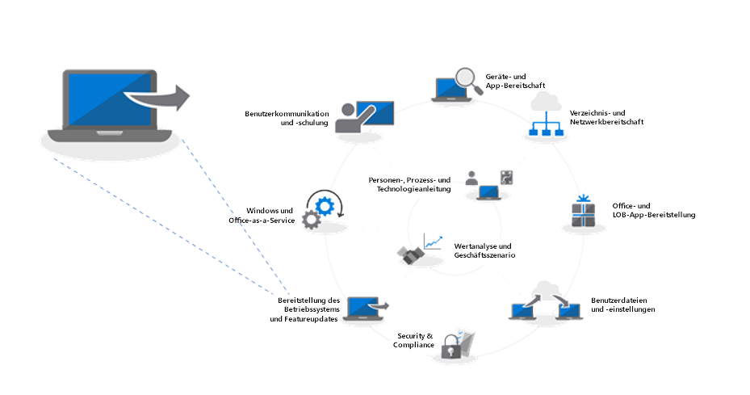
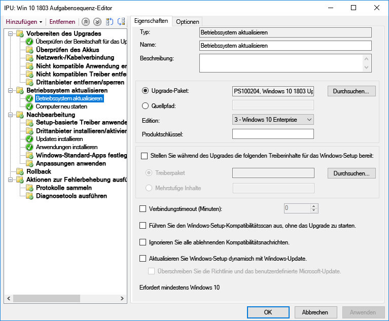
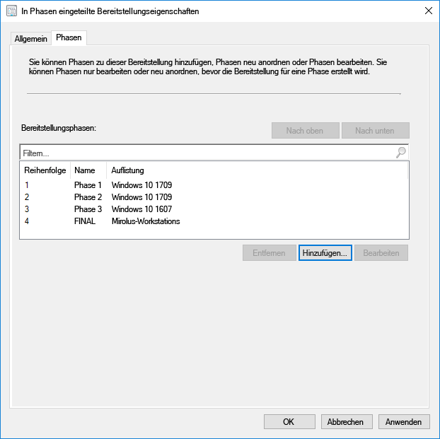
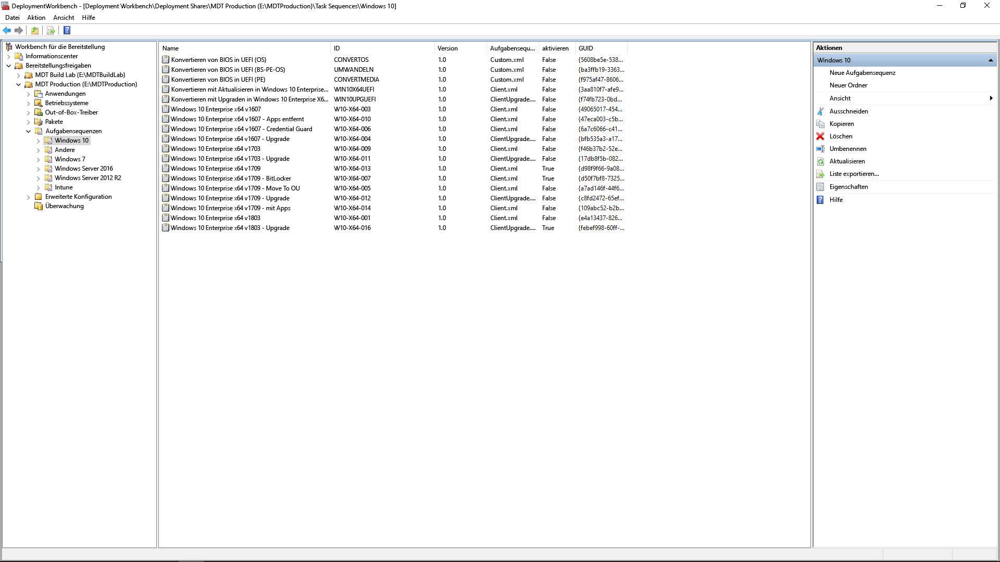

# Schritt 6: Bereitstellung des Betriebssystems und Featureupdates

<table>
<thead>
<td></td>
<td>
<strong>Schritt 6: Bereitstellung des Betriebssystems und Featureupdates</strong>

Eine Bereitstellung basierend auf einer Aufgabenfolge wird zum Automatisieren von umfangreichen und stufenweisen Bereitstellungen für Bare-Metal-Installationen, Computeraktualisierungen und eines Computeraustauschs verwendet. Mithilfe von Aktualisierungsaufgabenfolgen können Sie im Hinblick auf größere halbjährliche Updates auf dem Laufenden bleiben. Windows Autopilot ist eine neue Ergänzung, durch die der Anschaffungsprozess eines neuen Computers modernisiert wird.
</td>
<td></td>
</thead>
</table>

>[!NOTE]
>Betriebssystembereitstellung und Featureupdates sind der sechste Schritt in dem von uns empfohlenen Rad für den Bereitstellungsprozess, der die Bereitstellung von Windows 10, Upgrades und Featureupdates behandelt. Den vollständigen Desktopbereitstellungsprozess finden Sie im [Desktopbereitstellungscenter](https://aka.ms/HowToShift).
>

Wenn Sie dem Rad für den Bereitstellungsprozess bis hier gefolgt sind, haben Sie die Schritte für die Geräte- und App-Bereitschaft zumindest teilweise abgeschlossen, Ihre Infrastruktur vorbereitet, App-Pakete konfiguriert und gesammelt, verfügen über einen Plan für die Migration von Benutzerdateien und das Konfigurieren von Standardeinstellungen sowie Pläne für die Beibehaltung vorhandener und möglicherweise auch für die Bereitstellung neuer Sicherheitssteuerungen.

Sie sind jetzt an einer Stelle angelangt, an der Sie diese ganzen Puzzleteile zusammensetzen, um die Installation von Windows 10 und Office 365 ProPlus und den erforderlichen Treibern. Apps und anderen Komponenten so weit wie möglich zu automatisieren.

Letztlich ist das beste Maß für den Erfolg einer Betriebssystembereitstellung die Erfüllung der Benutzererwartungen und die Vermeidung von Arbeitsunterbrechungen. In diesem Schritt stellen Sie die Pilotbenutzer als Teil einer gestaffelten Bereitstellung bereit und testen sie. Hier noch ein Tipp, bevor Sie die Bereitstellung ausweiten: Sie müssen in unserem Rad für den Bereitstellungsprozess mit Schritt 8 fortfahren ([Benutzerkommunikation und -schulung](https://aka.ms/mdd8)), um sicherzustellen, dass die Benutzer über die anstehenden Änderungen informiert und entsprechend vorbereitet sind und dass Sie Ihren Rolloutfortschritt anhand einer fortlaufenden Überprüfung durch die phasenweise Bereitstellung messen können.

## Windows Imaging-Prozess

Die meisten Organisationen verwenden das Verfahren des PC-Imagings zum Konfigurieren und Erfassen eines Windows-Klons, einschließlich eines Basissatzes von wenigen installierten Standard-Apps, oder sogar ein noch einfacheres Image, das nur die Anwendungsruntimes und -updates enthält. Für diesen Vorgang verwenden Sie am besten einen virtuellen Computer, um unerwartete Kompatibilitätsprobleme mit Treibern zu vermeiden, und für Automatisierungszwecke.

Wenn Sie den Weg der Imageerfassung wählen, sollten Sie so viele Aufgaben wie möglich automatisieren, damit Sie ein Image von höchster Qualität erhalten und einen wiederholbaren Prozess einrichten. Bei den meisten Bereitstellungen ist es ebenfalls empfehlenswert, vor dem Erfassen so wenige Anpassungen und vorinstallierte Apps in das Windows-Image aufzunehmen. Dies wir auch als „Thin Image“-Ansatz bezeichnet, durch den Bandbreite im Netzwerk gespart werden kann, indem die Anzahl der Apps im Image reduziert wird. Wenn Sie mit einem einfachen Image beginnen, können Sie die erforderlichen Apps, Sprachen und Konfigurationen in Layern hinzufügen, die dynamisch auf die Benutzer zugeschnitten werden können.

Während des Erstellungs- und Erfassungsvorgangs verwenden Tools wie der System Center Configuration Manager (Current Branch) und das Microsoft Deployment Toolkit das Systemvorbereitungstool (auch als „Sysprep“ bezeichnet) zusammen mit dem Befehl zum Generalisieren, um das Image vor dem Erfassen der Windows 10-Installation als Image wieder zu versiegeln.

Das erfasste Image hat das Windows-Image-Format (WIM), wie jedes standardmäßige Windows-Installationsmedium. Sobald Sie Ihre eigene WIM-Datei erstellt haben, können Sie eine andere Aufgabensequenz als Teil der Betriebssystembereitstellung im System Center Configuration Manager oder Microsoft Deployment Toolkit verwenden, um mit der Bereitstellung zusammenhängenden Aufgaben durchzuführen, das Image anzuwenden und Aufgaben vor und nach der Anwendung des Windows-Images auszuführen.

[Erstellen eines Windows 10-Referenzimages](https://docs.microsoft.com/windows/deployment/deploy-windows-mdt/create-a-windows-10-reference-image)

[Erstellen einer Aufgabensequenz zum Installieren des Betriebssystems](https://docs.microsoft.com/sccm/osd/deploy-use/create-a-task-sequence-to-install-an-operating-system)

### Bereitstellungsarten

Sobald Sie ein benutzerdefiniertes Image erstellt haben, wird die Installation oder der Migrationstyp in die folgenden Kategorien unterteilt:

  - Die erste Kategorie ist die **Bare-Metal-Bereitstellung**. Dies ist das Szenario, das zum Bereitstellen eines Images auf einem sauberen Datenträger oder zum erneuten Erstellen eines Images für einen Computer verwendet wird, bei dem Sie keine der Daten auf dem Datenträger beibehalten möchten.

  - Die zweite Kategorie, ähnlich der Bare-Metal-Bereitstellung, ist die **Computeraktualisierung**. Der Hauptunterschied ist hierbei, dass der Benutzerstatus auf dem Datenträger erhalten bleibt\* bzw. nach dem Abschluss der Installation wiederhergestellt wird.

  - Die dritte Kategorie ist der **Computerersatz**. Wie der Name bereits andeutet, ersetzen Sie hier einen PC durch einen anderen PC. In diesem Fall wird häufig eine Sicherung der Benutzerdateien vom ersten PC an einem zentralen Speicherort vorgenommen, und die Dateien werden anschließend auf dem zweiten Computer wiederhergestellt.

Alle drei dieser Szenarien haben eines gemeinsam: Sie verwenden für die Ausführung eine Aufgabensequenz, wobei in jedem Fall ein benutzerdefiniertes Image angewendet werden kann.

[Mehr über Windows 10-Bereitstellungsszenarien](https://docs.microsoft.com/windows/deployment/windows-10-deployment-scenarios)

### Direktes Upgrade durch Aufgabensequenz-Automatisierung

Zusätzlich zu diesen Bereitstellungstypen gibt es nun eine neue Option als eine Aufgabensequenz von System Center Configuration Manager (Current Branch) in Windows 10: das direkte Upgrade mit der Upgrade-Aufgabensequenz.

Direkte Upgrades von einer vorherigen Version von Windows erfordern keine Aufgabensequenz. Dieser Ansatz wird jedoch empfohlen, wenn Sie die Bereitstellung auf Unternehmensebene durchführen. bei einem direkten Upgrade können Sie kein benutzerdefiniertes Image mit Anwendungen verwenden. Sie können jedoch die standardmäßige install.wim anhand von Offline-Servicing aktualisieren. Sie können beispielsweise sicherstellen, dass vor dem Upgrade die neuesten Windows-Updates angewendet wurden.

Das direkte Upgrade verwendet das Windows-Setup. Das Setup-Programm führt mehrere kleine Überprüfungen vor der Installation durch und sucht dabei nach bekannten Kompatibilitätsproblemen. Es behält darüber hinaus den Benutzerstatus und die Anwendungen bei und entfernt nur, was mit der zu installierenden Version von Windows 10 nicht kompatibel ist. Mit dieser Option werden die zuvor installierten Anwendungen und der Benutzerstatus beibehalten. Ein direktes Upgrade ermöglicht Ihnen außerdem, ein Rollback auf das vorherige Betriebssystem durchzuführen, wenn dies zur Problembehandlung notwendig ist.

[Windows 10-Überprüfung vor dem Upgrade mit setup.exe](https://blogs.technet.microsoft.com/mniehaus/2015/08/23/windows-10-pre-upgrade-validation-using-setup-exe/)

Das Szenario des direkten Upgrades kann zum Migrieren von älteren Versionen von Windows auf Windows 10 sowie als Upgrade von älteren Windows 10-Versionen verwendet werden. Nachdem das Windows-Setup das Upgrade abgeschlossen hat, kann die Aufgabensequenz weiter ausgeführt werden und Anwendungen wie Office aktualisieren, Treiber ersetzen und Personalisierungseinstellungen anwenden. Ebenso können Sie mit der Upgrade-Aufgabensequenz die Aufgaben vor der Installation oder Überprüfungen vor dem Durchführen des Upgrades vornehmen.

[Durchführen eines direkten Upgrades auf Windows 10 mit dem Configuration Manager](https://docs.microsoft.com/windows/deployment/upgrade/upgrade-to-windows-10-with-system-center-configuraton-manager)

[Erstellen einer Aufgabensequenz für ein Betriebssystemupgrade in Configuration Manager](https://docs.microsoft.com/sccm/osd/deploy-use/create-a-task-sequence-to-upgrade-an-operating-system)

### Phasenweise Bereitstellung

Beim Planen der Bereitstellung sehen Sie bestimmte Computer für die Bare-Metal-, Aktualisierungs-, Ersetzungs- und Upgradepfade vor. Der empfohlene Ansatz ist in diesem Fall die phasenweise Bereitstellung auf Sammlungen ähnlicher Computer. Auf diese Weise können Sie die Kompatibilität, Lieferung und Automatisierung, Benutzerakzeptanz, Netzwerkbandbreitennutzung und andere Faktoren überprüfen, bevor Sie den Umfang der Bereitstellung erweitern.

### Empfohlenen Tools: System Center Configuration Manager (Current Branch) und das Microsoft Deployment Toolkit

Unabhängig vom gewählten Bereitstellungstyp müssen Sie sicherstellen, dass er so weit wie möglich automatisiert ist, damit eine gewisse Vorhersagbarkeit und Wiederholbarkeit gegeben ist. Microsoft bietet zwei Lösungen zum Automatisieren der Betriebssystembereitstellung mit automatisieren Aufgabensequenzen an:

  - **[System Center Configuration Manager](https://docs.microsoft.com/sccm/core/understand/introduction) ** (ConfigMgr) bietet integrierte Funktionen für die Betriebssystembereitstellung, die die Funktionen für die Softwareverteilung und die Verwaltung von Softwareupdates ergänzen. ConfigMgr wird von zahlreichen Organisationen aller Größen genutzt und unterstützt alle vier Arten der Windows-Bereitstellung. Optional können Sie ConfigMgr mit Microsoft Intune integrieren, um weitere Funktionen für die Bereitstellung und Geräteverwaltung nutzen zu können.

  - Eine weitere beliebte Bereitstellungsmethode ist das kostenlose ** [Microsoft Deployment Toolkit](https://docs.microsoft.com/windows/deployment/deploy-windows-mdt/get-started-with-the-microsoft-deployment-toolkit) ** (MDT), das in der Regel von kleinen und mittleren Organisationen für die Betriebssystembereitstellung verwendet wird. Das MDT benötigt nur sehr wenig Infrastruktur. MDT kann in Windows Deployment Services (WDS) für das Booten im Netzwerk integriert werden. Es unterstützt alle vier Bereitstellungstypen sowie die Installation von Anwendungen, Treibern und Einstellungen. Darüber hinaus kann MDT natürlich auch in Configuration Manager integriert werden.

### Windows Autopilot

Mit einer neuen Option von Windows 10 können Sie neue PCs als Bestandteil Ihres Hardware-Aktualisierungszyklus mit dem Windows Autopilot konfigurieren. Hierbei können Sie mit Hardwareanbietern zusammenarbeiten, um die standardmäßige Windows-Setup-Umgebung anzupassen, indem Sie z. B. Optionen wie Lizenzvereinbarungen oder Diagnosedaten-Einstellungen, die Benutzern angezeigt werden, entfernen.

Wenn sich ein Benutzer dann während des Setups mit seinen Azure AD-Anmeldedaten bei dem PC anmeldet, registriert sich das Gerät bei Microsoft Intune, das dann den Bereitstellungsprozess übernimmt und Anwendungen, die Konfiguration von Softwareupdates und Compliance-Richtlinien anwendet. Optional kann Windows Autopilot auch verhindern, dass der Benutzer erst dann auf die erste Sitzung zugreifen kann, wenn die Bereitstellung abgeschlossen ist.

[Übersicht über Windows Autopilot](https://docs.microsoft.com/windows/deployment/windows-autopilot/windows-10-autopilot)

[Voraussetzungen für Windows Autopilot](https://docs.microsoft.com/windows/deployment/windows-autopilot/windows-10-autopilot#prerequisites)

## Windows Update for Business für Featureupdates

Windows Update for Business ist ein kostenloser Dienst, mit dem IT-Experten Windows 10-Geräte immer auf dem neuesten Stand halten können, indem Sie die Geräte direkt an den Windows Update-Dienst anschließen. Windows Update for Business kann über Gruppenrichtlinien oder MDM-Lösungen wie Microsoft Intune konfiguriert werden und ermöglicht es IT-Experten, [Bereitstellungsringe](https://docs.microsoft.com/windows/deployment/update/waas-deployment-rings-windows-10-updates) zu erstellen, um neue Builds zu überprüfen. Es ist in vorhandene Verwaltungstools wie Windows Server Update Services (WSUS), System Center Configuration Manager (Current Branch) und Microsoft Intune integriert. Darüber hinaus unterstützt Windows Update for Business Peer-to-Peer-Übermittlung, um die Bandbreiteneffizienz zu optimieren und die Überlastung des Netzwerks zu reduzieren.

Ausführlichere Informationen zu Windows Update for Business finden Sie in der folgenden Dokumentation:

- [Bereitstellen von Updates mit Windows Update for Business](https://docs.microsoft.com/windows/deployment/update/waas-manage-updates-wufb)
- [Konfigurieren von Windows Update for Business](https://docs.microsoft.com/windows/deployment/update/waas-configure-wufb)
- [Integrieren von Windows Update for Business in vorhandene Verwaltungstools](https://docs.microsoft.com/windows/deployment/update/waas-integrate-wufb)
- [Verwenden von Gruppenrichtlinien zum Konfigurieren von Windows Update for Business](https://docs.microsoft.com/windows/deployment/update/waas-wufb-group-policy)
- [Verwenden von Microsoft Intune zum Konfigurieren von Windows Update for Business](https://docs.microsoft.com/intune/windows-update-for-business-configure)

## Nächster Schritt 

## [Schritt 7: Windows und Office als Dienst](https://aka.ms/mdd7)

## Vorheriger Schritt

## [Schritt 5: Überlegungen zu Sicherheit und Compliance](https://aka.ms/mdd5)