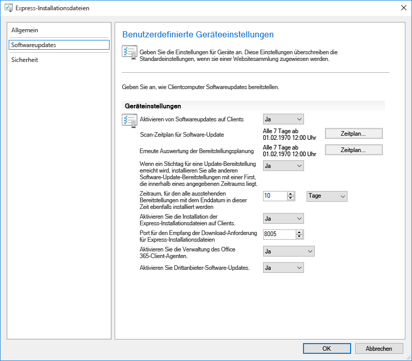
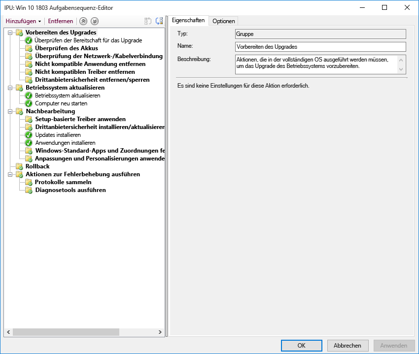

# Schritt 7: Windows und Office als DienstStep 7: Windows and Office Servicing

<table>
<thead>
<td></td>
<td>
<strong>Schritt 7: Windows und Office als Dienst</strong><strong>Step 7: Windows and Office Servicing</strong>

Both Windows 10 and Microsoft 365 Apps for enterprise continually add new capabilities to keep bringing user experiences and security forward with the latest innovations.Both Windows 10 and Microsoft 365 Apps for enterprise continually add new capabilities to keep bringing user experiences and security forward with the latest innovations. Learn how to stay current with semi-annual and monthly updates, how the new servicing model works and the tools and options you have.Learn how to stay current with semi-annual and monthly updates, how the new servicing model works and the tools and options you have.
</td>
<td></td>
</thead>
</table>

>[!NOTE]
>Windows und Office als Dienst ist der siebte Schritt in dem von uns empfohlenen Rad für den Bereitstellungsprozess, der die Planungsaspekte der Vorbereitung auf halbjährliche Updates für Features behandelt.Windows and Office Servicing is the seventh step in our recommended deployment process wheel covering the planning aspects of preparing for semi-annual updates to features. Den vollständigen Desktopbereitstellungsprozess finden Sie im [Desktopbereitstellungscenter](https://aka.ms/HowToShift).To see the full desktop deployment process, visit the [Desktop Deployment Center](https://aka.ms/HowToShift).
>

Sowohl in Windows 10 und als auch in Microsoft 365 Apps for Enterprise werden neue Wartungsoptionen, Supportmodelle und Zeitpläne für Updates eingeführt.Both Windows 10 and Microsoft 365 Apps for enterprise introduce new servicing options, support models, and update timelines. Anhand dieser Änderungen können Sie leichter über die neuesten Features auf dem Laufenden bleiben.These changes simplify the process for staying current on the latest features. Neben diesen Updates gibt es neue Konfigurationsoptionen, die Wartungspläne ermöglichen, die Ihren Anforderungen entsprechen.Along with these updates are new configuration options to enable servicing plans that meet your needs. Erfahren Sie, wie Sie sich auf halbjährliche Kanalupdates mit neuen Features und Funktionen in Windows 10 und Microsoft 365 Apps for Enterprise vorbereiten, während Sie neue Features in Microsoft Endpoint Configuration Manager (Current Branch) nutzen.Let's learn how to prepare for semi-annual channel updates offering new features and capabilities in Windows 10 and Microsoft 365 Apps for enterprise while leveraging new features within Microsoft Endpoint Configuration Manager (Current Branch).

[Unterstützung für Kunden beim Umstieg auf Windows 10 und Microsoft 365 Apps for EnterpriseHelping customers shift to Windows 10 and Microsoft 365 Apps for enterprise](https://www.microsoft.com/microsoft-365/blog/2018/09/06/helping-customers-shift-to-a-modern-desktop/)

## UpdatetypenUpdate Types

Updates werden in zwei Hauptkategorien unterteilt, und zwar Featureupdates und Qualitäts- und Sicherheitsupdates, die kumulierte Sicherheit, Zuverlässigkeit und Fehlerbehebungen enthalten.Updates fall into two main categories, feature updates and then quality and security updates which contain cumulative security, reliability and bug fixes. Im Hinblick auf den Zeitplan stellen sowohl Windows als auch Office einen halbjährlichen Kanal bereit, der zweimal im Jahr im März und September neue Features liefert, während Qualitäts- und Sicherheitsupdates monatlich veröffentlicht werden.In terms of cadence both Windows and Office deliver a semi-annual channel which delivers new features twice per year around March and September while quality and security Updates occur Monthly. Darüber hinaus bieten wir nur für Office 365-Clientanwendungen einen vollständig unterstützten aktuellen Kanal, bei dem Updates sowohl neue Features als auch Qualitätsupdates enthalten.Additionally, unique to Office 365 applications, we offer a fully-supported Current Channel option where updates contain both new features and quality updates.

Wenn Sie sich an einen längeren Zyklus zwischen Updates für Desktopbetriebssysteme und Apps gewöhnt hatten, fragen Sie sich vielleicht Folgendes:If you’re used to a longer cycle between desktop OS and app updates, you might be wondering;

  - Sind die Updates kompatibel?Will the updates be compatible?

  - Muss ich meine Benutzer ständig schulen?Will I need to keep retraining my users?

  - Was sind die Risiken?And what are the risks?

Zur Beantwortung dieser Fragen und zur Darstellung des Grundgedankens der häufigeren Bereitstellung neuer Funktionen werden nachfolgend einige der Vorteile dieses Ansatzes erläutert:To answer those questions and the rationale for delivering new capabilities more frequently, we’ll some of the advantages of this approach

### Vorteile von FeatureupdatesFeature Update Benefits

First, we’ve moved away from the model of the past that would introduce huge waves of change around every three years to now incremental smaller changes with feature updates twice per year.First, we’ve moved away from the model of the past that would introduce huge waves of change around every three years to now incremental smaller changes with feature updates twice per year. Why?Why? With technology trends moving so fast in addition to rapidly evolving security threats, this keeps experiences and protections current.With technology trends moving so fast in addition to rapidly evolving security threats, this keeps experiences and protections current. Some of the security related updates for example can’t just be delivered by monthly security updates or antivirus signature files; they may be low-level changes platform, like virtualization-based security.Some of the security related updates for example can’t just be delivered by monthly security updates or antivirus signature files; they may be low-level changes platform, like virtualization-based security.

[Kurzübersicht für Windows as a serviceQuick guide to Windows as a service](https://docs.microsoft.com/windows/deployment/update/waas-quick-start)

[Risikominimierung mithilfe von Windows 10-SicherheitsfeaturesMitigate threats by using Windows 10 security features](https://docs.microsoft.com/windows/security/threat-protection/overview-of-threat-mitigations-in-windows-10%20%20)

### Vorteile des Modells mit kumulativen UpdatesCumulative Update Model Benefits

Second delivering quality and security updates as a cumulative update package corrects many of the issues of the past.Second delivering quality and security updates as a cumulative update package corrects many of the issues of the past. It used to be that you might pick and choose sometimes from a dozen updates or more each month for both Windows and Office.It used to be that you might pick and choose sometimes from a dozen updates or more each month for both Windows and Office. As you can imagine, this creates a nearly impossible set of test matrices for support.As you can imagine, this creates a nearly impossible set of test matrices for support. Also, if you install a version of Windows or Office that is a year or more old, it might take hours or sometimes days to apply all updates delivered since that version was released.Also, if you install a version of Windows or Office that is a year or more old, it might take hours or sometimes days to apply all updates delivered since that version was released.

With the cumulative model, you’re always one update away from being current and in doing so the number of monthly updates that you need to deploy is reduced.With the cumulative model, you’re always one update away from being current and in doing so the number of monthly updates that you need to deploy is reduced. Each update builds upon updates from previous months and contains all of the fixes that you need to get current.Each update builds upon updates from previous months and contains all of the fixes that you need to get current. Cumulative updates are especially helpful when PCs has been turned off for several months because they are in storage waiting to be reassigned to a different user.Cumulative updates are especially helpful when PCs has been turned off for several months because they are in storage waiting to be reassigned to a different user.

### Erweiterte Überprüfung von UpdatesExpanded Validation of Updates

Ein weiterer Vorteil besteht darin, dass wir vor der Veröffentlichung von Updates für die allgemeine Bereitstellung zunächst Builds über die Insider-Programme für [Office](https://products.office.com/office-insider?tab=Windows-Desktop) und [Windows](https://insider.windows.com/) veröffentlichen, sodass wir Diagnosedaten und Feedback vor der allgemeinen Veröffentlichung von Updates sammeln können.Another advantage is that, before we roll out updates for broad deployment, we first release builds via the Insider programs for [Office](https://products.office.com/office-insider?tab=Windows-Desktop) and [Windows](https://insider.windows.com/), and this allows us to gather diagnostic data and feedback ahead of us releasing updates broadly. Die Insider-Programme sind jetzt für alle verfügbar, Sie können sich also schon mit den Updates vertraut machen.Now the Insider programs are open to everyone so that you can get ahead of understanding the updates. Bis Updates veröffentlicht werden, haben wir Diagnosedaten von Millionen von Konfigurationen erhalten, wenn die Updates schließlich eingeführt werden, ist die Qualität viel besser prognostizierbar.By the time we release updates we will have received diagnostic data from millions of configurations, so when we do roll out updates, quality is now inherently more predictable

Ein weiterer Punkt: Wenn Sie einen halbjährlichen Kanal für Office zur Bereitstellung von Featureupdates zwei mal pro Jahr in Übereinstimmung mit Windows verwenden, können Sie, da die Insider-Builds von Microsoft 365 Apps for Enterprise monatliche Kanalupdates wiedergeben, diese Builds frühzeitig mithilfe der halbjährlichen Enterprise-Kanal (Vorschau) überprüfen.AND one more thing, because Microsoft 365 Apps for enterprise Insider builds reflect monthly channel updates, if you are using semi-annual channel for Office to deliver feature updates twice per year aligned to Windows, you can validate those builds early as well using the Semi-Annual Enterprise Channel (Preview) releases.

### Unterstützen der VerwaltungstoolsSupporting Management Tools

We've also thought through how to make the deployment of updates seamless to you.We've also thought through how to make the deployment of updates seamless to you. Configuration Manager (Current Branch) is updated frequently to support the roll-out of these updates to Windows and Office and any new capabilities.Configuration Manager (Current Branch) is updated frequently to support the roll-out of these updates to Windows and Office and any new capabilities.

[Bereitstellen von Windows 10-Updates mit Configuration ManagerDeploy Windows 10 updates using Configuration Manager](https://docs.microsoft.com/windows/deployment/update/waas-manage-updates-configuration-manager)

[Verwalten von Microsoft 365 Apps for Enterprise mit Configuration ManagerManage Microsoft 365 Apps for enterprise with Configuration Manager](https://docs.microsoft.com/mem/configmgr/sum/deploy-use/manage-office-365-proplus-updates)

## Übersicht über Windows und Office-KanäleOverview of Windows and Office Channels

Windows 10 bietet drei Wartungskanäle:Windows 10 offers three servicing channels:

- Das [**Windows-Insider-Programm**](https://docs.microsoft.com/windows/deployment/update/waas-overview#windows-insider) für Organisationen zum Testen und für Feedback zu Features, die im nächsten Featureupdate veröffentlicht werden.[**Windows Insider Program**](https://docs.microsoft.com/windows/deployment/update/waas-overview#windows-insider) for organizations to test and provide feedback on features shipped in the next feature update
- Der **halbjährliche Kanal** bietet zwei Mal pro Jahr neue Funktionen mit neuen Featureupdates.**Semi-Annual Channel** provides new functionality with Feature Update releases twice per year
- Der **langfristige Wartungskanal** wurde nur für spezielle Geräte entwickelt, die eine längere Wartungsoption benötigen.**Long Term Servicing Channel** is designed only for specialized devices needing a longer servicing option

Microsoft 365 bietet vier Wartungskanäle:Microsoft 365 offers four servicing channels:

- [**Office Insider-Programm** ](https://products.office.com/office-insider) für Organisationen zum Testen und für Feedback zu den neuesten Office-Features und Funktionen, die sich noch in der Entwicklung befinden.[**Office Insider Program**](https://products.office.com/office-insider) for organizations to test and provide feedback on the newest Office features and functionalities still in development
- Der **aktuelle Kanal** stellt Benutzern die neuesten Funktionen von Office bereit, sobald diese verfügbar sind.**Current Channel** to provide users with the newest Office features as soon as they're available
- Der **halbjährliche Enterprise-Kanal** bietet nur zwei Mal pro Jahr neue Funktionen mit neuen Features.**Semi-Annual Enterprise Channel** provides new functionality with new features only twice per year
- Der **halbjährliche Enterprise-Kanal (Vorschau)** ist ein vollständig unterstützter Build von Office, mit dem Pilotbenutzer und Anwendungskompatibilitätstester den nächsten halbjährlichen Enterprise-Kanal testen und überprüfen können.**Semi-Annual Enterprise Channel (Preview)** is a fully supported build of Office that enables pilot users and application compatibility testers to test and validate the next Semi-Annual Enterprise Channel

Ausführliche Informationen zu Windows- und Office-Wartungskanälen finden Sie in der folgenden Dokumentation:For detailed information about Windows and Office servicing channels please review the below documentation:

- [Übersicht über Windows als DienstOverview of Windows as a Service](https://docs.microsoft.com/windows/deployment/update/waas-overview#servicing-channels)
- [Übersicht über die Updatekanäle von Microsoft 365 Apps](https://docs.microsoft.com/DeployOffice/overview-update-channels#BKMK_SAC).[Overview of update channels for Microsoft 365 Apps](https://docs.microsoft.com/DeployOffice/overview-update-channels#BKMK_SAC)

## Phasenweise Bereitstellung von UpdatesPhased Deployment of Updates

Now let’s shift gears to how you will roll out these updates.Now let’s shift gears to how you will roll out these updates. For any release, we recommend at least three deployment phases for IT – validation, piloting and broad production deployment.For any release, we recommend at least three deployment phases for IT – validation, piloting and broad production deployment. Once you’re up and running on Windows 10 and Microsoft 365 Apps for enterprise, you'll use monthly servicing to stay current with critical security and quality updates, then you’ll move to semi-annual servicing for new features.Once you’re up and running on Windows 10 and Microsoft 365 Apps for enterprise, you'll use monthly servicing to stay current with critical security and quality updates, then you’ll move to semi-annual servicing for new features.

### Monatliche UpdatesMonthly Updating

The service model is designed so you can choose to limit the roll-out of new features to twice per year, and if needed you can even skip a semi-annual update and continue receiving quality and security updates.The service model is designed so you can choose to limit the roll-out of new features to twice per year, and if needed you can even skip a semi-annual update and continue receiving quality and security updates. As mentioned, the cumulative nature of monthly updates means each will increase in size per month.As mentioned, the cumulative nature of monthly updates means each will increase in size per month.

#### Express-UpdatesExpress Updates

Using a technology called "Express Updates" in Windows and Binary Delta Compression in Office, we can reduce the download size significantly.Using a technology called "Express Updates" in Windows and Binary Delta Compression in Office, we can reduce the download size significantly. In both approaches, the update engines compare what’s on the PC and finds only the differentials needed to update what’s there.In both approaches, the update engines compare what’s on the PC and finds only the differentials needed to update what’s there.

[Erläuterung von Windows 10-Qualitätsupdates und das Ende von DeltaaktualisierungenWindows 10 quality updates explained & the end of delta updates](https://techcommunity.microsoft.com/t5/Windows-IT-Pro-Blog/Windows-10-quality-updates-explained-amp-the-end-of-delta/ba-p/214426)

Windows Update for Business und Windows Server Update Services haben Express-Updates über einen langen Zeitraum unterstützt. Dieser Support wurde nun auf Microsoft Endpoint Configuration Manager (Current Branch) erweitert, sodass auch hier Express-Updates genutzt werden können.Windows Update for Business and Windows Server Update Services have supported express updates for a long time, but we've now extended that support to Microsoft Endpoint Configuration Manager (Current Branch) so that it can also use Express Updates.

#### Binäre DeltakomprimierungBinary Delta Compression

Binary Delta Compression in Office wird nur verwendet, wenn Sie eine Aktualisierung von der neuesten Version von Microsoft 365 Apps for Enterprise ausführen. Verwenden Sie diesen Ansatz also, wenn Sie eine Aktualisierung vom vorherigen Build ausführen müssen und keine Updates überspringen können.Binary Delta Compression in Office is only used if you're updating from the most recent version of Microsoft 365 Apps for enterprise-- so to use this approach you need to be updating from the previous build and can’t skip updates.

Windows and Office update channels can be managed via Configuration Manager using the standard approval and targeting process.Windows and Office update channels can be managed via Configuration Manager using the standard approval and targeting process. Additionally, you can use policy settings in Office and Windows to enforce update channels used, as well as related settings.Additionally, you can use policy settings in Office and Windows to enforce update channels used, as well as related settings.

### Halbjährliche UpdatesSemi-Annual Updates

Da Sie nun die Überlegungen für monatliche Updates kennen, fahren wir mit den größeren, halbjährlichen Updates fort.So those are your considerations for monthly updates, now let’s move to the larger, semi-annual updates.

Wie bei der Geräte- und App-Bereitschaft behandelt, sollten Sie zur Vorbereitung auf diese größeren Updates die gleichen Bereitschaftstools verwenden, die in Schritt 1 des Bereitstellungsprozesses eingerichtet wurden.As we covered in Device and App Readiness, you’ll want to begin your preparation for these larger updates using the same readiness tools we set up in Step 1 of the deployment process wheel.

As for tooling, you can use policy settings with Windows Update for Business, software update management via Microsoft Endpoint Configuration Manager (Current Branch), Windows Server Update Services (WSUS), or update policies set by Microsoft Intune.As for tooling, you can use policy settings with Windows Update for Business, software update management via Microsoft Endpoint Configuration Manager (Current Branch), Windows Server Update Services (WSUS), or update policies set by Microsoft Intune. If you are concerned about network bandwidth, see Step 2: Directory and Network Readiness, to learn about your options to reduce network traffic via Delivery Optimization and other peer to peer caching technologies.If you are concerned about network bandwidth, see Step 2: Directory and Network Readiness, to learn about your options to reduce network traffic via Delivery Optimization and other peer to peer caching technologies.

[Halbjährlicher Kanal in WindowsWindows Semi-Annual Channel](https://docs.microsoft.com/windows/deployment/update/waas-overview#semi-annual-channel)

[Halbjährlicher Enterprise-Kanal für Microsoft 365-AppsSemi-Annual Enterprise Channel for Microsoft 365 Apps](https://docs.microsoft.com/DeployOffice/overview-update-channels#BKMK_SAC)

#### Aufgabensequenzen bei UpgradesUpgrade Task Sequences

Das Installieren der größeren Featureupdates über standardmäßige Routinen der Softwareupdateverwaltung ist eine unterstützte Option, aber viele Organisationen verwenden lieber eine Upgradeaufgabensequenz mit Microsoft Endpoint Configuration Manager (Current Branch) oder das Microsoft Deployment Toolkit.Installing the larger feature updates via standard software update management routines is a supported option, but many organizations will opt to use an Upgrade Task Sequence with Microsoft Endpoint Configuration Manager (Current Branch) or the Microsoft Deployment Toolkit.

Mit einer Aufgabensequenz können Sie benutzerdefinierte Prüfungen oder Aufgaben VOR der Installation der Featureupdates erstellen und benutzerdefinierte Aufgaben ausführen, NACHDEM die Installation des Updates selbst abgeschlossen wurde – Aufgaben nach der Aktualisierung beinhalten möglicherweise das vorübergehende Aussetzen von Diensten, wenn dies während des Updates, der Treiberinstallation und des Treiberaustauschs, während Anwendungsupgrades oder Personalisierungseinstellungen für die Taskleiste und Windows 10-Start erforderlich ist.A Task Sequence allows you to create custom checks or tasks BEFORE to the installing the Feature Update and allows you to perform custom tasks AFTER the update installation itself has completed – post-update tasks might include temporarily suspending services if needed during the update, driver installation and replacement, application upgrades or taskbar and Windows 10 Start personalization settings.

If you’re already using task sequences to migrate your Windows 7 machines to Windows 10 and are well-versed with those tools, this is a great place to start and provides ultimate control.If you’re already using task sequences to migrate your Windows 7 machines to Windows 10 and are well-versed with those tools, this is a great place to start and provides ultimate control. While you can use a single task sequence for the entire upgrade, it is quite common that organizations use two task sequences.While you can use a single task sequence for the entire upgrade, it is quite common that organizations use two task sequences. One task sequence for making sure the machines are ready for the upgrade, that silently pre-stages all the required setup files on target computers, and one to do the actual upgrade.One task sequence for making sure the machines are ready for the upgrade, that silently pre-stages all the required setup files on target computers, and one to do the actual upgrade. This approach ensures that your user productivity is less impacted.This approach ensures that your user productivity is less impacted.

[Erstellen einer Aufgabensequenz für ein Betriebssystemupgrade in Configuration ManagerCreate a task sequence to upgrade an OS in Configuration Manager](https://docs.microsoft.com/mem/configmgr/osd/deploy-use/create-a-task-sequence-to-upgrade-an-operating-system)

#### Halbjährliche Kanalunterstützung für FeatureupdatesSemi-annual channel support for feature updates

[Wie im September 2018 angekündigt](https://www.microsoft.com/microsoft-365/blog/2018/09/06/helping-customers-shift-to-a-modern-desktop/), wird für die Supportzeitskala für halbjährliche Kanalupdates das folgende Modell verwendet.[As announced in September 2018](https://www.microsoft.com/microsoft-365/blog/2018/09/06/helping-customers-shift-to-a-modern-desktop/), support timeline for semi-annual channel updates will use the following model.

  - Alle derzeit unterstützten Featureupdates von Windows 10 Enterprise und Education werden ab Version 1607 30 Monate ab dem ursprünglichen Veröffentlichungsdatum unterstützt.All currently supported feature updates of Windows 10 Enterprise and Education, starting with version 1607, will be supported for 30 months from their original release date.

  - Alle zukünftigen Featureupdates (ab Version 1809) mit dem Ziel September werden 30 Monate ab dem Tag ihrer Veröffentlichung unterstützt.All future feature updates, starting with 1809, with a targeting September will be supported for 30 months from their release date.

  - Zukünftige Featuresupdates (ab Version 1903), die auf März abzielen, werden weiterhin 18 Monate ab dem Tag ihrer Veröffentlichung unterstützt.Future feature updates targeting March and starting with 1903 will continue to be supported for 18 months from their release date.

  - Halbjährliche Updates für Microsoft 365 Apps for Enterprise weiterhin 18 Monate lang unterstützt.Microsoft 365 Apps for enterprise semi-annual updates continue to be supported for 18 months

#### Weitere Setup-Automatisierungsoptionen außerhalb von AufgabensequenzenAdditional setup automation options outside of task sequences

Wenn Sie keine Upgradeaufgabensequenzen verwenden, können Sie nun benutzerdefinierte Aktionen ausführen oder Treiberdateien während Featureupdates in der Phase vor der Installation anwenden – bevor Setup die Kompatibilitätsprüfungen ausführt – oder in der Phase vor dem Commit – bevor das Upgrade angewendet wird.If you don’t use Upgrade Task Sequences, you can now run custom actions or apply driver files during feature updates in the Pre-install phase – before setup runs its compatibility checks – or in the pre-commit phase – before the upgrade is applied.

[Neuigkeiten im Windows 10-Setup, Version 1803What's new in Windows 10 setup, version 1803](https://docs.microsoft.com/windows/whats-new/whats-new-windows-10-version-1803%23windows-setup)

## Nächster SchrittNext Step 

## [Schritt 8: Benutzerkommunikation und SchulungStep 8: User Communications and Training](https://aka.ms/mdd8)

## Vorheriger SchrittPrevious Step 

## [Schritt 6: Bereitstellung des Betriebssystems und FeatureupdatesStep 6 OS Deployment and Feature Updates](https://aka.ms/mdd6)
